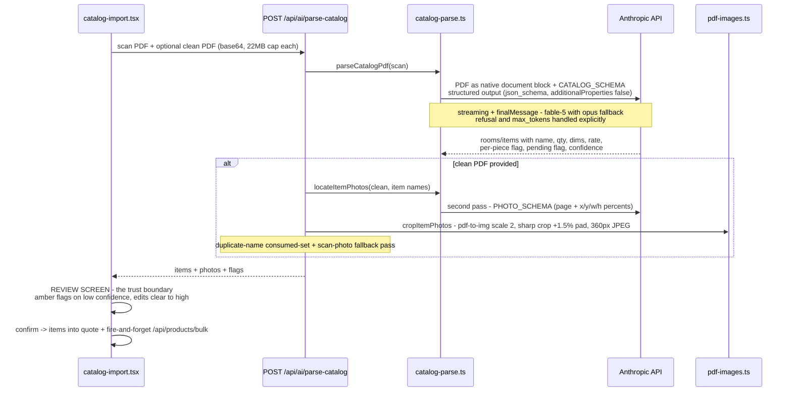

# AI layer — what's actually running today

The honest inventory of AI in the ecosystem: **quotations has the production AI integration; photoshoot currently consumes AI outputs but runs no model calls itself; MapleLens is a separate consumer AI app.** The [maple-ai gateway](aws-deployment.html) (planned, step ③ of [platform-architecture.html](platform-architecture.html)) will consolidate all of this — its design is essentially "extract what quotations already proved."

## Quotations — the production integration

**Use case:** parse scanned furniture catalogs — including *handwritten* rate sheets — into structured quote items, with photos. Two-PDF mode: a scan carrying the rates + an optional clean client PDF for photo crops.

### Models & routing (`src/lib/settings.ts`, `src/lib/catalog-parse.ts`)

| Setting | Value | Notes |
|---|---|---|
| Default model | `claude-fable-5` | admin-selectable: fable-5 · opus-4-8 · sonnet-5 · haiku-4.5 |
| Fallback | server-side: `betas: ["server-side-fallback-2026-06-01"]`, `fallbacks: [{model: "claude-opus-4-8"}]` | applied only when the configured model is exactly fable-5 |
| Key resolution | DB setting → env `ANTHROPIC_API_KEY` → none | DB value stored **AES-256-GCM encrypted**, key derived from `AUTH_SECRET`; masked in the settings UI |
| Cost observed | ~₹8–10 per parsed page on fable-5 | the gateway's spend log will make this per-tenant |

### The pipeline (traced, in production)

### Prompt & schema conventions that make it work (SYSTEM_PROMPT)
- Domain notation taught explicitly: **"85K" = ₹85,000**, **"18K per pc"** multiplies by quantity, crossed-out prices mean take the replacement, "Pending" items are flagged not priced.
- **Never guess:** ambiguous rates come back `pending: true` + `confidence: "low"` instead of invented numbers — verified against real scans where every legible rate parsed correctly and every ambiguous one was flagged.
- Structured outputs (`output_config.format: json_schema`) mean no JSON-repair parsing — the API enforces the shape.

### Operational limits
22MB per PDF (base64 ×4/3 must stay under the 32MB API limit) · `maxDuration = 600` on the route (needs proxy timeout ≥ 10 min at deploy — noted in the runbook) · photo-crop failures degrade to items-without-images, never fail the parse · `/api/products/bulk` runs after import so library growth can't block a quote.

## Photoshoot — consumes AI, doesn't call it (yet)

- The live flow (`/api/shoots/*`) manages shoots and **imports finished videos by URL or upload** — the actual generation runs in an external pipeline today.
- The `internal01` generation wizard (MapleLens DNA: templates/slots) is **fully orphaned**: it calls `/api/internal01/{generate-slot,create-generation,download-zip}` which don't exist in the repo, and its Supabase deps have no env wiring. It cannot run — see [module-photoshoot.md](module-photoshoot.html). Reviving it = building those routes against the gateway, not Supabase.
- `poster.ts` (ffmpeg first-frame extraction) is media processing, not AI.

## MapleLens — the separate consumer engine
Next.js app (`MapleLens` repo — not part of maple-tools): a phone photo of furniture → catalog-ready studio or lifestyle image, three generation modes, sold to Indian furniture makers and showrooms; Supabase-backed. It shares the *approach* (vision models, tuned prompts), not code — though its template-generation tooling is the visible ancestor of photoshoot's (currently orphaned) `internal01` wizard, and the source of that repo's Supabase remnants. Its signups are future suite Leads ([platform-architecture.html](platform-architecture.html)).

## Where this is going — the gateway (build order step ③)

Everything above is why the gateway design is low-risk: **the hard parts are already in production in quotations.** v1 = lift `runVisionRequest`, settings encryption, and the schema conventions into a service with:
`POST /v1/parse-catalog` · `POST /v1/locate-photos` · `POST /v1/generate` (photoshoot, future) · per-tenant spend log (`AiRequest` in [er-platform.html](er-platform.html), which stamps `promptVersion` per call — the corrections loop below is only trainable if every output is attributable to an exact prompt + model pair) · budgets · model routes. Modules keep their review screens (the trust boundary stays in the module); the gateway owns keys, models, and money. Then the corrections captured at review screens become the fine-tuning dataset — the loop in [aws-deployment.html §5](aws-deployment.html).

*Learning resources for this layer: the AI track in [learning-path.html](learning-path.html).*
