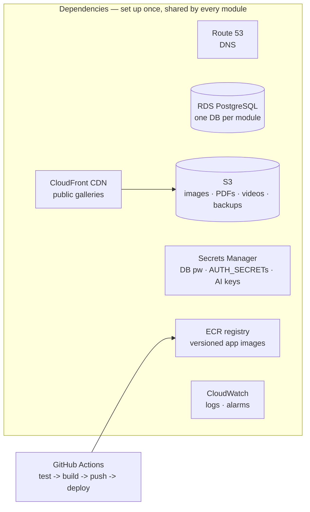
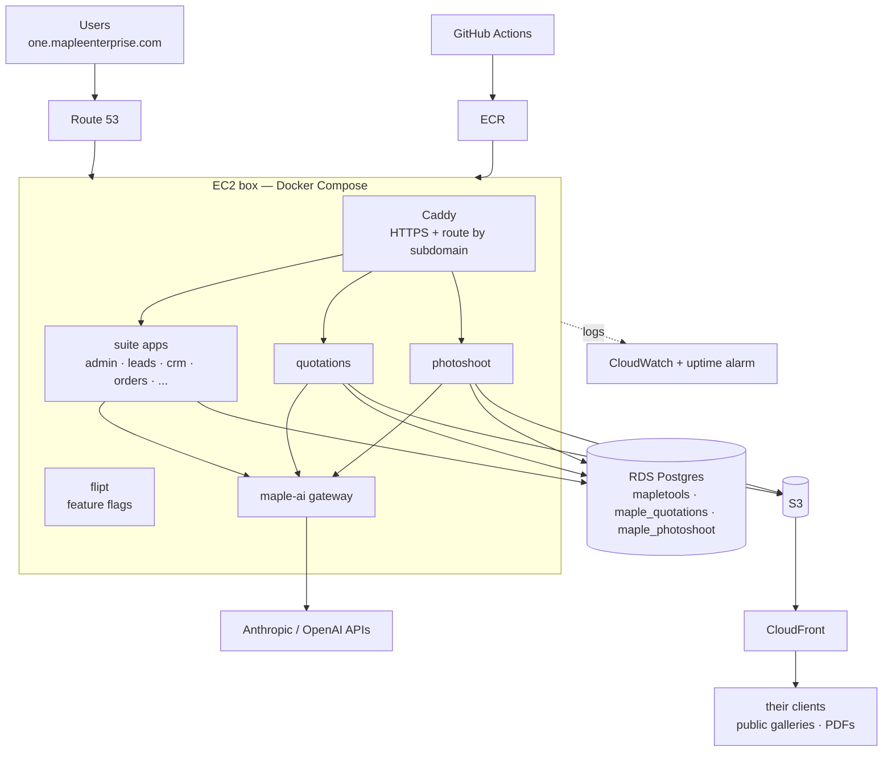
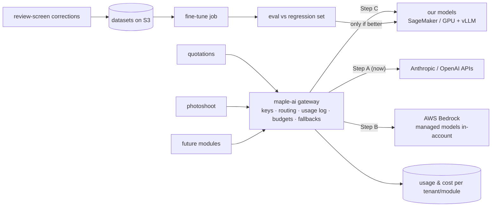

# MapleOne on AWS — deployment & operations plan

*Written for a non-DevOps reader. Every AWS service is introduced as "what it is / why we pay for it." Builds on `MAPLE-ECOSYSTEM-PLAN.md` and `AWS-RUNBOOK-PHASE2.md` (the click-by-click for Phase 1) and the standalone repos proven locally: `maple-quotations` and `maple-photoshoot`.*

---

## 0. The one-paragraph version

We host the **dependencies** (database, file storage, secrets, image registry, DNS) as managed AWS services first — those are the things that must never be lost and are cheap to have AWS babysit. The **modules** (quotations, photoshoot, and everything after) are containers that all follow one identical contract, so deploying module #7 is the same motion as module #2. We grow in three phases — one box → managed dependencies → one service per module — and never skip a phase until the current one hurts. The **AI layer** follows its own three-step track: one internal AI gateway holding today's API keys → managed models inside AWS (Bedrock) → our own fine-tuned models on GPU, and the gateway means modules never notice which step we're on.

## 1. Principles

1. **Boring infrastructure.** Fewest moving parts that can serve Maple Enterprise reliably. No Kubernetes until a human being is hired to run it.
2. **Dependencies managed, apps disposable.** The database and files are precious — AWS manages them. App containers are cattle: any of them can be killed and redeployed in a minute.
3. **One contract for every module.** If quotations and photoshoot deploy the same way, so will invoices, orders, and anything we build in 2027.
4. **The AI gateway is the only door to AI.** Modules never hold API keys or pick models; they call our gateway. That's what makes "swap in our own model later" a config change instead of a rewrite.
5. **Never skip a phase.** Each phase is triggered by a real pain, not by ambition.

## 2. Host the dependencies first

These are set up **once**, before any module. In order:

| # | Dependency | AWS service | What it is (layman) | Why first |
|---|------------|-------------|---------------------|-----------|
| 1 | DNS | **Route 53** | The phone book: `one.mapleenterprise.com` → our server | Everything else hangs off domains |
| 2 | Private network | **VPC** (default) | A fenced yard for our machines; database not reachable from the internet | Security boundary for all that follows |
| 3 | Database | **RDS PostgreSQL** | Postgres that AWS runs: automatic daily backups, patching, restore button | The one thing we can never lose. One instance, **one database per module** (`mapletools`, `maple_quotations`, `maple_photoshoot`) — same separation we proved locally. The instance's connection ceiling is shared by all of them: cap every module's Prisma pool (`connection_limit=3` — Phase 2 below, math in [infra-containers.md](infra-containers.html) §2.1) |
| 4 | File storage | **S3** | An infinite disk for files: product images, lookbook PDFs, shoot videos, DB dumps | Gets binaries out of Postgres (today quotations stores images as DB bytes — acknowledged as temporary) and off the box's small disk |
| 5 | Media delivery | **CloudFront** | A CDN: clients in Jaipur load videos from a server near Jaipur, not our box | Photoshoot's public galleries are the bandwidth-heavy path |
| 6 | Secrets | **Secrets Manager** (or SSM Parameter Store, cheaper) | A safe for passwords: DB password, `AUTH_SECRET`s, AI keys. Apps fetch at boot; humans never paste keys into servers | Kills key-sprawl before it starts |
| 7 | Image registry | **ECR** | A shelf of ready-to-run app versions ("quotations v1.4.2") | Today the box builds code itself (slow, risky). Registry = instant deploys and instant rollback |
| 8 | Monitoring | **CloudWatch** + **UptimeRobot** (free plan is non-commercial-only; ~$9/mo Solo once a client pays — [infra-observability.md](infra-observability.html) §6) | Graphs, logs, and a phone alarm when the site is down | You want to know before the client calls |
| 9 | CI/CD | **GitHub Actions** (already exists: `ci.yml`, `deploy-prod.yml`) | The robot that tests and ships every push | Extend to build → push to ECR → deploy |

## 3. What "a module is a microservice" means here

Every module — quotations, photoshoot, and each future one — ships as a container satisfying the same contract (this is exactly what the two standalone repos already look like):

- **One image** in ECR, versioned (`maple/quotations:1.4.2`)
- **Own database** on the shared RDS instance (own schema, own migrations)
- **Own `AUTH_SECRET`** standalone, or the shared one when sold as part of the suite (SSO) — a two-env-var switch, already built
- **Env-only config** — everything from Secrets Manager / env vars, nothing baked in
- **Health endpoint** (`/api/health`) so the platform can auto-restart it *(to add — trivial)*
- **Public/private route split** declared in its middleware (proven pattern: `/login`, `/s/<token>`, `/api/public/*`)
- **Files on S3** via the storage lib (`CATALOG_STORAGE` abstraction already exists in photoshoot; quotations' asset lib needs the S3 driver)
- **Events** via the OutboxEvent pattern for cross-module integration (model exists; dispatcher is on the fold-in list)
- **AI only via the gateway** (§5)

A new module that satisfies the contract gets: a subdomain, a database, a dashboard row, and a deploy pipeline — in an afternoon.

## 4. The three hosting phases

### Phase 1 — one box (exists today, documented in AWS-RUNBOOK-PHASE2)
Everything — Caddy, all app containers, Postgres — on one Lightsail/EC2 box via Docker Compose. **Good for:** Maple Furnishers internal use, demos. **Cost:** ~₹2–4k/mo. **Leave when:** a real client signs, or the box dying would be a business problem (they're the same moment).

### Phase 2 — managed dependencies, apps still on the box (the Maple Enterprise go-live shape)
Set up §2, then point the box at them: apps stay in Compose on EC2 (`t3.large`-ish), but data moves to RDS, files to S3+CloudFront, secrets to Secrets Manager, images pulled from ECR.

**Why this shape for the first client:** one box is still enough compute; what changes is that *nothing precious lives on it anymore*. Box dies → new box + `docker compose up` → back in ~30 minutes with zero data loss. One arithmetic must move to RDS with the data: the instance has **one shared `max_connections` ceiling across all module databases** (a `db.t4g.small` derives roughly 170–225 from memory), and 18 Prisma apps at the default pool of 5 each idle at 90 connections before a migration or a debugging `psql` takes theirs — so every `DATABASE_URL` ships with `?connection_limit=3&pool_timeout=20` (full math in [infra-containers.md](infra-containers.html) §2.1; wired in [deployment-runbook.md](deployment-runbook.html) Stage 3). **Cost:** ~₹8–15k/mo all-in. **Leave when:** two things contend for the same box (a video render slows quote PDFs), or customer #3 arrives.

### Phase 3 — one service per module (true microservices) + white-label fleet
Move containers to **ECS Fargate** (AWS runs containers directly; no server to patch — you say "run 2 copies of quotations", AWS obeys). An **ALB** (managed traffic cop) replaces Caddy, routing by hostname. Each module scales, deploys, and fails independently.

White-label options, both supported by the same images:
- **Instance-per-customer** (start here): one small stack per customer — highest isolation, easiest to price, matches the Tenant model
- **Shared multi-tenant**: one deployment, tenants resolved by domain (`getBrand()`/`tenantDb()` already built) — switch when instance count hurts

**Cost:** roughly ₹4–8k per always-on service per month at small scale — this phase costs real money, which is why a paying fleet triggers it, not enthusiasm.

## 5. The AI layer — from API keys to our own models

**Step A — the AI gateway (build now, ~a week).** One small internal service, `maple-ai`. Modules POST "parse this catalog" / "generate this shot"; the gateway holds the keys (from Secrets Manager), picks the model, calls Claude/OpenAI, logs **who spent what** (tenant, module, tokens, ₹) into its own DB, applies per-tenant budgets, and handles fallbacks (already proven in quotations: fable-5 → opus-4-8). *This is the single most important AI decision in the plan: modules stop knowing about vendors and keys forever.* The quotations AI code (streaming, structured outputs, PDF blocks, encrypted per-tenant keys) becomes the gateway's core.

**Step B — managed models inside AWS (when a client demands data residency, or ops maturity).** **Bedrock** = the same foundation models served by AWS inside our account/region — no keys to third parties, IAM auth, India-region options, per-request pricing. A gateway config change; modules unchanged.

**Step C — our own models (when volume or specialization justifies it).**
- **Inference:** open models (vision + text) served on GPU — either **SageMaker endpoints** (managed, dial to zero off-hours) or **EC2 GPU + vLLM** (cheaper flat-rate at sustained volume). The gateway routes per use-case: handwriting-rate-parsing might go to our tuned model while proposal prose stays on Claude.
- **Fine-tuning loop (the real moat):** every catalog parse the team *corrects* in the review screen is a labeled training pair. Pipeline: corrections captured → dataset versioned in S3 → LoRA fine-tune job (SageMaker training / rented GPU) → **eval harness runs the regression set** (real scanned catalogs with known answers — R-suite style) → only models that beat the incumbent get registered → gateway flips a routing entry. Roll back = flip it back.
- **Honest economics:** a 24×7 GPU box is ~₹50k–1.5L/month. At today's volume (~₹8–10/page on Fable 5), APIs win by a mile. Step C triggers on **volume** (AI bill > GPU rent), **specialization** (tuned small model beats frontier on our niche), or **data promises** to enterprise clients. The gateway's spend log is exactly the evidence for that decision.

## 6. Maintaining it (the honest weekly reality)

| Concern | What we do | Effort |
|---|---|---|
| Backups | RDS automated daily (7–30d retention) + S3 versioning + monthly `pg_dump` to S3 + nightly tar of the Caddy cert volume (`caddy_data`) to the same bucket — a rebuilt box without it re-issues ~20 subdomains of certificates straight into Let's Encrypt rate limits ([deployment-runbook.md](deployment-runbook.html) Stage 4). **Quarterly restore drill** — an untested backup is a rumour | ~1h/quarter |
| Monitoring | UptimeRobot on every public domain → phone; CloudWatch alarms: CPU, disk, RDS storage, 5xx spikes; AI gateway daily ₹ report | set up once |
| Updates | Actions deploys on merge to `main`; `develop` → stage box first (already in git workflow); OS patches monthly (`apt upgrade` or Fargate = nobody patches). Box clock stays **UTC** with NTP on — every cron in the runbook is written in UTC, and mixed clocks are how "nightly" jobs land mid-business-day | ~1h/month |
| Secrets | Rotate DB password + `AUTH_SECRET`s + AI keys every 6 months; kill unused keys | ~1h/6mo |
| Security | RDS/S3 private by default; SSH by key + IP allowlist; MFA on AWS root; the RBAC gaps already found (roles API escalation) fixed **before** any external customer. Any team departure = same-day offboarding: key out of `authorized_keys` on every box, shared deploy key rotated, IP out of `ssh-sg`, IAM user disabled ([deployment-runbook.md](deployment-runbook.html) Stage 7) | one-time + habits |
| Costs | Billing alert at 2× expected; monthly 10-minute review of the AI spend log | 10 min/mo |
| Runbook | "Box died / DB slow / deploy broke / roll back" — one page per scenario, tested during the restore drill | write once |

## 7. Suggested rollout order (each step is a working system)

1. **Now:** Phase 1 box live for Maple Furnishers (runbook exists) + start the **AI gateway** as one more compose service
2. **Before Maple Enterprise onboards:** Phase 2 dependencies (RDS → S3 → Secrets → ECR, in that order), restore drill passed, RBAC fixes shipped, health endpoints added
3. **Go-live:** their branding row, their domains, seeded users, UptimeRobot on their domains
4. **After 2–3 stable months / customer #3:** first module to Fargate (photoshoot — it's the bursty one), then the rest
5. **When the spend log says so:** Bedrock, then own models per §5

---

*Related docs: [deployment-runbook.md](deployment-runbook.html) (the step-by-step execution of this plan) · [learning-path.md](learning-path.html) (what to learn before each stage, AWS + AI) · `er-suite.md`, `er-quotations.md` (data models) · `er-platform.md` (proposed platform/AI tables) · `deps-graph.md` (module boundaries) · `event-catalog.md` (integration events) · `cicd-pipeline.md` (what ships how) · `rbac-matrix.md` (access control + gaps to fix pre-launch) · infrastructure deep-dives that build on this plan: [infra-aws-services.md](infra-aws-services.html) · [infra-events.md](infra-events.html) · [infra-caching.md](infra-caching.html) · [infra-containers.md](infra-containers.html) · [infra-observability.md](infra-observability.html).*
