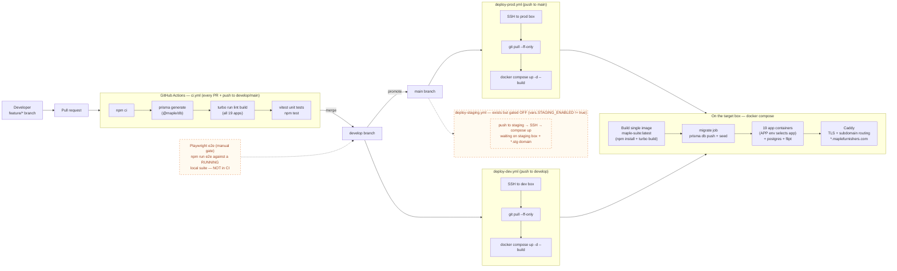

# CI/CD pipeline

The pipeline as it actually exists, verified against `.github/workflows/*`,
`Dockerfile`, `docker-compose.yml`, `playwright.config.ts`, `vitest.config.ts`,
root `package.json`, `DEVELOPMENT.md` and `TESTING.md` (2026-07).

## Sources of truth

| File | What it defines |
| --- | --- |
| `.github/workflows/ci.yml` | CI on every PR and on push to `main` / `develop`: `npm ci` → `prisma generate` (`@maple/db`) → `npx turbo run lint build` → `npm test` (Vitest). |
| `.github/workflows/deploy-dev.yml` | On push to `develop`: SSH to the dev box (`appleboy/ssh-action`, GitHub Environment `dev`), `git pull --ff-only`, `docker compose up -d --build`, `docker image prune -f`. |
| `.github/workflows/deploy-prod.yml` | Same script on push to `main`, Environment `prod`. |
| `.github/workflows/deploy-staging.yml` | Same script on push to `staging` / manual dispatch — **gated OFF** by `if: vars.STAGING_ENABLED == 'true'` until a staging box + `*.stg.maplefurnishers.com` exist. |
| `Dockerfile` | One image for the whole suite: `node:22-bookworm-slim`, `npm install && npm run build` (turbo builds every app), `CMD` starts `@maple/app-${APP}` on port 3000. Installs `serve` for the static `apps/web` site. |
| `docker-compose.yml` | `postgres:16`, a one-shot **`migrate`** job (`npm run -w @maple/db push && seed`), one service per app all sharing the `maple-suite:latest` image (selected via `APP` env), `flipt` (feature flags), `caddy` (TLS + per-subdomain reverse proxy). App services `depends_on: [postgres, migrate]`. |
| `vitest.config.ts` | Unit/component tests: `packages/**/*.test.{ts,tsx}` + `apps/**/*.test.{ts,tsx}`, node env + jsdom opt-in. Runs in CI via `npm test`. |
| `playwright.config.ts` | E2E smoke tests in `e2e/` against a **running local suite** (`bash scripts/dev.sh` + Caddy, `E2E_BASE` defaults to `https://admin.maplefurnishers.com`). Explicitly **not part of CI** — CI has no live stack. |

Branch flow (per `DEVELOPMENT.md` / `GIT-WORKFLOW.md`): `feature/*` → PR into
`develop` (auto-deploys dev) → `main` (auto-deploys prod).

## Pipeline

## What the gates actually are (honest summary)

**Exists and runs automatically:**
- Lint + full turbo build of all apps on every PR and push to `develop`/`main` (`ci.yml`).
- Vitest unit/component tests in CI (`npm test`; e.g. `rbac.test.ts`, `session.test.ts`, `utils.test.ts`, `button.test.tsx` in `@maple/core`).
- Auto-deploy: `develop` → dev box, `main` → prod box (SSH + compose rebuild).
- Schema migration on every deploy via the compose `migrate` one-shot job (`prisma db push` + seed — note: `db push`, not versioned `migrate deploy`, even though `@maple/db` has a `migrate` script).

**Exists but is manual / gated:**
- Playwright e2e (`e2e/login.spec.ts`): run locally against a live stack with `npm run e2e`. Not wired into any workflow.
- Staging deploy workflow: committed but disabled until `STAGING_ENABLED=true` and a staging environment exist.

**Does not exist (do not assume it does):**
- No e2e in CI, no image registry (images are built on the target box), no
  rollback automation beyond `git checkout` of an older commit, no
  smoke-test/health-check step after `compose up`.
