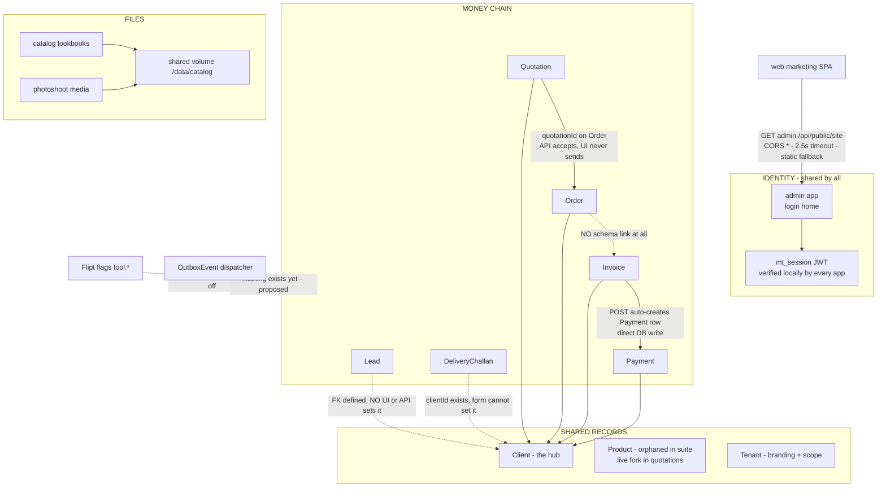
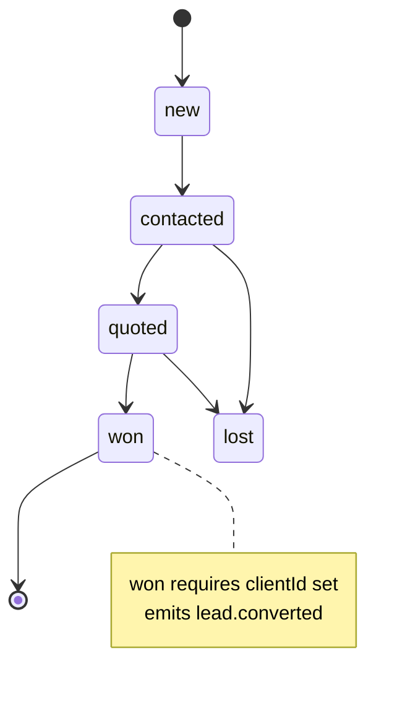
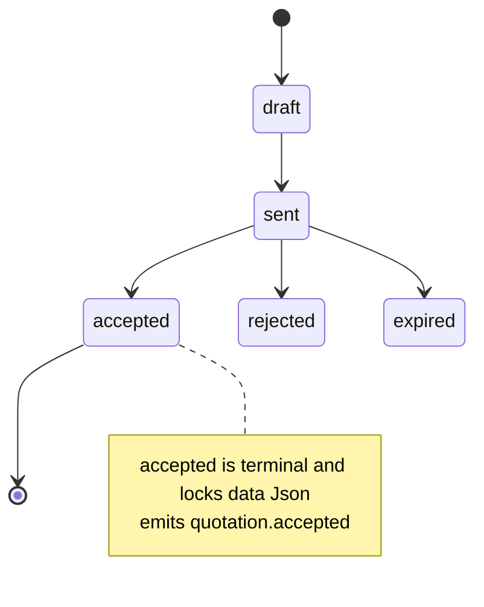
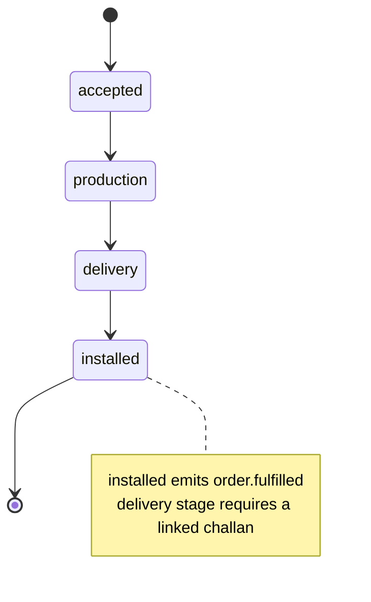
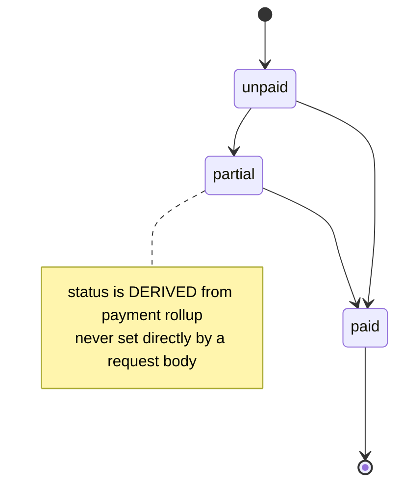

# Cross-module integration — the bible

The definitive reference for how MapleOne modules talk to each other: what is **verified working today**, what is **defined but broken**, and the **full target design** (contracts, state machines, events, delivery infrastructure) for making the money chain real. The one-line summary has not changed: modules share identity, tenancy, and a handful of core records; the money chain is only *partially* linked in the schema; and there is **zero event-driven integration yet** — every handoff is a human re-entering data. Each [module page](module-quotations.html) carries per-app detail; this page owns everything that crosses an app boundary.

How to read this page: sections 1–3 describe the **current honest state** (all claims verified in code, file paths given). Section 4 onward is the **target design** — written to be implementable directly, but nothing in it exists yet unless explicitly marked.

---

## 1 · The integration map



Legend: solid = works today · dotted = defined-but-broken, unreachable, or proposed.

The eight verified findings this map encodes (each expanded in its section):

| # | Finding | Where verified | Section |
|---|---|---|---|
| 1 | **Order → Invoice has no schema link at all** — not even a column | `packages/db/prisma/schema.prisma` `Invoice` model (no `orderId`) | §4.4 |
| 2 | **Lead → Client conversion does not exist** — `Lead.clientId` FK defined, no UI or endpoint sets it | schema + `apps/leads/app/api/leads/route.ts` (POST never touches `clientId`) | §4.2 |
| 3 | **Challan is unlinked** — `clientId` exists but the create route never accepts it; no `orderId`/`invoiceId` columns | `apps/challans/app/api/challans/route.ts` POST data block | §4.6 |
| 4 | **CRM activity counts omit payments and challans** — `_count` selects only leads/orders/invoices/quotations | `apps/crm/app/api/crm/route.ts` GET | §3.1 |
| 5 | **Product exists twice** — suite model no app reads or writes; live fork in maple-quotations | schema + repo-wide grep; [foldin-map.html](foldin-map.html) | §3.2 |
| 6 | **Flipt flags gate pages only** — root-layout check; disabled module's APIs stay fully reachable | `packages/core/src/lib/flags.ts` + app layouts | §2.6 |
| 7 | **The docs app is entirely public** — no `middleware.ts` (verified: every other app has one; docs and web do not) | `find apps -name middleware.ts` | §2.5 |
| 8 | **The web SPA silently drops CMS `richtext` blocks** — its block renderer has no case for the type | `apps/web/src/site/` (no `richtext` handler anywhere in `src`) | §3.5 |

---

## 2 · Identity & tenancy contracts

The one integration layer that genuinely works. Every app depends on it; this section is the contract every module MAY rely on — and the exact edges it may NOT.

### 2.1 The JWT claim schema (exact, from `packages/core/src/lib/session.ts`)

One `mt_session` JWT, signed **jose HS256** with the shared `AUTH_SECRET`, issued only by the **admin** app's `POST /api/auth/login`, verified **locally** by every app — no runtime auth calls, ever ([seq-sso-login.html](seq-sso-login.html)).

```json
{
  "header": { "alg": "HS256" },
  "payload": {
    "sub": "cuid — User.id",
    "name": "Aditya",
    "email": "aditya@maple.example",
    "role": "admin",
    "perms": ["leads.read", "leads.write", "quotations.read", "..."],
    "tid": "cuid — Tenant.id, or null when User.tenantId is null (signSession always includes the claim)",
    "iat": 1752700000,
    "exp": 1753304800
  }
}
```

`verifySession()` maps this back to `SessionUser { id, name, email, role, perms[], tenantId | null }`, tolerating a null or missing `tid` (→ `null`) and a non-array `perms` (→ `[]`).

### 2.2 Cookie parameters (from `sessionCookieOptions`)

| Attribute | Value | Note |
|---|---|---|
| Name | `mt_session` | constant `COOKIE` |
| `httpOnly` | `true` | JS never reads it |
| `sameSite` | `lax` | top-level nav between subdomains carries it |
| `secure` | `true` in production only | |
| `path` | `/` | |
| `domain` | `COOKIE_DOMAIN` env — `.mf.com` in prod, **unset (host-only) in dev** | this is the entire SSO mechanism |
| `maxAge` | `604800` (7 days) — matches JWT `exp` | |

### 2.3 safeNext rules (from `packages/core/src/lib/sso.ts`)

Post-login redirect targets pass `safeNext(next, fallback = "/")`:

1. Empty/null → fallback.
2. Relative path accepted iff it starts with `/` **and not `//`** (protocol-relative URLs rejected).
3. Absolute URL accepted iff `http:`/`https:` **and** hostname is `localhost` or ends with `SSO_DOMAIN` (default `.mf.com`).
4. Anything else (bad URL, other scheme, other host) → fallback. Prevents open redirects from a crafted `?next=`.

Edge worth knowing: the suffix check is `endsWith(".mf.com")` — a hostname like `evil-mf.com` fails (no dot boundary issue since the suffix includes the leading dot), but `anything.mf.com` passes, so **every subdomain is trusted equally**. A compromised low-value app is a valid redirect target.

### 2.4 tenantDb guarantees — and the upsert edge

`tenantDb()` (`packages/core/src/lib/tenant-db.ts`) returns a Prisma client extended over 21 SCOPED models. What it **guarantees**:

- `findMany` / `findFirst` / `count` — `where` is merged with `{ tenantId }`.
- `updateMany` / `deleteMany` — same merge.
- `create` — stamps `data.tenantId` (single-object create only, not arrays).

What it does **NOT** intercept — the edges every module must code around:

- **`upsert` passes through completely unscoped.** Verified consequence: both `apps/quotations/app/api/quotations/route.ts` and `apps/invoices/app/api/invoices/route.ts` POST via `upsert({ where: { number } })`, and `number` is **globally** `@unique` — not `@@unique([tenantId, number])`. A tenant-A user saving a number that already exists under tenant B **updates tenant B's row**, and the `create` branch inserts with `tenantId` NULL (the extension's create hook does not fire inside upsert). The standalone maple-quotations repo added a scoped `findFirst` collision check before saving (see [cross-module.html](cross-module.html)); the suite routes have no such guard.
- `update` / `delete` / `findUnique` by id — unscoped. The file's own comment says single-row ops "should be preceded by a scoped findFirst guard"; that discipline is per-route and unenforced.
- `aggregate` / `groupBy` / `createMany` — unscoped.

Tenant resolution (`getTenantId` in `tenant.ts`): session `tid` if signed in, else `currentTenant()` from Host — whose fallback chain is *domain match → slug `"maple"` → **first tenant in the table***. On an unrecognized host, public routes silently serve (and admin's `/api/branding` PATCH silently **writes**) the fallback tenant. Combined with the standing gap that branding routes are only session-gated (any signed-in role can rewrite tenant branding — `apps/admin/app/api/branding/route.ts` checks nothing beyond middleware), this is the tenancy layer's soft underbelly.

### 2.5 What every module MAY assume

- A verified `SessionUser` on any request that passed its `middleware.ts` — **except docs and web, which have no middleware** (finding 7): the docs app's read/write API is reachable unauthenticated; a deliberate decision is needed before external hosting.
- `perms` are **baked into the JWT at login** — role edits apply at next login; there is no revocation. Never treat `perms` as live authorization for destructive admin actions.
- `User.role` is a bare string, no FK to `Role` — deleting a custom role strands its users.
- `getBrand()` resolves branding by Host with a 60s in-process cache ([seq-whitelabel-request.html](seq-whitelabel-request.html)) — branding edits take up to 60s per app instance to appear; `tenant.updated` (§5) exists to fix this.

### 2.6 Flags (finding 6)

Flipt `tool.*` flags (`packages/core/src/lib/flags.ts`: 30s cache, 1.5s timeout, **fail-open**) gate **pages only** via root-layout checks. A disabled module's APIs remain fully reachable — runbook blocker B2. Contract rule for all new work: any flag that gates a page MUST also be checked in that module's route handlers (or middleware), or it isn't a kill switch, it's a curtain.

---

## 3 · Shared-record contracts

Per shared model: who owns it, who may write it, how others read it, and the integrity/merge rules.

### 3.1 Client — the hub

| Aspect | Contract |
|---|---|
| Owner | **crm** module (`apps/crm`) — canonical create/edit UI |
| Allowed writers | crm (full CRUD) · quotations + invoices (via `findOrCreateClient` only) · **nobody else** — orders/payments/challans/leads must reference, not create |
| Read pattern | FK include (`client: { select: { name: true } }`) from quotations, invoices, orders, payments, challans routes — all verified |
| Referenced by | six models: Lead, Quotation, Order, Invoice, Payment, DeliveryChallan — the genuinely working integration |

**Merge/dedupe policy — as implemented** (`packages/core/src/lib/clientLink.ts` `findOrCreateClient`): match within tenant by **case-insensitive exact name**; on match, enrich empty fields only (`phone`, `address`, `gstin` — never overwrite non-empty values); on miss, create. This is the suite's entire dedupe strategy today. Known consequences: two spellings of one client fork the record; two different clients with the same name merge silently. Target policy (§10 decision D3): add phone-number normalization as a second match key and an explicit "merge clients" admin action that repoints the six FK sets in one transaction.

**Finding 4, verified:** CRM's dashboard counts come from `_count: { select: { leads, orders, invoices, quotations } }` in `apps/crm/app/api/crm/route.ts` — **payments and challans are omitted**, so the "activity" number understates exactly the two record types the delivery-and-collections end of the business cares about. One-line fix; listed in §10.

### 3.2 Product — the fork (finding 5)

Two models, zero shared truth:

- **Suite `Product`** (`packages/db/prisma/schema.prisma`): `name/sku/category/material/price/cost/imageUrl/published`. Repo-wide grep: **no suite app reads or writes it** — not even catalog (which renders `Collection` PDFs from the shared volume, not Product rows). Orphaned.
- **maple-quotations fork**: live — `code` MF-P-XXXX, `Asset` image relation, `defaultRate`, feeds the quote builder.

Contract until the merge: the suite model is **frozen** — nothing may start writing to it, because the merge (the riskiest item in [foldin-map.html](foldin-map.html)) needs one side to be authoritative. Target owner post-merge: **catalog** owns Product writes; quotations/orders read; `product.updated` (§5) propagates price changes.

### 3.3 Tenant

Owner: **admin**. Writers: admin branding routes only (with the auth gap of §2.4 open). Readers: every app via `getBrand()` (60s cache) and `getTenantId()`. Integrity rules: `slug` and `domain` globally unique; **no FK from any business row to Tenant** — `tenantId` is a bare optional string everywhere ([er-suite.html](er-suite.html)), so tenant deletion orphans rather than cascades, and rows with NULL `tenantId` (e.g. from the upsert edge) are invisible to every scoped read.

### 3.4 User

Owner: **users** app. Writers: users app CRUD + admin's password route. Readers: tasks (assignee dropdown via its own `/api/users` proxy), every middleware (via JWT, not the table). Integrity: `@@unique([tenantId, email])`; `role` string un-FK'd (§2.5); `passwordHash` must never leave the users/admin apps — the tasks proxy must (and does) select only id/name.

### 3.5 CMS content (SitePage/SiteBlock) — admin → web

Owner: admin. Consumer: the web marketing SPA, at runtime, via `GET admin /api/public/site` (verified: CORS `*`, `Cache-Control: public, max-age=30`, tenant resolved by Host, published pages + enabled blocks only). The SPA (`apps/web/src/site/api.ts`) derives the admin origin from its own hostname (`admin.<registrable-domain>`), fetches with a timeout and hard-coded static fallback. **Finding 8, verified:** the SPA's block renderer has no handler for `richtext` block types — admin lets editors create them, web silently drops them. Contract rule: the block-type enum is a shared contract; adding a type in admin without a renderer in web is a breaking publish. Fix is either a shared `blockTypes.ts` in `packages/core` that web exhaustively switches on (compile-time check), or a visible "unsupported block" placeholder instead of silence.

---

## 4 · The money chain — target design

What the sales pitch says: lead → quote → order → invoice → payment, one thread, with challans hanging off delivery. What exists is §1's table. This section is the full design that closes each gap: state machines, convert endpoints, transactional rules.

### 4.1 Chain state machines

Current statuses are free strings with defaults; the target makes them enforced enums with guarded transitions. Only transitions shown here are legal; every transition emits its §5 event **in the same transaction** (§6).









Challan: `prepared → dispatched → delivered` (delivered emits `challan.delivered`). Payment: `due → paid` (paid emits `payment.recorded` and triggers the invoice rollup).

### 4.2 `POST /api/leads/{id}/convert` (fixes finding 2)

Creates-or-links a Client from the lead and marks the lead `won`. Idempotent: converting an already-won lead returns the existing link, 200.

```json
// Request
{ "client": { "name": "Sharma Residence", "phone": "+91-98…", "address": "…" } }
// name defaults to lead.name when omitted

// Response 200
{
  "leadId": "lead_01…", "status": "won",
  "clientId": "cli_01…", "clientCreated": true
}
```

Transactional rule: `findOrCreateClient` + `lead.update({ status: "won", clientId })` + outbox `lead.converted` in **one** `$transaction`. Guard: 409 if lead status is `lost`.

### 4.3 `POST /api/quotations/{id}/accept` and `POST /api/quotations/{id}/convert`

`accept` is the status transition (draft/sent → accepted, emits `quotation.accepted`). `convert` creates the Order — kept separate so acceptance can be recorded before production is scheduled:

```json
// POST /api/quotations/{id}/convert — request
{ "title": "3BHK woodwork — Sharma", "deliveryDate": "2026-09-01" }

// Response 201
{
  "orderId": "ord_01…", "code": "MO-482913",
  "quotationId": "quo_01…", "clientId": "cli_01…",
  "value": 482000, "stage": "accepted"
}
```

Rules: quotation must be `accepted` (409 otherwise); `clientId` and `value` copy from the quotation — **the client link can never be dropped on this hop again** (today the order form simply never sends `quotationId`, so the FK the schema already has is always null in practice — the cheap fix is the form; this endpoint is the durable fix). Idempotency: `@@unique([quotationId])` partial — one order per quotation unless an explicit `allowSecond: true` is passed.

### 4.4 `POST /api/orders/{id}/invoice` (fixes finding 1)

Requires the one schema change this page has been asking for since v1: **`Invoice.orderId String?` + relation**. Today the Order→Invoice hop is human memory — no column exists.

```json
// Request
{ "number": "INV-2026-041", "amount": 241000, "dueDate": "2026-08-15", "kind": "advance" }
// amount defaults to order.value − sum(existing invoices for this order)

// Response 201
{
  "invoiceId": "inv_01…", "number": "INV-2026-041",
  "orderId": "ord_01…", "clientId": "cli_01…",
  "total": 241000, "status": "unpaid", "dueDate": "2026-08-15"
}
```

Rules: `clientId` copies from the order; over-invoicing guard (sum of invoices ≤ order.value unless `allowExcess`); emits `invoice.issued`. The existing invoices POST keeps working for standalone invoices — but its upsert must become a scoped find-then-create/update (§2.4) and its Payment auto-create (verified: `payment.create` fired after the upsert, un-transactionally, when no payment row exists and total > 0) moves inside the same `$transaction`.

### 4.5 Invoice ← Payment rollup

Payments already link to invoices (the one hop that works). The target adds the derived-status rule:

```
on payment.recorded (or payment delete/edit) for invoice I, in one transaction:
  paid  = sum(Payment.amount where invoiceId = I and status = "paid")
  I.status = paid == 0 ? "unpaid" : paid < I.total ? "partial" : "paid"
  if transitioned to "paid": emit invoice.paid
```

The current schema's `Invoice.status` free string already carries `unpaid | partial | paid` as its comment — this just makes the value computed instead of typed. Known today: deleting an invoice **orphans its payment rows** (relation is optional, no cascade); rollup makes that visible, the fix is `onDelete: SetNull` plus a rollup re-run.

### 4.6 `POST /api/orders/{id}/challan` (fixes finding 3)

Requires `DeliveryChallan.orderId String?` (+ optional `invoiceId`). The current challan create route (verified) accepts `number/items/vehicleNo/driver/status/notes` and **nothing else** — `clientId` exists in the schema but the route never reads it from the body, so every challan is an island.

```json
// Request
{ "items": "12 chairs, 1 dining table", "vehicleNo": "MH-04-AB-1234", "driver": "R. Yadav" }

// Response 201
{
  "challanId": "cha_01…", "number": "DC-482913",
  "orderId": "ord_01…", "clientId": "cli_01…", "status": "prepared"
}
```

`clientId` copies from the order. `PATCH …/challans/{id}` gains the guarded status transitions; `delivered` emits `challan.delivered`, which the orders module consumes to allow the `delivery → installed` transition (§4.1 note).

### 4.7 Transactional rules (the law of the chain)

1. **State change + outbox event: one transaction, always.** No exceptions — this is the [transactional outbox pattern](https://microservices.io/patterns/data/transactional-outbox.html) and it is the entire reason §6 works.
2. **Cross-entity writes within one module's request: one transaction** (convert endpoints above). Today's invoices POST violates this (upsert then payment.create, separately) — a crash between them yields an invoice invisible to Payments.
3. **Cross-module effects: never in the request transaction.** The orders module does not write Invoice rows; it emits, invoices consumes. Multi-step flows that need all-or-nothing across modules are **sagas** — a sequence of local transactions with compensating actions for rollback ([saga pattern](https://microservices.io/patterns/data/saga.html)); at MapleOne's scale, choreography (each module reacts to events) suffices, no orchestrator.
4. **Derived fields are never accepted from request bodies** (invoice.status, order stage skips).
5. **Every `{id}` in a convert endpoint resolves via a tenant-scoped `findFirst` — 404 if the row isn't in the caller's tenant.** `tenantDb()` does not scope `findUnique`/`update`/`delete` by id (§2.4), so a bare id lookup would let tenant A convert tenant B's lead, quotation, or order. The scoped-findFirst-then-write-by-id discipline is mandatory in §4.2–4.6, not optional.

---

## 5 · EVENTS — the definitive catalog

Nothing below is emitted today ([event-catalog.html](event-catalog.html) — zero producers, verified). This is the contract to build against; [event-catalog.html](event-catalog.html) carries the same schemas with full payload examples.

### 5.1 The envelope

Every event, no exceptions:

```json
{
  "id": "evt_cm9x…",
  "tenantId": "ten_01…",
  "type": "quotation.accepted",
  "version": 1,
  "occurredAt": "2026-07-17T10:30:00.000Z",
  "aggregateType": "Quotation",
  "aggregateId": "quo_01…",
  "payload": { }
}
```

- `id` — event id (cuid), the consumer idempotency key.
- `version` — integer schema version of the **payload**; additive changes don't bump it, field removals/renames do.
- `occurredAt` — transaction time at the producer, ISO-8601 UTC.
- `aggregateType`/`aggregateId` — the entity whose state changed.

### 5.2 Conventions

- **Ordering / partition key: `tenantId + ":" + aggregateId`.** All events for one quotation (or one order…) are totally ordered; nothing else is. Cross-aggregate ordering must never be assumed — consumers needing "quotation exists before order references it" handle the miss (park + retry), not the ordering.
- **Idempotency: consumers dedupe on `(consumerName, event.id)`** via a unique-constrained processed-events insert in the same transaction as the effect ([idempotent consumer pattern](https://microservices.io/patterns/communication-style/idempotent-consumer.html)). Where the effect is row creation, a natural key backs it up (listed per event below).
- Naming: `aggregate.pastTenseVerb`, lowercase, dot-separated. Payloads carry **ids + the snapshot the consumer needs to act without a synchronous read-back**, never whole rows.
- **PII minimization: no client/lead contact PII (phone, email, address, gstin) in payloads.** Every consumer already shares the database (and post-split can resolve `clientId` via crm's §7 API), so events carry ids and display names only — `clientSnapshot` is `{ name }`, nothing more. Rationale: outbox rows, DLQ rows, broker retention (30 days on Track B), and logs all persist payloads far beyond the request; contact data in them is a leak surface with no consumer that needs it. (`user.created` carries the staff email as the directory identifier — but never `passwordHash`.)

### 5.3 The catalog

**`lead.created`** — producer: leads `POST /api/leads`. Consumers: crm (activity feed). Partition key `tenantId:leadId`. No phone/email — the feed renders name + source; anything more resolves by `leadId` (§5.2 minimization).
```json
{ "leadId": "lead_01…", "name": "Sharma Residence",
  "source": "instagram", "status": "new", "value": 500000 }
```
Idempotency: dedupe on event id; effect key none needed (feed append keyed by event id).

**`lead.converted`** — producer: leads `POST /api/leads/{id}/convert` (§4.2). Consumers: crm (client timeline), quotations (prefill new quote). Partition key `tenantId:leadId`.
```json
{ "leadId": "lead_01…", "clientId": "cli_01…", "clientCreated": true,
  "clientSnapshot": { "name": "Sharma Residence" },
  "source": "instagram", "value": 500000 }
```
Idempotency: event id; natural key = lead already `won` (converting twice emits once — the transition guard, not the consumer, prevents the second event).

**`quotation.sent`** — producer: quotations status transition draft→sent. Consumers: crm, leads (advance linked lead to `quoted`). Partition key `tenantId:quotationId`.
```json
{ "quotationId": "quo_01…", "number": "Q-2026-118", "clientId": "cli_01…",
  "total": 482000, "sentAt": "2026-07-17T10:30:00.000Z" }
```
Idempotency: event id.

**`quotation.accepted`** — producer: quotations `POST /api/quotations/{id}/accept` (§4.3). Consumers: orders (offer one-click convert / auto-create), crm. Partition key `tenantId:quotationId`. **The first event to build** — the seam the maple-quotations `OutboxEvent` model was created for.
```json
{ "quotationId": "quo_01…", "number": "Q-2026-118", "clientId": "cli_01…",
  "clientSnapshot": { "name": "Sharma Residence" },
  "total": 482000,
  "rooms": [ { "name": "Living", "items": [ { "desc": "TV unit", "qty": 1, "rate": 85000 } ] } ] }
```
Idempotency: event id; effect key = orders' one-order-per-quotation unique (§4.3).

**`order.created`** — producer: orders POST / quotation convert. Consumers: inventory (reserve/flag materials), finance (pipeline), crm. Partition key `tenantId:orderId`.
```json
{ "orderId": "ord_01…", "code": "MO-482913", "quotationId": "quo_01…",
  "clientId": "cli_01…", "title": "3BHK woodwork — Sharma", "stage": "accepted",
  "value": 482000, "deliveryDate": "2026-09-01" }
```
Idempotency: event id; effect key `orderId` on any row a consumer creates.

**`order.fulfilled`** — producer: orders stage transition → `installed`. Consumers: invoices (prompt/auto final invoice), inventory (release), crm. Partition key `tenantId:orderId`.
```json
{ "orderId": "ord_01…", "code": "MO-482913", "clientId": "cli_01…",
  "fulfilledAt": "2026-09-03T14:00:00.000Z", "challanIds": ["cha_01…", "cha_02…"] }
```
Idempotency: event id; natural key = invoices consumer checks `Invoice.orderId` before creating.

**`invoice.issued`** — producer: invoices POST / order convert (§4.4). Consumers: payments (create the due row — replacing today's direct cross-model write inside the invoices route), finance (receivable), crm. Partition key `tenantId:invoiceId`.
```json
{ "invoiceId": "inv_01…", "number": "INV-2026-041", "orderId": "ord_01…",
  "clientId": "cli_01…", "total": 241000, "dueDate": "2026-08-15" }
```
Idempotency: event id; effect key = a **proposed** `@@unique([invoiceId, label])` on Payment for the auto-created due row (no such constraint exists in the schema today).

**`invoice.paid`** — producer: invoices rollup (§4.5) on transition to `paid`. Consumers: finance (income recognition — giving the dangling `FinanceEntry.invoiceId` column a purpose), crm, orders. Partition key `tenantId:invoiceId`.
```json
{ "invoiceId": "inv_01…", "number": "INV-2026-041", "clientId": "cli_01…",
  "totalPaid": 241000, "paidAt": "2026-08-10T09:12:00.000Z",
  "paymentIds": ["pay_01…", "pay_02…"] }
```
Idempotency: event id; natural key = a **proposed** unique on `FinanceEntry (invoiceId, type)` (the column exists today, the constraint does not).

**`payment.recorded`** — producer: payments POST / status → `paid`. Consumers: invoices (rollup trigger when the write didn't originate there), finance, crm. Partition key `tenantId:invoiceId` **when linked** (so rollups for one invoice serialize), else `tenantId:paymentId`.
```json
{ "paymentId": "pay_01…", "invoiceId": "inv_01…", "clientId": "cli_01…",
  "label": "Advance", "amount": 120500, "method": "upi",
  "paidAt": "2026-07-20T00:00:00.000Z" }
```
Idempotency: event id; rollup is naturally idempotent (recompute-from-sum, not increment).

**`challan.delivered`** — producer: challans PATCH status → `delivered` (§4.6). Consumers: orders (unlock `installed`), crm. Partition key `tenantId:orderId` when linked, else `tenantId:challanId`.
```json
{ "challanId": "cha_01…", "number": "DC-482913", "orderId": "ord_01…",
  "invoiceId": null, "clientId": "cli_01…", "vehicleNo": "MH-04-AB-1234",
  "deliveredAt": "2026-09-02T16:40:00.000Z" }
```
Idempotency: event id; orders' effect is a status precondition flip (idempotent by nature).

**`shoot.published`** — producer: photoshoot publish toggle. Consumers: catalog (offer media in collections), web (portfolio refresh). Partition key `tenantId:shootId`.
```json
{ "shootId": "sho_01…", "title": "Teak sideboard hero", "product": "Sideboard",
  "shareToken": "sh_9f…", "hasSource": true, "hasVideo": true,
  "assetPaths": ["/data/catalog/shoots/sho_01/video.mp4"] }
```
Idempotency: event id; consumers treat asset paths as pointers into the shared volume (S3 keys at Phase 2), never copy payloads of bytes through events.

**`product.updated`** — producer: catalog, **post-merge only** (§3.2 — nothing may produce this while the fork stands). Consumers: quotations (rate refresh), web. Partition key `tenantId:productId`.
```json
{ "productId": "pro_01…", "sku": "MF-P-0231", "name": "Teak sideboard 6ft",
  "price": 85000, "published": true, "changedFields": ["price"] }
```
Idempotency: event id; last-writer-wins per aggregate (ordering key guarantees per-product sequence).

**`user.created`** — producer: users app POST. Consumers: tasks (assignee cache), admin (audit). Partition key `tenantId:userId`. **Payload must never include `passwordHash`.**
```json
{ "userId": "usr_01…", "name": "New Sales", "email": "sales2@maple.example", "role": "sales" }
```
Idempotency: event id; effect key `userId`.

**`tenant.updated`** — producer: admin branding PATCH. Consumers: **every app** — bust the 60s `getBrand()` cache (§2.5) instead of waiting it out. Partition key `tenantId:tenantId`.
```json
{ "tenantId": "ten_01…", "changedFields": ["brandName", "primaryColor"],
  "brandName": "Sharma Interiors", "primaryColor": "#7a4b2e", "watermarkEnabled": false }
```
Idempotency: cache-bust is idempotent; event id dedupe still applies for audit consumers.

### 5.4 Producer/consumer matrix

| Event | Producer | orders | invoices | payments | finance | crm | leads | inventory | catalog | web | all apps |
|---|---|---|---|---|---|---|---|---|---|---|---|
| lead.created | leads | | | | | ● | | | | | |
| lead.converted | leads | | | | | ● | | | | | |
| quotation.sent | quotations | | | | | ● | ● | | | | |
| quotation.accepted | quotations | ● | | | | ● | | | | | |
| order.created | orders | | | | ● | ● | | ● | | | |
| order.fulfilled | orders | | ● | | | ● | | ● | | | |
| invoice.issued | invoices | | | ● | ● | ● | | | | | |
| invoice.paid | invoices | ● | | | ● | ● | | | | | |
| payment.recorded | payments | | ● | | ● | ● | | | | | |
| challan.delivered | challans | ● | | | | ● | | | | | |
| shoot.published | photoshoot | | | | | | | | ● | ● | |
| product.updated | catalog | | | | | | | | | ● | quotations too |
| user.created | users | | | | | | | | | | tasks, admin |
| tenant.updated | admin | | | | | | | | | | ● |

---

## 6 · Delivery — bootstrap outbox vs enterprise broker

Both tracks, side by side. The envelope, catalog, and consumer idempotency of §5 are **identical in both** — that's what makes the migration path cheap.

### 6.1 Track A — bootstrap: Postgres transactional outbox + poller

The [transactional outbox pattern](https://microservices.io/patterns/data/transactional-outbox.html): the event row is written **in the same DB transaction** as the state change, then a separate dispatcher publishes it — eliminating the dual-write problem where a service writes the DB and then fails to notify (see also [the pattern examined in depth](https://medium.com/@nustianrwp/the-transactional-outbox-pattern-a-rigorous-examination-for-distributed-systems-engineers-9c189836f470)). The maple-quotations `OutboxEvent` model is the seed; the suite schema needs it added, extended:

```prisma
model OutboxEvent {
  id            String    @id @default(cuid())
  tenantId      String
  type          String
  version       Int       @default(1)
  aggregateType String
  aggregateId   String
  payload       Json
  occurredAt    DateTime  @default(now())
  status        String    @default("pending") // pending | sent | dead
  attempts      Int       @default(0)
  nextAttemptAt DateTime  @default(now())
  lastError     String?
  @@index([status, nextAttemptAt])
  @@index([tenantId, aggregateId, occurredAt])
}

model ProcessedEvent {                    // one per CONSUMING module's schema/prefix
  consumer  String
  eventId   String
  processedAt DateTime @default(now())
  @@id([consumer, eventId])
}

model OutboxDeadLetter {
  id         String   @id                 // same id as the OutboxEvent
  event      Json                          // full envelope frozen at death
  failedConsumer String?
  lastError  String
  deadAt     DateTime @default(now())
}
```

**Poller loop** (one process, `services/outbox-dispatcher`):

```
loop every 500ms:
  rows = SELECT * FROM OutboxEvent
         WHERE status = 'pending' AND nextAttemptAt <= now()
         ORDER BY occurredAt
         LIMIT 100
         FOR UPDATE SKIP LOCKED            -- safe to run 2 dispatchers
  group rows by (tenantId, aggregateId)    -- §5.2 partition key
  for each group, IN ORDER:                -- serial per aggregate, groups in parallel
    for each event:
      for each consumer subscribed to event.type:
        deliver (in-process handler call today; HTTP POST /internal/events when apps split)
        consumer handler, in ITS OWN transaction:
          INSERT ProcessedEvent(consumer, event.id)   -- PK violation → already done, ack & skip
          apply effect
      if all consumers acked:
        UPDATE OutboxEvent SET status = 'sent'
      else:
        attempts += 1
        nextAttemptAt = now() + min(2^attempts * 1s, 15min)   -- exp backoff, jittered
        lastError = …
        if attempts >= 10:
          INSERT OutboxDeadLetter; UPDATE status = 'dead'; alert
```

Guarantees this yields: **at-least-once delivery** (crash between deliver and mark-sent redelivers), **per-aggregate ordering** (serial per partition key; a failing event blocks its aggregate's queue, not the world), and **exactly-once *effect*** via the ProcessedEvent unique insert committed atomically with the effect ([idempotent consumer](https://microservices.io/patterns/communication-style/idempotent-consumer.html) — the insert-into-processed-table-inside-the-effect-transaction variant). Never attempt exactly-once *delivery*; it doesn't exist.

DLQ policy: `dead` rows page a human; replay = reset `status='pending', attempts=0` after the consumer bug is fixed — safe because consumers dedupe. ProcessedEvent rows are prunable after the max redelivery window (30 days is generous here).

### 6.2 Track B — enterprise: Kafka (MSK) or Redpanda

| Concern | Design |
|---|---|
| Topics | `maple.<aggregate>.events` — `maple.quotation.events`, `maple.order.events`, `maple.invoice.events`, `maple.payment.events`, `maple.challan.events`, `maple.lead.events`, `maple.media.events`, `maple.directory.events` (user/tenant/product) |
| Partitions | 12 per topic to start; **message key = `tenantId:aggregateId`** — Kafka then gives the same per-aggregate ordering §5.2 demands |
| Consumer groups | one per consuming module (`crm`, `orders`, `finance`, …) — each module tracks its own offsets, replays independently |
| Schema registry | JSON Schema per `type`+`version` (Confluent SR or Redpanda's built-in); producers validate on publish, CI validates fixtures (§9) |
| Retention / replay | 30 days on hot topics; replay = new consumer group or offset reset — the killer feature the outbox lacks (rebuild a module's projection from history) |
| Delivery | still at-least-once + idempotent consumers; ProcessedEvent table survives unchanged |

**Migration path (outbox → broker), zero producer changes:** producers keep writing `OutboxEvent` rows in-transaction forever — the outbox is not scaffolding, it's the producer API. Only the **dispatcher's delivery target** changes: instead of calling consumers, it produces to Kafka (the "polling publisher" becomes an outbox *relay*); later, swap the poller for Debezium CDC on the OutboxEvent table — CDC is the operationally cleanest tail (no polling, lower latency; see [outbox + CDC as the standard pairing](https://streamkap.com/resources-and-guides/outbox-pattern-explained)). Consumers move from HTTP endpoints to consumer-group subscribers one module at a time, dual-delivered during cutover, deduped by the same ProcessedEvent key.

### 6.3 Comparison and adoption triggers

| | Track A outbox+poller | Track B Kafka/Redpanda |
|---|---|---|
| New infra | none (Postgres already there) | brokers, SR, monitoring — a real ops surface |
| Latency | ~poll interval (0.5–2s) | ~10ms |
| Throughput ceiling | thousands/min (fine: MapleOne emits dozens/day) | effectively unbounded |
| Replay | manual status reset, no history after prune | first-class, per consumer group |
| Ordering | per-aggregate, dispatcher-enforced | per-partition, broker-enforced |
| Fan-out cost | dispatcher tracks per-consumer acks | free (consumer groups) |
| Ops on failure | one table to inspect with SQL | offsets, lag, rebalances |

**Adopt Track B only when a trigger fires:** (1) modules deploy to separate databases (outbox needs the producer's DB — fine — but consumers polling a foreign DB breaks the module boundary), (2) an analytics/projection rebuild need appears (replay), (3) sustained event volume makes poll-lag user-visible, or (4) a third-party integration needs a firehose. Until then Track B is cost without benefit. Decision D1 in §10.

---

## 7 · Sync APIs between modules

Events are for **facts that happened**; synchronous REST is for **questions that need answers now**. Rules:

**When REST, not events:** (a) read-your-write UX — the quote builder resolving/creating a Client inline (`findOrCreateClient` is in-process today; it becomes `POST crm /api/internal/clients/resolve` when apps split); (b) reference-data lookups (brand, product rates) where staleness is unacceptable; (c) anything the user is waiting on. **When events, not REST:** any state propagation, any side effect in another module, anything tolerant of seconds of lag. Never: synchronous write-through to another module's tables (today's invoices→Payment write is the sole offender; §5.3 `invoice.issued` retires it).

**Internal auth:** two cases. *User-context calls* (module A calls module B while serving a user) forward the user's `mt_session` JWT — B applies normal RBAC, tenancy comes from `tid`. *Service-context calls* (dispatcher delivering events, cron jobs) use a **service token**: same jose HS256 + `AUTH_SECRET` (no new infra), `sub: "svc:dispatcher"`, `role: "service"`, short expiry (5 min, minted per call), `tid` set to the event's tenant. Routes that accept service tokens allowlist the `svc:` subjects they expect. Never share long-lived static bearer strings; never let a service token skip tenant scoping.

**Timeouts / retries / circuit-breaking** — matching the codebase's existing precedents (flags: 1.5s timeout, 30s cache, fail-open; web→admin CMS fetch: short timeout, static fallback):

| Rule | Value |
|---|---|
| Timeout | 2s default, 5s for PDF/media |
| Retries | idempotent GETs only, max 2, jittered backoff — **never retry non-idempotent POSTs** without an `Idempotency-Key` header the callee dedupes |
| Circuit breaker | per-callee: open after 5 consecutive failures, half-open probe after 30s |
| Fallback | required and declared per call: cached value (brand), static content (web), degraded UI (hide the panel), or hard 503 — chosen consciously, never accidental |
| No chains | an internal call may not fan out into further internal calls (depth 1) — chains turn one slow module into suite-wide latency |

---

## 8 · Failure modes & consistency

What actually happens when things go wrong, and the policy for each:

**Consumer down.** Outbox rows stay `pending`; backoff caps at 15 min; nothing is lost; the aggregate's later events queue behind (ordering preserved). Dashboards: `pending` count and oldest-pending age are the two alerts that matter.

**Double delivery.** Guaranteed to happen (at-least-once). Handled solely by consumer idempotency (§5.2, §6.1) — this is why ProcessedEvent inserts are non-negotiable, not an optimization.

**Out-of-order.** Cannot happen within one aggregate (partition key). Across aggregates it is normal: `order.created` may arrive at finance before `quotation.accepted` reached crm. Consumers referencing another aggregate that isn't there yet **park the event** (leave un-acked → redelivered after backoff) rather than failing it dead. Version-stamped payloads let a consumer discard a stale update after a newer one (relevant only for `*.updated` types).

**Producer crash after commit, before dispatch.** The whole point of the outbox: the event row committed with the state change, so the poller finds it. There is no lost-notification window — contrast today's invoices route, where a crash between the invoice upsert and the payment create loses the payment forever.

**Cross-module reporting reads.** Today all modules read one Postgres, and dashboards (crm counts, finance views) do cross-model includes freely. Policy for the transition: cross-module queries are **read-only, tolerated in reporting paths, and forbidden in write paths** — a module may render another's data but must change it only via events/REST. When databases split, reporting moves to a read model built from events (Track B's replay makes this cheap); until then, every cross-module `include` should be greppable (`client: { select` is the current canonical shape) so the eventual migration is a checklist, not archaeology.

**Tenancy under failure.** Events carry `tenantId` in the envelope; consumers run effects through `tenantDb()`-equivalent scoping with the event's tenant, never the dispatcher's ambient context. A NULL-tenant event (possible today via the upsert edge, §2.4) must be rejected to DLQ, not processed — a poisoned row is better visible than silently global.

---

## 9 · Testing cross-module behavior

Contract tests, not end-to-end theater:

1. **Schema fixtures as the contract.** `packages/core/src/events/` holds a TypeScript type + JSON Schema + one canonical fixture per `type`+`version` (the §5.3 examples, literally). This package is the single source of truth both sides import.
2. **Producer contract tests.** Call the route (e.g. quotation accept) against a test DB; assert (a) the state change and the OutboxEvent row are both present, (b) killing the transaction leaves neither, (c) the written envelope+payload validates against the schema fixture.
3. **Consumer contract tests.** Feed the canonical fixture straight into the consumer handler; assert the effect. Then feed it **twice**; assert the effect happened once (idempotency is a tested property, not a hope). Then feed events for one aggregate out of order; assert park-and-retry.
4. **Cross-version tests.** Every consumer must accept fixture v(N-1) for one release after vN ships — additive-only evolution, enforced in CI by validating old fixtures against new consumer code.
5. **Sync API contracts.** For §7 calls, the same package holds request/response schemas; callee tests pin them (a consumer-driven-contracts setup — Pact — is overkill at two repos; revisit at Track B).
6. **The suite-level smoke.** One test that walks the whole chain through real routes: lead → convert → quote → accept → order → challan delivered → invoice → payment → invoice paid, asserting each §5 event landed exactly once in each consumer. This test *is* the product promise, executable.

---

## 10 · Done / left / decision log

### Done (verified in code today)

- Stateless SSO: one JWT, local verification everywhere, cookie contract of §2.2.
- Tenancy scoping via `tenantDb()` for the six intercepted operations; host-based brand resolution with cache.
- Client as hub: six FK sets, `findOrCreateClient` dedupe-by-name with enrich-only merge.
- Invoice → Payment auto-creation (works, but un-transactional and module-boundary-violating).
- Admin CMS → web SPA content pipeline with CORS, cache, timeout, static fallback.
- `OutboxEvent` seam exists in maple-quotations schema (schema only — zero reads/writes).

### Left (ordered — cheap links first, then the machine)

1. One-liners: CRM `_count` add payments+challans (finding 4) · order form sends `quotationId` (half of the Quotation→Order gap) · challan route accepts `clientId` (finding 3, interim).
2. Schema: `Invoice.orderId` (finding 1) · `DeliveryChallan.orderId`/`invoiceId` (finding 3) · scope `number` uniqueness per tenant + replace upserts with scoped find-then-write (§2.4 edge).
3. Convert endpoints §4.2–4.6, each transactional, each emitting its event to a suite `OutboxEvent` table.
4. Dispatcher Track A (§6.1) + ProcessedEvent consumers, `quotation.accepted → orders` first ([cross-module.html](cross-module.html)).
5. Flag enforcement in APIs (finding 6) · docs app auth decision (finding 7) · web richtext renderer or placeholder (finding 8) · branding route RBAC (§2.4).
6. Product merge (finding 5) — prerequisite for `product.updated`; the fold-in's riskiest item.

### Decision log

| # | Decision | Status |
|---|---|---|
| D1 | Track A (outbox+poller) now; Track B (Kafka/Redpanda) only on a §6.3 trigger | **Decided** — revisit at module DB split |
| D2 | Envelope + partition key + idempotency conventions of §5.1–5.2 | **Decided** — bake into `packages/core/src/events` |
| D3 | Client merge: keep name-match + enrich-only; add phone normalization + explicit admin merge action | Proposed |
| D4 | Product merge direction: catalog owns post-merge; quotations fork folds in | Proposed — blocked on [foldin-map.html](foldin-map.html) |
| D5 | Service-token auth for internal calls (same secret, `svc:` subjects, 5-min expiry) vs separate secret | Proposed — separate secret wins if any app is externally hosted |
| D6 | Docs app: add middleware (private by default) before any external hosting | Proposed — currently public, finding 7 |

### The punchline for planning

Unchanged, and worth repeating: cross-module integration is the suite's *pitch* but currently its *thinnest layer*. Identity and tenancy are solid, Client-as-hub half-works, the money chain is mostly manual, and events are a table nobody writes to. That's not damning — it matches "incubator" honestly — but it means the fold-in and the event machine aren't polish, they're **the product promise**. The [team task board](team-tasks.html) sequences exactly this; this page is the spec it builds against.

---

*Pattern references: [Transactional Outbox](https://microservices.io/patterns/data/transactional-outbox.html), [Saga](https://microservices.io/patterns/data/saga.html), [Idempotent Consumer](https://microservices.io/patterns/communication-style/idempotent-consumer.html) (microservices.io, Chris Richardson); [outbox pattern deep-dive](https://medium.com/@nustianrwp/the-transactional-outbox-pattern-a-rigorous-examination-for-distributed-systems-engineers-9c189836f470); [outbox + CDC pairing](https://streamkap.com/resources-and-guides/outbox-pattern-explained); [idempotent consumer implementations](https://microservices.io/post/microservices/patterns/2020/10/16/idempotent-consumer.html).*
