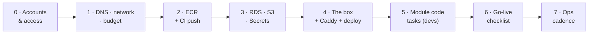

# Deployment runbook — step-by-step for DevOps & dev team

*The execution companion to [aws-deployment.md](aws-deployment.html) (the "why") — this is the "do this, in this order." New to any service used below? [learning-path.md](learning-path.html) has the just-in-time reading per stage — the rule is: don't execute a stage whose "Learn" row you haven't done. Region: **ap-south-1 (Mumbai)**. Every stage has an owner, concrete steps, and a verification gate: don't start a stage until the previous one's gate passes. Timeline assumption: one DevOps-capable person + one/two devs, part-time — roughly three weeks to customer-ready.*



---

## Stage 0 — Accounts & access *(Owner: DevOps · ~half a day)*

1. AWS account: enable **MFA on root**, then stop using root. Create IAM users (or Identity Center) for each engineer; admins get `AdministratorAccess`, everyone gets MFA.
2. Pick **ap-south-1** for everything. Note the account ID — it appears in every ARN below.
3. Install locally: `aws` CLI v2, Docker, and log in: `aws configure` (or SSO).
4. GitHub: confirm org access to all three repos (`maple-suite`, `maple-quotations`, `Maple-Photoshoot`) and permission to add repo/environment secrets.

**Gate:** `aws sts get-caller-identity` returns your IAM (not root) identity for every team member.

## Stage 1 — DNS, network, budget *(Owner: DevOps · ~half a day)*

1. Route 53: create a **public hosted zone** for the serving domain (e.g. `mapleenterprise.com` or the white-label subzone you'll use). Copy the 4 NS records to the registrar.
2. VPC: default VPC is fine at this scale. Create three **security groups**:
   - `web-sg` — inbound 80/443 from `0.0.0.0/0`
   - `ssh-sg` — inbound 22 **only from office/home IPs**
   - `db-sg` — inbound 5432 **only from `web-sg`** (never public)
3. AWS Budgets: alert at your expected monthly spend and at 2× it, to the shared email.

**Gate:** `dig NS <domain>` shows the Route 53 name servers; budget email received (test alert).

## Stage 2 — ECR + CI pushes images *(Owner: DevOps + one dev · ~1 day)*

1. Create ECR repositories:
   ```bash
   for r in maple-suite maple-quotations maple-photoshoot maple-ai; do
     aws ecr create-repository --repository-name "$r" --image-scanning-configuration scanOnPush=true
   done
   ```
2. GitHub → AWS auth: create an **OIDC role** (GitHub's `aws-actions/configure-aws-credentials` docs have the exact trust policy) scoped to `ecr:*` on those repos + later `ssm:SendCommand`. No long-lived keys in GitHub.
3. Extend CI (suite already has `ci.yml`; quotations/photoshoot need Dockerfiles first — Stage 5, task D1):
   ```yaml
   # after tests pass, on push to main
   - uses: aws-actions/configure-aws-credentials@v4   # role-to-assume: the OIDC role
   - run: |
       aws ecr get-login-password | docker login --username AWS --password-stdin $ECR
       docker build -t $ECR/maple-suite:${{ github.sha }} -t $ECR/maple-suite:latest .
       docker push --all-tags $ECR/maple-suite
   ```
4. Convention: images tagged `latest` **and** the git SHA — rollback = redeploy the previous SHA.
5. Lifecycle policy on every repo, same loop — SHA-per-deploy fills ECR forever otherwise (a multi-GB suite image × 20 retained tags ≈ ₹700/mo, [infra-containers.md](infra-containers.html) §1.2). Keeping the last 10 images *is* the rollback window; size it deliberately:
   ```bash
   for r in maple-suite maple-quotations maple-photoshoot maple-ai; do
     aws ecr put-lifecycle-policy --repository-name "$r" --lifecycle-policy-text '{
       "rules": [
         { "rulePriority": 1, "description": "expire untagged after 7 days",
           "selection": { "tagStatus": "untagged", "countType": "sinceImagePushed",
                          "countUnit": "days", "countNumber": 7 },
           "action": { "type": "expire" } },
         { "rulePriority": 2, "description": "keep the last 10 images",
           "selection": { "tagStatus": "any", "countType": "imageCountMoreThan", "countNumber": 10 },
           "action": { "type": "expire" } }
       ]}'
   done
   ```

**Gate:** a push to `main` lands a scanned image in ECR with two tags, with no static AWS keys stored in GitHub.

## Stage 3 — Data layer: RDS, S3, Secrets *(Owner: DevOps · ~1 day + overnight test)*

1. **RDS PostgreSQL 16**: `db.t4g.small`, 50 GB gp3 with autoscaling on, **not publicly accessible**, security group `db-sg`, automated backups **14 days**, deletion protection ON.
2. Create per-module databases and least-privilege users (one throwaway `psql` from the box or a bastion):
   ```sql
   CREATE DATABASE mapletools;        CREATE USER suite_app      WITH PASSWORD '...';
   CREATE DATABASE maple_quotations;  CREATE USER quotations_app WITH PASSWORD '...';
   CREATE DATABASE maple_photoshoot;  CREATE USER photoshoot_app WITH PASSWORD '...';
   CREATE DATABASE maple_ai;          CREATE USER ai_gateway     WITH PASSWORD '...';
   -- then per DB: GRANT ALL ON DATABASE x TO x_app; (module users cannot see each other's DBs)
   ```
3. **S3**: two buckets, both private with versioning ON: `maple-assets-<acct>` (product images, lookbooks, videos) and `maple-backups-<acct>` (pg_dumps; add a 90-day lifecycle rule). **CloudFront** distribution in front of the assets bucket via Origin Access Control.
4. **Secrets Manager** (or SSM Parameter Store `SecureString` — 10× cheaper, fine here). One secret per concern, JSON:
   `maple/prod/db-suite`, `maple/prod/db-quotations`, `maple/prod/db-photoshoot`, `maple/prod/auth-secret-suite`, `maple/prod/auth-secret-quotations`, `maple/prod/auth-secret-photoshoot`, `maple/prod/anthropic-key`, `maple/prod/openai-key`, `maple/prod/flags-password-hash`.
5. Write `scripts/render-env.sh` (checked into maple-suite): reads the secrets, renders `/srv/maple/.env.<module>` files on the box. Humans never paste secrets.
6. Render every `DATABASE_URL` with an explicit pool cap: `?connection_limit=3&pool_timeout=20`. Prisma's default pool is `num_physical_cpus × 2 + 1` per process — 5 on a 2-vCPU box — and 18 of the 19 app containers open one (web is static), so the defaults idle **90 connections** against Postgres's default `max_connections = 100`; one `psql` + `migrate` + the future dispatcher and the suite starts throwing `FATAL: sorry, too many clients already` as random module 500s. Capped at 3 that's 54, with headroom. The RDS ceiling is *per instance*, shared across all module databases (`db.t4g.small` derives roughly 170–225 from memory) — the cap travels with the env files, so this stays fixed. Raise a *specific* module on measured pool-timeout errors, never the default.

**Gate:** RDS reachable **only** from `web-sg` (verify a connect attempt from elsewhere times out); `aws s3 ls` shows both buckets; render-env script produces complete env files on a scratch machine.

## Stage 4 — The box: EC2 + Compose + Caddy *(Owner: DevOps · ~1 day)*

1. EC2 `t3.large` (2 vCPU/8 GB), Ubuntu 24.04 LTS, 60 GB gp3, security groups `web-sg` + `ssh-sg`, key-pair auth only. Allocate + attach an **Elastic IP**.
2. Bootstrap: `apt update && apt install -y docker.io docker-compose-v2`, add the deploy user to the `docker` group. Same session, before the first container: `timedatectl set-timezone UTC` and confirm `timedatectl` shows NTP synchronized — every cron in this runbook is written in UTC (06:00 IST = 00:30 UTC; a box on IST next to containers on UTC is how "nightly" jobs run mid-business-day and date-boundary bugs are born) — and drop in the `/etc/docker/daemon.json` log caps + weekly image-prune cron from [infra-containers.md](infra-containers.html) §2.1, not after the disk fills.
3. Route 53 records: `A` for apex + `*.mapleenterprise.com` (or explicit per-subdomain records) → the Elastic IP.
4. Lay down `/srv/maple/`: `docker-compose.prod.yml` (the suite's compose extended with the `quotations` + `photoshoot` standalone services and `maple-ai` placeholder — images from ECR, `env_file` per module), the rendered `.env.*` files, and the production `Caddyfile` (one block per subdomain; Caddy fetches TLS certs automatically once DNS resolves). Note the deploy workflows as committed today (`deploy-prod.yml` and friends) `cd ~/maple` and `git pull` + `up -d --build` — when the box moves to `/srv/maple` + ECR pulls, update the workflow path in the same PR; running both layouts on one box is how a rollback lands in the wrong directory.
5. First deploy. If the Phase-1 box carries live data, cut it over first: stop the app containers, `pg_dump` each database from the box's Postgres, restore into the matching RDS databases, and re-render the env files to point at RDS — rehearse once against a scratch RDS instance, and budget 15–30 min of downtime. Then:
   ```bash
   aws ecr get-login-password | docker login --username AWS --password-stdin $ECR
   docker compose -f docker-compose.prod.yml pull
   docker compose -f docker-compose.prod.yml run --rm migrate     # prisma push + seed per DB
   docker compose -f docker-compose.prod.yml up -d
   ```
6. Wire deploy-on-merge: reuse the suite's `deploy-prod.yml` pattern but replace "git pull + build on box" with "compose pull from ECR + up -d" (faster, and the box never needs the source).
7. Monitoring: UptimeRobot on every public URL → team phones (free plan is personal/non-commercial use only — budget Solo ~$9/mo from go-live, per [infra-observability.md](infra-observability.html) §6); CloudWatch agent for disk/memory; alarms on CPU >80%/15min, disk >80%, RDS storage, RDS CPU.
8. Backups beyond RDS: nightly cron `pg_dump` per DB → `maple-backups` bucket (script in repo, logged). Same cron, one more line — tar the Caddy cert store to the same bucket:
   ```bash
   docker run --rm -v maple_caddy_data:/data -v /srv/maple/backup:/b alpine tar czf /b/caddy_data.tgz -C /data .
   ```
   A rebuilt box without it re-issues every certificate, and ~20 subdomains of retry loops run straight into Let's Encrypt rate limits (5 duplicate certs/week). On rebuild: restore the tar into the `caddy_data` volume *before* starting Caddy and no re-issue happens at all.

**Gate:** all subdomains serve valid HTTPS; login works; a quote and a shoot can be created; UptimeRobot alert fires when you stop a container on purpose; nightly dump appears in S3 next morning.

## Stage 5 — Module code tasks *(Owner: dev team · parallel with Stages 3–4)*

Blockers first — **B-tasks must ship before any external user touches the system.** (B1–B3 below are the subset tracked inline here; the canonical, consolidated registry is **B1–B10 in [team-tasks.md](team-tasks.html)** — every one of them closes before Stage 6.)

| # | Task | Repo | Notes |
|---|------|------|-------|
| B1 | Fix roles-API privilege escalation + guard user-management routes with `manage_roles` | maple-suite | documented in [rbac-matrix.md](rbac-matrix.html) gaps; task chip already open |
| B2 | Enforce tool-gating on API routes, not just pages (disabled tool ⇒ 403 API) | maple-suite | flags gap from the same review |
| B3 | Change all seeded passwords in prod seed; require `ADMIN_PASSWORD` env in production | all three | seed creds are in READMEs |
| D1 | Dockerfiles for maple-quotations + maple-photoshoot (mirror the suite's: node:22-bookworm-slim, build, `next start -H 0.0.0.0`) | both | Stage 2 CI depends on this |
| D2 | `/api/health` endpoint in every app (DB ping + version string) + compose healthchecks | all three | trivial; the contract requires it |
| D3 | S3 storage driver for quotations assets (today: Postgres bytes; lib boundary exists in `assets.ts`) | maple-quotations | photoshoot's `CATALOG_STORAGE` already file-based → S3 or EBS-mount first pass |
| D4 | maple-ai gateway v1: extract quotations' Anthropic client (streaming, structured outputs, fallback, encrypted keys) into a small service with `POST /v1/parse-catalog`, `POST /v1/generate`, per-tenant spend log in `maple_ai` DB | new repo | ~1 week; see [er-platform.md](er-platform.html) for its tables |
| D5 | Env matrix doc: every env var per module per environment, checked into each repo | all | prevents "works on the box, not in prod" |

**Gate:** B1–B3 merged and deployed; D1–D2 done (deploys depend on them); D3–D5 may land during the first pilot weeks.

## Stage 6 — Go-live for Maple Enterprise *(Owner: both · ~half a day + drill)*

1. **Restore drill first** (non-negotiable): restore yesterday's RDS snapshot to a scratch instance, point a scratch compose at it, verify a quote loads. Time it; write down the steps you actually ran. The skeleton — the gotchas are the point:
   ```bash
   # RDS restore is ALWAYS a new instance with a new endpoint. You cannot restore in place.
   aws rds describe-db-snapshots --db-instance-identifier maple-prod \
     --query 'reverse(sort_by(DBSnapshots,&SnapshotCreateTime))[0].DBSnapshotIdentifier' --output text
   aws rds restore-db-instance-from-db-snapshot \
     --db-instance-identifier maple-restore-drill \
     --db-snapshot-identifier <snap-id> \
     --db-instance-class db.t4g.small --no-publicly-accessible \
     --vpc-security-group-ids <db-sg-id>   # gotcha: restore defaults to the DEFAULT SG — omit this and nothing connects
   aws rds wait db-instance-available --db-instance-identifier maple-restore-drill   # 10–20 min; time it
   aws rds describe-db-instances --db-instance-identifier maple-restore-drill \
     --query 'DBInstances[0].Endpoint.Address' --output text
   ```
   Then re-render env files against the new endpoint (`render-env.sh` — DB users/passwords ride *inside* the snapshot, so no secret changes), point the scratch compose at them, load a quote. Real-incident promotion is the same moves against prod: update the DB-host value in Secrets Manager → `render-env.sh` → `docker compose up -d`; nothing but the env files knows the endpoint. Delete the drill instance when done (`aws rds delete-db-instance --db-instance-identifier maple-restore-drill --skip-final-snapshot`) — a forgotten drill instance bills forever. For "we corrupted data 20 minutes ago", `restore-db-instance-to-point-in-time` instead of a snapshot — same new-instance, new-endpoint rules.
2. Tenant row: name, branding (logo, banner, colors, GSTIN, contacts), domain(s). Verify `getBrand()` picks it by Host on their subdomain.
3. Their users + roles (sales/accounts per the RBAC matrix); Flipt flags set to their plan's modules; seeded passwords rotated (B3).
4. DNS for their domains → the Elastic IP — drop the records' TTL to 300s the day before cutover so a mistake or rollback propagates in minutes, not hours (raise it back after a stable week); Caddy block added; UptimeRobot on their URLs.
5. Smoke the money paths as **their** tenant: create client → quote → branded PDF → share link opens logged-out; photoshoot upload → publish → public gallery.
6. Agree the support channel and the rollback rule: any bad deploy → `docker compose up -d` previous SHA images (< 5 min). Honesty clause: "< 5 min" is only true once step 6 of Stage 4 (pull-from-ECR deploys) is live — on today's git-pull-and-build flow the real number is 10–20 min (`git checkout <last-good-sha> && docker compose up -d --build` rebuilds all 19 apps on the box). If ECR isn't wired yet, say 20 minutes to the client, not 5.

**Gate — definition of done:** restore drill documented and timed · all money paths pass as the client tenant · alarms live on their domains · rollback rehearsed once for real.

## Stage 7 — Ops cadence *(standing)*

- **On merge:** CI tests → image → auto-deploy stage; prod deploy on `main` (or manual approval — team's call).
- **Weekly (15 min):** skim CloudWatch dashboards, UptimeRobot history, gateway spend log.
- **Monthly (1 h):** `apt upgrade` + reboot in a quiet window; review AWS bill vs budget; check backup sizes are growing plausibly.
- **Quarterly (1 h):** restore drill re-run; rotate any secret older than 6 months; prune unused ECR images (the Stage 2 lifecycle policy handles most); audit the box's `~/.ssh/authorized_keys` against the current roster.
- **On any team departure (same day, not quarterly):** remove their key from `authorized_keys` on every box; rotate the `DEPLOY_SSH_KEY` GitHub environment secret — it's a shared deploy key, so one leaver means a new pair (`ssh-keygen -t ed25519 -f maple-deploy`, replace on box and in GitHub → Environments); drop their IP from `ssh-sg`; disable their IAM user.
- **Incident one-pagers** (write during Stage 4, keep next to the compose file): *box unreachable* · *deploy broke prod* · *DB slow/full* · *certificate failure* · *AI provider down (gateway fallback status)*. Seed content below.

### The 3am cards — seed content for the one-pagers

- **Box unreachable / box died.** EC2 console first: status checks + CPU credit balance → SSM Session Manager if SSH is dead → hard reboot (`aws ec2 reboot-instances --instance-ids <id>`). Box actually gone: launch fresh Ubuntu 24.04 per Stage 4, `aws ec2 associate-address --instance-id <new-id> --allocation-id <eip-alloc>` (DNS never changes — the Elastic IP moves), restore the `caddy_data` tar into the volume, `render-env.sh`, `docker compose up -d`. That is the "~30 minutes, zero data loss" promise of [aws-deployment.md](aws-deployment.html) Phase 2 — it holds only if this card has been rehearsed once.
- **Disk full.** Triage in order: `df -h` → `docker system df` → `du -sh /var/lib/docker/containers/*/*-json.log 2>/dev/null | sort -h | tail`. Reclaim, safest first: `docker image prune -af` (stacked deploy images — usually the bulk), `truncate -s 0 <fattest-json.log>` (safe on a live container; if this was needed, the daemon.json log caps were missing), `journalctl --vacuum-size=200M`. **Never** `docker system prune --volumes` — `pgdata` lives there until Phase 2. If Postgres already crashed on the full disk, free space *before* restarting it: WAL replay needs headroom.
- **Deploy broke prod.** Roll back per Stage 6 rule 6. Then diagnose: `docker compose ps` (what's restarting?), `docker compose logs --since 15m <svc>`, and the error tracker's release view — the broken SHA is tagged on every event ([infra-observability.md](infra-observability.html) Q7).
- **Certificate failure.** `docker compose logs caddy 2>&1 | grep -iE 'acme|obtain|renew'` → the three usual causes: the DNS record no longer points at the EIP (`dig +short <sub>.<domain>`), port 80 blocked (the ACME HTTP challenge needs it — check `web-sg`), or a Let's Encrypt rate limit after a rebuild storm (the `caddy_data` backup exists to prevent exactly this). Fix the cause, `docker compose restart caddy`, watch the log — Caddy retries on its own.

---

*Escalation path beyond this runbook (customer #3, contention): ECS Fargate migration per [aws-deployment.md](aws-deployment.html) Phase 3 — the ECR images and per-module DBs built here carry over unchanged.*
