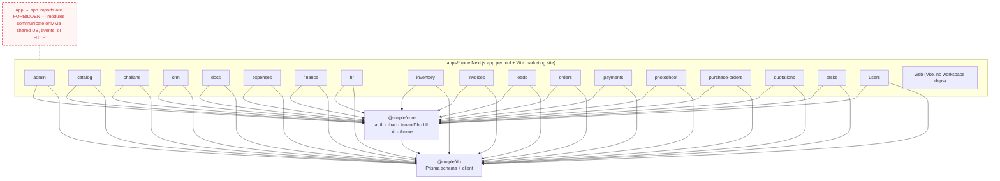

# Module dependency graph

How the MapleOne workspaces depend on each other. Verified against every
`apps/*/package.json`, `packages/core/package.json`, `packages/db/package.json`,
and a sample of real imports (2026-07).

## What the packages are

| Workspace | Name | Role |
| --- | --- | --- |
| `packages/db` | `@maple/db` | Prisma schema + generated client, seed script. Exports the `prisma` singleton from `index.ts`. |
| `packages/core` | `@maple/core` | Shared auth/session/sso/rbac, tenant + brand resolution, `tenantDb()`, UI kit (`ui/*`, `SuiteShell`), `theme.css`, flags. Ships as raw TS via `exports` (`./lib/*` → `./src/lib/*.ts`). |
| `apps/*` | `@maple/app-<name>` | One Next.js app per tool, one Vite marketing site (`apps/web`). |

## Verified dependency facts

- **18 of 19 apps depend on both `@maple/core` and `@maple/db`** (declared as
  `"@maple/core": "*"`, `"@maple/db": "*"` in each `package.json`): admin, catalog,
  challans, crm, docs, expenses, finance, hr, inventory, invoices, leads, orders,
  payments, photoshoot, purchase-orders, quotations, tasks, users.
- **`apps/web` is the exception**: a Vite + React marketing site
  (`@maple/app-web`) with no workspace dependencies — it never touches the DB or
  the shared core.
- **`@maple/core` depends on `@maple/db`**: declared in
  `packages/core/package.json` and real in code —
  `packages/core/src/lib/prisma.ts` is literally
  `export { prisma } from "@maple/db";`, and `tenant-db.ts`, `brand.ts`,
  `auth.ts` etc. build on it.
- **`@maple/db` depends on nothing** in the workspace (only `prisma` /
  `@prisma/client`).

## Graph

(`apps/web` has no edges by design — it is a static marketing site served by
`serve` in production.)

## Invariant check: do any apps import from other apps?

Verified by grep across `apps/` and `packages/` (excluding `node_modules`,
`.next`, `dist`) for:

- imports of `@maple/app-*` package names
- relative imports reaching into a sibling `apps/` directory (`../../apps/...`, `apps/...`)

**Result: zero matches.** As of this writing the invariant holds — no app
imports code from another app; all sharing goes through `@maple/core` /
`@maple/db`, and cross-tool navigation is by subdomain URL
(`packages/core/src/lib/nav.ts`). No tech-debt exceptions to list.

Note the invariant is enforced by convention only: nothing (lint rule,
`no-restricted-imports`, dependency-cruiser, turbo boundaries) would fail the
build if someone added such an import. Worth adding a guard if the team grows.
