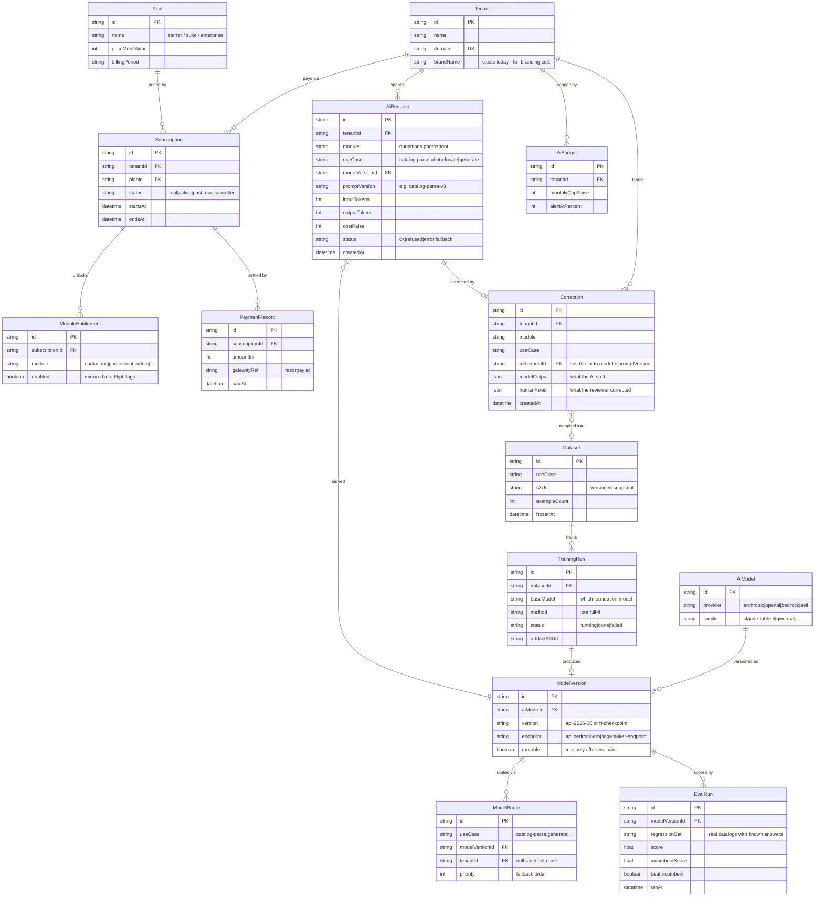

# Platform & AI layer — ER diagram (proposed)

**Status: proposed — none of these tables exist yet.** The application data models live in [er-suite.md](er-suite.html) (22 models) and [module-quotations.md](module-quotations.html) (9 models). This diagram covers the *platform* tables the AWS plan (`aws-deployment.md`) implies: selling the suite to customers (plans, subscriptions, per-module flags) and running the AI layer (the `maple-ai` gateway's usage log, model registry, and fine-tuning loop). `Tenant` is the only entity here that already exists — everything hangs off it.

Design notes:
- **Billing** stays deliberately thin (a `Subscription` row per tenant, module entitlements as rows, payments recorded on receipt) — Razorpay webhooks can fill it later without schema change.
- **AiRequest** is the gateway's append-only spend log: every call, who made it, which model served it, **which prompt version ran**, tokens and ₹. It is the evidence base for the "own models yet?" decision and for per-tenant AI billing. `promptVersion` matters for the fine-tuning loop: a `Correction` is only a usable training/eval example if you know the exact prompt + model that produced the output being corrected, and eval regressions must be attributable to prompt changes vs model changes.
- **The fine-tuning loop** is four tables: corrections captured from review screens → versioned `Dataset` → `TrainingRun` → `EvalRun` against the regression set; a `ModelVersion` only becomes routable when its eval beats the incumbent. `ModelRoute` is the gateway's switchboard: use-case → model version, per tenant when needed.

**Where these live:** `Subscription`/`Plan`/entitlements belong in the suite DB (admin app manages them). The AI tables belong to the **gateway's own database** — same module-owns-its-tables rule as everything else. `Correction` rows are written by module review screens through a gateway endpoint, so modules never touch the AI schema directly.
