# MapleOne Suite — Entity-Relationship Diagram

The MapleOne suite runs on a single shared Postgres database defined in `packages/db/prisma/schema.prisma`. Every business table carries an optional `tenantId` column for multi-tenant scoping, but tenancy is enforced at the application layer — there are no foreign-key relations to `Tenant` in the schema. The 22 models split into a core/shared layer (identity, catalog, CMS) and per-module tables owned by the individual tool apps.

## Model ownership

| Model | Owning module |
| --- | --- |
| Lead | leads |
| Quotation | quotations |
| Order | orders |
| Invoice | invoices |
| Payment | payments |
| DeliveryChallan | challans |
| PurchaseOrder | purchase-orders |
| InventoryItem | inventory |
| FinanceEntry | finance |
| Expense | expenses |
| HrDocument | hr |
| Shoot | photoshoot |
| Tenant | core/shared |
| User | core/shared |
| Role | core/shared |
| Client | core/shared |
| Product | core/shared |
| Collection | core/shared |
| Doc | core/shared |
| Task | core/shared |
| SitePage | core/shared |
| SiteBlock | core/shared |

## Diagram

Notes on the diagram:

- `tenantId` appears on almost every model but is a bare column (no `@relation` to `Tenant`), so no relation line is drawn to `Tenant`.
- `FinanceEntry.invoiceId` is a dangling column with no `@relation` — shown as an attribute only.
- All FK columns are optional except `SiteBlock.pageId` (required, cascade delete).

```mermaid
erDiagram
    Client |o--o{ Lead : sources
    Client |o--o{ Quotation : receives
    Client |o--o{ Invoice : billed
    Client |o--o{ Payment : pays
    Client |o--o{ Order : places
    Client |o--o{ DeliveryChallan : ships
    Quotation |o--o{ Order : converts
    Invoice |o--o{ Payment : settles
    User |o--o{ Task : assigned
    SitePage ||--o{ SiteBlock : contains

    Tenant {
        string id PK
        string name
        string slug UK
        string domain UK
        string brandName
        boolean watermarkEnabled
        boolean active
    }

    User {
        string id PK
        string tenantId
        string name
        string email
        string passwordHash
        string role
        boolean active
    }

    Role {
        string id PK
        string tenantId
        string name
        string label
        string permissions "array"
        boolean isSystem
    }

    Client {
        string id PK
        string tenantId
        string name
        string company
        string type
        string gstin
        string phone
        string status
    }

    Lead {
        string id PK
        string tenantId
        string clientId FK
        string name
        string source
        string status
        float value
    }

    Quotation {
        string id PK
        string tenantId
        string number UK
        string clientId FK
        json data
        float total
        string status
    }

    Invoice {
        string id PK
        string tenantId
        string number UK
        string clientId FK
        json data
        float total
        string status
        datetime dueDate
    }

    Payment {
        string id PK
        string tenantId
        string invoiceId FK
        string clientId FK
        string label
        float amount
        string method
        string status
        datetime paidAt
    }

    Order {
        string id PK
        string tenantId
        string code UK
        string clientId FK
        string quotationId FK
        string title
        string stage
        float value
        datetime deliveryDate
    }

    DeliveryChallan {
        string id PK
        string tenantId
        string number UK
        string clientId FK
        string vehicleNo
        string driver
        string status
        datetime date
    }

    PurchaseOrder {
        string id PK
        string tenantId
        string number UK
        string vendor
        float total
        string status
        datetime expectedDate
    }

    InventoryItem {
        string id PK
        string tenantId
        string name
        string category
        string sku
        string unit
        float quantity
        float reorderLevel
    }

    FinanceEntry {
        string id PK
        string tenantId
        string invoiceId "no relation"
        string type
        string category
        float amount
        datetime date
    }

    Expense {
        string id PK
        string tenantId
        string category
        string vendor
        float amount
        string method
        datetime date
    }

    HrDocument {
        string id PK
        string tenantId
        string type
        string employeeName
        json data
    }

    Product {
        string id PK
        string tenantId
        string name
        string sku
        string category
        float price
        float cost
        boolean published
    }

    Collection {
        string id PK
        string tenantId
        string title
        string slug UK
        string shareToken UK
        string theme
        int pageCount
        boolean published
    }

    Shoot {
        string id PK
        string tenantId
        string title
        string product
        string status
        string shareToken UK
        boolean published
    }

    Doc {
        string id PK
        string tenantId
        string slug
        string title
        string tagline
        string body
    }

    Task {
        string id PK
        string tenantId
        string assigneeId FK
        string title
        string status
        string priority
        datetime dueDate
    }

    SitePage {
        string id PK
        string tenantId
        string slug
        string title
        boolean published
        int order
    }

    SiteBlock {
        string id PK
        string tenantId
        string pageId FK
        string type
        string label
        boolean enabled
        int order
        json data
    }
```

