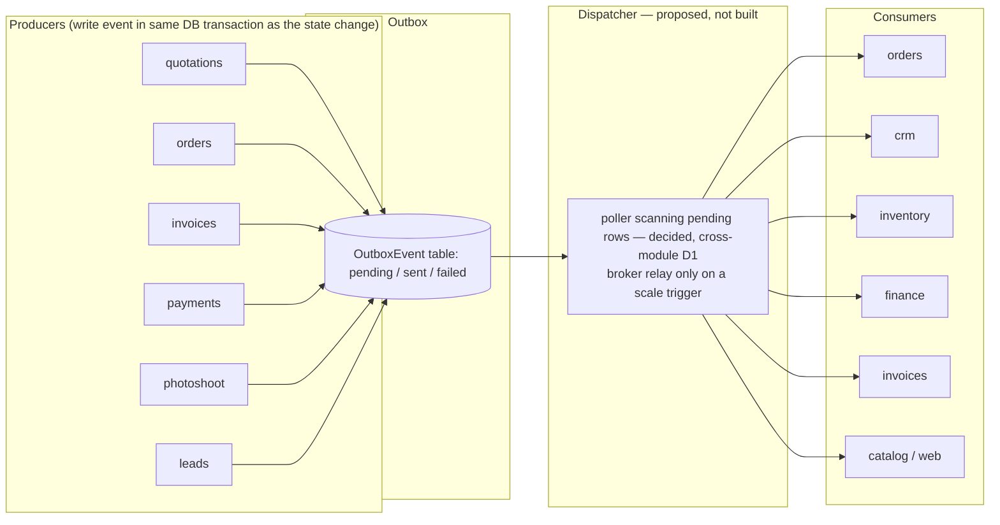

# MapleOne — Outbox Event Catalog

The `OutboxEvent` model exists **only in the standalone maple-quotations repo** today (`maple-quotations/prisma/schema.prisma`, lines 86–93). The suite schema (`maple-suite/packages/db/prisma/schema.prisma`) has **no** outbox model — verified by grep; the suite's modules currently share one Postgres database and read each other's tables directly, so no events are needed there yet. In maple-quotations the table is an intentional seam for rejoining a multi-module ecosystem (see its `README.md` "What changed vs. the suite copy" section and `docs/ROADMAP.md` item 5).

## The model (maple-quotations)

```prisma
// Outbox for future inter-module events (e.g. quotation.accepted -> orders module).
// No consumer yet; the seam exists so wiring the ecosystem later is cheap.
model OutboxEvent {
  id        String   @id @default(cuid())
  tenantId  String?
  type      String
  payload   Json
  status    String   @default("pending") // pending | sent | failed
  createdAt DateTime @default(now())
}
```

`type` is a free string and `payload` free JSON — there are no event-type constants defined anywhere in the codebase yet.

## Events written today

**None.** A repo-wide grep of maple-quotations for `outboxEvent` / `OutboxEvent` finds only the schema definition and prose mentions (`README.md:62`, `docs/DEVELOPER.md:73`, `docs/ROADMAP.md:28`). In particular, `app/api/quotations/route.ts` (the quotation create/update endpoint) writes only the `Quotation` row — no event, and no transaction wrapping. `quotation.accepted` appears solely in comments as the planned first event; the quotation `status` field is still free text with no accept transition endpoint.

| Event type | Producer (file:line) | Payload | Transactional context |
| --- | --- | --- | --- |
| — | — | — | — |

## The catalog — full schemas (proposed, not yet built)

The suite-wide contract to build against, kept in lockstep with [cross-module.html](cross-module.html) §5 (which carries producers' endpoint specs and the delivery design). Producer/consumer mapping follows module ownership in `er-suite.md`. **Status unchanged: zero of these are emitted anywhere today.**

### Envelope — every event, no exceptions

```json
{
  "id": "evt_cm9x…",
  "tenantId": "ten_01…",
  "type": "quotation.accepted",
  "version": 1,
  "occurredAt": "2026-07-17T10:30:00.000Z",
  "aggregateType": "Quotation",
  "aggregateId": "quo_01…",
  "payload": { }
}
```

`id` is the consumer idempotency key (dedupe on `(consumerName, id)` via a unique-constrained processed-events insert committed with the effect). `version` is the payload schema version — additive changes don't bump it, removals/renames do. Ordering/partition key is **`tenantId:aggregateId`** — total order per aggregate, no ordering guarantee across aggregates. **PII minimization** (cross-module §5.2): payloads carry no client/lead contact PII (phone, email, address, gstin) — ids and display names only; `clientSnapshot` is `{ name }`, nothing more. The existing maple-quotations `OutboxEvent` model maps directly: `type`→`type`, `payload`→the full envelope-less payload plus the extra envelope columns proposed in cross-module §6.1 (`aggregateType`, `aggregateId`, `version`, `occurredAt`, retry bookkeeping — which also renames the terminal status `failed` to `dead` and adds a dead-letter table).

### Per-event payload schemas

**`lead.created`** — producer: leads. Consumers: crm. No phone/email — the activity feed renders name + source; anything more resolves by `leadId`.
```json
{ "leadId": "lead_01…", "name": "Sharma Residence",
  "source": "instagram", "status": "new", "value": 500000 }
```

**`lead.converted`** — producer: leads (convert endpoint). Consumers: crm, quotations.
```json
{ "leadId": "lead_01…", "clientId": "cli_01…", "clientCreated": true,
  "clientSnapshot": { "name": "Sharma Residence" },
  "source": "instagram", "value": 500000 }
```

**`quotation.sent`** — producer: quotations. Consumers: crm, leads.
```json
{ "quotationId": "quo_01…", "number": "Q-2026-118", "clientId": "cli_01…",
  "total": 482000, "sentAt": "2026-07-17T10:30:00.000Z" }
```

**`quotation.accepted`** — producer: quotations. Consumers: orders, crm. The first event to build — the seam this table was created for.
```json
{ "quotationId": "quo_01…", "number": "Q-2026-118", "clientId": "cli_01…",
  "clientSnapshot": { "name": "Sharma Residence" },
  "total": 482000,
  "rooms": [ { "name": "Living", "items": [ { "desc": "TV unit", "qty": 1, "rate": 85000 } ] } ] }
```

**`order.created`** — producer: orders. Consumers: inventory, finance, crm.
```json
{ "orderId": "ord_01…", "code": "MO-482913", "quotationId": "quo_01…",
  "clientId": "cli_01…", "title": "3BHK woodwork — Sharma", "stage": "accepted",
  "value": 482000, "deliveryDate": "2026-09-01" }
```

**`order.fulfilled`** — producer: orders (stage → installed). Consumers: invoices, inventory, crm.
```json
{ "orderId": "ord_01…", "code": "MO-482913", "clientId": "cli_01…",
  "fulfilledAt": "2026-09-03T14:00:00.000Z", "challanIds": ["cha_01…", "cha_02…"] }
```

**`invoice.issued`** — producer: invoices. Consumers: payments (replaces today's direct cross-model Payment write inside the invoices route), finance, crm.
```json
{ "invoiceId": "inv_01…", "number": "INV-2026-041", "orderId": "ord_01…",
  "clientId": "cli_01…", "total": 241000, "dueDate": "2026-08-15" }
```

**`invoice.paid`** — producer: invoices (payment rollup transition). Consumers: finance, crm, orders.
```json
{ "invoiceId": "inv_01…", "number": "INV-2026-041", "clientId": "cli_01…",
  "totalPaid": 241000, "paidAt": "2026-08-10T09:12:00.000Z",
  "paymentIds": ["pay_01…", "pay_02…"] }
```

**`payment.recorded`** — producer: payments. Consumers: invoices (rollup trigger), finance, crm. Partition key uses `invoiceId` as the aggregate when linked, so rollups for one invoice serialize.
```json
{ "paymentId": "pay_01…", "invoiceId": "inv_01…", "clientId": "cli_01…",
  "label": "Advance", "amount": 120500, "method": "upi",
  "paidAt": "2026-07-20T00:00:00.000Z" }
```

**`challan.delivered`** — producer: challans (status → delivered). Consumers: orders, crm.
```json
{ "challanId": "cha_01…", "number": "DC-482913", "orderId": "ord_01…",
  "invoiceId": null, "clientId": "cli_01…", "vehicleNo": "MH-04-AB-1234",
  "deliveredAt": "2026-09-02T16:40:00.000Z" }
```

**`shoot.published`** — producer: photoshoot. Consumers: catalog, web. Asset paths are pointers into the shared volume (S3 keys at Phase 2) — never byte payloads.
```json
{ "shootId": "sho_01…", "title": "Teak sideboard hero", "product": "Sideboard",
  "shareToken": "sh_9f…", "hasSource": true, "hasVideo": true,
  "assetPaths": ["/data/catalog/shoots/sho_01/video.mp4"] }
```

**`product.updated`** — producer: catalog, **post-merge only** (the suite Product model is orphaned and the live fork sits in maple-quotations — nothing may produce this while the fork stands). Consumers: quotations, web.
```json
{ "productId": "pro_01…", "sku": "MF-P-0231", "name": "Teak sideboard 6ft",
  "price": 85000, "published": true, "changedFields": ["price"] }
```

**`user.created`** — producer: users app. Consumers: tasks, admin. **Must never include `passwordHash`.**
```json
{ "userId": "usr_01…", "name": "New Sales", "email": "sales2@maple.example", "role": "sales" }
```

**`tenant.updated`** — producer: admin branding PATCH. Consumers: every app — bust the 60s `getBrand()` cache instead of waiting it out.
```json
{ "tenantId": "ten_01…", "changedFields": ["brandName", "primaryColor"],
  "brandName": "Sharma Interiors", "primaryColor": "#7a4b2e", "watermarkEnabled": false }
```



## Dispatch guarantees

Delivery mechanism is decided (cross-module §6.1 / decision D1): a Postgres poller over the outbox table, moving to a broker relay only when a §6.3 trigger fires. The guarantees it must honor:

- **At-least-once delivery.** The dispatcher marks a row `sent` only after the consumer acknowledges; a crash between deliver and mark re-delivers. Don't attempt exactly-once — make consumers tolerate duplicates instead.
- **Ordering per aggregate.** Global ordering is unnecessary, but events for one aggregate (one quotation, one order) must be delivered in `createdAt` order — e.g. `order.created` before `order.fulfilled`. Simplest: the poller processes rows for a given aggregate serially; if moving to parallel workers, partition by aggregate id.
- **Idempotent consumers keyed on event id.** Each consumer records processed `OutboxEvent.id`s (a `processed_events` table or unique constraint on a derived row) and skips repeats. Combined with at-least-once delivery this yields effectively-once processing.
- **Producer-side atomicity.** The event row must be created in the **same database transaction** as the state change it announces (e.g. `prisma.$transaction([quotation.update(...), outboxEvent.create(...)])`) — that is the entire point of the outbox pattern. Today's quotation save (`app/api/quotations/route.ts`) is not transactional; add this when the first event lands.
- **Failure policy.** Retry with capped exponential backoff before a row goes terminal (`failed` in today's maple-quotations model; renamed `dead` with an `OutboxDeadLetter` table in the target model, cross-module §6.1), and alert on dead rows for human replay.
