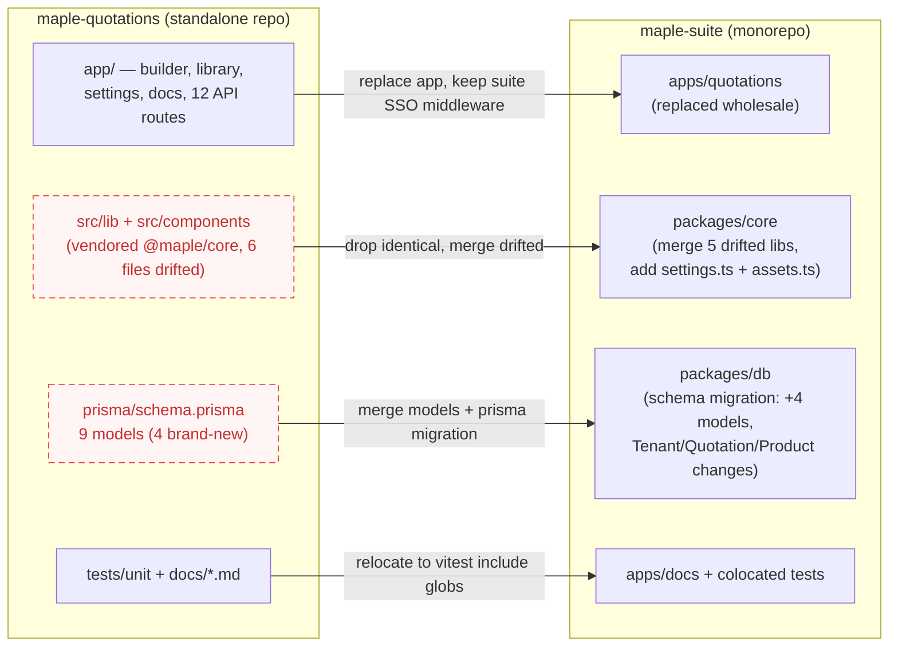

# Fold-in map: maple-quotations → maple-suite

Migration map for folding the standalone `maple-quotations` repo back into the
suite. Grounded in a file-by-file and schema-by-schema comparison of the two
repos (2026-07):

- Suite: `maple-suite/apps/quotations` (thin, older: 652-line monolithic
  `app/page.tsx` builder, 4 API routes, no product library / settings / AI import)
- Standalone: `maple-quotations` (vendored `@maple/core` via tsconfig `paths`
  → `src/lib` + `src/components`, own `src/db` + `prisma/schema.prisma` with 9
  models, AI catalog import, product library, asset gallery, settings, docs site,
  landing page, unit tests)

The standalone app is strictly ahead functionally; the suite is the system of
record for shared code and the full-suite schema. Direction of fold-in:
**standalone app code wins for `apps/quotations`; suite wins for shared shell,
SSO middleware and nav; schemas merge.**

## (a) Source → destination table

Legend — action: **move** (take standalone file as-is), **replace** (overwrite
suite file with standalone version), **merge** (combine, real drift on both
sides), **new** (no suite counterpart), **drop** (suite version already
canonical), **schema migration** (Prisma change + data migration).

### App code (`maple-quotations/app` → `maple-suite/apps/quotations/app`)

| Source (maple-quotations) | Destination (maple-suite) | Action | Risk |
| --- | --- | --- | --- |
| `app/page.tsx` (session-gated builder/landing switch) | `apps/quotations/app/page.tsx` | replace | Suite's 652-line monolith builder dies; make sure nothing else imports it. Public landing on "/" conflicts with suite SSO-everywhere assumption. |
| `app/builder.tsx`, `app/landing.tsx`, `app/gallery-picker.tsx`, `app/product-picker.tsx`, `app/catalog-import.tsx` | `apps/quotations/app/*` | new | Low — new files. `landing.tsx` may be redundant behind the suite's marketing site. |
| `app/pdf-catalog.tsx` (301 lines) | `apps/quotations/app/pdf-catalog.tsx` (289 lines) | replace | Files differ; standalone is newer (terms support). Diff before overwrite to confirm no suite-only fix is lost. |
| `app/login/*` | — | drop (probably) | Suite auth is SSO via `admin.maplefurnishers.com/login`; a per-tool login page contradicts it. Keep only if quotations must still deploy standalone. |
| `app/settings/*` (admin settings form, API-key entry) | `apps/quotations/app/settings/*` | new | Consider promoting to the suite `admin` app later; fine app-local first. |
| `app/library/*` (product library UI) | `apps/quotations/app/library/*` | new | Overlaps conceptually with suite `apps/catalog` (which has its own Product model UI) — see conflicts. |
| `app/docs/*` (public docs pages) | `apps/quotations/app/docs/*` or suite `apps/docs` content | merge | Suite already has a docs app (`apps/docs/app/content.ts`); duplicating a docs site inside quotations is drift. |
| `app/api/quotations/*` | `apps/quotations/app/api/quotations/*` | replace | **Must replace, not merge**: the suite POST saves via a bare `upsert({ where: { number } })` on a globally-unique `number` — a cross-tenant overwrite hazard (cross-module §2.4). Standalone replaced it with a tenant-scoped `findFirst` collision check + create/update, and adds payload validation + server-side `computeTotals` recompute. (`clientSnapshot` is a schema column only — the standalone route does not write it yet.) |
| `app/api/{assets,products,products/bulk,settings,ai/parse-catalog}/*` | `apps/quotations/app/api/...` | new | Need the new Prisma models first (below). |
| `app/api/auth/login/route.ts` | — | drop | Suite has no per-app login API (SSO). |
| `app/api/{auth/logout,brand}/route.ts` | same paths | drop | Suite versions already exist and are equivalent in role. |
| `middleware.ts` | `apps/quotations/middleware.ts` | merge | Standalone redirects to local `/login` and excludes `/`, `/login`, `/docs` from auth; suite redirects to `LOGIN_URL` (admin SSO) and protects everything. Keep suite SSO target, adopt standalone's public-route matcher only if the public landing/docs survive the fold-in. |

### Vendored core (`maple-quotations/src` → `packages/core`)

| Source | Destination | Action | Risk |
| --- | --- | --- | --- |
| `src/lib/{auth,clientLink,cn,constants,flags,maple-logo-b64,nav,rbac,session,tenant}.ts` | — | drop (byte-identical to `packages/core/src/lib/*`) | None — switch imports back to `@maple/core/lib/*` (tsconfig paths already use those specifiers, so imports need no edits). |
| `src/theme.css`, `src/components/ToolDisabled.tsx`, `src/db/index.ts` | — | drop (identical to core / `@maple/db`) | None. |
| `src/lib/brand.ts` | `packages/core/src/lib/brand.ts` | merge (standalone wins) | Expanded `Brand` type (12 fields vs 4) + `currentTenant()` fallback + `invalidateBrandCache()`. Every suite app renders brand via shell/PDFs — verify no app breaks on the wider type. Requires the Tenant column migration below. |
| `src/lib/utils.ts` | `packages/core/src/lib/utils.ts` | merge (standalone wins) | Adds `safeSetItem`, UTF-8-safe `encodeShareData`/`decodeShareData`; changes `newItem` defaults (`unitValue`/`quantity` 0→1). Suite has `utils.test.ts` — extend it; bring `tests/unit/{share,totals}.test.ts` along. |
| `src/lib/types.ts` | `packages/core/src/lib/types.ts` | merge | Adds optional `terms?: string[]` to `QuoteData`. Backward compatible. |
| `src/lib/tenant-db.ts` | `packages/core/src/lib/tenant-db.ts` | merge (standalone wins) | Standalone adds tenant-stamping on `upsert` to the Prisma extension. Behavioral fix all suite apps silently gain — good, but review any suite `upsert` that intentionally wrote cross-tenant. |
| `src/lib/prisma.ts` | — | drop | Only diff is the import path (`../db` vs `@maple/db`). |
| `src/lib/settings.ts` (AES-256-GCM encrypted `AppSetting` helpers, `SETTING_DEFS`, `maskSecret`) | `packages/core/src/lib/settings.ts` | new | Generic (key derived from `AUTH_SECRET`); needs `AppSetting` model in `@maple/db`. `SETTING_DEFS` is quotations-specific — split defs from mechanism when promoting. |
| `src/lib/assets.ts` | `packages/core/src/lib/assets.ts` | new | Generic bytes-in-Postgres asset store; needs `Asset` model. `apps/catalog`/`photoshoot` currently use a file volume (`/data/catalog`) + `filestream.ts`/`storage.ts` — two asset systems will coexist; decide deliberately. |
| `src/lib/{catalog-parse,pdf-images,sheet-export,docs}.ts` | `apps/quotations/lib/*` (or core if a 2nd app needs them) | move | Quotations-specific (AI parse via `@anthropic-ai/sdk`, PDF crop via sharp, XLSX rate-sheet, docs registry). Keeping them app-local avoids fattening core. |
| `src/components/SuiteShell.tsx` | — | drop (suite wins) | Standalone deliberately removed the cross-tool sidebar; the suite version (with `TOOLS` nav + `canAccessTool`) is the one to keep. |
| `src/components/ui/{badge,button,card,input,label}.tsx` | — | drop | Subset of core's ui kit (core additionally has avatar, dropdown-menu, separator, table). Verify no standalone-only styling tweaks first (files may have drifted). |

### Schema (`maple-quotations/prisma/schema.prisma` → `packages/db/prisma/schema.prisma`)

| Source model | Destination | Action | Risk |
| --- | --- | --- | --- |
| `OutboxEvent` | new model in suite schema | schema migration (additive) | None yet — no consumer exists; it is the seam for quotation.accepted → orders. |
| `AppSetting` | new model | schema migration (additive) | Key-value; consider a `tenantId` column when promoting suite-wide (standalone stores it global). |
| `Asset` (bytes in Postgres) | new model | schema migration (additive) | Product-photo bytes in the DB; watch Postgres size vs the existing `/data/catalog` volume approach. |
| `Counter` | new model | schema migration (additive) | Drives `MF-P-0001` product codes. |
| `Tenant` additions | add `bannerUrl, addressLine1, addressLine2, phone, email, gstin, website, tagline` columns; keep suite's `watermarkEnabled` (standalone dropped it) | schema migration (additive) | Union of both models. `brandName` default differs ("MapleOne" suite vs "Maple Furnishers" standalone) — keep suite default, seed real tenants explicitly. |
| `Quotation` additions | add `clientSnapshot Json?`, `updatedAt DateTime @updatedAt`; keep suite's `orders Order[]` relation | schema migration | `@updatedAt` on an existing table needs a backfill default. Union is clean; no columns conflict. |
| `Product` | **merge into suite `Product`** — hardest change | schema migration + data migration | Shapes conflict, see below. Suite `apps/catalog` reads/writes suite `Product`; quotations' library expects `code/unitType/defaultRate/imageAssetId/source`. |
| `User` / `Client` | keep suite models | no-op / merge carefully | Suite `User` is per-tenant unique (`@@unique([tenantId, email])`) with `active`; standalone made email globally unique and put `perms String[]` on the user. Suite RBAC keeps perms on `Role`. Standalone rows must be re-imported under suite rules. Suite `Client` is a superset (adds `type`, `notes`, cross-module relations). |
| `prisma/seed.mjs` (21 lines) | fold needed rows into suite `seed.mjs` (80 lines) | merge | Standalone seeds its own default tenant/user — suite seed already does tenant+roles+users. |

### Tests, deps, config

| Source | Destination | Action | Risk |
| --- | --- | --- | --- |
| `tests/unit/{share,totals}.test.ts` | next to code, e.g. `packages/core/src/lib/*.test.ts` (suite vitest includes `packages/**` + `apps/**`, not `tests/`) | move + rename | Must match suite's `include` globs or they silently never run. |
| `package.json` deps: `@anthropic-ai/sdk`, `react-markdown`, `remark-gfm`, `@tailwindcss/typography` | `apps/quotations/package.json` | merge | `sharp`/`pdf-to-img` already in core. Standalone `sharp ^0.35.3` vs suite `^0.35.1` — align. |
| `tsconfig.json` `paths` shim (`@maple/core/* → ./src/*`) | delete | drop | The whole point of the fold-in. |
| `docs/*.md` (DEVELOPER, TESTING, REGRESSION, USER_GUIDE, ROADMAP, AUTO_GENERATION) | `apps/quotations/docs/` or suite `apps/docs` content | move | Keep REGRESSION.md with the app; consider surfacing the user guide via the suite docs tool. |

## (b) Repo-level flow

## (c) Conflicts to resolve (real drift, verified by diff)

1. **`Product` model is a fork, not a superset.** Suite:
   `name, sku?, category, material, description, unit, price, cost, imageUrl, published`
   (used by `apps/catalog`). Standalone:
   `code @unique ("MF-P-0001"), name, category, specification, material, unitType, defaultRate, imageAssetId → Asset, source ("manual"|"ai-import")`.
   Column mapping is judgment-laden (`sku`↔`code`? `price`↔`defaultRate`?
   `description`↔`specification`? `imageUrl` string vs `Asset` relation) and two
   apps (catalog, quotations) will share the merged table. This is the single
   riskiest merge; do it as a deliberate schema design, not a mechanical union.
2. **`Tenant` model + `brand.ts` drifted together.** Standalone added 8 brand
   columns (`bannerUrl`, address lines, `phone`, `email`, `gstin`, `website`,
   `tagline`) and widened `Brand` from 4 to 12 fields with a default-tenant
   fallback and `invalidateBrandCache()`; suite meanwhile has `watermarkEnabled`
   that the standalone dropped. Merge must take the union and re-test brand
   rendering in every suite app shell + PDF generators (`invoice.ts`,
   `pdf-render.ts`, `poster.ts`, `watermark.ts`).
3. **Auth/user model divergence.** Standalone `User`: global `email @unique`,
   `perms String[]` on the row, no `active` flag, real `tenant` relation.
   Suite `User`: `@@unique([tenantId, email])`, `active`, perms via the `Role`
   model, `tasks` relation. Standalone also ships its own `/login` +
   `app/api/auth/login` and a middleware that redirects to local `/login` with
   public `/`, `/docs` routes — the suite is SSO-only via
   `admin.maplefurnishers.com`. Decide: pure SSO (drop login + landing) or keep
   the standalone-deploy capability behind an env switch.
4. **`utils.ts` behavioral drift.** Standalone changed `newItem()` defaults
   (`unitValue`/`quantity` from 0 to 1) and added the UTF-8-safe base64url
   share encoding with a legacy-`btoa` fallback (`encodeShareData` /
   `decodeShareData`, covered by `tests/unit/share.test.ts`). Old suite share
   links only work through the legacy fallback — keep it when merging, and note
   the default change touches every new quote row.
5. **`tenant-db.ts`: standalone stamps `tenantId` on `upsert`, suite does not.**
   One added query-extension branch, but it changes write behavior for every
   suite app once merged (previously `upsert` creates were tenant-unstamped —
   arguably a latent suite bug the standalone fixed). Audit suite `upsert`
   call sites when adopting.
6. Smaller but real: `SuiteShell.tsx` (standalone removed the cross-tool
   sidebar — suite version must win or quotations loses suite nav);
   `Quotation.updatedAt`+`clientSnapshot` additions (need backfill);
   two asset stores (DB-bytes `Asset` vs `/data/catalog` volume used by
   catalog/photoshoot); duplicated docs site inside the app vs `apps/docs`;
   `types.ts` `terms?: string[]` (safe, additive).
