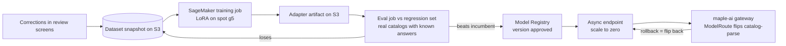

# AWS services deep-dive — with SageMaker & Bedrock in focus

*The service-by-service bible for MapleOne on AWS. Every service follows the house format: **what it is in plain words / why we specifically would use it / ₹ at our scale / adoption trigger** — and every verdict is given twice, once per cost posture:*

- **Bootstrapped** — ₹-first, one box, founder-run, every recurring ₹ must justify itself monthly.
- **Funded** — managed-first, ops time is the scarce resource, compliance surface is a sales asset.

*Builds on [aws-deployment.md](aws-deployment.html) (the phase plan), [ai-layer.md](ai-layer.html) (what AI runs today), [er-platform.md](er-platform.html) (the gateway's tables), and [learning-path.md](learning-path.html) (what to learn before touching any of this).*

**Conversion & tax assumptions used throughout:**

- ₹87 ≈ $1 (mid-2026; re-check at implementation).
- **+18% GST on top of every number** — AWS India bills in INR via Amazon Web Services India Private Limited and charges 18% GST ([AWS India billing](https://docs.aws.amazon.com/awsaccountbilling/latest/aboutv2/manage-account-payment-aispl.html), [AWS tax help — India](https://aws.amazon.com/tax-help/india/)).
- Scale reference: ~200–500 AI-parsed catalog pages/month today (₹8–10/page on Fable 5 via the direct API, per [ai-layer.md](ai-layer.html)), growing to maybe 2–5k pages/month with a white-label fleet.
- Where a Mumbai (ap-south-1) price wasn't published in a citable source, the us-east-1 anchor is used with an uplift note and a **verify at implementation** flag.

---

## 0. The one-paragraph version

Two services get the deep treatment because they are the two halves of our AI future: **Bedrock** is how we'd run *other people's* frontier models inside our AWS account (IAM keys-nowhere auth, INR billing, procurement-friendly — but Claude from Mumbai currently rides *global* cross-region inference, so it is **not** the "data never leaves India" story it sounds like), and **SageMaker** is how we'd train and serve *our own* fine-tuned vision model on the corrections dataset (training a full LoRA cycle costs less than a nice dinner; only *serving* costs real money, and async scale-to-zero endpoints keep even that honest). Everything else on AWS that could plausibly touch MapleOne is triaged in §3 into adopt-now (mostly free: CloudTrail, Budgets, SES, Lambda webhooks), adopt-at-a-trigger (WAF, SQS, ElastiCache, Rekognition), and never (Cognito, EKS, Amplify — with reasons, not vibes). §5 compresses all of it into two adopt/later/never tables, one per cost posture.

How to read this page: if you're deciding *whether* to adopt something, read that service's entry in §3 (or §1/§2 for the big two) — the format is always what-it-is / why-us / ₹ / trigger. If you're deciding *what to do this quarter*, read §5 and §6 only.

---

## 1. Amazon Bedrock — the deep dive

### 1.1 What it actually is, in plain words

Bedrock is AWS reselling other companies' AI models through AWS's own front door. Instead of holding an Anthropic API key and calling `api.anthropic.com`, you call an AWS endpoint in your own account, authenticate with IAM (the same credentials mechanism as S3 or RDS), and AWS meters the tokens onto your regular AWS bill. The models themselves — Claude, Llama, Mistral, Amazon's own Nova family — run on AWS-managed capacity; you never see a server.

Around the raw model calls, Bedrock bolts on managed extras:

- **Knowledge Bases** — managed RAG: point it at documents, it handles chunking, embedding, vector storage, retrieval (§1.4).
- **Agents** — managed tool-calling loops: the model plans and calls your Lambda functions (§1.5).
- **Guardrails** — managed content/PII filtering on inputs and outputs (§1.6).
- **Batch inference** — submit a JSONL of requests, get results asynchronously at ~50% of on-demand token prices ([Bedrock pricing](https://aws.amazon.com/bedrock/pricing/)) — worth remembering for bulk re-parses of a catalog backlog.
- **Custom Model Import / fine-tuning** — narrow model-architecture support; not our fine-tuning home (SageMaker is, §2).

The one-line mental model: *Bedrock is to model APIs what RDS is to Postgres — the same thing you already use, run inside your AWS account boundary, slightly behind the upstream on features, in exchange for one bill, one auth system, and one compliance story.*

### 1.2 The model catalog that matters to us — and the ap-south-1 reality

Our AI use cases ([ai-layer.md](ai-layer.html)): vision + handwriting catalog parsing (needs a frontier vision model), product photo generation (image model), and eventually our own fine-tuned open vision model. What Bedrock offers against each:

| Our use case | Bedrock option | ap-south-1 status |
|---|---|---|
| Catalog parsing (vision + handwriting) | Anthropic Claude (Opus/Sonnet/Haiku families, all vision-capable) | **Available from Mumbai only via *global* cross-Region inference** — see the residency caveat below |
| Photo generation | Amazon Nova Canvas / Titan Image Generator; Stability models | Check per-model in the [region table](https://docs.aws.amazon.com/bedrock/latest/userguide/models-regions.html) — verify at implementation |
| Cheap text utility calls (notifications copy, summaries) | Nova Micro/Lite, Haiku-class | Nova family has had genuine in-region presence — verify current list |
| Own fine-tuned vision model | Bedrock Custom Model Import (Llama-architecture only, roughly) | Limited; treat SageMaker as the path (§2) |

**The single most important finding of this research:** the Mumbai region hosts a substantial Bedrock catalog (~60 models per [modelavailability.com's ap-south-1 listing](https://modelavailability.com/platforms/aws/regions/ap-south-1)), but **Anthropic Claude models are served to ap-south-1/ap-south-2 callers through *Global cross-Region inference* (CRIS)** — AWS's own launch blog is explicit that this is how India customers get Claude Opus 4.6 / Sonnet 4.6 / Haiku 4.5 ([AWS ML blog — Claude in India via global CRIS](https://aws.amazon.com/blogs/machine-learning/access-anthropic-claude-models-in-india-on-amazon-bedrock-with-global-cross-region-inference/)). You invoke a `global.anthropic.claude-*` inference-profile ID rather than a Mumbai-resident model ID.

Why that matters:

- With **global** CRIS, *"input prompts and output results may be processed outside the geography where the source Region is located"* — AWS documents this directly ([global CRIS docs](https://docs.aws.amazon.com/bedrock/latest/userguide/global-cross-region-inference.html)).
- **Geographic** CRIS profiles, by contrast, keep processing inside a geography (e.g. an APAC-bounded profile) and give a documented technical property: stored data stays in the source region and processing stays in-geography ([geographic CRIS docs](https://docs.aws.amazon.com/bedrock/latest/userguide/geographic-cross-region-inference.html), [AWS blog on securing CRIS](https://aws.amazon.com/blogs/machine-learning/securing-amazon-bedrock-cross-region-inference-geographic-and-global/)).
- Data in transit is encrypted on Amazon's network either way; the question is *where the GPU that reads your client's rate sheet physically sits*.

**Translation for our sales conversations:** "Claude on Bedrock from Mumbai" does **not** currently mean "client catalog data never leaves India" — inference may run in other AWS commercial regions. If a client's requirement is *inference happens in India*, Claude-on-Bedrock-via-global-CRIS does not deliver that today; an APAC-geographic profile (if/when offered for Claude from ap-south-1), a Mumbai-resident model (Nova family), or our own SageMaker endpoint (§2) would. **Verify the current profile options for Claude from ap-south-1 at implementation** — AWS has been steadily widening geographic profiles.

### 1.3 API differences vs the direct Anthropic API — what our gateway would have to absorb

The maple-ai gateway ([aws-deployment §5](aws-deployment.html)) is the only code that would ever touch this, which is exactly why the gateway exists. The differences that bite:

- **Auth: IAM SigV4 instead of an `x-api-key` header.** Genuinely better for us — no long-lived key to store/rotate/leak; the gateway's EC2/ECS role grants `bedrock:InvokeModel` on specific model ARNs and there is simply no secret to manage. This is the "no key sprawl" argument in its strongest form, and it also means per-model access control (deny the interns Opus) becomes an IAM policy.
- **Endpoints & SDK:** `InvokeModel` (native Anthropic-shaped payload) or `Converse` (AWS's normalized cross-model API). Anthropic publishes an official path for running its SDK against Bedrock ([Claude in Amazon Bedrock — platform docs](https://platform.claude.com/docs/en/build-with-claude/claude-in-amazon-bedrock)), so the quotations `runVisionRequest` code would port with modest changes rather than a rewrite.
- **Streaming: supported** (`InvokeModelWithResponseStream` / `ConverseStream`). Our streaming + `finalMessage` pattern survives intact.
- **Structured outputs: the sore spot.** Our parser leans on Anthropic's `output_config.format: json_schema` — API-enforced shape, no JSON-repair parsing ([ai-layer.md](ai-layer.html)). Bedrock's `Converse` historically offered tool-use-shaped JSON rather than the native structured-outputs feature, with parity arriving in waves. **Verify at implementation** whether the current Bedrock Claude surface honors `output_config` natively; if not, the gateway shims it via a forced tool call — workable, but real porting work, not a config flip.
- **Server-side fallback beta:** the `betas: ["server-side-fallback-2026-06-01"]` fable-5 → opus fallback is a direct-API feature. On Bedrock the gateway implements fallback itself (it already has the retry scaffolding, so this is small — and arguably the gateway should own fallback anyway).
- **PDF document blocks:** our parser sends PDFs as native document blocks. Bedrock's Converse supports document inputs but with its own size/count limits — re-validate the 22MB-per-PDF operating limit from [ai-layer.md](ai-layer.html) against Bedrock's quotas at implementation.
- **Prompt caching: supported on Bedrock** with the same general economics ([Bedrock prompt caching docs](https://docs.aws.amazon.com/bedrock/latest/userguide/prompt-caching.html)); third-party analyses note slightly different read multipliers/TTLs per configuration ([exploreagentic.ai comparison](https://www.exploreagentic.ai/insights/prompt-caching-guide/)) — measure, don't assume.
- **Model & feature lag:** new Claude models land on the direct API first; Bedrock follows weeks-to-months later, and the broader Anthropic platform surface (managed agents, skills, code execution, evaluations console) lags further ([braincuber comparison](https://www.braincuber.com/blog/claude-on-bedrock-vs-claude-api-direct-whats-different), [respan.ai comparison](https://www.respan.ai/articles/claude-vs-bedrock-claude)).
- **The wildcard:** 2026 reporting describes a **"Claude Platform on AWS"** GA — the native Anthropic API billed through an AWS account with IAM auth ([isimplifyme overview](https://isimplifyme.com/blog/claude-platform-on-aws-vs-bedrock)). If real and reachable from India, it could give us AWS-billing + IAM *without* the Bedrock feature lag — potentially dominating both options. **Verify against official Anthropic/AWS announcements; do not plan around it yet** (Q2 in §6).

### 1.4 Knowledge Bases — managed RAG, with a designed use case

**What it is, plainly:** you point Bedrock at documents in S3; it chunks them, embeds them (Titan/Cohere embedding models), stores vectors in a vector store you choose, and exposes `Retrieve` / `RetrieveAndGenerate` APIs that answer questions grounded in your documents, with citations. There is **no separate Knowledge Bases fee** — you pay for the embedding tokens, the vector store, and the generation model ([Bedrock pricing](https://aws.amazon.com/bedrock/pricing/), [cloudchipr breakdown](https://cloudchipr.com/blog/amazon-bedrock-pricing)).

**Designed use case — the quote-assistant over our product master.** The quotations module has a growing product library (fed by `/api/products/bulk` after every catalog import) plus an archive of accepted quotes. The assistant answers, mid-quote: *"what did we last charge for a 6-seater sheesham dining set with cane backs, and which catalogs carry one?"*

The design:

1. Nightly gateway job exports product master + accepted-quote line items to S3 as markdown/JSON documents (one doc per product family, metadata: tenant, category, last-quoted date).
2. Knowledge Base syncs the bucket (incremental — only changed docs re-embed).
3. Gateway exposes `POST /v1/quote-assistant` → `RetrieveAndGenerate` with a Haiku-class model, tenant-filtered via metadata filtering so tenant A never retrieves tenant B's pricing.
4. Answers return citations (product IDs, quote IDs) the UI renders as links — the same trust-boundary philosophy as the parse review screen: the human sees *why*.

**₹ at our scale:** the trap is the vector store, not the RAG.

- OpenSearch Serverless *classic* collections floor at ~$350/month ≈ ₹30k even at zero query volume ([AWS OpenSearch pricing blog](https://aws.amazon.com/blogs/big-data/amazon-opensearch-serverless-cost-effective-search-capabilities-at-any-scale/), §3.3).
- Mitigations: a **NextGen** scale-to-zero collection (GA May 2026 per [cubeapm's review](https://cubeapm.com/blog/aws-opensearch-pricing-review/) — verify ap-south-1 availability), or a cheaper supported store — ideally **Postgres/pgvector on the RDS instance we already run** (Aurora is officially supported; plain-RDS support is **verify at implementation**, Q4 in §6).
- Embedding a ~10k-product master: single-digit ₹-hundreds, once. Query-time generation on Haiku-class: paise per question.

**Verdict — Bootstrapped:** don't; a 40-line pgvector similarity query inside quotations against the DB we already run gives 80% of this for ~₹0. **Funded:** yes, when the quote-assistant becomes a *sold feature* — managed sync + citations + Guardrails integration + metadata-filtered multi-tenancy is real leverage over hand-rolled RAG.

### 1.5 Agents — what they are, and why not yet

**What:** a managed loop where the model plans, calls your Lambda-backed "action groups," consults Knowledge Bases, and returns a final answer — AWS hosting the orchestration we would otherwise write in the gateway.

**Why not yet, honestly:**

- Our production AI calls are single-shot parses with a **human review screen as the trust boundary** ([ai-layer.md](ai-layer.html)) — there is no multi-step tool loop in production to outsource.
- The gateway exists to own routing, spend logging, and budgets per tenant ([er-platform.md](er-platform.html)); Bedrock Agents would move the loop outside the gateway's meter.
- When an agentic flow appears (e.g. *"rebuild this quote against the new rate card, flag items whose supplier price moved >10%"*), the gateway grows a loop with full control — and can still delegate individual model calls to Bedrock.

**Verdict — both postures:** skip for now; revisit only if we'd rather rent the loop than own it, and only after the gateway's own loop has been tried.

### 1.6 Guardrails — the DPDP-relevant piece

**What:** a configurable filter on model inputs and/or outputs: content policies, denied topics, word filters, and — the part we actually care about — **sensitive-information filters that detect and mask/block PII** (names, phone numbers, addresses, plus custom regexes for things like GSTINs). Crucially, the standalone `ApplyGuardrail` API works on *any* text, even for non-Bedrock models ([Bedrock Guardrails page](https://aws.amazon.com/bedrock/guardrails/)).

**Why us:** client catalogs and quotes carry client names, phone numbers, addresses, GST numbers. Under the DPDP Act our obligations are minimization and purpose limitation; masking PII before prompts leave our boundary (to *any* provider — Anthropic, Bedrock, or our own endpoint) is a cheap, demonstrable control. The gateway is the natural enforcement point: one guardrail pass on every outbound prompt, regardless of route.

**₹:** priced per text unit (1 unit = 1,000 characters); content-policy filters run around $0.15–0.75 per 1,000 text units depending on policy and tier, and **sensitive-information (PII/regex) filters have been free or near-free** ([Bedrock pricing](https://aws.amazon.com/bedrock/pricing/), [nOps breakdown](https://www.nops.io/blog/amazon-bedrock-pricing/) — exact per-policy rates move; verify). At 500 parses/month × ~50k chars each ≈ 25k text units → low ₹-hundreds/month even on paid policies.

**Verdict — Bootstrapped:** implement PII masking as a regex/library pass inside the gateway (₹0, no new dependency); adopt `ApplyGuardrail` only if an enterprise client asks for a named, auditable control. **Funded:** adopt — "PII masking enforced by AWS Bedrock Guardrails" is a sentence that closes enterprise security reviews, and the gateway shim makes it a one-file change.

### 1.7 On-demand vs provisioned throughput — the ₹

**On-demand (pay per token):**

- Same order as the direct API — Claude Sonnet-class at $3/$15 per million input/output tokens ([Bedrock pricing](https://aws.amazon.com/bedrock/pricing/); [pecollective's tracker](https://pecollective.com/tools/aws-bedrock-pricing/) notes promotional launch windows on newer models, e.g. $2/$10 promos).
- Our ₹8–10/page parse economics carry over roughly unchanged. Global-CRIS requests are billed at source-region rates — small FX/metering differences only (verify).
- **Batch inference at ~50% of on-demand** is the one Bedrock-only price lever worth remembering for backlog re-parses.

**What one parsed page actually costs, in tokens (the math behind ₹8–10/page):**

| Component | Rough size | Sonnet-class rate | ₹ |
|---|---|---|---|
| Page image/PDF block as input | ~1,500–2,500 tokens | $3/MTok in | ₹0.4–0.7 |
| System prompt + schema (cacheable) | ~2,000–3,000 tokens | $3/MTok in (or ~10% on cache read) | ₹0.5–0.8 → ₹0.05–0.08 cached |
| Structured items output | ~1,000–2,500 tokens | $15/MTok out | ₹1.3–3.3 |
| Second photo-locate pass (when clean PDF present) | similar again | — | ~doubles the above |
| **Observed all-in** | | | **₹8–10/page** ([ai-layer.md](ai-layer.html)) |

Two levers fall out of this math regardless of Bedrock-vs-direct: **prompt caching** on the fixed system prompt + schema (identical across every page of a batch — the cache pays for itself from page 2 of any catalog), and **batching pages per request** where quality allows. The gateway should implement both before anyone debates providers — they're worth more than the provider choice.

**Provisioned throughput (rent dedicated model capacity by the hour):**

- A single Claude model unit has listed in the **$22–44/hour** band depending on model class and commitment (e.g. ~$39.60/hour on a 1-month commitment for a Haiku-class unit; larger models higher) — call it **≈ ₹14–28L/month for one always-on unit** ([caylent explainer](https://caylent.com/blog/amazon-bedrock-pricing-explained), [truefoundry breakdown](https://www.truefoundry.com/blog/aws-bedrock-pricing-explained-everything-you-need-to-know)).
- Break-even analyses put the crossover around 8–10M tokens/*hour* sustained ([deploybase analysis](https://deploybase.ai/articles/amazon-bedrock-pricing)). We are 4–5 orders of magnitude below that.
- **Verdict — both postures: never at our scale.** If a Bedrock quota ever throttles a burst, cross-region inference and retry queues are the answer, not capacity rental.

### 1.8 The honest verdict — when Bedrock beats direct API for us, and when it doesn't

**Bedrock wins when:**

1. **No key sprawl** — IAM roles instead of API keys is a genuine security upgrade; our per-tenant encrypted-key machinery becomes unnecessary for AWS-routed calls.
2. **One bill, in INR** — AI spend lands on the AWS India invoice with GST input credit, instead of a USD card charge to Anthropic (forex markup + messy RCM treatment + no clean ITC). At ₹5–50k/month AI spend this is a real bookkeeping win (§4).
3. **A client's procurement demands "AWS-only" vendor lists** — many Indian enterprises have AWS pre-approved; adding "Anthropic (US)" as a new data processor is a procurement cycle. Bedrock makes AI just another AWS service on an already-signed DPA.
4. **Residency — but only partially.** Per §1.2, *global CRIS Claude does not guarantee inference stays in India*. Sell "data controlled within our AWS account, encrypted end-to-end, at-rest in Mumbai" — not "never leaves India" — unless the profile actually guarantees it.
5. **Outage insurance** — a second, independently-operated route to the same model family.

**Direct API wins when:**

1. **Model/feature lag matters** — we live on structured outputs, PDF document blocks, and server-side fallback betas; the direct API gets everything first (§1.3). Our parse quality *is* the product.
2. **Simplicity** — one vendor, one SDK, code already in production and battle-tested against real scans.
3. **Tooling** — Anthropic Console, prompt improvement, evals live on the direct platform.

**Bootstrapped verdict:** stay on the direct Anthropic API. Build the gateway so Bedrock is a routing entry, not a rewrite (this is [aws-deployment §5](aws-deployment.html) Step A→B by design). Adopt Bedrock **when the first client contract or procurement checklist demands it — not before.**

**Funded verdict:** run **dual-homed** from the start — gateway routes default traffic to the direct API (feature freshness) with Bedrock as the standing alternative route for (a) clients whose contracts want AWS-only processing and (b) instant failover if Anthropic has an outage. The `ModelRoute` table in [er-platform.md](er-platform.html) was designed for exactly this.

---

## 2. Amazon SageMaker — the deep dive

### 2.1 The platform map — what matters to us, what to ignore

SageMaker is not one service; it's ~30 features under one brand. Plain words: **it's AWS's rent-a-ML-lab** — notebooks to explore, managed GPU jobs to train, a registry to version models, and several ways to host them behind an HTTPS endpoint. For us it is the designated home of **Step C** in [aws-deployment.md §5](aws-deployment.html): the fine-tuned vision model trained on our corrections dataset.

| Piece | What it is | Us? |
|---|---|---|
| Studio / notebooks | Managed Jupyter | ⚠ use carefully — ₹ trap (§2.2) |
| **Training jobs** | Ephemeral GPU machines that run a script and vanish | ✅ core — the fine-tune loop (§2.3) |
| **Model Registry** | Versioned catalog of approved models | ✅ core — maps 1:1 to our `ModelVersion` table (§2.4) |
| **Inference: real-time / async / serverless** | Managed model hosting, three flavors | ✅ core — §2.5 |
| **JumpStart** | One-click open models, many fine-tunable | ✅ the on-ramp — §2.6 |
| Processing jobs | Ephemeral compute for data prep / batch eval | ✅ minor — runs the eval harness |
| Pipelines | Managed ML DAGs | ➖ later; a GitHub Action + two jobs is enough for one model |
| Ground Truth (labeling) | Managed human labeling workforce | ❌ our review screen *is* the labeler — corrections come free |
| Feature Store, Clarify, Model Monitor | Tabular-ML apparatus (feature serving, bias, drift) | ❌ not our shape of problem |
| Canvas, Data Wrangler | No-code ML | ❌ |
| HyperPod | Multi-node cluster training for foundation models | ❌ we train LoRA adapters, not foundation models |

### 2.2 Studio & notebooks — the ₹ trap, stated loudly

Studio bills the instance behind every notebook by the hour, and **closing the browser tab does not stop the instance** — it keeps billing until explicitly stopped, and per-user EBS volumes accrue storage charges indefinitely ([SageMaker Studio metering docs](https://docs.aws.amazon.com/sagemaker/latest/dg/notebooks-usage-metering.html), [AWS's own cost-analysis blog](https://aws.amazon.com/blogs/machine-learning/part-2-analyze-amazon-sagemaker-spend-and-determine-cost-optimization-opportunities-based-on-usage-part-2-sagemaker-notebooks-and-studio/), [cloudzero guide](https://www.cloudzero.com/blog/sagemaker-pricing/)). The canonical failure: a GPU notebook (`ml.g5.xlarge`) forgotten on Friday evening is **~₹12–13k gone by Monday**.

House rules if we use Studio at all:

1. **Lifecycle auto-stop script** on every domain — idle >60 min → stop the app (the `auto-stop-idle` pattern from AWS's blog).
2. **CPU instances for everything** except the actual GPU smoke-test; write code locally, submit jobs remotely.
3. A **Budgets alarm scoped to SageMaker** at ₹2k/month from day one (§3.15) — the alarm costs nothing and catches zombies within a day.
4. Delete unused Studio user profiles; their EBS volumes bill forever.

**Bootstrapped alternative we should actually prefer:** skip Studio entirely — develop the training script locally (or on a spot EC2 GPU started and stopped by hand) and **submit SageMaker *training jobs* from a laptop** with the Python SDK. Jobs are ephemeral by construction and cannot be forgotten. Studio is a convenience for full-time ML staff we don't have yet; at funded posture with a hired ML dev, adopt Studio *with* rules 1–4 above as non-negotiable.

### 2.3 Training jobs — the concrete LoRA fine-tune design

**What it is:** you hand SageMaker a container + script + an S3 input path; it provisions the instance, runs to completion, writes artifacts to S3, and **terminates** — you pay for job seconds only. Nothing to forget, nothing to patch.

**Our concrete job — `corrections-lora-v1`:**

- **Base model:** an open vision-language model in the Qwen-VL family. Exact checkpoints move fast — Qwen3-VL-8B-Instruct and DeepSeek-OCR landed on JumpStart in Jan 2026 ([AWS what's-new](https://aws.amazon.com/about-aws/whats-new/2026/01/new-models-on-sagemaker-jumpstart/)); newer Qwen multimodal releases followed in May ([what's-new](https://aws.amazon.com/about-aws/whats-new/2026/05/qwen-models-on-sagemaker-jumpstart/)) — pick at implementation via the §2.6 spike.
- **Precedent that matches our problem exactly:** AWS's own worked pipeline fine-tunes VLMs for **multipage document → JSON** and reports a fine-tuned Qwen2.5-VL-**3B** competing with far larger models (~98% on their document task) ([AWS ML blog — VLM doc-to-JSON with SWIFT](https://aws.amazon.com/blogs/machine-learning/fine-tune-vlms-for-multipage-document-to-json-with-sagemaker-ai-and-swift/), [sample repo](https://github.com/aws-samples/sample-for-multi-modal-document-to-json-with-sagemaker-ai)). Scanned page in, structured items JSON out — *literally our parser's contract*.
- **Dataset:** the `Correction` → `Dataset` pipeline from [er-platform.md](er-platform.html) — (page image, corrected JSON) pairs, frozen as a versioned S3 snapshot (`s3://maple-ai-datasets/catalog-parse/v3/`). Realistic first cut: 1–3k pairs (a few months of review-screen usage). The prompt/schema conventions from [ai-layer.md](ai-layer.html) ("85K = ₹85,000", `pending: true` on ambiguity) become the training target format unchanged.
- **Method:** LoRA/QLoRA (adapters, not full fine-tune) — cuts GPU memory 60–80%, keeps artifacts to tens of MB, and makes rollback trivial ([HF PEFT docs](https://huggingface.co/docs/peft/index), [LoRA conceptual guide](https://huggingface.co/docs/peft/conceptual_guides/lora)).
- **Instance:** `ml.g5.xlarge` (1× NVIDIA A10G, 24 GB VRAM, 4 vCPU) for a 3B–8B model under QLoRA; step to `ml.g5.2xlarge` or `ml.g5.12xlarge` only on OOM. G5 is available in ap-south-1 ([AWS G5 region expansion](https://aws.amazon.com/about-aws/whats-new/2024/02/region-expansion-g5-instances-sagemaker-notebooks/)); Mumbai GPU capacity can be tight — retry across AZs, or fall back to ap-southeast-1 *for training only* (fine if the dataset is anonymized; flag if not).
- **Spot: always.** Managed Spot Training saves **up to 90% vs on-demand**, with S3 checkpointing so interruptions resume instead of restart ([SageMaker managed spot docs](https://docs.aws.amazon.com/sagemaker/latest/dg/model-managed-spot-training.html), [AWS launch blog](https://aws.amazon.com/blogs/aws/managed-spot-training-save-up-to-90-on-your-amazon-sagemaker-training-jobs/)). Set `max_wait` generously; a fine-tune is never urgent.
- **Quotas:** SageMaker GPU quotas default to **zero** in most accounts — `ml.g5.xlarge for training` and `ml.g5.xlarge for endpoint usage` are *separate* quotas; file both increase requests when Step C planning starts, not the week of.

**₹ for one run:** published on-demand figures for `ml.g5.xlarge` range **~$1.4–2.0/hr** — the ~40% SageMaker premium over EC2's $1.006/hr puts us-east-1 near $1.41, while third-party trackers quote up to $2.03 ([cloudchipr's breakdown](https://cloudchipr.com/blog/amazon-sagemaker-pricing)); pull the real ap-south-1 number from the [SageMaker pricing page](https://aws.amazon.com/sagemaker/ai/pricing/) with region selected (Q5 in §6). A LoRA pass over ~2k image-JSON pairs ≈ 4–10 hours:

- On-demand: ₹500–1,800 per run.
- **Spot: roughly ₹200–700 per run.**
- Even 5 experimental runs per cycle keeps training in ₹-thousands, not ₹-lakhs. **The moat is cheap to build; only serving is expensive (§2.8).**

### 2.4 Model Registry — the bureaucracy we actually want

- **What:** a versioned shelf of model artifacts with approval status (`PendingManualApproval` → `Approved` / `Rejected`) and lineage back to the training job and dataset.
- **Us:** it is the physical counterpart of our `ModelVersion.routable = true only after eval win` rule ([er-platform.md](er-platform.html)) — the eval harness flips a registry package to `Approved`, and only approved packages are deployable. The registry's lineage answers "which dataset trained the model that parsed this quote?" — a DPDP-audit-shaped question.
- **₹:** no charge for the registry itself; artifacts are S3 storage (paise for LoRA adapters).
- **Trigger:** the moment the first training job succeeds.
- **Postures — both:** yes. It's free and it *is* our governance model.

### 2.5 Hosting: real-time vs serverless vs async — which fits catalog-parse bursts

Three ways to serve, one decision that matters:

| Option | Plain words | GPU? | Scale to zero? | Fit for us |
|---|---|---|---|---|
| **Real-time endpoint** | Always-on instance(s) behind HTTPS, synchronous responses | ✅ | ✅ via inference components — scale-down-to-zero shipped Nov 2024 ([AWS blog](https://aws.amazon.com/blogs/machine-learning/unlock-cost-savings-with-the-new-scale-down-to-zero-feature-in-amazon-sagemaker-inference/)); cold start = minutes | Later, if parse latency becomes a sold feature |
| **Serverless Inference** | Lambda-style: pay per ms, automatic scale to zero | ❌ **officially no GPUs** — [SageMaker serverless docs](https://docs.aws.amazon.com/sagemaker/latest/dg/serverless-endpoints.html) list GPUs as unsupported; a [feature request has been open for years](https://github.com/aws/amazon-sagemaker-feedback/issues/233); some 2026 blogs claim GPU serverless exists ([deploybase](https://deploybase.ai/articles/sagemaker-serverless-inference-gpu)) but this **conflicts with the official docs — treat as unavailable, verify** | ✅ | ❌ ruled out — a vision model without a GPU is a space heater |
| **Async Inference** | Requests queue via S3; endpoint works through the backlog; autoscales **0→N on queue depth** ([async autoscale docs](https://docs.aws.amazon.com/sagemaker/latest/dg/async-inference-autoscale.html), [scale-to-zero docs](https://docs.aws.amazon.com/sagemaker/latest/dg/endpoint-auto-scaling-zero-instances.html)) | ✅ | ✅ — the `HasBacklogWithoutCapacity` CloudWatch-alarm pattern scales 0→1; `ApproximateBacklogSizePerInstance` scales back down | ✅ **the fit** |

**Analysis against our actual traffic shape:** catalog parsing is the definition of bursty-and-latency-tolerant —

- A user uploads a 30-page scan; the UI already shows a progress state; the parse takes minutes even on the API today (`maxDuration = 600` on the route, [ai-layer.md](ai-layer.html)).
- Parses arrive in clumps: a client onboarding dumps 15 catalogs in an afternoon, then silence for days. A queue absorbs the dump; scale-to-zero absorbs the silence.
- 2–5 minutes of GPU cold start on the *first* parse of a burst is acceptable; every subsequent parse in the burst is warm.
- The S3-native input/output contract matches us — the PDFs already live on S3 per the storage contract ([aws-deployment §3](aws-deployment.html)).

**Gateway integration:** `POST /v1/parse-catalog` grows a second backend — submit payload to the async endpoint's S3 input, receive the S3 output notification (SNS), post-process, respond on the same contract modules already use. Modules never know which backend parsed their catalog. That's the whole point of the gateway.

**Verdict — both postures:** when Step C arrives, serve async-first; promote to a real-time endpoint (min 1 instance, ~₹0.9–1.6L/month on-demand — ouch) only when a paying workflow demonstrably can't tolerate cold starts.

### 2.6 JumpStart — the on-ramp

- **What:** a catalog of open models deployable (and often fine-tunable) in a few clicks or SDK calls — including current vision models: Qwen3-VL-8B-Instruct, DeepSeek-OCR ([Jan 2026 what's-new](https://aws.amazon.com/about-aws/whats-new/2026/01/new-models-on-sagemaker-jumpstart/)), newer Qwen multimodal releases ([May 2026 what's-new](https://aws.amazon.com/about-aws/whats-new/2026/05/qwen-models-on-sagemaker-jumpstart/)).
- **Us:** it collapses *"can an open VLM even read our handwritten rate sheets?"* from a week of CUDA plumbing into an afternoon: deploy the base model, replay 50 pages from the regression set (the R-suite-style set with known answers), score it, **delete the endpoint**.
- **₹:** only the instance-hours behind the temporary endpoint (~₹125–220/hr on `ml.g5.xlarge`-class, per the §2.3 price range; an afternoon ≈ ₹500–1,000). The deletion is the important step.
- **Trigger:** run this **evaluation spike before investing in any fine-tune** — if the best base model scores 60%+ on our regression set, fine-tuning has a floor to build on; if it scores 20%, we learn that for under ₹1k.
- **Postures:** bootstrapped — this *is* the cheap way to de-risk Step C; funded — same, do it early (§5).

**The spike protocol, written down so it's an afternoon and not a month:**

1. Freeze the regression set first: ~50 pages of *real* scanned catalogs with reviewed-correct JSON answers (the quotations R-suite style). Include the hard cases deliberately — handwriting, crossed-out prices, "per pc" rates, pending items.
2. Score the incumbent (Fable 5) on the same set from `AiRequest` history or a fresh run — this is the bar, measured not remembered.
3. Deploy candidate base model from JumpStart to a temporary `ml.g5.xlarge`-class endpoint. Same prompt conventions as production ([ai-layer.md](ai-layer.html)) — we are testing the model, not a new prompt.
4. Replay the set, score with the same field-level metric the eval harness will use (rate exact-match, name fuzzy-match, pending-flag precision/recall — the flag behavior matters most; a model that guesses instead of flagging is disqualified at any accuracy).
5. **Delete the endpoint.** Record scores in an `EvalRun` row even though nothing was trained — the spike is the first row of the eval history.
6. Decision rule: base model ≥ 60% of incumbent → proceed to a fine-tune cycle (§2.7); 30–60% → try the next candidate model; < 30% across candidates → Step C waits six months, and that's a fine outcome for ₹1k.

### 2.7 The full worked example — fine-tune → evaluate → register → deploy → route

Step by step, with ₹ (spot, Mumbai-uplifted estimates, +18% GST; verify rates at implementation):

| Step | What happens | ₹ estimate |
|---|---|---|
| 1. Freeze dataset | Gateway job exports ~2k correction pairs → versioned S3 snapshot, `Dataset` row written | ~₹0 (S3 pennies) |
| 2. Train | LoRA job, `ml.g5.xlarge` spot, ~6h, checkpointed | ₹300–700 |
| 3. Evaluate | Processing job (or temporary endpoint) batch-scores the regression set, ~1h GPU; compares to the incumbent's scores already logged in `AiRequest` | ₹150–250 |
| 4. Register | `EvalRun.beatIncumbent = true` → registry package `Approved`, `ModelVersion` row created with the endpoint ARN | ₹0 |
| 5. Deploy | Async endpoint from the approved package, min capacity 0 | ₹0 while idle |
| 6. Route | `ModelRoute` for `catalog-parse` flips to the SageMaker endpoint — per-tenant first (dogfood on Maple Furnishers before any client) | ₹0 |
| **One full cycle** | | **≈ ₹500–1,000 spot / ≈ ₹2,000–4,000 on-demand** |

Even a monthly retrain cadence is under ₹1k/month of training spend. The whole "own models" bet therefore hinges on **serving** economics:

### 2.8 The three-way serving economics table

Assumptions: fine-tuned ~4–8B VLM; a parse takes ~30–60 GPU-seconds/page; `g5.xlarge` EC2 ≈ $1.006/hr us-east-1 on-demand, spot ≈ 40–60% off ([Vantage g5.xlarge](https://instances.vantage.sh/aws/ec2/g5.xlarge), [AWS spot pricing](https://aws.amazon.com/ec2/spot/pricing/)); `ml.g5.xlarge` ≈ $1.4–2.0/hr — sources disagree on the exact SageMaker premium over raw EC2 ([cloudchipr SageMaker pricing](https://cloudchipr.com/blog/amazon-sagemaker-pricing)); the ₹ below use the high end. **All Mumbai figures carry an uplift over these anchors: verify in the pricing calculator.**

| | A. Anthropic API (today) | B. SageMaker async endpoint (scale-to-zero) | C. EC2 GPU + vLLM, 24×7 |
|---|---|---|---|
| Cost model | ₹8–10/page, zero fixed | ~₹125–220/hr *only while processing* + cold starts | Flat ~₹75–90k/mo on-demand; ~₹30–45k spot/savings-plan ([aws-deployment §5](aws-deployment.html) said ₹50k–1.5L — consistent) |
| **500 pages/mo** | **₹4–5k** ✅ | ~₹2–4k of GPU-hours, but + ops attention — near break-even, not worth the complexity yet | ₹30k+ ❌ |
| **5,000 pages/mo** | ₹40–50k | **~₹8–15k** ✅ crossover territory | ₹30–45k — approaching parity |
| **20,000+ pages/mo** | ₹1.6–2L | ₹25–40k | **₹30–45k flat** ✅ + full control |
| Quality | Frontier, generalist | Tuned on *our* corrections — can beat frontier on our niche (the SWIFT doc-to-JSON precedent, §2.3) | Same model, more ops |
| Latency | Seconds–minutes, always warm | Minutes cold start, then warm | Always warm |
| Ops burden | None | Low (managed; one alarm pair) | Real — driver/CUDA patching, capacity hunting, on-call |
| Residency story | Data to Anthropic (US) | **Inference in Mumbai, our account** — strongest story we can tell (§4) | Same, plus more effort |

**Bootstrapped verdict:** stay on (A) until the gateway's spend log shows sustained ₹15–20k+/month on catalog-parse alone; then run the first fine-tune cycle (< ₹5k to try) and serve via (B). (C) only at fleet scale with a hired infra hand — never before.

**Funded verdict:** run the §2.6 evaluation spike and one fine-tune cycle *early* — not to save money, but because the corrections-trained model is the defensible asset and the residency story enterprise clients actually want; serve via (B) and let the spend log decide if (C) ever happens.

### 2.9 Operational gotchas — learned from others' postmortems, cheaper than our own

- **Cold-start anatomy on async endpoints:** scale-from-zero time = instance provisioning + container image pull + model weights download from S3 + framework load. Keep the inference image in **ECR in ap-south-1** (cross-region pulls add minutes), use **uncompressed model artifacts** (SageMaker supports skipping the tar.gz step — decompression of multi-GB weights is often the slowest phase), and keep LoRA adapters merged or co-located with base weights. Budget 3–8 minutes realistic, then measure.
- **Endpoints don't die when you stop calling them.** A *real-time* endpoint without scale-to-zero configured bills 24×7 until `DeleteEndpoint`. Every experiment ends with an explicit delete; the §3.15 SageMaker-scoped budget is the backstop.
- **Quotas are the silent schedule risk.** New accounts default to **0** GPU instances for both training and endpoints, and increases can take days for GPU types in Mumbai. File early (§2.3).
- **Alarms that matter, day one of serving:** `ApproximateBacklogSize` (queue growing faster than we process — undersized or stuck), endpoint `4xx/5xx` (bad payloads vs container crashes), and `ModelLatency` p95 per page (regression watch after each new `ModelVersion`). All CloudWatch, all pennies.
- **Version everything through the registry, even "quick tests."** The one unregistered hotfix model is always the one that ends up serving production traffic — the `ModelVersion.routable` gate ([er-platform.md](er-platform.html)) only protects what flows through it.
- **Data hygiene:** training buckets get a lifecycle policy (old dataset snapshots → Glacier after 90 days) and **no PII in datasets** — corrections should be masked *before* the `Dataset` freeze, not at serving time, or every future model carries the liability (§1.6, §4.2).

---

## 3. The supporting cast

Sixteen services, quick-scan index first — each row expands into a full entry below:

| § | Service | One line | Bootstrapped | Funded |
|---|---|---|---|---|
| 3.1 | Textract | OCR per page, no semantics | Maybe-never (experiment) | Skip |
| 3.2 | Rekognition | ₹0.09/image moderation | At public uploads | At public uploads |
| 3.3 | OpenSearch | Search cluster; serverless has a ₹30k floor (classic) | Never — Postgres FTS | Later, NextGen only |
| 3.4 | SQS / SNS / EventBridge | Queues, fan-out, event router — ~₹0 | SQS at Phase 3 | EventBridge at Phase 2 |
| 3.5 | ElastiCache | Managed Redis/Valkey; ₹520/mo serverless floor | Compose container until Phase 3 | Valkey Serverless at Phase 2 |
| 3.6 | ECS / EKS | Container schedulers | Compose → ECS at Phase 3 | ECS Fargate at Phase 3; EKS never |
| 3.7 | Lambda | Serverless functions; webhook shield | At first Razorpay integration | Same |
| 3.8 | Step Functions | Managed state machines | GitHub Actions first | With the fine-tune loop |
| 3.9 | SES | ₹45/mo transactional email | Now | Now |
| 3.10 | End User Messaging | SMS/WhatsApp; Pinpoint is EOL | Consider Meta-direct/aggregator instead | Compare rate cards first |
| 3.11 | Cognito | Managed auth | Never — MapleID | Never — MapleID |
| 3.12 | WAF + Shield | HTTP bouncer; Shield Standard free | Caddy limits now, WAF at go-live | WAF at Phase 2 |
| 3.13 | AWS Backup | Central, lockable backup policy | RDS-native suffices | Vault-locked at Phase 2 |
| 3.14 | CloudTrail | Account audit log, free tier | Day one | Day one |
| 3.15 | Cost Explorer / Budgets | The meter and its alarms | Day one | Day one |
| 3.16 | Amplify | Vercel-alike + BaaS | Never | Never |

Format per service: **What** (plain words) / **Us** (our specific use) / **₹** (at our scale) / **Trigger** / postures.

### 3.1 Textract — vs our Claude parsing, honestly

- **What:** AWS's OCR service — extracts raw text, form key-values, and tables from documents; per-page pricing; handwriting supported but weakest there.
- **Us — the honest comparison for printed catalogs:** Textract Tables at ~$0.015/page ≈ ₹1.3/page ([Textract pricing](https://aws.amazon.com/textract/pricing/)) is ~7× cheaper than our ₹8–10 Claude parse, and basic text detection is ~10× cheaper still. But Textract returns *geometry and text*, not *meaning*: it cannot apply "85K = ₹85,000", "18K per pc" × quantity, crossed-out-price-means-take-the-replacement, or emit `pending: true` with a confidence flag on ambiguity — the domain semantics that make our parser trustworthy ([ai-layer.md](ai-layer.html)). And handwritten rate sheets — our differentiator — are exactly where classical OCR degrades hardest.
- **₹:** a hybrid (Textract first-pass for clean printed pages + a Haiku-class model to apply semantics to Textract's output) could plausibly land at ₹2–3/page for the printed subset.
- **Trigger:** the spend log showing that most volume is clean printed PDFs *and* AI cost has become a real complaint.
- **Bootstrapped:** worth a 1-day hybrid experiment at volume — the regression set makes the quality comparison free. **Funded:** skip — a single Claude/own-model path is simpler, and §2's fine-tuned model attacks the same cost line harder.

### 3.2 Rekognition — image moderation for uploads

- **What:** pre-trained image analysis APIs; the one that matters to us is `DetectModerationLabels` (nudity, violence, gore, etc. with confidence scores).
- **Us:** photoshoot's public galleries and client uploads are user-generated content served from *our* domains under *our* brand (and our white-label clients' brands — worse). One moderation call per uploaded image before anything goes public; flag-don't-block above a threshold, human review queue for the gray zone — same trust-boundary pattern as the parse review screen.
- **₹:** $0.001/image ≈ ₹0.09, with 5,000 images/month free for the first 12 months ([Rekognition pricing](https://aws.amazon.com/rekognition/pricing/) — `DetectModerationLabels` is in the free-tier Image API group). 1,000 uploads/month ≈ **₹90/month** after the free year.
- **Trigger:** the moment *external* users (clients' clients) can upload, or public galleries launch at scale.
- **Both postures:** adopt at that trigger — too cheap to build ourselves, too embarrassing to skip.

### 3.3 OpenSearch — product search at scale vs Postgres FTS

- **What:** managed Elasticsearch-fork for full-text, faceted, and vector search.
- **Us:** product search across a fleet-sized product master, someday. Today, Postgres FTS (`tsvector` + GIN index) plus `pg_trgm` fuzzy matching on the RDS instance we already run handles hundreds of thousands of products at zero marginal cost — and pgvector covers the semantic case (§1.4).
- **₹:** the trap numbers — OpenSearch Serverless *classic* floors at ~2 OCUs ≈ **$350/month ≈ ₹30k** even idle; dev/test collections ~$174/month ([AWS's own pricing blog](https://aws.amazon.com/blogs/big-data/amazon-opensearch-serverless-cost-effective-search-capabilities-at-any-scale/)). **NextGen collections (GA May 2026) scale to zero** with pay-per-use ([cubeapm's 2026 review](https://cubeapm.com/blog/aws-opensearch-pricing-review/) — verify ap-south-1 availability, Q8). A small managed `t3.small.search` node is ~₹2.5–3k/month.
- **Trigger:** Postgres FTS p95 measurably hurting under real load, or a sold cross-tenant faceted-search feature.
- **Bootstrapped:** never — Postgres FTS + pgvector. **Funded:** later, NextGen serverless only, and only after the FTS pain is measured, not predicted.

### 3.4 SQS / SNS / EventBridge — the event backbone

- **What, in three lines:** SQS = a durable to-do list one consumer works through (nothing lost if the consumer is down). SNS = a megaphone — publish once, fan out to many subscribers. EventBridge = a rules-based event router (pattern-match events → targets) with cron scheduling built in.
- **Us:** the OutboxEvent dispatcher ([event-catalog.md](event-catalog.html)) needs a real transport once modules stop sharing a box — quote-accepted → orders, shoot-delivered → invoicing, correction-captured → gateway dataset builder. The async-endpoint output notifications in §2.5 ride SNS. Full design in the companion page **[infra-events.md](infra-events.html)**.
- **₹:** effectively ₹0 at our volume — SQS $0.40/M requests after a permanent 1M/month free tier ([SQS pricing](https://aws.amazon.com/sqs/pricing/)); EventBridge ~$1/M custom events ([EventBridge pricing](https://aws.amazon.com/eventbridge/pricing/)). Thousands of events/month rounds to zero.
- **Trigger:** Phase 3 (modules on separate services). Before that, the in-Postgres outbox + poller is honest, transactional, and free.
- **Bootstrapped:** outbox + poller now; SQS at Phase 3. **Funded:** EventBridge bus from Phase 2 — the event archive + schema registry is a debugging and audit asset worth having before the fleet arrives.

### 3.5 ElastiCache — managed Redis/Valkey

- **What:** managed in-memory cache (Redis-compatible; Valkey is the open-source fork AWS now prices aggressively).
- **Us:** session store, rate-limit counters, and hot-config cache shared across module containers once there's more than one app instance. Full analysis in the companion page **[infra-caching.md](infra-caching.html)**.
- **₹:** the news is **Valkey Serverless's 100 MB storage minimum → ~$6/month ≈ ₹520 floor**, vs ~$91/month for Redis-OSS serverless's 1 GB minimum ([ElastiCache pricing](https://aws.amazon.com/elasticache/pricing/), [Upstash's 2026 breakdown](https://upstash.com/blog/aws-elasticache-pricing-explained-2026-full-cost-breakdown)); Valkey serverless is also ~33% cheaper per unit. A `cache.t4g.micro` node alternative is ~₹1–1.2k/month.
- **Trigger:** the second app instance (cache must leave process memory), or Postgres showing cacheable read pressure.
- **Bootstrapped:** a Redis/Valkey container in Compose (₹0) until Phase 3. **Funded:** Valkey Serverless at Phase 2 — ₹520/month is a rounding error for never thinking about cache memory again.

### 3.6 ECS / EKS — running the containers

- **What:** ECS = AWS's own container scheduler; in Fargate mode there is no server to patch — you declare "run 2 copies of quotations" and AWS obeys. EKS = managed Kubernetes — the industry-standard scheduler, with its industry-standard complexity.
- **Us:** Phase 3's "one service per module" lands on **ECS Fargate** per [aws-deployment.md §4](aws-deployment.html); EKS is explicitly deferred ("no Kubernetes until a human being is hired to run it"). Our one-contract module design (same image shape, env-only config, health endpoint) maps 1:1 onto ECS service definitions. Full comparison in the companion page **[infra-containers.md](infra-containers.html)**.
- **₹:** ECS control plane free — you pay Fargate vCPU/GB-seconds; the plan's ₹4–8k/service/month figure stands. EKS adds $0.10/hr ≈ **₹6.4k/month for the control plane alone**, before a single pod ([EKS pricing](https://aws.amazon.com/eks/pricing/)).
- **Trigger:** the Phase 3 triggers — resource contention on the box, or customer #3.
- **Bootstrapped:** Compose on EC2 until it hurts. **Funded:** ECS Fargate at Phase 3; EKS never at this team size.

### 3.7 Lambda — webhook handlers, with a designed example

- **What:** run a function without a server; pay per request and per millisecond; scales to zero and to thousands automatically.
- **Us — the designed use case: the Razorpay payment webhook.** Payment webhooks must be up even when the main app is mid-deploy — a missed `payment.captured` is a support ticket with money attached. Design:
  1. Lambda function URL (or API Gateway) receives `POST /webhooks/razorpay`.
  2. The function (~50 lines) verifies `X-Razorpay-Signature` (HMAC-SHA256, webhook secret fetched from Secrets Manager and cached).
  3. Valid events are dropped raw onto an SQS queue; the function returns 200 immediately — total budget under 100ms.
  4. The suite consumes the queue at its leisure and writes `PaymentRecord` rows ([er-platform.md](er-platform.html)); replay after a bug = re-drive the queue, no Razorpay-side retries needed.
  5. The same skeleton handles WhatsApp/Meta callbacks (§3.10) — one repo, `handlers/razorpay.ts`, `handlers/whatsapp.ts`.
  - The point: **"never miss a webhook" is decoupled from "the box is mid-deploy."**
- **₹:** the permanent free tier is 1M requests + 400k GB-seconds *per month* ([Lambda pricing](https://aws.amazon.com/lambda/pricing/)) — our webhook volume costs **literally ₹0, forever**.
- **Trigger:** first Razorpay integration going live.
- **Both postures:** adopt at that trigger — this is the rare case where the serverless meme is simply correct.

### 3.8 Step Functions — long AI pipelines

- **What:** a managed state machine — draw a flowchart of steps, AWS executes it with retries, branching, parallelism, and human-approval waits, for up to a year per execution, and keeps the full execution history.
- **Us:** the fine-tune loop (§2.7) is a natural state machine: freeze dataset → train → evaluate → gate on `beatIncumbent` → register → deploy → notify. Also candidate: multi-stage parse pipelines (parse → locate-photos → crop → bulk-import) if they outgrow a single route handler's 600-second budget.
- **₹:** Standard workflows $25/M state transitions with a permanent 4k/month free tier; Express workflows $1/M requests ([Step Functions pricing](https://aws.amazon.com/step-functions/pricing/)). A monthly retrain uses ~20 transitions — **₹0 at our scale**.
- **Trigger:** the *second* time a multi-step pipeline fails halfway and someone reconstructs its state by hand.
- **Bootstrapped:** a GitHub Actions workflow orchestrates v1 for free. **Funded:** Step Functions for the training pipeline — the execution history doubles as the model-governance audit log.

### 3.9 SES — transactional email

- **What:** AWS's raw email-sending API — the cheapest reputable sender on the market, minus the niceties (marketing UI, fancy analytics cost extra or don't exist).
- **Us:** quote-sent notifications, invoice delivery, payment reminders, magic-link/auth mail — across *every* module, which today would each grow their own SMTP credentials. One SES identity per sending domain (including white-label client domains — SES supports multiple verified identities, so `quotes@clientbrand.com` works).
- **₹:** **$0.10 per 1,000 emails, uniform across regions including ap-south-1** ([SES pricing](https://aws.amazon.com/ses/pricing/), [smtpedia breakdown](https://smtpedia.com/amazon-aws-ses-pricing/)); attachments $0.12/GB (invoice PDFs are small — negligible). 5,000 emails/month ≈ **₹45**. The real cost is reputation work: SPF/DKIM/DMARC per domain, gradual warm-up, bounce/complaint handling wired to SNS.
- **Trigger:** the first transactional email feature — i.e., effectively now.
- **Both postures:** adopt now. There is no cheaper posture than SES.

### 3.10 AWS End User Messaging (née Pinpoint) — SMS / WhatsApp, research findings

- **What — and a service-obituary:** **Amazon Pinpoint reaches end of support October 30, 2026** ([Pinpoint migration docs](https://docs.aws.amazon.com/pinpoint/latest/userguide/migrate.html)) — the campaigns/journeys/analytics product dies; the channel APIs (SMS, MMS, push, OTP, WhatsApp) live on rebranded as **AWS End User Messaging** ([service page](https://aws.amazon.com/end-user-messaging/)). **Do not build anything on the Pinpoint console.**
- **Us:** WhatsApp is *the* channel for Indian furniture buyers — quote share links, payment reminders, delivery updates, shoot-ready notifications. End User Messaging now carries WhatsApp, with AWS passing through **Meta's INR rate card** per message plus an AWS per-message fee ([End User Messaging pricing](https://aws.amazon.com/end-user-messaging/pricing/)). For SMS, India has a regulatory moat: **DLT registration** (entity + template registration) is required for the cheap local route; the default is expensive ILDO international routing.
- **₹:** WhatsApp utility messages are low single-digit ₹ each (Meta's rate card, revised often — verify); DLT-route SMS ~₹0.12–0.25 via any provider; ILDO SMS several ₹ each (avoid).
- **Trigger:** the first client-facing notification feature beyond email.
- **Bootstrapped:** honestly consider skipping AWS here — Meta's WhatsApp Cloud API directly, or an Indian aggregator (Gupshup, MSG91), often beats AWS's wrapper on fees and onboarding for WhatsApp-first products. **Funded:** End User Messaging if the team is already deep in AWS notifications and wants IAM/CloudWatch coherence — but this is the one service in this doc where "AWS-native" is *not* obviously the right default. **Verify the current WhatsApp onboarding flow at implementation** — this corner of AWS reorganizes often.

### 3.11 Cognito — vs our MapleID, honestly

- **What:** managed user directory + hosted login pages + OAuth/OIDC/SAML provider. Priced per monthly active user: **free for the first 10,000 MAU** on Lite/Essentials tiers, then ~$0.015/MAU on Essentials ([Cognito pricing](https://aws.amazon.com/cognito/pricing/), [Frontegg's guide](https://frontegg.com/guides/aws-cognito-pricing)).
- **Us — why we keep ours:** the suite already has working auth with the exact features we *sell*: per-tenant branding on login screens, the shared-`AUTH_SECRET` SSO switch, tenant-scoped RBAC ([rbac-matrix.md](rbac-matrix.html), [seq-sso-login.md](seq-sso-login.html)). Against that:
  - Cognito's hosted UI is notoriously rigid for deep white-labeling — and white-label *is* the product (their brand everywhere, including login).
  - Migration is a bulk password-reset event for every existing user.
  - The honest credit column: Cognito would give us managed MFA, breach-password detection, and someone else's on-call for auth CVEs. Real value — not enough to trade away white-label control over a core product surface.
- **₹:** would be ₹0 at our MAU counts — cost is not the argument either way.
- **Trigger for revisiting:** an enterprise deal mandating SAML/OIDC federation with *their* IdP — and even then the answer is adding an OIDC/SAML library to MapleID, not migrating user storage to Cognito.
- **Both postures:** keep MapleID.

### 3.12 WAF + Shield — when we're public

- **What:** WAF = a bouncer for HTTP traffic attached to CloudFront/ALB — managed rule sets for SQLi/XSS patterns, rate limiting, geo/IP rules. Shield Standard = free, always-on network-layer DDoS absorption for every AWS customer ([Shield pricing](https://aws.amazon.com/shield/pricing/)).
- **Us:** our public surfaces are quote share links (`/s/<token>`), photoshoot galleries, and login pages. The concrete needs are rate-limiting token-guessing on share links and credential-stuffing on login — both are single WAF rate-based rules.
- **₹:** $5/web ACL + $1/rule + $0.60/M requests ([WAF pricing](https://aws.amazon.com/waf/pricing/)) → one ACL + ~5 rules + one managed common rule set ≈ **₹900–1,300/month**. Shield Advanced at $3,000/month with a 1-year commitment is a **never** at our scale.
- **Trigger:** the first *external* paying client's public traffic — put it on the Phase 2 go-live checklist next to the RBAC fixes.
- **Bootstrapped:** Caddy rate limits + fail2ban now; WAF on CloudFront when public galleries launch. **Funded:** WAF with managed rules at Phase 2 — ₹1k/month is cheap insurance and a security-questionnaire checkbox.

### 3.13 AWS Backup — one policy for everything

- **What:** a central place to define backup plans ("daily, keep 30 days, monthly, keep 1 year") applied across RDS, EBS, S3, EFS — with **vault lock** (write-once backups that even a compromised admin account can't delete).
- **Us:** today's plan (RDS automated backups + S3 versioning + monthly `pg_dump`, [aws-deployment §6](aws-deployment.html)) is sound but scattered across three consoles. AWS Backup makes retention *auditable*: one screen that shows a client "here is our backup policy, enforced by policy, immutable." The quarterly restore drill stays — an untested backup is still a rumour.
- **₹:** backup storage (~$0.095/GB-month warm for RDS-class snapshots beyond the free snapshot allowance — [AWS Backup pricing](https://aws.amazon.com/backup/pricing/)); at our GB-scale data, low ₹-hundreds/month.
- **Trigger:** the first client security questionnaire asking "describe your backup policy," or Phase 3 resource sprawl.
- **Bootstrapped:** native RDS backups + the restore drill are enough. **Funded:** adopt at Phase 2 and vault-lock the production vault — ransomware-proof backups are a differentiator in enterprise sales.

### 3.14 CloudTrail — the audit log

- **What:** records every API call in the AWS account — who created, deleted, or reconfigured what, when, from which IP.
- **Us:** the DPDP/security-review answer to "who accessed the production database configuration?"; the forensic trail if a key ever leaks; the evidence base for the RBAC-adjacent audits our own [rbac-matrix.md](rbac-matrix.html) worries about at the app layer.
- **₹:** the **first copy of management events is free in every account**; you pay only for additional trails/data events and S3 storage of delivered logs — paise ([CloudTrail pricing](https://aws.amazon.com/cloudtrail/pricing/)).
- **Trigger:** none. There is no reason to wait.
- **Both postures:** **turn it on day one**, deliver to a locked S3 bucket, forget it exists until you desperately need it.

### 3.15 Cost Explorer / Budgets — the meter

- **What:** Cost Explorer = the spend dashboard (free in-console; $0.01/request via API). Budgets = "alert me when spend crosses ₹X" — plain alert budgets are free; action-enabled budgets get two free then ~$0.10/day ([Budgets pricing](https://aws.amazon.com/aws-cost-management/aws-budgets/pricing/)).
- **Us:** [aws-deployment §6](aws-deployment.html) mandates a billing alert at 2× expected. Implement as three Budgets from day one: (1) total account, (2) **SageMaker-scoped** — the §2.2 zombie-notebook tripwire, (3) Bedrock/AI-scoped. Each with warn (80%) and critical (100%) thresholds to phone-adjacent email. And **tag every resource with `module=` from day one** — cost-allocation tags cannot be applied retroactively to old spend, and untagged infrastructure can never answer "what does photoshoot actually cost?"
- **₹:** ₹0 as configured.
- **Trigger:** none — day one, before the first EC2 instance.
- **Both postures:** day one.

### 3.16 Amplify — not for us, and why

- **What:** AWS's Vercel-competitor — git-push frontend hosting plus a backend-as-a-service toolkit (auth, data, storage) aimed at frontend teams without backend engineers.
- **Why not us:** we *are* a backend shop. Our apps ship as containers behind Caddy with our own auth (MapleID), our own data layer (Prisma on RDS), and one deploy contract for every module ([aws-deployment §3](aws-deployment.html)). Amplify's entire value proposition is replacing exactly the things we've already built and consider product IP. Adopting it would mean maintaining a *second* deployment paradigm for zero new capability — the opposite of "one contract for every module."
- **Both postures:** never. (A throwaway static marketing microsite goes on S3+CloudFront, which we already run.)

---

## 4. The India specifics — ap-south-1

### 4.1 Service availability gaps found in this research

- **Bedrock:** substantial catalog in Mumbai (~60 models — [modelavailability.com](https://modelavailability.com/platforms/aws/regions/ap-south-1)); Knowledge Bases and Guardrails available in-region; **but Anthropic Claude is served via *global* CRIS, not Mumbai-resident capacity** ([AWS blog](https://aws.amazon.com/blogs/machine-learning/access-anthropic-claude-models-in-india-on-amazon-bedrock-with-global-cross-region-inference/)) — the single biggest gap for our stack. Track the [model-by-region table](https://docs.aws.amazon.com/bedrock/latest/userguide/models-regions.html) and [inference-profile support](https://docs.aws.amazon.com/bedrock/latest/userguide/inference-profiles-support.html) quarterly for in-region or APAC-geographic Claude profiles.
- **SageMaker:** G5 (A10G) instances available in Mumbai ([region expansion note](https://aws.amazon.com/about-aws/whats-new/2024/02/region-expansion-g5-instances-sagemaker-notebooks/)); GPU capacity can be tight in-region — file quota increases early (§2.3), retry across AZs, and keep ap-southeast-1 as the training-only fallback. Newest GPU families (P5/H100-class) arrive in Mumbai late or not at all — irrelevant for LoRA-scale work.
- **ap-south-2 (Hyderabad)** exists as a second Indian region — a future DR story and nothing more for now.
- Everything else in this doc (Textract, Rekognition, SQS/SNS/EventBridge, ElastiCache, ECS, Lambda, Step Functions, SES, End User Messaging, Cognito, WAF, Backup, CloudTrail) is present in ap-south-1 — **but confirm each console shows the region at implementation; this gap-list is only as fresh as July 2026.** OpenSearch NextGen collections in ap-south-1: unverified (Q8).
- Mumbai pricing generally carries a modest uplift over us-east-1 anchors; SES is the notable flat-across-regions exception (§3.9).

### 4.2 Data residency notes for DPDP

- The **DPDP Act 2023 does not impose a blanket data-localization mandate** for our category of data (sector rules like RBI's payments-data localization are separate regimes). Residency is therefore mostly a **client-comfort and contract feature** for us, not a legal wall — which changes how much we should pay for it.
- What DPDP *does* demand — purpose limitation, minimization, breach notification, processor accountability — is served better by: PII masking at the gateway (§1.6), CloudTrail from day one (§3.14), the gateway's append-only `AiRequest` log ([er-platform.md](er-platform.html)), and auditable backup policy (§3.13). Controls beat geography.
- **Precision for sales language:**
  - *Storage* (RDS, S3, backups) in ap-south-1 → genuinely India-resident. True today.
  - *AI inference* is India-resident **only if the model runs in-region** — true for a SageMaker endpoint we host (§2); **not currently true for Claude-on-Bedrock global CRIS** (§1.2); not true for the direct Anthropic API.
  - Our own fine-tuned model on a Mumbai GPU is, ironically, **the strongest residency story we will ever be able to tell** — worth remembering when an enterprise deal hinges on it.

### 4.3 INR billing

- Accounts with an India billing address contract with **Amazon Web Services India Private Limited**, are invoiced **in INR**, and pay **18% GST** (IGST, or CGST+SGST if in Delhi) with GST-compliant tax invoices ([AWS India FAQs](https://aws.amazon.com/legal/awsin/), [tax help — India](https://aws.amazon.com/tax-help/india/), [billing setup](https://docs.aws.amazon.com/awsaccountbilling/latest/aboutv2/manage-account-payment-aispl.html)).
- **File the GSTIN in Tax Settings** — invoices then carry IRN/QR codes and the 18% becomes **input tax credit** rather than cost.
- Cards must be RBI-tokenized (Visa/MC/RuPay/Amex); INR-only payment.
- Contrast with the direct Anthropic API: USD card charge, forex markup, GST-under-reverse-charge paperwork, no clean ITC. This is a quiet, real argument for Bedrock (§1.8) once AI spend is material — the finance office will feel it before the engineers do.

---

## 5. The shortlist

### 5.1 Bootstrapped (₹-first) posture

| Service | Adopt | One-line rationale |
|---|---|---|
| CloudTrail | **Now** | Free audit trail; zero reason to wait |
| Budgets + Cost Explorer + `module=` tags | **Now** | Free spend alarms; tags can't be applied to history retroactively |
| SES | **Now** | ₹45/month email; every module needs mail |
| Lambda (Razorpay/WhatsApp webhook shield) | **Now** (first integration) | Never miss a payment event; free tier covers us forever |
| S3 / RDS / ECR / Secrets / CloudFront core | **Now** | Already the Phase 2 plan ([aws-deployment.md](aws-deployment.html)) |
| Rekognition moderation | Later — public uploads exist | ₹0.09/image; adopt the day external uploads go live |
| WAF on CloudFront | Later — Phase 2 go-live | ~₹1k/month bouncer for share links and login |
| SQS (outbox transport) | Later — Phase 3 | In-Postgres outbox + poller is free until modules separate |
| ElastiCache Valkey Serverless | Later — 2nd app instance | Redis container in Compose is ₹0 until then; ₹520/month floor after |
| SageMaker (spike → fine-tune → async serve) | Later — spend log > ₹15–20k/month on parse | A full cycle costs < ₹5k to *try*; adopt only on an eval win |
| Bedrock | Later — a client contract demands it | Direct API leads on the exact features our parser lives on |
| Step Functions | Later — 2nd pipeline half-failure | GitHub Actions orchestrates v1 for free |
| AWS Backup | Later — 1st security questionnaire | RDS-native backups + restore drill suffice until asked |
| Textract hybrid | Maybe-never | 1-day experiment only if printed-catalog volume makes ₹8/page hurt |
| OpenSearch | Never (this posture) | Postgres FTS + pgvector on hardware we already rent |
| Cognito | Never | MapleID is product IP; white-label login is the product |
| EKS | Never | No Kubernetes without a Kubernetes human |
| Amplify | Never | We're a backend shop with our own deploy contract |
| Shield Advanced / Bedrock provisioned throughput | Never | ₹2.6L and ₹14L+/month capacity rentals are for other companies |
| Pinpoint (console/campaigns) | Never | EOL October 30, 2026 |

### 5.2 Funded (managed-first) posture

| Service | Adopt | One-line rationale |
|---|---|---|
| Everything in bootstrapped "Now" | **Now** | Same free floor |
| Bedrock (dual-homed via gateway) | **Now** | IAM auth, INR billing with ITC, standing failover route, procurement-ready |
| Guardrails (`ApplyGuardrail` in gateway) | **Now** | A named, auditable PII control that closes DPDP questions |
| SageMaker eval spike + first fine-tune cycle | **Early** — don't wait for spend pain | The corrections-trained model is the defensible asset; < ₹5k/cycle builds the muscle |
| EventBridge bus | Phase 2 | Event archive + schema registry before Phase 3 forces the issue |
| ElastiCache Valkey Serverless | Phase 2 | ₹520/month to never think about cache memory |
| AWS Backup (vault-locked) | Phase 2 | Ransomware-proof, auditable backups sell to enterprises |
| WAF (managed rules) | Phase 2 | ₹1k/month insurance + a questionnaire checkbox |
| SageMaker async endpoint | On eval win | Scale-to-zero GPU serving; the strongest India-residency story we can tell |
| Step Functions (training pipeline) | With the fine-tune loop | Execution history doubles as the model-governance audit log |
| ECS Fargate | Phase 3 | The plan's landing zone; no K8s tax |
| Knowledge Base quote-assistant | When sold as a feature | Managed RAG with citations; pgvector/NextGen store dodges the ₹30k OCU floor |
| OpenSearch NextGen | Fleet scale, FTS pain measured | Scale-to-zero finally makes it non-absurd |
| Rekognition, SQS, Textract-hybrid | Same triggers as bootstrapped | Money doesn't change these |
| Cognito / EKS / Amplify / Shield Advanced / provisioned throughput / Pinpoint | Never | Same reasons — money doesn't change these either |

---

## 6. Decision log + open questions

### Decisions this research supports (proposed, not yet ratified)

1. **D1 — Stay on the direct Anthropic API for parsing until a contract says otherwise.** Bedrock's Claude-from-Mumbai runs via *global* CRIS, so it doesn't buy the residency story we'd be switching for, and it lags the structured-output/beta features our parse quality depends on (§1.2, §1.3, §1.8).
2. **D2 — Build the gateway Bedrock-shaped anyway.** IAM-auth route + the `ModelRoute` switchboard designed in from v1, so D1 stays reversible as a config flip (re-affirms [aws-deployment §5](aws-deployment.html) Step A→B).
3. **D3 — SageMaker Async Inference is the designated serving mode for Step C.** Serverless Inference officially has no GPUs; async gives GPU + scale-to-zero + S3-native I/O matching catalog-parse burst traffic (§2.5).
4. **D4 — Fine-tune experiments are pre-approved even at bootstrapped posture.** One full cycle costs < ₹5k on spot (§2.7); the gate is the eval harness beating the incumbent, not the budget.
5. **D5 — PII masking lives in the gateway.** Implemented cheaply first (regex/library), upgradeable to Bedrock Guardrails without touching modules (§1.6).
6. **D6 — Never-list ratified for both postures:** Cognito (MapleID is product IP), EKS, Amplify, Shield Advanced, Bedrock provisioned throughput, and the Pinpoint console (EOL Oct 30, 2026 — [migration notice](https://docs.aws.amazon.com/pinpoint/latest/userguide/migrate.html)).
7. **D7 — Day-one free floor:** CloudTrail on, three scoped Budgets alerts (account / SageMaker / AI), and `module=` cost-allocation tags on every resource (§3.14, §3.15).
8. **D8 — The residency claim we're allowed to make today:** "client data stored in Mumbai, AI processing PII-masked and encrypted" — never "AI inference never leaves India," until either a geographic Claude profile ships or our own Mumbai endpoint serves the parse (§4.2).

### Open questions (assign owners at the next architecture review)

- **Q1:** Does Bedrock offer an **APAC-geographic or in-region inference profile for any Claude vision model** usable from ap-south-1 yet? This flips D1 the moment it's true. Re-check [inference-profile support](https://docs.aws.amazon.com/bedrock/latest/userguide/inference-profiles-support.html) quarterly.
- **Q2:** Is the reported **"Claude Platform on AWS"** (native Anthropic API, AWS billing/IAM — §1.3) real, GA, and reachable from India? If so it may dominate both D1 options. Verify against official Anthropic/AWS announcements only.
- **Q3:** Does the current Bedrock Claude surface support **native structured outputs** (`output_config.format: json_schema`) or does the gateway need a forced-tool-call shim? Determines whether the D2 route is truly a config flip. Verify at implementation.
- **Q4:** Can a Bedrock Knowledge Base point at **our existing RDS Postgres + pgvector** (vs requiring Aurora or OpenSearch)? Determines whether the quote-assistant dodges the vector-store floor (§1.4).
- **Q5:** Exact **ap-south-1 prices** for `ml.g5.xlarge` (training *and* async-endpoint) and `g5.xlarge` EC2 spot — this doc used anchors of ~$1.4–2.0/hr (sources disagree) and $1.006/hr with an uplift assumption; pull real numbers from the [pricing calculator](https://calculator.aws) before the Step C proposal, and **file the SageMaker GPU quota increases at the same time** (§2.3).
- **Q6:** Which base VLM wins the §2.6 evaluation spike on our regression set — Qwen3-VL-8B, DeepSeek-OCR, or a newer JumpStart arrival? (~₹1k of temporary endpoint-hours to answer.)
- **Q7:** WhatsApp: AWS End User Messaging vs Meta Cloud API direct vs an Indian aggregator (Gupshup/MSG91) — needs a real rate-card comparison at our message volumes, plus **DLT registration lead time** for the SMS fallback (§3.10).
- **Q8:** Are OpenSearch **NextGen** scale-to-zero collections available in ap-south-1? Only matters when (if) product search outgrows Postgres FTS (§3.3).
- **Q9:** Bedrock **batch inference** (~50% token discount, §1.7) — does it support the Claude vision/PDF payloads our parser sends? If yes, backlog re-parses and dataset-bootstrapping get materially cheaper. Verify at implementation.

### Review cadence for this page

- **Quarterly:** Q1 (Claude geographic profiles from ap-south-1) and Q2 (Claude Platform on AWS) — either answer flipping to "yes" changes D1 and deserves an immediate re-read of §1.8.
- **At Step C kickoff:** Q3–Q6 and the §2.3 quota filings, plus refreshing every §2 price against the [calculator](https://calculator.aws) in ap-south-1.
- **At each phase transition ([aws-deployment §4](aws-deployment.html)):** re-run the §5 shortlist for the new phase — triggers, not enthusiasm, move rows from "later" to "now."

---

*Related docs: [aws-deployment.md](aws-deployment.html) (the phase plan this deep-dive serves) · [ai-layer.md](ai-layer.html) (today's AI reality) · [er-platform.md](er-platform.html) (the gateway tables that Model Registry and the spend log map onto) · [learning-path.md](learning-path.html) (what to learn before each adoption trigger) · companion infra pages: [infra-events.md](infra-events.html), [infra-caching.md](infra-caching.html), [infra-containers.md](infra-containers.html) · [event-catalog.md](event-catalog.html) · [rbac-matrix.md](rbac-matrix.html).*

*Pricing disclaimer: every ₹ figure is a July 2026 estimate at ₹87/$ plus 18% GST, from the sources cited inline. AWS reprices constantly, Mumbai often carries an uplift over the us-east-1 anchors used where Mumbai rates weren't published, and anything marked "verify at implementation" means exactly that.*
