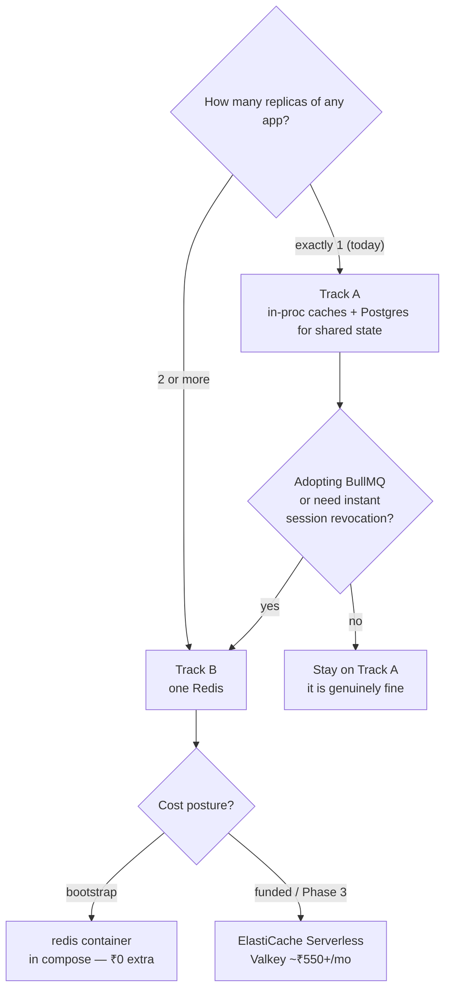

# Caching & Redis — infrastructure bible

*Both tracks, side by side: **Track A** (no Redis — in-process caches + Postgres for anything shared) and **Track B** (one Redis for the whole suite). Both cost postures: **bootstrap** (Maple Furnishers on one box, every ₹ counts) and **funded** (a paying white-label fleet, where an engineer-hour costs more than a cache node). The punchline up front: nothing in the suite needs Redis today, several things will need it the moment any app runs 2 replicas, and the cheapest correct move is to write code against a `CacheStore`/`RateLimitStore` interface now so the backend is a config change later. ₹ figures assume ~₹86/$ and are marked with sources; Mumbai (ap-south-1) list prices run roughly 5–15% above the US-East numbers most pricing pages quote.*

---

## 1. What actually needs caching or shared state (honest inventory)

Audit of the real code, not aspiration. "Scope" is where the state lives today; "breaks when" is the concrete failure, not a theoretical one.

| # | State | Where it is today | Scope today | Breaks when |
|---|-------|-------------------|-------------|-------------|
| 1 | **Brand/tenant lookup** | `maple-quotations/src/lib/brand.ts` — `Map` keyed by domain, 60 s TTL; `invalidateBrandCache()` clears the map. Suite apps carry vendored copies of the same pattern | Per **process** (so per container — 19 separate caches on the box) | Never truly *breaks* — worst case a brand edit takes 60 s to show in other containers. Annoying, not dangerous |
| 2 | **Flipt flag results** | Flag client evaluates against the Flipt container; results cached in-process briefly | Per process | Same as brand: bounded staleness, tolerable |
| 3 | **Login rate limiting** | `maple-quotations/app/api/auth/login/route.ts` — in-memory `Map` of failure timestamps, sliding 15 min window, max 8 failures per IP **and** per email. The file says it itself: *"In-memory — resets on restart, fine for a single-instance deploy"* | Per process | **The moment there are 2 replicas.** An attacker gets 8 attempts × N replicas (load balancer spreads them), and every deploy resets the counter to zero. This is the first real correctness casualty of scaling out |
| 4 | **Session revocation** | Doesn't exist. `mt_session` is a stateless JWT verified locally with the shared secret (`platform-architecture.md` §2) — there is no way to kill a stolen or fired-employee session before its natural expiry | Nowhere | The first security incident, or the first enterprise client who asks "how do you log someone out everywhere?" |
| 5 | **Job queues (BullMQ)** | Don't exist yet. The obvious first consumers: photoshoot ffmpeg renders, AI catalog parses via the maple-ai gateway, the outbox event dispatcher (`event-catalog.md` — dispatcher is "proposed, not built") | — | BullMQ **requires** Redis — there is no in-process mode. Adopting it *is* the Redis decision |
| 6 | **Idempotency keys** | Don't exist. Needed by event consumers (`event-catalog.md` mandates consumers "record processed OutboxEvent.ids and skip repeats") and eventually payment webhooks | — | First duplicate event delivery double-creates an order |
| 7 | **Hot product/catalog lookups** | Straight Prisma queries | — | Not yet. Postgres on the same box serves these in single-digit ms. This becomes real only with public storefront traffic (module-web / shared galleries at CDN-miss volume) |

The honest read: items 1–2 are *conveniences* (TTL caching works fine), items 3–4 are *correctness/security* state that must be shared, items 5–6 are *new capabilities* that arrive with the dispatcher and the AI gateway, item 7 is *later*.

### 1.1 Why the brand cache is the instructive example

Walk the actual flow in `brand.ts` because every future cache in the suite will rhyme with it:

- `getBrand()` derives the registrable domain from the request `Host` header, checks a module-level `Map`, and on a miss does `prisma.tenant.findFirst({ where: { domain } })` with a fallback chain (default tenant → any tenant → hardcoded `DEFAULT`).
- The cache entry is `{ value, timestamp }` with a 60 s TTL check on read — no background refresh, no size cap, no eviction.
- `invalidateBrandCache()` clears the **local map only**. It is called after admin edits, and it works — *in the admin container.* The other containers never hear about it and age out on TTL.

Three properties worth copying (TTL-on-read, DB fallback that can never fail closed, tiny code) and two worth fixing (unbounded keys from attacker-controlled `Host`, invalidation that only reaches one process). Every entry in the §5 contract table is a generalisation of this one function.

### 1.2 What NOT to cache (so nobody has to un-learn it later)

- **Session/user objects** — the JWT *is* the cache; that's the point of the stateless design. Caching user rows next to it creates two sources of truth for permissions.
- **Anything inside a Prisma transaction** — a cache read mid-transaction sees state the transaction may be about to change.
- **Quotation/order/invoice documents** — mutable business documents with money on them; the read volume doesn't justify the staleness risk. Postgres serves these fine.
- **AI responses at the module level** — dedupe/caching belongs in the maple-ai gateway (it owns the spend log and can cache per prompt-hash with full context); modules caching AI output re-creates the key-sprawl the gateway exists to kill.



## 2. TRACK A — no Redis: in-proc caches + Postgres for shared state

This is not a consolation prize. One box, one replica per app, Postgres already running: adding Redis here adds a moving part to babysit and nothing else. What Track A looks like done properly:

### 2.1 Keep the in-proc caches — they're correct at 1 replica

The 60 s brand cache and flag caches are exactly right for this shape. Two small fixes worth making anyway:

- **Cap the maps.** `brand.ts`'s cache is keyed by request `Host` — an attacker sending junk Host headers grows it unboundedly. Cap at ~500 entries with simple LRU-ish eviction (or only cache domains that resolved to a real tenant).
- **Put the cache behind an interface.** A five-line `CacheStore { get, set, del }` in `@maple/core` with the `Map` implementation today means Track B is swapping one import, not hunting vendored copies (the fold-in audit already documented `brand.ts` drift across repos).

### 2.2 Login rate limiting in Postgres

The shared-state version of the login guard, same semantics (sliding 15 min window, 8 failures per key), survives restarts and works at any replica count:

```sql
CREATE TABLE login_failure (
  key  text        NOT NULL,   -- 'ip:1.2.3.4' or 'email:x@y.com'
  at   timestamptz NOT NULL DEFAULT now()
);
CREATE INDEX login_failure_key_at ON login_failure (key, at);
```

```ts
async function tooManyFailures(key: string): Promise<boolean> {
  const rows = await prisma.$queryRaw<{ n: bigint }[]>`
    SELECT count(*) AS n FROM login_failure
    WHERE key = ${key} AND at > now() - interval '15 minutes'`;
  return Number(rows[0].n) >= 8;
}
// on failure: INSERT INTO login_failure (key) VALUES (...)  ×2 (email key, ip key)
// on success: DELETE FROM login_failure WHERE key = ${emailKey}
```

Housekeeping: a nightly `DELETE FROM login_failure WHERE at < now() - interval '1 day'` (cron on the box, or piggyback on the future dispatcher loop). Cost per login attempt: one indexed count + one insert — irrelevant at human login volume. If a hot path ever needs cheap counters (per-tenant API limits), use a fixed-window upsert instead of row-per-event:

```sql
CREATE TABLE rate_limit (
  key          text        NOT NULL,
  window_start timestamptz NOT NULL,
  count        int         NOT NULL DEFAULT 1,
  PRIMARY KEY (key, window_start)
);
-- one round trip, atomic:
INSERT INTO rate_limit (key, window_start) VALUES ($1, date_trunc('minute', now()))
ON CONFLICT (key, window_start) DO UPDATE SET count = rate_limit.count + 1
RETURNING count;
```

### 2.3 Advisory locks — Postgres as the coordination layer

Postgres advisory locks give "only one worker does X" without any new infrastructure — exactly what the outbox dispatcher needs so two accidental copies don't double-send events:

```sql
-- dispatcher startup / each poll tick: proceed only if we hold the lock
SELECT pg_try_advisory_lock(hashtext('maple:dispatcher'));
-- per-aggregate ordering inside a transaction (event-catalog.md requirement):
SELECT pg_advisory_xact_lock(hashtext('agg:' || $aggregateId));
```

Rules of thumb: use `pg_try_advisory_lock` (never the blocking form) for singleton loops, `pg_advisory_xact_lock` for short transactional sections, and remember session locks die with the connection — a crashed dispatcher releases its lock automatically, which is precisely the behaviour you want.

### 2.4 Session revocation on Track A

A `revoked_session (jti text PRIMARY KEY, expires_at timestamptz)` table, rows inserted on "log out everywhere"/"disable user", pruned past `expires_at`. The catch: checking it on **every request** re-introduces the DB round trip that stateless JWTs avoided. The honest Track A compromise: each app caches the revocation list in-proc for 30 s (it's tiny — revocations are rare events), giving bounded 30 s revocation latency instead of per-request DB hits. Ship this *before* the first external customer; "we cannot revoke a session" is a bad sentence in a security questionnaire.

### 2.5 Queues on Track A

If a queue is needed *before* Redis is justified, [pg-boss](https://github.com/timgit/pg-boss) (Postgres-backed, `SELECT … FOR UPDATE SKIP LOCKED` under the hood) handles the dispatcher and low-volume render jobs fine. Known limits: polling latency (~seconds), and throughput in the hundreds-of-jobs/sec range — far beyond current needs. Do **not** hand-roll a queue; use pg-boss or wait for BullMQ.

### When Track A is FINE (and it is, today)

- Exactly 1 replica of every app (true on the current box — 19 containers, one each).
- Login volume is humans, not APIs.
- No BullMQ, no sub-minute cross-container invalidation requirement.
- Cost posture bootstrap: Track A costs **₹0** and zero new ops surface. This is the correct posture for Maple Furnishers internal use and the first pilot.

## 3. TRACK B — one Redis for the whole suite

One Redis instance (not one per module — the suite's modules already share a Postgres; a shared Redis with disciplined key naming is the same trade). Everything below assumes Redis 7.x / Valkey and [ioredis](https://github.com/redis/ioredis) as the client.

### 3.1 Key naming convention — tenant-prefixed, module-scoped

Format: `{concern}:{tenantId}:{module}:{entity}[:{id}]` — colon-delimited, tenant **second** so `SCAN`ing a concern is easy and per-tenant wipes are a pattern match. Reserved top-level concerns:

| Prefix | Meaning | Example key |
|---|---|---|
| `c:` | Pure cache — losable, always has TTL | `c:t_maple:core:brand:maplefurnishers.com` |
| `rl:` | Rate limits — short TTL, must not be evicted early | `rl:login:ip:203.0.113.7` · `rl:login:email:<sha256-16>` |
| `rv:` | Revocations — TTL = remaining token life | `rv:sess:<jti>` |
| `idem:` | Idempotency keys | `idem:t_maple:orders:evt_<outboxEventId>` |
| `lock:` | Distributed locks (SET NX PX) | `lock:dispatcher` |
| `bull:` | BullMQ's own keyspace (it manages this) | `bull:renders:*` |

Notes: hash emails in rate-limit keys (keys are visible to anyone with Redis access — don't leak PII into `SCAN` output). Rate-limit and revocation keys are **not** tenant-prefixed where the protected resource is global (a login endpoint is attacked by IP, not by tenant). Use ioredis `keyPrefix` per module only for the `c:` namespace, never for `bull:` (BullMQ forbids client-level keyPrefix; pass its own `prefix` option instead).

### 3.2 TTLs per use case

| Use case | TTL | Why |
|---|---|---|
| Brand/tenant (`c:*:brand:*`) | 5 min (up from 60 s — Track B has real invalidation, §5, so TTL is just the backstop) | Brand edits are rare; invalidation handles the fast path |
| Flag results | 30–60 s | Flipt is local and fast; short TTL keeps flag flips snappy without pub/sub plumbing |
| Login rate limit | 15 min sliding (`ZADD` timestamps + `ZREMRANGEBYSCORE`, or fixed 15-min `INCR`+`EXPIRE` windows — fixed window is fine here) | Mirrors today's semantics |
| Session revocation | exact remaining token lifetime (`SET rv:sess:<jti> 1 EX <secondsLeft>`) | Key self-destructs when the token would have expired anyway — the set can never grow beyond live sessions |
| Idempotency keys | 7 days | Longer than any plausible redelivery window; cheap |
| Hot product lookups (later) | 1–5 min | Read-heavy, tolerant of staleness |
| BullMQ | n/a — jobs have no TTL | Managed by BullMQ; see eviction below |

### 3.3 Eviction policy — the one non-obvious decision

Default instinct is `allkeys-lru`. **Wrong for this workload**: the instance holds rate limits, revocations, idempotency keys, and BullMQ jobs — evicting any of those under memory pressure silently breaks correctness (a "cache" that evicts a revocation un-revokes a session). BullMQ's production guidance is explicit: set `maxmemory-policy` to `noeviction` ([BullMQ docs — Going to production](https://docs.bullmq.io/guide/going-to-production)).

So: **`maxmemory 256mb` + `maxmemory-policy noeviction`**, alert at 80% used, and keep the `c:` namespace honest with short TTLs so pure cache never accumulates. If cache volume ever genuinely competes with correctness keys, split into two logical instances (a second `redis` compose service costs nothing) — don't loosen eviction on the one holding queues.

### 3.4 Persistence — RDB vs AOF

| | RDB (snapshots) | AOF (`appendfsync everysec`) |
|---|---|---|
| What survives a crash | State as of last snapshot (minutes old) | All but ≤1 s of writes |
| Cost | Cheap, small files | ~more disk + slight write overhead |
| Right for | Caches, rate limits, revocations (worst case: a 15-min rate window resets — same blast radius as today's deploy-resets behaviour) | **Queues.** A crashed Redis eating accepted-but-unprocessed render jobs is data loss |

Decision rule: **before BullMQ, RDB (the container default) is enough. The day BullMQ carries its first real job, turn on AOF `everysec`.** In compose: `command: redis-server --appendonly yes --maxmemory 256mb --maxmemory-policy noeviction` with a named volume. On ElastiCache Serverless, durability is managed for you and this whole row disappears — part of what the ₹ buys.

### 3.5 ioredis patterns per module

One shared connection module in `@maple/core` (the same "publish it once, kill vendored drift" rule as everything else on the platform):

```ts
// @maple/core/lib/redis.ts
import Redis from "ioredis";

const url = process.env.REDIS_URL;           // absent ⇒ Track A fallbacks stay active
export const redis = url
  ? new Redis(url, {
      lazyConnect: true,                      // don't block boot on Redis
      maxRetriesPerRequest: 2,                // fail fast on the request path…
      retryStrategy: (n) => Math.min(n * 200, 5_000),
      enableOfflineQueue: false,              // …never queue writes into the void
    })
  : null;

// BullMQ needs its own connection with different rules — do NOT share the one above
export const makeBullConnection = () =>
  new Redis(url!, { maxRetriesPerRequest: null });  // required by BullMQ
```

The rate limiter, Track B version — same semantics as today's login guard, one round trip on the hot path, with the Track A fallback wired in so `REDIS_URL` is genuinely the only switch:

```ts
// @maple/core/lib/rate-limit.ts
// Fixed 15-min windows: an attacker gets at most `max` tries per window boundary.
// (Sliding-window via ZADD/ZREMRANGEBYSCORE is available if the boundary burst
// ever matters; for 8 tries / 15 min on a login form, fixed-window is fine.)
export async function limitExceeded(key: string, max = 8, windowSec = 900): Promise<boolean> {
  if (!redis) return pgLimitExceeded(key, max, windowSec);      // Track A path (§2.2)
  try {
    const bucket = Math.floor(Date.now() / (windowSec * 1000));
    const k = `rl:${key}:${bucket}`;
    const n = await redis.incr(k);
    if (n === 1) await redis.expire(k, windowSec);
    return n > max;
  } catch (e) {
    log.error("rate-limit backend down, failing open", e);       // never lock everyone out
    return false;
  }
}
```

And the idempotency helper for event consumers (`event-catalog.md`'s "record processed event ids" requirement, in one atomic call):

```ts
// returns true exactly once per event id per consumer — NX is the whole trick
export async function firstDelivery(consumer: string, eventId: string): Promise<boolean> {
  const set = await redis.set(`idem:${consumer}:evt_${eventId}`, "1", "EX", 7 * 86400, "NX");
  return set === "OK";
}
```

Per-module usage rules:

- **Auth/login (rate limits):** if Redis is down, *fail open* for reads (let logins proceed) but log loudly — a cache outage must not lock every user out. Revocation checks are the exception: fail *closed* only for explicitly high-security tenants, otherwise open with alerting; document the choice.
- **Brand/flags (`c:`)**: cache-aside — try Redis, fall through to Prisma, `SET … EX`. Keep the in-proc 60 s map *in front of* Redis as an L1; Redis is the shared L2 that makes invalidation work.
- **Workers (BullMQ):** separate connection via `makeBullConnection()`; workers live in the queue-owning module's container (photoshoot renders in photoshoot).
- **Everything** goes through `@maple/core` helpers (`rateLimit()`, `cached()`, `revokeSession()`) — no module touches `redis` directly, which is what keeps Track A/Track B a config switch.

### 3.6 BullMQ queue design (the day it arrives)

| Queue | Owner module | Jobs | Concurrency | Job options |
|---|---|---|---|---|
| `renders` | photoshoot | ffmpeg transcode/watermark per asset | 2 per worker (each job pegs a core) | `attempts: 3`, exponential backoff from 30 s, `removeOnComplete: 500`, `removeOnFail: 2000` |
| `ai-jobs` | maple-ai gateway | catalog parses, batch generations | 4 | `attempts: 2` (AI retries are ₹ — don't loop), per-tenant `jobId` prefix for tracing |
| `outbox` | dispatcher | deliver pending OutboxEvent rows | 1 (ordering per aggregate — `event-catalog.md`) | `attempts: 5`, then row marked `failed` for the dead-letter review |

Rules: workers run inside the owning module's container (no separate worker fleet until measurement demands it); `removeOnComplete`/`removeOnFail` are **mandatory** — unbounded completed-job lists are the classic way a 256 MB Redis fills itself; queue names are global (not tenant-prefixed) with `tenantId` in the job payload, because BullMQ concurrency/limits apply per queue and per-tenant queues would fragment them.

### 3.7 Where the Redis lives — ₹ comparison

| Option | ₹/month | What you get / give up |
|---|---|---|
| **Self-hosted container** (one more compose service on the existing box) | **~₹0** (≈300 MB RAM on a box already paid for) | You own persistence, upgrades, memory alarms. On a box that already runs Postgres the same way, this is not a new *kind* of burden. Fits bootstrap posture and Phases 1–2 of `aws-deployment.md` |
| **ElastiCache Serverless (Valkey)** | floor **~₹530/mo** ($6.13: 100 MB min × $0.084/GB-hr × 730 h) + $0.0023 per million ECPUs; effectively ~₹550–900 at our volumes | Zero ops, scales itself, managed durability. Valkey's 100 MB minimum makes serverless finally sane for small workloads ([AWS ElastiCache pricing](https://aws.amazon.com/elasticache/pricing/), [Cloudchipr breakdown](https://cloudchipr.com/blog/amazon-elasticache-pricing)) |
| **ElastiCache Serverless (Redis OSS)** | floor **~₹7,800/mo** ($91.25: 1 GB minimum × $0.125/GB-hr) | Same product, 15× the floor because of the 1 GB minimum metering — **avoid**; pick Valkey ([Upstash's ElastiCache cost analysis](https://upstash.com/blog/aws-elasticache-pricing-explained-2026-full-cost-breakdown)) |
| **ElastiCache node** `cache.t4g.micro` (0.5 GiB) | **~₹800–1,100/mo** (Valkey $0.0128/hr ≈ $9.34; Redis OSS $0.016/hr ≈ $11.68; Mumbai a touch higher) ([Vantage](https://instances.vantage.sh/aws/elasticache/cache.t4g.micro), [Economize](https://www.economize.cloud/resources/aws/pricing/elasticache/cache.t4g.micro/)) | Fixed price, predictable, but *you* pick the size and pay it idle; `cache.t4g.small` (1.37 GiB) ≈ ₹2,000/mo |
| **Upstash (off-AWS, per-request)** | free tier 256 MB / 500K commands/mo; then $0.20 per 100K commands ([Upstash pricing](https://upstash.com/pricing/redis)) | Cheapest at spiky/low volume and scales to zero — but adds an external vendor + public-internet latency; sits oddly next to an all-AWS Phase 2/3. Worth knowing, not recommending |

Network hygiene for the managed options (the §3.8 "never publish 6379" rule, translated): ElastiCache lives in the VPC behind a security group admitting 6379 **only from the app security group** — the same `db-sg` pattern as RDS in [deployment-runbook.md](deployment-runbook.html) Stage 1 — with **TLS in transit + AUTH/RBAC enabled** (Serverless turns TLS on by default; node clusters must ask at creation). The §3.5 helper then connects via `rediss://`, which ioredis handles from the URL scheme alone.

Decision: **bootstrap posture → self-hosted container. Funded posture / Phase 3 (apps on Fargate, no "the box" anymore) → ElastiCache Serverless Valkey.** The node option only wins if usage is high and flat enough that ~₹800 fixed beats serverless metering — measure before switching; don't guess.

### 3.8 Running the self-hosted flavour — compose block + ops

The whole §3 configuration as one compose service (this is the entirety of the "self-hosted Redis" commitment):

```yaml
redis:
  image: valkey/valkey:8            # Valkey: same protocol, BSD-licensed, what ElastiCache runs
  command: >
    valkey-server
    --maxmemory 256mb
    --maxmemory-policy noeviction
    --appendonly no                 # flip to yes + appendfsync everysec when BullMQ ships (§3.4)
    --save 900 1 --save 300 100     # RDB snapshots meanwhile
  volumes: [redisdata:/data]
  healthcheck:
    test: ["CMD", "valkey-cli", "ping"]
    interval: 15s
    timeout: 3s
    retries: 3
  restart: unless-stopped
  deploy:
    resources:
      limits: { cpus: "0.50", memory: 384M }   # container cap > maxmemory + overhead
  # NOTE: no ports: — apps reach it on the compose network as redis:6379.
  # Never publish 6379 on a box with a public IP; exposed Redis is a classic breach.
```

Ops surface, honestly listed (this is what "you own it" means):

| Concern | What to do | Effort |
|---|---|---|
| Memory | Alarm when `INFO memory` `used_memory` > 80% of maxmemory (node-exporter/CloudWatch agent, or a cron + `valkey-cli INFO` to start). With `noeviction`, hitting the cap makes **writes fail** — the alarm is the safety margin | set up once |
| Persistence | Nothing until BullMQ; then AOF everysec + confirm `redisdata` is on the backed-up volume plan | 10 min, once |
| Upgrades | Bump the image tag with the monthly box `apt` window; Valkey minor upgrades are restart-cheap (apps reconnect via ioredis retry) | ~5 min/mo |
| Incident one-pager | "Redis down": apps keep serving (caches fall through to Postgres, rate limits fail open per §3.5, queues pause and drain on recovery). That designed-in degradation is *why* the client code rules matter | write once |

The one-pager itself, pre-written (the §3.5 client rules are what make it this short):

```bash
docker compose ps redis
docker compose exec redis valkey-cli ping                       # PONG, or it's down
docker compose exec redis valkey-cli INFO memory | grep -E 'used_memory_human|maxmemory_human'
docker compose logs --since 15m redis
```

- **Down (no PONG).** What *breaks*: BullMQ — workers idle, new enqueues throw (enqueue routes should catch and surface "try again shortly", not 500). What *degrades*: `c:` caches fall through to Postgres (slower, still correct), rate limits fail open with loud error logs (§3.5), revocation checks follow the documented per-tenant fail-open/closed choice (§3.5). Fix: `docker compose restart redis`; with AOF on, queued jobs resume where they were — RDB-only, re-enqueue in-flight jobs from their source records (the §2.8-adjacent "a lost job is re-enqueueable" property is why RDB was acceptable pre-BullMQ).
- **Full (`OOM command not allowed when used memory > 'maxmemory'`).** Under `noeviction` this is a *write* outage — reads still serve, so the site looks fine while queues and rate limits silently fail. Reclaim, safest first: `docker compose exec redis sh -c "valkey-cli --scan --pattern 'c:*' | xargs -L 100 valkey-cli DEL"` — the `c:` namespace is losable by definition (§3.1). If `INFO keyspace` says `bull:` is the bulk, a queue is missing `removeOnComplete`/`removeOnFail` (§3.6) — fix the job options, then trim. Raise `maxmemory` only together with the container's memory limit (§3.8 block), and ask afterwards why the 80% alarm never bought you the warning.

## 4. Side by side + adoption triggers

| Concern | Track A (Postgres + in-proc) | Track B (one Redis) |
|---|---|---|
| Brand/flag caching | 60 s in-proc TTL, per container | in-proc L1 + shared L2, real invalidation |
| Login rate limiting | `login_failure` table (§2.2) | `rl:` keys, INCR/EXPIRE |
| Session revocation | table + 30 s in-proc cache (30 s latency) | `rv:` key with token-life TTL (instant) |
| Queues | pg-boss (seconds latency, modest throughput) | BullMQ (the real answer for ffmpeg + AI jobs) |
| Locks | advisory locks | `SET NX PX` (or keep advisory locks — they're fine) |
| New ops surface | none | one process: memory alarm, persistence, upgrades |
| ₹/month | 0 | 0 (self-hosted) → ~₹550–1,100 (managed) |
| Correct at N replicas | rate limits/revocation yes (DB-backed); caches degrade gracefully | yes, all of it |

**Triggers — adopt Track B when the first of these happens (in likely order):**

1. **Any app runs 2 replicas.** This is the real one. The in-memory login guard becomes a security hole the same hour (`8 failures × N replicas`, reset on deploy). Note [aws-deployment.md](aws-deployment.html)'s Phase 3 and any `docker compose up --scale` experiment both cross this line.
2. **BullMQ is adopted** — photoshoot render queue or the maple-ai gateway's job handling. BullMQ *is* Redis; no partial credit.
3. **Instant session revocation becomes a requirement** — enterprise client security review, or the first incident.
4. *(Weak trigger)* measured Postgres pressure from cacheable reads — at current scale this is the least likely to fire first.

Until one fires, Track A + the `CacheStore` interface is the whole recommendation.

### 4.1 The day trigger 1 fires — the actual switch, as a checklist

Assuming the §2 seams were built, going A→B is an afternoon, not a project:

1. Add the §3.8 `redis` service to compose (or provision ElastiCache Serverless Valkey and put its endpoint in Secrets Manager as `maple/prod/redis-url`).
2. Set `REDIS_URL` in each module's env file — `@maple/core`'s stores switch implementation on presence of the var; nothing else changes.
3. Deploy modules in any order — mixed mode is safe *for caches* (worst case: one module reads slightly staler brand than another for a TTL period).
4. The one ordering rule: **rate limiting and revocation must not run split-brain for long.** During the rollout window the Postgres tables and Redis keys both exist; the Postgres implementations keep enforcing until the last module flips, so the window is safe — just don't park halfway for a week.
5. Delete nothing. `login_failure` and `revoked_session` stay as the documented Track A fallback (and the `REDIS_URL`-absent path keeps working in dev and in any single-box customer instance that never adopts Redis).
6. Add the memory alarm (§3.8) before calling it done — an unmonitored `noeviction` Redis is a write outage on a timer.

## 5. Cache invalidation contracts — who busts what

Today's gap in one sentence: `invalidateBrandCache()` clears **one process's map** — the admin container that handled the edit — while the other 18 containers (and standalone quotations) serve stale brand for up to 60 s. Acceptable now; write the contract down so it stays deliberate:

| Mutation | Event (per `event-catalog.md` envelope) | Keys to bust | Track A behaviour | Track B behaviour |
|---|---|---|---|---|
| Tenant branding/domain edited (admin) | `tenant.updated` `{ tenantId, domains[] }` | `c:{tenantId}:core:brand:*` for every domain of the tenant | Rely on 60 s TTL (documented, bounded staleness) | Mutating app `DEL`s the L2 keys + publishes `inval` (below); TTL remains the backstop |
| Flag flipped (Flipt console / plan sync) | `tenant.entitlements_changed` | flag-result keys for the tenant | 30–60 s TTL | same pattern |
| User disabled / password reset | `user.revoked` `{ jti[] or userId }` | n/a — *writes* `rv:` keys | revocation table insert | `SET rv:sess:<jti> EX <ttl>` |
| Product updated (later) | `product.updated` | `c:{tenantId}:catalog:product:{id}` | TTL | DEL + publish |

Track B fast path — one tiny pub/sub channel, subscribed by every app's `@maple/core` cache layer, used only to clear **L1 in-proc** maps (L2 was already `DEL`ed by the mutator):

```ts
// mutator:   redis.del(...keys); redis.publish("inval", JSON.stringify({ keys }));
// every app: sub.subscribe("inval"); sub.on("message", (_, m) => l1.deleteAll(JSON.parse(m).keys));
```

Contract rules: (1) the module that owns the table owns the invalidation — nobody else busts your keys; (2) every cached key **always** has a TTL even with pub/sub, so a missed message heals itself; (3) when the outbox dispatcher lands, `tenant.updated` flows through it and the cache layer becomes just another consumer — no parallel invalidation channel to maintain.

## 6. Recommendations per posture

**Bootstrap (today — Maple Furnishers + first pilot on one box):**

1. Stay on **Track A**. Do not add Redis; add the seams: `CacheStore` + `rateLimit()` + `revokeSession()` interfaces in `@maple/core` with Postgres/in-proc implementations (§2.2–2.4). ~2 dev-days total, ₹0/month.
2. Move the login guard to the `login_failure` table now anyway — it's a one-file change, survives restarts, and removes the only *correctness* landmine on the list before anyone trips it.
3. Ship the revocation table before any external customer (Stage 5 B-task material — same tier as the RBAC fixes).

**Funded / scale-out (Phase 3 shape, white-label fleet, BullMQ live):**

1. **Track B, ElastiCache Serverless Valkey** (~₹550–900/mo floor) — the one-box "self-host it free" logic dies when the apps leave the box for Fargate. Self-hosted-in-compose remains correct for any customer still on a single-box instance-per-customer deployment.
2. Adopt the key convention (§3.1), `noeviction` + 256 MB alarm (§3.3), AOF the day BullMQ ships (§3.4).
3. Flip the `@maple/core` store implementations via `REDIS_URL` — if §2's seams were built, no module code changes.

One Redis, not many: revisit only if a single noisy tenant's queue traffic measurably starves rate-limit latency — that's a Phase-4 problem and a nice one to have.

---

*Related docs: [aws-deployment.md](aws-deployment.html) (phases and cost posture) · [deployment-runbook.md](deployment-runbook.html) (where the compose service or ElastiCache lands) · [event-catalog.md](event-catalog.html) (outbox envelope the invalidation contract rides on) · [infra-containers.md](infra-containers.html) (the replica-count decisions that trigger Track B) · [platform-architecture.md](platform-architecture.html) (`@maple/core` as the home of the cache seams).*
