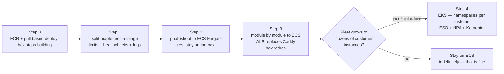

# Docker & Kubernetes — infrastructure bible

*Both tracks, side by side: **Track A** (Docker Compose in production, done properly — the current reality, hardened) and **Track B** (an orchestrator — ECS Fargate or Kubernetes/EKS — for when the fleet is real). Both cost postures: **bootstrap** (one box, ₹2–4k/mo, every container hand-countable) and **funded** (paying white-label customers, where downtime and engineer-hours cost more than compute). Written against the actual `Dockerfile`, `docker-compose.yml` and `Caddyfile` in this repo, and against `aws-deployment.md`'s standing principle #1: "No Kubernetes until a human being is hired to run it." This doc is the long-form argument for why that principle is right, and what to do instead at each stage. ₹ at ~₹86/$; Mumbai (ap-south-1) runs ~5–15% above the US-East list prices most sources quote.*

---

## 1. Today's container reality — the one-image `APP=<name>` pattern

What actually runs: **one image** (`maple-suite:latest`), built from a 13-line `Dockerfile`, instantiated as **19 app containers** (web, admin, leads, crm, quotations, orders, challans, invoices, payments, catalog, photoshoot, inventory, purchase-orders, finance, expenses, hr, users, tasks, docs) plus `postgres:16`, `flipt`, `caddy`, and a one-shot `migrate` job — 23 containers on one box. Each app container is the same image with a different `APP` env var; the CMD dispatches: `npm run -w @maple/app-${APP} start`. Caddy terminates TLS and routes one subdomain per module.

### 1.1 The build, layer by layer

| Layer | Line | What it does | The catch |
|---|---|---|---|
| 1 | `FROM node:22-bookworm-slim` | ~75 MB compressed base | Fine |
| 2 | `ENV NODE_ENV=production` | Sets prod mode for every later step | Means `npm install` omits `devDependencies` — so every build tool the repo needs must live in `dependencies`, inflating the runtime image |
| 3 | `apt-get install ffmpeg openssl ca-certificates` | ffmpeg for photoshoot renders, openssl for Prisma | **ffmpeg (several hundred MB installed) ships in all 19 containers; exactly one needs it** |
| 4 | `COPY . .` | Whole repo in one layer | Any commit — a README typo — invalidates this layer and *everything after it*: full `npm install`, full turbo build of all 19 apps, on every deploy |
| 5 | `RUN npm install && npm run build` | Installs the workspace, turbo-builds every app | The slowest possible cache shape; also ships source + full `node_modules` + every app's `.next` output in the final image |
| 6 | `npm install -g serve` | Static server for `apps/web/dist` | Fine |

Measure it honestly on the box: `docker images maple-suite` and `docker history maple-suite:latest` — expect **multiple GB** (node_modules for a 19-app workspace + ffmpeg + 19 build outputs). No slimming has been attempted; that is a deliberate, defensible bootstrap choice — but it should be a *known* number, not a surprise.

### 1.2 One-image-for-19-apps vs per-module images — the actual tradeoff

| | One shared image (today) | Per-module images |
|---|---|---|
| Build | One build, one tag — a version *of the suite* | 19 builds (turbo + `docker build` per app with [`turbo prune`](https://turborepo.com/docs/reference/prune) + multi-stage + Next `output: "standalone"` → ~150–250 MB each) |
| Consistency | Impossible for modules to drift — everyone runs the same commit of `@maple/core` | Version skew possible (also: version *independence* possible — that's the point) |
| Disk on the box | Cheap: 19 containers share **one** image's layers — one copy on disk | 19 × smaller images; total similar or less |
| Deploy blast radius | Every deploy redeploys the world; rollback is all-or-nothing | Deploy/rollback per module — the microservice contract from `aws-deployment.md` §3 |
| Build time | O(all apps), every time (layer 4 cache-bust) | O(changed app) with remote turbo cache |
| Security surface | ffmpeg + full source + dev tooling in every container | Only what each module needs |
| Registry cost | One multi-GB image per version in ECR ($0.10/GB-mo — a 4 GB image × 20 retained tags ≈ ₹700/mo; lifecycle-policy it) | Many small images; ECR dedupes shared layers poorly across repos — still cheap |

**Verdict:** the one-image pattern is *correct today* — one box pulls one image, disk-shared 19 ways, and the suite genuinely is one versioned thing. It becomes wrong at the exact moment modules need independent deploys or an orchestrator schedules them onto different machines (each node then pulls multi-GB for one 300 MB app). **The cheap middle step, worth doing before any orchestrator: split into two images** — `maple-suite` (no ffmpeg, 18 apps) and `maple-media` (ffmpeg, photoshoot) — and add `.dockerignore` + reorder the Dockerfile (`COPY package*.json` → `npm install` → `COPY . .` → build) so dependency layers survive code-only commits.

### 1.3 The improved Dockerfile — do this before any orchestrator

The two-image split plus layer reordering, concretely. Shared image first (18 apps, no ffmpeg):

```dockerfile
# Dockerfile — maple-suite (everything except photoshoot)
FROM node:22-bookworm-slim AS build
WORKDIR /repo
RUN apt-get update && apt-get install -y --no-install-recommends openssl ca-certificates \
  && rm -rf /var/lib/apt/lists/*
# Dependency layers first: survive every commit that doesn't touch package files
COPY package.json package-lock.json turbo.json ./
COPY apps ./apps
COPY packages ./packages
# (better: COPY only the package.json files first via `turbo prune` or a scripted
#  copy, npm ci, then COPY the source — the two-step above is the 80/20 version)
ENV NODE_ENV=production
RUN npm ci && npm run build
RUN npm install -g serve@14
EXPOSE 3000
CMD ["sh","-c","npm run -w @maple/app-${APP} start -- -p 3000 -H 0.0.0.0"]
```

And the media image, which is just the same file with ffmpeg added — built `FROM` the suite image so it reuses every layer:

```dockerfile
# Dockerfile.media — maple-media (photoshoot only)
FROM maple-suite:latest
RUN apt-get update && apt-get install -y --no-install-recommends ffmpeg \
  && rm -rf /var/lib/apt/lists/*
```

Plus a `.dockerignore` that today doesn't exist: `node_modules`, `.git`, `**/.next`, `docs`, `e2e` — without it, `COPY . .` ships the box's git history into the build context on every deploy. When per-module images become worthwhile (orchestrator era), the pattern is `turbo prune --scope=@maple/app-quotations --docker` → multi-stage → Next `output: "standalone"` (~150–250 MB per app); the [Turborepo Docker guide](https://turborepo.com/docs/guides/tools/docker) is the canonical recipe. Not worth doing for 19 apps while they all deploy together anyway.

### 1.4 Registry plan — ECR

Today images are built *on the target box* (`deploy-prod.yml` does `git pull` + `compose up --build` — `cicd-pipeline.md` confirms: "no image registry"). The plan of record is `deployment-runbook.md` Stage 2: ECR repos (`maple-suite`, `maple-quotations`, `maple-photoshoot`, `maple-ai`), GitHub OIDC (no static AWS keys), scan-on-push, every image tagged `latest` **and** the git SHA so rollback = redeploy the previous SHA. Non-optional rider on every repo: the lifecycle policy — **expire untagged after 7 days, keep the last 10 images** (concrete JSON in §6.5, applied via `put-lifecycle-policy` in the runbook's Stage 2) — because SHA-per-deploy at multi-GB per image fills ECR forever otherwise, and the 10 retained images *are* the deliberate rollback window. Everything in §5 below assumes that stage is done; it is the single highest-leverage container change available (fast deploys, real rollback, box never needs source).

## 2. TRACK A — Compose in production, done well

Compose in production is not a hack; it's the right tool for this shape (one box, ~23 containers, 2–5 people) — the position argued at length in the "do you need K8s" literature (§3.1). But *bare* compose — which is what runs today — leaves five gaps. The hardened service block:

```yaml
# docker-compose.prod.yml — the hardened per-app template
quotations:
  image: ${ECR}/maple-suite:${TAG:-latest}     # pulled, never built on the box
  env_file: .env
  environment: { APP: quotations }
  depends_on:
    postgres: { condition: service_healthy }
    migrate:  { condition: service_completed_successfully }
  healthcheck:                                  # requires the /api/health endpoint (runbook task D2)
    test: ["CMD-SHELL", "node -e \"fetch('http://localhost:3000/api/health').then(r=>{if(!r.ok)process.exit(1)}).catch(()=>process.exit(1))\""]
    interval: 30s
    timeout: 5s
    retries: 3
    start_period: 20s
  restart: unless-stopped
  deploy:
    resources:
      limits:   { cpus: "0.50", memory: 512M }  # honoured by docker compose (non-swarm) since v2
      reservations: { memory: 256M }
  logging:
    driver: json-file
    options: { max-size: "10m", max-file: "3" } # today: unbounded logs on a 60 GB disk
  profiles: ["core"]
```

The five gaps, and what each line buys:

1. **Healthchecks** (needs `/api/health` — already runbook task D2). Without them `restart: unless-stopped` only catches *crashes*; a wedged Next.js process serving 500s stays "up" forever. With them: auto-restart on failure, `depends_on: condition: service_healthy` ordering, and `--wait` deploys (below).
2. **Restart policies** — already present (`unless-stopped`) — the one thing today's compose gets right. Keep `migrate` at `restart: "no"`.
3. **Resource limits.** Today one runaway ffmpeg render or a leaking module can OOM the *box* and take all 19 apps + Postgres with it. Limits convert "the box dies" into "one container gets OOM-killed and restarts." Per-module numbers in §4.
4. **Log config.** `json-file` grows unbounded by default; a chatty container fills the disk, and a full disk kills Postgres. Two lines, do it everywhere (or set defaults in `/etc/docker/daemon.json`).
5. **Compose profiles per plan/customer.** White-label instance-per-customer means not every customer buys every module. Tag services — `profiles: ["core"]` for admin/users/tasks/docs, `["sales"]` for leads/crm/quotations/orders, `["ops"]` for inventory/challans/purchase-orders, `["money"]` for invoices/payments/finance/expenses, `["media"]` for catalog/photoshoot, `["hr"]` — then a customer's box runs `COMPOSE_PROFILES=core,sales docker compose up -d`. Selling a module = adding a profile + flipping the Flipt flag; the two must stay in sync (plan→flag sync is `platform-architecture.md` step ⑥ — drive profiles from the same source).

### 2.1 Box hygiene compose won't do for you

Four habits that belong in the Stage 4 bootstrap script, because each has ended a small-team production box:

```jsonc
// /etc/docker/daemon.json — defaults so no service can forget the logging block
{ "log-driver": "json-file", "log-opts": { "max-size": "10m", "max-file": "3" } }
```

- **Image garbage collection.** Every deploy leaves the previous multi-GB image behind; `docker image prune -f` already runs at the end of all three deploy workflows (dev, staging, prod) — keep it when the deploy step gets rewritten for ECR pulls, and add a weekly `docker system prune -af --volumes=false` cron (never `--volumes` on this box: `pgdata` lives there until Phase 2, and `caddy_data` — the Let's Encrypt cert store — lives there forever; wiping it means ~20 subdomains of re-issue retries straight into rate limits, which is why the runbook's Stage 4 nightly backup tars that volume alongside the pg_dumps).
- **Clock discipline — the box runs UTC.** `timedatectl set-timezone UTC` in the same bootstrap session, and confirm `timedatectl` shows NTP synchronized. Every cron in this doc and the runbook is written in UTC (00:30 UTC = 06:00 IST); a box on IST next to containers on UTC is how "nightly" jobs run mid-business-day, and the suite has already paid the date-boundary tax once in the expenses module — don't buy it again at the infrastructure layer.
- **Disk alarm at 80%** (CloudWatch agent — already in the runbook's Stage 4 monitoring list). A full disk on this box doesn't degrade gracefully; it corrupts Postgres WAL. This is the highest-severity alarm on the box, above CPU.
- **`migrate` is the deploy gate.** `docker compose run --rm migrate` before `up -d` (as the runbook's Stage 4 first-deploy already does) — never let 19 app containers race a half-applied schema. Note `cicd-pipeline.md`'s honest flag that this runs `prisma db push`, not versioned `migrate deploy`; switching to real migrations is a prerequisite for *any* multi-replica story on either track (two replicas must agree on the schema mid-deploy). Two honesty notes against today's compose file: the bare `depends_on: [postgres, migrate]` list form only orders *startup* — it does not wait for migrate to finish (that's what the template's `condition: service_completed_successfully` buys), and the migrate command ends in `|| true` on the seed step, so "migrate ran" currently proves less than it sounds — a failed seed never blocks the apps.
- **Connection arithmetic.** Postgres 16 defaults to `max_connections = 100`; Prisma's default pool per process is `num_physical_cpus × 2 + 1` — **5 on a 2-vCPU box** — and 18 of the 19 app containers open one (web is a static server). 18 × 5 = 90 idle connections before `migrate`, a debugging `psql`, or the future dispatcher take theirs; exhaustion presents as random modules 500ing with `FATAL: sorry, too many clients already`. The fix is one query-param on every `DATABASE_URL`: `?connection_limit=3&pool_timeout=20` (54 total, headroom restored) — raise a *specific* module on measured pool-timeout errors, never the default. The arithmetic follows the apps to RDS: the instance-wide ceiling (`db.t4g.small` derives roughly 170–225 from memory) is shared by **all** module databases on the instance, not per database.

### 2.2 Zero-downtime-ish deploys with compose

Honest framing: plain compose recreates a container in place — a few seconds of 502s per service. Three tiers, in order of effort:

- **Tier 1 (do now):** pull-then-update with health gating: `docker compose pull && docker compose up -d --no-deps --wait <changed services>`. `--wait` blocks until healthchecks pass, so a bad image fails the deploy *visibly* instead of serving errors. Pair it with a one-line addition per Caddyfile site block — `lb_try_duration 5s` inside each `reverse_proxy` (today's blocks are bare one-liners with no retry window) — so Caddy holds and retries across the recreate: most users then see a slow request, not an error.
- **Tier 2 (cheap, when a pilot customer is live):** [docker-rollout](https://github.com/wowu/docker-rollout), a small compose plugin that scales a service to 2, waits for the new container's healthcheck, then retires the old one — rolling deploys without leaving compose. Requires healthchecks (tier 0) and no fixed `container_name`/host-port bindings on app services (true today — only caddy binds ports).
- **Tier 3 (don't):** blue/green with two compose projects and Caddy re-pointing. By the time this feels necessary, the answer is §3, not more compose scaffolding.

**Track A ceiling — where compose genuinely stops:** one box (vertical scaling only, and the box is a SPOF — mitigated, per `aws-deployment.md` Phase 2, by keeping nothing precious on it: RDS + S3 + ECR mean box-death = 30-min rebuild); no multi-replica scheduling; no autoscaling for ffmpeg bursts beyond what the box absorbs; per-customer boxes multiply ops linearly. Those are the real triggers in §7 — not "compose isn't web-scale."

## 3. TRACK B — orchestrators: the honest fit analysis first

### 3.1 Does a 2–5 person team need Kubernetes? (what practitioners actually say)

The practitioner literature is unusually unanimous for infrastructure discourse:

- Common rules of thumb: under ~20 containers / fewer than 6–7 engineers touching infra / single-host-sufficient → Compose or a PaaS beats K8s ([Raff Technologies: K8s vs Compose for small teams](https://rafftechnologies.com/learn/guides/kubernetes-vs-docker-compose-small-teams), [byteiota: "90% don't need it"](https://byteiota.com/kubernetes-is-overkill-90-dont-need-it/)). Maple is 2–5 people and ~23 containers that idle on one box — over the container count, far under everything else.
- Production-readiness on K8s is a **6–12 month** learning curve for an experienced engineer, vs weeks for Compose ([Wojciechowski: "overkill for 80% of projects"](https://wojciechowski.app/en/articles/kubernetes-overkill)); teams report the ops tax directly — one 8-engineer team logged 60 h/week on cluster care before retreating to Compose ([HN: "Kubernetes was overkill, we moved to Compose"](https://news.ycombinator.com/item?id=46576224), [the write-up](https://blog.stackademic.com/kubernetes-was-overkill-we-moved-to-docker-compose-and-saved-60-hours-3e7811122135)).
- Teams run substantial real workloads on Compose without drama — e.g. 500K logs/day ([dev.to](https://dev.to/polliog/kubernetes-is-overkill-for-99-of-apps-we-run-500k-logsday-on-docker-compose-2ode)); the recurring advice is to move only when the simpler system breaks at the seams — many services with independent scaling needs, multi-node/multi-region, or a fleet too large to run as boxes ([Medium/CodeX](https://medium.com/codex/kubernetes-is-overkill-for-90-of-startups-just-use-docker-compose-73b561b35c92)).

Applied here: **the only Maple future that earns Kubernetes is a large instance-per-customer white-label fleet** (tens of customers × per-customer isolation — namespaces, quotas, one control plane instead of N boxes). A handful of customers doesn't earn it; ECS does that with far less machinery. Hence the two-step below.

### 3.2 EKS vs ECS Fargate — ₹ at our scale

"Our scale" = the §4 profile: 19 modules + ai-gateway + flipt, mostly 0.25 vCPU / 512 MB, always-on, ~6 vCPU / 14 GB requested total, low traffic.

| | **ECS + Fargate** | **EKS** (managed K8s) |
|---|---|---|
| Control plane | **₹0** — ECS has no cluster fee | **~₹6,300/mo** ($0.10/hr = $73/mo) per cluster, idle or not; $0.60/hr (~₹37k/mo) if the K8s version lapses into extended support ([AWS EKS pricing](https://aws.amazon.com/eks/pricing/), [ECS vs EKS vs Fargate](https://tech-insider.org/ecs-vs-eks-vs-fargate-2026/)) |
| Compute for our profile | Fargate: $0.04048/vCPU-hr + $0.00444/GB-hr (us-east-1 2026 list; Mumbai ~10% higher) → a 0.25 vCPU/0.5 GB always-on task ≈ $9/mo; **~20 tasks ≈ $180–250/mo ≈ ₹16–22k** ([Vantage Fargate guide](https://www.vantage.sh/blog/fargate-pricing), [fortem.dev real costs](https://fortem.dev/blog/aws-fargate-pricing-real-costs/)) | EC2 nodes: 2× m7g.large-class ≈ ₹8–10k; or EKS-on-Fargate = same compute as left **plus** the control plane fee |
| The unavoidable extras | 1 ALB ≈ ₹1,400–2,000/mo; NAT gateway ≈ ₹2,800/mo + $0.045/GB (avoidable with public subnets + tight SGs at this scale) | Same ALB + NAT, **plus** cross-AZ pod traffic at $0.01/GB each way; realistic minimal EKS lands **$178/mo dev, $400–600/mo prod** all-in ≈ ₹15k / ₹35–52k ([Cloud Burn: "the $438/mo trap"](https://cloudburn.io/blog/amazon-eks-pricing), [ClusterCost](https://clustercost.com/blog/aws-eks-pricing-calculator-2025/)) |
| Ops skill | Task definitions + services — days to learn; AWS-proprietary | Full K8s — portable, hireable-for, and a 6–12 month path to run *well* |
| Verdict at our scale | **~₹20–26k/mo, minimal new concepts** — this is `aws-deployment.md` Phase 3 as written | **~₹35–52k/mo + the learning curve**, buying capabilities (namespaces/quotas/HPA/operators) we don't need until the fleet is big |

The per-service arithmetic matches Phase 3's honest warning ("₹4–8k per always-on service… a paying fleet triggers it, not enthusiasm") once you include ALB/NAT amortisation and >0.25-vCPU sizing for the heavier modules. Note Fargate carries a 20–30% convenience premium per vCPU over well-utilised EC2 ([Wring](https://www.wring.co/blog/aws-ecs-vs-eks-vs-fargate)) — at 20 small tasks the premium is rupees, the saved patching is real.

**What one module looks like on ECS, concretely** — since this is the recommended Track B, the artifact belongs in the doc. One task definition per module (checked into `infra/ecs/`, image rendered by CI in §5), one service per module behind a shared ALB with host-header rules replacing the Caddyfile one-for-one:

```jsonc
// infra/ecs/quotations.json — Fargate task definition (the parts that matter)
{
  "family": "quotations",
  "requiresCompatibilities": ["FARGATE"],
  "cpu": "256",                 // 0.25 vCPU — Fargate only sells fixed steps
  "memory": "512",
  "networkMode": "awsvpc",
  "executionRoleArn": "arn:aws:iam::<acct>:role/mapleEcsExecution",  // pulls image, reads secrets
  "containerDefinitions": [{
    "name": "app",
    "image": "<rendered by CI>",
    "environment": [{ "name": "APP", "value": "quotations" }],
    "secrets": [
      { "name": "DATABASE_URL", "valueFrom": "arn:aws:secretsmanager:...:maple/prod/db-quotations" },
      { "name": "AUTH_SECRET",  "valueFrom": "arn:aws:secretsmanager:...:maple/prod/auth-secret-quotations" }
    ],
    "portMappings": [{ "containerPort": 3000 }],
    "healthCheck": { "command": ["CMD-SHELL", "node -e \"fetch('http://localhost:3000/api/health').then(r=>process.exit(r.ok?0:1)).catch(()=>process.exit(1))\""],
                     "interval": 30, "retries": 3, "startPeriod": 30 },
    "logConfiguration": { "logDriver": "awslogs",
      "options": { "awslogs-group": "/maple/quotations", "awslogs-region": "ap-south-1", "awslogs-stream-prefix": "app" } }
  }]
}
```

Notes that save a day each: Fargate CPU/memory come in fixed pairs (0.25 vCPU pairs with 512 MB–2 GB; photoshoot's 2 vCPU/4 GB is a valid pair); `secrets:` injection replaces the box's `render-env.sh` — same Secrets Manager names, zero new secret plumbing; the ALB health check *and* the container health check both point at `/api/health` (runbook task D2 pays for itself twice); rolling deploys and rollback are built into the service (`minimumHealthyPercent: 100`, `maximumPercent: 200` — the docker-rollout trick from §2.2, but native).

### 3.3 If/when Kubernetes is adopted — the full design

Everything below is written so that the day EKS is justified, the design is already decided. Nothing here is a commitment to build it now.

**Namespaces — per customer, not per env.** Two clusters (`maple-stage`, `maple-prod`) rather than env-namespaces in one cluster: prod isolation from a fat-fingered stage `kubectl` is worth the second control-plane fee *at the point where EKS is justified at all*. Within prod, **namespace per customer** (`cust-mapleenterprise`, `cust-acme`) — it maps 1:1 to the Tenant model and the instance-per-customer white-label posture, and gives per-customer `ResourceQuota`, `NetworkPolicy` (no cross-customer pod traffic), secrets scoping, and clean `kubectl -n cust-x get pods` support ergonomics. Shared services (`maple-ai`, flipt) live in a `platform` namespace. If the business instead lands on shared multi-tenancy (one deployment, tenants by domain — `getBrand()` already supports it), namespaces stay boring: `platform` + `apps`.

What "namespace per customer" buys, concretely — the two objects that make a namespace a real boundary rather than a folder:

```yaml
apiVersion: v1
kind: ResourceQuota
metadata: { name: customer-quota, namespace: cust-mapleenterprise }
spec:
  hard: { requests.cpu: "4", requests.memory: 8Gi, limits.cpu: "12", limits.memory: 20Gi, pods: "60" }
  # sized from the §4 table × this customer's purchased modules — a runaway
  # customer instance can exhaust its quota, never the cluster
---
apiVersion: networking.k8s.io/v1
kind: NetworkPolicy
metadata: { name: same-namespace-only, namespace: cust-mapleenterprise }
spec:
  podSelector: {}
  policyTypes: [Ingress]
  ingress:
    - from:
        - podSelector: {}                                        # own namespace
        - namespaceSelector: { matchLabels: { role: platform } } # maple-ai, flipt
```

**Manifests for one module** (quotations; every module is this with different names — the "one contract" rule):

```yaml
apiVersion: apps/v1
kind: Deployment
metadata: { name: quotations, namespace: cust-mapleenterprise }
spec:
  replicas: 2
  selector: { matchLabels: { app: quotations } }
  template:
    metadata: { labels: { app: quotations } }
    spec:
      containers:
        - name: app
          image: <acct>.dkr.ecr.ap-south-1.amazonaws.com/maple-suite:<sha>
          env: [{ name: APP, value: quotations }]
          envFrom: [{ secretRef: { name: quotations-env } }]   # via External Secrets, below
          ports: [{ containerPort: 3000 }]
          resources:
            requests: { cpu: 100m, memory: 256Mi }
            limits:   { cpu: 500m, memory: 512Mi }
          readinessProbe: { httpGet: { path: /api/health, port: 3000 }, periodSeconds: 10 }
          livenessProbe:  { httpGet: { path: /api/health, port: 3000 }, periodSeconds: 30, failureThreshold: 3 }
---
apiVersion: v1
kind: Service
metadata: { name: quotations, namespace: cust-mapleenterprise }
spec: { selector: { app: quotations }, ports: [{ port: 80, targetPort: 3000 }] }
---
apiVersion: networking.k8s.io/v1
kind: Ingress
metadata:
  name: quotations
  namespace: cust-mapleenterprise
  annotations:
    alb.ingress.kubernetes.io/group.name: maple      # one shared ALB for every module, not one each
    alb.ingress.kubernetes.io/listen-ports: '[{"HTTPS":443}]'
    alb.ingress.kubernetes.io/certificate-arn: <acm-wildcard-cert-arn>
spec:
  ingressClassName: alb
  rules:
    - host: quotations.one.mapleenterprise.com
      http:
        paths:
          - path: /
            pathType: Prefix
            backend: { service: { name: quotations, port: { number: 80 } } }
```

The `group.name` annotation matters: without it every Ingress provisions its own ALB (~₹1,400/mo × 19 — the classic accidental-₹27k bill noted in every EKS cost postmortem, e.g. [ClusterCost](https://clustercost.com/blog/aws-eks-pricing-calculator-2025/)).

**HPA profiles — only the modules that actually burst.** The CRUD modules don't; pin them at 2 replicas and stop. The bursty two:

```yaml
apiVersion: autoscaling/v2
kind: HorizontalPodAutoscaler
metadata: { name: photoshoot, namespace: cust-mapleenterprise }
spec:
  scaleTargetRef: { apiVersion: apps/v1, kind: Deployment, name: photoshoot }
  minReplicas: 1
  maxReplicas: 6
  metrics:
    - type: Resource
      resource: { name: cpu, target: { type: Utilization, averageUtilization: 60 } }
```

| Module | HPA | Why |
|---|---|---|
| photoshoot | 1→6 on CPU 60% | ffmpeg renders peg a core per job; the whole reason "a video render slows quote PDFs" is Phase 2's exit trigger |
| maple-ai gateway | 2→8 on CPU 65% | fan-in for every module's AI calls; bursty with catalog-parse batches; keep min 2 (it's on every request path that touches AI) |
| everything else | none — fixed 2 | flat human-driven CRUD traffic; autoscaling flat lines is complexity with no payoff |

(Once BullMQ exists, scale photoshoot *workers* on queue depth via KEDA instead of CPU — better signal, same idea.)

**Secrets — External Secrets Operator → Secrets Manager.** The runbook's Stage 3 secret layout (`maple/prod/db-quotations`, …) carries over unchanged; [ESO](https://external-secrets.io/) syncs them into K8s Secrets so pods keep using plain `envFrom`, and rotation in Secrets Manager propagates without redeploys. Two hardening rules that come with this: K8s Secrets are base64-encoded, **not encrypted** — enable EKS envelope encryption with a KMS key at cluster creation so they're encrypted at rest in etcd; and scope each namespace's secret access (per-customer IAM path prefixes, e.g. `maple/prod/cust-x/*`) so a compromised customer namespace can't read another's secrets:

```yaml
apiVersion: external-secrets.io/v1
kind: ExternalSecret
metadata: { name: quotations-env, namespace: cust-mapleenterprise }
spec:
  refreshInterval: 1h
  secretStoreRef: { name: aws-secrets-manager, kind: ClusterSecretStore }
  target: { name: quotations-env }
  dataFrom:
    - extract: { key: maple/prod/db-quotations }
```

**Certificates — ALB + ACM, not cert-manager.** On EKS behind the AWS Load Balancer Controller, ACM issues and renews certs for free at the ALB; cert-manager (the in-cluster Let's Encrypt operator Caddy users reach for) only earns its keep with an in-cluster ingress like nginx, or for non-ALB TLS. Fewer operators is the whole point of choosing managed infra: **ALB + ACM wildcard per customer domain**. Revisit only if a customer needs certs for domains ACM can't validate.

**Node sizing.** Graviton: 2× `m7g.large` (2 vCPU/8 GB each) as the always-on baseline comfortably holds the §4 request totals with headroom; a Karpenter NodePool over **Spot** `c7g.xlarge` for the photoshoot/ffmpeg burst pool (renders are retryable — the canonical Spot workload; 60–90% off on-demand, per the standard EKS cost levers in [Cloud Burn](https://cloudburn.io/blog/amazon-eks-pricing)). Avoid nodes smaller than `large`: per-node ENI/IP limits and daemonset overhead eat small nodes alive.

## 4. Per-module resource profiles — both tracks

Requests are what the scheduler books (K8s) / reservations (compose); limits are the OOM/throttle ceiling. Starting values — set them, then *tune from `docker stats` / `kubectl top` after two weeks of real use*; these are informed priors, not measurements:

| Service | Character | Compose `cpus` / `memory` limit | K8s requests | K8s limits |
|---|---|---|---|---|
| web | static file server (`serve`) | 0.25 / 128M | 50m / 64Mi | 250m / 128Mi |
| admin, users, tasks, docs | light CRUD (Next.js) | 0.50 / 512M | 100m / 256Mi | 500m / 512Mi |
| leads, crm, orders, challans, invoices, payments, inventory, purchase-orders, finance, expenses, hr | standard CRUD (Next.js) | 0.50 / 512M | 100m / 256Mi | 500m / 512Mi |
| quotations | CRUD + PDF generation + AI calls | 1.0 / 1G | 250m / 512Mi | 1000m / 1Gi |
| catalog | CRUD + image handling, volume-backed | 1.0 / 1G | 250m / 512Mi | 1000m / 1Gi |
| **photoshoot** | **ffmpeg — the outlier** | 2.0 / 4G (and `pids_limit: 256`) | 500m / 1Gi | 2000m / 4Gi |
| maple-ai gateway (future) | streaming fan-in, network-bound | 1.0 / 1G | 250m / 512Mi | 1000m / 1Gi |
| flipt | tiny Go binary | 0.25 / 128M | 50m / 64Mi | 250m / 128Mi |
| caddy | proxy for everything | 0.50 / 256M | (n/a — ALB replaces it on Track B) | — |
| postgres | the database (compose only — Track B uses RDS, and Phase 2 already moves it off-box) | 2.0 / 2G | — | — |

Totals at these priors: ~19 app containers request ≈ 2.5 vCPU / 6 GB and cap ≈ 12 vCPU / 14 GB — which is exactly why they all fit on one `t3.large`-class box *until photoshoot and quotations contend* (the documented Phase 2 exit trigger). Two rules: photoshoot's limit must stay well below box/node memory (an unlimited ffmpeg is the #1 way to kill the whole suite), and never set K8s CPU limits so low that Next.js cold starts trip readiness probes (hence limit ≥ 5× request on CRUD apps).

## 5. CI → registry → deploy — both tracks

Shared first leg for both (extends the existing `ci.yml`; this is runbook Stage 2 verbatim):

```yaml
# .github/workflows/deploy-prod.yml — build once, tag twice, push to ECR
permissions: { id-token: write, contents: read }
steps:
  - uses: actions/checkout@v4
  - uses: aws-actions/configure-aws-credentials@v4
    with: { role-to-assume: "${{ vars.AWS_OIDC_ROLE }}", aws-region: ap-south-1 }
  - uses: aws-actions/amazon-ecr-login@v2
    id: ecr
  - run: |
      IMG=${{ steps.ecr.outputs.registry }}/maple-suite
      docker build -t $IMG:${{ github.sha }} -t $IMG:latest .
      docker push --all-tags $IMG
```

**Track A second leg — deploy to the box via SSM (no SSH keys in GitHub, box stays sourceless):**

```yaml
  - run: |
      aws ssm send-command \
        --instance-ids "$PROD_INSTANCE_ID" \
        --document-name AWS-RunShellScript \
        --parameters commands='[
          "cd /srv/maple",
          "aws ecr get-login-password | docker login --username AWS --password-stdin '"$ECR"'",
          "TAG=${{ github.sha }} docker compose -f docker-compose.prod.yml pull",
          "TAG=${{ github.sha }} docker compose -f docker-compose.prod.yml run --rm migrate",
          "TAG=${{ github.sha }} docker compose -f docker-compose.prod.yml up -d --wait"
        ]'
```

Rollback: re-run with the previous SHA as `TAG` — under 5 minutes, matching the Stage 6 rollback rule. (The current `appleboy/ssh-action` + `git pull --ff-only` + `--build` flow keeps working meanwhile; this replaces *build-on-box*, the fragile part.)

**Track B second leg — ECS variant** (simplest: task definitions pin `:latest`-by-SHA via the render action):

```yaml
  - uses: aws-actions/amazon-ecs-render-task-definition@v1
    id: taskdef
    with: { task-definition: infra/ecs/quotations.json, container-name: app,
            image: "${{ steps.ecr.outputs.registry }}/maple-suite:${{ github.sha }}" }
  - uses: aws-actions/amazon-ecs-deploy-task-definition@v2
    with: { task-definition: "${{ steps.taskdef.outputs.task-definition }}",
            service: quotations, cluster: maple-prod, wait-for-service-stability: true }
```

**Track B second leg — EKS variant** (per module, or a matrix over modules):

```yaml
  - run: |
      aws eks update-kubeconfig --name maple-prod --region ap-south-1
      kubectl -n cust-mapleenterprise set image deploy/quotations app=$IMG:${{ github.sha }}
      kubectl -n cust-mapleenterprise rollout status deploy/quotations --timeout=180s
```

Scaling either Track B leg to all modules is a matrix, not 19 workflow files — and because it's one shared image, the build happens **once** and only the deploy step fans out:

```yaml
  deploy:
    needs: build            # the ECR job above — one image, one SHA
    strategy:
      matrix:
        module: [admin, leads, crm, quotations, orders, challans, invoices, payments,
                 catalog, photoshoot, inventory, purchase-orders, finance, expenses,
                 hr, users, tasks, docs, web]
      max-parallel: 5       # don't restart the whole suite at once
    steps:
      - run: |
          aws ecs update-service --cluster maple-prod --service ${{ matrix.module }} \
            --force-new-deployment   # image tag is :latest-by-SHA via the task-def render
```

(When per-module images eventually exist, `turbo affected` / `dorny/paths-filter` shrinks the matrix to changed modules — pointless while one image serves all 19, worth remembering for the day it doesn't.)

Two pipeline-adjacent rules that hold on every track:

- **Migrations run once per deploy, not once per service.** Track A: the `migrate` one-shot before `up -d`. ECS: a standalone `RunTask` of the same image with `command: ["npm","run","-w","@maple/db","migrate"]` gating the matrix. EKS: a `Job` (or Helm pre-upgrade hook). Nineteen containers racing `prisma db push` is a lottery on every track.
- **`deploy-staging.yml` stays the template.** The existing gated-off staging workflow (`vars.STAGING_ENABLED`, per `cicd-pipeline.md`) is exactly how new environments should keep arriving — committed, visible, disabled until the infra exists.

Rollback on both: `deploy` the previous task-definition revision / `kubectl rollout undo`. Either way, **the image and the migration step are identical across tracks** — the pipelines differ only in the last 10 lines, which is the payoff of doing ECR first.

## 6. Migration path — Compose → orchestrator



- **ECS first, not straight to EKS.** Every step is reversible and independently useful; photoshoot goes first because it's the bursty one (`aws-deployment.md` §7's rollout order says exactly this) and because evicting ffmpeg from the box removes the main contention risk for everyone still on it. Going straight to EKS means paying the ₹6.3k/mo control plane + the 6–12-month learning curve *before* any step has proven the need — it front-loads exactly the costs the practitioner consensus (§3.1) warns about.
- **Staged by module, never big-bang.** During Steps 2–3 Caddy on the box `reverse_proxy`es to the ALB for migrated modules (or DNS moves per subdomain — cleaner). The one-contract rule makes each module's move identical; after the third one it's a checklist.
- **What would justify skipping ECS and going straight to EKS:** a signed enterprise deal that contractually requires K8s, or a hire who has *run* production K8s before (not "wants to learn"). Absent those, straight-to-EKS is résumé-driven infrastructure — the failure mode every §3.1 source documents.
- **Postgres never migrates with the apps** — it goes to RDS in Phase 2, before any of this. Only the `catalog` volume needs thought (→ S3/EFS, runbook task D3) since Fargate tasks are diskless-by-default.

## 6.5 Ops hardening — the 3am items

Small items that only matter when something is on fire; set each once during runbook Stage 4.

- **ECR lifecycle policy** (concrete, per repo — expires untagged in 7 days, keeps the last 10 images; identical to the runbook's Stage 2 loop — if one changes, change both). `tagStatus: "any"` is deliberate: our tags are `latest` + the raw git SHA, so a `tagPrefixList` rule would silently match nothing and never expire a thing:
```json
{ "rules": [
  { "rulePriority": 1, "description": "expire untagged after 7 days",
    "selection": { "tagStatus": "untagged", "countType": "sinceImagePushed", "countUnit": "days", "countNumber": 7 },
    "action": { "type": "expire" } },
  { "rulePriority": 2, "description": "keep the last 10 images",
    "selection": { "tagStatus": "any", "countType": "imageCountMoreThan", "countNumber": 10 },
    "action": { "type": "expire" } }
] }
```
- **`caddy_data` is DR-scope**: it holds the TLS certificates and the ACME account key. One line on the nightly pg_dump cron (runbook Stage 4): `docker run --rm -v maple_caddy_data:/data -v /srv/maple/backup:/b alpine tar czf /b/caddy_data.tgz -C /data .` → S3. Losing it means re-issuing every cert on rebuild — ~20 subdomains of retry loops into Let's Encrypt's 5-duplicate-certs/week limit; with it, restore the tar into the volume *before* starting Caddy and no re-issue happens at all.
- **Disk hygiene cron** (weekly): `docker system prune -af --filter "until=168h"`. Never add `--volumes` and never cron a dangling-volume sweep — a named volume whose stack happens to be down *is* dangling, which makes "cleanup" a `pgdata` deletion with a timer (§2.1's rule, restated because this is where someone will paste a cron from a blog). Pair with the §2.1 daemon.json log caps — an unbounded json-file log is the classic silent disk-filler.
- **Box clock discipline**: §2.1's fourth habit (UTC + NTP, set in the bootstrap) — plus the app-layer half of the rule: all stored timestamps are UTC and IST is a *display* concern (the expenses month-bucket bug is what breaking this looks like). Verify `timedatectl` says UTC during Stage 4, and again on any box rebuild.
- **Postgres connection math** (the §2.1 arithmetic, restated for the replica decision): Prisma's default pool is `num_physical_cpus × 2 + 1` per client — 5 on a 2-vCPU box — and 18 of the 19 app containers open one (web is static), so defaults idle at **90 connections** before `migrate`, a debugging `psql`, or the future dispatcher/gateway take theirs. The RDS ceiling is per *instance*, shared across all module databases: `db.t4g.small` derives roughly **170–225** from memory — check the live number with `SHOW max_connections;` rather than trusting folklore (~410 figures circulate for t4g). Cap every `DATABASE_URL` with `?connection_limit=3&pool_timeout=20` → 54 total, and note two replicas of everything doubles whatever the cap is: redo this arithmetic *before* any `--scale` experiment, not after the `FATAL: sorry, too many clients already` 500s.
- **SSH key offboarding**: keys live only in `~/.ssh/authorized_keys` on the box — offboarding = remove that line **the same day** (runbook Stage 7: plus rotate the shared `DEPLOY_SSH_KEY` GitHub environment secret, drop their IP from `ssh-sg`, disable their IAM user), then audit the file against the roster in the quarterly drill.

## 7. Side by side, triggers, recommendations

| Axis | Track A — Compose on a box | Track B1 — ECS Fargate | Track B2 — EKS |
|---|---|---|---|
| Fixed platform ₹/mo | ₹0 beyond the box (₹2–4k Phase 1, ~₹8–15k Phase 2 all-in) | ₹0 control plane; ~₹20–26k all-in at our profile | ~₹6.3k control plane; ~₹35–52k realistic all-in |
| New concepts to learn | none (team already lives here) | task defs, services, ALB — days | the K8s universe — 6–12 months to run well |
| Replicas / autoscaling | 1 per app, vertical only | per-service scaling, HPA-equivalent | full HPA/KEDA/Karpenter |
| Blast radius of a bad deploy | whole box shares fate (limits shrink it) | per service | per Deployment |
| White-label fleet | box per customer — linear ops | service-set per customer — decent | namespace per customer — best |
| Who patches hosts | you (monthly apt) | nobody (Fargate) | nobody (Fargate) / Karpenter+you (EC2) |
| SPOF | the box (mitigated: nothing precious on it) | no | no |

**Adoption triggers — move only when one actually fires** (they are the same events as `aws-deployment.md`'s phase exits, made explicit):

1. **Compose → ECS (per module):** photoshoot renders measurably contend with interactive traffic on the box, **or** any module needs ≥2 replicas (which also fires the Redis trigger — see `infra-caching.md` §4), **or** customer #3 arrives and per-customer boxes stop being cute.
2. **ECS → EKS:** dozens of customer instances *and* a dedicated infra person exists (principle #1). Both conditions, not either.
3. **Never a trigger:** conference talks, hiring fashion, or "we might need it later." Later is when you migrate — the ECR images and the module contract make the migration cost flat over time, so waiting loses nothing.

**Recommendations per posture:**

- **Bootstrap:** stay Track A. Spend the effort on §1.3 (two images + layer order + `.dockerignore`), §2's five hardening gaps, and ECR pull-based deploys (Step 0–1). Total new spend: **~₹0/mo**; total effort ~3–5 dev-days; result: faster deploys, real rollback, a box that can't be killed by one ffmpeg job.
- **Funded:** Track B1 — ECS Fargate per `aws-deployment.md` Phase 3, photoshoot first, ~₹20–26k/mo at today's module count, no new hire required. Keep the §3.3 EKS design on the shelf, and pull it down only when trigger 2 fires with both conditions true.

---

*Related docs: [aws-deployment.md](aws-deployment.html) (phases, principle #1, Phase 3 = ECS) · [deployment-runbook.md](deployment-runbook.html) (Stage 2 ECR, Stage 4 the box, D1–D2 healthchecks) · [cicd-pipeline.md](cicd-pipeline.html) (the pipeline as it exists — build-on-box, no registry) · [infra-caching.md](infra-caching.html) (the shared-state work that the 2-replica trigger also fires) · [platform-architecture.md](platform-architecture.html) (the module contract every manifest above instantiates).*
