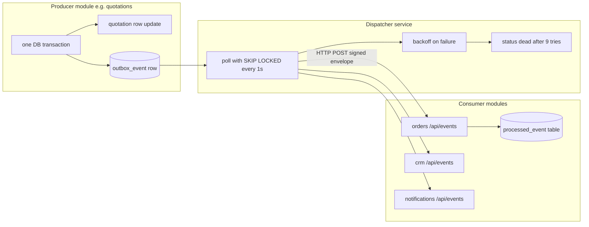
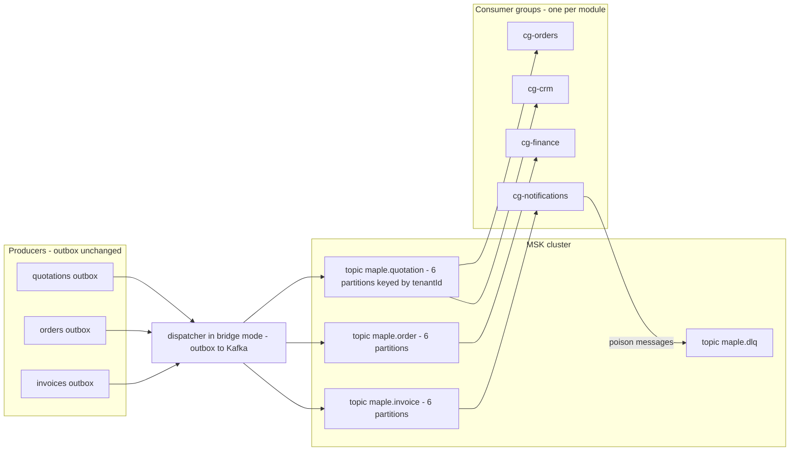

# Events & messaging — infrastructure bible

*Written for a non-DevOps reader, same contract as [aws-deployment.md](aws-deployment.html): every technology is introduced as "what it is / why we pay for it", every cost is in ₹/month (assuming ~₹86 = $1, mid-2026), and every upgrade has a named trigger — a real pain, not ambition. Two tracks run side by side through the whole page: **Track A (bootstrap)** — what we build now on the one box, and **Track B (enterprise)** — what a funded fleet runs. Companion pages: [event-catalog.md](event-catalog.html) (the *what* — event types and payloads), [cross-module.md](cross-module.html) (why the money chain needs this), [infra-observability.md](infra-observability.html) (how we watch it).*

---

## 0. Where we actually are

Honesty first: the ecosystem emits **zero events today**. The only artifact is the `OutboxEvent` table in `maple-quotations/prisma/schema.prisma` (lines 86–93) — a schema-only seam with no writer, no dispatcher, no consumer ([event-catalog.md](event-catalog.html) verified this by grep). Every cross-module handoff is a human re-typing data. So this page is not tuning advice for a running system; it is the build plan for one, written *before* the first event so we don't improvise it under deadline.

The shape of the system the plan must serve: **~19 Next.js modules**, one Postgres database per module on a shared instance, everything on **one EC2 box** today (Phase 1–2 of [aws-deployment.md](aws-deployment.html)), every business row carrying a `tenantId`.

---

## 1. What needs messaging here — the real use cases

"Messaging" covers two different animals, and conflating them is the classic mistake:

- **Events** — *"something happened"*, broadcast, producer doesn't care who listens. ("Quotation 118 was accepted.")
- **Jobs** — *"do this work"*, addressed to a worker pool, caller often waits for the result. ("Parse this 40-page catalog PDF.")

Events want an outbox/bus; jobs want a queue with workers. Our five concrete use cases, mapped:

| # | Use case | Kind | Today (manual reality) | What messaging buys |
|---|----------|------|------------------------|---------------------|
| 1 | **Money-chain events** — `quotation.accepted` → orders, `order.fulfilled` → invoices/inventory, `invoice.paid` → finance/crm (full list in [event-catalog.md](event-catalog.html)) | Event | Human re-enters the quote into the order form; Order→Invoice has no schema link at all ([cross-module.md](cross-module.html) §4) | The product promise: quote → order → invoice → payment as one automated thread |
| 2 | **AI job queue** — catalog PDF parsing in quotations (multi-minute Anthropic calls, today executed inside the HTTP request) | Job | Request-scoped; a slow parse ties up the web process, a crash loses the work | Durable retries, progress reporting, concurrency caps so AI spend can't stampede |
| 3 | **Video transcode queue** — photoshoot renders/transcodes (CPU-heavy, minutes-long) | Job | Same box as everything else; a render slows quote PDFs (the named Phase-2 exit trigger in [aws-deployment.md](aws-deployment.html)) | Bounded workers, backpressure, ability to move workers to a separate box without touching the app |
| 4 | **Notification fan-out** — WhatsApp/email/in-app on `invoice.issued`, `payment.recorded`, `lead.converted` | Event → jobs | Doesn't exist | One event, N channels, each with its own retry policy — without the producer knowing channels exist |
| 5 | **Inbound webhooks + external bridge** — Razorpay payment webhooks, WhatsApp delivery callbacks, and the MapleLens→leads bridge (an external product posting captured leads into the suite's leads module) | Ingestion → event | Doesn't exist | Accept fast (200 OK in <1s or the provider retries/blacklists), verify signature, then process durably — the queue *is* the safety between "received" and "processed" |

Volume check, because everything downstream keys off it: even a wildly successful Maple Enterprise deployment is **hundreds to low thousands of business events per day** (quotes, orders, invoices, payments across tenants) plus **tens of jobs per day** (parses, renders). That is roughly **0.05 events/second average**. Hold that number against every price tag below.

---

## 2. TRACK A — bootstrap (build now): Postgres outbox + dispatcher, BullMQ for jobs

Zero new infrastructure for events (the database we already run *is* the broker), one small Redis for jobs when jobs arrive. Everything below runs as containers in the existing Docker Compose.

### 2.1 The transactional outbox — why this pattern and not "just call the other module's API"

If quotations updates the quote to `accepted` and then HTTP-POSTs the orders module, one of two failures is guaranteed eventually: the update commits but the POST fails (order never created), or the POST succeeds but the update rolls back (phantom order). The [transactional outbox pattern](https://microservices.io/patterns/data/transactional-outbox.html) fixes this by making the event **part of the same database transaction** as the state change — commit means both happened, rollback means neither. A separate dispatcher process then relays committed events to consumers, retrying until acknowledged. Delivery becomes **at-least-once**, so consumers must be idempotent (§2.5). This is the industry-standard first rung; a good production walkthrough is [Piontko's "Transactional Outbox: From Theory to Production"](https://www.npiontko.pro/2025/05/19/outbox-pattern).

### 2.2 Outbox table DDL — the grown-up version of today's model

Today's `OutboxEvent` (id, tenantId, type, payload, status, createdAt) is a sketch. The production table adds the columns the dispatcher needs to be safe and debuggable:

```sql
CREATE TABLE outbox_event (
  id             TEXT PRIMARY KEY,                -- cuid, doubles as the idempotency key downstream
  tenant_id      TEXT,
  aggregate_type TEXT NOT NULL,                   -- 'quotation' | 'order' | 'invoice' ...
  aggregate_id   TEXT NOT NULL,                   -- ordering scope (see §2.4)
  type           TEXT NOT NULL,                   -- 'quotation.accepted.v1' — version IN the name
  payload        JSONB NOT NULL,
  status         TEXT NOT NULL DEFAULT 'pending', -- pending | processing | sent | dead
  attempts       INT  NOT NULL DEFAULT 0,
  next_attempt_at TIMESTAMPTZ NOT NULL DEFAULT now(),
  last_error     TEXT,
  created_at     TIMESTAMPTZ NOT NULL DEFAULT now(),
  sent_at        TIMESTAMPTZ
);
-- The only index the poller needs: cheap, partial, ordered.
CREATE INDEX outbox_pending_idx ON outbox_event (next_attempt_at, created_at)
  WHERE status IN ('pending', 'processing');
```

One such table lives **in each producer module's own database** (one Postgres per module — the outbox must share a transaction with that module's writes, so it cannot be centralized). Producer code is one rule: *never write a state change that other modules care about without an outbox row in the same transaction.*

```ts
// quotations: the accept endpoint (the first real event in the ecosystem)
await prisma.$transaction([
  prisma.quotation.update({ where: { id }, data: { status: "accepted" } }),
  prisma.outboxEvent.create({ data: {
    aggregateType: "quotation", aggregateId: id, tenantId,
    type: "quotation.accepted.v1",
    payload: { quotationId: id, number, clientId, clientSnapshot, total, rooms },
  }}),
]);
```

### 2.3 The dispatcher — one small always-on service

A ~200-line Node/TS service (one more Compose container) that polls each module's outbox and delivers events to consumers over HTTP. The heart of it is Postgres's `FOR UPDATE SKIP LOCKED` — a locking mode that lets several dispatcher instances pull work concurrently without ever grabbing the same row (each poller "skips" rows another poller has locked). This is the canonical Postgres queue technique ([2ndQuadrant/EDB on SKIP LOCKED queues](https://www.enterprisedb.com/blog/what-skip-locked-postgresql-95), [outbox-specific treatment](https://www.gmhafiz.com/blog/transactional-outbox-pattern/)).

```ts
// dispatcher core loop (per producer DB) — simplified but structurally complete
const BATCH = 50, POLL_MS = 1000;

async function tick(db: Pool, registry: ConsumerRegistry) {
  const { rows } = await db.query(`
    SELECT * FROM outbox_event
    WHERE status IN ('pending','processing') AND next_attempt_at <= now()
    ORDER BY created_at
    LIMIT $1
    FOR UPDATE SKIP LOCKED`, [BATCH]);          // runs inside a transaction

  for (const ev of groupSerialByAggregate(rows)) {   // §2.4: per-aggregate order
    const consumers = registry.for(ev.type);          // §2.6
    const results = await Promise.allSettled(
      consumers.map(c => deliver(c, envelope(ev)))    // HTTP POST, 10s timeout
    );
    if (results.every(r => r.status === "fulfilled")) {
      await markSent(db, ev.id);
    } else {
      await scheduleRetry(db, ev, results);           // §2.5 backoff / DLQ
    }
  }
}
setInterval(() => tick(db, registry).catch(logAndAlert), POLL_MS);
```

The helpers, so nothing is hand-waved:

```ts
// Delivery: plain HTTP POST with an HMAC signature header. 2xx = ack, anything else = throw.
async function deliver(consumer: Consumer, env: Envelope) {
  const body = JSON.stringify(env);
  const res = await fetch(consumer.url, {
    method: "POST",
    headers: {
      "content-type": "application/json",
      "x-maple-signature": hmacSha256(EVENTS_SECRET, body),   // shared secret from Secrets Manager
    },
    body,
    signal: AbortSignal.timeout(10_000),
  });
  if (!res.ok) throw new Error(`${consumer.module} responded ${res.status}`);
}

// Retry bookkeeping: exponential backoff with jitter, dead after MAX_ATTEMPTS.
const MAX_ATTEMPTS = 9;
async function scheduleRetry(db: Pool, ev: OutboxRow, results: PromiseSettledResult<void>[]) {
  const err = results.find(r => r.status === "rejected") as PromiseRejectedResult;
  const attempts = ev.attempts + 1;
  if (attempts >= MAX_ATTEMPTS) {
    await db.query(
      `UPDATE outbox_event SET status='dead', attempts=$2, last_error=$3 WHERE id=$1`,
      [ev.id, attempts, String(err.reason)]);       // lands in the §2.5 DLQ + alarm
    return;
  }
  const delaySec = Math.min(2 ** attempts, 3600) * (0.5 + Math.random()); // jittered
  await db.query(
    `UPDATE outbox_event SET status='processing', attempts=$2, last_error=$3,
       next_attempt_at = now() + make_interval(secs => $4) WHERE id=$1`,
    [ev.id, attempts, String(err.reason), delaySec]);
}
```

Two design notes worth stating out loud. First, partial fan-out failure (orders acked, crm failed) re-delivers to *everyone* on retry — that is fine *because* consumers are idempotent (§2.5); tracking per-consumer delivery state is real added complexity for no user-visible gain at our volume (revisit only if a consumer's handler is expensive enough that re-runs hurt — the idempotency check makes re-runs a primary-key lookup). Second, the whole `tick` runs inside one transaction so the row locks hold for the batch; keep `BATCH` modest (50) so a slow consumer can't hold locks for minutes.

A 1-second poll gives ~500ms average delivery latency — fine for every use case in §1. If we ever want near-instant delivery, Postgres `LISTEN/NOTIFY` can wake the poller on insert instead of raising the poll rate; keep the poll as the safety net either way.



### 2.4 Ordering — per aggregate, not global

Global ordering is a trap (it forces single-threaded everything). What consumers actually need is that events for **one aggregate** arrive in order — `order.created` before `order.fulfilled` for the *same* order. The dispatcher guarantees this by grouping each polled batch by `aggregate_id` and delivering each group serially (`groupSerialByAggregate` above), and by never advancing past a failing event *within an aggregate* — a stuck `order.created` blocks later events for that order only, not the whole stream. This is exactly the semantics Kafka gives per-partition, which makes the Track B migration mechanical (§5).

### 2.5 Retries, backoff, DLQ, idempotency

- **Backoff schedule:** `next_attempt_at = now() + min(2^attempts, 3600) seconds` with jitter — 2s, 4s, 8s… capped at 1h. After **9 attempts (~2.3h of trying)** the row flips to `status = 'dead'`.
- **DLQ (dead-letter queue):** in Track A the DLQ is simply the `dead` rows — queryable with SQL, replayable with `UPDATE outbox_event SET status='pending', attempts=0 WHERE id = ...` after fixing the consumer. A tiny admin page lists dead rows per module; a CloudWatch/Grafana alarm fires when `count(dead) > 0` for 15 minutes ([infra-observability.md](infra-observability.html)).
- **Idempotency:** delivery is at-least-once, so every consumer keeps a `processed_event(event_id TEXT PRIMARY KEY, processed_at)` table and does its handling in one transaction: `INSERT INTO processed_event ... ON CONFLICT DO NOTHING` — if the insert reports a conflict, the event is a duplicate; ack and skip. The outbox `id` travels in the envelope precisely to serve as this key.
- **Envelope** (every delivery, versioned): `{ id, type, version, tenantId, aggregateType, aggregateId, occurredAt, payload }`, HTTP-signed with a shared HMAC secret so consumers can reject forgeries. Convention reconciled (decision D-ENV): the canonical envelope is [event-catalog.md](event-catalog.html)'s — field named `id`, `type` unversioned (`quotation.accepted`) with a separate integer `version` field — because the catalog and [cross-module.md](cross-module.html) repeat it across all 14 event specs and every module page's payload designs reference them. Where this page's examples show `eventId` or `quotation.accepted.v1`, read them as `id` and `type` + `version`.
- **Retention/pruning:** `sent` rows don't clean themselves up. A nightly `DELETE FROM outbox_event WHERE status = 'sent' AND sent_at < now() - interval '30 days'` keeps the table small and the §2.2 partial index honest; 30 days is also the practical Track A replay horizon (§4). `dead` rows are exempt — they leave only via replay or deliberate deletion after review.

### 2.6 Consumer registry

Who gets what is **configuration, not code** — a checked-in `events.consumers.json` the dispatcher loads at boot (move it to a DB table when someone wants a UI):

```jsonc
{
  "quotation.accepted.v1": [
    { "module": "orders", "url": "http://orders:3000/api/events" },
    { "module": "crm",    "url": "http://crm:3000/api/events" }
  ],
  "invoice.paid.v1": [
    { "module": "finance",       "url": "http://finance:3000/api/events" },
    { "module": "notifications", "url": "http://notifications:3000/api/events" }
  ]
}
```

Each consumer module exposes one `POST /api/events` route: verify signature → idempotency check → `switch (envelope.type)` → 200. Unknown types return 200 too (ignore-and-ack), so adding event types never breaks old consumers. The whole consumer contract in one handler:

```ts
// orders module: app/api/events/route.ts
export async function POST(req: Request) {
  const body = await req.text();
  if (!verifyHmac(req.headers.get("x-maple-signature"), body)) {
    return new Response("bad signature", { status: 401 });
  }
  const env: Envelope = JSON.parse(body);

  await prisma.$transaction(async (tx) => {
    // Idempotency gate: at-least-once delivery becomes effectively-once processing.
    const seen = await tx.processedEvent.createMany({
      data: [{ eventId: env.eventId }], skipDuplicates: true });
    if (seen.count === 0) return;                       // duplicate — ack and move on

    switch (env.type) {
      case "quotation.accepted.v1":
        await tx.order.create({ data: draftOrderFrom(env.payload, env.tenantId) });
        break;
      default:                                          // unknown type: deliberate no-op
        break;
    }
  });
  return new Response("ok");                            // 200 = ack; throw/5xx = dispatcher retries
}
```

Note what the handler must *not* do: long work. If handling an event takes more than a second or two (e.g. generating a PDF), the handler enqueues a BullMQ job (§2.8) and acks — the event ack and the work are decoupled, each with its own retry policy.

### 2.7 Inbound webhooks (Razorpay, WhatsApp, MapleLens) ride the same rails

A webhook is an event whose producer we don't control. Rule: the HTTP handler does **only** signature verification + insert into a `webhook_inbox` table (same columns as the outbox) + `200 OK` — total <100ms, which keeps Razorpay/WhatsApp happy. The dispatcher then processes inbox rows exactly like outbox rows: retries, DLQ, idempotency (Razorpay's `event.id` / WhatsApp's message id as the dedupe key, since providers also deliver at-least-once). The MapleLens→leads bridge is the same shape: MapleLens POSTs a signed `lead.captured.v1` to a public endpoint on the leads module; inbox row; dispatcher fans it into `Lead` creation + CRM notification. External systems integrate as *peers in the same event model*, not as special cases.

### 2.8 Jobs — BullMQ on one Redis (when Redis earns its place)

Events don't need Redis; **jobs do**. [BullMQ](https://docs.bullmq.io/) is the standard Node job queue on Redis: persistent jobs, per-queue concurrency, rate limiting, exponential retries, delayed jobs, and a decent UI (Bull Board). Redis arrives as **one container on the existing box** (₹0 incremental) the day the first background job ships — not before. Managed Redis (ElastiCache `cache.t4g.micro`, ~[$9–15/month ≈ ₹800–1,300](https://instances.vantage.sh/aws/elasticache/cache.t4g.micro)) is a Phase-2+ upgrade *only if* losing in-flight job state on a box rebuild ever actually hurts — a lost BullMQ job is re-enqueueable from the source record, so this is far less precious than Postgres.

**Queue 1 — AI catalog parse** (quotations, use case 2):

| Setting | Value | Why |
|---|---|---|
| Queue | `ai-parse` | One queue per job type — a slow parse must never block other job kinds ([queue-isolation guidance](https://markaicode.com/architecture/bullmq-high-traffic-scalability-architecture/)) |
| Concurrency | 2 | Each job is minutes of Anthropic streaming; 2 bounds spend and memory |
| Rate limit | `{ max: 10, duration: 60_000 }` | Belt-and-braces against a bulk-upload stampede hitting API rate limits ([BullMQ rate limiting](https://oneuptime.com/blog/post/2026-01-21-bullmq-rate-limiting/view)) |
| Retries | 3, exponential from 30s | Anthropic 529s are transient; malformed PDFs are not — classify and fail-fast the latter |
| Job payload | `{ tenantId, assetId, pages }` — **references, not blobs** | Redis is not file storage; the PDF stays in Postgres/S3 |
| Progress | `job.updateProgress({ page, totalPages })` | The upload UI polls job state instead of holding an HTTP request open for minutes |
| Failure | DLQ'd by BullMQ (`failed` set), Bull Board for inspection, alarm on failed-count | Same observability contract as the outbox (§7) |

The parse queue end-to-end, because it changes the upload UX contract:

```ts
// enqueue (quotations upload route) — returns immediately with a job id
const job = await aiParseQueue.add("parse-catalog",
  { tenantId, assetId, pages },
  { attempts: 3, backoff: { type: "exponential", delay: 30_000 },
    removeOnComplete: { age: 86_400 }, removeOnFail: false });   // keep failures for the DLQ view
return Response.json({ jobId: job.id });                          // UI polls /api/parse-jobs/[id]

// worker (its own container, not the web process)
new Worker("ai-parse", async (job) => {
  const { tenantId, assetId, pages } = job.data;
  const pdf = await loadAsset(assetId);                           // bytes from Postgres/S3, not Redis
  for (const [i, page] of pages.entries()) {
    await parsePageWithClaude(tenantId, pdf, page);               // existing quotations AI code
    await job.updateProgress({ page: i + 1, totalPages: pages.length });
  }
}, { connection: redis, concurrency: 2, limiter: { max: 10, duration: 60_000 } });
```

**Queue 2 — video transcode** (photoshoot, use case 3):

| Setting | Value | Why |
|---|---|---|
| Queue | `video-transcode` | Isolation again |
| Concurrency | 1 per worker process | ffmpeg saturates cores; parallelism comes from more workers, not higher concurrency |
| Worker placement | Separate container; later a separate box/spot instance pointing at the same Redis | This is the whole payoff: when renders slow quote PDFs (the Phase-2 exit trigger), we move *this one container* and change nothing else |
| Timeout / stall | `stalledInterval` 5m, lock duration > longest render | Long jobs must not be falsely re-queued mid-render |
| Retries | 2 | A transcode that failed twice needs a human, not a third try |

Completion of a job that others care about (`shoot.published`) is written to the **outbox** in the worker's final DB transaction — jobs and events compose, they don't compete.

**Track A total cost: ~₹0/month** — the outbox rides the existing Postgres, the dispatcher and Redis are two more containers on the box we already pay for. The real cost is ~1–2 weeks of build time and the discipline of the "same transaction" rule.

---

## 3. TRACK B — enterprise: a real broker

What changes at scale: many consumers per event (each new HTTP consumer adds dispatcher latency), **replay** ("rebuild the CRM projection from 6 months of events"), stream processing (real-time dashboards), and multiple teams shipping consumers independently. A **log-based broker** (Kafka and friends) stores events durably in order and lets any number of consumer groups read at their own pace, including from the beginning. That's the capability we'd be buying. What it costs:

### 3.1 The broker options, honestly compared

| | **MSK Provisioned** | **MSK Serverless** | **Redpanda on EC2 (self-run)** | **SQS + SNS + EventBridge** |
|---|---|---|---|---|
| What it is | AWS runs real Kafka brokers you size | Kafka API, AWS auto-scales, pay per use | Kafka-compatible single binary (C++, no ZooKeeper/JVM), we run it ourselves | AWS-native queues + pub/sub + event bus (not Kafka) |
| Ops burden | Low — AWS patches brokers; we still size, monitor, upgrade configs | Lowest of the Kafka row | **Highest** — we patch, upgrade, back up, page ourselves | Effectively zero — fully serverless |
| ₹/month at our scale | 3× `m7g.large` × [$0.204/hr](https://aws.amazon.com/msk/pricing/) ≈ $447 ≈ **₹38k** + storage ($0.10/GB-mo). Dev-grade 2× `kafka.t3.small` ≈ **₹6–7k** but burstable/not-for-prod | [$0.75/cluster-hr floor](https://aws.amazon.com/msk/pricing/) = $547/mo ≈ **₹47k before one byte moves**, + $0.0015/partition-hr, $0.10/GB in, $0.05/GB out ([analysis](https://www.automq.com/blog/msk-serverless-pricing-costs-limits-and-alternatives)) | 1× `t3.large` + gp3 EBS ≈ **₹5–7k**; a proper 3-node cluster ≈ ₹18–25k. [Community Edition is free (BSL)](https://www.redpanda.com/data-streaming/compare-platform-editions); docs want [NVMe + 4 cores/node for production](https://docs.redpanda.com/current/deploy/redpanda/manual/production/requirements/) | SQS [$0.40/M std, $0.50/M FIFO, first 1M free](https://aws.amazon.com/sqs/pricing/); SNS ~$0.50/M publishes; EventBridge [$1.00/M custom events](https://aws.amazon.com/eventbridge/pricing/). At 3M events/mo: **≈ ₹300–500 total** |
| Ordering | Per partition (strong) | Per partition | Per partition | SQS FIFO: per message-group; SNS/EventBridge standard: none |
| Replay | Yes — retention up to unlimited (tiered) | Yes (bounded retention) | Yes + tiered storage to S3 in Community | **No** — consumed is gone (EventBridge archive+replay exists but is re-*injection*, not consumer-side rewind) |
| Throughput ceiling | Very high | High (with [documented limits](https://www.automq.com/blog/msk-serverless-pricing-costs-limits-and-alternatives)) | Very high | High (standard SQS scales ~infinitely; FIFO ~300 msg/s per queue, 3,000 batched, more in high-throughput mode) |
| Fit for us | The "we made it" option | **Mispriced for us**: a floor of ₹47k/mo to move 0.05 events/sec | The hacker option — real Kafka semantics at bootstrap prices, paid in ops attention | The pragmatic funded option below Kafka scale (§6) |

Two readings of that table, one per cost posture:

- **Bootstrapped:** every Kafka column costs ₹38–47k/month *at idle* except self-run Redpanda — and Redpanda's real price is that a founder becomes a part-time Kafka operator, against principle 1 of [aws-deployment.md](aws-deployment.html) ("no Kubernetes until a human is hired to run it" — same logic, same answer). At 0.05 events/sec, **all four are overkill**; the SQS column costs ₹300 but still adds AWS coupling the outbox doesn't have.
- **Funded:** MSK Provisioned (3× `m7g.large`, ₹38–42k/mo with storage) beats Serverless on price the moment the cluster runs 24×7 — Serverless's floor alone exceeds a small provisioned cluster ([cost comparisons](https://www.automq.com/blog/aws-msk-pricing-provisioned-serverless-express)). Self-run Redpanda at ₹18–25k for 3 nodes is only rational once there's a platform engineer whose job description includes it.

### 3.2 Chosen Track B topology (when triggered)



- **Topics per aggregate** (`maple.quotation`, `maple.order`, `maple.invoice`, `maple.payment`, `maple.shoot`, `maple.lead`) — mirrors `aggregate_type`, keeps consumer subscriptions coarse and sane. Not per-event-type (too many) and not one firehose topic (no independent retention/scaling).
- **Partition key = `tenantId`** (fallback `aggregateId` for tenant-less events). All of one tenant's events for an aggregate type stay ordered, tenants spread across partitions, and a noisy tenant degrades only its partition. Start at **6 partitions/topic** — partitions can be added later but never removed, and consumer parallelism is capped by partition count.
- **Consumer groups per module** (`cg-orders`, `cg-crm`, …). Each module tracks its own offset; replay for one module (reset `cg-crm` to earliest) doesn't touch the others. This is the capability the outbox dispatcher fundamentally lacks.
- **Schema strategy:** keep versions **in the type name** (`quotation.accepted.v1` → `.v2`) with JSON payloads, additive-only changes within a version — the same rule as Track A, so nothing changes at migration. Adopt a registry only when >2 teams produce independently; first choice [AWS Glue Schema Registry](https://docs.aws.amazon.com/glue/latest/dg/schema-registry.html) (no additional charge, integrates with MSK), self-hosted Karapace if we're on Redpanda.
- **DLQ:** per-consumer-group dead-letter *topic* (`maple.dlq`, headers carrying origin topic/group/error) with the same alarm contract as Track A.

The unglamorous choices that always bite later, decided now:

| Concern | Choice | Why |
|---|---|---|
| Client library | `kafkajs` (all our modules are Node/TS) | Mature, no native deps; the consumer handler code is a near copy of the §2.6 HTTP handler — same envelope, same `processed_event` gate |
| Auth | MSK **IAM auth** (SASL/SCRAM if Redpanda) | No broker passwords to rotate; consumer identity = the module's task role, which also does the per-topic ACLs |
| Retention | Business topics **30 days** (raise per topic when a replay consumer actually exists), `maple.dlq` 90 days | Retention is per-topic and cheap ($0.10/GB-mo); infinite-by-default is how storage bills surprise people |
| Compaction | Off everywhere to start | Compaction keeps "latest per key", which silently breaks replay-from-history semantics; only for changelog-style topics we don't have yet |
| Producer settings | `acks=all`, idempotent producer on, `max.in.flight=5` | The bridge must not reorder or drop within a partition — this trio is the standard safe combination |

### 3.3 K8s consumer deployment profiles

Track B coincides with Phase 3+ (Fargate/EKS). Each module's consumer is a **separate Deployment** from its web service — independent scaling and crash domains:

| Profile | Spec | Notes |
|---|---|---|
| Standard consumer (crm, finance) | 1–2 replicas, `100m` CPU / `256Mi` req, `500m` / `512Mi` limit | Replicas ≤ partition count or the extras idle |
| Ordered/heavy consumer (orders) | 2 replicas, `250m` / `512Mi` | Does real writes per event; keep `max.poll.records` small (25) so rebalances are cheap |
| Burst consumer (notifications) | 1–6 replicas via [KEDA](https://keda.sh/docs/latest/scalers/apache-kafka/) scaling on **consumer lag** (target lag 500) | Lag-based autoscaling is the whole point of running consumers on K8s |
| All | `terminationGracePeriodSeconds: 60`, SIGTERM → commit offsets → close; cooperative-sticky rebalancing; liveness = heartbeat age | Prevents duplicate storms on every deploy |

---

## 4. Side by side — and the adoption triggers

| Dimension | **Track A: outbox + BullMQ** | **Middle path: EventBridge + SQS (§6)** | **Track B: Kafka (MSK)** |
|---|---|---|---|
| New infrastructure | None (Redis container when jobs ship) | None to run (AWS-managed) | Cluster + registry + consumer deployments |
| ₹/month | **~0** | **~₹300–800** at our volumes | **~₹38–47k** + engineer attention |
| Delivery | At-least-once, ~0.5–1s latency | At-least-once, ~sub-second | At-least-once, ~ms |
| Ordering | Per aggregate (dispatcher-enforced) | Per message group (SQS FIFO only) | Per partition (native) |
| Replay | Weeks-scale (rows retained in Postgres, re-mark as pending) | No true consumer rewind | Native, per consumer group |
| Fan-out cost of consumer #N | Linear in dispatcher HTTP work | One more rule/queue, trivial | Zero marginal (pull model) |
| Multi-team autonomy | Weak (shared registry file) | Medium (rules are self-serve) | Strong (groups + registry) |
| Comfortable ceiling | ~10–50 events/sec sustained, ~5–8 active consumers | ~hundreds/sec (SQS FIFO group limits apply) | Thousands+/sec |
| Lock-in | None (plain Postgres + Redis) | AWS APIs | Kafka API (portable across MSK/Redpanda/Confluent) |

**Adoption triggers — move only when a number is breached, per the "never skip a phase" principle:**

| Trigger | Threshold | Why it forces the move |
|---|---|---|
| Event volume | Sustained **> ~1M events/day (≈12/sec)** or poller lag alarm (§7) firing weekly | Outbox polling + row churn starts competing with OLTP work in producer DBs |
| Consumer count | **> ~8 consumers** on hot event types, or any consumer needing < 100ms delivery | Dispatcher HTTP fan-out is serial-ish; pull-based groups scale consumers for free |
| Replay | **Second real request** to rebuild a projection from history | One-off replays are a SQL script on the outbox; recurring replay is a log-broker feature |
| Team shape | **≥ 2 teams** shipping producers/consumers independently, or a hired platform engineer | The org, not the tech, is usually what actually triggers Kafka |
| Streaming analytics | A funded requirement for real-time (not nightly) cross-module dashboards | Stream processing wants a log, not a table |

Until *two or more* rows trigger: stay on Track A. One row triggering usually has a cheaper point-fix (e.g. replay-once = SQL script; one slow consumer = give it a BullMQ queue).

---

## 5. Migration path A → B

The outbox is not throwaway — it's the **producer half of the Kafka architecture**, kept forever. Producers never talk to Kafka directly (that would reintroduce the dual-write bug the outbox exists to kill: DB commit + broker publish are two systems again). What changes is only the dispatcher's *sink*: HTTP consumers → Kafka producer API. This "outbox → broker bridge" is exactly what [Debezium's outbox event router](https://debezium.io/documentation/reference/stable/transformations/outbox-event-router.html) formalizes; our polling dispatcher does the same job without the CDC machinery (worth revisiting Debezium only past ~10k events/minute).

**Explicitly rejected: application-level dual-write** (producers writing outbox *and* publishing to Kafka). It doubles producer code paths and reintroduces atomicity failure. All duality lives in the one dispatcher process, per topic, briefly.

Cutover, one event type at a time:

1. **Stand up the cluster** (MSK or Redpanda) + topics from §3.2; nothing consumes yet.
2. **Bridge mode:** dispatcher gains a Kafka sink; for `quotation.accepted.v1` it now does *both* — publish to `maple.quotation` **and** the legacy HTTP fan-out. Kafka is write-only shadow traffic; risk ≈ 0.
3. **Shadow-verify (1–2 weeks):** a throwaway consumer group counts/compares Kafka messages against outbox `sent` rows. Alarm on divergence.
4. **Move consumers one at a time:** orders module gets a `cg-orders` consumer (same `processed_event` idempotency table — it makes the move seamless, duplicates during overlap are absorbed); once verified, delete orders from the dispatcher's HTTP registry for that type.
5. **Per-type completion:** when a type's registry entry is empty, the dispatcher stops HTTP fan-out for it. Repeat 2–5 per event type, hottest first.
6. **End state:** producers + outbox unchanged; dispatcher is a thin outbox→Kafka pump (later swappable for Debezium); all consumption via consumer groups. BullMQ **stays** for jobs — Kafka is a poor job queue (no per-job retries/delays/priorities); parse and transcode queues are untouched by this whole migration.

Rollback at any step = re-add the HTTP registry entry; the outbox never stopped being the source of truth.

---

## 6. The AWS-native middle path — EventBridge + SQS (often the right "funded" answer before Kafka)

Between "Postgres table" and "Kafka cluster" sits the AWS serverless trio. What each is: **SQS** — a managed queue (worker pulls, retries, native DLQ); **SNS** — managed broadcast to many subscribers; **EventBridge** — a rules-based event bus (JSON pattern matching routes events to targets: SQS queues, Lambdas, webhooks). AWS's own [decision guide](https://docs.aws.amazon.com/decision-guides/latest/sns-or-sqs-or-eventbridge/sns-or-sqs-or-eventbridge.html) covers the split; [oneuptime's comparison](https://oneuptime.com/blog/post/2026-02-12-compare-sqs-sns-eventbridge-mq/view) is a good practitioner read.

**The design for our use cases** — note the outbox and dispatcher *survive again*; only the sink changes (same move as §5, different target):

- **Money-chain events:** dispatcher publishes to one EventBridge custom bus (`maple-events`). One **rule per (event-type, consumer)** — each consumer module owns an SQS queue its worker polls. Ordering where it matters via **SQS FIFO** with `MessageGroupId = tenantId + aggregateId` ([FIFO group ordering with Pipes](https://docs.aws.amazon.com/eventbridge/latest/userguide/eb-pipes-sqs.html)); native per-queue DLQs with `maxReceiveCount = 5`. A rule is ~10 lines of JSON pattern, self-serve for whoever owns the consumer:

  ```json
  {
    "source": ["maple.quotations"],
    "detail-type": ["quotation.accepted.v1"],
    "detail": { "tenantId": [{ "exists": true }] }
  }
  ```

  (Target: `orders-events.fifo`, message group id mapped from `$.detail.tenantId`.) Content-based filtering like this — "only `invoice.paid` above ₹1L to the priority channel" — is the one capability EventBridge has that *neither* our dispatcher *nor* plain Kafka gives without consumer-side code.
- **Notification fan-out:** one rule matching `invoice.*, payment.*, lead.*` → SNS topic → per-channel SQS queues (WhatsApp, email) — each channel retries independently.
- **Webhook ingestion:** API Gateway → SQS direct integration; Razorpay gets its 200 in milliseconds even if every module is mid-deploy. (Keep it Lambda-free: verify signatures in the consuming worker.)
- **MapleLens bridge:** MapleLens publishes `lead.captured.v1` onto the same bus via a scoped IAM key (`PutEvents` on one bus only) — cleaner than a public webhook endpoint.

**₹ at our scale** (generous 3M events/month ≈ 100k/day, 3 consumers average): EventBridge ingest [$1.00/M](https://aws.amazon.com/eventbridge/pricing/) = $3; SQS ~12M requests (deliver + receive + delete, 3 queues) at [$0.40–0.50/M, first 1M free](https://aws.amazon.com/sqs/pricing/) ≈ $5; SNS ≈ $1. **Total ≈ $9–10/month ≈ ₹800.** At our *actual* near-term volume (thousands/day) it rounds to **under ₹100/month** — three orders of magnitude below any Kafka column.

**The honest analysis:** this beats Track B on cost and beats Track A on durability-without-ops — real DLQs, per-queue metrics and alarms for free, no dispatcher-delivery code to maintain, consumers scale without touching a registry file. Its genuine losses vs Kafka: **no consumer-side replay** (EventBridge archive/replay re-injects into the bus — every consumer sees the events again, not just the one rebuilding), weaker ordering (FIFO groups, not partitions), and AWS lock-in at the integration layer. Its loss vs Track A: it requires being on AWS properly (Phase 2+) and events now transit infrastructure you can't `SELECT * FROM`. **Verdict:** for a funded team *below* the §4 triggers, this is usually the right answer — Kafka's remaining justification is replay-heavy architectures, streaming analytics, or multi-team platform ambitions. Don't buy those before they're real.

---

## 7. Observability of messaging

Full treatment in [infra-observability.md](infra-observability.html); the messaging-specific contract, both tracks:

| Signal | Track A source | Track B source | Alarm |
|---|---|---|---|
| **Delivery lag** (oldest unsent event age) | `SELECT max(now() - created_at) FROM outbox_event WHERE status <> 'sent'` exported as a gauge | Consumer-group lag (Burrow-style, or [MSK's CloudWatch `MaxOffsetLag`](https://docs.aws.amazon.com/msk/latest/developerguide/metrics-details.html)); SQS `ApproximateAgeOfOldestMessage` | > 5 min for 10 min |
| **DLQ depth** | `count(*) WHERE status='dead'` per module; BullMQ failed-set size | DLQ topic depth / DLQ queue `ApproximateNumberOfMessagesVisible` | > 0 for 15 min |
| **Dispatcher/consumer liveness** | Dispatcher heartbeat row updated every tick; alarm on staleness (a silently-dead dispatcher is this design's one scary failure mode) | K8s liveness probes, consumer heartbeat age | heartbeat > 2 min |
| **Retry rate** | `sum(attempts)` delta per hour | Redelivery / `NumberOfMessagesReceived` minus deletes | sustained climb week-over-week |
| **Job health** | BullMQ queue depths, job duration histograms, Bull Board UI | (BullMQ unchanged in Track B) | waiting > 50 or p95 duration 2× baseline |

Two habits that cost nothing and save incidents: put `eventId` in every consumer log line (grep one event's journey end-to-end), and graph *events published per day per type* — it's the adoption-trigger evidence (§4) gathering itself.

### 7.1 The 3am card — dispatcher stuck, lagging, or dead (Track A)

Symptom: the lag or DLQ alarm fired, or a module "never got" an event. Work down the list; stop at the first hit.

```bash
docker compose ps dispatcher                  # running, or in a restart loop?
docker compose logs --since 15m dispatcher    # delivery errors name the failing consumer + status code
```

```sql
-- 1. How far behind? (the §7 lag gauge, by hand)
SELECT count(*) AS backlog, max(now() - created_at) AS oldest
FROM outbox_event WHERE status IN ('pending','processing');
-- 2. Who is failing? last_error names the consumer and the reason
SELECT type, left(last_error, 80) AS err, count(*)
FROM outbox_event WHERE status = 'dead' OR attempts > 3
GROUP BY 1, 2 ORDER BY 3 DESC LIMIT 10;
```

Then, by diagnosis:

- **Dispatcher dead or wedged →** `docker compose restart dispatcher`. Always safe: delivery is at-least-once and consumers are idempotent (§2.5), so a restart can only re-deliver, never lose. Rows a crashed batch left in `processing` re-poll once their `next_attempt_at` passes — the row locks died with the connection, nothing to clean up by hand.
- **One consumer failing** (backlog grows, `last_error` names one module) → fix/restart that module (`docker compose logs --since 15m orders`), confirm its `/api/events` answers 200, then requeue its dead rows — scoped by type, never a blanket reset:
  ```sql
  UPDATE outbox_event SET status='pending', attempts=0, next_attempt_at=now()
  WHERE status='dead' AND type='quotation.accepted.v1';
  ```
- **Every consumer failing with 401 →** the HMAC `EVENTS_SECRET` diverged (usually a partial env re-render). Re-render env files, restart dispatcher and consumers in the same breath.
- **Backlog high but nothing erroring →** a slow consumer is holding the batch (the §2.3 tick is one transaction). Check that consumer's latency, and remember the standing rule: handlers that do long work must enqueue a job and ack (§2.6) — this alarm firing is usually that rule being broken somewhere.

---

## 8. Decision log & recommendations

| # | Decision | Choice | Status |
|---|----------|--------|--------|
| D1 | Event transport, now | Postgres transactional outbox + polling dispatcher (§2), extending the existing `OutboxEvent` seam | **Adopted by this doc** |
| D2 | Job transport, now | BullMQ + one Redis container, arriving with the first real background job | **Adopted by this doc** |
| D3 | Delivery semantics | At-least-once everywhere + consumer idempotency (`processed_event`); never chase exactly-once | **Adopted** |
| D4 | Ordering scope | Per aggregate (Track A) / per partition key `tenantId` (Track B) — never global | **Adopted** |
| D5 | Dual-write from producers | Rejected permanently; the outbox is the only door out of a producer, on every track | **Adopted** |
| D6 | MSK Serverless | Rejected at any foreseeable scale — ₹47k/mo floor before traffic | **Rejected** |
| D7 | Self-run Redpanda | Deferred until a platform engineer exists to own it; revisit as the cheap Kafka if triggers fire pre-funding | **Deferred** |
| D8 | Schema registry | Deferred; versions live in type names (`*.v1`) with additive-only JSON until >2 independent producing teams | **Deferred** |
| D9 | Kafka (MSK Provisioned) | Only on ≥2 fired triggers from §4, arriving via the §5 bridge — never a big-bang | **Conditional** |

**Bootstrapped pick (today's reality): Track A — outbox + dispatcher + BullMQ, ₹0/month.** At 0.05 events/second, every broker on the market is a solution without a problem; the outbox delivers the actual product promise (the money chain, [cross-module.md](cross-module.html)) using the Postgres we already run and trust, and nothing built is thrown away later. Build order: outbox DDL + `quotation.accepted` producer write → dispatcher container → orders/crm consumers → webhook inbox → BullMQ `ai-parse` when the parse moves out of the request path.

**Funded pick: Track A producers + EventBridge/SQS delivery (§6), ~₹300–800/month — with MSK Provisioned (~₹38–42k/month) held behind the §4 triggers.** Funding buys managed durability and free ops (real DLQs, alarms, scaling), not a Kafka cluster to babysit; the outbox→bus bridge means the later Kafka move (if replay/streaming/multi-team ever genuinely fire) is a dispatcher-sink swap, not a rewrite.

---

## Appendix — the jargon, one line each

| Term | Plain meaning |
|---|---|
| **Broker** | The middleman server that holds messages between producer and consumer (Kafka, Redpanda, SQS are all brokers) |
| **Outbox** | A DB table where a module writes "this happened" in the same transaction as the change itself — so the fact and its announcement can never disagree |
| **Dispatcher / relay** | The small service that reads outbox rows and delivers them onward, retrying until acknowledged |
| **At-least-once** | Delivery guarantee where duplicates are possible but loss is not — the practical choice; "exactly-once" across systems is a marketing term |
| **Idempotent consumer** | A consumer that produces the same end state no matter how many times it sees the same event (ours: primary-key gate on `eventId`) |
| **DLQ (dead-letter queue)** | The parking lot for messages that failed all retries — inspected by humans, replayed after the fix |
| **Aggregate** | One business object and its lifecycle — *this* quotation, *this* order; the natural unit of event ordering |
| **Partition** | Kafka's ordered sub-stream within a topic; messages with the same key (our `tenantId`) always land in the same partition, hence stay ordered |
| **Consumer group** | A named reader with its own bookmark (offset) into a topic — many groups read the same events independently, which is what makes replay per-module possible |
| **Replay** | Re-reading historical events from the start to rebuild a downstream view — the headline capability a log broker adds over a queue |
| **Consumer lag** | How far behind a consumer's bookmark is from the newest message — the single most important messaging health metric (§7) |
| **Fan-out** | One event delivered to many consumers |
| **Backpressure** | What a bounded queue does when producers outpace workers: work waits instead of overwhelming the box |
| **CDC (change data capture)** | Reading the database's own write-ahead log to emit events (Debezium) — the high-volume successor to our polling dispatcher, not needed yet |

---

*Sources for prices and patterns, checked July 2026 — recheck before purchase: [MSK pricing](https://aws.amazon.com/msk/pricing/) · [MSK Serverless cost analysis](https://www.automq.com/blog/msk-serverless-pricing-costs-limits-and-alternatives) · [MSK provisioned vs serverless vs express](https://www.automq.com/blog/aws-msk-pricing-provisioned-serverless-express) · [SQS pricing](https://aws.amazon.com/sqs/pricing/) · [EventBridge pricing](https://aws.amazon.com/eventbridge/pricing/) · [AWS SNS/SQS/EventBridge decision guide](https://docs.aws.amazon.com/decision-guides/latest/sns-or-sqs-or-eventbridge/sns-or-sqs-or-eventbridge.html) · [Redpanda requirements](https://docs.redpanda.com/current/deploy/redpanda/manual/production/requirements/) · [Redpanda editions/licensing](https://www.redpanda.com/data-streaming/compare-platform-editions) · [ElastiCache t4g.micro](https://instances.vantage.sh/aws/elasticache/cache.t4g.micro) · [Transactional outbox (microservices.io)](https://microservices.io/patterns/data/transactional-outbox.html) · [Outbox from theory to production](https://www.npiontko.pro/2025/05/19/outbox-pattern) · [SKIP LOCKED queues](https://www.enterprisedb.com/blog/what-skip-locked-postgresql-95) · [BullMQ docs](https://docs.bullmq.io/) · [Debezium outbox router](https://debezium.io/documentation/reference/stable/transformations/outbox-event-router.html).*
