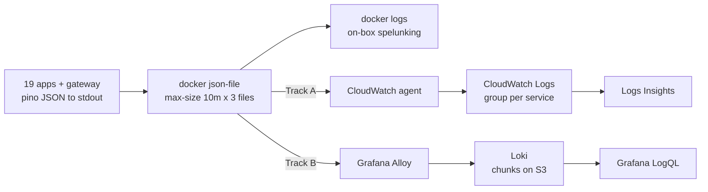
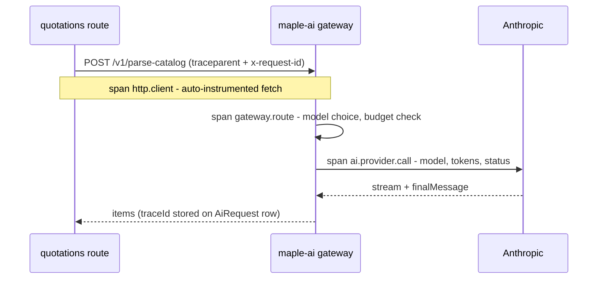
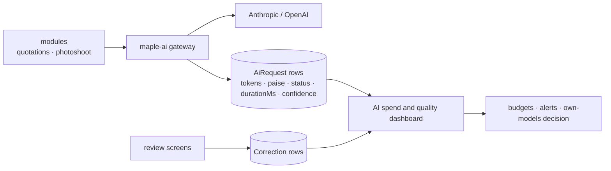

# Observability — logging, metrics, tracing bible

*The standing design for how MapleOne sees itself. Today's reality is honest and grim: `console.log` into `docker logs` on one box, zero error tracking, UptimeRobot planned-not-configured ([engineering-needs.md](engineering-needs.html) calls error tracking and log aggregation P0 for a reason). This page is the target state, in the house pattern: **Track A** (AWS-managed: CloudWatch family — minimum ops, pay per GB) and **Track B** (self-hosted OSS: Loki + Prometheus + Grafana + GlitchTip — flat ₹, you run it) presented side by side for every layer, with a recommendation per cost posture (bootstrapped vs funded) in §9 and a rollout mapped to the [deployment-runbook.md](deployment-runbook.html) stages in §10. ₹ figures assume ~₹86/$ (matching the other infra pages) and us-east-1 list prices; ap-south-1 differs by a few percent — verify on the pricing pages before budgeting. Region: ap-south-1.*

---

## 1. What we must be able to answer

Observability is not a tool purchase; it is a list of questions the system must answer without SSH-ing into the box. Ours, ranked:

| # | Question | Telemetry that answers it | Today | Section |
|---|----------|---------------------------|-------|---------|
| Q1 | "Maple Enterprise says quotes broke at 3pm — what happened, for *that tenant*?" | Structured logs filtered by `tenantId` + time; the error tracker's stack trace | Impossible (`console.log`, no tenant field, logs die with the container) | §2, §3 |
| Q2 | Which module is slow, and which route inside it? | RED metrics per route (rate, errors, duration) | Nobody knows until a user complains | §4 |
| Q3 | What did the AI spend today, per tenant? Is parse quality drifting? | The gateway's `AiRequest` log — already designed as exactly this | Designed, not built ([er-platform.md](er-platform.html)) | §7 |
| Q4 | Did the outbox dispatcher fall behind? Are events flowing? | Dispatcher lag metric (oldest undelivered event age) + delivery-rate metric | No dispatcher yet ([event-catalog.md](event-catalog.html)); design the gauge now | §4 |
| Q5 | Is production throwing exceptions we've never seen? | Error tracking with release tagging — new-issue alerts | Prod exceptions are invisible until a user complains | §3 |
| Q6 | Is the site up, from the customer's side of the internet? | Uptime checks + a synthetic money-path probe | UptimeRobot planned (runbook Stage 4) | §6 |
| Q7 | Did the deploy at 2pm cause the errors at 3pm? | Release (git SHA) stamped on every error and log line | SHA-tagged images exist (runbook Stage 2); nothing downstream reads them | §2, §3 |
| Q8 | Where did this slow request spend its time — module, gateway, or Anthropic? | Distributed trace across the three hops | Not needed until the gateway exists; designed in §5 | §5 |

The rule for everything below: **if a signal doesn't answer one of Q1–Q8, we don't collect it.** Collection is never free — CloudWatch charges per GB and per metric, and self-hosted stacks charge in attention.

## 2. LOGGING — the structured logging standard

### 2.1 The standard (both tracks — this part never changes)

Every module logs **JSON to stdout** via [pino](https://betterstack.com/community/guides/logging/how-to-install-setup-and-use-pino-to-log-node-js-applications/) — the fastest mainstream Node logger (~10,000+ logs/sec; roughly 2× Winston in [pino's benchmarks](https://signoz.io/guides/pino-logger-nodejs-logging-library/)), with built-in redaction and child loggers ([Dash0 guide](https://www.dash0.com/guides/logging-in-node-js-with-pino)). Stdout-only is deliberate: the container never knows where logs go — Docker's log driver (Track A) or Alloy (Track B) decides. Swap tracks without touching app code.

**Base fields on every line** (a shared `@maple/logger` package, ~50 lines, used by all 19 apps):

| Field | Source | Why |
|---|---|---|
| `ts` | pino default (epoch ms) | ordering |
| `level` | pino default | filtering |
| `module` | env `MODULE_NAME` (`quotations`, `crm`, `maple-ai`, …) | Q2 — which app said this |
| `env` | env (`prod` / `stage`) | one aggregation target, two environments |
| `release` | env `GIT_SHA` (baked into the image at build — same SHA the ECR tag carries) | Q7 — blame the deploy |
| `requestId` | middleware (§2.2) | stitch one request's lines together |
| `tenantId` | resolved tenant (child logger) | Q1 — the single most valuable field we can add |
| `userId` | session (child logger) | who saw the failure |
| `event` | per-call (`quote.created`, `parse.failed`, `auth.login_failed`) | machine-greppable event names, not prose |

```ts
// packages/logger/src/index.ts (shape, not final code)
import pino from "pino";
export const logger = pino({
  level: process.env.LOG_LEVEL ?? "info",
  base: { module: process.env.MODULE_NAME, env: process.env.APP_ENV,
          release: process.env.GIT_SHA?.slice(0, 7) },
  redact: { paths: REDACT_PATHS, censor: "[redacted]" },
  formatters: { level: (label) => ({ level: label }) },
});
// per request: logger.child({ requestId, tenantId, userId })
```

Child loggers are the mechanism that makes `tenantId` free at every call site — bind context once per request, never repeat it ([Last9 pino guide](https://last9.io/blog/npm-pino-logger/)). Two deliberate non-choices: no `pino-pretty` in prod (it's a dev-only transport — prod stays raw JSON for the shippers), and no file transports in the app (rotation is the platform's problem, not the app's — the [production consensus](https://techinsights.manisuec.com/nodejs/structured-logging-node-pino/) is a centralized factory + stdout and nothing else).

The pipeline, both tracks off the same stdout:



### 2.2 Request-id middleware for Next.js route handlers

Next.js route handlers have no Express-style middleware chain, so the pattern is a thin wrapper + `AsyncLocalStorage` ([the standard Node correlation-id approach](https://dev.to/axiom_agent/nodejs-structured-logging-in-production-pino-correlation-ids-and-log-aggregation-262m)):

1. `withRequest(handler)` — a higher-order function every route handler is exported through (same discipline as the existing auth wrappers). It: reads `x-request-id` from the incoming header **or** generates `crypto.randomUUID()`; resolves tenant + user from the session; creates the child logger; runs the handler inside `als.run({ log, requestId }, …)`.
2. Anywhere deeper (lib code, Prisma hooks) calls `getLog()` which reads the store — no logger threading through signatures.
3. The wrapper **echoes `x-request-id` in the response** so a user screenshot of an error page carries the correlation key, and **forwards it on outbound fetches** — module → maple-ai gateway → back — which is poor-man's tracing until §5 exists.
4. One `log.info({ event: "request", method, path, status, durationMs })` line per request at completion — this line alone feeds the RED metrics in §4.

```ts
// packages/logger/src/with-request.ts (shape)
const als = new AsyncLocalStorage<{ log: Logger; requestId: string }>();
export const getLog = () => als.getStore()?.log ?? logger;

export function withRequest(handler: RouteHandler): RouteHandler {
  return async (req, ctx) => {
    const requestId = req.headers.get("x-request-id") ?? crypto.randomUUID();
    const { tenantId, userId } = await resolveSession(req);   // existing auth libs
    const log = logger.child({ requestId, tenantId, userId });
    const start = performance.now();
    return als.run({ log, requestId }, async () => {
      try {
        const res = await handler(req, ctx);
        res.headers.set("x-request-id", requestId);
        log.info({ event: "request", method: req.method, path: routePattern(req),
                   status: res.status, durationMs: performance.now() - start });
        return res;
      } catch (err) {
        log.error({ event: "request.unhandled", err, method: req.method,
                    path: routePattern(req), durationMs: performance.now() - start });
        throw err;   // Sentry's instrumentation still sees it
      }
    });
  };
}
```

Notes: `routePattern` logs the route *pattern* (`/api/quotes/[id]`), never the raw URL — raw paths leak share tokens and explode metric cardinality. Caddy is configured to pass through (not strip) `x-request-id`, and *not* to trust one from the public internet on prod domains — the wrapper only honors the inbound header when the caller is on the compose network (gateway calls), else it generates fresh.

### 2.3 Redaction — the PII policy in code

Pino's `redact` option takes dot-notation paths with wildcards and censors before serialization ([Better Stack](https://betterstack.com/community/guides/logging/how-to-install-setup-and-use-pino-to-log-node-js-applications/)) — the list lives in `@maple/logger`, written once, inherited by every module:

- **Never logged, ever:** `*.password`, `*.token`, `*.apiKey`, `*.authorization`, `req.headers.cookie`, `AUTH_SECRET`-derived values, DB URLs, the encrypted-key material from quotations' settings.
- **AI payloads:** never log prompt or response **content** — catalogs carry client names and rates (the same DPDP concern flagged for training data in [engineering-needs.md](engineering-needs.html)). Log *about* the call: `{ event: "ai.parse", useCase, model, inputTokens, outputTokens, costPaise, status, durationMs }`. Content lives only in the gateway's `AiRequest`/`Correction` tables where access is deliberate, not grep-able.
- **Customer PII:** log IDs, not values — `clientId: "c_123"`, never phone/GSTIN/address in log lines. Share-link tokens (`/s/<token>`) are credentials: log a prefix hash only.
- CI grep-check (cheap, P2): fail if `console.log` appears in `apps/*/src` — the standard is only real if the old habit is lintable.

```ts
// packages/logger/src/redact.ts — the one list, everyone inherits it
export const REDACT_PATHS = [
  "*.password", "*.newPassword", "*.currentPassword",
  "*.token", "*.accessToken", "*.refreshToken", "*.apiKey", "*.secret",
  "req.headers.authorization", "req.headers.cookie",
  "*.anthropicKey", "*.encryptedKey",          // quotations settings material
  "*.databaseUrl", "*.connectionString",
  "*.prompt", "*.messages", "*.content",       // AI payload content — §2.3 policy
  "*.phone", "*.gstin", "*.address", "*.email", // customer PII → log IDs instead
];
```

Redaction is defense-in-depth, not permission: the first rule is *don't put it in the log call*; the paths exist for the day someone logs a whole `req.body` at 2am. The wildcard `*` matches a key across all top-level objects ([pino redaction docs](https://www.dash0.com/guides/logging-in-node-js-with-pino)), so the list survives object-shape drift.

### 2.4 Log levels policy

| Level | Meaning | Examples | Prod default |
|---|---|---|---|
| `fatal` | process cannot continue | failed boot, missing secret | on |
| `error` | request failed, user saw it | unhandled route exception, AI call failed after fallback | on — every one also goes to §3 |
| `warn` | degraded but survived | fallback model used, retry succeeded, slow query > 2s | on |
| `info` | business events + the per-request line | `quote.created`, `parse.completed`, request summaries | on |
| `debug` | diagnostic detail | payload sizes, cache hits | **off in prod** — flip via `LOG_LEVEL` env, no redeploy (compose `up -d` re-reads env files) |

Volume discipline: at `info`, one app should emit ~1–3 lines per request. A worked budget: all modules together at early Maple Enterprise volume ≈ 1–2 GB/month; a noisy `debug` leak is 10–50× that — which on Track A is a billing event, so the level policy *is* the cost policy.

### 2.5 TRACK A — docker json-file → CloudWatch Logs

The Phase 2 shape ([aws-deployment.md](aws-deployment.html)): containers keep the default `json-file` driver (bounded: `max-size: 10m`, `max-file: 3` — so `docker logs` still works for on-box spelunking), and the **CloudWatch agent** on the box tails those files and ships them. Alternative: set Docker's `awslogs` log driver per service — simpler, but then `docker logs` goes blind locally; the agent-tailing approach keeps both. The agent is already planned for disk/memory metrics in runbook Stage 4 — this is the same install, one more config block.

- **Log groups per service:** `/maple/prod/suite`, `/maple/prod/quotations`, `/maple/prod/photoshoot`, `/maple/prod/maple-ai`, `/maple/prod/caddy`, and `/maple/stage/*` mirrors. Stream name = container id.
- **Retention set explicitly on every group** — the default is *never expire*, which is the classic silent bill ([CloudWatch pricing guide](https://signoz.io/guides/cloudwatch-pricing/)). Ours: 30 days prod app logs, 14 days stage, 90 days `maple-ai` (spend evidence), 1 year for an `audit` group if/when compliance asks.
- **Querying:** Logs Insights, e.g. Q1 is literally `filter tenantId = "t_maple_ent" and level = "error" | sort @timestamp desc` across log groups.

```json
// /opt/aws/amazon-cloudwatch-agent/etc/config.json — logs section (shape)
{ "logs": { "logs_collected": { "files": { "collect_list": [
  { "file_path": "/var/lib/docker/containers/*/*-json.log",
    "log_group_name": "/maple/prod/{container_module}",
    "log_stream_name": "{instance_id}/{container_id}",
    "retention_in_days": 30,
    "timestamp_format": "%Y-%m-%dT%H:%M:%S" }
]}}}}
```

(In practice one `collect_list` entry per module with a compose-pinned container name beats the glob — globbing every container puts Caddy access logs and app logs in one group; per-service groups are the point. The agent needs an instance role with `logs:CreateLogStream`/`PutLogEvents` scoped to `/maple/*` — add it to the Stage 4 instance profile.)

**When the watcher dies — CloudWatch agent down.** A dead agent fails *silent*: logs stop shipping, disk/memory metrics stop, and every alarm built on them goes `INSUFFICIENT_DATA` instead of firing — the box can then fill its disk unobserved, which is the exact failure the agent existed to catch. Two defenses and one fix:

- Create the disk and memory alarms with `--treat-missing-data breaching` — a dead agent then *pages* as if the disk were full, which at 3am is the correct lie. (Default is `missing`, i.e. silence.)
- On the box, in order:
  ```bash
  sudo systemctl status amazon-cloudwatch-agent
  sudo /opt/aws/amazon-cloudwatch-agent/bin/amazon-cloudwatch-agent-ctl -a status
  sudo tail -50 /opt/aws/amazon-cloudwatch-agent/logs/amazon-cloudwatch-agent.log
  sudo systemctl restart amazon-cloudwatch-agent
  ```
- Usual causes, in likelihood order: the instance role lost `logs:PutLogEvents`/`cloudwatch:PutMetricData` (the agent log says `AccessDenied`); a `config.json` edit applied without `amazon-cloudwatch-agent-ctl -a fetch-config -m ec2 -c file:... -s`; the agent OOM-killed on a starved box. Verify recovery by watching a log stream's last-event time advance in the console — not by the absence of errors.

**Pricing** ([AWS CloudWatch pricing](https://aws.amazon.com/cloudwatch/pricing/)): Standard-class ingestion **$0.50/GB (~₹42)**, storage **$0.03/GB-mo (~₹2.5)** compressed, Logs Insights **$0.005/GB scanned (~₹0.42)**; the Infrequent Access class halves ingestion to **$0.25/GB** but drops features like metric filters and subscriptions ([log classes](https://docs.aws.amazon.com/AmazonCloudWatch/latest/logs/CloudWatch_Logs_Log_Classes.html)) — fine for stage, wrong for prod. First 5 GB ingest/month free.

| Volume scenario | Ingest ₹/mo | Storage (30d) ₹/mo | Total ≈ |
|---|---|---|---|
| Launch: 2 GB/mo (within free tier) | ₹0 | ₹0 | **₹0** |
| Steady: 15 GB/mo (Maple Enterprise + stage) | ~₹425 | ~₹40 | **~₹500** |
| Busy: 60 GB/mo (3 customers, debug leaks caught late) | ~₹2,500 | ~₹150 | **~₹2,700** |
| Careless: 300 GB/mo (debug on, no retention) | ~₹12,700 | ~₹750 | **~₹13,500** — the horror-story zone ([Cloud Burn](https://cloudburn.io/blog/amazon-cloudwatch-pricing)) |

At our launch volumes CloudWatch is effectively free and zero-ops. That's why it's Track A.

### 2.6 TRACK B — self-hosted Loki vs CloudWatch-at-scale vs OpenSearch

When volume grows (or a funded posture wants Grafana as the single pane), the contenders ([Loki vs CloudWatch](https://oneuptime.com/blog/post/2026-01-21-loki-vs-cloudwatch/view)):

| | **Grafana Loki (self-hosted)** | **CloudWatch Logs at scale** | **Amazon OpenSearch** |
|---|---|---|---|
| Model | index labels only, store chunks in S3 — grep-like queries via LogQL | fully managed, pay per GB in/out | full-text index of everything |
| Deploy | one container, monolithic `-target=all` mode — fine to ~20 GB/day ([Loki deployment modes](https://grafana.com/docs/loki/latest/get-started/deployment-modes/)); collector = **Grafana Alloy** (Promtail hit EOL March 2026) tailing docker containers | nothing to run | managed domain, but sized in nodes |
| Cost shape | S3 storage ≈ ₹2/GB-mo + slice of the box; **75–90% cheaper than CloudWatch at scale, no per-query charge** ([OneUptime comparison](https://oneuptime.com/blog/post/2026-01-21-loki-vs-cloudwatch/view)) | linear ₹42/GB forever; queries billed too | floor ~$26/mo per `t3.small.search` node + gp3 ~$0.08/GB-mo ([OpenSearch pricing](https://aws.amazon.com/opensearch-service/pricing/)); honest HA prod ≈ 3 nodes → **₹7–12k/mo before storage**; serverless floor ~$700/mo ([nOps](https://www.nops.io/blog/opensearch-pricing/)) — a non-starter |
| ₹ at 60 GB/mo | ~₹300 storage + ops time | ~₹2,700 | ~₹9,000+ |
| ₹ at 600 GB/mo | ~₹1,500 + ops time | ~₹27,000 | ~₹15,000+ |
| Ops burden | real: config, upgrades, retention/compaction, disk pressure — budget 0.5–2 days/mo ([OneUptime](https://oneuptime.com/blog/post/2026-01-21-loki-vs-cloudwatch/view)) | zero | medium (managed but node-sized, shard care) |
| Verdict | **Track B winner** — matches our compose-on-a-box shape and Grafana ends up installed anyway for §4 | keep until ingest > ~₹4–5k/mo sustained | only if a customer contract demands full-text search over long retention; otherwise overkill |

Bridge option worth knowing: **Grafana Cloud's free tier** takes 50 GB logs + 50 GB traces + 10k metric series/month with 14-day retention, no credit card ([Grafana Cloud free tier](https://grafana.com/products/cloud/free-tier/)) — Track B ergonomics with Track A ops (₹0). It's the strongest "bootstrapped but wants Grafana" move; its 14-day retention is the trade.

## 3. ERROR TRACKING — the P0 everyone shares

[engineering-needs.md](engineering-needs.html): *"a prod exception is invisible until a user complains; the AI-parse route especially."* This ships before logs get fancy.

### 3.1 The three candidates

| | **Sentry SaaS** | **GlitchTip (self-hosted)** | **Sentry (self-hosted)** |
|---|---|---|---|
| ₹/mo | Team plan from **$26/mo annual (~₹2,200)** for 50k errors; overage ~$0.00029/error; a real 5-dev team commonly lands $100–200/mo ([DevToolPicks](https://devtoolpicks.com/blog/sentry-vs-honeybadger-vs-glitchtip-indie-hackers-2026)) | **₹0 license**; runs in ~4 containers (Django, Celery worker, Postgres, Redis) on ~2 GB RAM — fits our existing box or a ₹500–1,000/mo VPS ([DanubeData](https://danubedata.ro/blog/self-host-sentry-glitchtip-error-tracking-2026)) | ₹0 license but **16 GB RAM minimum** — Kafka, ClickHouse, Snuba, Relay, a 1,000+ line compose file ([Pi Stack](https://www.pistack.xyz/posts/2026-04-23-glitchtip-vs-exceptionless-vs-sentry-self-hosted-error-tracking-2026/)) — a second box just for it |
| SDK | `@sentry/nextjs` | **same SDK** — GlitchTip implements the Sentry DSN protocol; integration is a URL change ([GlitchTip docs](https://glitchtip.com/sdkdocs/javascript-nextjs/)) | same SDK |
| Ceiling | effectively none | a few million events/mo on one node, then Postgres write saturation ([DanubeData](https://danubedata.ro/blog/self-host-sentry-glitchtip-error-tracking-2026)) | ~20M+ events/mo |
| Missing vs Sentry SaaS | — | session replay, advanced grouping, most performance/APM UI | ops burden = the feature you lose |
| Data residency | US/EU SaaS | **our box, ap-south-1** — the white-label/DPDP answer | ours |
| Verdict | funded posture — buy the polish | **bootstrapped posture — the house rule ("GlitchTip before Sentry SaaS") already says this** | not at our size; revisit at ~20M events/mo, i.e. never soon |

The SDK-compatibility is the strategic point: **integrate once against the Sentry protocol, and the GlitchTip↔Sentry decision stays a DSN swap forever.**

### 3.2 Integration design (Next.js, all 19 apps + gateway)

- `@sentry/nextjs` wired the standard three-file way: `instrumentation.ts` (server, Node runtime), `sentry.edge.config.ts` (middleware runtime), `instrumentation-client.ts` (browser) — the SDK auto-instruments route handlers, server components, and server actions ([Sentry Next.js docs](https://docs.sentry.io/platforms/javascript/guides/nextjs/)).
- **Per-module DSNs** — one GlitchTip/Sentry *project* per app. Q2 ("which module?") answered by project, alert routing scoped per module, and one flooding module can't drown the others' quotas. DSNs are non-secret-ish but live in the env matrix like everything else (runbook D5).
- **Release = git SHA**: `release: process.env.GIT_SHA` in all three configs — the same SHA the ECR image tag and the log `release` field carry. Q7 becomes a dropdown: "first seen in release `f0e75c2`".
- **Source maps** uploaded at build time by the Sentry webpack/turbopack plugin with `SENTRY_AUTH_TOKEN` in CI (never on the box) ([source maps docs](https://docs.sentry.io/platforms/javascript/guides/nextjs/sourcemaps/)) — without them, minified Next.js stack traces are decoration. Maps are uploaded, **not** served publicly.
- **Context**: `Sentry.setTag("tenantId", …)` + `setUser({ id })` in the same `withRequest` wrapper from §2.2 — errors and logs share the correlation vocabulary; `requestId` goes on as a tag so an error links to its log lines.
- **Scrubbing mirrors §2.3**: `beforeSend` strips request bodies on AI routes and share-token URLs; `sendDefaultPii: false`.
- **Alert routing (3-person team, no PagerDuty):** every *new* issue in prod → the team channel (email/Telegram webhook); regression of a resolved issue → same, tagged loudly; noisy known issues muted per-issue, never per-project. GlitchTip supports email + webhooks, which is all we need.

```ts
// instrumentation.ts (server) — the same shape in all 19 apps, values from env
Sentry.init({
  dsn: process.env.SENTRY_DSN,                       // per-module project DSN
  environment: process.env.APP_ENV,                  // prod | stage
  release: process.env.GIT_SHA,                      // same SHA as the ECR tag
  tracesSampleRate: 0,                               // §5 owns tracing, not the error SDK
  sendDefaultPii: false,
  beforeSend(event) {
    if (event.request?.url?.includes("/s/")) delete event.request;   // share tokens
    if (event.request?.url?.includes("/api/ai/")) delete event.request?.data; // AI payloads
    return event;
  },
});
```

```yaml
# docker-compose.prod.yml additions — GlitchTip (4 services, ~1.5 GB RAM total)
glitchtip-web:    { image: glitchtip/glitchtip, env_file: .env.glitchtip, depends_on: [glitchtip-redis] }
glitchtip-worker: { image: glitchtip/glitchtip, command: ./bin/run-celery-with-beat.sh, env_file: .env.glitchtip }
glitchtip-redis:  { image: valkey/valkey }
# DB: one more database on the shared RDS instance (glitchtip / glitchtip_app user),
# same per-module-DB pattern as everything else — runbook Stage 3 gains one CREATE DATABASE line.
# Caddy: errors.<domain> -> glitchtip-web. Not on a customer-facing subdomain.
```

One honest caveat: GlitchTip living on the same box as the apps means a full-box outage takes the error tracker down with it — acceptable because UptimeRobot (off-box) owns "the box is down", and GlitchTip owns "the apps are erroring". The two failure domains are covered by tools that don't share them. When the funded posture moves to Sentry SaaS, even that caveat disappears.

## 4. METRICS — what to measure

### 4.1 The measure list (both tracks — the *what* is track-independent)

**RED per route, per module** (derived from the §2.2 per-request log line — no separate instrumentation needed): request **R**ate, **E**rror rate (5xx + handled-error responses), **D**uration p50/p95/p99. Labels: `module`, `route` (pattern, not raw path — cardinality discipline), `status`.

**Business metrics** — the ones the roadmap reads:

| Metric | Module | Type | Answers |
|---|---|---|---|
| `quotes_created_total` | quotations | counter | money-chain funnel top |
| `quote_pdfs_rendered_total`, `share_link_views_total` | quotations | counter | did clients actually see it |
| `catalog_parses_total{status}` | maple-ai | counter | parse volume, refusal/error split |
| `ai_spend_paise_total{tenant,useCase}` | maple-ai | counter | Q3, straight from `AiRequest` |
| `shoots_published_total`, `gallery_views_total` | photoshoot | counter | the bandwidth-heavy path |
| `active_tenants` / `active_users_24h` | suite | gauge | is anyone using module X ("which modules do users open" — the missing telemetry engineering-needs flags) |
| `outbox_oldest_undelivered_seconds` | each module | gauge | **Q4 — the dispatcher-fell-behind alarm.** Design it with the dispatcher, not after |
| `outbox_delivered_total{event}`, `outbox_failed_total` | dispatcher | counter | event flow health |
| `dbPingMs` via `/api/health` | all | gauge | the contract's health endpoint, scraped |

### 4.2 TRACK A — CloudWatch custom metrics + alarms

- Host/RDS basics are free-tier CloudWatch already planned in runbook Stage 4 (CPU, disk, RDS storage/CPU).
- App metrics via **metric filters on the log groups** — e.g. count of `{ $.event = "quote.created" }` — or **Embedded Metric Format**, where the app logs a specially-shaped JSON line and CloudWatch extracts metrics from it, avoiding `PutMetricData` API calls and keeping high-cardinality detail in the log while extracting only low-cardinality metrics ([EMF guide](https://oneuptime.com/blog/post/2026-02-12-publish-custom-cloudwatch-metrics/view)). Since §2 already emits structured events, metric filters are near-free engineering.
- **Pricing is the trap** ([CloudWatch pricing](https://aws.amazon.com/cloudwatch/pricing/)): custom metrics **$0.30 (~₹25) per metric per month** (first 10 free), and every label combination is a separate metric — `route × status` across 19 apps explodes fast. Alarms **$0.10 (~₹8.5)** each standard-res. Discipline: ≤ ~40 custom metrics (the business list above + RED for the 5 money routes only) ≈ **₹800–1,000/mo**, ~15 alarms ≈ ₹130. Per-tenant and per-route depth stays in Logs Insights queries (pay per query, not per month).
- Dashboards: 3 free CloudWatch dashboards cover platform health, money funnel, AI spend at this size.

### 4.3 TRACK B — Prometheus + Grafana

The scrape design for our compose-on-a-box topology:

- Each Next.js app exposes **`GET /metrics`** as a route handler (Node runtime, excluded from auth middleware, bound so only the internal network reaches it) using [prom-client](https://www.npmjs.com/package/prom-client) — a shared registry in `@maple/metrics`, default Node metrics + the counters/histograms above; the handler returns `register.metrics()` ([prom-client docs](https://www.npmjs.com/package/prom-client)). One caveat from the Next.js world: keep the registry in a module-level singleton and run the app as a single process per container (we do), else counts fragment across workers ([Next.js discussion](https://github.com/vercel/next.js/discussions/39401)).
- The §2.2 wrapper feeds an `http_request_duration_seconds` histogram — RED falls out of one histogram with `module/route/status` labels.
- **Prometheus + Grafana as two more compose services** on the box (~300–500 MB RAM together at our scale, ₹0 marginal), static scrape config listing the app containers on the compose network + `node-exporter` + `cadvisor` for host/container stats. 15s interval, 30d local retention.
- Alerting: Grafana alerting (simpler than Alertmanager for a 3-person team) → email/Telegram.

```ts
// packages/metrics/src/index.ts (shape) + app/api/metrics/route.ts
import client from "prom-client";
export const register = new client.Registry();
client.collectDefaultMetrics({ register });          // event loop lag, heap, GC — on scrape
export const httpDuration = new client.Histogram({
  name: "http_request_duration_seconds",
  labelNames: ["module", "route", "method", "status"],
  buckets: [0.05, 0.1, 0.25, 0.5, 1, 2.5, 5, 10, 60, 300],   // 300s tail for AI routes
  registers: [register],
});
export const quotesCreated = new client.Counter({
  name: "quotes_created_total", labelNames: ["module"], registers: [register] });

// route.ts — Node runtime, internal-only
export const dynamic = "force-dynamic";
export async function GET() {
  return new Response(await register.metrics(),
    { headers: { "content-type": register.contentType } });
}
```

```yaml
# prometheus.yml — static because the topology is a compose file, not a cloud
scrape_configs:
  - job_name: maple-apps
    metrics_path: /metrics
    static_configs:
      - targets: ["suite:3000", "quotations:3000", "photoshoot:3000", "maple-ai:3000"]
        labels: { env: prod }
  - job_name: host
    static_configs: [{ targets: ["node-exporter:9100", "cadvisor:8080"] }]
```

**Dashboards to build** (in Grafana or CloudWatch — same four either way, provisioned as JSON in the repo so they survive the box):

1. **Platform health** — per-module RED, host CPU/mem/disk, RDS connections/storage, container restarts, `/api/health` status grid.
2. **Money-chain funnel** — leads → quotes created → PDFs rendered → share-link views → orders (when the module lands); conversion between stages, per tenant.
3. **AI spend & quality** — §7's dashboard: ₹/day per tenant, tokens, refusal/fallback rates, parse latency percentiles, confidence distribution.
4. **Per-tenant usage** — active users, requests, storage, AI ₹ by tenant — the white-label pricing evidence and the "is the pilot healthy" view; feeds the cost dashboard engineering-needs asks for.

## 5. TRACING — when it earns its place

Honest answer: **not yet.** On one box with modules that don't call each other synchronously (events are async via outbox), §2.2's forwarded `x-request-id` answers almost everything. Tracing earns its place when a single user request crosses ≥ 3 network hops with real latency budgets — i.e. **the day the maple-ai gateway ships**: module → gateway → Anthropic is exactly the "where did 40 seconds go — our queueing, the model, or photo-cropping?" question (Q8) that request-ids answer poorly.

**Design (so it's a config change, not a project, when triggered):**

- **OpenTelemetry Node SDK** via each app's `instrumentation.ts` — auto-detected by Next.js 15+, and Next.js ships its own OTel spans for routing/rendering out of the box ([Next.js OTel guide](https://nextjs.org/docs/app/guides/open-telemetry)). Use `@vercel/otel` or `NodeSDK` + `getNodeAutoInstrumentations()` for HTTP/fetch/undici ([OTel JS docs](https://opentelemetry.io/docs/languages/js/libraries/)).
- **Prisma**: `@prisma/instrumentation` emits `prisma:client:operation` and `prisma:engine:db_query` spans — slow-query attribution per route for free ([Prisma tracing docs](https://www.prisma.io/docs/orm/prisma-client/observability-and-logging/opentelemetry-tracing)).
- **Propagation**: W3C `traceparent` flows module → gateway automatically once both ends run OTel fetch instrumentation. Anthropic won't continue our trace, so the gateway wraps the provider call in a span recording `model`, token counts, `status (ok|refused|fallback)`, and stores the `traceId` **on the `AiRequest` row** — one click from a spend-log row to its full trace. Log lines gain `traceId` next to `requestId`.
- Sample at 10–20% of requests + 100% of errors; the pipe is collector-shaped (OTLP → Alloy/ADOT), so the backend below is swappable.

```ts
// instrumentation.ts — coexists with Sentry init; register() is the Next.js hook
export async function register() {
  if (process.env.NEXT_RUNTIME === "nodejs" && process.env.OTEL_ENABLED === "1") {
    const { NodeSDK } = await import("@opentelemetry/sdk-node");
    const { PrismaInstrumentation } = await import("@prisma/instrumentation");
    new NodeSDK({
      serviceName: process.env.MODULE_NAME,
      traceExporter: otlpExporter(process.env.OTEL_EXPORTER_OTLP_ENDPOINT),
      instrumentations: [getNodeAutoInstrumentations(), new PrismaInstrumentation()],
    }).start();
  }
}
```

The `OTEL_ENABLED` flag is the whole adoption story: the code ships dormant in every app the day the gateway lands, and turning tracing on is an env flip per module — consistent with "design now, pay later".

The trace we care about, drawn once so the spans get named now:



**Backend comparison:**

| | **AWS X-Ray (Track A)** | **Jaeger / Grafana Tempo (Track B)** |
|---|---|---|
| Cost | $0.000005/trace recorded (~$5/M ≈ ₹425/M); free tier 100k traces recorded + 1M retrieved per month ([X-Ray pricing review](https://cubeapm.com/blog/aws-x-ray-pricing-review/)) — at our volume, **₹0 for a long time** | ₹0 license; one more container + object storage. Tempo (S3-backed, Grafana-native) over Jaeger if we're already running the §4.3 stack ([Dash0 comparison](https://www.dash0.com/comparisons/best-distributed-tracing-tools)) |
| Ops | zero; ADOT collector sidecar | ours to run; storage lifecycle ours ([SigNoz X-Ray vs Jaeger](https://signoz.io/blog/aws-xray-vs-jaeger/)) |
| Fit | AWS-native, links to CloudWatch | lives inside the same Grafana as logs + metrics — trace↔log jump via `traceId` |

Pick follows the §9 track decision — whichever stack owns logs and metrics gets traces too. Don't run a third ecosystem for one signal.

## 6. UPTIME & SYNTHETICS

- **Now (runbook Stage 4):** UptimeRobot on every public URL + `/api/health` per module → team phones. Eyes open: the free plan (50 monitors, 5-min checks) is **personal/non-commercial-use-only since Oct 2024** ([UptimeRobot pricing](https://uptimerobot.com/pricing/)); the moment Maple Enterprise pays us, the honest posture is Solo at ~$9/mo (~₹765) — which also buys 60s checks ([pricing review](https://cubeapm.com/blog/uptimerobot-pricing-and-review/)). Keyword-monitor the health endpoints (`"ok"` + version string), not just HTTP 200 from Caddy — Caddy answering while an app is dead is exactly the failure mode subdomain routing hides.
- **Synthetic money-path check** — up ≠ working. A Playwright script (config already exists in the repo, currently unused in CI): log in as a synthetic user on **stage** → create client → build a one-item quote → render the PDF → assert size > threshold → open the share link logged-out → clean up by API. Runs as a GitHub Actions cron every 30–60 min (₹0 at this frequency); failure → team channel with the trace/screenshot artifact.
- Run it against stage, not prod, until it's boringly stable — then a read-mostly prod variant under a dedicated `synthetic` tenant (excluded from business metrics by `tenantId`, which §2's field makes trivial).

```yaml
# .github/workflows/synthetic.yml (shape)
on:
  schedule: [{ cron: "*/30 * * * *" }]
  workflow_dispatch: {}
jobs:
  money-path:
    runs-on: ubuntu-latest
    steps:
      - uses: actions/checkout@v4
      - run: npx playwright install --with-deps chromium
      - run: npx playwright test e2e/synthetic-money-path.spec.ts
        env: { BASE_URL: "https://stage.<domain>", SYNTH_USER: "...", SYNTH_PASS: "${{ secrets.SYNTH_PASS }}" }
      - if: failure()
        run: curl -s "$TELEGRAM_HOOK" -d "text=Synthetic money-path FAILED on stage - run ${{ github.run_id }}"
      - if: failure()
        uses: actions/upload-artifact@v4
        with: { name: playwright-trace, path: test-results/ }
```

The spec itself is five steps and three assertions — login lands on dashboard; quote save returns 200 and an id; PDF response is `application/pdf` and > 20 KB; share link renders logged-out; teardown deletes by API. Keep it under 60 seconds of wall time so the cron stays free-tier friendly and flake-resistant.
- Status page for white-label customers: UptimeRobot's built-in page is fine at first (paid unlocks custom domain); revisit when a customer asks.

## 7. The AI telemetry special case

The maple-ai gateway's spend log **is** the AI observability substrate — no second system. Every call already lands as an `AiRequest` row (tenant, module, useCase, modelVersion, tokens, `costPaise`, `status: ok|refused|error|fallback` — [er-platform.md](er-platform.html)), because the gateway is the only door to AI ([aws-deployment.md](aws-deployment.html) principle 4). Add two columns at gateway v1 (runbook D4) and the substrate is complete: **`durationMs`** and **`confidence`** (the parse-level low/medium/high summary quotations already produces), plus §5's `traceId` when tracing lands.

What the substrate answers, and the queries that answer it:

| Signal | Query shape | Why it matters |
|---|---|---|
| ₹ per tenant per day (Q3) | `SUM(costPaise) GROUP BY tenantId, day` | per-tenant AI billing + the AiBudget enforcement line |
| Refusal rate | `status = refused / total`, by useCase, weekly | prompt or model drift — a rising line means parses are silently failing at the provider |
| Fallback rate | `status = fallback / total` | how often fable-5 hands off to opus — cost *and* provider-health signal (feeds the "AI provider down" incident one-pager) |
| Latency p50/p95 | percentile over `durationMs` by useCase | the 10-minute `maxDuration` route budget, watched instead of guessed |
| Confidence drift | weekly distribution of `confidence` | more low-confidence parses = worse scans **or** quality regression — the leading indicator the ML-engineer table calls "invisible today" |
| Correction rate | `Correction` rows / parses, per tenant | how often humans fix the AI — quality ground truth, and the fine-tuning dataset's growth rate |
| ₹ per *corrected* parse | join of the two | the true unit economics that decide Step C (own models) |

Two of those, spelled out as SQL against `maple_ai` (they become Grafana panels verbatim):

```sql
-- Q3: what did the AI spend today, per tenant
SELECT "tenantId", SUM("costPaise") / 100.0 AS rupees, COUNT(*) AS calls
FROM "AiRequest" WHERE "createdAt" >= date_trunc('day', now())
GROUP BY 1 ORDER BY 2 DESC;

-- confidence drift: weekly share of low-confidence parses, per use case
SELECT date_trunc('week', "createdAt") AS wk, "useCase",
       AVG(CASE WHEN confidence = 'low' THEN 1.0 ELSE 0 END) AS low_share
FROM "AiRequest" WHERE "useCase" = 'catalog-parse'
GROUP BY 1, 2 ORDER BY 1;
```

**Dashboard design** (dashboard 3 of §4.3): top row — ₹ today / this month vs budget, per tenant; middle — stacked spend by useCase and model, fallback + refusal rate lines with a 5%-weekly-change annotation; bottom — latency percentiles and the confidence histogram over time. Built straight on the `maple_ai` Postgres (Grafana speaks Postgres natively; on Track A, a small daily job emits the same aggregates as EMF lines → CloudWatch). The weekly ops skim of the spend log (runbook Stage 7) becomes reading this page; prompt/schema versions stamped into each row (engineering-needs P1) make "which prompt produced this bad parse" a filter, not an investigation.



## 8. ALERTING & ON-CALL — for a 3-person team

An alarm nobody owns is decoration ([engineering-needs.md](engineering-needs.html), P0). Every alert ships with: condition, severity, owner, runbook link — or it doesn't ship.

**Severities:** **P1** = customers blocked, wake up (phone/SMS) · **P2** = degraded or will-become-P1, handle in work hours (channel ping) · **P3** = FYI, weekly-skim material (dashboard/digest only, never a ping).

### 8.1 Alert catalog v1

| Alert | Condition | Sev | Who | Runbook one-pager |
|---|---|---|---|---|
| Site down | UptimeRobot: any public URL failing > 2 checks | P1 | DevOps → dev on-call | *box unreachable* |
| Module dead | `/api/health` keyword check failing, site up | P1 | DevOps | *deploy broke prod* |
| Error spike | error tracker: new issue in prod, or > 20 events/5min on one issue | P2 (P1 if on a money route) | dev who owns the module | *deploy broke prod* → rollback SHA |
| 5xx rate | > 2% of requests over 10 min, any module | P2 | DevOps + module dev | *deploy broke prod* |
| Disk | box disk > 80% | P2 | DevOps | *DB slow or full* |
| RDS storage / CPU | > 80% / > 80% for 15 min | P2 | DevOps | *DB slow or full* |
| Cert failure | Caddy cert renewal error in logs | P2 | DevOps | *certificate failure* |
| Backup missing | no nightly pg_dump object in S3 by 6am | P2 | DevOps | backup script one-pager |
| AI budget | tenant at `alertAtPercent` of `AiBudget` cap | P2 | whoever owns the client | budget one-pager |
| AI fallback surge | fallback rate > 30% over 1 h | P2 | dev + check Anthropic status | *AI provider down* |
| AI spend anomaly | day's ₹ > 3× trailing-7-day average | P2 | DevOps | spend one-pager |
| Dispatcher lag | `outbox_oldest_undelivered_seconds` > 600 | P2 | dev who owns dispatcher | dispatcher one-pager |
| Synthetic fail | money-path Playwright red twice consecutively | P2 | dev on-call | *deploy broke prod* |
| Telemetry dead | disk/memory alarms in `INSUFFICIENT_DATA` > 15 min (CloudWatch agent down) | P2 | DevOps | §2.5 "watcher dies" block |
| Billing | AWS budget at 100% / 2× forecast | P3 / P2 | DevOps | cost review |

### 8.2 Escalation & fatigue rules

- **Escalation for 3 people:** P1 → phone the on-call (a simple weekly rotation between the two devs; DevOps-capable person is permanent second); no ack in 15 min → next person; 30 min → everyone. UptimeRobot phone alerts + a Telegram group with loud-for-P1 notifications is the whole stack — no PagerDuty until the team doubles.
- **Fatigue rules (non-negotiable):** every P1/P2 page must be *actionable* — if the response is ever "ignore it", the alert gets retuned or deleted **that week**. Anything that fires > 3×/week without action is auto-demoted to P3. New alerts start at P3 for a week before earning a ping. Symptom over cause: page on "users can't create quotes", graph CPU. Target: **< 2 pages/week** steady-state — on this stack, more usually means a real problem *or* a bad alert, and both are work.
- Every page gets a two-line note (what, what fixed it) in the channel — the incident one-pagers (runbook Stage 7) grow from these, not from a wiki-writing sprint.

## 9. Side-by-side — tracks, triggers, recommendations

| Layer | TRACK A (AWS-managed) | ₹/mo at launch | TRACK B (self-hosted OSS) | ₹/mo at launch | Adopt B when |
|---|---|---|---|---|---|
| Logging | CloudWatch agent → Logs, 30d retention | ~₹0–500 | Loki + Alloy + Grafana on the box | ~₹0 marginal + ops | CW ingest > ~₹4–5k/mo sustained, or Grafana already running for metrics |
| Errors | Sentry SaaS Team | ~₹2,200+ | **GlitchTip on the box** (same SDK) | ~₹0 marginal | — GlitchTip is the *start*; move to Sentry SaaS when replay/perf UI is missed or GlitchTip ops annoy |
| Metrics | CW custom metrics + alarms (≤ 40 metrics) | ~₹900–1,100 | Prometheus + Grafana + prom-client | ~₹0 marginal + ops | > ~40 metrics wanted, per-tenant labels wanted, or funnel dashboards feel cramped in CW |
| Tracing | X-Ray + ADOT | ₹0 (free tier) | Tempo/Jaeger in Grafana | ~₹0 marginal + ops | follows whichever stack won logs+metrics; triggered by gateway go-live, not by track |
| Uptime | UptimeRobot Solo | ~₹765 | (stay SaaS — self-hosted uptime monitoring from the same box it monitors is a joke) | — | never |
| **Posture total** | **~₹4–5k/mo, near-zero ops** | | **~₹800/mo cash, ~1–2 days/mo ops** | | |

**Bootstrapped posture (now → first paying customer):** pino standard + CloudWatch Logs (free tier) + **GlitchTip on the box** + CloudWatch basic alarms with a *small* custom-metric set + UptimeRobot + the Playwright synthetic. Cash ≈ ₹1k/mo. The one self-hosted piece is GlitchTip because the SaaS delta (₹2,200/mo) buys nothing we need yet and the SDK keeps the exit open. *(Variant: Grafana Cloud free tier instead of CloudWatch for logs+dashboards — ₹0, better UX, 14-day retention — legitimate; pick one, don't run both.)*

**Funded posture (revenue / customer #3 / Fargate on the horizon):** the Grafana stack (Loki + Prometheus + Tempo + Grafana) self-hosted on a small dedicated observability box — one pane, per-tenant everything, flat cost — **plus Sentry SaaS** (errors are the one signal where the paid product is genuinely better and the integration cost of switching is one env var), plus X-Ray dropped in favor of Tempo. Cash ≈ ₹5–8k/mo, and the observability box must itself be watched by the SaaS pieces (UptimeRobot + Sentry), never by itself.

Either way, **the app-side contract of §2–§4 is identical** — stdout JSON, Sentry-protocol SDK, `/metrics`-capable registry, OTel-shaped instrumentation. Tracks are plumbing; the standard is the investment.

## 10. Rollout plan — mapped to the runbook stages

| When ([deployment-runbook.md](deployment-runbook.html)) | Ship | Answers |
|---|---|---|
| **Stage 5, with B-tasks (now)** | `@maple/logger` (pino + base fields + redaction) into all apps; `withRequest` wrapper + request-id; **GlitchTip on the box + `@sentry/nextjs` in every app, per-module DSNs, release = GIT_SHA, source maps in CI** — error tracking is P0 and needs none of the AWS stages | Q1 (partly), Q5, Q7 |
| **Stage 4 (the box)** | CloudWatch agent ships log groups per service, retention set; host/RDS alarms; UptimeRobot (Solo) on all URLs + health keywords | Q1 (fully), Q6 |
| **Stage 5, task D4 (gateway v1)** | `AiRequest` with `durationMs` + `confidence` from day one; daily spend aggregate; budget + fallback-surge + spend-anomaly alerts | Q3 |
| **Stage 6 (go-live)** | Alert catalog §8.1 live with owners; escalation agreed; synthetic Playwright cron green against stage; AI dashboard skimmed in the weekly cadence | Q2 (coarse), Q6 |
| **First pilot month (P1)** | Metric filters/EMF for the business metrics; money-funnel + per-tenant dashboards; dispatcher lag gauge ships **with** the dispatcher | Q2, Q4 |
| **Trigger-based (P2)** | Track B migration per §9 triggers; OTel + tracing when the gateway is in the hot path and Q8 gets asked for real | Q8 |

The through-line: **the logging standard and error tracking come before any more AWS**, because they fix "every role debugs blind today" — and everything later (metrics, AI telemetry, alerts) is derived from fields and events that standard puts in place.

---

*Related: [deployment-runbook.md](deployment-runbook.html) (stages referenced above) · [aws-deployment.md](aws-deployment.html) (phases, CloudWatch's place, the AI gateway) · [engineering-needs.md](engineering-needs.html) (the P0/P1 gaps this page designs the fix for) · [er-platform.md](er-platform.html) (AiRequest and friends) · [event-catalog.md](event-catalog.html) (the dispatcher §4 and §8 watch) · [cicd-pipeline.md](cicd-pipeline.html) (where GIT_SHA and source-map upload live).*
