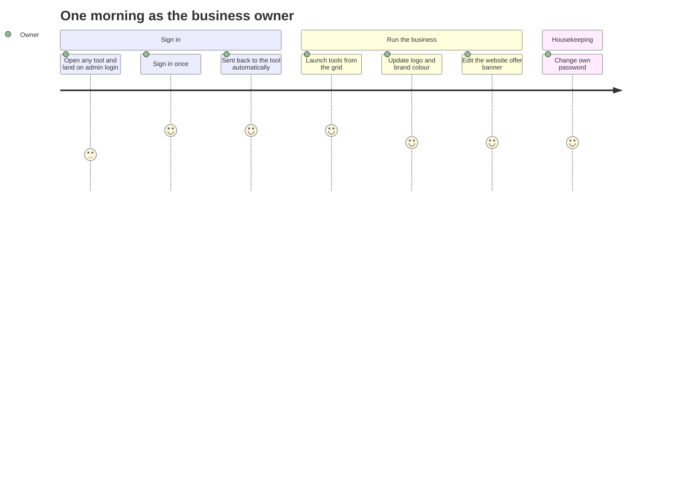
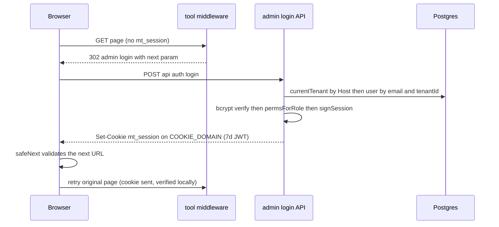
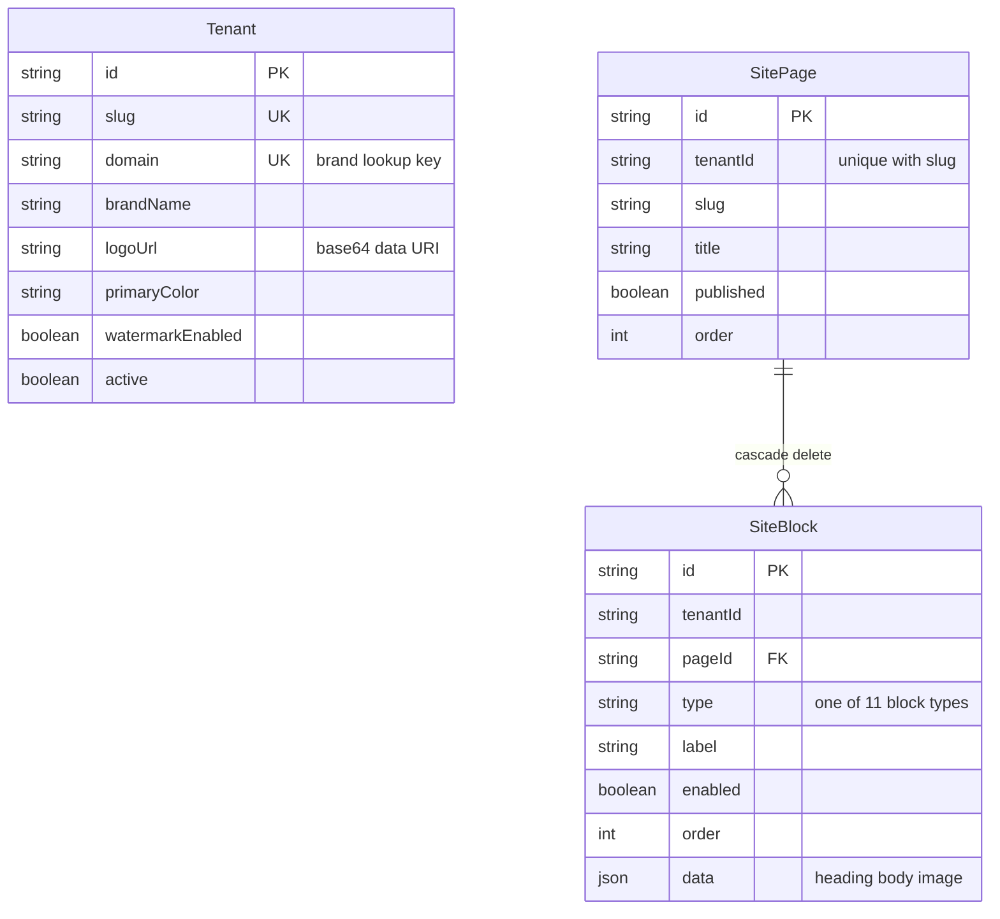
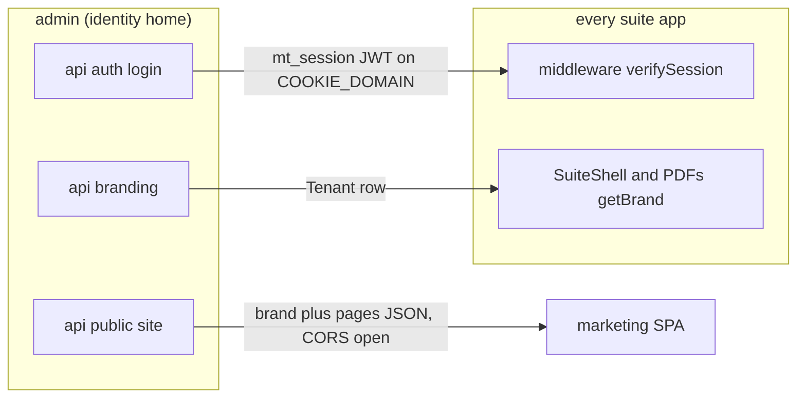
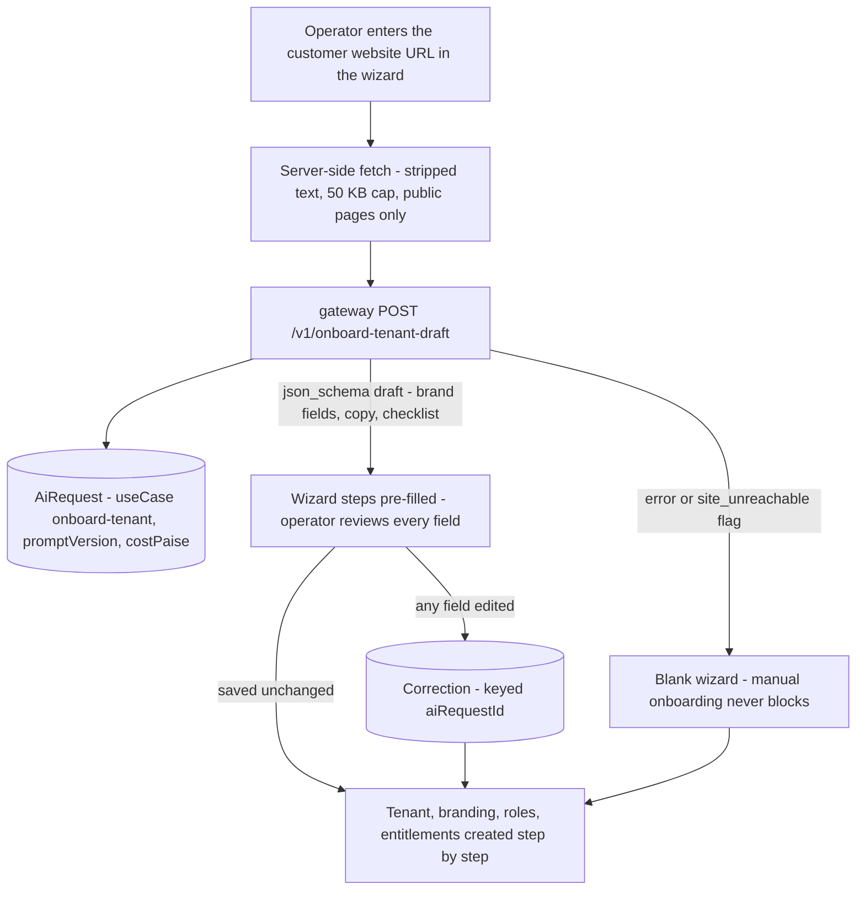

# Admin — engineering bible

The suite's **identity home** plus tenant control panel: the only login UI and credential endpoint in the whole ecosystem, the tool launcher, white-label branding, and the marketing-site CMS whose public feed drives `maplefurnishers.com`. Because admin is where sessions are minted, this page is also the **canonical reference for the shared identity libraries** in `packages/core/src/lib/` (`session.ts`, `auth.ts`, `sso.ts`, `rbac.ts`, `permissions.ts`, `brand.ts`, `tenant.ts`, `tenant-db.ts`) — other module pages link here rather than re-documenting them.

**Status:** `apps/admin` · `admin.maplefurnishers.com` · dev port **:3001** (`PORTS.local.txt`) · prod container `admin` from the shared `maple-suite:latest` image with `APP: admin` (`docker-compose.yml:27-31`), behind Caddy.

## For managers — plain-language guide

This is the front door and control room of the whole suite. Staff sign in *here, once*, and every other tool — quotations, photoshoot, invoices — opens without asking again for a week. It is also where you set your brand (logo, colours) so every screen and every PDF carries it, and where you edit the public marketing website yourself.

| Feature | What it means in your day | Who uses it |
| --- | --- | --- |
| One login for everything | A salesperson opens the quotations tool on Monday morning, is sent to the admin sign-in, types their password once — and every tool works for the next 7 days without another prompt | All staff |
| Per-business accounts | If a second business runs on the platform, the same email can exist separately for each — sign-in on your domain only ever checks *your* staff list | All staff |
| Tool launcher | After signing in, each person sees a grid of only the tools their role allows — accounts staff see finance and invoices, not the photoshoot studio | All staff |
| Branding | Change the logo or brand colour once here and every app header, every quotation PDF, and the public website pick it up within a couple of minutes | Owner / admin |
| Website editor | The Diwali-offer banner on maplefurnishers.com needs updating: edit the blocks yourself, reorder them, hit publish — live in about half a minute, no developer involved | Owner / admin |
| Change my password | Any staff member can change their own password after confirming the current one | All staff |



**Signs it's working:**
- One sign-in at admin opens every tool subdomain without re-prompting; sign-out ends it everywhere.
- A logo or colour change shows up on tool headers and freshly generated PDFs within ~2 minutes, and on the public site within ~1 minute.
- Disabling a website block hides it from the public site; the public site never goes blank even if the system hiccups (it falls back to a built-in default).

---

## Part A — for implementers

### A1 — What it does

- **Identity home.** `app/login/page.tsx` (form) + `app/api/auth/login/route.ts` (credential check) exist here and nowhere else. Every tool's `middleware.ts` defaults `LOGIN_URL` to `https://admin.maplefurnishers.com/login` and redirects unauthenticated browsers there with `?next=<original URL>`. Login issues the stateless `mt_session` JWT on the parent domain; every subdomain verifies it locally with the shared `AUTH_SECRET` — no auth service calls at request time. Full sequence: [seq-sso-login.md](seq-sso-login.html).
- **Tenant-aware credentials.** The user lookup is scoped to the tenant resolved from the request `Host` header (`currentTenant()`), so the same email can exist independently per tenant.
- **Launcher** (`app/page.tsx`): the signed-in home. Tool grid = `TOOLS` (from `@maple/core/lib/nav`) filtered twice — by `canAccessTool(user.perms, tool, user.role)` and by Flipt `tool.<name>` flags via `enabledTools()`.
- **Branding** (`/branding`): edit `Tenant.brandName`, `primaryColor`, `watermarkEnabled`; upload a logo stored as a base64 data URI on `Tenant.logoUrl`. This is the single source for white-label appearance across every app shell, every PDF, and the public marketing site.
- **Site CMS** (`/website`): `SitePage` rows with ordered `SiteBlock` children (11 block types), publish/enable toggles, reorder, per-block `heading/body/image` data. Served to the marketing SPA by the public, CORS-open `/api/public/site` ([module-web.md](module-web.html)).
- **Account** (`/account`): self-service password change (verifies current password, min 6 chars).

### A2 — Code architecture

| Piece | Path | Role |
| --- | --- | --- |
| Login page | `app/login/page.tsx` | Client form; runs `safeNext()` on `?next` after a 200 |
| Credential endpoint | `app/api/auth/login/route.ts` | Tenant-scoped lookup → bcrypt → `permsForRole` → `signSession` |
| Logout | `app/api/auth/logout/route.ts` | Sets `mt_session=""` with `maxAge: 0` via `sessionCookieOptions(0)` |
| Launcher | `app/page.tsx` | Server component: RBAC + Flipt-filtered grid; Branding/Website links shown only to `*`/`manage_roles` |
| Account page + API | `app/account/page.tsx`, `app/api/account/password/route.ts` | Verify-current-then-rehash |
| Branding UI | `app/branding/page.tsx` → `BrandingForm.tsx` | Server gate (`*` or `manage_roles`), then client form |
| Branding API | `app/api/branding/route.ts`, `app/api/branding/logo/route.ts` | Field-whitelisted PATCH · ≤ 1.5 MB logo → data URI |
| Site CMS UI | `app/website/page.tsx` → `WebsiteManager.tsx` | Pages dropdown + block list with ▲▼ reorder and inline edit |
| Site CMS API | `app/api/site/pages/route.ts`, `.../pages/[id]/route.ts`, `.../pages/[id]/blocks/route.ts`, `.../blocks/[id]/route.ts` | All share the same `guard()` = session ∧ (`*` ∨ `manage_roles`) |
| Public site feed | `app/api/public/site/route.ts` | No auth, `Access-Control-Allow-Origin: *`, `Cache-Control: public, max-age=30` |
| Auth gate | `middleware.ts` | Session-only; matcher excludes `/login`, `api/auth`, static assets |

#### The shared identity libraries (canonical reference)

**`packages/core/src/lib/session.ts` (42 lines)** — the heart of SSO.

- `COOKIE = "mt_session"`; `SESSION_MAX_AGE = 60*60*24*7` (7 days); `COOKIE_DOMAIN = process.env.COOKIE_DOMAIN || undefined` (unset → host-only cookie, which is why dev works without config and prod *must* set it to `.maplefurnishers.com`).
- `secret` is `AUTH_SECRET` **with a hardcoded fallback `"dev-insecure-secret-change-me"`** — an unset prod secret silently produces forgeable tokens; there is no startup assertion.
- `signSession(u)` builds a jose `SignJWT` with claims `{ name, email, role, perms, tid }`, `sub = user.id`, `alg: HS256`, `iat` now, `exp` 7d.
- `verifySession(token)` → `jwtVerify` inside try/catch; any failure (bad signature, expired, malformed) returns `null` — there is deliberately no error channel, so middleware treats all failures as "not signed in".
- `sessionCookieOptions(maxAge)` → `{ httpOnly: true, sameSite: "lax", secure: NODE_ENV==="production", path: "/", domain: COOKIE_DOMAIN, maxAge }`. Login passes `SESSION_MAX_AGE`, logout passes `0` — the same helper guarantees set and clear use identical attributes (a classic logout bug avoided).

**`auth.ts` (16 lines)** — `hashPassword` / `verifyPassword` (bcryptjs, cost 10) and `getSession()`: reads the cookie jar via `next/headers`, returns `verifySession(token)` or `null`. This is the API-route-side session read; middleware reads `req.cookies` directly.

**`sso.ts` (23 lines)** — `safeNext(next, fallback="/")`, the open-redirect guard. Accepts: (1) relative paths starting `/` but not `//`; (2) absolute http(s) URLs whose hostname is `localhost` or ends with `SSO_DOMAIN` (default `".mf.com"`). Everything else → fallback. Two footguns to know: the **default suffix `.mf.com` does not match the real domain** — production must set `SSO_DOMAIN=.maplefurnishers.com` or every cross-subdomain return silently falls back to `/`; and the check is `endsWith`, so a value *without* a leading dot (`maplefurnishers.com`) would also match `evilmaplefurnishers.com` — always configure it with the leading dot.

**`rbac.ts` (43 lines)** — pure functions, also imported client-side (the role editor renders `ACTIONS`). `canAccessTool(perms, tool, legacyRole?)` → `*` or `tool:<name>`, with a legacy role→tool map fallback for pre-permission sessions (empty `perms`). `can(perms, action)` → `*` or `act:<action>`. The six actions: `delete, export, publish, manage_users, manage_roles, manage_flags`. Covered by `rbac.test.ts`.

**`permissions.ts` (11 lines)** — `permsForRole(roleName, tenantId)`: `prisma.role.findFirst({ name, tenantId })` → `role.permissions ?? []`, errors swallowed to `[]`. Called at exactly one moment: login. **This is why permissions are baked into the JWT** — no other code path re-reads `Role.permissions` for an existing session.

**`brand.ts` (42 lines)** — `registrable(host)` strips the port and keeps the last two labels (`admin.maplefurnishers.com` → `maplefurnishers.com`; naive for `co.uk`-style TLDs, fine for this estate). `getBrand()`: host → registrable → `prisma.tenant.findFirst({ domain })`, 60 s in-process `Map` cache keyed by domain, fallback `{ name: "MapleOne" }`. `currentTenant()` (used for **writes**) has a three-step fallback: domain match → `slug: "maple"` → *first tenant in the table*. That last step means a request from an unrecognised host mutates the first tenant — see B5.

**`tenant.ts` (18 lines)** — `getTenantId()`: session `tid` claim first, else `currentTenant()?.id` (for public routes like the site feed). **`tenant-db.ts` (28 lines)** — `tenantDb()` returns a `prisma.$extends` client that injects `tenantId` into `findMany/findFirst/count/updateMany/deleteMany` `where` clauses and stamps it on `create`, for the 20 models in its `SCOPED` set. Single-record `update`/`delete` by unique id are **not** auto-scoped — every admin route correctly guards them with a scoped `findFirst({ where: { id } })` first.

**`flags.ts` (37 lines)** — `isEnabled(key, fallback=true)`: POST to `${FLIPT_URL}/evaluate/v1/boolean`, 1.5 s abort, 30 s cache, **fail-open** (no `FLIPT_URL`, missing flag, or Flipt down ⇒ enabled). `enabledTools(tools)` batches `tool.<name>` lookups for the launcher.

#### Request lifecycle 1 — full login/SSO, function by function

1. Browser hits `https://quotations.maplefurnishers.com/` with no cookie. The tool's `middleware.ts` finds no `mt_session`, and 302s to `LOGIN_URL` with `?next=https://<x-forwarded-host>/<path>` (it prefers `x-forwarded-host` so the redirect works behind Caddy).
2. Admin's own `middleware.ts` matcher **excludes** `/login` and `api/auth`, so the login page renders unauthenticated.
3. User submits. `LoginPage.submit()` POSTs `{ email, password }` to `/api/auth/login`.
4. `POST` handler: `req.json()` (400 on parse failure) → `currentTenant()` (host → tenant row) → `prisma.user.findFirst({ email: lowercased, tenantId: tenant.id })` → checks `user.active` → `verifyPassword` (bcrypt compare). Any failure returns a uniform 401 `"Invalid email or password"` (no user-enumeration oracle). DB unreachable → 503.
5. `permsForRole(user.role, user.tenantId)` reads `Role.permissions` — **the only read, ever**.
6. `signSession({...user, perms})` → JWT; `res.cookies.set(COOKIE, token, sessionCookieOptions(SESSION_MAX_AGE))` sets it on `COOKIE_DOMAIN` so every subdomain receives it.
7. Back in the browser, `submit()` runs `safeNext(searchParams.get("next"), "/")`. Relative → `router.push` + `router.refresh()`; absolute (validated suffix) → `window.location.assign(next)` — a full navigation to the original tool, which now carries the cookie and passes its middleware's local `verifySession`.



#### Request lifecycle 2 — brand resolution

Any app's layout (e.g. `apps/docs/app/layout.tsx`) or PDF endpoint calls `getBrand()`: `headers().get("host")` → `registrable()` → cache hit? return; else `tenant.findFirst({ domain })` → map to `{ name, logoUrl, primaryColor, domain }` → cache 60 s → return (DB failure → `MapleOne` default). PDF apps expose it as `GET /api/brand` (e.g. `apps/quotations/app/api/brand/route.ts` is a one-liner around `getBrand()`); the client fetches `logoUrl` and passes it as a `logo` prop into the React-PDF document (`apps/quotations/app/page.tsx:237-238`).

#### Request lifecycle 3 — authenticated request through admin's own middleware

`middleware.ts` (15 lines) runs on every path except `/login`, `api/auth`, `_next` statics and image assets (see the matcher regex on line 15). Flow: read `req.cookies.get("mt_session")` → `verifySession(token)` → if `null`: API paths get a JSON 401 (`{error: "unauthorized"}`), pages get a 302 to `/login?next=<absolute original URL>` (rebuilt from `x-forwarded-host` when behind Caddy so the post-login return crosses the proxy correctly). If a user exists: `NextResponse.next()` — **no `canAccessTool` call**. This is deliberate for the launcher (every authenticated user must be able to see their tool list) but is exactly why the branding APIs need their own route-level guard (B5). Contrast with `apps/users/middleware.ts`, which adds the tool check — the two middlewares are the suite's two archetypes.

#### Request lifecycle 4 — site CMS edit (WebsiteManager)

1. `/website` server component: `getSession()` → redirect `/login` if absent → render a "no access" note unless `perms` has `*` or `manage_roles` → mount `WebsiteManager`.
2. Mount: `loadPages()` GETs `/api/site/pages` (returns pages with `_count.blocks`); selecting a page triggers `loadBlocks(pid)` → GET `/api/site/pages/[id]/blocks`.
3. Every mutation is optimistic-free — each `fetch` is followed by a reload (`loadPages()` / `loadBlocks(pageId)`), which keeps the client dumb and the server canonical.
4. Reorder (`move(i, dir)`) swaps the `order` values of the two adjacent blocks with **two sequential PATCHes** — not atomic; a failure between them leaves duplicate `order` values. Harmless because rendering sorts by `order` and ties are stable, but a batch `PATCH /api/site/pages/[id]/blocks/reorder` accepting `[{id, order}]` is the clean fix.
5. Server side, every `[id]` route does the tenant-scoped `findFirst` existence check before `update`/`delete` — the documented `tenant-db.ts` discipline for non-auto-scoped unique operations.
6. The UI's `home` page is delete-protected client-side only (`slug !== "home"` hides the button); the API would happily delete it — the marketing SPA then falls back to `DEFAULT_SITE`, so the failure mode is cosmetic, not fatal.

#### Request lifecycle 5 — public site API serving web

`apps/web/src/site/api.ts#apiBase()` derives the feed origin: `VITE_SITE_API` override → `localhost` dev → `http://localhost:3001` → else `https://admin.<registrable domain>`. `fetchSiteConfig()` GETs `/api/public/site` with `credentials: 'omit'`. The route: `currentTenant()` → `sitePage.findMany({ tenantId, published: true }, include enabled blocks ordered by order, select type/label/data/order)` → `{ brand, pages }` with CORS `*` and a 30 s cache header; any error degrades to `{ brand: { name: "MapleOne" }, pages: [] }` and the SPA falls back to its baked-in `DEFAULT_SITE`. `Page.tsx` maps each block `type` through `BLOCK_REGISTRY` — **which contains 10 entries; the 11th admin type `richtext` has no renderer and silently renders nothing** (verified: `apps/web/src/site/blocks.tsx` vs `WebsiteManager.tsx` `BLOCK_TYPES`).

### A3 — Data model & API

Admin owns `Tenant`, `SitePage`, `SiteBlock` (`packages/db/prisma/schema.prisma:238-312`). `SiteBlock.pageId → SitePage` is the **only required FK in the suite schema**, with `onDelete: Cascade`.



| Route | Method | Auth | Request → Response |
| --- | --- | --- | --- |
| `/api/auth/login` | POST | Public | `{email, password}` → 200 `{ok, role}` + Set-Cookie · 400 bad JSON · 401 bad creds/inactive · 503 no DB |
| `/api/auth/logout` | POST | Public | — → `{ok}` + cleared cookie |
| `/api/account/password` | POST | Session | `{current, next}` → `{ok}` · 400 wrong current / `next` < 6 chars · 401 no session |
| `/api/branding` | GET | **Session only — no perms check** | → `{id, name, brandName, logoUrl, primaryColor, watermarkEnabled}` |
| `/api/branding` | PATCH | **Session only — no perms check** | whitelist `{brandName?, primaryColor?, watermarkEnabled?}` → updated Tenant |
| `/api/branding/logo` | POST | **Session only — no perms check** | raw body (Content-Type = mime) ≤ 1.5 MB → `{ok}` · 400 too large |
| `/api/site/pages` | GET/POST | Session ∧ (`*` ∨ `manage_roles`) | POST `{slug, title?}` (slug slugified server-side) → SitePage · 400 dup slug |
| `/api/site/pages/[id]` | PATCH/DELETE | same guard | whitelist `{title?, published?, order?}` · DELETE cascades blocks · 404 if not in tenant |
| `/api/site/pages/[id]/blocks` | GET/POST | same guard | POST `{type?, label?, data?}` defaults `richtext` / `"New block"` / `{}` , `order` = count |
| `/api/site/blocks/[id]` | PATCH/DELETE | same guard | whitelist `{label?, enabled?, order?, data?}` · 404 if not in tenant |
| `/api/public/site` | GET/OPTIONS | **None — public, CORS `*`** | → `{brand: {name, logoUrl, primaryColor}, pages: [{slug, title, blocks: [{type, label, data, order}]}]}` |

### A4 — Config reference (every env var admin reads)

| Var | Read in | Default | Notes |
| --- | --- | --- | --- |
| `AUTH_SECRET` | `core/session.ts` | `"dev-insecure-secret-change-me"` | **Must** be identical across all apps; must be set in prod (no assertion exists) |
| `COOKIE_DOMAIN` | `core/session.ts` | unset (host-only) | Prod: `.maplefurnishers.com` — enables cross-subdomain SSO |
| `SSO_DOMAIN` | `core/sso.ts` | `".mf.com"` | Prod: `.maplefurnishers.com` **with leading dot** (suffix is `endsWith`-checked); wrong default silently breaks `?next=` returns |
| `DATABASE_URL` | `@maple/db` prisma | — | Shared Postgres |
| `FLIPT_URL`, `FLIPT_NAMESPACE` | `core/flags.ts` | unset → fail-open, `default` | Launcher tool gating |
| `NEXT_PUBLIC_SUITE_DOMAIN` | `core/nav.ts` | `.maplefurnishers.com` | Builds `toolUrl()`/`adminUrl()` links on the launcher |
| `NODE_ENV` | `core/session.ts` | — | `production` ⇒ `secure` cookie |
| `ADMIN_EMAIL`, `ADMIN_PASSWORD` | `packages/db/prisma/seed.mjs` | `admin@maplefurnishers.com` / `maple@123` | Seed-time only |
| `LOGIN_URL` | *not read by admin* | — | Consumed by every **other** app's middleware to find admin |

### A5 — Recipe: add a branding field end-to-end (including PDF flow-through)

Worked example: a `tagline` shown under the brand name in app shells and on PDF headers.

1. **Schema** — `packages/db/prisma/schema.prisma`, model `Tenant`: add `tagline String?`. Run `npm run -w @maple/db push`.
2. **Write API** — `apps/admin/app/api/branding/route.ts`: add `"tagline"` to the PATCH whitelist array and to the GET response object. The whitelist loop (`for (const k of [...]) if (b[k] !== undefined)`) is the mass-assignment guard — never spread the body.
3. **UI** — `app/branding/page.tsx`: pass `tagline: t?.tagline ?? ""` into `initial`; `BrandingForm.tsx`: add a `useState` + `<Input>` and include it in the `save()` PATCH body.
4. **Read contract** — `packages/core/src/lib/brand.ts`: add `tagline: string | null` to the `Brand` type and map `t.tagline` in `getBrand()`. Every consumer (`SuiteShell`, docs layout, each PDF app's `/api/brand`) now receives it for free because they all return `getBrand()` verbatim.
5. **PDF flow-through** — the pattern in `apps/quotations/app/page.tsx:237`: the client fetches `/api/brand`, extracts the field, passes it as a prop to the `@react-pdf/renderer` document (`MasterProposalPdf`). Add a `tagline` prop next to `logo` and render it in the header `<Text>`. Repeat for invoices/HR (same `/api/brand` + prop pattern).
6. **Public site** — if the marketing SPA should show it, add it to the `brand` object in `app/api/public/site/route.ts` and to `SiteBrand` in `apps/web/src/site/types.ts`.
7. **Caches** — `getBrand()` caches per-domain for 60 s and `/api/public/site` sends `max-age=30`; expect up to ~90 s of staleness after saving. There is no cache-bust hook; document it or add one (B3 audit-log middleware is the natural place).

---

## Testing — how we verify this module

**Current state (verified by running `npm test` at the suite root):** **zero tests under `apps/admin`.** The shared identity core it re-exports *is* tested — `packages/core/src/lib/session.test.ts` (2: sign/verify roundtrip, tampered-token rejection), `rbac.test.ts` (6: `canAccessTool`/`can` truth tables incl. legacy fallback), `utils.test.ts` (1), `ui/button.test.tsx` (1) — **10 tests, all passing**, run by the root `vitest run` whose config already includes `apps/**/*.test.{ts,tsx}`, so admin route tests need zero config to land. (B5's "only `session.test.ts` and `rbac.test.ts`" undercounts slightly — `utils.test.ts` and the button test also exist.)

**Unit-test targets** (pure functions in `packages/core/src/lib/`, partially covered — the gaps):

| Function | What to pin |
| --- | --- |
| `safeNext` (`sso.ts`) | table-driven: `/x` accepted; `//evil.com` rejected; absolute URL on `*.maplefurnishers.com` accepted with `SSO_DOMAIN` set; the **dotless-suffix pitfall** — `SSO_DOMAIN=maplefurnishers.com` matching `evilmaplefurnishers.com`; garbage → fallback |
| `sessionCookieOptions` | set (`SESSION_MAX_AGE`) and clear (`0`) produce identical attributes apart from `maxAge` — the logout-bug guarantee |
| `registrable` (`brand.ts`) | port stripping, last-two-labels; pin the known `co.uk` naivety as documented behavior |
| `permsForRole` (`permissions.ts`) | unknown role and thrown error both collapse to `[]` (mock prisma) |

**Integration tests** (route + scratch DB; the named cases are B5's open findings — write the red ones first, they *document* each gap until its fix lands):

| Case | Route | Asserts |
| --- | --- | --- |
| Login matrix | POST `/api/auth/login` | bad JSON → 400; unknown email / wrong password / inactive user → byte-identical 401; DB down → 503; success → Set-Cookie asserts `HttpOnly; SameSite=Lax; Max-Age=604800` |
| **Branding guard gap** (open, B5) | PATCH `/api/branding` + POST `/api/branding/logo` as a non-`manage_roles` session | red: expect 403 — today any signed-in user succeeds |
| Site CMS guard | POST `/api/site/pages` as plain session | 403; duplicate slug → 400; page DELETE cascades its blocks |
| **`currentTenant()` first-row fallback** (open, B5) | branding PATCH with an unrecognized `Host` | red: expect 404 — today it mutates the first tenant row |
| Public site feed degradation | GET `/api/public/site` with DB down | 200 `{brand:{name:"MapleOne"}, pages:[]}`, CORS `*`, `max-age=30` |
| **`richtext` renderer gap** (open, B5) | author a `richtext` block → fetch feed | pin: block present in feed, dropped by `apps/web` `BLOCK_REGISTRY` — until the decision lands |
| Logo size cap | POST `/api/branding/logo` at 1.5 MB + 1 | 400 |
| Reorder non-atomicity | two-PATCH block swap, fail the second | duplicate `order` values render stably (documents the A2 lifecycle 4 caveat) |

**E2E (Playwright), as user stories:**

1. *SSO roundtrip.* Open a tool subdomain with no cookie → redirected to admin login with `?next=` → sign in → land back on the original tool URL, page renders. This one test exercises middleware, `safeNext`, cookie domain, and JWT verification across two apps.
2. *Branding flow-through.* Change `primaryColor` and upload a logo → within the 60 s + 30 s cache windows the launcher shell and the public site feed both reflect it.
3. *Website edit.* Add a block, reorder it above another, disable a third → the public marketing page reflects all three within the 30 s cache.
4. *Password change.* Wrong current password → error; correct → the old password no longer signs in, the new one does.

**Definition of done for new features here:** every new admin API route records its guard decision explicitly (session-only vs `guard()`) and lands with a 403 test; any change to `session.ts`/`sso.ts`/`brand.ts` extends the core unit tests in the same PR — these files are the suite's shared identity, so their blast radius is every app; cookie-attribute changes prove set/clear symmetry.

---

## Part B — for architects

### B1 — Cross-module relations: the contracts every module depends on

**The identity contract.** Every app in the suite (and both standalone repos when folded back) depends on exactly three things admin controls:

1. *JWT claim schema* — the wire format of `mt_session`:

```json
{
  "sub":   "cuid — User.id",
  "name":  "string",
  "email": "string",
  "role":  "string — Role.name, no FK",
  "perms": ["*"] ,
  "tid":   "string | null — Tenant.id",
  "iat":   1752700000,
  "exp":   1753304800
}
```

   `perms` entries are `"*"`, `"tool:<name>"`, or `"act:<action>"`. Consumers must treat unknown keys as inert (forward-compatible) and must not assume `perms` non-empty — `canAccessTool` has the legacy-role fallback for exactly that case. **`perms` is a login-time snapshot** (see [module-users.md](module-users.html) for the staleness consequences).

2. *Cookie parameters* — name `mt_session`; `HttpOnly`; `SameSite=Lax`; `Secure` in prod; `Path=/`; `Domain=$COOKIE_DOMAIN`; `Max-Age=604800`. Per the [OWASP Session Management Cheat Sheet](https://cheatsheetseries.owasp.org/cheatsheets/Session_Management_Cheat_Sheet.html) this is a sound baseline; the deliberate deviation is `Domain`-scoped rather than `__Host-` prefixed, which is the price of subdomain SSO — any compromised subdomain app can read/fix the session cookie, so subdomains must be treated as one trust zone.

3. *`safeNext` rules* — the redirect allowlist: relative paths (not `//`), or absolute http(s) on `localhost` / `*$SSO_DOMAIN`. Any service that adds a login redirect must reuse `safeNext`, never re-implement it.

**The brand contract.** `getBrand(): { name, logoUrl, primaryColor, domain }` resolved by host, 60 s cache, `MapleOne` fallback, plus per-app `GET /api/brand` re-exports for client-side PDF generation. The marketing site gets the same fields inside `/api/public/site`. Changing the `Brand` shape is a fan-out change across every app shell + 3 PDF pipelines + the SPA — version it additively only.

**Entitlements → Flipt sync (designed, not built).** Today tool visibility = RBAC ∩ Flipt, but Flipt flags are hand-toggled and global (`entityId: "suite"`). The white-label plan needs per-tenant entitlements ("this customer bought quotations + catalog only"). Design: an `Entitlement` table (`tenantId, toolKey, active, plan`) owned by admin; a sync job (or write-through hook on the future onboarding wizard) that upserts Flipt **segment** rules keyed by tenant slug, with `flags.ts` gaining `entityId: tenantId` and `context: { tenant: slug }` so evaluation becomes per-tenant. Flipt stays the runtime evaluator (fast, cached, fail-open); Postgres stays the source of truth; the sync is one-way and idempotent.

### B2 — Infra touchpoints (bootstrap vs enterprise)

| Concern | Bootstrap track (today) | Enterprise track (designed) |
| --- | --- | --- |
| Session verification | Stateless JWT, local `jwtVerify` in every app | Same, **plus Redis revocation list** (below) |
| Deployment | One box, `docker-compose`, Caddy auto-HTTPS, `APP=admin` container | K8s: `admin` Deployment (2+ replicas, it is the SSO SPOF), `readiness: /api/health` (to build), HPA on CPU, PodDisruptionBudget 1 |
| Brand cache | In-process `Map`, 60 s | Redis shared cache keyed `brand:<domain>` with pub/sub invalidation on branding PATCH |
| Events | None (shared DB) | Kafka topics below |

**Redis session-revocation design — closing the 7-day-JWT gap.** The known gap: a disabled user, deleted user, or demoted role keeps a valid token for up to 7 days ([cross-module.md](cross-module.html)). Standard fix (see [SuperTokens on JWT blacklists](https://supertokens.com/blog/revoking-access-with-a-jwt-blacklist) and the [Redis denylist pattern](https://oneuptime.com/blog/post/2026-03-31-redis-how-to-build-a-token-blacklist-for-jwt-revocation-with-redis/view)):

- Add a `jti` (random cuid) claim in `signSession`.
- Two Redis structures: `revoked:jti:<jti>` (explicit single-session kill, TTL = token's remaining life so entries self-clean) and `revoked:user:<userId> = <epoch>` ("revoke everything issued before T" — set on password change, deactivation, role edit; TTL 7 d).
- `verifySession` gains an optional async check: signature valid → `EXISTS revoked:jti` → `GET revoked:user` vs `iat`. Two `O(1)` lookups, pipelined; middleware runs on the Node runtime already so ioredis works.
- **Fail posture decision:** fail-open on Redis outage (availability over instant revocation) for tools; fail-closed for the users/admin apps. Keep the 7-day expiry as the backstop either way.
- Cheaper interim alternative: shorten `SESSION_MAX_AGE` to 12–24 h and add silent re-issue (refresh the cookie when `exp - now < 50%`), which re-runs `permsForRole` — solving both revocation *and* perm staleness with zero new infra. This is the recommended first step on the bootstrap track.

**Kafka tenant/identity events (enterprise track).** Admin is the natural producer for tenant lifecycle; envelope per [event-catalog.md](event-catalog.html) (`id`, `tenantId`, `type`, `createdAt` + payload):

| Topic / type | Producer | Payload |
| --- | --- | --- |
| `tenant.created` | admin (onboarding wizard) | `{ tenantId, slug, domain, plan, adminUserId }` |
| `tenant.branding.updated` | admin branding PATCH | `{ tenantId, changed: ["brandName","logoUrl"], actorId }` — consumers: brand-cache invalidator, web ISR hook |
| `session.revoked` | admin / users | `{ userId, tenantId, jti?, reason }` — consumer: the Redis revocation writer |

### B3 — Designed enhancements (each in depth)

**1. MapleID — extracting identity into its own service** (the "Harden identity" step in [platform-architecture.md](platform-architecture.html)).

*Why:* three repos already duplicate login code with drifting secrets; entitlements, audit, and revocation all want one owner.

*Endpoints (v1):*

| Endpoint | Purpose |
| --- | --- |
| `POST /v1/login` | credentials → short-lived **access JWT (15 min)** + httpOnly **refresh token (30 d, rotating, stored hashed)** |
| `POST /v1/token/refresh` | rotate refresh, mint new access token with **fresh perms** (kills perm-staleness structurally) |
| `POST /v1/token/revoke` | revoke one refresh token or all for a user |
| `GET /v1/jwks` | publish keys — switch HS256 → **RS256/EdDSA** so apps verify with the public key and never hold a signing secret |
| `GET /v1/userinfo` · `POST /v1/introspect` | claims for apps · check for non-JWT consumers |

*Token model:* access token keeps today's claim schema (so `verifySession` consumers barely change — swap secret for JWKS); refresh tokens live in a `RefreshToken` table (`id, userId, tenantId, hash, expiresAt, rotatedFrom, revokedAt`), rotation-with-reuse-detection (a replayed old refresh token revokes the whole chain).

*Migration steps:* (1) lift `session/auth/sso/permissions` into a `maple-id` service that serves admin's existing `/api/auth/*` paths behind Caddy — zero client change; (2) move key to RS256 + JWKS, ship a dual-verify window in `verifySession` (try JWKS, fall back to shared secret) for one token lifetime; (3) flip apps' middleware to the 15-min access token + silent refresh via an iframe-less redirect or a `/refresh` XHR from `SuiteShell`; (4) delete the HS256 path and `AUTH_SECRET` from every app; (5) point the standalone quotations/photoshoot repos at MapleID — the fold-in prize.

**2. Customer onboarding wizard.** Today creating a tenant is `prisma` surgery (see [deployment-runbook.md](deployment-runbook.html) Stage 6). Design: an admin-app `/tenants` area (new `act:manage_tenants` action, super-admin only) with a 5-step wizard — (1) tenant + slug + domain(s), (2) branding (reuse `BrandingForm` against the *target* tenant, which requires threading an explicit `tenantId` through the branding API instead of `currentTenant()`), (3) seed roles/users (invite email with a set-password token — needs the first outbound-mail dependency), (4) entitlements → Flipt sync (B1), (5) DNS/Caddy checklist with a live `getBrand()` probe. Each step emits `tenant.*` events (B2). The wizard is also what forces fixing the `currentTenant()` first-row fallback, because "unknown host" must become an error, not a default.

**3. Audit log.** Schema (`packages/db/prisma/schema.prisma`):

```prisma
model AuditEvent {
  id        String   @id @default(cuid())
  tenantId  String?
  actorId   String
  actorRole String
  action    String   // "branding.update" | "site.block.delete" | "auth.login" ...
  target    String?  // model:id
  diff      Json?    // before/after for writes
  ip        String?
  createdAt DateTime @default(now())
  @@index([tenantId, createdAt])
}
```

Middleware design: a `withAudit(handler, action, targetOf)` wrapper for route handlers (route-level, not Edge middleware, so it can see the parsed body and the result), writing the event **after** the 2xx response is determined, fire-and-forget with a `console.error` fallback so auditing can never break the request. First adopters: all of `/api/branding*`, `/api/site/**`, login success/failure (rate-limit signal), and the users app's mutations. Retention: partition by month, drop at 24 months (tenant-configurable later).

**K8s profiles (enterprise track detail).** When compose graduates to K8s ([aws-deployment.md](aws-deployment.html) end-state), admin's profile differs from tool apps:

| Setting | Tool app (e.g. quotations) | admin |
| --- | --- | --- |
| Replicas | 1–2, scale-to-fit | **2 minimum** (login SPOF), HPA target 60% CPU |
| Probes | `/api/health` liveness + readiness | same, plus readiness must include a DB ping — a live admin that can't reach Postgres serves 503 logins and should leave the LB |
| Secrets | `AUTH_SECRET` via Secret mount | Same Secret object as all apps until MapleID moves to JWKS, after which only MapleID holds keys |
| Network policy | ingress from Caddy/ingress only | plus ingress from every app namespace if `/api/brand`-style callbacks are added |
| PDB | not needed | `minAvailable: 1` |



### B4 — Scaling

- **Read path is already cheap:** session verification is CPU-only (HMAC) in every app; admin itself serves login (rare), the launcher (1 DB read + N Flipt calls, cached 30 s), and the site feed (1 query, 30 s HTTP cache). A single container saturates far beyond current needs.
- **The real SPOFs:** (1) admin down ⇒ nobody *new* can log in (existing JWTs keep working — a nice degradation property of stateless SSO); run 2 replicas early. (2) Postgres — every app shares it; see [aws-deployment.md](aws-deployment.html) for the RDS step.
- **In-process caches don't scale horizontally:** `brand.ts` and `flags.ts` Maps are per-instance, so replicas can serve different brands for 60 s after an edit. Harmless now; move to Redis when replicas > 1 *and* branding edits become customer-facing (white-label pilot).
- **Logo-as-data-URI:** a 1.5 MB base64 logo rides inside every `getBrand()` result, `/api/public/site` payload, and PDF fetch. At multi-tenant scale move `Tenant.logoUrl` to object storage (`core/lib/storage.ts` already exists) and keep only the URL — same migration docs needs for images.
- Public site feed at scale: it is already CDN-friendly (`public, max-age=30`, no cookies); putting CloudFront in front of `admin.<domain>/api/public/site` is a config change, not a code change.

## AI — use case & pipeline

**Use case: an onboarding copilot for the tenant wizard.** B3-2's wizard turns tenant creation from prisma surgery into five reviewed steps; the copilot makes step 1 and 2 start 80% filled instead of blank. The operator pastes the customer's website URL; the server fetches it (stripped text, public pages only), and the gateway drafts what the wizard needs: brand name and a plausible `primaryColor`, tagline and about-copy suggestions in the customer's own register, and a tenant-specific go-live checklist (DNS records for their domains, which entitlements imply which seed roles, branding assets still missing). Every field lands as a *pre-filled wizard input* — the operator reviews, edits, and saves; nothing writes a `Tenant`, `Role`, or Flipt rule until the human clicks through each step. This is deliberately an operator-facing tool at operator-facing volume: onboardings are rare, so the win is fewer forgotten steps (the checklist), not saved keystrokes.



| Contract | Detail |
| --- | --- |
| Endpoint | `POST {gateway}/v1/onboard-tenant-draft` — admin never holds a model key; the URL fetch happens in admin (it owns the network posture), only extracted text crosses to the gateway |
| Input | stripped page text (≤50 KB) + the customer's stated business type + selected entitlements + the wizard's step schema |
| `json_schema` (structured output, `additionalProperties: false`) | `brandName {value, confidence}`, `tagline {value, confidence}`, `primaryColor {value hex, confidence}` (from the site's dominant palette description), `toneWords[]`, `aboutCopy` (≤120 words, paraphrase only), `checklist [{step, owner "operator\|customer", blockedBy?}]`, `flags ["site_unreachable", "brand_ambiguous", "content_thin"]` — never-guess: an unreachable or near-empty site returns flags and nulls, not invention |
| Model + phrase | `sonnet-5` — reading a scraped page and drafting structured, on-register copy is squarely a mid-model comprehension task; no escalation route (a confusing website is the `brand_ambiguous` flag's job, then the operator's) |
| ₹/call | ≈ ₹2–4 per onboarding — and onboardings are quarterly events, so annual spend rounds to a coffee; `costPaise` logged and budgeted like every call |
| er-platform tables | `AiRequest` (every draft) · `Correction` (each wizard field the operator edits before save — the copy fields especially, which is real brand-voice training data) · `Dataset` plausibly never graduates to a `TrainingRun` at this volume, and that is fine ([er-platform.md](er-platform.html)) |

**PII and brand-safety note — this pipeline reads third-party content, so its rules are stricter than the suite's default:**

- Fetch **public pages only** — never anything behind a login, and honor the target's `robots.txt`; the fetch is one-shot at the operator's explicit click, not a crawler.
- **Strip contact details** (emails, phone numbers, names of the customer's staff) from the extracted text before it reaches the model — the draft needs the register of the prose, not its people.
- Generated copy is **paraphrase-only by prompt contract**, with an app-side shingle check against the source text so the tenant's about-copy never reproduces their old site verbatim (their words may be someone else's copyright too).
- The scraped text is discarded after the call — `AiRequest` logs the URL and the output, never the fetched body.

**Rollout & eval gate.** Fixture: the websites of 10 real furniture/interiors businesses, hand-labelled for brand name, plausible hex, and tone; gate is brand-name exact-match ≥ 90% and zero verbatim-copy violations across the set — the checklist is graded by the operator in use, not pre-launch. **Not before:** the wizard itself (B3-2) exists and has onboarded at least one tenant manually — a copilot for a process that is still prisma surgery automates nothing, and the wizard alone captures ~90% of the value (the forced sequence, the `currentTenant()` fallback fix, the DNS checklist as static text). Build the copilot when onboarding frequency makes blank-form fatigue real — roughly when tenants arrive monthly rather than quarterly.

### B5 — Status: done / left / decisions (carried findings preserved)

**Done ✓**

- Stateless cross-subdomain SSO with uniform-401 credential checks, tenant-scoped lookup, perms-in-token, open-redirect protection (`safeNext`), and matching set/clear cookie attributes.
- Launcher with RBAC × Flipt double-gating.
- White-label branding with per-host resolution + caching; site CMS with cascade-safe page/block editing, field-whitelisted PATCHes, tenant-scoped existence checks, and a public CORS feed with graceful degradation on both ends (API → empty pages, SPA → `DEFAULT_SITE`).

**Left ◻**

- **B1-class security fixes** — the roles-API privilege escalation lives in the users app ([module-users.md](module-users.html)) but its blast radius is admin's token minting: any escalated role becomes a `*` JWT at next login. Pre-pilot blocker per [deployment-runbook.md](deployment-runbook.html) B1.
- **B5 branding-guard gap (verified, still open):** `/api/branding` and `/api/branding/logo` check only "any valid session" — the `manage_roles` gate exists on the *page*, not the API. Any signed-in sales user can `PATCH /api/branding` with curl. Same fix class as B1: add the `guard()` helper the site routes already use.
- **`currentTenant()` first-row fallback** — an unknown Host silently reads *and writes* the first tenant; must become a 404 before the second tenant onboards.
- **`AUTH_SECRET` / `SSO_DOMAIN` misconfiguration is silent** — add startup assertions in prod (`NODE_ENV==="production" && !process.env.AUTH_SECRET ⇒ throw`).
- **`richtext` block type is authorable in admin but dropped by web** (`BLOCK_REGISTRY` has no renderer) — either implement the renderer in `apps/web` or remove the type from `BLOCK_TYPES`.
- Seeded credentials are printed on the login page (`login/page.tsx:59`) — must not ship to production (runbook B3).
- 7-day JWT revocation gap — B2 design above; interim: shorter expiry + silent re-issue.
- MapleID extraction (B3-1), onboarding wizard (B3-2), audit log (B3-3).
- Cross-cutting: no `/api/health` (runbook D2); only `@maple/core` has tests (`session.test.ts`, `rbac.test.ts`, `utils.test.ts`, `ui/button.test.tsx` — 10 cases) — no admin route tests. Highest-value first test: the login handler's 401/503/200 matrix. Full plan now in the Testing section above.

**Testing the identity core (what exists, what's next)**

- `packages/core/src/lib/session.test.ts` — round-trips `signSession`/`verifySession` and rejects tampered tokens. `rbac.test.ts` — `canAccessTool`/`can` truth table including the legacy fallback.
- Missing, in priority order: (1) login route matrix (bad JSON → 400, unknown email / wrong password / inactive → identical 401, DB down → 503, success → cookie attributes assert `HttpOnly; SameSite=Lax; Max-Age=604800`); (2) `safeNext` table-driven cases including `//evil.com`, `https://evilmaplefurnishers.com` with a dotless `SSO_DOMAIN`, and non-URL garbage; (3) an integration test that `PATCH /api/branding` without `manage_roles` returns 403 — write it red first, it *documents* the B5 gap until the fix lands.

**Decisions on record**

- *Stateless SSO over a session store* — accepted the revocation gap consciously for zero-infra bootstrap; the mitigation path (short tokens → Redis denylist → MapleID) is staged, not a rewrite.
- *`manage_roles` doubles as the "site admin" permission* for branding/CMS/docs rather than minting `act:manage_site` — fine at this team size, revisit when a marketing role that shouldn't touch RBAC appears.
- *Fail-open flags* — Flipt outages must never take down tools; flags are a kill switch, not an auth layer.

---

**External references** — [OWASP Session Management Cheat Sheet](https://cheatsheetseries.owasp.org/cheatsheets/Session_Management_Cheat_Sheet.html) (cookie attributes, `__Host-` prefix trade-off) · [SuperTokens: revoking access with a JWT blacklist](https://supertokens.com/blog/revoking-access-with-a-jwt-blacklist) · [Redis JWT denylist pattern](https://oneuptime.com/blog/post/2026-03-31-redis-how-to-build-a-token-blacklist-for-jwt-revocation-with-redis/view) · [JWT revocation strategies overview](https://www.michal-drozd.com/en/blog/jwt-revocation-strategies/) (token versioning / revoke-before timestamps).

**Sibling pages** — [module-users.md](module-users.html) (role/permission data), [module-docs.md](module-docs.html), [module-web.md](module-web.html) (feed consumer), [seq-sso-login.md](seq-sso-login.html), [rbac-matrix.md](rbac-matrix.html), [deployment-runbook.md](deployment-runbook.html), [platform-architecture.md](platform-architecture.html).
