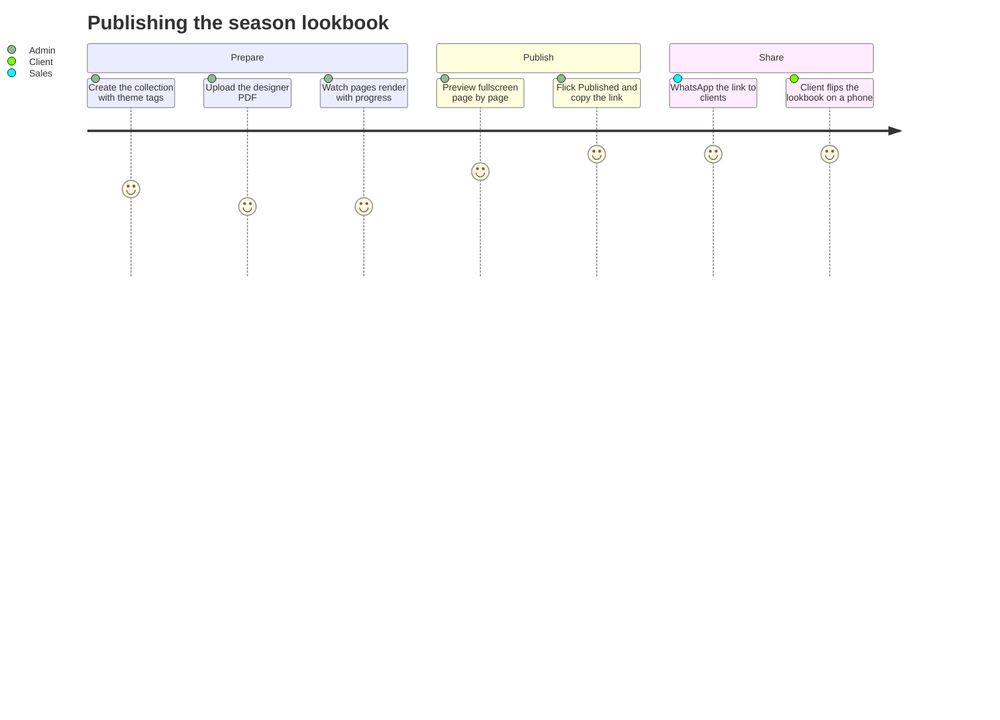
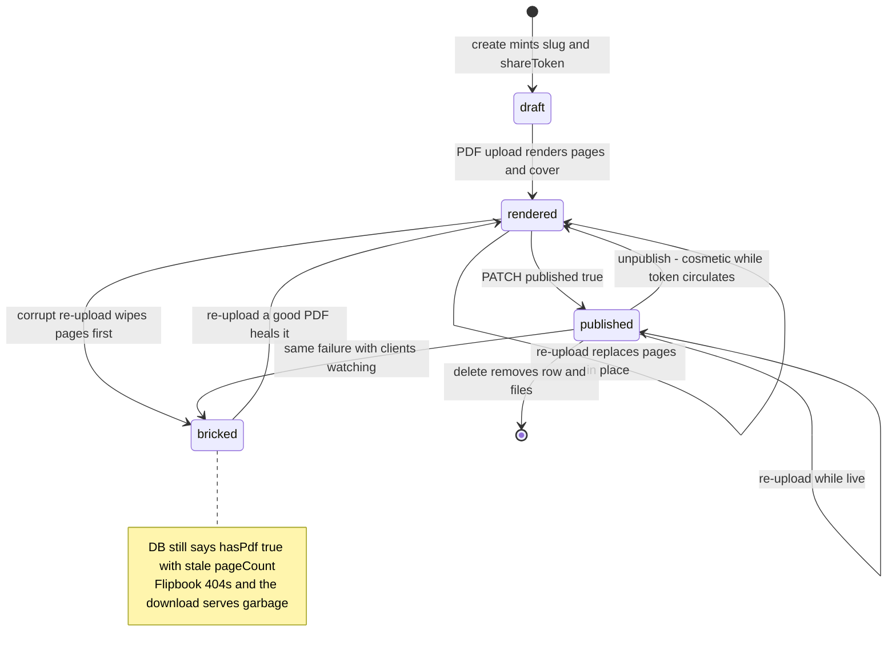
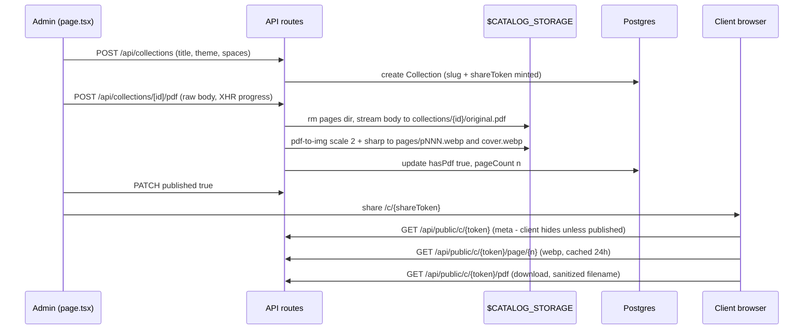
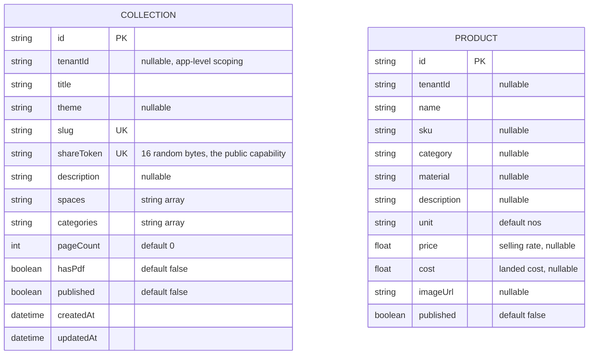
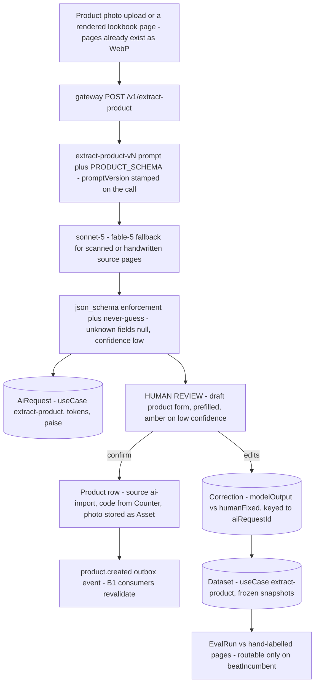

# Catalog — engineering bible

Theme collections with client-facing lookbooks: upload a PDF per collection, the app rasterizes it into web pages, and a tokenized public flipbook shares it with clients. This page is the full engineering reference — Part A tells an implementer everything the code does today, traced file by file; Part B tells an architect where the module goes next, headlined by the **product master** design (unifying the suite's orphaned `Product` with quotations' live fork).

**Status:** `apps/catalog` · `catalog.maplefurnishers.com` · dev `:3009` · prod: the shared `maple-suite:latest` image with `APP=catalog` (compose mounts the shared `catalog` volume at `/data/catalog` — the same volume is mounted into `photoshoot`).

## For managers — plain-language guide

This is the lookbook machine: the designer's PDF goes in, a client-ready web flipbook comes out. Instead of emailing a 40MB PDF that half your clients can't open on their phone, you upload it once, flick Publish, and WhatsApp a link — the client flips through pages that load instantly, and can still download the original PDF if they want it. Honest caveats: once a link has been shared it keeps working even after you un-publish (treat the link itself as the key to the door), and the product/price-list side of "catalog" isn't built yet — this module is lookbooks only today.

| Feature | What it means in your day | Who uses it |
| --- | --- | --- |
| Collections | One entry per theme or season — "Nimbus / Cloud Dancer 2026" — tagged with spaces (Living Room, Study) and categories (Sofas, Chairs) | Admin, marketing |
| PDF-to-flipbook pipeline | Upload the designer's PDF once with a progress bar; the system turns every page into a fast web image plus a cover automatically | Admin |
| Publish and share link | Publishing the new lookbook is one toggle plus copy-link; clients view it on any phone, no login, with a Download PDF button | Admin publishes, sales shares, clients view |
| Fullscreen preview | Check every page yourself before a client ever sees it | Admin |
| Delete | Removes the collection and all its files | Admin |

Signs it's working:

- A new lookbook goes from designer PDF to client-ready link the same afternoon.
- Clients open the link on their phones and flip pages smoothly — no "can you resend the PDF" calls.
- Sales shares links in WhatsApp instead of attaching PDFs to emails.



---

## Part A — implementers

### A1 — What exists today

- **Collections CRUD** — create a `Collection` (title, theme, spaces, categories, description); slug auto-generated as `kebab(title)-<3 hex bytes>`, and a 16-byte `shareToken` minted at create time (`app/api/collections/route.ts`).
- **Lookbook PDF pipeline** — `POST /api/collections/[id]/pdf` streams the raw request body straight to disk (no buffering, `maxDuration = 300`), then `renderCollectionPdf` (`packages/core/src/lib/pdf-render.ts`) rasterizes every page via `pdf-to-img` (scale 2) + `sharp` into 1600px-wide WebP pages (quality 72) plus a 900px cover (quality 78) from page 1. `pageCount` and `hasPdf` are written back.
- **Publish + share** — a `published` toggle (PATCH), then a copyable public link `/c/{shareToken}`. The public page renders a keyboard-navigable flipbook (`app/flipbook.tsx`) that preloads the previous/next page images, with a "Download PDF" link to the original.
- **Delete** — removes the DB row and `rmCollection(id)` wipes the on-disk directory.
- **What it does *not* use** — `poster.ts` is **photoshoot-only** (ffmpeg first-frame poster extraction for shoot videos); catalog's imaging pipeline is `pdf-render.ts` + `filestream.ts`. Don't conflate the two when refactoring core.
- **Product model caveat (verified)** — the schema defines `Product` under the comment "Catalog / price-list", but **no suite app (including this one) reads or writes it today** — the model is fully orphaned. The standalone quotations repo carries a richer, *live* `Product` fork (product library, AI catalog import, `MF-P-0001` codes). Unifying them is the subject of B1 below and [foldin-map.md](foldin-map.html) conflict #1.

### A2 — File-by-file, with lifecycles traced

| File | Role | Notes |
| --- | --- | --- |
| `apps/catalog/app/page.tsx` | Admin UI: grid of collection cards, create form, XHR upload with progress, fullscreen preview overlay | Client component; `SPACE_HINTS`/`CAT_HINTS` datalists for tag entry |
| `apps/catalog/app/flipbook.tsx` | Shared flipbook viewer (admin preview + public page) | Keyboard arrows/space, hidden `` prefetch of adjacent pages, page counter |
| `apps/catalog/app/c/[token]/page.tsx` | Public client-facing lookbook page | Fetches meta, hides itself unless `published && hasPdf` (client-side check only) |
| `apps/catalog/app/api/collections/route.ts` | GET list + POST create | `tenantDb()`-scoped; 503 with a friendly message when the DB is down |
| `apps/catalog/app/api/collections/[id]/route.ts` | PATCH + DELETE | PATCH copies only a **whitelist** of keys (`title, theme, description, published, spaces, categories`) — unlike inventory/PO, no mass assignment here |
| `apps/catalog/app/api/collections/[id]/pdf/route.ts` | The ingest endpoint | `runtime = "nodejs"`, `maxDuration = 300`, streams body via `pipeline()` |
| `apps/catalog/app/api/public/c/[token]/route.ts` | Public metadata by shareToken | Uses raw `prisma`, not `tenantDb()` — the token is a cross-tenant capability |
| `.../[token]/cover/route.ts`, `.../page/[n]/route.ts`, `.../pdf/route.ts` | Public binary routes | `fileResponse()` streaming; page `n` clamped to `1..pageCount` |
| `apps/catalog/middleware.ts` | Session + RBAC gate | `mt_session` cookie → `verifySession` → `canAccessTool(perms, "catalog")`; matcher excludes `api/auth`, `api/public`, `c/`, static assets |
| `packages/core/src/lib/storage.ts` | Path derivation for all lookbook files | `STORAGE_ROOT = process.env.CATALOG_STORAGE || ./.catalog-store` — see A4 gotcha |
| `packages/core/src/lib/pdf-render.ts` | `renderCollectionPdf(id, srcPdf)` | Dynamic-imports `pdf-to-img`; sequential page loop; returns count |
| `packages/core/src/lib/filestream.ts` | `fileResponse` / `rangeFileResponse` | 404 when the file is missing; `Content-Length` + configurable `Cache-Control` |

**Lifecycle 1 — create a collection.** Form POST → `collection.create` with `slug: kebab(title)-randomHex(3)`, `shareToken: randomHex(16)`; `spaces`/`categories` accept an array or a comma string (`toArr`). `tenantDb()`'s Prisma extension stamps `tenantId` on `create`. Empty title falls back to `"Untitled collection"`.

**Lifecycle 2 — the lookbook pipeline (the heart of the module).** Exact on-disk layout under `$CATALOG_STORAGE`:

```
$CATALOG_STORAGE/
  collections/
    {collectionId}/
      original.pdf          <- streamed raw upload
      cover.webp            <- page 1 at 900px, q78
      pages/
        p001.webp           <- 1600px wide, q72
        p002.webp
        ...pNNN.webp        <- zero-padded to 3 digits
  shoots/                   <- photoshoot's namespace on the SAME volume
```

Step by step, from `app/api/collections/[id]/pdf/route.ts`:

1. Scoped `findFirst` guard (tenant check) — then a redundant, *unscoped* `findUnique` (Prisma's `findUnique`/`update`/`delete` are **not** intercepted by the `tenantDb()` extension, which only scopes `findMany/findFirst/count/updateMany/deleteMany/create`; that is exactly why every route does the `findFirst` guard first).
2. `ensureDir(collectionDir(id))`, then `fs.rmSync(pagesDir(id), { recursive: true, force: true })` — **the old pages are destroyed before the new PDF is validated**.
3. `pipeline(Readable.fromWeb(req.body), fs.createWriteStream(pdfPath(id)))` — constant-memory streaming; the client (`page.tsx`) uses `XMLHttpRequest` for upload progress, then shows "Processing pages…" while the server rasterizes.
4. `renderCollectionPdf(id, pdfPath)` — `pdf-to-img` at `scale: 2`, each page piped through `sharp` → `resize({ width: 1600 }).webp({ quality: 72 })`; page 1 additionally rendered to `cover.webp` at 900px/q78. Sequential `for await` loop, fully in-process in the Next.js server.
5. On success: `update({ hasPdf: true, pageCount })`. On throw: `500 "Could not process that PDF."` — and note the DB row is **not** rolled back to `hasPdf: false`.

**Verified failure mode — a failed *replace* bricks a working lookbook.** Because step 2 wipes `pages/` and step 3 overwrites `original.pdf` *before* rendering is attempted, uploading a corrupt file over a previously good lookbook leaves: DB says `hasPdf: true, pageCount: 12` (stale), disk has no page files and a broken `original.pdf`. The public flipbook then renders 404 images and the download link serves garbage. Fix candidates: render to a temp dir and swap atomically, or reset `hasPdf/pageCount` in the catch. Neither exists today. There is also no content-type or magic-byte validation — the UI sets `Content-Type: application/pdf` but the server never checks it; any byte stream is written to disk and handed to `pdf-to-img`.

A collection's life, with the failure state drawn in rather than footnoted — note that "unpublished" is a soft state (binaries still serve to anyone holding the token) and "bricked" is reachable from *both* healthy states:




**Lifecycle 3 — publish and public read.** PATCH `published: true` (whitelisted key). Admin copies `{origin}/c/{shareToken}`. The public page fetches `/api/public/c/{token}` meta and self-hides unless `published && hasPdf` — but this check lives **only in the client**: the cover/page/pdf binary routes check the token alone, not `published`. The token is therefore the real capability; treat unpublish as cosmetic until B5's fix lands. Page images are served with `Cache-Control: public, max-age=86400`, the PDF with `private, max-age=0` and a sanitized `Content-Disposition` filename.

**Lifecycle 4 — delete.** Scoped guard → `collection.delete` → `rmCollection(id)` (`fs.rmSync` recursive, force). The rm runs *after* the DB delete and isn't awaited/checked — a filesystem failure orphans files silently (acceptable: `force: true` and idempotent paths make retries safe).

**The pipeline end-to-end:**



**Failure-mode reference** (all traced, none hypothetical):

| Failure | Observable symptom | Root cause | Mitigation status |
| --- | --- | --- | --- |
| Corrupt/non-PDF upload over a good lookbook | Public flipbook 404s pages; meta still advertises `pageCount` | `pages/` wiped + `original.pdf` overwritten before render is attempted; catch doesn't reset `hasPdf` | Not mitigated — B5 item |
| `CATALOG_STORAGE` unset in prod | Uploads "work", files vanish on container restart | Default `./.catalog-store` in cwd is inside the ephemeral layer | Ops discipline only (A4) |
| Render throws mid-document (page N corrupt) | Pages 1..N−1 on disk, DB untouched, 500 to client | Sequential loop, no partial-progress handling | Not mitigated |
| Two concurrent uploads, same collection | Interleaved writes, undefined final state | No per-collection lock | Theoretical at current usage (B4) |
| Share link leaked | Full lookbook + PDF readable regardless of `published` | Binary routes check token only | Accepted for now; rotation recipe in A5 |

### A3 — Data model + API shapes

`Collection` and `Product` have **no relation to each other** (and `Product` is orphaned suite-wide). Tenancy is an app-layer `tenantId` filter via `tenantDb()` — no FK to `Tenant`.



| Method + path | Request shape | Response shape | Auth gate |
| --- | --- | --- | --- |
| GET `/api/collections` | — | `Collection[]` (tenant-scoped, `updatedAt` desc) | middleware `tool:catalog` |
| POST `/api/collections` | `{ title, theme?, description?, spaces?: string[] \| "a, b", categories?: same }` | created `Collection` | middleware only — **no `act:*` check** |
| PATCH `/api/collections/[id]` | any of `{ title, theme, description, published, spaces, categories }` (whitelist) | updated `Collection` | middleware only — **`act:publish` defined in `rbac.ts` but never checked** |
| DELETE `/api/collections/[id]` | — | `{ ok: true }` | middleware only — **no `act:delete` check** |
| POST `/api/collections/[id]/pdf` | raw PDF bytes as body | updated `Collection` or `{ error }` 400/404/500 | middleware `tool:catalog` |
| GET `/api/public/c/[token]` | — | `{ title, theme, description, spaces, categories, pageCount, hasPdf, published }` | none (token = capability) |
| GET `/api/public/c/[token]/cover` | — | `image/webp`, cache 24h | none |
| GET `/api/public/c/[token]/page/[n]` | `n` clamped to `1..pageCount` | `image/webp`, cache 24h | none |
| GET `/api/public/c/[token]/pdf` | — | `application/pdf` attachment, 404 unless `hasPdf` | none |
| POST `/api/auth/logout` | — | clears `mt_session` | none needed |

Concrete shapes, for client authors:

```jsonc
// POST /api/collections — request (spaces/categories accept array OR comma string)
{ "title": "Nimbus", "theme": "Cloud Dancer 2026",
  "spaces": "Living Room, Study", "categories": ["Chairs", "Sofas"] }

// response (created Collection)
{ "id": "cmc...", "tenantId": "t_...", "title": "Nimbus", "theme": "Cloud Dancer 2026",
  "slug": "nimbus-a3f2c1", "shareToken": "9f2e...32 hex chars", "description": null,
  "spaces": ["Living Room", "Study"], "categories": ["Chairs", "Sofas"],
  "pageCount": 0, "hasPdf": false, "published": false,
  "createdAt": "...", "updatedAt": "..." }

// GET /api/public/c/{token} — public meta (note: no id, no slug, no tenantId leaked)
{ "title": "Nimbus", "theme": "Cloud Dancer 2026", "description": null,
  "spaces": ["Living Room", "Study"], "categories": ["Chairs", "Sofas"],
  "pageCount": 12, "hasPdf": true, "published": true }
```

### A4 — Config reference

| Variable | Default | Effect |
| --- | --- | --- |
| `CATALOG_STORAGE` | `./.catalog-store` **in cwd** | Root for all lookbook files. **Gotcha (verified): compose mounts the `catalog` volume at `/data/catalog`, but nothing sets `CATALOG_STORAGE` in the image — if the untracked `.env` doesn't set `CATALOG_STORAGE=/data/catalog`, every upload lands in the container's ephemeral filesystem and silently dies with the container while the volume sits empty.** |
| `DATABASE_URL` | — | Shared suite Postgres |
| `AUTH_SECRET` / session vars | — | `verifySession` for the `mt_session` cookie |
| `LOGIN_URL` | `https://admin.maplefurnishers.com/login` | SSO redirect target in middleware |

Extra deps vs sibling apps (`apps/catalog/package.json`): `sharp ^0.35.1`, `pdf-to-img ^6.2.0`, `@napi-rs/canvas`, `pdfjs-dist` — rendering happens **in-process** in the Next.js server. Dev: `npm run -w @maple/app-catalog dev -- -p 3009` (ports per `PORTS.local.txt`).

### A5 — Recipes

- **Add a field to Collection** — schema + migration; add the key to the PATCH whitelist in `api/collections/[id]/route.ts` (it will *not* pass through automatically — that's a feature); expose it in `page.tsx` form state and the public meta route if client-visible.
- **Change render fidelity** — `PAGE_WIDTH` / `PAGE_QUALITY` / `COVER_WIDTH` constants in `pdf-render.ts`. Re-render existing collections by re-uploading (there is no batch re-render job — write one against `collections/{id}/original.pdf` if needed).
- **Debug "upload succeeded but flipbook is blank"** — check `CATALOG_STORAGE` first (A4 gotcha), then `ls $CATALOG_STORAGE/collections/{id}/pages/`; if the dir is missing but `hasPdf=true`, you hit the failed-replace failure mode in A2.
- **Rotate a leaked share link** — no endpoint exists; today it's a manual `update({ shareToken: randomHex(16) })` in the DB. A `POST .../rotate-token` route is a 20-line addition.
- **Serve a >999-page lookbook** — works (`pagePath` pads to 3 digits but takes any `n`), only the filenames stop zero-sorting; nothing reads the dir lexically, so purely cosmetic.

---

## Testing — how we verify this module

**Current state, honestly: zero tests under `apps/catalog`** (verified) — notable because this module has the suite's most breakable code path (the render pipeline, with its wipe-before-validate brick) *and* its only unauthenticated public surface (the token routes). The root harness exists: `vitest.config.ts` picks up `apps/**/*.test.{ts,tsx}` in `npm test` (CI), Playwright runs `e2e/` against a live local stack. The plan, against the code as it stands:

**Unit targets (vitest):**

- Slug and token minting from the create route: `kebab(title)` + 3 hex bytes, 32-hex-char `shareToken`, `"Untitled collection"` fallback on empty title.
- `toArr`: `"Living Room, Study"` → `["Living Room", "Study"]`; array passes through; `undefined` → `[]`.
- The PATCH whitelist — **already correct here**, so the test's job is to keep it that way: only `title, theme, description, published, spaces, categories` pass; `shareToken`, `hasPdf`, `pageCount`, `tenantId` are dropped.
- `renderCollectionPdf` against a tiny 2-page fixture PDF: returns `2`, writes `pages/p001.webp`, `pages/p002.webp` and `cover.webp`; a corrupt fixture throws. This is the slowest "unit" in the suite (sharp + pdfjs) — tag it and keep the fixture under a few KB.
- `fileResponse` 404s on a missing path; the public page route clamps `n` to `1..pageCount`.

**Integration (route handlers against a scratch Postgres + temp `CATALOG_STORAGE`):**

| Named regression case | Asserts | Status today |
| --- | --- | --- |
| `lookbook-replace-atomicity` | uploading a corrupt PDF over a rendered collection leaves the old pages servable and `hasPdf`/`pageCount` truthful | **fails** — `pages/` wiped and `original.pdf` overwritten before validation (A2, B5) |
| `catalog-publish-gate` | cover/page/pdf binary routes refuse an unpublished collection — or, if token-as-capability is adopted explicitly (B5 decision), this case pins *that* instead | **fails** — binaries check the token only |
| `catalog-token-privacy` | public meta response never contains `id`, `slug`, or `tenantId` | passes — pin it |
| `catalog-cross-tenant-404` | PATCH/DELETE/pdf-upload with another tenant's collection id → 404 | passes — scoped guard |
| `catalog-delete-cleans-disk` | DELETE removes the row and the `collections/{id}` directory | passes |

**E2E (Playwright user stories):**

1. Admin creates "Nimbus", uploads the fixture PDF, watches the progress bar give way to "Processing pages…" and then a page count.
2. Admin publishes and copies the link; a **fresh browser context with no session** opens `/c/{token}`, flips to page 2 with the arrow key, and downloads the PDF.
3. Admin unpublishes; the public page hides itself (and, once the gate is real, the binaries 404 too).

**Definition of done for any catalog change:** anything touching `pdf-render.ts`, `storage.ts`, or the upload route runs the fixture-PDF render test; `lookbook-replace-atomicity` flips green with the atomic-swap fix and never regresses; the whitelist and token-privacy pins stay green; E2E story 2 re-runs after any flipbook change.

---

## Part B — architects

### B1 — Cross-module: THE PRODUCT MASTER

This is the module's real architectural assignment. Today the ecosystem has **two Product models and zero shared product truth**:

| | Suite `Product` (`packages/db/prisma/schema.prisma`) | Standalone quotations `Product` (`maple-quotations/prisma/schema.prisma`) |
| --- | --- | --- |
| Status | **Orphaned — no app reads or writes it** (verified by repo-wide search) | **Live** — product library UI, AI catalog import writes via `/api/products/bulk` |
| Identity | `sku String?` (optional, not unique) | `code String @unique` — `MF-P-0001`, minted from the `Counter` table |
| Pricing | `price` (selling) + `cost` (landed) | `defaultRate` only |
| Description | `description` | `specification` |
| Unit | `unit @default("nos")` | `unitType @default("nos")` |
| Image | `imageUrl String?` | `imageAssetId → Asset` (bytes in Postgres) |
| Provenance | — | `source: "manual" \| "ai-import"` |
| Publishing | `published Boolean` | — |

**Target schema** (the deliberate merge [foldin-map.md](foldin-map.html) calls the single riskiest fold-in change):

```prisma
model Product {
  id           String   @id @default(cuid())
  tenantId     String?
  code         String                       // MF-P-0001, Counter-backed
  sku          String?                      // vendor/legacy SKU, distinct from code
  name         String
  category     String?
  material     String?
  description  String?                      // absorbs standalone `specification`
  unit         String   @default("nos")     // absorbs standalone `unitType`
  price        Float?                       // selling rate, absorbs `defaultRate`
  cost         Float?                       // landed cost (suite-only, keep)
  imageAssetId String?
  image        Asset?   @relation(fields: [imageAssetId], references: [id])
  imageUrl     String?                      // legacy escape hatch, deprecate
  source       String   @default("manual")  // manual | ai-import
  published    Boolean  @default(false)
  createdAt    DateTime @default(now())
  updatedAt    DateTime @updatedAt

  @@unique([tenantId, code])                // per-tenant, NOT global @unique
}
```

Design decisions baked into that shape:

1. **`code` is the business identity, `sku` is a vendor attribute.** Don't map `sku ↔ code` — quotations' `MF-P-0001` codes are customer-facing and Counter-sequenced; a vendor SKU is free text. Keep both.
2. **`@@unique([tenantId, code])`, not `@unique`.** The standalone's global unique is a single-tenant artifact; the suite is multi-tenant by design.
3. **`price` wins over `defaultRate`; keep `cost`.** Quotations reads it as the default line rate; catalog/pricing views read the same column. `cost` stays for margin math and feeds PO landed-cost reconciliation ([module-purchase-orders.md](module-purchase-orders.html) B3).
4. **`Asset` relation wins over `imageUrl`.** The `Asset` model migrates in from the standalone (bytes in Postgres now, S3 driver later — B2). `imageUrl` remains only as a read-through fallback until backfill completes, then drops.

**Field-by-field mapping** (the judgment calls, made):

| Standalone field | Target field | Rationale |
| --- | --- | --- |
| `code` (`@unique`) | `code` (`@@unique([tenantId, code])`) | Business identity; uniqueness scope corrected for multi-tenancy |
| `defaultRate` | `price` | One selling-rate column; quotations reads it as the default line rate |
| `specification` | `description` | Same intent, suite name wins (shorter, already in the orphaned model) |
| `unitType` | `unit` | Same values (`nos/sqft/rft/mtr/set`), suite name wins |
| `imageAssetId → Asset` | kept | Asset relation wins; `imageUrl` retained only as read-through fallback |
| `source` | kept | AI-import provenance matters for the fine-tuning loop |
| — (suite `sku`) | `sku` | Vendor attribute, distinct from `code`; keep both |
| — (suite `cost`) | `cost` | Landed cost; feeds margin math and PO reconciliation |
| — (suite `published`) | `published` | Gate for public catalog blocks (B3.3) |

**Migration plan** (low risk precisely *because* the suite model is orphaned):

1. Additive migration: bring `Asset` + `Counter` into the suite schema, reshape `Product` to the target (suite table has no live writers, so column renames are free; if any rows exist, `unit` and `description` carry over 1:1).
2. Data import from the standalone DB: `code→code`, `defaultRate→price`, `specification→description`, `unitType→unit`, `imageAssetId` + `Asset` rows copied, `source` preserved; stamp `tenantId`.
3. Re-point quotations' library/AI-import routes at `@maple/db` (per the fold-in map, standalone app code replaces `apps/quotations` wholesale).
4. Seed `Counter` with `max(code)` per tenant so new codes continue the sequence.

**Write ownership.** One module owns product writes; everyone else consumes. Short term that owner is **quotations** (it has the only live write UI: library CRUD + AI bulk import). Target state: the **catalog module becomes the PIM** — product CRUD, variants, price lists, publishing — and quotations' library screen becomes a read view over the same table plus a "propose new product" path. The deciding rule: whichever module renders the *edit* form owns validation and event emission; there must never be two.

**Consumption paths:**

- **quotations** — product picker reads `published` products; a chosen product snapshots `code/name/unit/price` into the quote line (quotes must not reprice retroactively).
- **photoshoot** — `Shoot.product` is a free string today; v2 adds `productId`, so a finished shoot can attach its video/poster to the product's media set.
- **web** — public catalog blocks (B3.3) render published products/collections through the CMS block registry.

**`product.updated` event** (via the OutboxEvent pattern in [event-catalog.md](event-catalog.html); envelope fields `id/tenantId/type/createdAt` come from the outbox row):

```json
{
  "type": "product.updated",
  "payload": {
    "productId": "cuid",
    "code": "MF-P-0042",
    "changed": ["price", "published"],
    "snapshot": { "code": "MF-P-0042", "name": "Nimbus armchair",
                  "unit": "nos", "price": 42000, "published": true }
  }
}
```

`product.created` and `product.archived` share the shape (`changed: ["*"]` on create). Consumers: quotations invalidates its library cache; web revalidates the public catalog; inventory (optionally) auto-creates a stock item for `finished` products.

### B2 — Infrastructure, both tracks

**Track 1 — today (compose + volume).** Single Docker volume `catalog:/data/catalog` shared by catalog + photoshoot; Caddy fronts the app; rendering runs inside the request. This is fine for one box and one tenant. Its ceilings: the volume is single-host (no second app instance can mount it elsewhere), a big rasterization competes with every other request in the Node event loop's thread pool, and backup means backing up a Docker volume.

**Track 2 — target (S3 + CloudFront + workers).**

- **Storage:** `storage.ts` is already the seam — every path flows through it. Introduce a driver interface (`put/get/delete/stat` keyed by the same relative paths, `collections/{id}/pages/p001.webp`) with `fs` and `s3` implementations selected by env. Photoshoot inherits the migration for free since it shares the lib.
- **Delivery + cache strategy:** CloudFront in front of S3. Published lookbook pages are immutable per upload — key them by a **content version** (`collections/{id}/{renderVersion}/pages/p001.webp`, where `renderVersion` is a hash or timestamp column added to `Collection`) and serve with `Cache-Control: public, max-age=31536000, immutable`; replacing a PDF mints a new version so no invalidation calls are ever needed. Unpublished/draft assets and the original PDF are served via **CloudFront signed URLs** (short-lived, minted by the app after the token check) so the `published` gate finally becomes real at the edge. The public meta route stays on the app.
- **Processing workers:** move `renderCollectionPdf` out of the request. Upload route stores the PDF, enqueues `{ collectionId, renderVersion }`, returns `202` with a `rendering` status; a worker (same image, `APP=worker`) consumes the queue, renders, flips `hasPdf/pageCount/renderVersion` atomically — which also fixes the failed-replace brick from A2 by construction. Queue: Redis + BullMQ at compose scale; SQS on AWS.
- **Kafka topics** (when the outbox dispatcher graduates from Postgres polling): `maple.product` (`product.created/updated/archived`), `maple.catalog` (`collection.published/unpublished`, `lookbook.rendered`) — partition key `tenantId:aggregateId` to preserve per-aggregate ordering per [event-catalog.md](event-catalog.html).
- **Redis cache for product lookups:** once the product master serves quotations' picker and the public web catalog, cache `product:{tenantId}:{code}` and the published-list per tenant with ~60s TTL + invalidation on `product.updated`. Postgres is fine for years at Maple's volume — the cache exists for the public web path, not the admin tools.
- **K8s profile** (phase 3+, if ECS Fargate is skipped): catalog deployment `requests: 250m/512Mi, limits: 1cpu/1.5Gi`; render worker separate deployment `requests: 1cpu/2Gi` (sharp + pdfjs at scale 2 are the memory hogs), HPA on queue depth; no PVCs anywhere once S3 lands — that's the property that makes horizontal scaling trivial.

### B3 — Designed enhancements

**B3.1 — Product master v2: variants and price lists.** Furniture reality: one design, a matrix of size × fabric × colour, each with its own rate. Design:

```prisma
model ProductVariant {
  id        String  @id @default(cuid())
  tenantId  String?
  productId String
  product   Product @relation(fields: [productId], references: [id])
  sku       String?
  options   Json     // { "size": "3-seater", "fabric": "linen", "colour": "sage" }
  price     Float?   // overrides Product.price when set
  cost      Float?
  active    Boolean @default(true)
  @@unique([tenantId, productId, options])
}

model PriceList {                      // per customer tier
  id       String @id @default(cuid())
  tenantId String?
  name     String  // "Retail" | "Trade" | "Project"
  entries  PriceListEntry[]
}

model PriceListEntry {
  id          String  @id @default(cuid())
  priceListId String
  productId   String
  variantId   String?
  price       Float
  @@unique([priceListId, productId, variantId])
}
```

Axes stay soft (JSON options validated against a per-product `axes` definition) rather than a hard `VariantAxis` table — Maple's axes differ per product family and the quotations picker only needs display + rate resolution. Rate resolution order: `PriceListEntry(variant) → PriceListEntry(product) → variant.price → product.price`. This links directly into quotations: `Client` gains a `priceListId`, and the quote builder resolves rates through the client's tier — the standard PIM/price-book split, kept deliberately small.

**B3.2 — AI-assisted product entry.** Photograph a piece → structured product draft. Flow: catalog UI uploads a photo → `POST maple-ai /v1/extract-product` (the gateway from [ai-layer.md](ai-layer.html) — modules never hold keys) → vision model returns `{ name, category, material, dimensions, suggestedDescription, confidence }` against a JSON schema (same structured-output conventions quotations' catalog parse already proved, including never-guess + `confidence` flags) → **review screen** (the trust boundary stays in the module, exactly as quotations does it) → confirmed draft becomes a `Product` with `source: "ai-import"` and the photo stored as its `Asset`. Corrections captured at review feed the fine-tuning dataset loop in [aws-deployment.md](aws-deployment.html) §5. Cost profile mirrors the parse pipeline (single image per call — cheaper than the ₹8–10/page catalog parses).

**B3.3 — Public catalog site blocks.** The web module ([module-web.md](module-web.html)) renders CMS blocks from admin's `SitePage/SiteBlock` via `BLOCK_REGISTRY`. Add two block types: `collection-gallery` (renders published `Collection` covers linking to `/c/{shareToken}` flipbooks) and `product-grid` (published products, optional category filter, price display toggled per block data). Data path: extend admin's public site endpoint (or add `GET catalog /api/public/site-blocks`) to inline the published collections/products at fetch time — the web app stays static + one JSON fetch, no new client-side auth. `collection.published` events (B2) give the CMS a revalidation hook. This is the cheapest path to "our website shows our live catalog" and needs no changes to the flipbook itself.

### B4 — Scaling

- **The render is the only heavy path.** Everything else is row CRUD + file streaming. Sequence the fixes in this order: (1) queue the render (B2) — removes the request-time CPU spike and the 300s ceiling; (2) S3 + immutable-versioned CloudFront — removes disk and bandwidth from the box; (3) only then think about multiple app replicas (stateless once files are off-box).
- **Concurrency today:** two simultaneous uploads to the *same* collection interleave destructively (both rm `pages/`, both write `original.pdf`). A per-collection lock or the queue's job-dedup key (`collectionId`) fixes it; at current single-admin usage it's theoretical.
- **Big PDFs:** scale-2 rasterization holds one page's PNG buffer at a time (sequential loop — good), but pdfjs keeps the parsed document; ~150-page interior catalogs fit comfortably in the 2Gi worker profile. Cap upload size at the proxy (Caddy) rather than in code.
- **Public traffic:** page images are already `max-age=86400`; CloudFront makes that global. The flipbook's prev/next preload doubles image requests per view — fine behind a CDN, measurable without one.

## AI — use case & pipeline

**Use case: photo or lookbook page → product master draft.** B3.2 already sketches AI-assisted product entry and names the endpoint (`/v1/extract-product`); this section formalizes it as the module's pipeline and widens the input. The furniture reality: product truth lives in designers' lookbook PDFs and phone photos, and someone retypes it into whatever system exists. The extraction turns either input — a single product photo, or one of the WebP page images this module *already renders* for every lookbook (the pipeline input is free) — into a structured draft against the B1 product master: **name, category, material, dimensions, and a suggested price band**, each with a confidence flag. The reviewer sees a prefilled product form, fixes what's wrong, and confirm creates a `Product` with `source: "ai-import"` and a Counter-minted `code` — the exact provenance column B1's schema already carries for this purpose. The price band is the never-guess rule's hardest test: it must be banded from comparable *published* products in the same category or come back `null` + low confidence — an invented price in a draft that a tired admin bulk-confirms is how bad data enters the master, so the band renders as a suggestion beside an empty price field, never inside it.



**Implementation.**

| Gateway endpoint | Input | Output `json_schema` fields | Model pick | Est. ₹/call | er-platform tables |
| --- | --- | --- | --- | --- | --- |
| `POST /v1/extract-product` | one image (photo, or a lookbook page WebP) + tenant category/unit vocabulary + comparable published products for banding | `products[]: name, category, material, dimensions {w, d, h, unit}, description, suggestedPriceBand {min, max} \| null, confidence` — array because one lookbook page routinely shows several pieces | **sonnet-5** — a single *printed* image needs no handwriting judgment; **fable-5** stays the fallback route for scanned/handwritten sources, mirroring quotations' routing logic exactly | **₹1–3** per product photo; a dense multi-product lookbook page approaches the **₹8–10/page** catalog-parse anchor ([ai-layer.md](ai-layer.html)) — same density, same price | `AiRequest`, `AiBudget`, `ModelRoute`, `Correction`, `Dataset`, `EvalRun` |

Design notes:

- The module never holds a model key — B3.2's rule, inherited from [ai-layer.md](ai-layer.html): gateway owns keys, models, money; the review form stays here.
- Structured outputs with `additionalProperties: false` and the never-guess vocabulary are copied from the proven catalog-parse conventions, not reinvented.
- `published` is untouchable by the pipeline: an AI draft is born unpublished, and no confidence score ever auto-publishes — publishing is a human, per-B1 gate for what the website and quotations picker see.
- Corrections here are unusually valuable per row: a fixed `material` or `dimensions` is a clean field-level label, unlike free-text corrections elsewhere.

**Rollout & eval gate.**

1. **Not before the B1 merge lands.** The suite `Product` is orphaned and the live fork sits in standalone quotations — extraction into a table nothing reads is theater. B1's migration (schema merge, `Asset`/`Counter` import, quotations re-pointed) is the hard prerequisite.
2. **Manual entry form first**, extraction as its prefill — the review screen must exist as a plain form before AI fills it, so the trust boundary is a working UI, not a mock.
3. **Correction capture** from the first confirmed draft: diff form-at-confirm vs raw model output, POST to the gateway fire-and-forget.
4. **Eval gate:** ~50 hand-labelled lookbook pages/photos with known attributes. Ship a prompt or route change only on `beatIncumbent = true`; score the price band solely on "band contains the price the human entered" ≥ 80% — a tighter metric rewards guessing.
5. **Honest trigger:** this pays rent only when products enter in bulk — a tenant adding two products a month should ignore the feature, and the UI should not push it. The signal to invest further is **>30 ai-import products/month surviving review**; below that, keep the prompt frozen and spend nothing.

### B5 — Status: done / left / decisions

**Done ✓**

- Collections CRUD, streamed PDF ingest, WebP page/cover rendering, publish toggle, tokenized public flipbook with PDF download, file cleanup on delete, tenant scoping via `tenantDb()`, PATCH field whitelisting.

**Left ◻**

- S3/CloudFront migration for lookbook files — today a single docker volume shared with photoshoot; see [aws-deployment.md](aws-deployment.html) and B2.
- **`Product` model merge at fold-in** — suite `Product` is orphaned while standalone quotations has the live fork; target schema + migration in B1; tracked in [foldin-map.md](foldin-map.html).
- Enforce `act:publish` on the publish PATCH and `act:delete` on DELETE (defined in `rbac.ts`, never called here — see [rbac-matrix.md](rbac-matrix.html)).
- Serve cover/page/pdf only when `published` (or adopt token-as-capability explicitly + a token-rotation endpoint).
- Atomic replace for the render pipeline (temp-dir + swap, or queue worker) — kills the failed-replace brick.
- Validate the upload is a PDF (magic bytes) before destroying the previous render.
- No `/api/health` endpoint; no tests for the render pipeline.

**Decisions on record**

- Rendering in-process was deliberate for phase 1 (one box, one admin) — revisit at the first queued-worker trigger, not before.
- The shared `catalog` volume intentionally hosts both catalog and photoshoot namespaces (`collections/`, `shoots/`) so one storage driver migration covers both.
- Public binary routes bypass `tenantDb()` on purpose: the shareToken is the capability and must resolve across tenants; any future `published` enforcement must keep that property.
