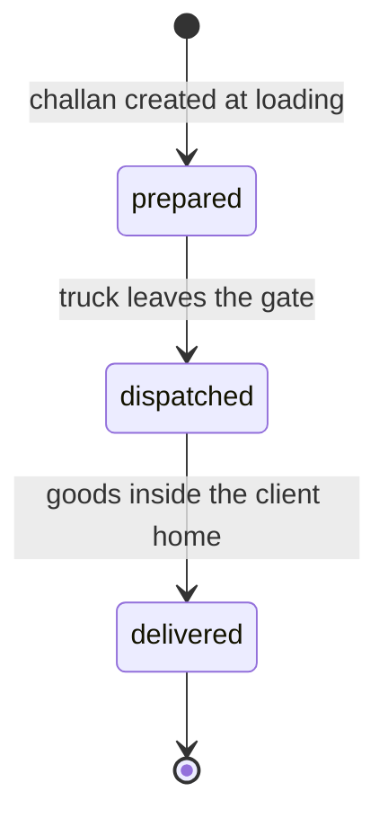
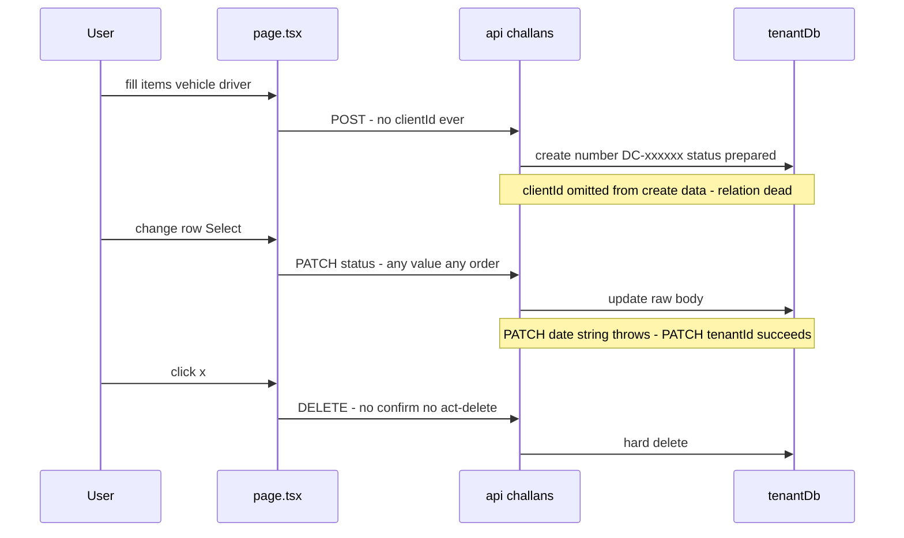
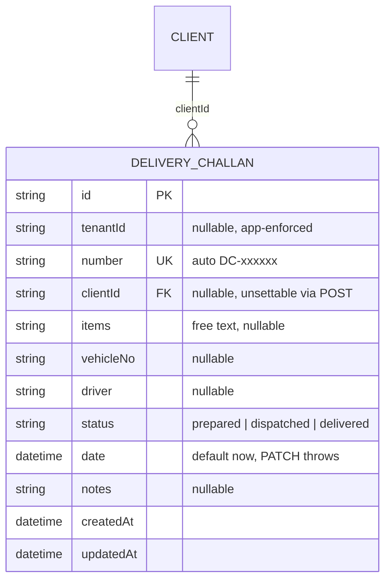
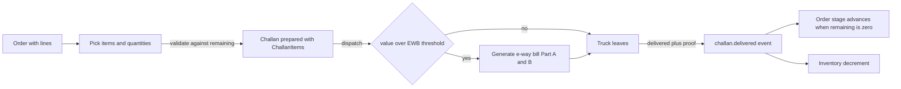
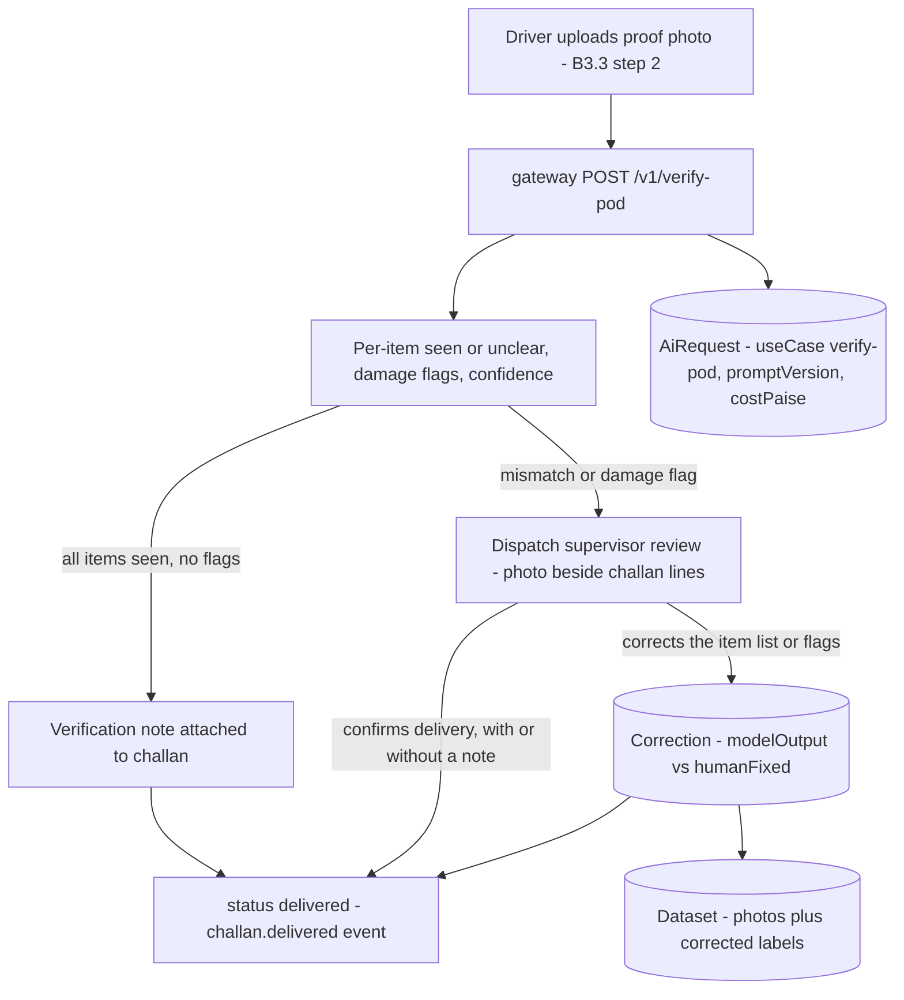

# Challans — engineering bible

Delivery challans (dispatch notes / gate passes) for outgoing furniture — the physical-delivery leg that runs alongside the order→invoice money chain.
**Status: suite app `apps/challans`, subdomain `challans.maplefurnishers.com`, dev port `:3006`, container from `maple-suite:latest` with `APP=challans` (docker-compose.yml).**

## For managers — plain-language guide

This is the truck's paperwork desk. When the 3-seater sofa and two side tables leave the workshop for a client's flat, someone creates a challan here: what's on the truck, which vehicle (DL 1LC 4521), which driver (Ramesh). The app stamps a challan number automatically and the entry then follows the truck — *prepared* while it's being loaded, *dispatched* when it rolls out the gate, *delivered* when the goods are inside the client's home. The register answers the daily dispatch questions: what left today, what's still on the road, what got there. Two honest caveats before anyone relies on it: it cannot yet *print* the challan (and the printed copy is the one legal document that must physically ride with the truck — drivers still carry a handwritten one), and a challan isn't connected to the order or invoice it delivers against, so matching "what we sent" to "what we billed" is still done from memory.

| Feature | What it means in your day | Who uses it |
| --- | --- | --- |
| Challan register with per-status counts | One screen showing every dispatch — the badges tell you at a glance "2 loading, 3 on the road, 14 delivered" | Owner, sales, dispatch supervisor (the `admin` and `sales` roles hold access — accounts cannot open this app) |
| Create form (items, vehicle no., driver) | Truck loading at 8 am: type "3-seater sofa, 2 side tables", the vehicle number and Ramesh's name — thirty seconds and it's on the record | Whoever runs the gate |
| Automatic challan number | Every dispatch gets a DC- number without a paper register at the gate | Nobody — it just happens |
| Status dropdown per row | Update the row as the truck moves: prepared → dispatched when it leaves, → delivered when the client has the goods | Dispatch supervisor, on a call from the driver |
| Delete | Remove a challan raised by mistake — careful: no "are you sure" prompt today, and dispatch records are evidence goods left the workshop | Admin, sales |

The three stages in plain words — and the shape of the journey:



**prepared** — goods packed, paperwork made, truck hasn't left; **dispatched** — on the road; **delivered** — handed over at the site. One thing to know: the dropdown will happily jump backwards or skip steps (delivered straight back to prepared) — the order above is discipline, not something the software enforces yet.

Signs it's working:

- Every truck that leaves the gate has a challan created *before* it leaves, not filled in from memory at day's end.
- The "dispatched" count matches trucks actually on the road — call any driver on the list and the goods are with him.
- When a client says "only the sofa arrived", the challan's items line settles what was on that truck.

Two halves. **Part A** documents the module exactly as built — every file, every lifecycle, every verified sharp edge (including the two that define it: the challan that can reference *nothing it delivers against*, and the PATCH that throws on its own `date` field). **Part B** designs what a delivery challan module for an Indian furniture business actually has to become: legally grounded linkage (Rule 55 CGST), the challan-from-order flow, e-way-bill readiness, delivery proof, and the printable GST-compliant PDF.

---

## Part A — for implementers

### A1 — What this module is today

A single-screen register of `DeliveryChallan` rows, ordered `updatedAt desc`, showing number, items (one free-text string), vehicle, driver, date, and status; the header shows a count badge per status (`app/page.tsx`).

- **Create**: inline form with exactly three fields — items dispatched (required, free text), vehicle no., driver. Challan `number` is auto-generated server-side as `DC-<last 6 digits of Date.now()>` when not supplied (`app/api/challans/route.ts`).
- **Lifecycle**: `prepared → dispatched → delivered`, advanced by an inline `<Select>` per row that PATCHes `{status}` — no guard against skipping or moving backwards; any of the three values can be set at any time.
- **Delete**: per-row `×`, no confirmation dialog.
- 503 banner when Postgres is unreachable; loading/empty states.
- **No PDF generation** — despite this being the one module whose artifact legally travels on paper with the truck, nothing renders a printable document (B3.4).
- **No linkage** — a challan references no order, no invoice, and (in practice) no client. Part A3 and B1 dissect this.

### A2 — File-by-file, lifecycles traced

Six meaningful files; everything else comes from `@maple/core`:

| File | Role | Notes |
| --- | --- | --- |
| `apps/challans/app/page.tsx` | Whole UI (`"use client"`) | Register table, 3-field form, per-row status `<Select>` and delete, status count badges |
| `apps/challans/app/api/challans/route.ts` | GET (list), POST (create) | `force-dynamic`; GET catches DB-down → 503; POST auto-numbers |
| `apps/challans/app/api/challans/[id]/route.ts` | PATCH, DELETE | Scoped `findFirst` guard then raw-body update / hard delete |
| `apps/challans/app/api/auth/logout/route.ts` | POST | Clears `mt_session` cookie |
| `apps/challans/app/layout.tsx` | Server layout | `getSession()` redirect, `getBrand()`, `isEnabled("tool.challans")` → `ToolDisabled`, `SuiteShell current="challans"` |
| `apps/challans/middleware.ts` | Edge auth | `verifySession` + `canAccessTool(perms, "challans", role)`; matcher excludes `api/auth`, `_next`, static |

**Lifecycle 1 — create.** Form submit (blocked client-side unless `items` non-empty) → `POST /api/challans` with `{items, vehicleNo, driver}`. Handler builds `number = b.number || "DC-" + Date.now().toString().slice(-6)` and creates with `items/vehicleNo/driver/status ("prepared")/notes`. **Verified and preserved: the create data object omits `clientId` entirely — the API cannot set it even if a caller sends it, and the form has no client field anyway.** Since `clientId` is the model's *only* relation (A3), the schema's one link is unreachable through this app: the GET's included `client.name` renders `—` for every row ever created here, unless someone links a row by hand through the raw PATCH.

Also note the numbering: last-6-of-timestamp is *not* a sequence — two challans created in the same millisecond-window pattern can collide (the `@unique` constraint turns the collision into an unhandled Prisma 500), the numbers are non-monotonic across restarts, and they restart-ish every ~11.5 days of milliseconds. Contrast with invoices' date-based `MF-INV-<yyyymmdd>-<nnn>`. GST rules additionally require serial numbering (B1.1) — this generator needs replacing, not patching.

**Lifecycle 2 — status advance.** The row's `<Select>` fires `PATCH {status: <value>}` on change. No transition validation server- or client-side; `delivered → prepared` is one dropdown away. Nothing downstream reacts — the orders board's `delivery`/`installed` stages, which this event should drive, are updated by a human who remembers ([cross-module.md](cross-module.html)).

**Lifecycle 3 — the PATCH pass-through, and the `date` trap.** `PATCH /api/challans/[id]`: scoped `findFirst` guard (404 outside tenant), then `update({ where: { id }, data: b })` with the **raw parsed body — no field processing at all**. Two verified consequences, both preserved from the original audit:

1. **Mass assignment**: `number`, `status`, `notes`, `clientId`, and `tenantId` are all settable by any caller past the middleware gate — including moving a challan to another tenant.
2. **The `date` trap**: `date` is a `DateTime` column, but the handler — unlike the payments PATCH, which converts `dueDate`, and unlike orders, which coerces its dates — passes the JSON string straight to Prisma. **PATCHing `date` always throws** (Prisma validation error → unhandled 500). The column is effectively immutable-by-bug: it can only ever hold its `@default(now())` creation value. Any "backdate this challan" feature starts by fixing this line.

**Lifecycle 4 — delete.** Scoped guard, hard `deliveryChallan.delete`, `{ok:true}`. No `act:delete` check, no confirm dialog, no audit trail — a dispatch record (potentially the only evidence goods left the workshop) disappears on one mis-click.

The full life of a challan today, with the traps marked:



The gate stack above the handlers matches every suite app: `middleware.ts` (JWT + `tool:challans` perm, 401/403 for APIs, login redirect for pages) → `layout.tsx` (`getSession`, `getBrand`, Flipt `tool.challans` — which gates the **page only**; a "disabled" challans module keeps every API route writable, the suite-wide flag asymmetry logged in [team-tasks.md](team-tasks.html)) → the client page.

### A3 — Data model and API reference

Owned model: `DeliveryChallan` (`packages/db/prisma/schema.prisma`). Its **only** relation is the nullable `clientId → Client`. **Verified against the FinanceEntry finding:** unlike `FinanceEntry`, which at least carries a dangling relation-less `invoiceId` column, `DeliveryChallan` has **no `orderId` or `invoiceId` column at all** — bare or otherwise. A challan cannot reference what it delivers against. `items` is one free-text string — no line items, no quantities, no HSN, no link to `InventoryItem` (so dispatches never decrement stock). `tenantId` nullable, app-enforced via `tenantDb()`.



**API surface, with shapes** (all under middleware: `mt_session` JWT + `canAccessTool(perms, "challans", role)`; no handler-level `can()`):

| Route | Request shape | Response shape | Sharp edges |
| --- | --- | --- | --- |
| `GET /api/challans` | — | `DeliveryChallan[]` with `client: {name} \| null`, ordered `updatedAt desc` | 503 `{error}` on DB-down; no pagination |
| `POST /api/challans` | `{items?, vehicleNo?, driver?, status?, notes?, number?}` | created row | **`clientId` silently ignored**; number collision → 500; `status` accepted from caller |
| `PATCH /api/challans/[id]` | any subset of fields, raw | updated row | Mass assignment incl. `tenantId`; **`date` string unconverted → always throws**; unknown keys → 500 |
| `DELETE /api/challans/[id]` | — | `{ok: true}` | Hard delete, no `act:delete`, no audit |
| `POST /api/auth/logout` | — | cookie clear | Matcher excludes `api/auth` |

Status codes in use: 200, 404 (`Not found in tenant`), 503 (GET only). POST/PATCH/DELETE carry no try/catch — DB outage there is an unhandled 500.

Concrete wire shapes as produced today:

```jsonc
// GET /api/challans → 200 (client is null for every app-created row)
[{
  "id": "clx…", "tenantId": "t_…", "number": "DC-847291",
  "clientId": null, "items": "3-seater sofa, 2 side tables",
  "vehicleNo": "DL 1LC 4521", "driver": "Ramesh",
  "status": "dispatched", "date": "2026-07-15T08:41:02.000Z",
  "notes": null, "createdAt": "…", "updatedAt": "…", "client": null
}]

// POST /api/challans — what the UI sends
{ "items": "3-seater sofa, 2 side tables", "vehicleNo": "DL 1LC 4521", "driver": "Ramesh" }

// PATCH /api/challans/<id> — the one shape the UI uses…
{ "status": "delivered" }
// …and two shapes the API also accepts that it should not
{ "tenantId": "other-tenant" }          // succeeds - cross-tenant move
{ "date": "2026-07-01" }                // throws - unconverted string to DateTime
```

### A4 — Configuration reference

| Variable / knob | Where read | Effect |
| --- | --- | --- |
| `DATABASE_URL` | `packages/core/src/lib/prisma.ts` | Shared suite Postgres |
| `AUTH_SECRET` | `session.ts` | Must match admin's — local JWT verification, no auth calls |
| `LOGIN_URL` | `middleware.ts` | Anonymous redirect target; default `https://admin.maplefurnishers.com/login` |
| `FLIPT_URL`, `FLIPT_NAMESPACE` | `flags.ts` | `tool.challans` flag; unset ⇒ fail-open. Gates the **page only** — APIs stay reachable when off |
| Dev port `3006` | `PORTS.local.txt` | `npm run -w @maple/app-challans dev -- -p 3006` |
| `APP=challans` | docker-compose.yml | Selects this app in the shared `maple-suite:latest` image |

RBAC as seeded (`packages/db/prisma/seed.mjs`): `admin` (`*`) and `sales` hold `tool:challans`; **`accounts` cannot open this app** (the mirror image of payments, where sales is excluded). Seed creates no demo challans. Demo logins `maple@123`.

### A5 — Recipes

- **Fix the `date` trap (do this first).** In PATCH, before the update: `if (b.date !== undefined) b.date = b.date ? new Date(b.date) : undefined;` — copy the exact pattern from the payments PATCH's `dueDate` handling. Until then, treat `date` as read-only everywhere.
- **Wire `clientId` end-to-end.** POST: add `clientId: b.clientId || null` to the create data (one line — its absence is the whole bug). UI: add a client `<Select>` fed by a lite clients endpoint (`tenantDb().client.findMany({select:{id,name}})` in a new route here — apps never import each other). This turns the dead relation live and makes CRM's per-client view able to show deliveries.
- **Whitelist the PATCH.** Replace `data: b` with an explicit pick of `["items","vehicleNo","driver","status","notes","clientId","date"]` — never `number` (see below), never `tenantId`/`id`.
- **Replace the number generator.** Per-tenant, per-financial-year sequence: `DC/25-26/0042` (16-char GST limit in mind, B1.1). Bootstrap-safe implementation: a `Counter` row per `(tenantId, "challan", fy)` incremented inside a transaction; do not derive from timestamps.
- **Add transition validation.** In PATCH, when `status` present: allow only `prepared→dispatched`, `dispatched→delivered` (and idempotent same-value writes). Admin override via `act:manage_flags`-style action if operationally needed.
- **Add `act:delete` + confirm dialog.** Same two-line recipes as payments ([module-payments.md](module-payments.html) A5).
- **Add structured items.** Interim, zero-migration step used elsewhere in the suite: keep `items` but write JSON (`[{name, qty, unit}]`) from a repeatable form row, render joined. Real fix is the `ChallanItem` table in B3.1.
- **Smoke-test from the shell.** With `mt_session` copied from the browser: list `curl -s -b "mt_session=$T" localhost:3006/api/challans | jq length` · create `curl -s -b "mt_session=$T" -H 'Content-Type: application/json' -d '{"items":"test sofa"}' -X POST localhost:3006/api/challans` · advance `-d '{"status":"dispatched"}' -X PATCH …/api/challans/<id>` · and the regression that must keep failing until fixed: `-d '{"date":"2026-07-01"}' -X PATCH` currently returns 500. No automated tests exist under `apps/challans` — this loop is the regression suite; graduate it into vitest route tests (quotations' R-suite pattern).
- **Local run.** Postgres up, `npx prisma migrate dev` + seed in `packages/db`, `npm run -w @maple/app-challans dev -- -p 3006`, log in via admin first. Seeded `sales` or `admin` users can open the app; `accounts` gets a 403.

## Testing — how we verify this module

**Honest current state: zero automated tests.** `find apps/challans -name "*.test.*"` returns nothing; the A5 curl loop — including its deliberate "this must keep failing until fixed" date-PATCH probe — is the entire regression practice. The repo-root vitest config already globs `apps/**/*.test.{ts,tsx}`, so the first test file dropped next to a route starts running with plain `npm test`; the sole Playwright spec suite-wide is `e2e/login.spec.ts`.

**Unit targets** (small module, small list — but each one guards a real defect class):

- **Number generation:** `DC-` + last-6-of-`Date.now()` — pin the format, then the collision case: two calls in the same millisecond return the same number, which the `@unique` constraint turns into an unhandled 500. The test documents why A5's `Counter` recipe replaces the generator instead of patching it.
- **Date coercion — the module's signature bug as a test:** the PATCH handler does *no* conversion, so a `date` string always reaches Prisma raw and throws. Unit-pin the intended coercion (`""`/null → untouched or null, ISO string → `Date`) the day the A5 fix lands; until then the behaviour lives as the integration case below.
- **Transition validation helper (A5 recipe):** when written, table-test it — `prepared→dispatched` and `dispatched→delivered` allowed, idempotent same-value writes allowed, everything else rejected.

**Integration targets** (routes on scratch Postgres, two tenants). Named regression cases:

| Named case | Asserts | Today |
| --- | --- | --- |
| `REG-challan-date-throw` | PATCH `{ date: "2026-07-01" }` succeeds and backdates the challan | **Red** — unconverted string → Prisma validation error → 500 (lifecycle 3); the column is immutable-by-bug |
| `REG-mass-assignment-rejection` | PATCH `{ tenantId: "other" }` or `{ number: "DC-000001" }` rejected, row unchanged | **Red** — raw pass-through accepts both |
| `REG-number-collision-overwrite` (challan variant) | Colliding `number` on create → friendly 409. Nuance vs invoices: here a collision is a hard P2002 **500**, in invoices upsert-by-number *silently overwrites* — same root cause, opposite symptom, both need the counter | **Red** — unhandled 500 |
| `clientId`-dropped-on-POST | `POST { clientId: … }` actually links the client | **Red** — create data omits the field entirely (lifecycle 1); one-line A5 fix flips this green |
| Tenant isolation | Tenant B gets 404 on tenant A's challan ids | Green — scoped-guard |
| Status free-for-all | `PATCH { status: "delivered" }` on a fresh `prepared` row rejected once transition validation lands | **Red** — any of the three values, any order |

(`REG-upsert-tenant-guard` and `REG-auto-payment-orphaning` are this batch's sibling cases in the invoices/payments suites — same shared-machinery family, documented there.)

**E2E user stories** (Playwright, live stack):

1. A sales user creates a challan — "3-seater sofa, 2 side tables", vehicle DL 1LC 4521, driver Ramesh — and sees it appear with an auto `DC-` number and the *prepared* badge count incremented.
2. The truck's day, on screen: the row's dropdown moves prepared → dispatched → delivered; each change survives a reload and the three status counters stay consistent with the table.
3. An accounts-role user is turned away at both the page and the API (the mirror image of payments, where sales is excluded).
4. Delete removes the row immediately — asserted today *without* a confirm step, so the assertion has to change (visibly) when the confirm dialog and `act:delete` land.

**Definition of done:** unit suites run under `npm test` with no live stack; all six integration cases exist, reds marked expected-fail with the A5 recipe that fixes them named in the reason; E2E stories 1–2 green against `scripts/dev.sh`; `REG-challan-date-throw` flipping green is the merge gate for the A5 date fix — the register's first backdate-a-challan feature depends on it.

---

## Part B — for architects

### B1 — Cross-module contracts, in detail

#### B1.1 What a delivery challan legally is — and therefore what it must reference

Under Indian GST, the delivery challan is a creature of **Rule 55, CGST Rules 2017** ([CBIC text](https://taxinformation.cbic.gov.in/content/html/tax_repository/gst/rules/cgst_rules/active/chapter6/rule55_v1.00.html)). The rule permits moving goods **without a tax invoice** only in enumerated cases — job work, supply of liquid gas where quantity is unknown at removal, transportation "for reasons other than by way of supply" (branch/warehouse transfers, goods for exhibition or approval), and goods moved in semi/completely-knocked-down form — and prescribes the challan's **mandatory contents** ([Pice guide](https://piceapp.com/blogs/delivery-challan-under-gst-rule-55/)):

- serially numbered, **not exceeding sixteen characters**, in one or multiple series;
- date; name, address and **GSTIN of consignor** (if registered) and **consignee** (or place of supply if unregistered);
- **HSN code and description** of goods; **quantity** (provisional where unknown);
- **taxable value**; tax rate and tax amount **where the movement is a supply**; place of supply for inter-state moves; **signature**.
- Prepared in **triplicate**: original for consignee, duplicate for transporter, triplicate for consignor.

Rule 55(4) covers the furniture-business daily case: goods moved *for supply* where the tax invoice could not be issued at removal — deliver on challan, **issue the tax invoice after delivery**. And Rule 55(3) chains straight into e-way bills: challan-borne consignments follow **Rule 138** ([CBIC text](https://taxinformation.cbic.gov.in/content/html/tax_repository/gst/rules/cgst_rules/active/chapter16/rule138_v1.00.html)) when value exceeds ₹50,000 (B3.2).

Holding the current schema against the Rule 55 field list makes the gap concrete — this table is the compliance backlog:

| Rule 55 mandatory content | In the model today | Gap |
| --- | --- | --- |
| Serial number ≤16 chars, consistent series | `number` — timestamp-derived `DC-xxxxxx` | Format fits 16 chars but is not serial; replace generator (A5) |
| Date of challan | `date` | Exists — but un-editable due to the PATCH trap |
| Consignor name/address/GSTIN | — (implicit: the tenant) | Comes from `Tenant` at print time; Tenant needs address + GSTIN fields |
| Consignee name/address/GSTIN | `clientId` → Client (has `gstin`, `address`) | Relation exists but is **unsettable** — the one-line POST fix |
| HSN + description of goods | `items` free text | No HSN anywhere; needs `ChallanItem` (B3.1) |
| Quantity (provisional allowed) | — | Free text has no quantities |
| Taxable value | — | Nothing on the model carries value — also blocks the ₹50k e-way test |
| Tax rate/amount (when supply) | — | Needs `kind` discriminator + rate fields at print time |
| Place of supply (inter-state) | — | Derivable from client address once linked |
| Signature | — | Print-time box; digital counterpart is the B3.3 proof capture |

The legal shape dictates the schema. A challan documents the *movement*; the *commercial* anchor is the order, and the *fiscal* anchor is the invoice (which may not exist yet at dispatch, per 55(4)). So the correct linkage is **both, both nullable, at least one expected**:

```
DeliveryChallan
  + orderId    String?   → Order    (operational: what sale this delivery fulfils)
  + invoiceId  String?   → Invoice  (fiscal: set at dispatch if invoiced, else backfilled when the 55(4) invoice is raised)
  + kind       String    default "supply"  // supply | job-work | approval | transfer | return
```

Rules of the contract: a `supply` challan should gain an `invoiceId` by the time it is `delivered` (a reconciliation report lists violators — that report is the GST-audit answer to "where is the invoice for this dispatch"); job-work/transfer challans legitimately never get one; `orderId` drives the challan-from-order flow (B3.1) and lets the orders board show real delivery state instead of human memory. This mirrors the already-agreed cheap-links-now-events-later strategy in [cross-module.md](cross-module.html).

#### B1.2 The `challan.delivered` event

Reserved in the suite outbox catalog style ([event-catalog.md](event-catalog.html) — which today records **zero events written anywhere**; the `order.fulfilled` sketch there already anticipates `challanIds[]`). Frozen schema:

```json
{
  "id": "evt_cuid",
  "type": "challan.delivered",
  "tenantId": "t_...",
  "createdAt": "ISO",
  "payload": {
    "challanId": "dc_cuid",
    "number": "DC/25-26/0042",
    "orderId": "ord_cuid | null",
    "invoiceId": "inv_cuid | null",
    "clientId": "cl_cuid | null",
    "items": [{ "name": "3-seater sofa", "qty": 1, "unit": "nos" }],
    "deliveredAt": "ISO",
    "proof": { "photoKey": "s3://... | null", "signatureKey": "s3://... | null" }
  }
}
```

Written in the same transaction as the `status→delivered` update. Consumers: **orders** (advance stage `delivery → installed`/fulfilled when all order items are delivered — the quantity-remaining math in B3.1 decides "all"), **inventory** (decrement finished-goods stock per item — today dispatches never touch stock), **crm** (timeline entry), **invoices** (nudge: delivered-but-uninvoiced supply challan, per B1.1). A `challan.dispatched` sibling (truck left, with vehicle/e-way details) is worth emitting for the same consumers minus inventory.

### B2 — Infrastructure: both tracks

Same two honest tracks as the rest of the suite ([aws-deployment.md](aws-deployment.html)): bootstrap (one box, Compose, shared Postgres, no Kubernetes until someone is hired to run it) versus scale. Challans-specific mapping:

| Concern | Bootstrap (build now) | Scale (design for, defer) |
| --- | --- | --- |
| Events | `OutboxEvent` table + in-process poller (the dispatcher decision is still open in [event-catalog.md](event-catalog.html)) | Kafka topics `challans.dispatched.v1`, `challans.delivered.v1`, partition key `orderId` (per-aggregate ordering for the orders consumer) |
| Delivery proof files | Shared volume, same `/data/catalog` pattern catalog/photoshoot already use; keys stored on the challan | S3 via the existing `CATALOG_STORAGE` abstraction + CloudFront; presigned-URL upload direct from the driver's phone |
| E-way bill API calls | Direct NIC/GSP calls from the app with per-tenant credentials in `.env`-style secrets | A small `compliance` sidecar service owning GSP credentials, rate limits and retries; Redis idempotency keys on generation requests (`ewb:req:<challanId>` SETNX) so a double-tap never generates two bills |
| PDF rendering | Client-side `@react-pdf/renderer`, exactly like invoices | Server-side render worker if bulk printing/emailing arrives |
| Deploy unit | `APP=challans` in the shared compose image; **`/api/health` still missing** (runbook blocker D2) | Own Deployment/Service/Ingress per the module contract in [aws-deployment.md](aws-deployment.html) §3; the health endpoint becomes the probe |

Note the deliberate rhyme with payments ([module-payments.md](module-payments.html) B2): idempotency via Postgres unique rows first, Redis only when a second box exists; identical handler logic on both tracks so only the transport changes.

### B3 — Designed enhancements, in depth

#### B3.1 Challan-from-order: pick items, partial deliveries, quantities remaining

The register must stop being a parallel universe. Design:

**Schema.** `orderId`/`invoiceId`/`kind` from B1.1, plus real line items:

```
ChallanItem { id, tenantId, challanId FK, name, hsn?, qty Float, unit, orderLineRef? }
```

(Orders keep their details in prose/`Json` today, so `orderLineRef` is a soft reference until orders grow structured lines — the design should not wait for that.)

**Flow.** "New challan → from order": pick an order (client auto-fills — killing the orphan problem at the root), see its lines with three columns: *ordered*, *already dispatched* (sum of `ChallanItem.qty` across this order's non-cancelled challans), *remaining*. User picks quantities ≤ remaining; over-picking is a validation error, not a warning. A wardrobe-plus-six-chairs order delivered across two truck trips is the normal case in furniture, not the edge case — partial delivery is the default mental model.



**Remaining-quantity math**, pinned down so two implementations never disagree:

```
dispatched(order, line) = Σ ChallanItem.qty
    over challans of the order with status in (prepared, dispatched, delivered)
remaining(order, line)  = ordered(line) − dispatched(order, line)
```

`prepared` counts against remaining on purpose — a drafted challan *reserves* its quantities, otherwise two clerks drafting simultaneously both see the full remainder (the B4 concurrency point). Deleting or cancelling a challan releases its reservation, which is exactly why challan deletion needs `act:delete` and an audit trail before this flow ships. Validation lives server-side in the create transaction; the browser's remaining display is advisory.

**Completion rule.** When every order line's remaining hits zero via `delivered` challans, the `challan.delivered` consumer advances the order stage — the human stops being the integration layer.

#### B3.2 E-way bill readiness

Research summary, so the model is built ready even before API integration: an e-way bill is **mandatory when consignment value exceeds ₹50,000** (per consignment, tax included; Rule 55(3)→Rule 138 — challan movements included), with **state-wise intrastate variations** (e.g. ₹1,00,000 in Maharashtra/Tamil Nadu, ₹2,00,000 for within-Delhi; standard ₹50,000 in Karnataka, Haryana, AP) ([ClearTax guide](https://cleartax.in/s/eway-bill-gst-rules-compliance)). The bill has two parts ([e-way bill API docs](https://docs.ewaybillgst.gov.in/apidocs/version1.03/vehicle-number-update.html)):

- **Part A** — consignment: recipient GSTIN, delivery PIN, **invoice/challan number and date**, goods value, **HSN**, transport document number, reason for transport.
- **Part B** — transport: **vehicle registration number** (road) or transport doc; transporters without GSTIN use a 15-digit **TRANSIN/Transporter ID**. Validity starts at first Part B entry: **1 day per 200 km** (normal cargo; 1 day per 20 km for over-dimensional), expiring midnight of the last day.

Readiness plan: (1) the challan must be able to *state its value* — `ChallanItem` needs `taxableValue` (also a Rule 55 mandatory field) and the challan a computed total; (2) capture recipient GSTIN + delivery PIN (via the client link) and per-item HSN; (3) `vehicleNo` already exists and maps to Part B — add `transporterId`, `distanceKm`, `ewbNumber`, `ewbValidUntil`; (4) a threshold rule per tenant state config decides when the "Generate e-way bill" action is demanded vs optional; (5) actual generation goes through the GSP/NIC API from the compliance sidecar (B2), with the Redis idempotency key so retries never double-generate.

#### B3.3 Driver/vehicle details and delivery proof

Today `driver` is one free-text string. Design: `driverName`, `driverPhone` (the number the client calls when the truck is late — the single most requested field in any dispatch workflow), optional `Driver` lookup table when the fleet stabilises. **Proof of delivery**: at `delivered`, the app (driver's phone, mobile-web — the delivery UX must assume old Android Chrome, per the support-matrix note in [engineering-needs.md](engineering-needs.html)) captures a **photo** of goods in place and a **signature** (canvas scribble → PNG). Both upload via the storage abstraction (volume now, S3 presigned later, B2), keys stored as `proofPhotoKey`/`proofSignatureKey`, and both ride the `challan.delivered` payload.

The delivery-confirmation flow, ordered so that flaky connectivity cannot corrupt state:

1. Driver opens the challan via a short tokenized link (the `/s/<token>` public-route pattern the suite already proves in photoshoot/catalog shares — no SSO login on a driver's phone).
2. Photo captured (`<input type="file" accept="image/*" capture="environment">` — native camera, no library) and compressed client-side to ~200 KB.
3. Signature drawn on a canvas, exported PNG.
4. Uploads first, retriable independently; only after both keys persist does the UI offer "Confirm delivered".
5. Confirm = the status PATCH, idempotent (re-tapping re-sends the same transition; the server treats same-value writes as no-ops), which fires the event transactionally.

Status transition to `delivered` *without* proof stays allowed (flag-gated strictness per tenant) but is reported, same pattern as the uninvoiced-supply-challan report in B1.1 — drivers with dead batteries exist, and a blocked delivery confirmation gets worked around on paper, which is worse than a flagged gap.

#### B3.4 Printable GST-compliant challan PDF

The one module whose artifact must travel on paper still cannot print. Reuse the proven invoices pattern (`@react-pdf/renderer`, client-side blob, logo from `GET /api/brand`-style endpoint backed by `getBrand()` — see [module-invoices.md](module-invoices.html)), with two corrections learned from the invoice implementation: brand must be **Tenant-driven from day one** (the invoice PDF hard-codes Maple details — a flagged white-label bug), and fonts should be bundled, not fetched from a CDN at render time. Layout = exactly the Rule 55 field list from B1.1:

```
┌──────────────────────────────────────────────────────────┐
│ [logo]  DELIVERY CHALLAN            ORIGINAL FOR CONSIGNEE│
│ No: DC/25-26/0042        Date: 15/07/2026    Kind: Supply │
├───────────────────────────┬──────────────────────────────┤
│ CONSIGNOR (Tenant)        │ CONSIGNEE (Client)            │
│ name / address / GSTIN    │ name / address / GSTIN or POS │
├───────────────────────────┴──────────────────────────────┤
│ # │ Description      │ HSN  │ Qty │ Unit │ Taxable value │
│ 1 │ 3-seater sofa    │ 9401 │  1  │ nos  │     45,000.00 │
├───────────────────────────────────────────────────────────┤
│ Tax rate/amount (when supply) · Total value               │
│ Vehicle: DL 1LC 4521 · Driver: Ramesh · EWB: <when present>│
│ Reason for transport: ………                                 │
│ Received in good condition:        For <Tenant>:          │
│ (consignee signature)              (authorised signatory) │
└──────────────────────────────────────────────────────────┘
```

Serial number ≤16 chars means the A5 numbering fix is a hard prerequisite. Render the **"Original for consignee / Duplicate for transporter / Triplicate for consignor"** copy set — a "Print 3 copies" button producing all three pages in one document is the workflow-correct default, since the triplicate requirement is exactly why one print button that produces one page would fail its user at the loading dock.

### B4 — Scaling

Volume is trivial (a furniture business dispatches at most a few trucks a day); the real scaling axes:

- **Concurrent picking**: two users drafting challans from the same order must not oversubscribe remaining quantities — compute *remaining* inside the create transaction (`SELECT` existing ChallanItems `FOR UPDATE` semantics via `$transaction`), not in the browser.
- **Numbering under concurrency**: the per-tenant `Counter` transaction (A5) is the collision-proof primitive; timestamp numbering dies the day two clerks work at once.
- **Files**: proof photos are the module's only real storage growth (~1–2 MB × 2 per delivery). Volume-now/S3-later is already the suite's decided path; only the storage key format needs to be S3-safe from day one.
- **Mobile path**: the driver flow is latency- and connectivity-hostile (basement loading docks); design the proof upload as retriable and the delivered-flip as idempotent — which the event-consumer idempotency rules require anyway.
- **List growth**: pagination + `(tenantId, status, updatedAt)` index at ~5k rows, same as payments.

## AI — use case & pipeline

**Use case: delivery-proof photo verification.** B3.3 already puts a POD photo in the driver's flow; today nobody looks at it until a dispute. The AI's job at upload time: does the photo plausibly show the challan's line items, and is there visible damage? The model checks each `ChallanItem` against the image and returns per-item seen / not-seen / unclear plus damage flags. A clean pass attaches silently; any mismatch or damage flag holds the `delivered` flip for the dispatch supervisor — the same review-screen trust boundary [ai-layer.md](ai-layer.html) documents for catalog parsing. **The honest take on address → route grouping:** it is *not* an AI problem. Grouping the day's dispatches into truck routes is PIN-code bucketing plus a fixed vehicle count — rules today, an OR solver at real scale. The only defensible LLM job in that neighbourhood is normalizing messy free-text addresses into `{pin, locality}` (a sub-rupee `haiku-4.5` call), and even that waits until challans reliably know their client at all (A2 lifecycle 1 — `clientId` is unsettable today).



| Contract | Detail |
| --- | --- |
| Endpoint | `POST {gateway}/v1/verify-pod` — challans never holds a model key |
| Input | proof photo (storage key from B3.3, the client-side ~200 KB compressed JPEG) + challan lines `[{name, qty, unit}]` from `ChallanItem` (B3.1) |
| `json_schema` (structured output, `additionalProperties: false`) | `{ items: [{ name, seen: "yes" \| "no" \| "unclear", note }], damageFlags: [string], overallConfidence }` — `unclear` is mandatory vocabulary: a blurry basement-dock photo must flag, never guess |
| Model + routing | `sonnet-5` — single-image vision, the same class as the receipt extractor; `claude-fable-5` stays reserved for the hard catalog parses ([ai-layer.md](ai-layer.html)) |
| ₹/call | ≈ ₹1–3 per photo — one image plus a short item list (the ₹8–10/page anchor is a dense handwritten catalog page) |
| er-platform tables | `AiRequest`, `Correction`, `AiBudget`, `ModelRoute` (use-case `verify-pod`) |

Design notes:

- Verification never blocks the driver: B3.3's connectivity-hostile ordering stands — photo uploads first, verification runs async after it, and a gateway timeout degrades to "unverified", the same degradation contract as expenses' extraction.
- The dispute payoff is direct: "client says only the sofa arrived" is settled by the challan's item lines *plus* a machine-checked photo, both timestamped.
- The `challan.delivered` payload (B1.2) gains `verification: { status, flags }`, delivered under the standard envelope — `id` + unversioned `type` + integer `version` per [infra-events.md](infra-events.html) decision D-ENV — so orders/crm consumers can react to damaged deliveries.

**Rollout & eval gate.** Collect first, verify later: ship B3.3 proof capture alone, accumulate ~200 photos with their challans, hand-label them (an afternoon of work), and that set becomes the standing eval. Gate: item-level recall ≥ 85% on "seen", false-damage rate < 5% — a verifier that cries damage at every cushion shadow trains supervisors to ignore it, which is worse than no verifier. **Not before:** structured `ChallanItem` lines exist (B3.1) — verifying a photo against the free-text `items` string is unfalsifiable — and proof capture sees real volume (more than ~5 deliveries a day). Route grouping stays rules-only until a second truck exists; the address-normalization micro-call waits for the client link to be live.

### B5 — Status: done, left, decisions

**Done ✓**
- Tenant-scoped CRUD with scoped-guard update/delete; auto `DC-` numbering.
- Three-state dispatch lifecycle with inline status change and per-status counts.
- SSO middleware, `tool.challans` flag, DB-down/loading/empty states.

**Left ◻ (carried, with owners in [team-tasks.md](team-tasks.html))**
- **Printable challan PDF** — the natural feature is absent; design frozen in B3.4 (Rule 55 field list, triplicate marking, Tenant-driven branding, bundled fonts).
- No `orderId`/`invoiceId` on the model — deliveries can't be reconciled against the money chain; schema + contract frozen in B1.1, flow in B3.1.
- `clientId` exists in the schema but is **unsettable via POST and absent from the form** — dead relation in practice; one-line fix in A5.
- `items` free text — no quantities, no HSN, no `InventoryItem` link, so dispatches never decrement stock; `ChallanItem` design in B3.1.
- PATCH mass assignment (incl. `tenantId`) + **unconverted `date` string always throws**; whitelist + coercion recipes in A5.
- Timestamp-derived challan numbers — collision-prone, non-serial, GST-noncompliant format; `Counter` recipe in A5.
- No status-transition validation; no `act:delete`; no delete confirmation; no `/api/health`; no tests under `apps/challans`; no pagination.

**Decisions taken (record, don't relitigate)**
- Challan links to **both** order (operational) and invoice (fiscal), both nullable, `kind` discriminator — grounded in Rule 55's cases, incl. 55(4) invoice-after-delivery.
- Delivered-without-proof and delivered-without-invoice are **reported, not blocked** (tenant-flag can tighten) — field reality beats data purity.
- E-way bill: build the fields now, integrate the GSP API later; generation is idempotency-keyed.
- Proof media on the shared volume now, S3 at Phase 2 — no new infra ahead of need.
- Inventory decrement happens via the `challan.delivered` event consumer, never inline in the PATCH handler.
