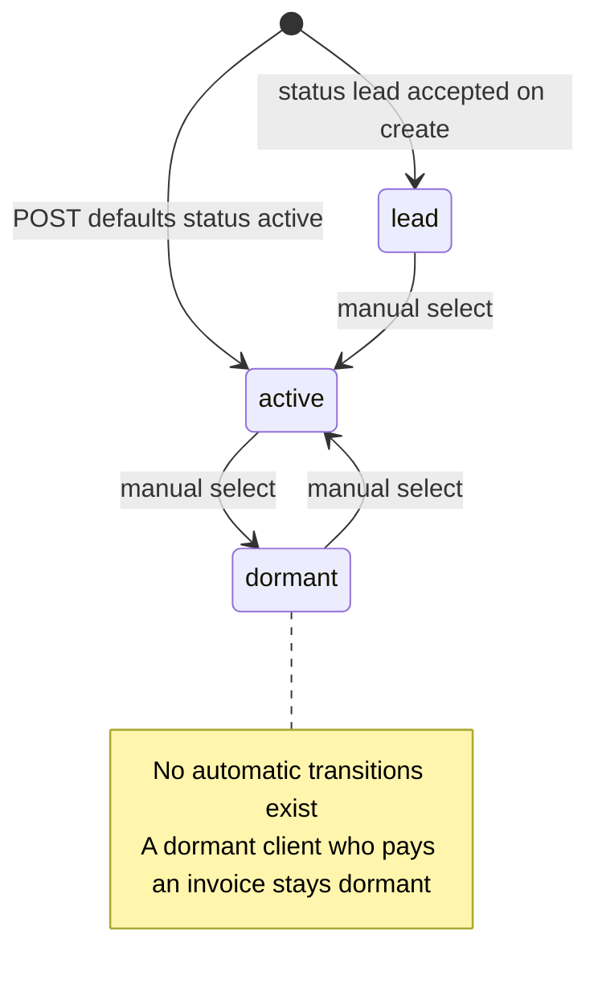
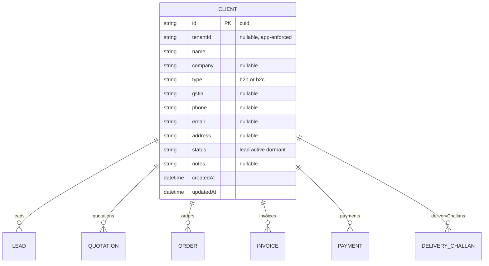
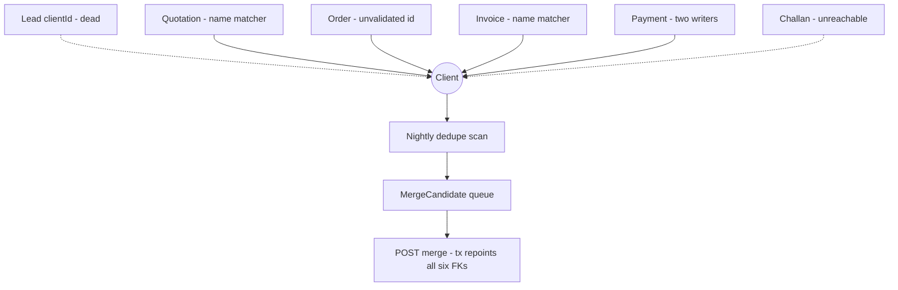
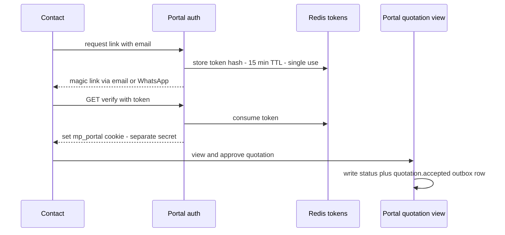
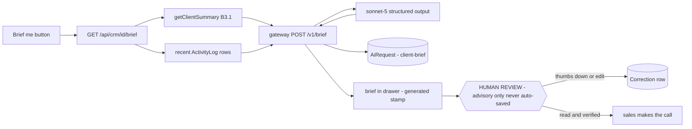

# CRM — engineering bible

B2B/B2C client directory — and, structurally, the most important module in the suite: `Client` is the hub record that every transactional model (leads, quotations, orders, invoices, payments, challans) FKs into. The app itself is a one-screen directory; the *contract* it owns — who may create clients, how duplicates are prevented, what happens when a client is deleted — is a suite-wide concern that today lives half here and half in a shared helper other modules call behind CRM's back (B1).

**Status: suite app `apps/crm`, subdomain `crm.maplefurnishers.com`, dev port `:3003`, container from `maple-suite:latest` with `APP=crm` (docker-compose.yml).**

## For managers — plain-language guide

This is the client directory — the one list of everyone you do business with, from the retail couple furnishing a flat to the architect firm ordering for three projects. Its everyday job is the look-up before a call: open the row, see at a glance how much history you have with this client, then dial. Honest caveats: today the row shows *counts* of quotes, orders and invoices rather than the documents themselves (there is no client detail page yet), payments aren't counted at all, and because quotations and invoices can create clients automatically by name-match, the occasional duplicate "Sharma" appears — merging them is designed but not built.

| Feature | What it means in your day | Who uses it |
| --- | --- | --- |
| Directory with quick add | A new client is typed once — name, company, B2B or B2C, phone, GSTIN — usually right before their first quote | Sales, accounts |
| Activity column | Looking up everything about a client before a call: "3L · 2Q · 1O · 4I" says three leads, two quotes, one order, four invoices at a glance (payments and delivery challans aren't counted yet) | Sales, accounts |
| B2B / B2C badges | The header shows the split of trade versus retail clients | Owner |
| Lifecycle status | Mark a client lead / active / dormant from the list, so the team knows who is current business | Sales |
| Guarded delete | Delete asks "are you sure" — and a client with any paperwork attached quietly refuses to be deleted (a safety net, though today it looks like nothing happened) | Admin |
| Database-down banner | An amber banner tells you the system is down, instead of an empty directory | Everyone |

Signs it's working:

- Before any client call, the directory answers "what do we have going with them" in one glance — and the counts match reality.
- There is one row per real-world client — no duplicate entries created behind the scenes by quotes and invoices.
- GSTIN and phone are filled in on B2B clients, so invoicing never stalls on missing details.

---

## Part A — for implementers

### A1 — what exists today

- Client directory with inline create form: name (required, client-side only), company, B2B/B2C type, phone, GSTIN (`app/page.tsx`).
- Lifecycle status per client — `lead | active | dormant` — changed inline with a `<Select>`; header badges count B2B vs B2C. (Yes, `"lead"` is a *client status* here while a separate `Lead` model exists — a naming collision to retire; see B5.)
- Activity column per client: `3L · 2Q · 1O · 4I` — a live `_count` of related leads, quotations, orders and invoices returned by the GET include. **Payments and challans are omitted** from the count even though the relations exist — verified in `app/api/crm/route.ts:9`, fix in B1.
- Delete with a `confirm()` dialog — the only module of leads/crm/tasks that confirms deletes.
- 503 amber banner when Postgres is unreachable.
- What does *not* exist: no client detail page (so `email`, `address`, `notes` are collected by the API but no UI ever shows or edits them), no search, no dedupe on create, no merge, no view of the actual related records behind the counts.

The client lifecycle as the UI's `<Select>` defines it — every transition is a manual dropdown click; nothing in the suite moves a client automatically (a paid invoice does not reactivate a dormant client — B2's event consumers are the designed fix), and the `"lead"` value is the naming collision Recipe 5 retires:



### A2 — file-by-file, lifecycles traced

| File | Role |
| --- | --- |
| `apps/crm/app/page.tsx` | The entire UI — one `"use client"` component |
| `apps/crm/app/api/crm/route.ts` | GET (list + counts), POST (create) |
| `apps/crm/app/api/crm/[id]/route.ts` | PATCH (update), DELETE |
| `apps/crm/app/api/auth/logout/route.ts` | POST — clears the shared session cookie |
| `apps/crm/app/layout.tsx` | Server layout: session, brand, `isEnabled("tool.crm")`, `SuiteShell current="crm"` |
| `apps/crm/middleware.ts` | Edge auth: JWT verify + `tool:crm` gate (`TOOL = "crm"`, line 5) |
| `packages/core/src/lib/clientLink.ts` | **Not in this app but part of its contract** — `findOrCreateClient`, the back-door writer other modules use |

**Request lifecycle.** Identical to the leads chain, retargeted: `middleware.ts` verifies the `mt_session` JWT locally (jose HS256, shared `AUTH_SECRET`), 401/403s API calls or redirects pages to `LOGIN_URL` with `next`, and gates on `canAccessTool(perms, "crm", role)` — `*` or `tool:crm`, with the legacy fallback map allowing `admin, sales, accounts` for pre-perms sessions. `layout.tsx` re-checks the session server-side, resolves the brand by host, and swaps in `ToolDisabled` when the Flipt flag `tool.crm` is off — pages only; the API routes carry no flag check.

**UI lifecycle — `page.tsx` traced.**

- State: `rows: Client[]` (the type hand-declares the `_count` shape — extending the count means touching this type), `error`, `loading`, `form: { name, company, type: "b2c", phone, gstin }`.
- `load()` — same defensive fetch pattern as leads: non-OK → parse error JSON → banner; throw → "Could not reach the server."
- `add(e)` — bails silently on empty trimmed name; POSTs the form; on OK resets and refetches everything. Note the form never collects `email`, `address`, `notes`, or `status`, all of which POST accepts.
- `patch(id, data)` — used by exactly one control: the status `<Select>`. Fires PATCH, refetches the whole list.
- `remove(id)` — wraps DELETE in `confirm("Delete this client?")`. The confirm exists because deleting a *hub* record is consequential — but the protection is UI-level only, and the deeper protection is accidental (see DELETE below).
- Render: B2B/B2C badges via two filter passes; activity cell is a template string over `c._count`; contact column falls back phone → email → "—".

**API lifecycle — handler by handler.**

- `GET /api/crm` — `client.findMany({ orderBy: { updatedAt: "desc" }, include: { _count: { select: { leads, orders, invoices, quotations } } } })` through `tenantDb()` (tenant filter injected). One query, counts computed by Postgres — the right shape; it is only the *select list* that is incomplete (`payments`, `deliveryChallans` missing). try/catch → 503 body.
- `POST /api/crm` — field-by-field copy with defaults `type: "b2c"`, `status: "active"`; accepts `email/address/notes` the UI never sends. No validation (missing name → Prisma error → 500), no try/catch, **no dedupe** — POSTing the same name twice makes two clients, while quotations/invoices creating "the same" client via `findOrCreateClient` matches case-insensitively on name. Two creation paths, two dedupe policies (none vs name-only): this inconsistency is the root of the merge problem in B1.
- `PATCH /api/crm/[id]` — scoped `findFirst` guard (404s cross-tenant probes, and must precede the update because the tenant extension does not hook single-row `update`), then `update({ where: { id }, data: b })` — **the raw request body**, no whitelist, no coercion at all (CRM doesn't even have leads' `value` special-case). Any `Client` column, `tenantId` included, is settable by anyone holding `tool:crm`. Fix is A5 Recipe 1.
- `DELETE /api/crm/[id]` — guard, then `delete`. No `act:delete` check. **No relation handling:** all six inbound FKs are plain optional relations with no `onDelete` rule, so Postgres restricts the delete — a client with any lead/quote/order/invoice/payment/challan attached fails with an unhandled Prisma P2003, surfacing as a raw 500 the UI shows as nothing at all (the `remove()` ignores the response). Accidentally safe, deliberately unhelpful.
- `POST /api/auth/logout` — shared cookie-clear handler, excluded from middleware.

### A3 — data model and API surface

Owned model: `Client` (`packages/db/prisma/schema.prisma:12`) — classified core/shared in [er-suite.md](er-suite.html) because six other models relate to it. `tenantId` nullable, enforced by `tenantDb`.



| Route | Method | Request body | Response | Auth that actually exists |
| --- | --- | --- | --- | --- |
| `/api/crm` | GET | — | `200` `[{id, tenantId, name, company, type, gstin, phone, email, address, status, notes, createdAt, updatedAt, _count: {leads, orders, invoices, quotations}}]`; `503 {error}` | Middleware: JWT + `tool:crm` |
| `/api/crm` | POST | `{name, company?, type?, gstin?, phone?, email?, address?, status?, notes?}` | `200` full client row; `500` on missing name / DB down | Middleware only |
| `/api/crm/[id]` | PATCH | Any subset of Client columns — **unvalidated, unwhitelisted** | `200` updated row; `404 {error:"Not found in tenant"}` | Middleware only |
| `/api/crm/[id]` | DELETE | — | `200 {ok:true}`; `404` cross-tenant; **raw 500** if any related rows exist | Middleware only — **no `act:delete`** |
| `/api/auth/logout` | POST | — | `200 {ok:true}` + cleared cookie | None |

**Wire shapes, verbatim.**

```json
// POST /api/crm — exactly the form state (email/address/notes/status accepted but never sent by the UI)
{ "name": "Verma Interiors", "company": "Verma Interiors Pvt Ltd", "type": "b2b",
  "phone": "98100 22334", "gstin": "07AABCV1234A1Z5" }

// 200 response — the full Prisma row (no _count on create; only GET includes it)
{ "id": "cmcxk9...", "tenantId": "cmc1a9...", "name": "Verma Interiors",
  "company": "Verma Interiors Pvt Ltd", "type": "b2b", "gstin": "07AABCV1234A1Z5",
  "phone": "98100 22334", "email": null, "address": null,
  "status": "active", "notes": null,
  "createdAt": "2026-07-17T09:14:03.512Z", "updatedAt": "2026-07-17T09:14:03.512Z" }

// GET /api/crm — one element; the _count shape is what page.tsx's Client type hand-declares
{ "id": "cmcxk9...", "name": "Verma Interiors", "type": "b2b", "status": "active",
  "_count": { "leads": 3, "orders": 1, "invoices": 4, "quotations": 2 } }

// PATCH /api/crm/[id] — what the status Select sends...
{ "status": "dormant" }
// ...and what the endpoint also accepts today (no whitelist, no coercion)
{ "tenantId": "someone-elses-tenant", "name": "" }
```

**Failure modes, mapped.**

| Failure | Surface | What actually happened |
| --- | --- | --- |
| DB unreachable | Amber banner | GET's catch → 503 body |
| Create with DB down / missing name | Form silently does nothing | POST unhandled → 500; `add()` checks `res.ok` only |
| Delete a client with related rows | Confirm dialog, then... nothing | Postgres FK restrict → Prisma P2003 → raw 500; `remove()` ignores the response |
| Flipt `tool.crm` off | "Clients is disabled" page | Layout swap only — `/api/crm` still answers |
| Cross-tenant id in PATCH/DELETE URL | — | Scoped guard → clean 404 |

### A4 — configuration reference

Same shared surface as every suite app — the CRM-specific values only:

| Variable | Notes |
| --- | --- |
| `DATABASE_URL` | Required; GET 503s without it, mutations 500 |
| `AUTH_SECRET` / `COOKIE_DOMAIN` | Shared JWT SSO; prod `COOKIE_DOMAIN=.maplefurnishers.com` |
| `LOGIN_URL` | Default `https://admin.maplefurnishers.com/login` |
| `FLIPT_URL` / `FLIPT_NAMESPACE` | Kill-switch key `tool.crm`; unset → fail-open enabled |
| `APP=crm` | docker-compose app selector on the shared image |

Dev: `npm run -w @maple/app-crm dev -- -p 3003` (`PORTS.local.txt`). Seed creates **no demo clients**; roles with `tool:crm`: `admin` (`*`), `sales`, `accounts` (seed.mjs:16,20 — note `hr` cannot open CRM); demo logins `maple@123`. Backfill step in the seed stamps any pre-tenancy `client` rows with the default tenant.

### A5 — recipes

**Recipe 1 — fix the PATCH mass assignment (worked example, following tasks' whitelist pattern).**
`apps/tasks/app/api/tasks/[id]/route.ts` is the house reference: build `data` from an allowlist. CRM's version, replacing the PATCH body in `apps/crm/app/api/crm/[id]/route.ts`:

```ts
const b = await req.json();
const data: Record<string, unknown> = {};
for (const k of ["company", "gstin", "phone", "email", "address", "notes"])
  if (b[k] !== undefined) data[k] = b[k] || null;          // nullable fields: falsy clears
if (typeof b.name === "string" && b.name.trim()) data.name = b.name.trim(); // required: never null
if (b.type === "b2b" || b.type === "b2c") data.type = b.type;               // closed set
if (["lead", "active", "dormant"].includes(b.status)) data.status = b.status;
return NextResponse.json(await (await tenantDb()).client.update({ where: { id }, data }));
```

Three refinements over a verbatim copy of tasks' loop, worth writing down as the standard: (1) required columns (`name`) must never pass `|| null` — tasks itself has this bug with `title`; (2) closed-set columns (`type`, `status`) get membership checks, not pass-through; (3) `tenantId`, `createdAt`, and every relation stay off the list forever. Apply the identical recipe to leads (its bible carries the same worked example).

**Recipe 2 — the activity-count fix (two lines plus a type).** In `route.ts` extend the select: `_count: { select: { leads: true, orders: true, invoices: true, quotations: true, payments: true, deliveryChallans: true } }`; in `page.tsx` extend the hand-written `Client` type's `_count` and the template string (`…O · {i}I · {p}P · {d}C`). This closes the "client looks inactive but has ₹3L in payments" blind spot.

**Recipe 3 — friendly delete.** Wrap the delete in a relation check: run `findFirst` with the full `_count` include; if any count is non-zero return `409 { error: "has_records", counts }` and have the UI offer "mark dormant instead" (status change is the correct archival for a hub record). Add the `act:delete` check (`can(user?.perms, "delete")` via `getSession` — see the leads bible, A5 Recipe 2) in the same edit.

**Recipe 4 — add a client detail drawer.** The data is already fetched; the fastest detail view is a slide-over on row click showing the fields the table hides (`email`, `address`, `notes`) with inline PATCH editing — no new endpoint needed. Promote to `/clients/[id]` as a real route only when the 360 view (B3.1) lands.

**Recipe 5 — retire the status collision.** `Client.status = "lead"` predates the Lead model. Migration: `UPDATE "Client" SET status = 'prospect' WHERE status = 'lead'`, update the `STATUSES` array and badge map, done — do it before dashboards start grouping on the string.

**Recipe 6 — CSV export, gated correctly.** The `act:export` action already exists in `rbac.ts` and both `sales` and `accounts` hold it — it just gates nothing in this module. `GET /api/crm/export`: check `can(user?.perms, "export")` (403 otherwise), stream `findMany` results as CSV with a `Content-Disposition: attachment` header. This is the cheapest way to make the actions system real in CRM before the delete check lands.

---

## Testing — how we verify this module

**Current state, honestly: zero tests under `apps/crm`** (verified — no test file in the app). The nearest existing coverage is `packages/core/src/lib/rbac.test.ts`, which exercises the gate *in front of* this app but nothing inside it. The root harness is ready: `vitest.config.ts` already globs `apps/**/*.test.{ts,tsx}` into `npm test` (CI), and Playwright (`npm run e2e` against a running local suite) has one login smoke suite-wide. What CRM deserves, given that `Client` is the hub record six models FK into:

**Unit targets (vitest):**

- **`findOrCreateClient` (`packages/core/src/lib/clientLink.ts`) — the most test-worthy twenty lines in CRM's orbit**, because two other modules create clients through it behind CRM's back. Pin today's policy explicitly: blank/whitespace name → returns `null`, creates nothing; case-insensitive name match reuses the existing row (`"VERMA interiors"` hits `"Verma Interiors"`); backfill writes **only empty fields** — an existing phone is never overwritten; no match → create with nulls. Writing these *before* B1's stricter matcher means the policy change lands as a deliberate red-to-green diff, not an accident.
- The PATCH whitelist once A5 Recipe 1 lands: `name: ""` ignored (never nulled), `type`/`status` membership-checked against their closed sets, `tenantId` and relations dropped.
- POST defaults: `type` → `"b2c"`, `status` → `"active"`, empty optionals → `null`.

**Integration (route handlers against a scratch Postgres):**

| Named regression case | Asserts | Status today |
| --- | --- | --- |
| `crm-mass-assignment` | `PATCH {"tenantId": "other"}` leaves `tenantId` unchanged | **fails** — raw body passthrough (A5 Recipe 1) |
| `crm-count-completeness` | GET `_count` covers **all six** inbound relations, `payments` and `deliveryChallans` included | **fails** — four of six selected (A5 Recipe 2) |
| `crm-delete-with-records` | DELETE on a client with an invoice → friendly `409 {error: "has_records"}`, client survives | **fails** — raw 500 from the FK restrict (A5 Recipe 3) |
| `crm-cross-tenant-404` | PATCH/DELETE with another tenant's client id → 404, row untouched | passes — scoped guard |
| `client-merge-covers-all-relations` | when B1's merge lands: the DMMF-reflection test — every model FK-ing `Client` is repointed by the merge transaction | not built yet |

**E2E (Playwright user stories):**

1. Accounts signs in, adds "Verma Interiors" as B2B with GSTIN, and sees the row with the B2B badge and a `0L · 0Q · 0O · 0I` activity cell.
2. Sales flicks a client to `dormant`; the change survives a reload.
3. Delete on a client with a related record: today the confirm dialog is followed by silence — this story is written against the *intended* behavior (a visible "has records — mark dormant instead?" message) and goes green with Recipe 3.

**Definition of done for any CRM change:** `findOrCreateClient` tests pass untouched (or the policy change is called out in the PR); the named integration cases stay green as they flip; any new inbound FK to `Client` extends both `crm-count-completeness` and the future merge-coverage test; a bug fix lands with its reproducing test first.

---

## Part B — for architects

### B1 — cross-module: Client as THE hub

**The full inbound-relation contract.** Six models FK into `Client`. What the schema promises, who actually writes each FK today (all verified in route code), and the integrity rule each one needs:

| FK | Written by, today | Reality check | Integrity rule needed |
| --- | --- | --- | --- |
| `Lead.clientId` | **Nobody** | Column dead since day one — no UI, no endpoint | Written only by the convert endpoint (leads bible B1), same-tenant check |
| `Quotation.clientId` | quotations POST via `findOrCreateClient` | Name-only case-insensitive match — silently reuses or creates | Replace matcher with phone→email→name-suggest (shared with convert) |
| `Order.clientId` | orders POST, `b.clientId \|\| null` pass-through | Trusts the client id blindly — **no existence or tenant check**; a cross-tenant id links silently | Validate id exists in tenant before write |
| `Invoice.clientId` | invoices POST via `findOrCreateClient` | Same name-only matcher | Same replacement |
| `Payment.clientId` | payments POST pass-through; also invoices POST when it auto-creates the linked Payment row | Two writers, one unvalidated | Same validation; keep invoice-side write transactional |
| `DeliveryChallan.clientId` | **Nobody reachable** — the challan form cannot set it ([cross-module.md](cross-module.html)) | Dead column in practice | Wire the form; validate |

Three structural takeaways. First, CRM does not control admission to its own hub: two modules create clients through `clientLink.ts` with a weaker dedupe policy than anyone would design deliberately, and CRM's own POST has none at all. The fix is one shared, stricter matcher (phone → email → name-as-suggestion, detailed in the leads bible) that *every* path uses. Second, no writer validates tenant ownership of a caller-supplied `clientId` — the scoped-guard pattern used for updates must extend to FK writes. Third, nothing updates `Client.status` when activity happens: a `dormant` client who pays an invoice stays dormant. The event consumers below fix that.

**The activity-count fix** is Recipe 2 — it is deliberately listed as a recipe because it is a five-minute change; the architectural point is that the *counts are the only cross-module read CRM does today*, so every extension of the hub (360 view, timeline) grows from that one `include`.

**Client merge design — duplicates are inevitable.** With three creation paths and name-only matching, duplicate clients already exist in any real dataset; a merge is not optional tooling, it is the hub's garbage collector.

- *Detection:* nightly job (bootstrap: script; enterprise: CronJob) groups clients per tenant by normalized phone (last 10 digits), then lowercased email, then exact lowercased name, writing candidate pairs to a `MergeCandidate` table `{ id, tenantId, aId, bId, matchedBy, status: pending | merged | dismissed }`. Surfaced as a "Possible duplicates (3)" banner in the directory.
- *Endpoint:* `POST /api/crm/[id]/merge` with body `{ "sourceId": "...", "fieldChoices"?: { "phone": "source" } }` — `[id]` is the survivor. Both rows guard-checked in-tenant.
- *Execution, one `$transaction`:*

```ts
await prisma.$transaction(async (tx) => {
  const RELS = ["lead", "quotation", "order", "invoice", "payment", "deliveryChallan"] as const;
  for (const r of RELS)
    await tx[r].updateMany({ where: { clientId: sourceId, tenantId }, data: { clientId: survivorId } });
  await tx.client.update({ where: { id: survivorId }, data: survivorFields }); // null-absorb + fieldChoices
  await tx.clientMerge.create({ data: { tenantId, survivorId, sourceSnapshot: source, mergedBy } });
  await tx.client.delete({ where: { id: sourceId } });                         // now safe - nothing references it
});
```

  The `RELS` list **must be maintained alongside the schema** — a new FK to Client that misses it orphans rows silently. Guard that with a unit test that reflects over the Prisma DMMF (`Prisma.dmmf.datamodel.models`, filter fields whose type is `Client`) and asserts the merge covers every inbound relation; the test fails the moment someone adds relation number seven. Survivor field rules: survivor keeps its non-null values, absorbs source values into its nulls, `fieldChoices` overrides per field; `notes` concatenate with a dated merge line.
- *Irreversibility:* merges do not un-merge. Write a `ClientMerge` audit row `{ survivorId, sourceSnapshot Json, mergedBy, mergedAt }` so support can reconstruct — the snapshot is the undo of last resort.



### B2 — infrastructure: bootstrap vs enterprise

**Bootstrap (now):** single Postgres, merges and dedupe scans run in-process; the dedupe script is a compose-level cron. Add the B4 indexes; nothing else. The one bootstrap-tier discipline worth adopting early: every write path that touches more than one row (merge, convert-consumer, future portal approval) goes through `$transaction` from its first version — retrofitting transactionality after a partial-failure incident is how audit trails get gaps.

| Concern | Bootstrap answer | Enterprise answer |
| --- | --- | --- |
| Dedupe scan | compose cron script | K8s CronJob |
| 360 summary | 6 indexed queries, no cache | Redis cache, event-invalidated |
| Client state updates | manual status Select | event consumers materialize |
| Portal tokens | Postgres table with TTL sweep | Redis SETEX, single-use |

**Enterprise:**

- **Redis:** the client 360 view (B3.1) is the suite's first genuinely fan-out read — cache the assembled summary per client (`crm:360:{tenantId}:{clientId}`, TTL 60s, deleted by event consumers on any related write). Redis also backs the portal magic-link tokens (B3.3): single-use, 15-minute TTL, key = token hash.
- **Kafka:** CRM is primarily a **consumer**. It subscribes to `lead.converted`, `quotation.accepted`, `invoice.issued`, `invoice.paid`, `payment.recorded` (topic sketches in [event-catalog.md](event-catalog.html)) and materializes two things: `ActivityLog` rows (B3.2) and derived client state — `status: active` on any money event, `dormant` via a scheduled sweep over "no events in 180 days". Producer side: `client.created`, `client.merged` (consumers: analytics, and any module caching client snapshots — merge events tell them to re-point). Keys `tenantId:clientId`; consumers idempotent on event id per the outbox rules.
- **K8s:** stateless app pods (2 replicas, `100m/128Mi`) plus one consumer deployment for the event materializer — separate from the web pods so a replay storm can't affect the directory. The dedupe scan becomes a CronJob.

### B3 — designed enhancements, each in depth

**B3.1 — Client 360 view.** The aggregate read that makes CRM the place people *start* instead of a directory they avoid. Endpoint: `GET /api/crm/[id]/summary`:

```json
{ "client": { "...": "full row" },
  "totals": { "quoted": 480000, "ordered": 310000, "invoiced": 310000, "paid": 260000, "due": 50000 },
  "counts": { "leads": 3, "quotations": 2, "orders": 1, "invoices": 4, "payments": 5, "challans": 1 },
  "recent": [ { "kind": "payment", "id": "...", "label": "Invoice INV-042", "amount": 50000, "at": "..." } ],
  "openItems": [ { "kind": "invoice", "id": "...", "status": "partial", "due": 50000, "dueDate": "..." } ] }
```

Implementation: one handler in apps/crm doing parallel reads through `tenantDb()` — this is a *same-database join*, which is exactly what the suite's shared-DB phase is for; do not build an HTTP fan-out to sibling apps for data sitting in the same Postgres:

```ts
async function getClientSummary(db: TenantDb, clientId: string) {
  const [client, quoted, invoiced, paid, recentPayments, openInvoices] = await Promise.all([
    db.client.findFirst({ where: { id: clientId }, include: { _count: { select: { /* all six */ } } } }),
    db.quotation.aggregate({ where: { clientId }, _sum: { total: true } }),
    db.invoice.aggregate({ where: { clientId }, _sum: { total: true } }),
    db.payment.aggregate({ where: { clientId, status: "paid" }, _sum: { amount: true } }),
    db.payment.findMany({ where: { clientId }, take: 5, orderBy: { createdAt: "desc" } }),
    db.invoice.findMany({ where: { clientId, status: { in: ["unpaid", "partial"] } } }),
  ]);
  return { client, totals: { /* quoted, invoiced, paid, due: invoiced - paid */ }, /* ... */ };
}
```

The seam to preserve: keep the assembly behind that one function so when modules split, its body becomes service calls without the route or the response shape changing. UI: the detail drawer (A5 Recipe 4) grows tabs — Overview (totals + open items), Timeline (B3.2), Records (linked rows with deep links like `https://invoices.maplefurnishers.com/?client=...` via `toolUrl()` from `nav.ts`).

**B3.2 — Notes and activity timeline.** Schema, suite-generic on purpose (tasks and leads will reuse it):

```prisma
model ActivityLog {
  id        String   @id @default(cuid())
  tenantId  String?
  clientId  String?
  client    Client?  @relation(fields: [clientId], references: [id])
  kind      String   // note | status_change | merged | lead_converted | quotation | invoice | payment | task
  refType   String?  // model name of the linked record
  refId     String?
  summary   String   // human line: "Invoice INV-042 issued - Rs 1,20,000"
  meta      Json     @default("{}")
  actorId   String?  // User id; null for system/event writers
  createdAt DateTime @default(now())
  @@index([tenantId, clientId, createdAt])
}
```

Writers, in adoption order: (1) manual notes — `POST /api/crm/[id]/activity {kind:"note", summary}` replacing the append-only `Client.notes` blob (keep the column, stop writing it); (2) CRM's own status changes and merges; (3) the event consumers from B2 fanning money events in. Reads are cursor-paginated from day one, because timelines only grow:

```json
// GET /api/crm/[id]/activity?cursor=cmcx...&take=20
{ "items": [
    { "id": "cmcy1...", "kind": "payment", "refType": "Payment", "refId": "cmcp9...",
      "summary": "Payment received - Rs 50,000 against INV-042", "actorId": null,
      "createdAt": "2026-07-16T11:02:00Z" },
    { "id": "cmcy0...", "kind": "note", "summary": "Prefers delivery after the 25th",
      "actorId": "cmcu2...", "createdAt": "2026-07-15T09:30:00Z" } ],
  "nextCursor": "cmcy0..." }
```

Add `ActivityLog` to `tenant-db.ts`'s `SCOPED` set — forgetting that step is the suite's standing multi-tenancy footgun for any new model.

**B3.3 — Client portal identity.** How Maple's *clients* eventually log in — for photoshoot gallery viewing and quotation approvals — without touching the staff auth stack:

- New model `ClientContact { id, tenantId, clientId FK, name, email @unique-per-tenant, phone, portalEnabled Boolean }` — a person at the client, distinct from the staff `User` model. Do not overload `User` with a role; portal users must never pass `canAccessTool` (staff middleware checks `tool:*` perms which contacts will never hold, but separate models make the boundary structural rather than conventional).
- Auth: passwordless magic links only. `POST /api/portal/auth/request {email}` → single-use token (hash stored, 15-min TTL) → emailed/WhatsApped link → `GET /api/portal/auth/verify?token=` sets an `mp_portal` cookie — a *separate* JWT audience signed with a separate secret, carrying `{ contactId, clientId, tenantId }`. Different cookie name + secret means a portal token can never be replayed against staff middleware.
- Surface area, deliberately tiny: `portal.maplefurnishers.com` with quotation view/approve (`POST /api/portal/quotations/[id]/approve` — writes the status transition and the `quotation.accepted` outbox event, which finally gives that proposed event a real producer) and gallery access (signed, expiring URLs to the photoshoot volume/S3 keys shared with them). The portal reads through `clientId` from the token — it never accepts a client id from the request.



### B4 — scaling

Client counts are small (thousands, not millions) — the scaling story is entirely about *reads that touch six tables*:

- **Indexes.** Every inbound FK column: `@@index([clientId])` on Quotation, Order, Invoice, Payment, DeliveryChallan, Lead. These turn both the directory's `_count` include and the 360 view into index scans; today none of them exist, so every count is a sequential scan multiplied by six models by N directory rows. Plus `@@index([tenantId, updatedAt])` on Client (directory sort) and `@@index([tenantId, phone])` (dedupe scan).
- **The refetch pattern.** Same as leads: one status flick = PATCH + full directory reload including all counts. Fix in the client by patching local state — this is the first real hotspot and it is not a database problem.
- **360 caching.** At enterprise tier the summary gets the Redis cache from B2; before that it's six indexed queries on one box and needs nothing.
- **Merge concurrency.** Throughput is irrelevant (rare, human-triggered) but *safety* matters: take `SELECT ... FOR UPDATE` on both client rows (`$queryRaw` inside the transaction) so two simultaneous merges over overlapping pairs serialize instead of repointing rows at a client that is mid-deletion.
- **Directory pagination.** Cursor-paginate + server-side search (`name/company/phone ILIKE`) before the list crosses ~2k rows; the B2B/B2C badges become a `groupBy` count.

## AI — use case & pipeline

*Same contract as every AI section in these bibles ([ai-layer.md](ai-layer.html)): the module owns retrieval and the review surface, the maple-ai gateway owns keys, models and spend. Every call is an `AiRequest` row, every human correction a `Correction` row ([er-platform.md](er-platform.html)).*

### Use case — the client 360 "before the call" brief

**For managers.** The whole point of the 360 view (B3.1) is the look-up before a call; the AI layer compresses it. Open the client, press "Brief me", and get five bullets: what we've quoted and delivered, what's open, how they pay (prompt or a chaser-needed slow payer), what the last conversation was about, and one thing worth asking. Nothing is invented — every bullet is written from records the system handed the model, and the panel says so. It's a reading aid, not a system of record: the brief is never saved into the client's notes, and the numbers people quote on calls come from the records pane beside it.

Retrieval is deterministic module code, and it already exists on paper: the brief endpoint reuses B3.1's `getClientSummary` plus the most recent `ActivityLog` rows — **do not build a second aggregator**. The gateway only ever sees what the module hands it; it never queries the suite DB.



| Concern | Decision |
| --- | --- |
| Endpoint | `GET /api/crm/[id]/brief` in apps/crm → gateway `POST /v1/brief` (module does retrieval, gateway does the model call) |
| Retrieval | `getClientSummary` (B3.1) + last 15 `ActivityLog` rows + open invoices with aging — all through `tenantDb()`, all same-DB reads |
| `json_schema` | `{ bullets: string[] (max 5, ≤140 chars each), openItems: [{ kind, refId, label, amountInr }], paymentBehavior: "prompt"\|"slow"\|"mixed"\|"unknown", askAbout: string\|null }` — `additionalProperties: false`; the prompt forbids claims not present in the supplied context |
| Amount safety | ₹ figures render from `openItems` (structured, module-formatted), never trusted out of bullet prose — a hallucinated amount can't reach the part people quote |
| Model | `sonnet-5` — synthesis across ~4–6k tokens of mixed records; haiku flattens payment-pattern nuance, fable-5 is wasted on five bullets |
| ₹/call | ≈₹1–2 (4–6k in / ~300 out) — a rounding error beside the ₹8–10 catalog-parse page in [ai-layer.md](ai-layer.html); cache the brief 24h under the B2 `crm:360` Redis key pattern so repeat opens are free |
| Spend log | `AiRequest { module: "crm", useCase: "client-brief", promptVersion: "client-brief-v1" }` |
| Review surface | drawer panel stamped "AI-generated — verify amounts against records"; display-only, never auto-written into `Client.notes` or `ActivityLog` |
| Correction capture | thumbs-down + inline edit → `Correction` row; brief corrections double as retrieval bug reports (most bad bullets trace to a field the summary didn't fetch) |

**PII policy — flag it before building.** This use case sends client identity, phone, GSTIN and money amounts through the gateway to the model API — the same data class catalog-parse already transmits (client PDFs, rates), so the conventions are shared, not new. The rules to hold: **data stays in-tenant** — `AiRequest` logs metadata and token counts, never the prompt body at rest; the brief is cached briefly and displayed, never persisted onto the client record; and **no brief or Correction from this use case is compiled into a `Dataset` without contract cover with the model provider (no-training terms) plus an explicit tenant consent flag** — the same cross-module PII convention that governs correction capture suite-wide ([er-platform.md](er-platform.html): `Correction }o--o| Dataset` is an editorial step, not an automatic one).

**Rollout & honest gates.**

- **Not before** B3.1's summary endpoint and at least the manual-notes tier of `ActivityLog` (B3.2) exist — without a timeline, the "last conversation" bullet would be fiction, and this feature lives or dies on trust.
- Pilot with the owner and one sales user for two weeks; widen only when briefs are actually opened before calls (stamp `openedAt` on the cache entry — measurement is one timestamp).
- If `paymentBehavior` keeps getting corrected, fix the aging query, not the prompt — behavior classification should be mostly arithmetic the model narrates.

### B5 — status: done, left, decisions

**Done ✓**
- Full CRUD with tenant scoping and scoped-guard update/delete.
- B2B/B2C typing with GSTIN capture, lifecycle status, relation counts in one query, delete confirmation.
- SSO middleware, feature-flag kill switch, DB-down/loading/empty states.

**Left ◻ (carried, all still true)**
- Activity column ignores `payments` and `deliveryChallans` — the relations exist; add them to the `_count` select (Recipe 2).
- No client detail view — `email`, `address`, `notes` are in the model and POST handler but no UI collects or displays them.
- PATCH mass assignment — raw body straight to Prisma, `tenantId` included; whitelist per Recipe 1.
- Action-level permission checks missing on POST/PATCH/DELETE (middleware tool gate only; DELETE lacks `act:delete`).
- DELETE surfaces a raw 500 on clients with related rows instead of a friendly 409 (Recipe 3).
- No dedupe on any creation path; `findOrCreateClient` matches by name only.
- No `/api/health`; no tests under `apps/crm`.

**Decisions to make**
1. Adopt the shared strict matcher (phone → email → name-suggest) for **all three** client-creation paths at once, or the paths keep disagreeing and the merge queue becomes a treadmill.
2. `ActivityLog` now vs after the event dispatcher: recommend now with manual+CRM writers — it delivers user value immediately and the consumers plug into it later.
3. Portal identity: separate `ClientContact` + separate JWT audience (recommended, B3.3) vs extending `User` with a `portal` role — decide before any portal work; retrofitting the boundary is miserable.
4. Rename the `Client.status` value `"lead"` (Recipe 5) before analytics bakes the collision in.
