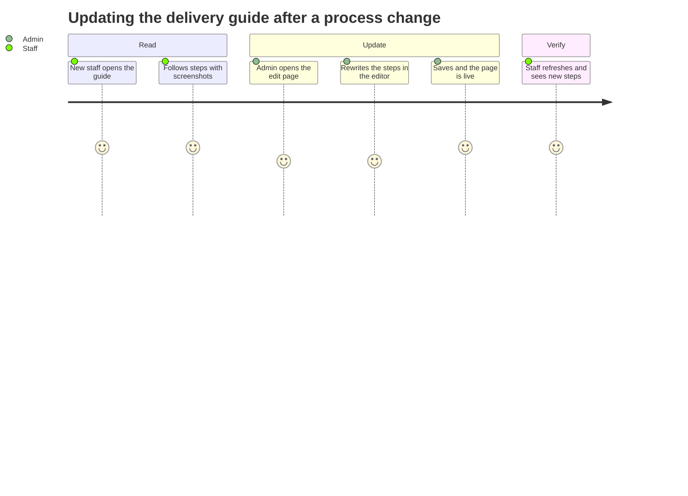
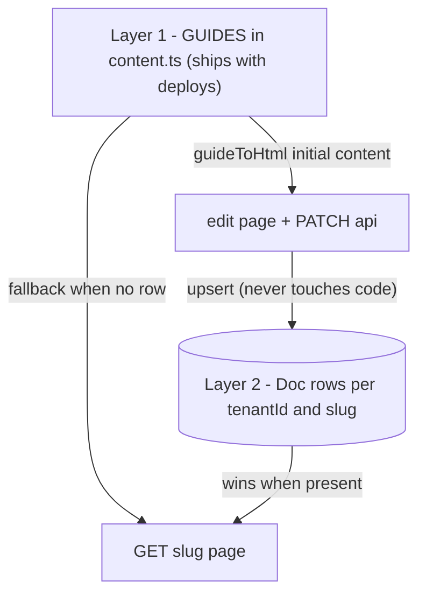
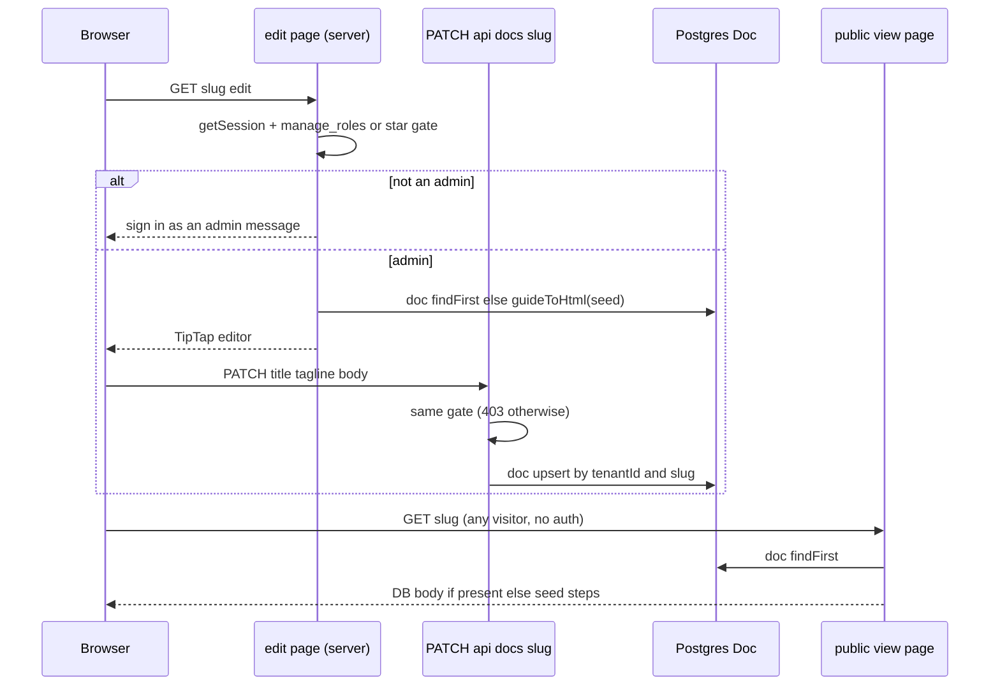
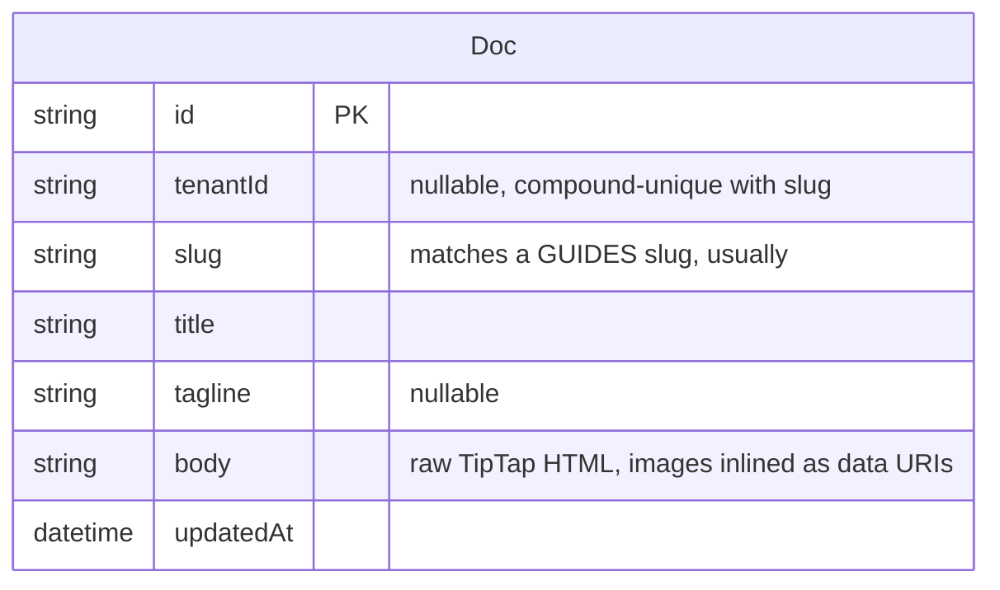
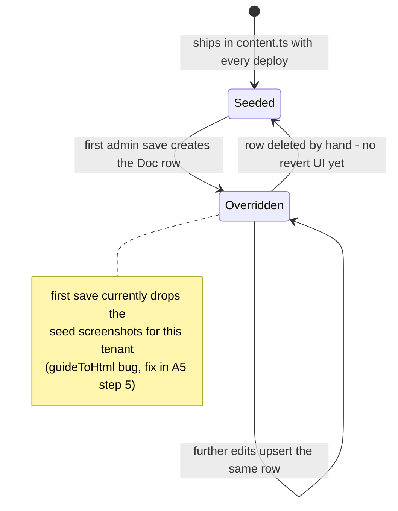
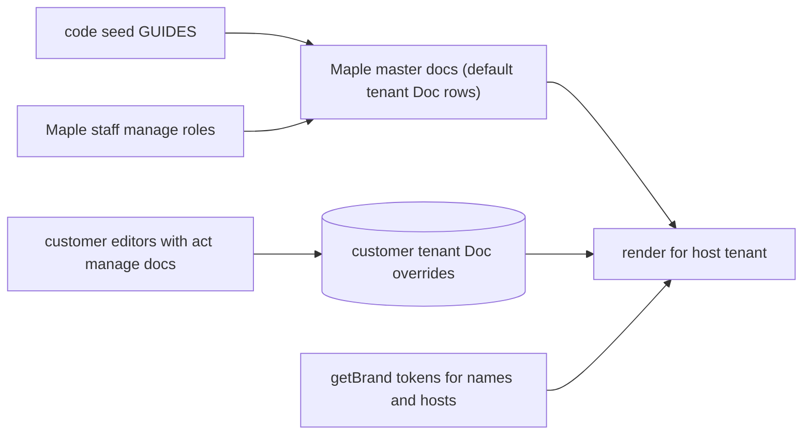
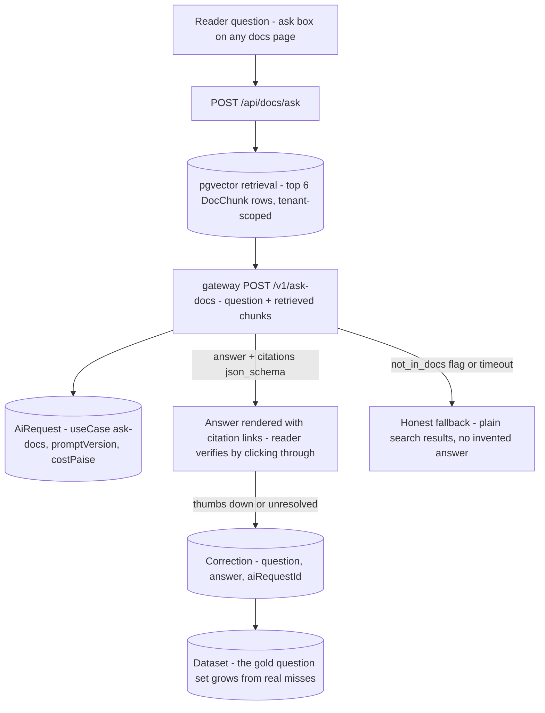

# Docs — engineering bible

Team documentation site: seeded step-by-step guides for every tool plus pre-authored developer docs, every page editable in place with a TipTap WYSIWYG editor whose output is stored per tenant in the `Doc` model. Architecturally it is the suite's odd one out — **the only app with no `middleware.ts`** — and simultaneously its most under-exploited asset: a per-tenant, DB-overridable content system that is one design step away from being white-label product documentation (B1/B3).

**Status:** `apps/docs` · `docs.maplefurnishers.com` · dev port **:3018** (`PORTS.local.txt`) · prod container `docs` from `maple-suite:latest` with `APP: docs` (`docker-compose.yml:148-152`).

## For managers — plain-language guide

This is the team handbook, online. Step-by-step guides — with screenshots — for every tool in the suite, so a new hire can learn the quotations tool or the challan process without pulling a senior off the floor. Admins can rewrite any page right in the browser, like editing a Word document, and the change is live on the next refresh.

| Feature | What it means in your day | Who uses it |
| --- | --- | --- |
| Tool guides (17 of them) | A new salesperson in the showroom opens the docs site and follows the quotations guide step by step, screenshots included — nobody has to sit beside them for the basics | All staff, especially new hires |
| Developer pages (6 of them) | When you hire a freelance developer, the technical onboarding — how the system is built, how to run it, how to add a tool — is already written down | Developers |
| Edit any page in the browser | Your delivery process changes: an admin opens the challans guide, rewrites the steps in a familiar editor (bold, headings, lists, images), saves — live immediately, no developer, no release | Owner / admin |
| Your edits, your workspace | An edited page only changes for *your* business; the built-in original remains underneath as the fallback | Owner / admin |
| Pictures in pages | Paste or upload screenshots straight into a guide while editing (up to 3 MB each) | Owner / admin |
| Open reading, locked writing | Anyone who can reach the docs site can read the guides — handy as pre-login help — but only admins can edit; everyone else sees a "sign in as an admin" note on edit pages | Everyone / admins |



**Signs it's working:**
- A brand-new teammate can produce their first quote using only the guide — that is the whole point of the app.
- An admin's edit shows on the public page immediately after refresh, and other businesses' docs are untouched.
- A non-admin opening any page's edit view gets the sign-in message, never an editor.
- One caution to know: today, the *first* edit of a built-in guide silently drops its screenshots for your workspace (a known bug with a one-line fix pending) — check the page after a first edit.

---

## Part A — for implementers

### A1 — What it does

- Serves two page groups from the `GUIDES` array in `app/content.ts` (318 lines): **"Using the tools"** — 17 step-by-step guides (`getting-started` plus one per tool) with screenshots under `public/shots/<slug>/<shot>.png`; **"For developers"** — 6 pages (`dev-architecture`, `dev-local`, `dev-add-tool`, `dev-auth`, `dev-flags`, `dev-tenancy`, `dev-deploy`) whose content is pre-authored HTML in the `body` field.
- **Every page is overridable.** `/[slug]` first looks up a `Doc` row via `tenantDb().doc.findFirst({ where: { slug } })` and renders its `body` HTML if present, falling back to the seed guide. Editing never mutates `content.ts` — it upserts a per-tenant `Doc` row. Content is therefore three-layered: code (seed) → tenant DB override → rendered page.
- `/[slug]/edit` hosts a **TipTap** editor (`Editor.tsx`: StarterKit + Image extension) with a toolbar for bold/italic/H2/H3/lists/blockquote and inline image upload; `guideToHtml()` converts a seed guide into initial editable HTML.
- **Reads are public by design; only writes are guarded.** The app has NO `middleware.ts` — re-verified: only `.next` build manifests match a middleware grep; no source middleware exists. Anyone who can reach `docs.maplefurnishers.com` can read every guide **including the developer docs**. Auth is per-route instead: the edit page and both mutation APIs require a session whose perms include `*` or `manage_roles` (via `can()` from `@maple/core/lib/rbac`); otherwise the edit page renders "Sign in as an admin (at admin.maplefurnishers.com) to edit this page."
- Uploaded images come back as base64 `data:` URIs and are embedded directly into the doc body — no file storage.

### A2 — Code architecture

| Piece | Path | Notes |
| --- | --- | --- |
| Index (card grid) | `app/page.tsx` | Groups `GUIDES` by `section` |
| Sidebar shell | `app/layout.tsx` | `getBrand()` for the tenant name (white-label-aware already), nav built from `GUIDES` — no auth anywhere |
| Guide page | `app/[slug]/page.tsx` | DB `Doc` override → seed fallback, `force-dynamic` |
| Editor page | `app/[slug]/edit/page.tsx` | Server-side `manage_roles` gate, then renders `Editor` |
| TipTap editor | `app/[slug]/edit/Editor.tsx` | StarterKit + Image; PATCHes `/api/docs/[slug]` |
| Docs API | `app/api/docs/[slug]/route.ts` | GET public · PATCH gated upsert |
| Image API | `app/api/docs/image/route.ts` | Gated; ≤ 3 MB raw body → base64 data URI (no storage) |
| Seed content | `app/content.ts` | `GUIDES`, `guideToHtml()`; dev docs appended via `GUIDES.push(...D)` |
| Config | `next.config.ts` | `allowedDevOrigins: ["docs.maplefurnishers.com"]`, `transpilePackages: ["@maple/core"]` — note: **not** `@maple/db`; Prisma arrives transitively through core |

#### Anatomy of `content.ts` (the seed layer)

The `Guide` type is the whole content model:

| Field | Type | Used by |
| --- | --- | --- |
| `slug` | `string` | Route param, `Doc` override key, screenshot directory, nav href — the identity of a page |
| `title`, `tagline` | `string` | Header + sidebar label; both DB-overridable |
| `tool` | `string?` | Informational tag matching the `TOOLS` key; not used for gating |
| `intro` | `string` | Lead paragraph on structured guides |
| `steps` | `{ text, shot? }[]` | Numbered list; `shot` names a PNG in `public/shots/<slug>/` |
| `section` | `"guide" \| "dev"` (default guide) | Sidebar grouping and index grouping |
| `body` | `string?` | Pre-authored HTML — the dev docs use this exclusively (empty `intro`/`steps`) |

The 6 dev pages are themselves a compact second copy of this architecture handbook, authored as HTML template literals: `dev-architecture` (monorepo + request flow), `dev-local` (`scripts/dev.sh`, ports, `/etc/hosts` gotchas), `dev-add-tool` (`new-tool.sh` + the nav/rbac/seed/Caddy wiring list), `dev-auth` (JWT claims, `canAccessTool`/`can` usage), `dev-flags` (Flipt, fail-open), `dev-tenancy` (tenantDb discipline + branding/PDF flow), `dev-deploy` (CI → compose). They are appended with `GUIDES.push(...D)` at module load — order matters only for the sidebar. Keeping them truthful is a manual discipline; they have already drifted slightly from this docs set (e.g. they describe "Next.js 16 apps" and don't mention the docs app's own no-middleware exception) — treat `docs/architecture/` as canonical and the in-app dev pages as the onboarding digest.

#### The three content layers



#### Request lifecycle 1 — render (`GET /[slug]`)

1. `app/[slug]/page.tsx` (server component, `force-dynamic` so overrides show immediately): find the seed guide by slug in `GUIDES`; in parallel-ish, `tenantDb().doc.findFirst({ where: { slug } })` — `tenantDb()` resolves the tenant from the session if present, else from the `Host` header via `currentTenant()` ([module-admin.md](module-admin.html) documents that chain), so anonymous visitors on a tenant domain get that tenant's overrides.
2. Neither found → `notFound()`. Title/tagline/body each resolve DB-first: `doc?.title || guide!.title`.
3. If an HTML body exists (DB override, or a dev doc's authored `body`), render it via `dangerouslySetInnerHTML` inside the `prose-doc` wrapper — **no sanitization** (accepted while writers are `manage_roles` admins only; a hard blocker for any wider write access, see B5).
4. Otherwise render the structured guide: intro paragraph, then numbered steps, each with an optional screenshot `/<shot>.png">` served statically from `public/`.
5. An "Edit" link renders for everyone (the gate is on the edit page itself, not the link).

#### Request lifecycle 2 — edit → save → render, function by function

1. `GET /[slug]/edit` → `edit/page.tsx`: `getSession()` (cookie → `verifySession`) then the gate `user.perms.includes("*") || can(user.perms, "manage_roles")`; failure renders the sign-in message (a server component branch — no redirect, no 401).
2. On success: fetch the existing `Doc`; initial editor HTML = `doc?.body || (guide ? guideToHtml(guide) : "")`. **`guideToHtml()` flattens steps to `<li>${st.text}</li>` and drops the `shot` field** — the first save of a previously-unedited guide silently deletes its screenshots from the rendered page (the DB body now wins over the seed). Verified in `content.ts:156-159`; carried as an open issue in B5.
3. `Editor.tsx` mounts TipTap with `StarterKit + Image`, `immediatelyRender: false` (SSR-safe). Toolbar buttons call `editor.chain().focus().toggle*()`; the component is fully client-side.
4. Image insert: `upload(file)` POSTs the raw file (`Content-Type: file.type`) to `/api/docs/image`; the route checks the same `manage_roles` gate, enforces ≤ 3 MB, and returns `{ url: "data:<type>;base64,..." }`; the editor inserts it via `setImage({ src })` — the image now lives *inside* the HTML string.
5. Save: `PATCH /api/docs/[slug]` with `{ title, tagline, body: editor.getHTML() }`. The route re-checks the gate (defense in depth — the page gate alone would not protect curl), resolves `tenantId` via `getTenantId() ?? ""`, and runs `prisma.doc.upsert({ where: { tenantId_slug: { tenantId, slug } }, update, create })`. Note it uses the **raw `prisma` client with an explicit compound key**, not `tenantDb()` — upsert isn't in the extension's intercepted operations, so the tenant scoping is manual here and correct.
6. Next `GET /[slug]` picks the new `Doc.body` — the seed guide for that slug is now permanently shadowed for this tenant (until the row is deleted by hand; there is no "revert to default" UI — B3).



#### The TipTap output contract

`editor.getHTML()` is the persistence format — the `Doc.body` column stores whatever TipTap serializes. With `StarterKit + Image` the possible output vocabulary is: `p, h1–h6` (toolbar exposes only H2/H3), `strong, em, s, code, pre, blockquote, ul, ol, li, hr, br, img[src]`. Three consequences to design around:

1. The **renderer's CSS surface** (`prose-doc` class) and the **future sanitizer allowlist** (B3-2c) must both track this vocabulary — extending the editor (e.g. adding the Link or Table extension) is a three-place change: extension list, CSS, allowlist.
2. TipTap normalizes aggressively on load: hand-authored dev-doc HTML that round-trips through the editor gets rewritten to TipTap's canonical form (attribute order, wrapping). Diff noise, not data loss — but it means "edited in TipTap" and "authored in code" bodies are not byte-comparable.
3. `img src` is unconstrained today — the editor only inserts data URIs via upload, but a PATCH via curl can reference any URL (or any `javascript:`-free content — browsers block script in `img src`, but tracking pixels are possible). The sanitizer allowlist should pin `src` to `data:image/` now and to the storage domain after the media migration.

#### Request lifecycle 3 — index and shell

- `app/layout.tsx` (server component, wraps everything): `await getBrand()` → sidebar header shows `brand.name` (so a white-label tenant's docs already carry their name); nav = two `GUIDES.filter()` passes (`section !== "dev"` then `=== "dev"`). No session read anywhere in the shell — the layout renders identically for anonymous and admin visitors.
- `app/page.tsx` (index): the same grouping rendered as a card grid; every card links to `/${slug}`.
- Fonts are self-hosted via `next/font/google` (Outfit + Instrument Serif), same pairing as the rest of the suite — visual continuity without importing `SuiteShell` (which would drag in nav/session assumptions this app deliberately avoids).

#### Discoverability facts worth knowing

- The sidebar nav is built **only from `GUIDES`** — a `Doc` row created with a brand-new slug (possible via direct PATCH) renders fine at `/slug` but never appears in navigation. Seed slugs are the site map.
- The docs tool is **not in `TOOLS`** (`packages/core/src/lib/nav.ts`), so it appears on neither the admin launcher nor the `SuiteShell` sidebar of other tools; it is reachable only by direct URL or in-app help links. Consequently there is no `tool:docs` permission key — nothing to grant, matching the no-middleware posture.

### A3 — Data model & API

Owns `Doc` (`packages/db/prisma/schema.prisma:278-287`) — slug unique per tenant (`@@unique([tenantId, slug])`), body is raw TipTap HTML (text column; base64 images inflate it, see B4).



| Route | Method | Auth | Request → Response |
| --- | --- | --- | --- |
| `/api/docs/[slug]` | GET | **None — public** | → the tenant's `Doc` row or `null` (errors also collapse to `null` — DB-down looks like "no override") |
| `/api/docs/[slug]` | PATCH | Session with `*` or `manage_roles` | `{title?, tagline?, body?}` → upserted `Doc` (`title` defaults to slug on create, `tagline` nullable, `body` defaults `""`) · 403 otherwise |
| `/api/docs/image` | POST | Session with `*` or `manage_roles` | raw body, `Content-Type` = mime → `{url: "data:<type>;base64,..."}` · 400 over 3 MB · 403 |

Public read is deliberate today (docs double as help pages linked from inside the tools, pre-login) — a standing decision, not an accident; the open question is scoping `dev-*` pages (B5).

Error-shape convention worth noting: the public GET never errors (DB failure → `null`, indistinguishable from "no override"), while the gated routes always return JSON `{error}` with an honest status. That asymmetry is intentional — the read path privileges availability, the write path privileges correctness — and any new route in this app should pick its side of that line explicitly.

### A4 — Config reference (every env var this app reads)

| Var | Read in | Default | Notes |
| --- | --- | --- | --- |
| `DATABASE_URL` | `@maple/db` prisma (via core) | — | `Doc` reads/writes + tenant/brand resolution |
| `AUTH_SECRET` | `core/session.ts` via `getSession()` in the gated routes | dev fallback | Docs never *signs* tokens, only verifies admin's |
| `NODE_ENV` | `core/session.ts` | — | cookie `secure` flag (relevant only if docs ever sets cookies — it doesn't today) |
| `COOKIE_DOMAIN` | — | — | **Not read**: docs has no login/logout routes; the cookie arrives because admin set it domain-wide |
| `FLIPT_URL` | — | — | **Not read**: no flag checks in this app — it cannot be dark-launched or killed via Flipt (gap noted in B5) |

The shortest env list in the suite — which is the point: docs is a pure consumer of the identity and brand contracts.

**Running & dev notes**

- Dev: `bash scripts/dev.sh` (whole suite) or `npm run dev -w @maple/app-docs` on port **:3018**; needs `DATABASE_URL` pointing at the dev Postgres (`:5544`) for overrides — without it, every page still renders from seed (the `.catch(() => null)` on the `Doc` lookup makes DB-down invisible on the read path, by design).
- Prod: shared parametrized `Dockerfile`, `APP: docs` in `docker-compose.yml`; Caddy terminates TLS for the subdomain.
- Editing locally requires signing in at the admin app first (dev `:3001` / `admin.maplefurnishers.com` with the `/etc/hosts` overrides) so the `mt_session` cookie exists — with a host-only dev cookie (`COOKIE_DOMAIN` unset), use the Caddy hostnames rather than `localhost:3018`, or the cookie won't be sent to the docs origin.

**Worked API shapes**

```
GET /api/docs/getting-started
  -> 200 {"id":"...","tenantId":"...","slug":"getting-started",
          "title":"Getting started","tagline":"...","body":"<p>...</p>","updatedAt":"..."}
  -> 200 null                      (no override, or DB unreachable)

PATCH /api/docs/getting-started   (Cookie: mt_session=<admin JWT>)
  {"title":"Getting started","tagline":"Sign in once","body":"<p>Edited.</p>"}
  -> 200 <upserted Doc>            | 403 {"error":"Not allowed"}

POST /api/docs/image              (Content-Type: image/png, raw bytes)
  -> 200 {"url":"data:image/png;base64,iVBOR..."}
  -> 400 {"error":"Image too large (max 3MB)."}
```

### A5 — Recipe: add a new seeded guide

Worked example: a guide for a new `warranty` tool.

1. **Author the entry** — `apps/docs/app/content.ts`, append to `GUIDES` (before the `D` dev-docs push):

   ```ts
   {
     slug: "warranty", title: "Warranty claims", tool: "warranty",
     tagline: "Log and track claims to resolution.",
     intro: "Warranty is where post-delivery issues live...",
     steps: [
       { text: "Add a claim with the client, item and issue.", shot: "new" },
       { text: "Move it through Received → In repair → Resolved.", shot: "overview" },
     ],
   },
   ```

   `section` defaults to `"guide"` (tool section); use `section: "dev"` + a `body` HTML string for developer pages instead of `steps`.
2. **Screenshots** — drop `public/shots/warranty/new.png` and `overview.png`. The render path is `/shots/<slug>/<shot>.png`; missing files show as broken images, there is no existence check.
3. **Done for nav + index** — sidebar (`layout.tsx`) and index grid (`page.tsx`) both derive from `GUIDES`; no registration step.
4. **Slug discipline** — the slug is the `Doc` override key per tenant. Never rename a shipped slug: renames orphan every tenant's edited override (the old `Doc` row stops rendering; the new slug shows the fresh seed). Treat slugs as an API.
5. **Remember the flattening caveat** — the moment an admin edits this guide, `guideToHtml()` produces `<p>intro</p><ol><li>step text</li>...</ol>` and the screenshots vanish from that tenant's rendering (A2 lifecycle 2, step 2). Until that's fixed, either author critical screenshots into dev-style `body` HTML, or fix `guideToHtml` to emit `` tags — one line: include `st.shot ? `` : ""` per step.
6. **Test** — there is no test harness in this app; minimum viable check is `npm run dev -w @maple/app-docs` and eyeballing `/warranty` and `/warranty/edit`.

Companion recipe — a new **developer** page differs only in shape: `section: "dev"`, empty `intro`/`steps`, and the content as a `body` HTML template literal in the `D` array. Stick to the tag vocabulary the existing dev pages use (`p, h3, ul, li, pre>code, strong, em`) — it is also the CSS surface `prose-doc` styles and the sanitizer allowlist B3-2c will enforce. Escape `<` in code samples as `&lt;` (see `dev-architecture`'s `&lt;tool&gt;` pattern).

---

## Testing — how we verify this module

**Current state (verified):** **zero tests for this app** — no test files under `apps/docs`, and A5 step 6 honestly says the minimum check today is running dev and eyeballing two pages. The suite root's vitest harness is installed and its config already includes `apps/**/*.test.{ts,tsx}`, so the only missing ingredient is the test files themselves. B5 carries a five-item shortlist; this section turns it into a plan.

A page's content lifecycle — the thing most tests below revolve around:



**Unit-test targets** (small app, small list — but both items matter):

| Function | What to pin |
| --- | --- |
| `guideToHtml` (`content.ts:156`) | **regression-pin the screenshot bug first** (B5's own instruction): today steps with `shot` emit only `<li>text</li>`; after the one-line fix, assert an `/<shot>.png">` per step. Also: intro → leading `<p>`, empty guide → empty string |
| The editor gate predicate (`perms.includes("*") \|\| can(perms, "manage_roles")`) | table over `["*"]`, `["act:manage_roles"]`, `["tool:users"]`, `[]` — it is duplicated across three files (edit page + both APIs), so a shared helper + one test beats three copies |

**Integration tests** (route + scratch DB; JWTs via `signSession` with a throwaway secret). These mirror B5's shortlist as named cases:

| Case | Route | Asserts |
| --- | --- | --- |
| **PATCH gate** (the only thing between the public internet and content injection) | PATCH `/api/docs/[slug]` | no session → 403; session without `manage_roles`/`*` → 403; with → 200 and the row lands under the caller's tenant |
| **Tenant isolation on the manual upsert** | two tenants PATCH the same slug | two rows; each host resolves only its own — this exercises the compound-key upsert, the one spot `tenantDb()` doesn't cover |
| Fallback correctness | GET `/[slug]` | no `Doc` row → seed renders (steps + screenshots); row present → body wins; unknown slug with no row → 404 |
| Image cap + mime echo | POST `/api/docs/image` | 3 MB + 1 byte → 400; `Content-Type` echoed into the returned data URI |
| Read-path availability | GET `/api/docs/[slug]` with DB down | 200 `null` — never an error; pins the A3 availability-over-correctness decision for the read side |
| `img src` laundering (pre-sanitizer) | PATCH a body with `` | currently stored verbatim — pin as documented behavior until B3-2c's allowlist lands, then flip the assertion |

**E2E (Playwright), as user stories:**

1. *New hire reads a guide.* Open `/getting-started` in a fresh context (no cookie) → intro, numbered steps, and screenshots all render; the sidebar lists both sections.
2. *Admin edits a page.* Sign in at admin (the cookie-domain caveat in A4 applies — use the Caddy hostnames) → open `/getting-started/edit` → change a line, save → an anonymous refresh of `/getting-started` shows the change.
3. *Non-admin lockout.* With a sales-role session, open `/[slug]/edit` → the "Sign in as an admin" message renders, no editor; a curl PATCH with the same cookie → 403.

**Definition of done for new features here:** a new seed guide ships with its screenshots present and its slug treated as an API (A5 step 4 — never rename); any editor-extension change updates the CSS surface and the future sanitizer allowlist together (the three-place rule in A2); any new route explicitly picks and records its side of the availability-vs-correctness line (A3); the `guideToHtml` regression test stays green.

---

## Part B — for architects

### B1 — Cross-module relations: docs-as-product for white-label customers

**What docs consumes today:** the identity contract (verifies `mt_session` via `AUTH_SECRET`; uses `manage_roles` as its editor permission — the same "site admin" proxy admin's CMS uses) and the brand contract (`getBrand()` in the layout renders the tenant's `brandName` over the sidebar). **What it exposes:** nothing programmatic beyond the public GET — no other module reads `Doc`.

**The design opportunity.** The suite's white-label pitch ([platform-architecture.md](platform-architecture.html)) sells each customer their own branded workspace — and support documentation is part of a product's surface. The pieces already in place: per-tenant `Doc` overrides keyed `(tenantId, slug)`, host-based tenant resolution for anonymous readers, brand-aware chrome. The missing design is the **content supply chain**:

- *Layered fallback (design):* resolve `Doc` by `(tenantId, slug)` → `(defaultTenantId, slug)` → code seed, instead of today's two layers. That lets Maple maintain a curated "master" doc set as DB rows (editable without deploys), while customers override only the pages that differ (their logo in screenshots, their process steps). One query change in `[slug]/page.tsx` plus an ordering rule.
- *Terminology injection:* guides hardcode `maplefurnishers.com` hostnames in prose (e.g. `getting-started` step 1). A tiny template pass — replace `{{brand}}`, `{{adminHost}}` tokens at render time from `getBrand()` — makes one seed serve every tenant without forking pages. Structured-content-over-presentation is the core lesson of the headless-CMS literature ([Smashing Magazine on structured content](https://www.smashingmagazine.com/2018/11/structured-content-done-right/)).
- *Editor delegation:* white-label customers will want to edit their own docs, but `manage_roles` is far too big a key to hand them. Mint `act:manage_docs` ([module-users.md](module-users.html) A5 is the recipe) — and that immediately makes HTML sanitization a blocker, since non-Maple staff would then write `dangerouslySetInnerHTML` content (B5).
- *Relation to the site CMS:* admin's `SitePage/SiteBlock` is marketing (structured blocks, public SPA); docs is long-form help (rich text, server-rendered). They should stay separate models — but the **image-storage fix is shared** (both embed base64 today; both should move to `core/lib/storage.ts`-backed uploads with URL references).



Sequenced as a rollout (each phase independently shippable):

| Phase | Ships | Depends on |
| --- | --- | --- |
| 1 | Three-layer fallback + `{{brand}}`/`{{adminHost}}` tokens | nothing — one query + one render pass |
| 2 | Override indicator + revert | DocRevision (B3-1) for safe revert |
| 3 | `act:manage_docs` + server-side sanitization | users-app B1 fix landed (route-guard helper exists) |
| 4 | Customer-facing editor + export/import | phases 1–3; storage migration for images |
| 5 | Docs surfaced inside tools ("? " help links deep-linking to slugs) | slug-stability discipline (A5 step 4) |

### B2 — Infra touchpoints (bootstrap vs enterprise)

| Concern | Bootstrap (today) | Enterprise (designed) |
| --- | --- | --- |
| Auth | Verify-only JWT; no middleware; per-route gates | Unchanged by the Redis revocation layer ([module-admin.md](module-admin.html) B2) *except* the gated routes should adopt the revocation-aware `verifySession` when it exists — an editor whose access was pulled should lose PATCH rights inside minutes, and docs inherits that for free by using `getSession()` |
| Runtime | One `APP=docs` container, Caddy subdomain | K8s: the most cacheable app in the suite — 1 replica + CDN in front covers reads; only PATCH needs the origin. Readiness = `/api/health` with a `doc.count()` ping (to build, runbook D2) |
| Media | base64-in-body | Object storage via `core/lib/storage.ts`; rendered bodies reference URLs; CDN serves them |
| Events | None | `doc.updated` — `{ slug, tenantId, actorId, bytes, version? }` on the outbox pattern ([event-catalog.md](event-catalog.html)); consumers: audit log, search indexer (B3-3), cache/CDN invalidation |
| Search | None (17 guides — ctrl-F suffices) | See B3-3; index updates hang off `doc.updated` |

The Kafka user/tenant identity topics ([module-admin.md](module-admin.html) / [module-users.md](module-users.html) B2) matter to docs only as a consumer of `tenant.created` in the layered-fallback world: a new tenant needs no doc seeding at all if fallback is in place — which is the argument for fallback over copy-on-create.

Bootstrap-track deployment notes, concretely: the container runs `next start` like every sibling; Caddy routes `docs.maplefurnishers.com → docs:3000`; there is no migration step specific to docs (the shared one-off `migrate` compose service covers `Doc`). Because reads are public and dynamic, docs is also the suite's best canary — an uptime check on `GET /getting-started` exercises Caddy, the app, Prisma, tenant resolution, and brand resolution in one request without credentials. Enterprise track adds nothing docs-specific beyond the table above: no Redis keys of its own, no Kafka producers until `doc.updated`, and the K8s profile is the default tool-app one with `replicas: 1` and CDN caching carrying the read load.

### B3 — Designed enhancements (each in depth)

**1. Versioned docs.** Today `doc.upsert` destroys history; a bad save (or the screenshot-flattening bug) is unrecoverable. Design — append-only revisions beside the hot row:

```prisma
model DocRevision {
  id        String   @id @default(cuid())
  tenantId  String?
  slug      String
  title     String
  tagline   String?
  body      String
  authorId  String
  createdAt DateTime @default(now())
  @@index([tenantId, slug, createdAt])
}
```

PATCH writes the *previous* state into `DocRevision` in the same transaction as the upsert (copy-on-write, so the revision table is exactly "every state that was ever replaced"). Editor gains a History drawer (list by `createdAt`, diff = client-side HTML diff, Restore = PATCH with the old body — which itself creates a revision, keeping the chain linear). Retention: keep all (bodies are text; storage is trivial once images move out — do B3-media first or revisions multiply the base64 bloat). Explicitly *not* building: branching, drafts, scheduled publish — single-editor teams don't need them, and the revision table doesn't preclude them later.

Editor-side UX for revisions, specified: the History drawer lists `createdAt · authorId → name (via users API) · byte delta`; selecting a revision swaps the TipTap content read-only with a "Restore this version" action; restore is a normal PATCH so the gate, audit, and revision-write all fire unchanged. API surface: `GET /api/docs/[slug]/revisions` (gated, paginated by `createdAt` cursor) and `GET /api/docs/[slug]/revisions/[id]` — no DELETE (append-only is the property that makes the feature trustworthy).

**2. Per-tenant doc overrides, productized.** The mechanism exists; the product around it doesn't. Ship, in order: (a) the three-layer fallback + `{{brand}}` tokens (B1); (b) an override indicator in the UI — "This page was customized on <date> · View default · Revert" (revert = delete the `Doc` row; trivially safe once revisions exist); (c) `act:manage_docs` + sanitization (DOMPurify server-side on PATCH, allowlist matching TipTap's output: `p, h2, h3, ul, ol, li, blockquote, strong, em, img[src^="https://" or storage domain]`) so customers can safely self-serve; (d) an export/import pair (`GET /api/docs?format=json`, gated) so the master doc set can be promoted between environments — the docs equivalent of a CMS content migration.

**3. Search.** Three tiers, sized honestly: (a) **now, zero infra** — client-side index over `GUIDES` + the tenant's `Doc` rows (a `/api/docs/index` route returning slug/title/tagline/plaintext-stripped body; FlexSearch or Fuse in the browser; 17–30 docs is nothing); (b) **Postgres FTS** when doc counts grow — `tsvector` generated column over `title || tagline || strip_tags(body)`, GIN index, `@@ websearch_to_tsquery` endpoint, per-tenant filtered — no new services, good enough far past 1 000 docs; (c) **external engine** (Meilisearch/Typesense) only when cross-suite search (docs + CRM + quotations) becomes a product goal, fed by the `doc.updated` event. Skip (c) until then; (b) is likely the terminal state.

**Search endpoint sketch (tier b, the likely terminal state):**

```sql
ALTER TABLE "Doc" ADD COLUMN search tsvector
  GENERATED ALWAYS AS (to_tsvector('english',
    coalesce(title,'') || ' ' || coalesce(tagline,'') || ' ' ||
    regexp_replace(body, '<[^>]+>', ' ', 'g'))) STORED;
CREATE INDEX doc_search_idx ON "Doc" USING GIN (search);
```

`GET /api/docs/search?q=` → `WHERE "tenantId" = $1 AND search @@ websearch_to_tsquery($2)` ranked by `ts_rank`, unioned client-side with a static index over `GUIDES` (seed pages have no rows to index). The regexp strip is crude but sufficient; move stripping to write-time (store `plaintext` alongside `body`) if rank quality ever matters.

### B4 — Scaling

- Read path: `force-dynamic` + one `findFirst` per view. At any real traffic, add `Cache-Control: public, s-maxage=60, stale-while-revalidate` (public pages, no per-user content) or move to ISR with tag invalidation from the PATCH route — docs is the easiest app in the suite to put behind a CDN.
- **The known body-bloat gotcha (carried, still true):** base64 images inflate `Doc.body` fast — a 3 MB upload becomes ~4 MB of HTML *per occurrence*, shipped on every render of that page and re-shipped on every save. Postgres TOASTs it fine; browsers and the editor do not. The storage migration (B2/B3-2c) is the fix; until then the 3 MB cap is the only guardrail.
- Seed content scales with the tool count, not usage — `content.ts` at 318 lines for 23 pages is fine; split by section when it crosses ~1 000 lines for review ergonomics.
- Multi-tenant: reads are naturally partitioned by the compound key; the only table-wide scan risk is a future search index build — do it per tenant.
- Sizing intuition for the media migration threshold: 20 tenants × 23 pages × 2 embedded screenshots × ~500 KB base64 ≈ 460 MB of duplicated text in one table — and every edited page ships all of it to the editor on open. The migration is warranted well before those numbers; the trigger written down: **first white-label customer who edits docs**.
- Screenshot upkeep is the real long-term cost: `public/shots/**` is versioned with the repo and goes stale with every UI change. A capture script (Playwright walking each tool with seeded data) turns a manual afternoon into CI — worth building the second time the screenshots go stale, not before.

## AI — use case & pipeline

**Use case: a RAG assistant over the docs the suite already writes.** Two corpora exist today and both are already maintained for humans: this architecture set (`docs/architecture/`, the deepest technical reference the suite has) and the in-app user guides (`GUIDES` + per-tenant `Doc` overrides). A new hire asking "how do I make a challan?" or a developer asking "where are sessions minted?" should get an answer *with citations into those pages*, not a fresh hallucination. The retrieval layer is deliberately boring: **pgvector on the existing Postgres — not a vector-database purchase.** One extension (`CREATE EXTENSION vector`), one table, and the corpus at full build-out is a few thousand chunks — three orders of magnitude below where a dedicated vector store earns its complexity. Chunking is **by heading**: each `h2`/`h3` section of a rendered page becomes one chunk carrying `(slug, heading)`, which is what makes citations clickable and keeps chunks semantically whole instead of arbitrary 500-token windows. Answers always render their citations, and the reader clicking through *is* the review step — plus an explicit "did this answer it?" control feeding the corrections loop.



| Contract | Detail |
| --- | --- |
| Endpoint | `POST {gateway}/v1/ask-docs` — retrieval happens app-side (the chunks travel in the request), generation and keys stay in the gateway |
| Input | the question (≤300 chars) + the top-6 retrieved chunks `[{slug, heading, content}]` + tenant brand name (so answers say the tenant's name, not "Maple") |
| `json_schema` (structured output, `additionalProperties: false`) | `answer` (markdown, ≤250 words), `citations [{slug, heading}]` (must be a subset of the supplied chunks — enforced app-side after the call), `confidence`, `flags ["not_in_docs", "outdated_suspected"]` — the never-guess rule: if the chunks don't contain the answer, flag and say so |
| Model + phrase | `sonnet-5` — grounded synthesis with citation discipline over supplied context is the mid-model sweet spot; `haiku` measurably over-asserts on "not in docs" cases, and `claude-fable-5` is wasted on a corpus this clean. Embeddings via the gateway's embedding route so docs never holds a key |
| ₹/call | ≈ ₹1–2 per question (6 chunks ≈ 4–5k input tokens); embedding the full corpus is a one-off ≈ ₹50 and re-embeds are per-changed-page |
| er-platform tables | `AiRequest` (every question) · `Correction` (thumbs-down + the editor's eventual fix) · `Dataset` → `EvalRun` for the gold question set ([er-platform.md](er-platform.html)). App-side: one new `DocChunk` table (`tenantId, slug, heading, content, embedding vector(1024)`, reindexed on `doc.updated` and on deploy for seed pages) |

Design notes that keep this honest:

- **The three-layer content model carries over:** chunks are built from the *rendered* resolution (tenant `Doc` override → seed), so the assistant answers from what the tenant's readers actually see — an edited guide answers with the edited steps.
- **Public reads, gated asks:** pages stay public (A3 decision) but `/api/docs/ask` requires a session — anonymous visitors get search, staff get the assistant; this caps spend and keeps `AiRequest.userId` meaningful.
- **The managed alternative, cited:** on the AWS track, [infra-aws-services.md](infra-aws-services.html) documents **Bedrock Knowledge Bases** as the equivalent S3 → embed → retrieve loop with zero pipeline code. It becomes the right call only if the suite is already deep on Bedrock; pgvector on the RDS instance the suite already pays for is the default here precisely because it adds no new service.
- **`promptVersion`** stamps `ask-docs-v1`; retrieval parameters (k, chunk size) version alongside it — a relevance regression must be attributable to prompt vs retrieval.

**Rollout & eval gate.** Index the 23 seed pages + this architecture set first (single tenant, staff-only beta). Gold set: 30 questions harvested from real new-hire and developer questions, hand-labelled with the correct citing sections; gate to ship is citation accuracy ≥ 90% and correct refusal on 10 deliberately out-of-corpus questions ≥ 95% — a docs assistant that invents process steps is worse than none. Re-run on every `promptVersion` bump and every corpus re-chunk. **Not before:** plain search exists (B3-3 tier a — the client-side index over ~30 docs) and has visibly failed someone; RAG over a corpus small enough to ctrl-F is a solution ahead of its problem. Also gated on the `doc.updated` event (B2) existing, since stale chunks silently rot answer quality.

### B5 — Status: done / left / decisions (carried findings preserved)

**Done ✓**

- Full seed content: 17 tool guides with screenshots plus 6 developer docs (architecture, local dev, add-a-tool, auth/RBAC, flags, tenancy/branding, deploy).
- Per-tenant DB overrides with TipTap editing, inline image embedding, and seed fallback; correct manual tenant scoping on the upsert (compound key, since `tenantDb()` doesn't intercept `upsert`).
- Write path correctly gated on `*`/`manage_roles` at **both** the page and API level (defense in depth — verified in `edit/page.tsx`, `api/docs/[slug]`, `api/docs/image`).
- Brand-aware chrome via `getBrand()` — already white-label-ready on the read side.

**Left ◻**

- **No middleware — the entire site, including developer/internal docs, is public (verified: no source `middleware.ts`; only `.next` build artifacts match).** Standing decision, not an accident — but it needs a *decision*, recorded: keep tool guides public (they double as pre-login help) while moving `dev-*` pages behind a session check, or add a read gate app-wide. The per-page gate is a five-line server-component check on `section === "dev"`.
- Rendered bodies use `dangerouslySetInnerHTML` with **no sanitization** — acceptable strictly while writers are `manage_roles` admins; a hard blocker for `act:manage_docs` delegation (B3-2c specifies the DOMPurify allowlist).
- **`guideToHtml()` drops screenshots** — first edit of a guide silently removes its images for that tenant (verified, `content.ts:156-159`). One-line fix specified in A5 step 5.
- Move image uploads from inline base64 to real storage (`@maple/core/lib/storage.ts` exists and is used by other apps).
- Add docs to the launcher/nav (`TOOLS` in `nav.ts`) — or record the decision that it stays a direct-URL utility; today it is invisible to users who don't know the subdomain.
- No Flipt integration — docs is the one app that cannot be feature-flagged off; add the standard `tool.docs` check if/when it joins `TOOLS`.
- No versioning (B3-1), no revert-to-default, no search (B3-3).
- Cross-cutting: no `/api/health` (runbook D2), no app-level tests. First test to write: the PATCH gate (403 without `manage_roles`, 200 with `*`), since it is the only thing standing between the public internet and content injection.

**Testing this module (nothing exists; the shortlist)**

1. PATCH gate: no session → 403; session without `manage_roles`/`*` → 403; with → 200 and the row lands under the caller's tenant (sign a test JWT with `signSession`, throwaway secret).
2. Tenant isolation: two tenants PATCH the same slug → two rows; each host resolves only its own (exercises the manual compound-key upsert, the one spot `tenantDb()` doesn't cover).
3. Fallback correctness: no `Doc` row → seed renders (steps + screenshots); row present → body wins; unknown slug + no row → 404.
4. Image route: 3 MB + 1 byte → 400; content-type echoed into the data URI.
5. Once fixed — `guideToHtml` emits `` for steps with `shot` (regression-pin the current bug first).

**Decisions on record**

- *Public reads, per-route write gates, no middleware* — docs serve as pre-login help, so the default-deny middleware pattern of every other app was deliberately skipped; the cost is that new routes must remember their own gates (both existing mutation routes do).
- *Content in code, overrides in data* — seeds deploy with the product and are always present; tenant customizations live in `Doc` and never require a deploy. The three-layer fallback (B1) extends this rather than replacing it.
- *`manage_roles` as the editor key* — same proxy decision as admin's CMS; revisit the day a non-RBAC-admin needs to edit docs (that day mints `act:manage_docs`, and sanitization ships with it).

---

**External references** — [Smashing Magazine: structured content done right](https://www.smashingmagazine.com/2018/11/structured-content-done-right/) (structure over presentation; why token-injection beats forked pages) · [Headless CMS content modeling with reusable blocks](https://elmapicms.com/blog/headless-cms-content-modeling-reusable-page-sections-blocks) · [Best practices for structuring content in a headless CMS](https://www.afteractive.com/blog/best-practices-for-structuring-content-in-a-headless-cms) (modeling, versioning, workflows).

**Sibling pages** — [module-admin.md](module-admin.html) (identity + brand contracts, session libs, site CMS cousin), [module-users.md](module-users.html) (minting `act:manage_docs`), [module-web.md](module-web.html), [deployment-runbook.md](deployment-runbook.html), [event-catalog.md](event-catalog.html).
