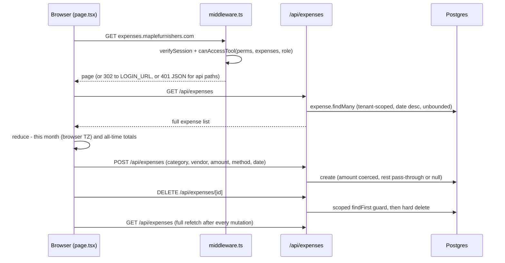
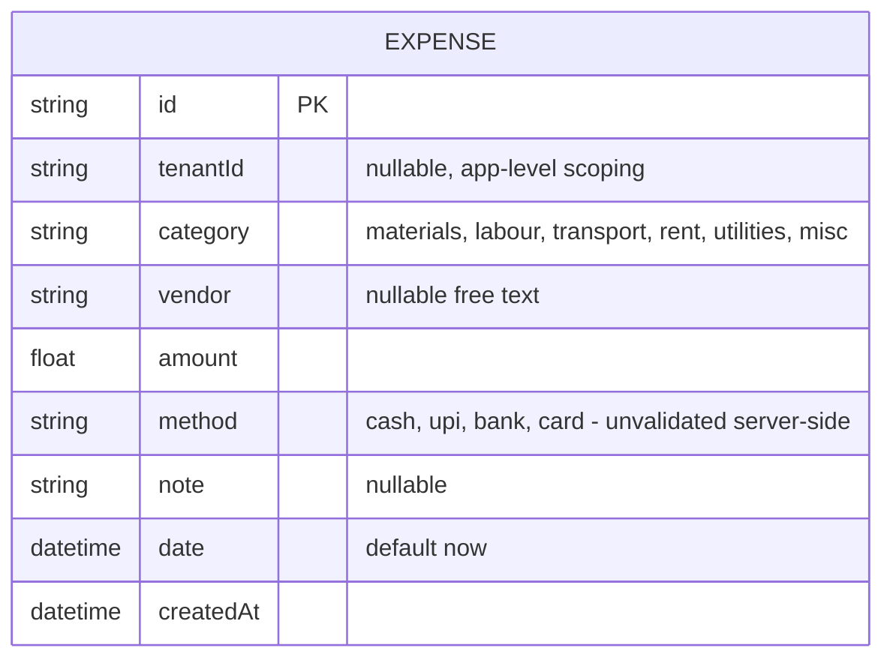
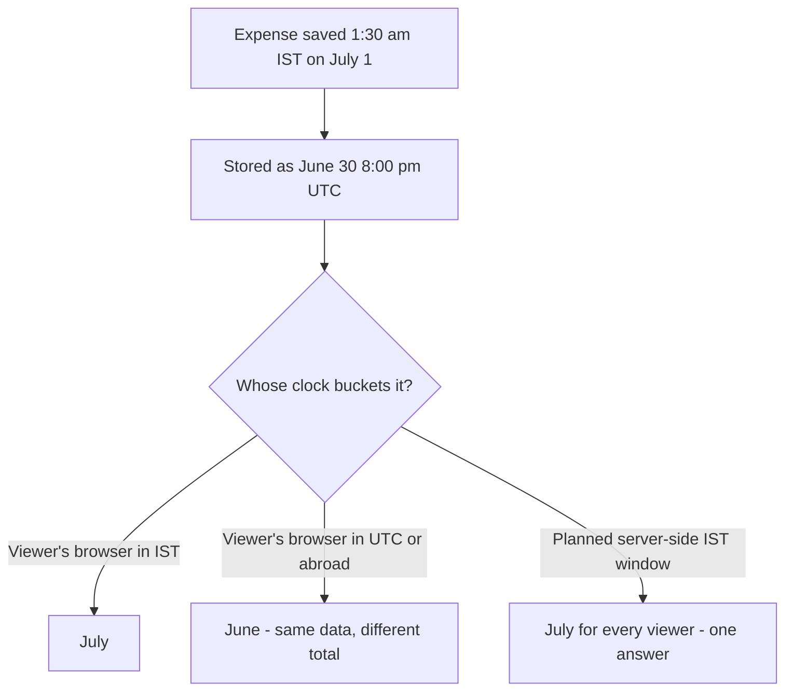
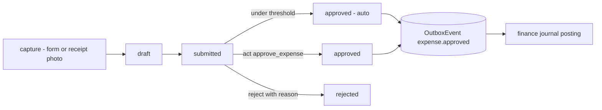
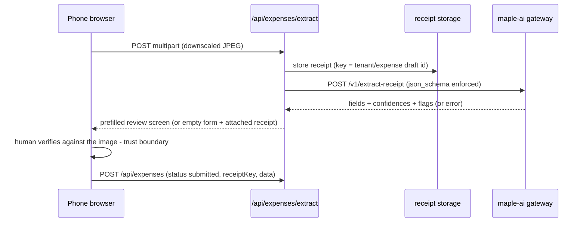
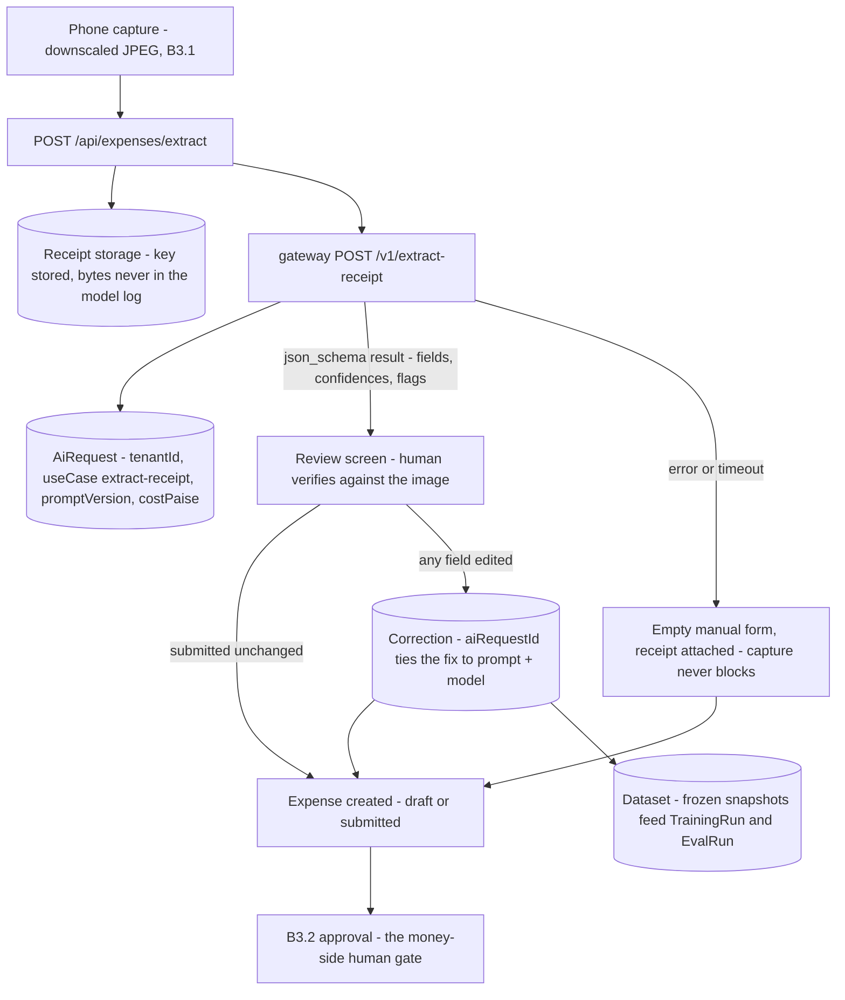

# Expenses — engineering bible

Petty-cash style expense log today — category, vendor, amount, payment method, this-month and all-time totals; record and delete, nothing more. Designed here to become the suite's **spend capture and control point**: photo-in receipt capture with AI extraction, an approval chain that feeds the finance ledger, recurring expenses, and per-category budgets.

**Status:** `apps/expenses` · `expenses.maplefurnishers.com` · dev `:3014` (`PORTS.local.txt`) · prod container `maple-suite:latest` with `APP=expenses` (`docker-compose.yml` service `expenses`).

## For managers — plain-language guide

This is the petty-cash book: fuel, timber, tea, rent — logged as it's spent, with "this month" and "all-time" totals at the top. Today it is purely a record: anyone with access can log anything and nothing needs sign-off, so **a worker's fuel expense is "approved" the moment it's typed in**. The approval step, the receipt photo, and the automatic feed into the accounts ledger are all designed and coming — the table below marks them (planned). One quirk worth knowing: the "this month" total is computed on whatever device you're looking at, so an entry logged around midnight can show under different months on different phones.

| Feature | What it means in your day | Who uses it |
| --- | --- | --- |
| Log an expense | The driver fills diesel for ₹2,400 — pick *transport*, type the pump's name, the amount, and how it was paid (cash/UPI/bank/card). Date fills in as today unless you change it. | Whoever spent or recorded the money |
| This month / all-time totals | The header answers "how much have we burnt this month?" at a glance. | Owner/manager, weekly glance |
| Delete a row | The × removes it instantly — **no "are you sure?"** and no way to edit; a wrong amount means delete and re-log. | Accounts |
| No approval today | Nothing distinguishes a logged expense from an approved one — typing it in *is* the record. | Everyone should know this |
| Not synced with Finance | The same bill typed here *and* in the Finance tool counts twice. One home per expense. | Everyone entering money |
| Approval workflow (planned) | The worker logs the fuel bill; anything above a limit you set (about ₹2,000) waits for your OK before it counts. Small stuff approves itself so petty cash never queues. Nobody approves their own claim. | Staff submit, owner/accounts approve |
| Receipt photo + AI reading (planned) | Photograph the pump receipt with your phone — the form fills itself in (vendor, amount, date, GST) and you just check it against the picture and hit submit. | Anyone with the phone and the receipt |
| Feeds the accounts ledger (planned) | The moment an expense is approved it posts itself into Finance — typed once, counted once. | Nobody — automatic |
| Recurring expenses (planned) | Rent and electricity log themselves every month on the right day; big ones still get a human glance. | Set once by admin |
| Budgets per category (planned) | Give *materials* ₹1.5 lakh for July and watch the bar fill; the form warns when a category is nearly spent (it never blocks — you can't refuse to buy glue). | Owner sets, everyone sees |

**Signs it's working:**

- The month total matches the petty-cash drawer plus UPI/bank debits — reconcile once a week.
- Vendors are spelled consistently ("Sharma Timber", not five variants) so per-vendor answers stay possible.
- Entries appear the day the money moves, not in a Friday batch from memory.

---

## Part A — for implementers

### A1 What exists today

One page, one model, three routes — thinner even than finance, and honestly so:

- **Log an expense** — category (`materials | labour | transport | rent | utilities | misc`), vendor/payee (free text), amount, method (`cash | upi | bank | card`), optional note and date (`app/api/expenses/route.ts`). Date defaults to now.
- **Totals** — the page header shows "This month" (entries matching the current month + year) and "All-time", both reduced **client-side** in `app/page.tsx` over the full list. There is no aggregation endpoint.
- **Delete** — hard delete per row (`×` button), no confirm dialog. No PATCH: a wrong amount means delete and re-log.
- **There is no approval workflow.** No status field, no approver, no receipt upload — the code is strictly record-and-delete. The category `Select` constrains values in the UI, but `POST` stores any string the client sends (`b.category || null`); `method` likewise is unvalidated server-side.
- **Overlap warning** — an `Expense` row and a `FinanceEntry` with `type = "expense"` describe the same money in two unconnected tables; nothing syncs them (see [module-finance.md](module-finance.html), which resolves the split in its B1/D1).
- **Timezone gotcha (real bug)** — "This month" compares `getMonth()`/`getFullYear()` in the **browser's** timezone against dates stored in UTC; entries logged near midnight IST can land in the wrong month bucket.

### A2 File-by-file and the main lifecycle

| File | Role |
| --- | --- |
| `apps/expenses/app/page.tsx` | The whole UI: `"use client"` page — log form (category select from local `CATS` const, vendor, amount, method, date), table (date desc), header totals. All state local. |
| `apps/expenses/app/layout.tsx` | `SuiteShell` + `getBrand()` + session redirect to `adminUrl("/login")`; `tool.expenses` Flipt flag → `ToolDisabled` when off. |
| `apps/expenses/middleware.ts` | SSO gate identical to finance/hr modulo `TOOL = "expenses"`: `verifySession` + `canAccessTool`; 401/403 for `/api/*`, 302 to `LOGIN_URL?next=` for pages. |
| `apps/expenses/app/api/expenses/route.ts` | GET (tenant-scoped `findMany`, `date` desc, 503 with hint when DB unreachable) and POST (`amount: Number(b.amount \|\| 0)`, everything else pass-through-or-null). |
| `apps/expenses/app/api/expenses/[id]/route.ts` | DELETE only: scoped `findFirst` guard (404), then hard delete. |
| `apps/expenses/app/api/auth/logout/route.ts` | Clears the shared `mt_session` cookie. |
| `packages/core/src/lib/tenant-db.ts` | `Expense` is in the `SCOPED` set — tenant injection on reads, stamping on create. |

Lifecycle, end to end:



Two behaviours to internalise: the form resets `date` to `""` after submit (so the *next* entry silently defaults to "now" server-side — users logging a batch of back-dated receipts must re-pick the date every time), and like finance, every mutation triggers a full-table refetch rather than a state patch.

### A3 Data model and API surface

`Expense` is a standalone entity — no relations to `Client`, `PurchaseOrder`, `FinanceEntry` or anything else. `tenantId` is app-layer scoping via `tenantDb()`, not a FK.



| Method + path | Purpose | Auth gate |
| --- | --- | --- |
| GET `/api/expenses` | List (tenant-scoped, `date` desc, unbounded) | middleware `tool:expenses` |
| POST `/api/expenses` | Create (amount coerced, rest pass-through) | middleware only — **no `act:*` check** |
| DELETE `/api/expenses/[id]` | Hard delete after scoped guard | middleware only — **no `act:delete` check** |
| POST `/api/auth/logout` | Clear session cookie | none needed |

### A4 Config reference

| Variable / knob | Where | Effect |
| --- | --- | --- |
| `DATABASE_URL` | `.env` | Only hard dependency |
| `AUTH_SECRET` | `.env` (shared) | Session JWT verification |
| `LOGIN_URL` | env, default admin login | Redirect target for anonymous users |
| `tool.expenses` | Flipt flag | Off → `ToolDisabled` |
| `APP=expenses` | compose environment | App selector in the shared image |
| Port `:3014` | `PORTS.local.txt` | Dev: `npm run -w @maple/app-expenses dev -- -p 3014` |

No file storage today — B3.1 introduces it (receipts).

### A5 Recipes

- **Fix the month bucket.** Compute this-month server-side: `where: { date: { gte: startOfMonthIST, lt: startOfNextMonthIST } }` with the boundary built in `Asia/Kolkata` (e.g. `new Date(new Intl.DateTimeFormat('en-CA', { timeZone: 'Asia/Kolkata' }).format(now) + 'T00:00:00+05:30')` for day precision, or store an `entryMonth` string at write time). Client math in the browser TZ is the bug, not the storage.
- **Validate category/method server-side.** Shared consts in `@maple/core` (the UI's `CATS` array belongs there, not in the page): reject POST bodies where `category` or `method` is outside the enum with a 400. This is a prerequisite for budget tracking (B3.4) — free-text categories can't be budgeted.
- **Add PATCH.** Mirror the DELETE guard, then `update`. Once the approval workflow (B3.2) lands, PATCH must be restricted to `status = "draft"` rows.
- **Add `/api/health`** and **enforce `act:delete`** — same recipes as finance A5.
- **Add a vendor datalist.** `SELECT DISTINCT vendor` (tenant-scoped) into a `<datalist>` so "Sharma Timber" doesn't accumulate five spellings; matters later for AI extraction vendor matching (B3.1).

**Testing notes (none exist — what to write first):**

1. **Unit — month boundary:** entries at `2026-06-30T20:00:00Z` (= July 1 IST) must bucket into July once the A5 TZ fix lands; pin the IST window math with three boundary cases (month start, month end, DST-irrelevant sanity).
2. **Unit — status machine (B3.2):** every illegal transition (approve a draft, edit an approved, delete a submitted) returns 409/403; auto-approve threshold boundary (exactly ₹2,000) behaves as documented.
3. **Integration — tenant isolation:** tenant A's rows invisible and untouchable from tenant B (shared gap suite-wide).
4. **Integration — outbox atomicity (B1):** kill the transaction between status update and event insert in a test double; assert neither committed.

---

## Testing — how we verify this module

**Honest current state: zero tests.** `apps/expenses` has no test files or runner — verified by search. A5's "Testing notes" already name the first targets (month boundary, the B3.2 status machine, tenant isolation, outbox atomicity); this section makes them a concrete, named plan.

**Unit targets:**

- **IST month-bucket — the flagship regression case.** `page.tsx` buckets "this month" with `new Date(r.date).getMonth()` in the *viewer's* timezone, so the same row lands in different months on different devices. Pin it: an expense stored at `2026-06-30T20:00:00Z` (= 1:30 am IST, July 1) must bucket into **July** under the fixed `Asia/Kolkata` window — and the test must fail if anyone reintroduces browser-TZ math. Three boundary fixtures: month start, month end, plain mid-month sanity.
- **Server-side enum validation (with the A5 fix).** `category`/`method` outside the fixed sets → 400; today's pass-through behaviour pinned first so the change is deliberate.
- **Amount coercion.** `Number(b.amount || 0)` on missing/string/zero — same pinning discipline as finance.



**Integration cases — known gaps as named regressions:**

| Case name | Scenario | Asserts | Today |
| --- | --- | --- | --- |
| `ist-month-bucket` | Row at the IST/UTC month boundary, viewed from two TZs | Same month total everywhere (server-side window) | **Fails** — browser-TZ math live |
| `free-string-category` | POST `category: "snacks"` (not in enum) | 400 — budgets (B3.4) can't work on free text | **Fails** — stored as-is |
| `finance-double-count` | Same bill in Expenses and Finance | Counted once post-D1 wiring | **Fails by design today** |
| `tenant-isolation` | Tenant B reads/deletes tenant A's rows | Invisible and untouchable | Expected pass — never proven |
| `approval-state-machine` (B3.2) | Approve a draft, edit an approved, self-approve above threshold, double-click approve | 409/403 per the transition table; exactly-once outbox event | Written with B3.2 |
| `outbox-atomicity` (B1) | Transaction killed between status update and event insert | Neither committed | Written with the outbox |

**Definition of done:** `ist-month-bucket` and `tenant-isolation` green in CI before the summary endpoint ships (the endpoint *is* the fix — the test proves it); the B3.2 approval PR includes every forbidden transition as an assertion plus the ₹2,000 threshold boundary (exactly-at-threshold auto-approves); receipt extraction (B3.1) merges with a fixture-image test asserting flagged fields are never auto-submitted.

---

## Part B — for architects

### B1 Cross-module contracts: the approval chain and the ledger

**Who approves, at this company size.** Maple Furnishers runs with a handful of staff and the seeded roles in [rbac-matrix.md](rbac-matrix.html): `admin` (wildcard) and `accounts` (has `tool:expenses`). The realistic chain is **one approver, threshold-gated** — not a multi-level workflow:

- Any user with `tool:expenses` can **submit** an expense.
- Expenses at or below a per-tenant auto-approve threshold (default ₹2,000, settable) go straight to `approved`, stamped `approvedById = submitter`, `autoApproved = true` — petty cash shouldn't queue.
- Above the threshold, a user holding the new `act:approve_expense` permission (seeded to `admin`; grantable to `accounts` in the role editor) approves or rejects. Submitters cannot approve their own above-threshold expenses — the one hard rule worth having.

Status lifecycle: `draft → submitted → approved | rejected` (draft exists so receipt-first capture in B3.1 can park an unverified row). Deletion is allowed only in `draft`/`rejected`; an `approved` expense is corrected by a negative-amount expense referencing the original (`correctsId`), mirroring finance's reversal discipline.

**The link to the finance ledger.** On the `approved` transition, the expenses module writes an `expense.approved` event to the `OutboxEvent` outbox **in the same transaction** as the status update — the event this module contributes to [event-catalog.md](event-catalog.html) (payload `{ expenseId, category, vendor, amount, method, approvedBy, date }`). Finance consumes it into an immutable journal entry (Dr `5xxx` by category / Cr cash-or-bank by method — see [module-finance.md](module-finance.html) B3.1's posting table). Expenses never writes finance tables directly, and finance never reaches into `Expense` — the event is the whole contract. Consequence of D1 there: people stop hand-typing expenses into the finance app entirely.



### B2 Infrastructure — both tracks

**Track 1 — one box.** Unchanged runtime (shared image, `APP=expenses`, Caddy, shared Postgres). Receipts (B3.1) need file storage before S3 exists: a bind-mounted volume (`/data/receipts/{tenant}/{expenseId}.jpg`) served through an authenticated route — never through Caddy as static files, since receipts are financial documents. AI extraction calls go to the same Anthropic key the quotations app already manages until the gateway ships ([ai-layer.md](ai-layer.html)).

**Track 2 — AWS.** Module contract as usual (ECR image, RDS, Secrets Manager, `/api/health`, CloudWatch). Receipts move to the shared S3 bucket (`expenses/receipts/{tenant}/{expenseId}.jpg`) via the storage abstraction photoshoot already proved (`CATALOG_STORAGE` pattern — [aws-deployment.md](aws-deployment.html) §3); serve via short-lived presigned URLs, not CloudFront (private documents, low volume). AI extraction goes through the maple-ai gateway exclusively — expenses never holds a model key; each call lands in the gateway's `AiRequest` spend log with `tenantId` and purpose `extract-receipt`, so receipt-scanning cost is visible per tenant.

### B3 Designed enhancements

#### B3.1 Receipt photo capture + AI extraction (via maple-ai gateway)

The flagship upgrade: photograph the receipt, get a filled-in expense. The design deliberately clones the **proven** quotations AI pipeline ([ai-layer.md](ai-layer.html)) — vision model, strict JSON schema, never-guess flags, and a human review screen as the trust boundary.

Flow: mobile-first capture button (`<input type="file" accept="image/*" capture="environment">`) → client downscales to ≤2000px JPEG (receipts don't need more; keeps payloads far under the API's request cap) → `POST /api/expenses/extract` (multipart) → server stores the image (Track-dependent, B2) → calls the gateway `POST /v1/extract-receipt` → structured result → **review screen** pre-fills the expense form with per-field confidence chips → user confirms → normal `POST /api/expenses` with `status: "draft" | "submitted"` and `receiptKey` set.

Gateway request/response contract:

```jsonc
// POST {gateway}/v1/extract-receipt   (image as base64 or storage key)
// response — enforced with structured output (json_schema), no repair parsing
{
  "vendor": { "value": "Sharma Timber Mart", "confidence": "high" },
  "date": { "value": "2026-07-12", "confidence": "high" },
  "amount": { "value": 12480.0, "confidence": "high" },      // grand total
  "gstin": { "value": "07AAACS1234F1Z5", "confidence": "medium" },
  "gst": { "taxableValue": 10576.27, "rate": 18, "tax": 1903.73, "confidence": "medium" },
  "category": { "value": "materials", "confidence": "medium" }, // from the fixed enum
  "lineItems": [ { "description": "Teak 2x4", "amount": 9800 } ],
  "flags": ["handwritten", "total_ambiguous"]                  // pending-style flags, never guesses
}
```

Prompt conventions inherited from the catalog parser: Indian notation ("12K" = ₹12,000), GST arithmetic must reconcile (`taxable + tax ≈ total` or flag), unreadable fields come back `null + low confidence` rather than invented. The extracted `gstin`/`gst` block is what later makes purchase-side GST (GSTR-2 reconciliation) possible — store it in a `data Json` column even though nothing consumes it yet. Vendor value is fuzzy-matched against the distinct-vendor list (A5) on the review screen so names converge. Cost expectation: same order as quotations' parsing (₹1–3 per receipt at one image per call) — logged per call in `AiRequest`.

The review screen is a hard requirement, not polish — it is the same trust boundary [ai-layer.md](ai-layer.html) documents for catalog parsing: the model proposes, a human disposes, and an extraction is never auto-submitted. Concretely: high-confidence fields render normally, medium/low render with amber chips, `flags` render as a banner ("total was ambiguous — check the amount"), and the receipt image sits full-height beside the form for eyeball verification. Editing any flagged field clears its chip. Failure degradation mirrors quotations: if extraction errors or times out, the user gets the empty manual form with the receipt already attached — capture never blocks on AI.



Schema deltas: `Expense.receiptKey String?`, `Expense.data Json?` (extraction payload, incl. GST), `Expense.status String @default("submitted")` (see B3.2).

#### B3.2 Approval workflow with roles

Implements the B1 contract. Schema deltas on `Expense`: `status` (`draft | submitted | approved | rejected`), `submittedById String?`, `approvedById String?`, `approvedAt DateTime?`, `rejectReason String?`, `correctsId String? @unique`. API:

| Method + path | Transition | Guard |
| --- | --- | --- |
| `POST /api/expenses` | create as `draft` or `submitted` | `tool:expenses` |
| `PATCH /api/expenses/[id]` | edit fields | only while `draft` |
| `POST /api/expenses/[id]/submit` | draft → submitted | submitter or admin |
| `POST /api/expenses/[id]/approve` | submitted → approved (+ outbox event, same transaction) | `act:approve_expense`, not own expense |
| `POST /api/expenses/[id]/reject` | submitted → rejected (reason required) | `act:approve_expense` |
| `DELETE /api/expenses/[id]` | remove | only `draft`/`rejected`, `act:delete` |

Transition handler shape (approve, the one with side effects):

```ts
// POST /api/expenses/[id]/approve — inside one prisma.$transaction
const exp = await tx.expense.findFirst({ where: { id, status: "submitted" } }); // tenant-scoped
if (!exp) return 409;                       // wrong state or wrong tenant
if (exp.submittedById === user.id) return 403;  // no self-approval above threshold
await tx.expense.update({ where: { id }, data: { status: "approved", approvedById: user.id, approvedAt: now } });
await tx.outboxEvent.create({ data: { type: "expense.approved", tenantId, payload: {...} } });
```

The 409-on-wrong-state pattern makes every transition idempotent-ish under double-click and safe under races (two approvers, approve-vs-reject) because the `findFirst` and `update` share the transaction. Rejection is the same shape minus the event, plus `rejectReason` (required, 400 without it).

UI: the single page grows a status column + filter tabs (Needs approval / All), and an approval drawer showing the receipt image beside the fields — approving without seeing the receipt defeats the point. Add `act:approve_expense` to `ACTIONS` in `rbac.ts` and the role editor; auto-approve threshold lives in a per-tenant setting (`Setting` row or `Tenant` column — match whatever the settings fold-in from [foldin-map.md](foldin-map.html) lands on).

#### B3.3 Recurring expenses

Rent, utilities, salaries-adjacent standing costs — the reason "this month" is never zero. New model:

```prisma
model RecurringExpense {
  id        String   @id @default(cuid())
  tenantId  String?
  category  String
  vendor    String?
  amount    Float
  method    String?
  note      String?
  dayOfMonth Int     @default(1)   // clamp 29-31 to month end
  active    Boolean  @default(true)
  nextRunAt DateTime
  lastRunAt DateTime?
}
```

A daily tick (Track 1: compose cron container hitting an internal route; Track 2: EventBridge → the same route) selects `active` rows with `nextRunAt <= now`, creates a normal `Expense` in `submitted` status (auto-approve rules apply — rent above threshold still gets a human glance), advances `nextRunAt` by one month, and stamps `lastRunAt`. Idempotency: the generated expense carries `data.recurringId + period`, unique-indexed, so a double-fired tick can't duplicate a month. Deliberately monthly-only — no rrule engine until a real need shows up.

#### B3.4 Budget tracking per category

```prisma
model CategoryBudget {
  id       String  @id @default(cuid())
  tenantId String?
  category String            // the fixed enum
  month    String            // "2026-07" — null-month row = default for every month
  amount   Float
  @@unique([tenantId, category, month])
}
```

`GET /api/expenses/budget?month=2026-07` returns, per category: budget (month-specific row, else default row), actuals (server-side sum of `approved` expenses in the IST month window — the A5 fix is a prerequisite), percentage, and status:

```jsonc
{
  "month": "2026-07",
  "categories": [
    { "category": "materials", "budget": 150000, "actual": 128400, "pct": 86, "status": "warning" },
    { "category": "rent",      "budget": 40000,  "actual": 40000,  "pct": 100, "status": "over" },
    { "category": "transport", "budget": 15000,  "actual": 6200,   "pct": 41, "status": "ok" },
    { "category": "misc",      "budget": null,   "actual": 3100,   "pct": null, "status": "unbudgeted" }
  ]
}
```

UI: a budget bar per category above the table; the log form shows remaining budget for the picked category at submit time (informational, never blocking — a workshop can't refuse to buy glue because July's bar is red). Budget breach also surfaces on the finance dashboard ([module-finance.md](module-finance.html) B3.4) since finance consumes the same approved totals via the ledger. Editing budgets: admin-only settings panel in this app, not in admin — the tool owns its numbers.

Designed API surface once B3 is complete:

| Method + path | Purpose | Extra guard |
| --- | --- | --- |
| GET `/api/expenses?status&month&cursor` | Paginated, filterable list | — |
| POST `/api/expenses` | Create (`draft` or `submitted`) | server-side enum validation |
| PATCH `/api/expenses/[id]` | Edit while `draft` | owner or admin |
| POST `/api/expenses/[id]/submit` · `/approve` · `/reject` | Status transitions | B1 rules, `act:approve_expense` |
| POST `/api/expenses/extract` | Receipt upload + AI extraction | `tool:expenses` |
| GET `/api/expenses/[id]/receipt` | Stream / presign the receipt image | `tool:expenses` |
| GET `/api/expenses/summary?month` | Server-side totals (IST windows) | — |
| GET/PUT `/api/expenses/budget?month` | Budget read/write (B3.4) | PUT admin only |
| GET/POST/PATCH `/api/expenses/recurring` | Recurring definitions (B3.3) | admin only |
| GET `/api/health` | Liveness | none (matcher carve-out) |

### B4 Scaling

Same shape as finance: tens of rows a day at most, so correctness beats throughput everywhere. In order: (1) server-side month aggregation + pagination (kills the unbounded GET and the TZ bug together); (2) receipt images are the only real growth — at ~200 KB each even 10,000 receipts is 2 GB, trivial for S3, worth a lifecycle rule (move to infrequent-access after 18 months, never delete — they're tax documents with a 6+ year retention expectation); (3) AI extraction is bursty but low-volume — the gateway's per-tenant budgets are the throttle, no queue needed; (4) the recurring tick scans a table of dozens — a daily cron forever. Multi-tenant is handled by `tenantDb()` scoping plus per-tenant thresholds/budgets.

## AI — use case & pipeline

**Use case: receipt photo → amount/vendor/GST/category extraction — the flagship of this batch.** B3.1 designed the user-facing flow end to end (mobile capture, downscale, review screen with confidence chips, degrade-to-manual); this section formalizes that design as **the** gateway pipeline — the production contract every other extraction use case in the suite copies. Nothing in B3.1 changes; what gets pinned here is the operational half: how every call is logged, priced, versioned, corrected and evaluated. It is the flagship for a structural reason: receipts are small, plentiful and have one right answer per field, so the review screen's edits — which cost the user nothing extra — produce the suite's richest labeled dataset as a side effect. This is the corrections loop [er-platform.md](er-platform.html) was designed around, running on its easiest input.



| Contract | Detail |
| --- | --- |
| Endpoint | `POST {gateway}/v1/extract-receipt` — request/response frozen in B3.1; expenses never holds a model key (decision D3) |
| Input | one receipt image (base64 or storage key), ≤2000px JPEG |
| `json_schema` (structured output, `additionalProperties: false`) | `vendor / date / amount / gstin / category` each as `{value, confidence}`, `gst {taxableValue, rate, tax, confidence}`, `lineItems [{description, amount}]`, `flags ["handwritten", "total_ambiguous", …]` — never-guess verbatim from the catalog parser: unreadable → `null` + low confidence, and GST must reconcile (`taxable + tax ≈ total`) or flag. `category` is the fixed enum, in the schema |
| Model + routing | `sonnet-5` default — a single clean image; `ModelRoute` escalates receipts flagged `handwritten` to `claude-fable-5`, the model already reading handwritten rate sheets in production ([ai-layer.md](ai-layer.html)) |
| ₹/call | ≈ ₹1–3 per receipt (B3.1's own estimate) vs the ₹8–10/page catalog anchor; per-call `costPaise` lands in the spend log and `AiBudget` caps the tenant's month |
| er-platform tables | `AiRequest` (every call) · `Correction` (every review-screen edit: `modelOutput` vs `humanFixed`, keyed `aiRequestId`) · `Dataset` → `TrainingRun` → `EvalRun` → `ModelVersion.routable` — the full loop |

What the formalization adds beyond B3.1:

- **`promptVersion` discipline starts here.** Every extract call stamps `extract-receipt-v1`; any prompt tweak bumps it. Without the stamp, next quarter's eval regressions can't be attributed to prompt vs model — the rule [ai-layer.md](ai-layer.html) states, enforced from this pipeline's first production call.
- **The trust boundary stays in the module.** The gateway owns keys, models and money; the review screen (per-field chips, flag banners, image beside form) stays in expenses. Model proposes, human disposes — an extraction is never auto-submitted (B3.1's hard requirement, restated as contract).
- **Corrections are transport, not UX.** The review screen posts `{aiRequestId, modelOutput, humanFixed}` to a gateway endpoint; expenses never touches the AI schema directly (the [er-platform.md](er-platform.html) rule).
- **Vendor convergence compounds:** the fuzzy-match against the distinct-vendor list (A5) means corrections also normalize vendor spelling — feeding both budgets (B3.4) and finance's vendor-memory rules.

**Rollout & eval gate.** Freeze a 100-receipt fixture set *before* launch — real pumps, timber marts, handwritten kirana slips, with hand-labelled truth — as the standing `EvalRun` regression set. Gate to ship: amount exact-match ≥ 95%, vendor ≥ 90%, GST-reconciliation flag precision ≥ 90%; re-run on every `promptVersion` bump. A fine-tuned `ModelVersion` becomes routable only when its `EvalRun` beats the incumbent on this same set — the er-platform loop, verbatim. **Not before:** B3.2's status field exists (`draft` is where an unverified extraction parks) and receipt storage (B2) is wired — the B5 build order already sequences approval → extraction for exactly this reason. Below ~30 receipts a month the manual form is honestly fine; the pipeline earns its keep on volume and on the dataset it accumulates.

### B5 Status — done, left, decisions

**Done ✓**

- Expense logging with category/vendor/method/date, month and all-time rollups, tenant scoping, per-row ownership guard before delete.

**Left ◻**

- Merge-or-integrate decision with the Finance ledger — settled as D1 (event link, not merge); build blocked on the outbox dispatcher existing.
- `act:delete` enforcement + confirm dialog ([rbac-matrix.md](rbac-matrix.html)); PATCH endpoint; server-side category/method validation.
- Server-side month aggregation and the timezone-safe month bucket (A5 — a live bug today).
- No `/api/health`; no tests.
- Part B build-out order: status field + approval (B3.2) → receipt storage + AI extraction (B3.1) → outbox event to finance → recurring (B3.3) → budgets (B3.4). Approval comes first because both the AI flow and the ledger event hang off the status lifecycle.

**Decisions**

| # | Decision | Direction |
| --- | --- | --- |
| D1 | Relationship to finance | Stay a separate capture tool; integrate via `expense.approved` outbox event. No table merge. |
| D2 | Approval depth | Single approver + auto-approve threshold. No multi-level chains at this headcount; revisit at 20+ staff. |
| D3 | AI extraction route | Gateway-only (`/v1/extract-receipt`); no direct Anthropic calls from this app, ever — keys and spend live in the gateway. |
| D4 | Receipt retention | Keep forever (tax documents); storage lifecycle to cold tier, never delete. |
