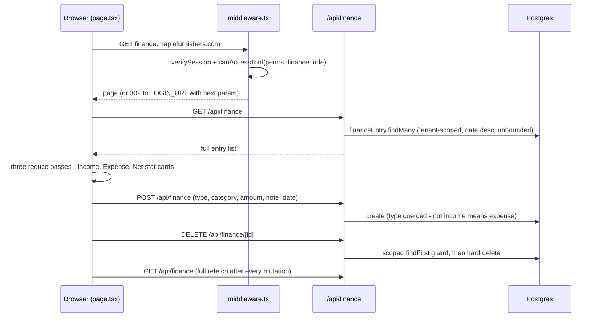
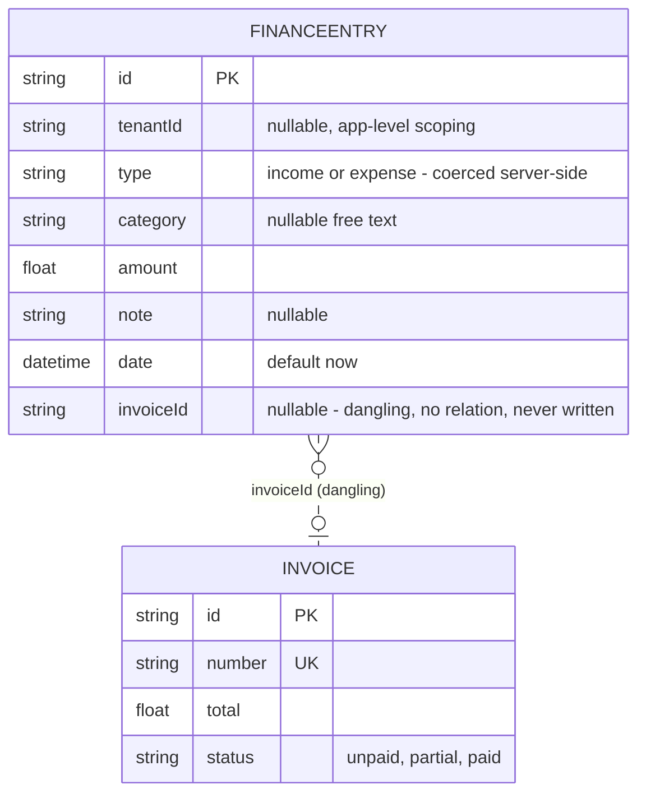
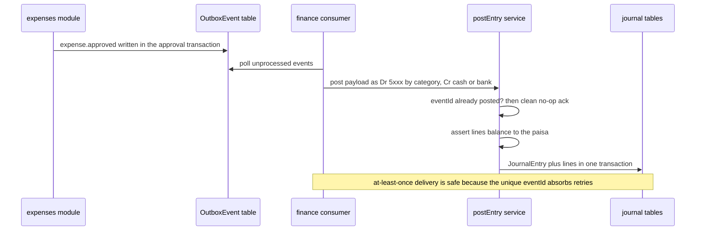
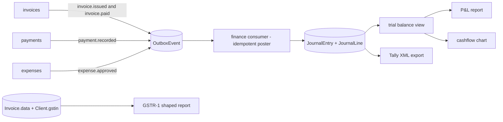
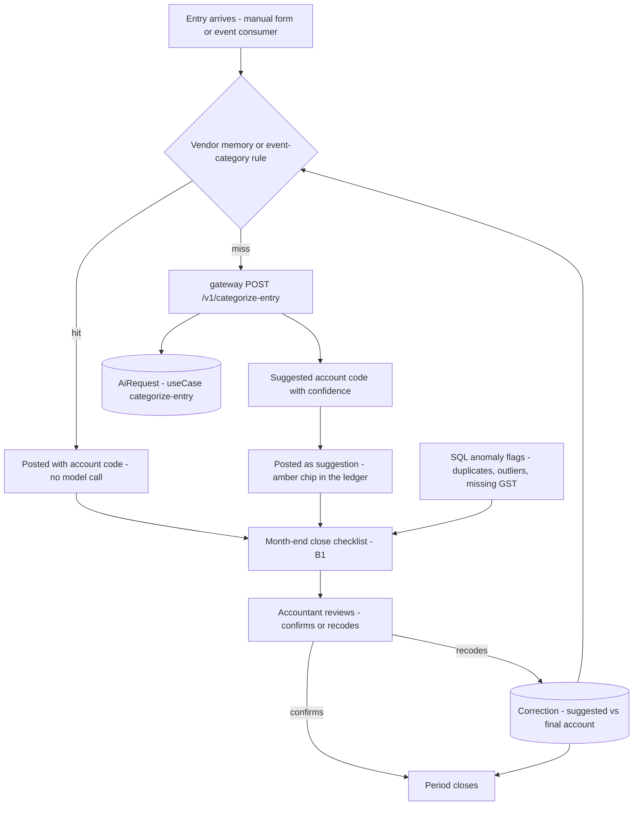

# Finance — engineering bible

Append-only income/expense ledger with a client-computed running balance — today the suite's simplest money view, designed here to grow into the suite's **system of financial record**: a lightweight double-entry core fed by events from invoices, payments and expenses, with Tally export, GST-shaped reports and P&L/cashflow dashboards.

**Status:** `apps/finance` · `finance.maplefurnishers.com` · dev `:3013` (`PORTS.local.txt`) · prod container `maple-suite:latest` with `APP=finance` (`docker-compose.yml` service `finance`).

## For managers — plain-language guide

This is the money diary: every rupee in, every rupee out, typed in by hand, with running totals at the top. When you want to know **did this month make money?**, the Income / Expense / Net cards are the answer — but only if someone has faithfully typed every transaction in, because today nothing flows in automatically. An invoice getting paid, an expense being approved in the Expenses tool — none of it lands here on its own yet. Two things to be careful of today: the same expense typed here *and* in the Expenses tool gets counted twice, and a typo can only be fixed by deleting the entry and typing it again.

| Feature | What it means in your day | Who uses it |
| --- | --- | --- |
| Record income or expense | A client pays ₹53,100 for a dining set — type it in as income with the date and a note. Bought polish for ₹4,000 — type it as expense. | Accounts, daily |
| Income / Expense / Net totals | The three cards at the top answer "did the month make money?" — across everything ever typed in (there is no month filter yet, so mentally subtract old entries or keep months clean). | Owner/manager glance |
| Add and delete only | No edit button: a wrong amount means delete the row (the × — **no "are you sure?"**) and re-type it. | Accounts |
| Not synced with Expenses tool | The same fuel bill typed in both tools = counted twice. Pick one home per expense until they're wired together. | Everyone entering money |
| Nothing arrives automatically | Paid invoices, recorded payments, approved expenses — all must be re-typed here today. | Accounts (unfortunately) |
| Double-entry ledger (planned) | Every transaction recorded twice — where money came from and where it went — so the books always balance and mistakes surface as an out-of-balance warning instead of hiding. Corrections become reversal entries (a paper trail), not silent edits. | Accounts + your accountant |
| Automatic feed from other tools (planned) | An invoice paid in Invoices or an expense approved in Expenses posts itself here — no re-typing, no double-counting, one version of the truth. | Nobody — that's the point |
| Tally export (planned) | One click produces a month file your accountant imports straight into Tally — no more reading numbers over the phone or re-keying from printouts. | Accountant, monthly |
| GST report (planned) | Sales split the way the GSTR-1 filing wants them (B2B by client GST number, B2C, HSN summary), with a list of invoices whose data needs fixing. | Accountant, monthly |
| P&L and cashflow dashboards (planned) | Profit-and-loss by month and a "cash on hand" line — the *can I make payroll this month?* view. | Owner/manager |
| Month-end close (planned) | Lock a finished month so nothing can quietly change after the accountant has seen it. | Accounts, monthly ritual |

**Signs it's working:**

- The Net card roughly tracks your bank balance movement — if they drift apart, entries are missing or doubled.
- Every expense lives in exactly one tool (this one or Expenses), never both.
- Deletions are rare — frequent delete-and-retype means amounts are being entered carelessly (there's no edit to hide it).

---

## Part A — for implementers

### A1 What exists today

Be honest about the thinness: this is one page, one model, three routes.

- **Entry ledger** — record a `FinanceEntry` with type (`income | expense`), category (free text), amount, note and date (`app/api/finance/route.ts`). The server coerces type: anything that isn't exactly `"income"` is stored as `"expense"`.
- **Totals** — Income / Expense / Net stat cards are computed **client-side** in `app/page.tsx` by reducing over the full entry list; there is no aggregation endpoint. GET returns every row ever written.
- **Append + delete only** — there is no PATCH route: entries cannot be edited, only added and hard-deleted, and the delete button (`×` per row) has no confirm dialog.
- **The dangling `invoiceId`** — `FinanceEntry.invoiceId String?` is **doubly dead**: (a) it has no `@relation` in `packages/db/prisma/schema.prisma`, so no FK, no referential integrity and no Prisma `include`; and (b) the POST handler never reads `b.invoiceId`, so nothing in the suite ever writes it. It is a stub for invoice-driven income that was never wired up. Part B1 resolves it.
- **Overlap warning** — `type = "expense"` entries duplicate the job of the dedicated Expenses module ([module-expenses.md](module-expenses.html)); the two tables are not synchronized in either direction. Money logged in both is double-counted.
- **No money flows in automatically.** Invoices being paid, payments being recorded, expenses being approved — none of it reaches this ledger. Every rupee here was typed by hand.

### A2 File-by-file and the main lifecycle

| File | Role |
| --- | --- |
| `apps/finance/app/page.tsx` | The whole UI: `"use client"` page with stat cards (`Stat` local component), add form, ledger table. All state local (`entries`, `form`, `loading`, `error`). |
| `apps/finance/app/layout.tsx` | `SuiteShell` + `getBrand()` + `getSession()` redirect to `adminUrl("/login")`; hides the tool behind the `tool.finance` Flipt flag (`ToolDisabled` when off). |
| `apps/finance/middleware.ts` | SSO gate: `verifySession(mt_session)` + `canAccessTool(perms, "finance", role)`; API paths get 401/403 JSON, pages get a 302 to `LOGIN_URL` with `?next=`. Byte-identical to the HR middleware modulo the `TOOL` constant. |
| `apps/finance/app/api/finance/route.ts` | GET (list, tenant-scoped, `date` desc; 503 with a hint when the DB is unreachable) and POST (create; type coerced, `amount: Number(b.amount) \|\| 0`, `date` defaults to now). |
| `apps/finance/app/api/finance/[id]/route.ts` | DELETE only: scoped `findFirst` guard (404 `"Not found in tenant"`), then hard `delete`. |
| `apps/finance/app/api/auth/logout/route.ts` | Clears the shared session cookie (excluded from the middleware matcher via the `api/auth` carve-out). |
| `packages/core/src/lib/tenant-db.ts` | `tenantDb()` — Prisma `$extends` that injects `tenantId` into find/count/updateMany/deleteMany and stamps it on create for the `SCOPED` model set (includes `FinanceEntry`). |

Lifecycle of a session, end to end:



Three details worth internalising before touching the code: the POST handler ignores unknown body keys (so `invoiceId` sent by a client is silently dropped, not stored); every mutation triggers a **full-table refetch** rather than a local state patch (`load()` after `add`/`remove`); and the 503 branch on GET is the only error contract — the page renders its amber banner from `j.error` and empties the table.

### A3 Data model and API surface

The dashed line is the known dangling FK described in A1.



| Method + path | Purpose | Auth gate |
| --- | --- | --- |
| GET `/api/finance` | List entries (tenant-scoped, `date` desc, unbounded) | middleware `tool:finance` |
| POST `/api/finance` | Create entry (type coerced; `invoiceId` not accepted) | middleware only — **no `act:*` check** |
| DELETE `/api/finance/[id]` | Hard delete after scoped `findFirst` guard | middleware only — **no `act:delete` check** |
| POST `/api/auth/logout` | Clear `mt_session` cookie | none needed |

There is no PATCH — a mistyped entry must be deleted and re-entered. There is no `/api/health` (true suite-wide).

### A4 Config reference

| Variable / knob | Where | Effect |
| --- | --- | --- |
| `DATABASE_URL` | `.env` | Only hard dependency; GET returns 503 with a migration hint without it |
| `AUTH_SECRET` | `.env` (shared) | Verifies the `mt_session` JWT minted by admin |
| `LOGIN_URL` | env, default `https://admin.maplefurnishers.com/login` | Unauthenticated redirect target |
| `tool.finance` | Flipt flag (`flags.ts`, `FLAGS.md`) | Off → `ToolDisabled` replaces the whole tool |
| `APP=finance` | compose environment | Selects the app inside the shared `maple-suite:latest` image |
| Port `:3013` | `PORTS.local.txt` | Dev port; `npm run -w @maple/app-finance dev -- -p 3013` |

No app-specific env, no file storage, no external services.

### A5 Recipes

- **Add an edit path (PATCH).** Create `PATCH` in `app/api/finance/[id]/route.ts` mirroring the DELETE guard: scoped `findFirst`, then `update` with the same coercions as POST. Wire an edit row-state in `page.tsx`. Until B3's journal lands, editing is acceptable; after it, corrections must be reversal entries instead (A1 of the double-entry design).
- **Add server-side totals.** New route `app/api/finance/summary/route.ts` using `(await tenantDb()).financeEntry.groupBy({ by: ["type"], _sum: { amount: true }, where: { date: { gte, lt } } })`. Replace the three client reduces; keep the client math as a fallback until the endpoint ships everywhere.
- **Enforce `act:delete`.** In the DELETE handler, decode the session (middleware already validated it) and call `can(perms, "act:delete")` from `@maple/core/lib/rbac` — per the gap list in [rbac-matrix.md](rbac-matrix.html) nothing calls `can()` today.
- **Add `/api/health`.** `GET` returning `{ ok: true }` after `prisma.$queryRaw\`SELECT 1\``; exclude it in `middleware.ts`'s matcher alongside `api/auth`. Required by the module contract in [aws-deployment.md](aws-deployment.html) §3.
- **Backfill categories.** Category is free text; before B3's chart of accounts, normalise with one SQL pass (`UPDATE "FinanceEntry" SET category = lower(trim(category))`) and add a `<datalist>` of known categories to the form.
- **CSV export (stopgap before Tally export).** `GET /api/finance/export/csv?from&to` streaming `date,type,category,amount,note` — accountants can work with this today; keep the route name distinct from the future `/export/tally` so both coexist. Gate on `act:export` (the `accounts` role already holds it per [rbac-matrix.md](rbac-matrix.html)).
- **Wire the first event consumer (skeleton).** When the outbox dispatcher exists, finance's consumer is a single internal route, `POST /api/finance/consume` (protected by an internal shared secret header, not the session): body is one `OutboxEvent`; handler switches on `type`, checks `eventId` uniqueness, posts via `postEntry()`, returns 200 (ack) or 409 (already processed — also an ack). Idempotency lives in the DB unique constraint, not in dispatcher bookkeeping.

**Testing notes (none exist — what to write first):**

1. **Unit — coercion table:** POST body permutations (`type: "Income"`, missing amount, string amount, future date) against the handler's coercions; today's behaviour (`Number(...) || 0`, everything-else-is-expense) should be pinned before B3 changes it.
2. **Unit — `postEntry()` invariants (B3.1):** unbalanced lines throw; single-line throws; cross-tenant account mix throws; duplicate `eventId` is a clean no-op. These four tests *are* the ledger's correctness story.
3. **Integration — tenant isolation:** create entries under tenant A, assert tenant B's GET/DELETE cannot see or touch them (the `tenantDb()` seam is load-bearing and untested suite-wide).

---

## Testing — how we verify this module

**Honest current state: zero tests.** `apps/finance` has no test files or runner — verified by search. A5's "Testing notes" already name the first three targets (coercion table, `postEntry()` invariants, tenant isolation); this section turns them into a checkable plan rather than repeating them.

**Unit targets:**

- **Type-coercion table (pin today, before B3 changes it).** The POST handler stores `"expense"` for anything that is not exactly `"income"` — so `"Income"` (capital I) silently becomes an expense. Assert that, plus `Number(b.amount) || 0` behaviour on missing/string/zero amounts and the `date` default.
- **`postEntry()` invariants (lands with B3.1, tests written with it).** Unbalanced lines throw; fewer than 2 lines throws; cross-tenant account mix throws; duplicate `eventId` is a clean no-op. Per A5, these four *are* the ledger's correctness story — the module's most important tests, period.
- **Trial-balance self-check.** After any sequence of valid postings, `SUM(debits) = SUM(credits)` across the view — a property test over random balanced entries.

**Integration cases — known gaps as named regressions:**

| Case name | Scenario | Asserts | Today |
| --- | --- | --- | --- |
| `finance-expenses-double-count` | Same expense entered here and in Expenses | Once D1 is wired: manual `type: "expense"` entry rejected/discouraged; ledger total counts it once | **Fails by design today** — the two tables don't know about each other |
| `income-coercion-case` | POST `type: "Income"` | Stored as income (post-fix) — pinned as expense until then | Documents current surprise |
| `tenant-isolation` | Tenant B reads/deletes tenant A's entries | 404 / empty — the `tenantDb()` seam proven | Expected pass — never proven |
| `delete-no-confirm` | × click fires DELETE immediately | UI confirm + `act:delete` enforced (post-fix) | **Fails** — hard delete, no guard |
| `consumer-idempotency` | Same `expense.approved` event delivered twice (B1) | One journal entry, second delivery acked as already-processed | Written with the consumer |

The consumer test pins the flow below — the planned double-entry posting path, drawn once so the test reads as a script of it:



**Definition of done:** the coercion table and tenant-isolation cases green in CI before the journal work starts; `postEntry()` merges only with its four invariant tests in the same PR; no Tally-export PR without a golden-file test (a fixed month of entries → byte-stable XML); month-end close ships with a posting-into-closed-period rejection test.

---

## Part B — for architects

### B1 Cross-module contracts: the real ledger

**Today's contract is "none".** Finance reads and writes only `FinanceEntry`; invoices, payments and expenses each keep their own money tables ([module-invoices.md](module-invoices.html), [module-payments.md](module-payments.html), [module-expenses.md](module-expenses.html)) and nothing reconciles them. The suite has three partially-overlapping answers to "how much money did we make?"

**The designed contract: finance is a consumer, never a source.** Finance subscribes to money events and materialises them into immutable entries. Producers stay the systems of engagement (invoices raise, payments collect, expenses spend); finance becomes the system of record. The event seam is the `OutboxEvent` pattern already specified in [event-catalog.md](event-catalog.html) — this page adds one event to that catalog:

| Event | Producer | Finance action |
| --- | --- | --- |
| `invoice.issued` | invoices | Post revenue + receivable (accrual view; optional in cash-basis mode) |
| `invoice.paid` | invoices | Close out the receivable — `{ invoiceId, paidAt, paymentIds[] }` |
| `payment.recorded` | payments | Post cash in — `{ paymentId, invoiceId?, clientId, amount, mode, receivedAt }` |
| `expense.approved` | expenses (**new** — add to the catalog) | Post cash out — `{ expenseId, category, vendor, amount, method, approvedBy, date }` |

Consumer rules, inherited from the catalog's dispatch guarantees: idempotent on `OutboxEvent.id` (a `processedEventId` unique column on the posting), at-least-once tolerant, per-aggregate ordering only. Entries created from events are **immutable**: no PATCH, no DELETE; corrections are posted as reversing entries referencing the original.

**Fixing `FinanceEntry.invoiceId` — the decision.** Two options, one recommendation:

- *Option A (minimal):* add `invoice Invoice? @relation(fields: [invoiceId], references: [id])` and have the payments flow write income entries carrying it. Cheap, but it perpetuates the single-table cash ledger and the finance/expenses double-count.
- *Option B (recommended):* **replace** `FinanceEntry` with the journal model in B3.1. `FinanceEntry` rows migrate to single-line journal entries against a `Migration suspense` account; `invoiceId` moves to `JournalEntry.sourceType/sourceId` (`"invoice"`, id), which generalises to payments and expenses too. Drop the column with the table.

Either way the column stops being dead schema; Option B also settles the Finance-vs-Expenses split (expenses keeps its capture/approval UX, finance owns the record — see [foldin-map.md](foldin-map.html) for the fold-in framing).

**Month-end close (concept).** A `FinancePeriod` row per tenant per month (`year`, `month`, `status: open | closed`, `closedBy`, `closedAt`). Posting into a closed period is rejected (consumer parks the event as `failed` for review); corrections to closed months post into the current month as dated adjusting entries. Closing runs a checklist: all pending events consumed, trial balance balanced, bank/cash accounts eyeballed against reality. This is deliberately *soft* close — no re-opening ceremony, admin can flip a period back while the company is small.

### B2 Infrastructure — both tracks

**Track 1 — one box (today, Phase 1 of [aws-deployment.md](aws-deployment.html)).** Nothing finance-specific: same `maple-suite:latest` image, `APP=finance`, Caddy terminates TLS for `finance.maplefurnishers.com`, Postgres in the neighbouring container, backups are whatever the box's `pg_dump` cron does. The event consumer in B1 runs as an in-process poller (a `setInterval` in a Node sidecar or a `docker compose` cron container hitting an internal route) — one box, no queue infrastructure.

**Track 2 — AWS (Phase 2/3).** Finance inherits the module contract wholesale: image in ECR, DB on the shared RDS instance, secrets from Secrets Manager, `/api/health` for auto-restart, CloudWatch logs. Finance-specific additions: the outbox dispatcher becomes an ECS scheduled task (or EventBridge rule → Lambda) polling `OutboxEvent` every minute — finance's consumer is idempotent so the schedule can be aggressive; Tally export files (B3.2) are generated on demand and streamed, no S3 needed; if export archiving is ever wanted, write to the shared S3 bucket under `finance/exports/{tenant}/{yyyy-mm}.xml`. RDS point-in-time recovery matters more for this module than any other — it is the one whose table you must never lose.

### B3 Designed enhancements

#### B3.1 Lightweight double-entry core

The design follows Martin Fowler's Accounting Patterns — transactions (journal entries) containing two or more immutable entries (lines) against accounts, with balance enforced at the transaction level and posting rules translating domain events into entries ([Accounting Transaction](https://martinfowler.com/eaaDev/AccountingTransaction.html), [Accounting Entry](https://martinfowler.com/eaaDev/AccountingEntry.html), and the fuller treatment in [fowler's accounting.pdf](https://martinfowler.com/apsupp/accounting.pdf)). "Lightweight" means: no multi-currency, no cost centres, no fiscal-year config — one currency (INR), one dimension (category → account), soft close.

```prisma
model Account {
  id        String  @id @default(cuid())
  tenantId  String?
  code      String            // "1100", "4000" — stable, sortable
  name      String            // "Bank — HDFC", "Sales"
  type      String            // asset | liability | equity | income | expense
  tallyLedgerName String?     // exact Tally ledger name for B3.2 export
  active    Boolean @default(true)
  lines     JournalLine[]
  @@unique([tenantId, code])
}

model JournalEntry {
  id          String   @id @default(cuid())
  tenantId    String?
  date        DateTime
  memo        String?
  sourceType  String?  // invoice | payment | expense | manual | migration
  sourceId    String?  // id in the source module
  eventId     String?  @unique  // OutboxEvent.id — idempotency key
  reversesId  String?  @unique  // set on correction entries
  createdAt   DateTime @default(now())
  lines       JournalLine[]
}

model JournalLine {
  id        String  @id @default(cuid())
  entryId   String
  entry     JournalEntry @relation(fields: [entryId], references: [id])
  accountId String
  account   Account @relation(fields: [accountId], references: [id])
  debit     Float   @default(0)   // exactly one of debit/credit is non-zero
  credit    Float   @default(0)
}
```

Invariants, enforced in the single `postEntry()` service function (the only writer): lines ≥ 2; `sum(debit) === sum(credit)` to the paisa; every line's account belongs to the same tenant; no UPDATE or DELETE on any of the three tables — reversal entries only (`reversesId` back-reference). Wrap the entry + lines + the `processedEvent` bookkeeping in one `prisma.$transaction`.

**Seeded chart of accounts** (a furniture workshop's minimum): `1000 Cash` · `1100 Bank` · `1200 Accounts receivable` · `2100 GST output payable` · `3000 Owner's equity` · `4000 Sales` · `5000 Materials` · `5100 Labour` · `5200 Transport` · `5300 Rent` · `5400 Utilities` · `5900 Misc expense` · `9999 Migration suspense`. Expense account codes map 1:1 from the Expenses module's category enum, so the posting rule is a lookup, not a judgement.

**Posting rules from events:**

| Event | Debit | Credit |
| --- | --- | --- |
| `invoice.issued` (accrual mode) | 1200 Accounts receivable (total) | 4000 Sales (taxable value) + 2100 GST output (tax) |
| `payment.recorded` | 1000/1100 by `mode` (cash → 1000, else 1100) | 1200 Accounts receivable (or 4000 directly in cash-basis mode) |
| `expense.approved` | 5xxx by category | 1000/1100 by `method` |

**Trial balance** is a view, not a table:

```sql
CREATE VIEW trial_balance AS
SELECT a."tenantId", a.code, a.name, a.type,
       SUM(l.debit) AS debits, SUM(l.credit) AS credits,
       SUM(l.debit) - SUM(l.credit) AS balance
FROM "Account" a JOIN "JournalLine" l ON l."accountId" = a.id
GROUP BY a."tenantId", a.code, a.name, a.type;
```

`SUM(debits) = SUM(credits)` across the whole view is the system's self-check; surface it as a green/red badge on the finance dashboard and as the first item of the month-end close checklist.

Worked example — a ₹53,100 invoice (₹45,000 + 18% GST) paid by bank transfer, in accrual mode:

| Event | Entry lines | Debit | Credit |
| --- | --- | --- | --- |
| `invoice.issued` INV-0042 | 1200 Accounts receivable | 53,100 | |
| | 4000 Sales | | 45,000 |
| | 2100 GST output payable | | 8,100 |
| `payment.recorded` (bank) | 1100 Bank | 53,100 | |
| | 1200 Accounts receivable | | 53,100 |

After both events: AR nets to zero, Sales shows 45,000, GST payable 8,100, Bank 53,100 — and the GSTR-1 report (B3.3) and this ledger agree by construction, because both derive from the same invoice.

Migration path from today's table: keep `FinanceEntry` read-only during a parallel-run month (journal posting live, old form disabled), reconcile the two monthly totals once, then migrate rows as single-line entries against `9999 Migration suspense` and drop the table (B1 Option B).

#### B3.2 Tally export

Maple's accountant lives in Tally; the integration is **one-way file export, not a live bridge** — generate a Tally XML file the accountant imports via *Gateway of Tally → Import Data → Vouchers*. TallyPrime's native import format is an `ENVELOPE` document: `HEADER` (`TALLYREQUEST = Import Data`) and `BODY → IMPORTDATA → REQUESTDESC` (`REPORTNAME = Vouchers`) `→ REQUESTDATA` containing one `TALLYMESSAGE` per voucher; dates are `YYYYMMDD`; each voucher carries `ALLLEDGERENTRIES.LIST` lines where the debit/credit side is expressed by `ISDEEMEDPOSITIVE` (Yes for debit) and the sign of `AMOUNT` (debits negative, credits positive), and every voucher must balance — see the official [XML integration](https://help.tallysolutions.com/xml-integration/) and [sample XML](https://help.tallysolutions.com/sample-xml/) references and the community-documented [voucher request formats](https://documenter.getpostman.com/view/13855108/TzeRpAMt).

The shape the export must produce (one receipt voucher, abridged to the load-bearing tags):

```xml
<ENVELOPE>
 <HEADER><TALLYREQUEST>Import Data</TALLYREQUEST></HEADER>
 <BODY><IMPORTDATA>
  <REQUESTDESC><REPORTNAME>Vouchers</REPORTNAME></REQUESTDESC>
  <REQUESTDATA>
   <TALLYMESSAGE>
    <VOUCHER VCHTYPE="Receipt" ACTION="Create">
     <DATE>20260412</DATE>
     <VOUCHERTYPENAME>Receipt</VOUCHERTYPENAME>
     <NARRATION>INV-0042 balance - entry cku1x…</NARRATION>
     <ALLLEDGERENTRIES.LIST>
      <LEDGERNAME>HDFC Bank</LEDGERNAME>
      <ISDEEMEDPOSITIVE>Yes</ISDEEMEDPOSITIVE>
      <AMOUNT>-45000.00</AMOUNT>
     </ALLLEDGERENTRIES.LIST>
     <ALLLEDGERENTRIES.LIST>
      <LEDGERNAME>Sundry Debtors</LEDGERNAME>
      <ISDEEMEDPOSITIVE>No</ISDEEMEDPOSITIVE>
      <AMOUNT>45000.00</AMOUNT>
     </ALLLEDGERENTRIES.LIST>
    </VOUCHER>
   </TALLYMESSAGE>
  </REQUESTDATA>
 </IMPORTDATA></BODY>
</ENVELOPE>
```

Design:

- `GET /api/finance/export/tally?from=2026-04-01&to=2026-04-30` → `Content-Type: application/xml`, filename `tally-vouchers-2026-04.xml`. Admin/accounts roles only (`act:export` — the first real `can()` call in the suite).
- Voucher mapping: each `JournalEntry` → one `VOUCHER` with `VOUCHERTYPENAME` = `Journal` (default), `Receipt` for entries whose debit side is 1000/1100, `Payment` for entries whose credit side is; `DATE` from `entry.date`; `NARRATION` from memo + source reference (`INV-0042`).
- Ledger-name mapping: `Account.tallyLedgerName` (schema above) must exactly match a ledger existing in the accountant's Tally company — Tally rejects vouchers naming unknown ledgers. Ship a companion *Masters* export (same envelope, `REPORTNAME = All Masters`, one `LEDGER` per account with a parent group) the accountant imports once, and a settings screen where each account's Tally name can be corrected.
- Idempotency on the accountant's side: include the entry id in `NARRATION`; document that re-importing a period duplicates vouchers (Tally has no upsert) — the workflow is "export a closed month exactly once", which is what B1's month-end close guarantees.

#### B3.3 GST reports (GSTR-1-shaped data)

Goal: not e-filing, but a report whose numbers drop into the accountant's GSTR-1 working sheet. GSTR-1 wants outward supplies split B2B (invoice-level, GSTIN-wise) and B2C, plus an HSN-wise summary in Table 12 — which since the May 2025 return period must itself be bifurcated into B2B and B2C parts ([ClearTax overview](https://cleartax.in/s/details-mentioned-return-gstr-1), [Tally on the Table 12 change](https://tallysolutions.com/gst/b2b-and-b2c-breakup-for-hsn-summary-report-in-gstr-1/)). HSN digit rules: minimum 4 digits below ₹5 crore turnover, 6 above.

The suite already has the raw ingredients: `Invoice.data` (JSON line items), `Invoice.total`, `Client.gstin` and `Client.type` (`b2b | b2c`). What's missing and must be added to the invoices module's line-item shape: per-line `hsn`, `gstRate`, and `taxableValue` (today the JSON is free-form — see [module-invoices.md](module-invoices.html)). Design: `GET /api/finance/reports/gstr1?month=2026-04` returns:

```jsonc
{
  "month": "2026-04",
  "b2b": [ // one row per invoice to a GSTIN-holding client
    { "gstin": "07AAACS1234F1Z5", "clientName": "Studio A", "invoiceNumber": "INV-0042",
      "date": "2026-04-12", "invoiceValue": 53100.0,
      "rates": [ { "rate": 18, "taxableValue": 45000.0, "igst": 0, "cgst": 4050.0, "sgst": 4050.0 } ] }
  ],
  "b2c": [ // rate-wise aggregate of everything else
    { "rate": 18, "taxableValue": 210000.0, "cgst": 18900.0, "sgst": 18900.0 }
  ],
  "hsn": [ // Table 12 shape, B2B/B2C bifurcated per the May 2025 rule
    { "hsn": "9403", "uqc": "NOS", "split": "b2b", "qty": 6, "taxableValue": 45000.0, "tax": 8100.0 }
  ],
  "issues": [ // data-quality feedback loop back to the invoices module
    { "invoiceNumber": "INV-0044", "problem": "b2b client without GSTIN" },
    { "invoiceNumber": "INV-0045", "problem": "2 line items missing HSN" }
  ]
}
```

Rendered as tables with a CSV download per section. Intra- vs inter-state (CGST/SGST vs IGST) is inferred from the client's GSTIN state code (first two digits) against the tenant's own GSTIN — another field the `Tenant` model needs. Invoices with missing data land in `issues[]` instead of silently mis-bucketing.

#### B3.4 P&L and cashflow dashboards

Once B3.1 exists both statements are queries, not features:

- **P&L** — `GET /api/finance/reports/pnl?from&to`: trial-balance view filtered to `type IN (income, expense)` grouped by account, income minus expense = net profit. Monthly columns via `date_trunc('month', e.date)`. Before B3.1 lands, a degraded version can run on `FinanceEntry` (`groupBy type, category`) — ship that first as the A5 summary endpoint, keep the response shape identical so the UI survives the migration.
- **Cashflow (direct method)** — same query restricted to lines touching accounts 1000/1100: inflows = debits, outflows = credits, running balance = cumulative sum ordered by date. This is the "can I make payroll" view; render as a line chart plus a "cash on hand" stat card.
- Dashboard page (`/dashboard` route in the app): the two charts, the trial-balance badge, top-5 expense categories this month, and unconsumed-event count (the health of the B1 pipeline).

Designed API surface once B3 is complete (all inside the existing middleware gate; write paths additionally checked with `can()`):

| Method + path | Purpose | Extra guard |
| --- | --- | --- |
| GET `/api/finance/summary?from&to` | Grouped totals (degraded P&L pre-journal) | — |
| GET `/api/finance/accounts` · POST · PATCH | Chart of accounts CRUD (no delete — `active: false`) | `act:manage_accounts` (new) |
| POST `/api/finance/entries` | Manual journal entry via `postEntry()` | `act:post_entry` (new) |
| POST `/api/finance/entries/[id]/reverse` | Correction posting (`reversesId`) | `act:post_entry` |
| POST `/api/finance/periods/[month]/close` · `/reopen` | Month-end close (B1) | admin only |
| GET `/api/finance/export/tally?from&to` | Tally XML vouchers (B3.2) | `act:export` |
| GET `/api/finance/export/tally-masters` | One-time ledger masters XML | `act:export` |
| GET `/api/finance/reports/gstr1?month` | GSTR-1-shaped report (B3.3) | `act:export` |
| GET `/api/finance/reports/pnl?from&to` · `/cashflow` | Statements (B3.4) | — |
| POST `/api/finance/consume` | Outbox event intake (internal) | shared-secret header, not session |
| GET `/api/health` | Liveness + `SELECT 1` | none (matcher carve-out) |



### B4 Scaling

Volumes make this easy: a busy furniture workshop posts tens of entries a day — thousands of journal lines a year. The real risks are payload and correctness, not throughput. Priorities in order: (1) stop shipping the full table to the client (A5 summary endpoint + paginate the ledger with `?cursor=`); (2) index `JournalEntry(tenantId, date)` and `JournalLine(accountId)` — the trial-balance view stays a live aggregate for years at this volume, and only if a tenant somehow reaches millions of lines does a materialised monthly-balances table become worth it; (3) the event consumer at 1-minute polling clears any realistic backlog instantly — never introduce a queue broker for this. Multi-tenant scaling is by the existing `tenantDb()` row scoping; the chart of accounts is seeded per tenant so tenants can diverge.

## AI — use case & pipeline

**Use case: auto-categorization to the chart of accounts, plus month-end anomaly flags.** Once B3.1's journal lands, every entry needs an account code, and the month-end close (B1) needs a reviewer who can spot what's wrong before the accountant signs. The design is rules-first, model-second, accountant-always: deterministic rules handle the bulk, the model only sees novel free-text descriptions, and nothing posts as *confirmed* without a human at the close checklist. The rules tier, concretely:

- **Vendor memory** — a vendor string this tenant has already mapped posts to the same `5xxx` account: one SQL lookup, no model call. Every accountant confirmation adds a pair, so the model-call rate falls month on month.
- **Event-sourced entries carry their category** — `expense.approved` arrives with the fixed category enum, and the B3.1 posting-rules table is a lookup, not a judgement. Most journal lines never need AI at all.
- **Anomaly flags are pure SQL** — duplicates (same amount + vendor within a 3-day window), outliers (amount > 3× the category's trailing p95), missing GST (income entries without a GST split once the B3.3 fields exist), and the trial-balance self-check B3.1 already defines. No model, ₹0, fully explainable — which is what an accountant demands of an anomaly flag.

The model's one job: `description/vendor → account code` from the **closed** seeded chart, for manual entries the rules can't place.



| Contract | Detail |
| --- | --- |
| Endpoint | `POST {gateway}/v1/categorize-entry` |
| Input | `{description, vendor, amountPaise, method}` + the tenant's chart `[{code, name, type}]` — the B3.1 seed, ~13 accounts |
| `json_schema` (structured output, `additionalProperties: false`) | `{ accountCode: <enum of the tenant's codes>, confidence: "high" \| "medium" \| "low", reason }` — the enum lives *in the schema*, so an off-chart answer is structurally impossible |
| Model + routing | `haiku-4.5` — closed-set classification, the cheapest task shape there is; no escalation route needed |
| ₹/call | ≈ ₹0.1–0.3, and only on vendor-memory misses — effective monthly spend trends toward zero as memory fills (anchor: ₹8–10/page on fable-5, [ai-layer.md](ai-layer.html)) |
| er-platform tables | `AiRequest`, `Correction` (recodes — description→code pairs are ideal fine-tune food for `Dataset`), `AiBudget`, `ModelRoute` |

**Rollout & eval gate.** Suggestions never auto-post as confirmed — a mis-coded ledger lies to the P&L, the GSTR-1 report and the Tally export simultaneously, so the amber-chip-until-close discipline is non-negotiable. Eval set: replay three months of hand-categorized `FinanceEntry` rows (free-text `category` mapped to nearest account); gate ≥ 92% agreement on the model-call subset before enabling per tenant, re-run on every `promptVersion` bump. The anomaly flags need no gate — they are deterministic SQL and ship with the close checklist itself. **Not before:** the B3.1 journal and seeded chart exist (categorizing into today's free-text `category` column trains nothing and posts nowhere), and honestly not before the event consumers run — once invoices, payments and expenses post via events, most lines arrive pre-categorized, and the model only ever sees the shrinking manual remainder. If that remainder is a handful of rows a month, vendor memory plus a `<datalist>` (A5) may be the correct final state.

### B5 Status — done, left, decisions

**Done ✓**

- Income/expense ledger with dated entries, server-side type coercion, Income/Expense/Net rollup in the UI, tenant scoping, per-row ownership guard before delete.

**Left ◻**

- **`FinanceEntry.invoiceId` relation fix** — resolved by decision D2 below; until executed it remains dead schema.
- Finance-vs-Expenses split (D1) — double-counting risk is live today.
- Edit endpoint (PATCH) + delete confirm; `act:delete` enforcement per [rbac-matrix.md](rbac-matrix.html).
- Server-side aggregation / date filtering (A5) — full-table GET grows unbounded.
- No `/api/health`; no tests.
- Part B build-out: journal core → event consumer → close → Tally export → GSTR-1 report → dashboards (that order; each step is useful alone).

**Decisions**

| # | Decision | Direction |
| --- | --- | --- |
| D1 | Finance vs Expenses overlap | Expenses keeps capture + approval UX; finance owns the record via `expense.approved` events. Stop logging expenses in finance manually once wired. |
| D2 | `invoiceId`: relate or replace | Replace — `FinanceEntry` migrates into `JournalEntry.sourceType/sourceId` (B1 Option B). Option A only if double-entry is deferred past 2026. |
| D3 | Cash vs accrual | Start cash-basis (post on `payment.recorded` / `expense.approved` only); flip on `invoice.issued` posting per tenant when the accountant asks for accrual. |
| D4 | Tally integration depth | File export only. No live ODBC/HTTP bridge to Tally — the accountant's Tally is not a server we can reach. |
