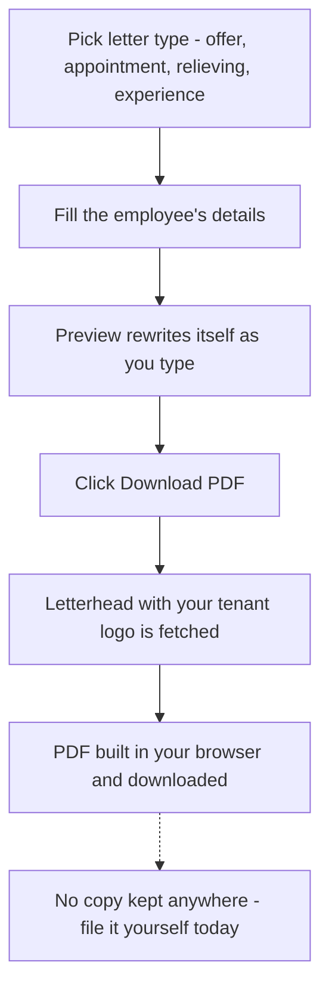
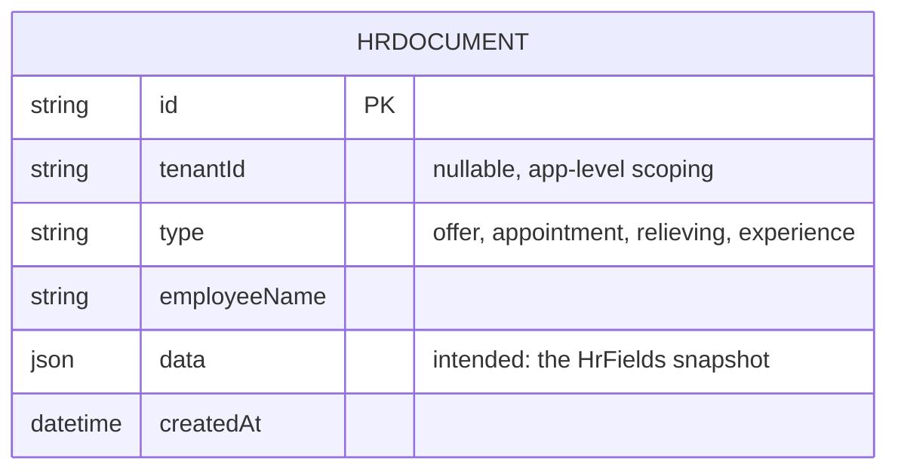
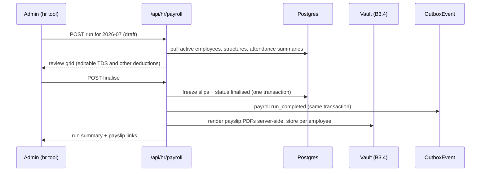
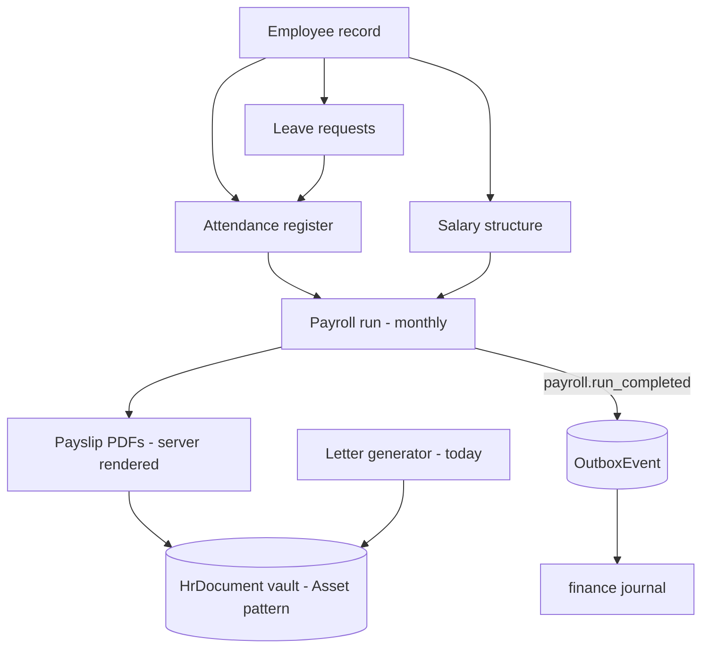
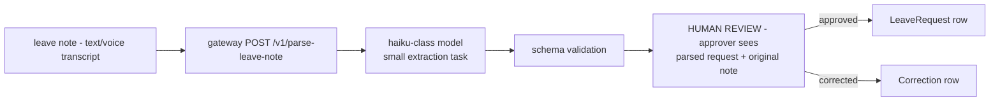

# HR — engineering bible

Today: a branded letter generator — the four standard HR letters (offer, appointment, relieving, experience) rendered as PDFs entirely in the browser, persisting nothing. Designed here to become the **people module a small workshop actually needs**: an employee anchor record, simple attendance, leave with approval, payroll-lite with statutory awareness (PF/ESI/TDS), and a staff documents vault that finally gives the schema-only `HrDocument` model a job.

**Status:** `apps/hr` · `hr.maplefurnishers.com` · dev `:3015` (`PORTS.local.txt`) · prod container `maple-suite:latest` with `APP=hr` behind Caddy (`hr.maplefurnishers.com → hr:3000`).

## For managers — plain-language guide

Today this tool does one job well: it types your HR letters for you. Pick the letter (offer, appointment, relieving, experience), fill in the person's details, watch the letter write itself on screen, download the PDF on your letterhead. The one thing every manager must know: **the tool keeps no copy.** Once the PDF downloads, there is no record here of what you issued or when — if a relieving-letter dispute comes up next year, your only proof is whatever you saved or printed yourself. Everything else a people-tool should do — staff records, attendance, leave, payslips — is designed and marked (planned) below.

| Feature | What it means in your day | Who uses it |
| --- | --- | --- |
| Four standard letters | A new carpenter joins — pick *offer* or *appointment*, fill name, designation, salary, date; the wording is standard and consistent every time. Relieving/experience letters swap salary for last working date. | Admin/HR person, as staff join and leave |
| Live preview | The letter re-writes itself on screen as you type — what you see is what downloads. | Same person |
| Your letterhead on the PDF | The downloaded letter carries your company logo automatically (white-label tenants get theirs). | Automatic |
| Nothing is saved | No history, no archive — download it and file it yourself, today. | Everyone should know this |
| Preview shows the wrong brand (known issue) | On white-label tenants the on-screen preview still says "MAPLE FURNISHERS" even though the PDF comes out right — trust the PDF. | White-label tenants |
| Letter history (planned) | Every issued letter saved automatically — "what did we give Rakesh, and when?" becomes a lookup, and any old letter can be regenerated identically. | Admin/HR |
| Staff records (planned) | One card per person — name, designation, phone, joining date — so you stop re-typing "Rakesh" into every letter. | Admin/HR |
| Attendance register (planned) | A supervisor's grid, staff × days: tap to cycle present / half-day / absent. Feeds payable days straight into payroll. | Floor supervisor, daily |
| Leave with approval (planned) | A worker asks for two days — request goes in, you approve or decline, approved days land in the register automatically. Balances count themselves. | Staff request, owner/HR approve |
| Payroll-lite (planned) | Once a month: the tool pulls each person's salary and attendance, prorates for days worked, computes PF/ESI when registration applies (zero until then), and **generates a payslip PDF per person** on your letterhead — archived, not just downloaded. | Owner/accounts, monthly |
| Documents vault (planned) | ID proofs, contracts, issued letters, payslips — one chronological folder per person; the exit-day "give me everything we hold on them" answer. | Admin/HR |

**Signs it's working:**

- Letters go out on the correct letterhead with consistent wording — no more editing last year's Word file.
- (Once history lands) every letter you physically handed over has a matching row here, same date.
- (Once payroll lands) the run finishes before payday with zero hand-computed slips, and last month's payslips re-open byte-identical.



---

## Part A — for implementers

### A1 What exists today

The honest inventory: **this app persists nothing.** No table is written, no letter is remembered.

- One screen (`app/page.tsx`, a client component): pick a letter type, fill the employee fields, watch a live preview re-render per keystroke, click **Download PDF**.
- Letter copy is templated in `@maple/core/lib/hr.ts` (`HrDocType`, `HrFields`, `hrBody()`, `hrSubject()`, `HR_DOC_LABELS`, `emptyHr()`). Relieving/experience letters swap the salary field for a last-working-date field (`showLast` in the page).
- The PDF renders **client-side** with `@react-pdf/renderer` (`app/hr-pdf.tsx` → `HrDocPdf`), downloaded as a blob named `Offer-Letter-<Name>.pdf`. Before rendering, the page fetches the tenant logo from `/api/brand` (which calls `getBrand()` from `@maple/core/lib/brand.ts`) so white-label tenants get their own letterhead — with `MAPLE_LOGO_B64` as fallback.
- **`HrDocument` is schema-only** — the model exists in `packages/db/prisma/schema.prisma` (`type`, `employeeName`, `data Json`, `createdAt`), is registered in `tenant-db.ts`'s `SCOPED` set and in the seed backfill list, but **the app never writes it**. Persistence is wired and waiting; only the write path and a history screen are missing.
- Fully SSO-protected: `middleware.ts` (`verifySession` + `canAccessTool(perms, "hr", role)`, redirect to `LOGIN_URL?next=`); `app/layout.tsx` additionally redirects on no session and hides the tool behind the `tool.hr` Flipt flag.
- **Preview/PDF divergence** — the on-screen preview hard-codes the "MAPLE FURNISHERS" header and "For Maple Furnishers," sign-off while the PDF uses the tenant logo; white-label tenants see the wrong brand in the preview. The PDF header block also hard-codes the Kirti Nagar address and `contact@maplefurnishers.com`.
- **External font dependency** — `hr-pdf.tsx` registers Roboto from `cdnjs.cloudflare.com` at render time; PDF generation silently depends on a third-party CDN being reachable from the user's browser.

### A2 File-by-file and the main lifecycle

| File | Role |
| --- | --- |
| `apps/hr/app/page.tsx` | Form + preview page. Local state: `type` (pill buttons), `f: HrFields`, `busy`. `hrBody(type, f)` memo drives the preview; `download()` fetches brand, renders `HrDocPdf` to blob, triggers an `<a download>` click. |
| `apps/hr/app/hr-pdf.tsx` | `@react-pdf/renderer` document: A4, Roboto (CDN-registered), maroon header rule (`#702119`), logo + brand row, `Ref: MF/HR/<year>` + issue date meta, subject, body paragraphs, signature block, fixed footer. Takes `logo?: string`. |
| `apps/hr/app/layout.tsx` | `SuiteShell`, `getBrand()`, session redirect, `tool.hr` flag → `ToolDisabled`. |
| `apps/hr/middleware.ts` | SSO gate, identical to finance/expenses modulo `TOOL = "hr"`. |
| `apps/hr/app/api/brand/route.ts` | Returns the tenant brand (`name`, `logoUrl`, `primaryColor`) for the letterhead. |
| `apps/hr/app/api/auth/logout/route.ts` | Clears the shared session cookie. |
| `packages/core/src/lib/hr.ts` | The letter templates — shared so preview and PDF render identical copy. The only tested-adjacent logic in the module. |

Lifecycle: middleware gate → shell → mount with `emptyHr()` (issue date defaulted to today, place "New Delhi", title "Director") → user picks type + fills fields → preview re-renders from `hrBody` → **Download** → `GET /api/brand` → `pdf(<HrDocPdf/>).toBlob()` in the browser → blob download → **nothing is saved anywhere**.

### A3 Data model and API surface



The model above has **zero writers** in the codebase — it is the archive the app was meant to keep.

| Route | Method | Auth | Notes |
| --- | --- | --- | --- |
| `/api/brand` | GET | Session + `tool:hr` (middleware matcher covers it) | Tenant brand for the PDF letterhead |
| `/api/auth/logout` | POST | None (matcher carve-out) | Clears the shared cookie |

No document CRUD exists — nothing to list, save, or re-download.

### A4 Config reference

| Variable / knob | Where | Effect |
| --- | --- | --- |
| `DATABASE_URL` | `.env` | Used only by `getBrand()`/session — the app itself stores nothing |
| `AUTH_SECRET` | `.env` (shared) | Session JWT verification |
| `LOGIN_URL` | env, default admin login | Anonymous redirect target |
| `tool.hr` | Flipt flag | Off → `ToolDisabled` |
| `APP=hr` | compose environment | App selector in the shared image |
| Port `:3015` | `PORTS.local.txt` | Dev: `npm run dev -w @maple/app-hr`; or `bash scripts/dev.sh` for the whole suite |

Gotcha: `@react-pdf/renderer` ships to the client — watch bundle size as the tool grows; server-side rendering of PDFs (B3.3) is also the fix for that.

### A5 Recipes

- **Persist issued letters (closes the top gap).** On `download()` success, `POST /api/hr/documents` with `{ type, employeeName: f.employeeName, data: f }` → `tenantDb().hrDocument.create(...)`. Add `GET /api/hr/documents` (list, `createdAt` desc) and a "History" panel that re-opens a row into the form (`setF(row.data)`) — regeneration is free because rendering is deterministic from `HrFields`. The model, scoping, and seed backfill already exist; this is an afternoon.
- **Fix the preview brand.** Pass the layout's `getBrand()` result into the page (server → client prop) and render `brand.name`/logo in the preview header and sign-off instead of the hard-coded strings.
- **Self-host the PDF fonts.** Move the three Roboto TTFs into `apps/hr/public/fonts/` and register from same-origin URLs — removes the cdnjs dependency and works offline.
- **Add a letter type.** Extend `HrDocType` union + `HR_DOC_LABELS` + a branch in `hrBody()` in `@maple/core/lib/hr.ts`; the page's `TYPES` array and PDF pick it up. Keep copy in core so preview/PDF can't diverge.
- **Add `/api/health`** — same recipe as every suite app.

**Testing notes (none exist — what to write first):**

1. **Unit — `hrBody()` copy:** snapshot the four letter types with filled and empty fields (the `____________` placeholders are part of the contract — accountants print half-filled letters deliberately). This lives in `packages/core` beside `utils.test.ts`.
2. **Unit — filename sanitisation:** `download()` builds the filename from user input (`employeeName`); pin the space-replacement behaviour and add a test for slash/dot injection before persistence (A5 recipe) turns names into storage keys.
3. **Integration (once B3 lands) — tenant isolation on the vault:** documents for tenant A's employees must 404 for tenant B; presigned URLs must not be forgeable across tenants. HR is where an isolation bug does the most damage — these tests go in first, not last.

---

## Testing — how we verify this module

**Honest current state: zero tests.** `apps/hr` has no test files or runner — verified by search; `packages/core/lib/hr.ts` (the letter templates, the module's only real logic) is equally uncovered. A5's "Testing notes" name the first three targets; this section sequences them and adds the regression cases.

**Unit targets:**

- **`hrBody()` copy snapshots** — the four letter types × {filled fields, empty fields}. The `____________` placeholders are contractual (half-filled letters are printed deliberately); a snapshot diff is exactly the right tool because any wording change should be a reviewed decision. Lives in `packages/core` beside `utils.test.ts`.
- **Filename sanitisation** — `download()` derives the filename from `employeeName`; pin the space-replacement and add slash/dot/backslash injection cases *before* the A5 persistence recipe turns names into storage keys.
- **Payroll math (written with B3.3, red-green against the worked example).** The B3.3 table is the fixture: ₹18,000 structure, 26/27 days → gross ₹17,333, PF ₹1,387, ESI ₹130, net ₹15,816 — plus the flags-off variant asserting identical shape with zero statutory lines, and the ESI eligibility edge at gross exactly ₹21,000.

**Integration cases — known gaps as named regressions:**

| Case name | Scenario | Asserts | Today |
| --- | --- | --- | --- |
| `preview-brand-divergence` | White-label tenant opens the letter page | Preview header/sign-off show the tenant brand, matching the PDF | **Fails** — "MAPLE FURNISHERS" hard-coded in the preview |
| `pdf-font-offline` | cdnjs unreachable from the browser | PDF still renders (self-hosted fonts) | **Fails** — Roboto registered from cdnjs at render time |
| `letters-not-persisted` | Download a letter, list documents | A `HrDocument` row exists with the field snapshot | **Fails** — zero writers today; flips green with the A5 recipe |
| `vault-tenant-isolation` (B3.4) | Tenant B requests tenant A's employee document | 404; presigned URLs not forgeable across tenants | Written with the vault — **first**, not last: HR is where an isolation bug does the most damage |
| `payroll-immutability` (B3.3) | PATCH a finalised run or its slips | Rejected; corrections only via next month's adjustment | Written with payroll |
| `leave-writes-attendance` (B3.2) | Approve a 2-day leave | Both dates upserted as `status: "leave"`, exactly once on double-click | Written with leave |

**Definition of done:** the `hrBody()` snapshots and filename tests exist before the persistence recipe merges (persistence is what makes both load-bearing); every B3 feature PR carries its own state-machine and isolation tests in the same PR; payroll-lite merges only when the worked example passes as a fixture and a finalised run proves immutable; no payslip PDF change without a re-render determinism check (same inputs → same bytes).

---

## Part B — for architects

### B1 Cross-module contract: what HR actually needs at this company size

Maple Furnishers is a workshop-plus-studio of roughly a dozen people — carpenters, polishers, a driver, sales, accounts. Designing "an HRMS" for that is malpractice; the needs are concrete and small:

1. **A person record.** Today the suite has no employee entity at all — `User` (login accounts for tool users) is not it: carpenters don't log in. Everything in B3 hangs off a new `Employee` model (B3.0). `User.employeeId String?` links the few people who are both.
2. **Letters that are remembered** (A5 recipe — the archive is a legal need: relieving-letter disputes are resolved by "what did we issue and when").
3. **Attendance** good enough to compute payable days — not biometrics.
4. **Leave** with a single approver — mirroring the expenses approval shape ([module-expenses.md](module-expenses.html) B1), same status vocabulary, same RBAC pattern (`act:approve_leave`).
5. **A monthly payroll run** that produces payslips and knows *when statutory rules would start to apply* — see B3.3: at this headcount PF/ESI registration is likely not yet mandatory, but the design must not paint us into a corner at 10 and 20 employees.
6. **Documents per person** — ID proofs, contracts, issued letters — in one vault (B3.4).

Cross-module touchpoints are deliberately few: payroll posts **one summary event per run** (`payroll.run_completed { runId, month, totalGross, totalDeductions, totalNet }`) to the outbox for finance to journal (Dr `5100 Labour` / Cr bank — [module-finance.md](module-finance.html) B3.1); salary *advances* can be modelled later as expenses with category `labour`; and HR emits nothing else. HR data is the most sensitive in the suite — `tool:hr` is already the narrowest grant in [rbac-matrix.md](rbac-matrix.html) (admin + hr roles only), and every new route below stays inside it.

### B2 Infrastructure — both tracks

**Track 1 — one box.** Runtime unchanged (shared image, `APP=hr`). Two additions when B3 lands: document files (B3.4) on a bind-mounted volume (`/data/hr/{tenant}/{employeeId}/...`) served only through an authenticated route — HR files must never be Caddy-static; and payslip PDF generation moves server-side (B3.3), which on one box just means `@react-pdf/renderer` running in the Node process (it renders in Node as happily as in the browser — same library, no new dependency).

**Track 2 — AWS.** Module contract as usual (ECR, RDS, Secrets Manager, `/api/health`, CloudWatch). Documents to the shared S3 bucket under `hr/{tenant}/{employeeId}/` with presigned-URL access and **S3 Object Lock is worth considering for statutory documents** (write-once retention). Payroll runs are monthly and tiny — no queue, no worker; the run executes inside one request with a generous route `maxDuration`. Backups: HR rows ride the RDS point-in-time recovery like everything else, but the S3 vault prefix should be included in any cross-region replication before a real client tenant uses HR.

### B3 Designed enhancements

#### B3.0 The `Employee` anchor (prerequisite for everything below)

```prisma
model Employee {
  id          String   @id @default(cuid())
  tenantId    String?
  name        String
  designation String?
  phone       String?
  joiningDate DateTime?
  exitDate    DateTime?
  status      String   @default("active") // active | exited
  userId      String?  @unique            // link to a login account, if any
  createdAt   DateTime @default(now())
  updatedAt   DateTime @updatedAt
}
```

Retrofit: `HrDocument.employeeId String?` (keep `employeeName` for pre-existing rows), and the letter form gains an employee picker that pre-fills name/designation/joining date — typing "Rakesh" for the fourth time is the current UX.

#### B3.1 Attendance (simple check-in)

Design goal: payable-days input, one tap. `Attendance { id, tenantId, employeeId, date @db.Date, status "present | half | absent | leave | holiday", inAt DateTime?, outAt DateTime?, markedById, @@unique([tenantId, employeeId, date]) }`. Two capture modes, both writing the same row: **self check-in** (`POST /api/hr/attendance/checkin` — for employees who have a `User` login, stamps `inAt`, upserts today's row to `present`) and **register mode** (the realistic one for the workshop floor: a supervisor's grid — employees × days of month — where a tap cycles present → half → absent; bulk `PUT /api/hr/attendance?month=`). Monthly summary endpoint returns per-employee counts feeding straight into payroll (B3.3). The `@@unique` makes every write an idempotent upsert; timezone rule from expenses applies — "today" is computed in `Asia/Kolkata`, never the server TZ. Deliberately excluded: geo-fencing, selfie verification, biometric devices — revisit only if a second site opens.

#### B3.2 Leave management

```prisma
model LeavePolicy {
  id       String @id @default(cuid())
  tenantId String?
  type     String   // casual | sick | earned
  daysPerYear Float
  @@unique([tenantId, type])
}
model LeaveRequest {
  id         String   @id @default(cuid())
  tenantId   String?
  employeeId String
  type       String
  from       DateTime @db.Date
  to         DateTime @db.Date
  days       Float    // supports 0.5
  reason     String?
  status     String   @default("submitted") // submitted | approved | rejected | cancelled
  approvedById String?
  approvedAt DateTime?
  rejectReason String?
  createdAt  DateTime @default(now())
}
```

Approval mirrors expenses exactly: single approver holding `act:approve_leave` (new `ACTIONS` key; seeded to admin, grantable to the `hr` role), no self-approval, transitions via `POST /api/hr/leave/[id]/{approve,reject}`. Balance = `policy.daysPerYear − sum(approved days this calendar year)`, computed live (no balance table to drift). On approval, the covered dates are upserted into `Attendance` as `status = "leave"` — one source of truth for payable days. UI: a request form + an approvals tab on the same page, plus balance chips per employee. No carry-forward/encashment rules in v1 — policy footnote, not code.

#### B3.3 Payroll-lite

**Scope: fixed monthly salaries, attendance-prorated, payslip PDFs, statutory-aware.** Not: increments workflow, arrears, loans, full income-tax computation.

```prisma
model SalaryStructure {
  id         String  @id @default(cuid())
  tenantId   String?
  employeeId String  @unique
  basic      Float           // PF wage base
  hra        Float @default(0)
  allowances Float @default(0)
  effectiveFrom DateTime
}
model PayrollRun {
  id       String  @id @default(cuid())
  tenantId String?
  month    String            // "2026-07"
  status   String  @default("draft") // draft | finalised
  finalisedById String?
  createdAt DateTime @default(now())
  slips    Payslip[]
  @@unique([tenantId, month])
}
model Payslip {
  id         String @id @default(cuid())
  runId      String
  run        PayrollRun @relation(fields: [runId], references: [id])
  employeeId String
  payableDays Float
  gross      Float
  pfEmployee Float @default(0)
  esiEmployee Float @default(0)
  tds        Float @default(0)
  otherDeductions Float @default(0)
  net        Float
  data       Json   // full component breakdown snapshot
}
```

Run flow: create draft run for a month → engine pulls each active employee's structure + attendance summary → `gross = structure × payableDays / monthDays` → deductions per the statutory config → review grid (editable TDS/other) → **finalise** (immutable; emits `payroll.run_completed` to the outbox) → payslip PDFs. PDF generation reuses the exact stack the module already owns — `@react-pdf/renderer` with the `hr-pdf.tsx` letterhead pattern (logo via `getBrand()`, maroon rule, footer) — rendered **server-side** in the run-finalise route and stored in the vault (B3.4), so payslips are archived, not just downloaded.

Worked example — a polisher on ₹18,000/month (basic ₹12,000 + HRA ₹4,000 + allowances ₹2,000), 26 payable days of 27 working days in July, tenant flags `pfRegistered: true`, `esiRegistered: true`:

| Component | Computation | Amount |
| --- | --- | --- |
| Gross (prorated) | 18,000 × 26 / 27 | ₹17,333 |
| PF — employee | 12% of prorated basic (11,556; under the ceiling) | −₹1,387 |
| ESI — employee | 0.75% of gross (gross ≤ ₹21,000 so covered) | −₹130 |
| TDS | accountant-entered (below slab here) | −₹0 |
| **Net pay** | | **₹15,816** |
| Employer PF (8.33% EPS + 3.67% EPF) | not deducted — a cost line on the run summary | ₹1,387 |
| Employer ESI (3.25% of gross) | not deducted — cost line | ₹563 |

With the registration flags false (today's likely reality below both headcount thresholds), the same slip computes gross → net with zero statutory lines but identical structure — flipping the flags changes numbers, never shape.



**Statutory notes (the payslip fields exist even while contributions are zero):**

- **EPF** — applies to establishments with **20+ employees**; employee 12% of PF wages, employer 12% (split 8.33% EPS / 3.67% EPF), with the long-standing wage ceiling of **₹15,000/month** in transition to **₹25,000** per the 2026 revision coverage ([India Policy Hub on the 2026 ceiling change](https://indiapolicyhub.in/2026/05/13/pf-wage-ceiling-limit-2026-impact-salary/), [Empxtrack's PF/ESI rules guide](https://empxtrack.com/blog/esi-pf-statutory-compliance/)). Store the ceiling and rates in a `StatutoryConfig` per-tenant setting — they are policy, not code constants.
- **ESI** — applies to establishments with **10+ employees** in notified areas; covers employees with gross wages up to **₹21,000/month** (₹25,000 for employees with disabilities); employee 0.75%, employer 3.25% ([FutureX ESI limit guide](https://futurexsolutions.com/esi-salary-limit-2026/), [SalaryBox EPF/ESI calculation guide](https://salarybox.in/blog/epf-calculation-formula-esi-guide-2026-step-by-step-for-indian-employers/)).
- **Professional tax** — **Delhi levies none**; a `ptRule` field stays null for this tenant but exists for future tenants in PT states (Maharashtra, Karnataka, WB…).
- **TDS (s.192)** — payroll-lite takes a manually-entered monthly TDS per employee (accountant-computed); automating slab computation is explicitly out of scope.
- **The honest position at current headcount:** below both thresholds, registration is typically not yet mandatory — so the engine computes ₹0 PF/ESI while `StatutoryConfig.pfRegistered/esiRegistered` are false, and flips to real deductions the day the flags flip. The design cost of being ready is two booleans; the cost of not being ready is a payroll rewrite at employee #10.

#### B3.4 Staff documents vault

Reuses the suite's **Asset pattern** — files in object storage keyed by a DB row, exactly as photoshoot stores media and [er-platform.md](er-platform.html) models platform assets; no bytes in Postgres. Rather than a new model, **extend the dormant `HrDocument`**: add `employeeId String?`, `storageKey String?`, `mimeType String?`, `size Int?`, and widen `type` to cover `offer | appointment | relieving | experience | id_proof | contract | payslip | other`. Generated letters (A5) and payslips (B3.3) write rows with `data` = the field snapshot and `storageKey` = the archived PDF; uploads (`POST /api/hr/documents/upload`, multipart) write rows with `data` = `{ label }`. Access: every route inside `tool:hr` middleware; files served via authenticated streaming (Track 1) or presigned URLs (Track 2), 5-minute expiry. The employee page shows the vault as a single chronological list — one place to answer "give me everything we hold on this person", which is also the exit-day checklist and the (future) data-erasure surface.

Designed API surface once B3 is complete (all inside the `tool:hr` middleware gate):

| Method + path | Purpose | Extra guard |
| --- | --- | --- |
| GET/POST/PATCH `/api/hr/employees` | Employee CRUD (no delete — `status: exited`) | — |
| GET/PUT `/api/hr/attendance?month` | Register grid read / bulk upsert (B3.1) | — |
| POST `/api/hr/attendance/checkin` | Self check-in for login-holding staff | maps `user → employeeId` |
| GET/POST `/api/hr/leave` | Requests list / create (B3.2) | — |
| POST `/api/hr/leave/[id]/approve` · `/reject` | Transitions (writes leave days into attendance) | `act:approve_leave`, no self-approval |
| GET/PUT `/api/hr/salary/[employeeId]` | Salary structure (B3.3) | admin only |
| POST `/api/hr/payroll` · `/[id]/finalise` | Run lifecycle | admin only; finalise immutable |
| GET/POST `/api/hr/documents` | Vault list / persist generated letters (A5) | — |
| POST `/api/hr/documents/upload` | Multipart upload to the vault (B3.4) | size + MIME allowlist |
| GET `/api/hr/documents/[id]/file` | Stream / presign the file | 5-minute expiry |
| GET `/api/health` | Liveness | none (matcher carve-out) |



### B4 Scaling

A dozen employees produce ~360 attendance rows a month and one payroll run — every table here stays in the thousands for years; indexes on `(tenantId, employeeId, date)` are all the performance work required, and no pagination problem can exist at this cardinality. The vault is the only growing store (payslips + scans: single-digit GB over years). What actually needs care is **sensitivity, not size**: HR is the module where per-tenant isolation failures hurt most, so B3 routes should get the suite's first integration tests asserting cross-tenant 404s; and payroll finalisation must stay immutable (corrections = next month's adjustment) so historical payslips are re-derivable byte-for-byte. Multi-tenant white-labelling works unchanged — brand flows through `getBrand()` into every PDF already.

## AI — use case & pipeline

**For managers:** HR AI is deliberately last in line — with a dozen staff, the wins are small. The one worthwhile piece rides on the planned leave module (B3.2): a WhatsApp-style note ("chhutti chahiye Friday, bhai ki shaadi") becomes a structured leave request — dates, type, person — for the approver to confirm. Payslip checking stays *rules*, not AI: statutory math must be exact, and rules are exact.



| Endpoint | Input | Output json_schema | Model | Est. ₹/call | er-platform tables |
|---|---|---|---|---|---|
| `POST /v1/parse-leave-note` | free-text note | `{personHint, from, to, type:"casual\|sick\|earned", halfDay, reason, confidence}` | haiku-4.5 — tiny task, cheapest tier | ₹0.5–1 | AiRequest, Correction |

**Rollout & gate:** only after B3.2's leave module exists — parsing into nothing helps nobody. Payslip QA implemented as deterministic rules against the StatutoryConfig (no model). **Not before:** leave management ships; and payroll math is never delegated to a model, stated as policy.

### B5 Status — done, left, decisions

**Done ✓**

- Four letter types with shared copy templates in `@maple/core/lib/hr.ts`.
- Live preview, client-side PDF export, tenant logo on the letterhead (via `/api/brand` + `getBrand()`).
- Full SSO + RBAC gating (`canAccessTool`) and `tool.hr` feature flag.

**Left ◻**

- **Persist issued letters to `HrDocument`** — model, tenant scoping and seed backfill already exist; only the write path and a history screen are missing (A5, first).
- White-label the on-screen preview header (hard-coded "MAPLE FURNISHERS"; PDF already uses the tenant logo) and un-hard-code the address/contact block.
- Self-host the Roboto TTFs (cdnjs dependency in `hr-pdf.tsx`).
- No `/api/health`; no app-level tests (letter copy in core is the only shared logic).
- Part B build-out order: Employee model (B3.0) → letter persistence + vault (B3.4) → attendance (B3.1) → leave (B3.2) → payroll-lite (B3.3). Payroll last: it consumes all the others.

**Decisions**

| # | Decision | Direction |
| --- | --- | --- |
| D1 | Employee vs User | Separate `Employee` model; `User` stays a login account. Optional 1:1 link. |
| D2 | Attendance capture | Supervisor register grid as the primary mode; self check-in only for login-holding staff. No biometrics. |
| D3 | Statutory posture | Compute-ready but zero until `StatutoryConfig` registration flags flip; ceilings/rates are per-tenant config, not constants. |
| D4 | Payslip rendering | Server-side `@react-pdf/renderer` (same library, archived to vault); the letter generator may stay client-side. |
| D5 | Finance link | One `payroll.run_completed` outbox event per finalised run; no per-employee rows leave the HR module. |
