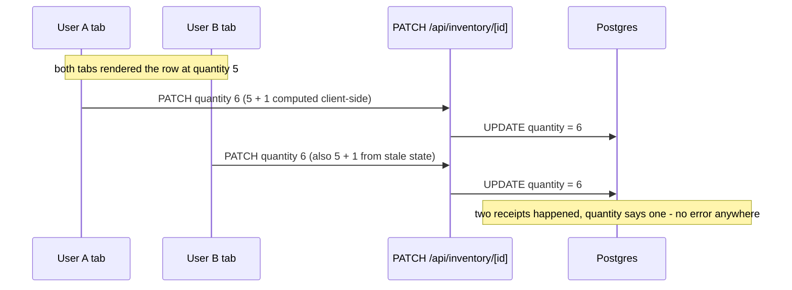
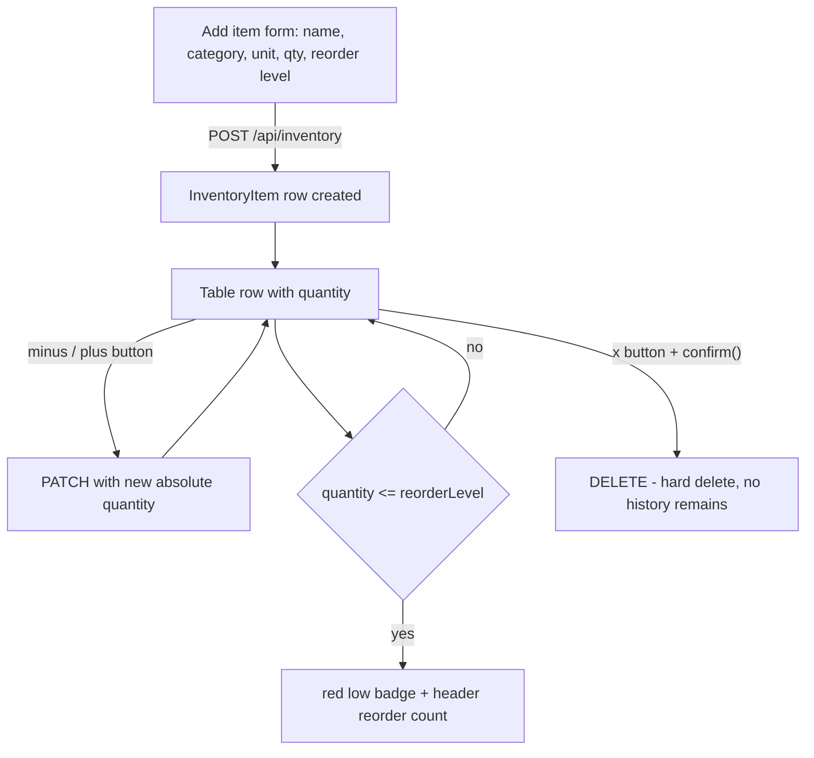
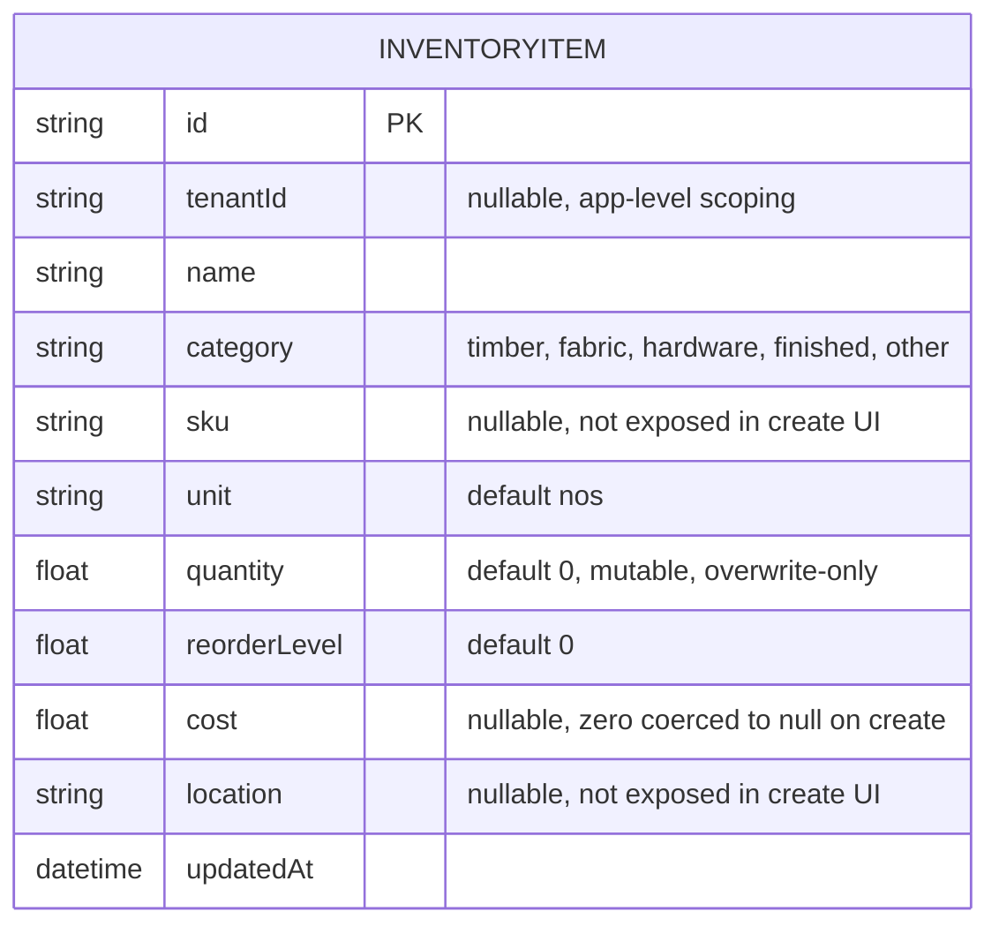
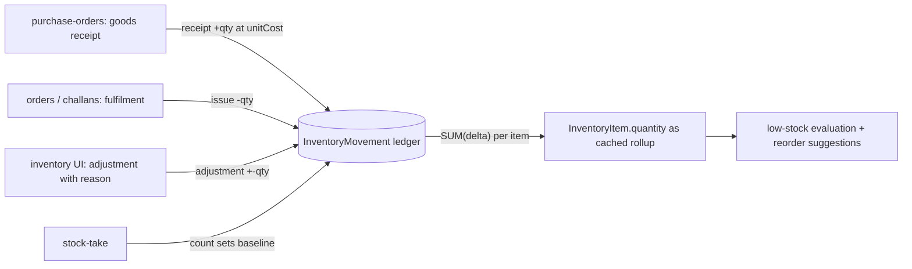
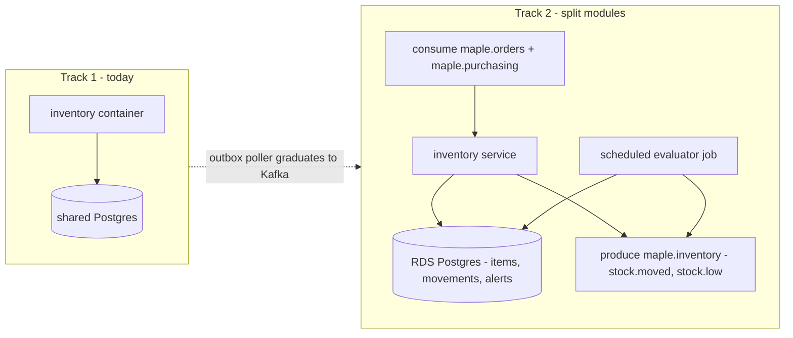
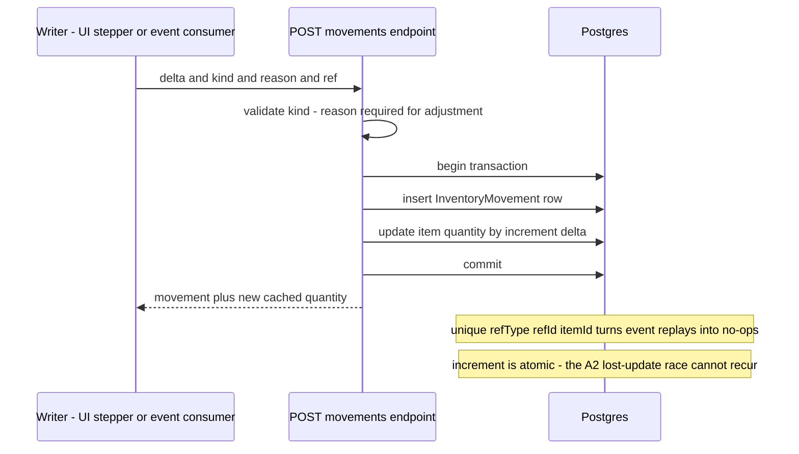
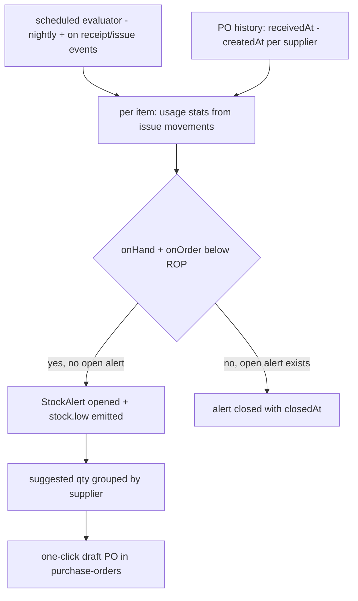
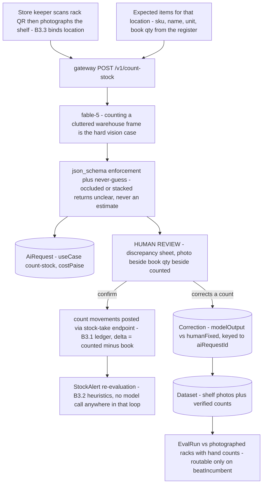

# Inventory — engineering bible

Single-table stock register for timber, fabric, hardware and finished goods, with reorder-level alerts and one-tap quantity adjustments. Part A is the exhaustive implementer reference for what runs today; Part B designs where it must go — headlined by the **stock ledger contract**: who is allowed to move stock, and the immutable movement model that replaces today's overwrite-only quantity.

**Status:** `apps/inventory` · `inventory.maplefurnishers.com` · dev `:3011` · prod: shared `maple-suite:latest` image with `APP=inventory`. Postgres only — no files, no volume.

## For managers — plain-language guide

This is the stock register: one list of everything you keep — teak planks, linen bolts, hinge boxes, finished three-seater sofa sets — each with a count, a unit, and a reorder level. Its everyday value is the answer to "do we have the sofa set in stock, and can I promise delivery this week?" without walking to the warehouse. Honest caveats, because they shape how much you can trust the numbers: counts change only when someone taps the + / − buttons (receiving a purchase order does **not** update stock automatically), there is no record of who changed a count or why, and if two people adjust the same item at the same moment one change can be silently lost. The ledger design in Part B fixes all three; until then, the register is as good as the team's discipline.

| Feature | What it means in your day | Who uses it |
| --- | --- | --- |
| Item register | Every material and finished piece on one screen, with category, unit (nos, sqft, rft, mtr, set) and a reorder level per item | Store keeper, admin |
| Stock in / out (+ and −) | Goods arrive from the timber supplier — find the row, tap + per plank bundle; a sofa set leaves for delivery — tap −. Checking sofa-set stock before promising a date is one glance | Store keeper; sales for the glance |
| Low-stock badge and reorder count | The row turns red when the count falls to its reorder level, and the header counts how many items need buying — the weekly purchase list starts here | Owner, purchasing |
| Delete with confirmation | Remove a discontinued item — with the warning that its stock history disappears with it, because there is no history kept | Admin |

Signs it's working:

- Sales answers "is it in stock" from the register, not from a walk to the warehouse — and the register is right.
- The header's reorder count drives the weekly purchase list rather than surprises driving emergency buys.
- Quarterly physical stock-takes land close to the register's numbers; big gaps mean taps are being skipped.

---

## Part A — implementers

### A1 — What exists today

- **Item register** — add items with name, category (`timber | fabric | hardware | finished | other`), unit (`nos | sqft | rft | mtr | set`), opening quantity and reorder level (`app/api/inventory/route.ts`). `sku`, `cost`, `location` exist on the model; the create form on `app/page.tsx` doesn't expose them, but the API accepts them.
- **Stock in/out** — the UI's − / + buttons send `PATCH /api/inventory/[id]` with the new **absolute** `quantity` (client clamps at 0 via `Math.max(0, qty + delta)`; the server accepts whatever number arrives, negatives included). There is **no movement ledger** — quantity is a single mutable float, so there is no history of who moved what, when, or why.
- **Low-stock signal** — purely derived: a row is "low" when `quantity <= reorderLevel`, shown as a red badge per row and a count badge in the header. No notification, no reorder automation.
- **Delete** — hard delete of the row; a browser `confirm()` is the only guard.
- **No integrations (verified)** — **receiving a purchase order does not touch inventory**, and nothing links `InventoryItem` to `Product`, `Order`, or `PurchaseOrder`. The module is an island; Part B exists to fix that.
- **No valuation** — `cost` is a static per-item field; nothing computes stock value, and issues/receipts (which don't exist as concepts) never touch it.
- **Read audience today** — only this app's own page reads the table; no other suite module queries `InventoryItem` (verified by search), so schema changes are currently free of cross-module blast radius.

### A2 — File-by-file, with lifecycles traced

The whole module is four files of app code:

| File | Role | Notes |
| --- | --- | --- |
| `apps/inventory/app/page.tsx` | The single page: add-item form + table with inline − / + adjust, low badges, delete | Client component; low count computed client-side `rows.filter(r => r.quantity <= r.reorderLevel)` |
| `apps/inventory/app/api/inventory/route.ts` | GET list + POST create | `tenantDb()`-scoped; 503 with a friendly message when the DB is down |
| `apps/inventory/app/api/inventory/[id]/route.ts` | PATCH + DELETE | Scoped `findFirst` guard, then **body passthrough** to Prisma — see the mass-assignment note below |
| `apps/inventory/middleware.ts` | `mt_session` cookie → `verifySession` → `canAccessTool(perms, "inventory")` | Legacy role fallback allows `admin, accounts, sales` (`rbac.ts` `LEGACY["/inventory"]`) |

**Lifecycle 1 — create.** Form POST → `inventoryItem.create` with: `unit` defaulting `"nos"`, `Number(b.quantity || 0)` / `Number(b.reorderLevel || 0)` coercion, and `cost: b.cost ? Number(b.cost) : null`. Three traced consequences:

- **A zero cost is stored as `null`** (`0` is falsy) — "this scrap timber costs ₹0" is indistinguishable from "cost unknown".
- A missing `name` throws from Prisma (500), since the API never validates — the UI's `if (!form.name.trim()) return` is the only guard.
- The `tenantDb()` extension stamps `tenantId` on create; the UI never sends `sku/cost/location` but scripts can.

**Lifecycle 2 — adjust stock (the race, traced).** `adjust(it, delta)` in `page.tsx` computes `Math.max(0, it.quantity + delta)` **from the React state the row was rendered with** and PATCHes that absolute value. Two users (or two tabs) adjusting the same row concurrently both read `quantity: 5`, both send `6` — one receipt is silently lost. The server compounds this by design: PATCH coerces `quantity/reorderLevel/cost` to `Number` when present (skipping `undefined/null/""`) and then passes **the entire parsed body** to `prisma.update` — so any column is writable, including `tenantId` in principle (the scoped `findFirst` guard only proves the row belonged to the tenant *before* the update). An empty-string `quantity` slips past the coercion filter and 500s inside Prisma. None of this is exploited by the shipped UI; all of it is reachable by any authenticated client.

**Lifecycle 3 — the low-stock signal.** `quantity <= reorderLevel`, evaluated in the browser on every render. Because both default to `0`, **a freshly created item with a blank quantity is immediately "low"** (`0 <= 0`) — cosmetic, but users read it as an alert. There is no server-side evaluation, no persistence of "went low at", no notification channel.

**Lifecycle 4 — delete.** `confirm("Delete this item?")` → DELETE → scoped guard → hard delete. With no ledger, deleting an item destroys the only record that its stock ever existed.

**Ordering gotcha:** the list orders by `updatedAt desc`, and every ± click updates the row — so adjusting an item teleports it to the top of the table on the next load. Harmless, but users notice.

The lost-update race, drawn out:



And the everyday flow around it:



### A3 — Data model + API shapes

`InventoryItem` is a standalone entity — no relations to any other model. `tenantId` is app-layer scoping via `tenantDb()` (which intercepts only `findMany/findFirst/count/updateMany/deleteMany/create` — hence the guard-then-update pattern in every route).



| Method + path | Request shape | Response shape | Auth gate |
| --- | --- | --- | --- |
| GET `/api/inventory` | — | `InventoryItem[]` (tenant-scoped, `updatedAt` desc) | middleware `tool:inventory` |
| POST `/api/inventory` | `{ name, category?, sku?, unit?, quantity?, reorderLevel?, cost?, location? }` | created `InventoryItem` | middleware only — **no `act:*` check** |
| PATCH `/api/inventory/[id]` | any columns; `quantity/reorderLevel/cost` numerically coerced, rest passthrough | updated `InventoryItem` | middleware only — mass assignment |
| DELETE `/api/inventory/[id]` | — | `{ ok: true }` | middleware only — **no `act:delete` check** |
| POST `/api/auth/logout` | — | clears `mt_session` | none needed |

Concrete shapes:

```jsonc
// POST /api/inventory — request (UI sends the first five; API accepts all)
{ "name": "Teak plank 8ft", "category": "timber", "unit": "rft",
  "quantity": "120", "reorderLevel": "40",
  "sku": "TK-8FT", "cost": 850, "location": "Rack B2" }

// response — note quantity/reorderLevel coerced to numbers, cost 0 would be null
{ "id": "cmi...", "tenantId": "t_...", "name": "Teak plank 8ft", "category": "timber",
  "sku": "TK-8FT", "unit": "rft", "quantity": 120, "reorderLevel": 40,
  "cost": 850, "location": "Rack B2", "updatedAt": "..." }

// PATCH /api/inventory/[id] — what the UI sends (absolute, not relative)
{ "quantity": 119 }
```

### A4 — Config reference

| Variable | Default | Effect |
| --- | --- | --- |
| `DATABASE_URL` | — | Shared suite Postgres — the module's only real dependency |
| `AUTH_SECRET` / session vars | — | `verifySession` for `mt_session` |
| `LOGIN_URL` | `https://admin.maplefurnishers.com/login` | SSO redirect in middleware |

No app-specific env, no file storage, no extra deps beyond `@maple/core` + `@maple/db`. Dev: `npm run -w @maple/app-inventory dev -- -p 3011` (ports per `PORTS.local.txt`).

### A5 — Recipes

- **Expose `sku`/`cost`/`location` in the UI** — pure `page.tsx` work: add the form fields and table columns; the API already round-trips them.
- **Make an adjustment safely from a script** — don't imitate the UI's absolute write. Until the ledger lands, use an atomic relative update: `prisma.inventoryItem.update({ where: { id }, data: { quantity: { increment: delta } } })` (after the scoped `findFirst` guard). The PATCH route accepting Prisma operation objects is *not* guaranteed — go through the DB or add a dedicated `/adjust` endpoint.
- **Bulk import opening stock** — POST per row is fine at Maple's scale (hundreds of items); stamp `location` and `cost` in the payload even though the UI won't show them yet.
- **Audit "who zeroed this item"** — you can't; `updatedAt` is the only trace. That is the whole case for B3.1.
- **Add a new category or unit** — both are free strings server-side; the `CATS` and unit `<option>` lists in `page.tsx` are the only enum. Change them there; no migration needed.
- **Find items missing costs before a valuation exercise** — `SELECT name FROM "InventoryItem" WHERE cost IS NULL` — and remember the create-path coercion means some of those nulls were entered as `0` (Lifecycle 1).
- **Stock-take with today's schema** — export the table, count physically, PATCH absolute quantities one by one, and accept that the deltas are unrecorded. This pain, scheduled quarterly, is the business case that funds B3.1.

---

## Testing — how we verify this module

**Current state, honestly: zero tests under `apps/inventory`** (verified). The root harness is ready — `vitest.config.ts` globs `apps/**/*.test.{ts,tsx}` into `npm test` (CI), and Playwright (`npm run e2e`) runs against a live local stack — so what follows is purely a matter of writing files. Inventory's test priorities are unusual: the numbers *are* the product, so coercion edge cases and the concurrency story outrank UI coverage.

**Unit targets (vitest):**

- Create-path coercion from `route.ts`: `quantity: "120"` → `120`, missing → `0`; and **the `cost: 0` → `null` trap as a named test** — "costs ₹0" and "cost unknown" must be distinguishable; the test documents today's lossy behavior and becomes the spec for the fix (`b.cost === undefined || b.cost === "" ? null : Number(b.cost)`).
- PATCH coercion: `quantity: "119"` → `119`; **`quantity: ""` is skipped by the coercion guard (`!== undefined && !== null && !== ""`) and reaches Prisma as an empty string → 500** — the test pins reject-with-400 as the intended behavior.
- Low-stock derivation, extracted pure from `page.tsx`: `quantity <= reorderLevel`, including the fresh-item `0 <= 0` cosmetic-alert case (A2 Lifecycle 3) so any threshold change is deliberate.
- Once B3.1 lands, the worked examples in this page become test vectors verbatim: moving-average valuation (`(120×850 + 40×910) / 160 = 865`) and the ROP formula (teak planks: `3.2 × 9 + 1.65 × 1.8 × √9 ≈ 38`, suggested qty 42).

**Integration (route handlers against a scratch Postgres):**

| Named regression case | Asserts | Status today |
| --- | --- | --- |
| `inventory-lost-update` | two concurrent +1 adjustments both persist — final quantity is start+2 | **fails** — absolute overwrite from stale client state (A2 Lifecycle 2); goes green with `increment` or B3.1 movements |
| `inventory-mass-assignment` | `PATCH {"tenantId": "other"}` leaves `tenantId` unchanged | **fails** — body passthrough (B5; catalog's whitelist is the reference fix) |
| `inventory-empty-string-qty` | `PATCH {"quantity": ""}` → 400, not a Prisma 500 | **fails** |
| `inventory-cross-tenant-404` | PATCH/DELETE with another tenant's item id → 404 | passes — scoped guard |
| `movement-replay-idempotent` | when B3.1 lands: posting the same `(refType, refId, itemId)` movement twice yields one ledger row and one increment | not built yet |

**E2E (Playwright user stories):**

1. The store keeper adds "Teak plank 8ft / timber / rft / 120 / reorder 40" and sees the row with the right unit.
2. Tapping − down to 40 turns the row's badge red and increments the header's reorder count; tapping + back above 40 clears both.
3. Delete shows the confirm dialog; cancelling keeps the row, confirming removes it.

**Definition of done for any inventory change:** any PR that touches `quantity` handling runs `inventory-lost-update` (and, post-ledger, may not write `quantity` without a movement — B1's reviewer rule, enforced by the reconciliation query as a test assertion); the coercion unit tests stay green; E2E story 2 re-runs after any adjust-flow change; bug fixes land with their reproducing test first.

---

## Part B — architects

### B1 — Cross-module: the stock ledger contract

Today **exactly one thing moves stock: a human clicking − / +**. The contract for the target state names every mover, its trigger, and its movement kind — stock changes become *events with provenance*, not overwrites:

| Mover | Trigger | Movement kind | Direction | Reference |
| --- | --- | --- | --- | --- |
| Purchase orders | Goods receipt posted against a PO ([module-purchase-orders.md](module-purchase-orders.html) B1) | `receipt` | + | `refType: "purchase_order", refId` |
| Orders / challans | Fulfilment: order dispatched to client ([module-orders.md](module-orders.html), [module-challans.md](module-challans.html)) | `issue` | − | `refType: "order"` or `"challan"` |
| Inventory UI | Manual correction with a required reason (shrinkage, damage, found stock) | `adjustment` | ± | — |
| Inventory UI | Physical stock-take reconciliation | `count` | sets a new baseline | — |

Two integration styles, in adoption order:

1. **Same-DB, same-transaction (now):** all suite modules share one Postgres, so PO receiving can `prisma.$transaction([...movements, ...itemUpdates, poUpdate])` directly. Ship this first — it is correct and cheap, and the transaction boundary *is* the contract.
2. **Event-driven (at module split):** producers write `order.fulfilled` / `po.received` outbox rows in the same transaction as their state change; the inventory module consumes them and posts movements idempotently (consumer records processed event ids — the at-least-once + idempotency discipline already specified in [event-catalog.md](event-catalog.html)). The movement table's `refType/refId` doubles as the idempotency key: one movement set per `(refType, refId)`.

The invariant either way: **`InventoryItem.quantity` is a cache of `SUM(movements.delta)`** — recomputable, never the source of truth. Rule of thumb for reviewers: any PR that writes `quantity` without writing a movement is wrong by definition (the one exception: the backfill migration).



### B2 — Infrastructure, both tracks

**Track 1 — today (compose).** Stateless container, one shared Postgres, no volume — the simplest app in the suite operationally. Nothing to do until the ledger lands; then the only infra-visible change is write volume (a movement insert per stock change) and one new hot query (`SUM(delta) GROUP BY itemId` — served by the cached rollup, so cold-path only).

**Track 2 — target (AWS / split modules).**

- **Postgres (RDS)** stays the system of record — a ledger is exactly what a relational DB with an index on `(tenantId, itemId, createdAt)` is for. No document store, no separate time-series DB at any plausible Maple scale.
- **Kafka topics** at module split: consume `maple.orders` (`order.fulfilled`) and `maple.purchasing` (`po.received`, `receipt.posted`); produce `maple.inventory` (`stock.moved`, `stock.low`) — partition key `tenantId:itemId` so per-item movement order is preserved. Until Kafka exists, the Postgres outbox poller from [event-catalog.md](event-catalog.html) carries the same payloads.
- **Redis** — not needed for inventory reads (admin-tool traffic), but `stock.low` fan-out (badge counts on the suite dashboard, notification digests) is a natural pub/sub consumer once alerts exist.
- **Workers on a queue:** low-stock evaluation and reorder-suggestion computation (B3.2) run as a scheduled job (cron container in compose; EventBridge → worker on AWS), not in request handlers.
- **K8s/ECS profile:** the app is IO-bound CRUD — `requests: 100m/256Mi` is generous; scale-out is trivial since there is no local state. The scheduled evaluator is a separate one-shot job, not a replica of the web app.



### B3 — Designed enhancements

**B3.1 — Immutable stock-movements ledger.** The replacement for mutable counts:

```prisma
model InventoryMovement {
  id        String        @id @default(cuid())
  tenantId  String?
  itemId    String
  item      InventoryItem @relation(fields: [itemId], references: [id])
  delta     Float          // signed; positive = into stock
  kind      String         // receipt | issue | adjustment | count
  reason    String?        // required by API when kind = adjustment
  refType   String?        // purchase_order | order | challan
  refId     String?
  unitCost  Float?         // set on receipts; feeds valuation
  actorId   String?        // session user id
  createdAt DateTime       @default(now())

  @@index([tenantId, itemId, createdAt])
  @@unique([refType, refId, itemId])   // idempotency for event-driven writers
}
```

Rules: **no UPDATE or DELETE on this table, ever** — corrections are compensating movements (`kind: "adjustment"`, reason references the mistaken movement id). A `count` movement carries `delta = counted − current` so the ledger stays purely additive. `InventoryItem.quantity` becomes the cached rollup, updated in the same transaction as each insert (`quantity: { increment: delta }` — atomic, which retroactively fixes the A2 read-modify-write race: the UI's ± becomes `POST /api/inventory/[id]/movements { delta: 1, kind: "adjustment", reason: "..." }`). Migration: one `count` movement per existing item ("opening balance as of migration date"), then remove `quantity` from the PATCH-writable set.

Target API surface once the ledger lands:

| Method + path | Purpose | Notes |
| --- | --- | --- |
| POST `/api/inventory/[id]/movements` | Post a movement `{ delta, kind, reason?, refType?, refId?, unitCost? }` | Validates kind; `reason` required for `adjustment`; transactional with the rollup increment |
| GET `/api/inventory/[id]/movements` | Item history, newest first, paginated | The audit trail the module lacks today |
| PATCH `/api/inventory/[id]` | Metadata only: name, category, sku, unit, reorderLevel, cost, location | `quantity` rejected — write a movement instead |
| POST `/api/inventory/stock-take` | Bulk `count` movements from a physical count sheet | One transaction per sheet |

The write path that makes the whole design safe — one transaction per movement, whoever the writer is:



A worked ledger, so the semantics are unambiguous:

| # | kind | delta | unitCost | refType/refId | running qty | note |
| --- | --- | --- | --- | --- | --- | --- |
| 1 | count | +120 | 850 | — | 120 | opening balance at migration |
| 2 | receipt | +40 | 910 | purchase_order / PO-000213 | 160 | goods receipt posts this ([module-purchase-orders.md](module-purchase-orders.html) B1) |
| 3 | issue | −24 | — | order / ORD-88 | 136 | fulfilment deducts |
| 4 | adjustment | −2 | — | — | 134 | reason: "water damage, rack B2" |
| 5 | count | +1 | — | — | 135 | stock-take found one more than books |

Nightly reconciliation (drift means some code path violated the contract):

```sql
SELECT i.id, i.quantity, COALESCE(SUM(m.delta), 0) AS ledger_qty
FROM "InventoryItem" i
LEFT JOIN "InventoryMovement" m ON m."itemId" = i.id
GROUP BY i.id, i.quantity
HAVING i.quantity <> COALESCE(SUM(m.delta), 0);
```

**Valuation basics** (deliberately minimal): receipts carry `unitCost`; item value = moving average — `avgCost' = (qtyOnHand × avgCost + receiptQty × unitCost) / (qtyOnHand + receiptQty)`, recomputed per receipt and stored on the item; issues value out at current `avgCost`. Moving average over FIFO layers is a decision, not an omission: FIFO needs layer bookkeeping that Maple's accounting doesn't require, and the ledger retains enough data (`unitCost` per receipt) to recompute FIFO retroactively if an accountant ever demands it.

Worked valuation against the ledger above: opening 120 rft at ₹850 (`avgCost = 850`); receipt of 40 at ₹910 → `avgCost = (120×850 + 40×910) / 160 = ₹865`; the 24-rft issue values out at ₹865 (₹20,760 cost of goods), leaving value untouched per unit. The damage adjustment writes off `2 × 865 = ₹1,730`. Stock value report = `Σ quantity × avgCost` per category; feeds [module-finance.md](module-finance.html) as a period-end journal figure, not per-movement postings.

**B3.2 — Low-stock alerts + reorder suggestions.** Upgrade the derived badge into an operational loop, with the classical formulas grounded in PO data:

- **Reorder point:** `ROP = avgDailyUsage × leadTimeDays + safetyStock`, where `avgDailyUsage` comes from the last 90 days of `issue` movements (the ledger makes this a one-query aggregate), and `leadTimeDays` per item comes from PO history — `avg(receivedAt − createdAt)` across POs whose receipts reference the item ([module-purchase-orders.md](module-purchase-orders.html) B3.2 supplies `receivedAt`). Fallback to the supplier's `leadTimeDays` field, then to a tenant default.
- **Safety stock:** start with the simple form `safetyStock = zScore × usageStdDev × sqrt(leadTimeDays)` at z = 1.65 (~95% service level); expose z per category since a stockout of `finished` goods costs more than one of `hardware`.
- **Mechanics:** the scheduled evaluator (B2) writes a `StockAlert` row when an item crosses below its ROP (one open alert per item, closed on recovery — no re-firing spam), emits `stock.low`, and computes a **suggested order quantity** `= max(ROP × 2 − onHand − onOrder, minOrderQty)` where `onOrder` sums open PO lines for the item. The suggestion links straight into PO creation: "3 items below reorder from Sharma Timber → draft PO" — the purchasing loop closed in one click.
- `reorderLevel` remains as the manual override; suggestions display both and flag large divergence (a signal the manual level is stale).

The alert row and its lifecycle:

```prisma
model StockAlert {
  id          String    @id @default(cuid())
  tenantId    String?
  itemId      String
  openedAt    DateTime  @default(now())
  closedAt    DateTime?           // set when stock recovers above ROP
  ropAtOpen   Float               // the computed ROP that fired it
  qtyAtOpen   Float
  suggestedQty Float?
  supplierId  String?             // best supplier per PO history, when known

  @@index([tenantId, closedAt])   // open alerts = closedAt null
}
```

Worked example, to keep the formulas honest: teak planks issue on average 3.2 rft/day (σ = 1.8) over the last 90 days; Sharma Timber's measured lead time is 9 days. `ROP = 3.2 × 9 + 1.65 × 1.8 × √9 = 28.8 + 8.9 ≈ 38`. On hand 34, on order 0 → alert opens with `suggestedQty = max(38 × 2 − 34 − 0, minOrderQty) = 42`. The manual `reorderLevel` of 40 sits near the computed 38 — no divergence flag. If usage doubles seasonally, the computed ROP follows within the 90-day window while the manual level silently rots — that divergence is the feature.



**B3.3 — Barcode / QR labeling.** Physical-world binding for the ledger: each item (and PO-received batch) gets a printable label.

- **Encoding:** QR carries a URL — `inventory.maplefurnishers.com/scan/{itemId}` — so any phone camera works with zero app install; Code 128 of the SKU sits alongside for wand scanners at a future dispatch desk. Human-readable name + SKU + location printed under both.
- **Label sheet:** `GET /api/inventory/labels?ids=...` renders an A4 PDF grid (24-up, standard sticker sheets). The suite already has server-side PDF muscle to reuse — and explicitly *not* `poster.ts`, which is photoshoot's ffmpeg first-frame tool, nothing to do with documents.
- **The `/scan/{itemId}` page:** mobile-first movement form behind the normal SSO middleware — big ± steppers, kind selector defaulting to `adjustment`, reason field, posts to the movements endpoint (B3.1). The same page shows current quantity and the item's open PO lines.
- **Receiving synergy:** scanning a label during a delivery pre-fills the goods-receipt line for that item against the open PO ([module-purchase-orders.md](module-purchase-orders.html) B3.2) — the warehouse never types an item name.
- **Prerequisite:** SKU becomes operationally load-bearing — make it required and unique per tenant (`@@unique([tenantId, sku])`) as part of this work, with a backfill pass that generates SKUs for existing rows (`{CAT}-{seq}`).

### B4 — Scaling

- **Volume reality check:** a busy furniture workshop generates tens of movements a day — thousands of rows a year per tenant. Every design above is boring on purpose; the ledger table will not need partitioning within any horizon worth planning for. The index `(tenantId, itemId, createdAt)` covers every query pattern (item history, rollup verification, usage aggregates).
- **The rollup is the only consistency risk.** Keep quantity-cache updates in the same transaction as movement inserts, and add a nightly reconciliation job (`SUM(delta)` vs `quantity`, alert on drift) — drift means a code path violated the B1 invariant.
- **Concurrency** is solved by construction: relative increments + an append-only table have no lost-update mode. The unique `(refType, refId, itemId)` constraint makes event replays safe.
- **Read scale:** the admin table is a few hundred rows per tenant; if the public web ever shows availability, that read goes through the product master cache ([module-catalog.md](module-catalog.html) B2), not this module.
- **History growth UX, not DB:** the item-history endpoint paginates from day one; the *table* never needs archival, but an item screen rendering five years of movements does.
- **Sequencing:** ledger (B3.1) strictly before alerts (B3.2) — usage statistics come from `issue` movements, so alerts computed against overwrite-era data would be fiction. Barcoding (B3.3) can land any time after the movements endpoint exists.

### Cross-reference map

| Topic | Where it lives |
| --- | --- |
| Who posts receipts into this ledger | [module-purchase-orders.md](module-purchase-orders.html) B1 (flow spec) + B3.2 (receipt schema, landed cost) |
| Who posts issues | [module-orders.md](module-orders.html) / [module-challans.md](module-challans.html) fulfilment (future) |
| Product ↔ stock-item bridge (`productId`) | [module-catalog.md](module-catalog.html) B1 — the product master |
| Event envelope, outbox discipline | [event-catalog.md](event-catalog.html) |
| RBAC gaps shared by all three modules | [rbac-matrix.md](rbac-matrix.html) |
| Hosting phases this module rides | [aws-deployment.md](aws-deployment.html) |

## AI — use case & pipeline

**The honest take first: the reorder problem needs no AI.** B3.2's reorder points, safety stock, and suggested quantities are arithmetic over the movement ledger and measured PO lead times — deterministic, explainable to an owner in one sentence, and auditable when they're wrong. An LLM in that loop adds cost and noise to a solved formula; anyone selling "AI-powered reorder" for a two-warehouse furniture workshop is selling the label. Build B3.2 as designed, with zero model calls. **The real AI win is the stock-take.** Quarterly physical counts are the module's stated ground truth ("big gaps mean taps are being skipped") and its most hated chore: a clipboard walk of every rack. The pipeline: the store keeper scans a rack's QR label (B3.3, which binds photo → location), photographs the shelf, and the model counts what it sees against the expected items for that location — returning per-item counts, `unclear` where stock is occluded or stacked, and anything visible that isn't on the list. The discrepancy sheet — photo beside book quantity beside counted — is the human review screen; confirmed rows post `count` movements through B3.1's stock-take endpoint. Scope stays honest: discrete countable stock (hardware boxes, finished pieces, fabric bolts) — a timber stack photographs as one brown mass, and the model must say `unclear` there, never estimate.



**Implementation.**

| Gateway endpoint | Input | Output `json_schema` fields | Model pick | Est. ₹/call | er-platform tables |
| --- | --- | --- | --- | --- | --- |
| `POST /v1/count-stock` | 1–2 shelf photos (phone JPEG) + expected list `[{sku, name, unit, bookQty}]` for the scanned location (≤ ~30 items) | `items[]: sku, counted (int \| null), status "counted" \| "unclear" \| "not_seen", note` + `unlisted[]: description, approxQty` | **fable-5** — object counting in a cluttered frame is the hard case, the same routing logic that keeps fable-5 on handwritten catalogs; sonnet-5 becomes the `ModelRoute` experiment only after the eval set exists | **₹2–4/photo** — one or two images against the **₹8–10/page** anchor for a dense document pass ([ai-layer.md](ai-layer.html)); a 20-rack stock-take ≈ ₹50–80, versus an afternoon of two people | `AiRequest`, `AiBudget`, `ModelRoute`, `Correction`, `Dataset`, `EvalRun` |

Design notes:

- The pipeline writes nothing directly: confirmed counts go through the same `POST /api/inventory/stock-take` humans use (B3.1), so the ledger invariant — every quantity change is a movement — holds by construction, and `actorId` records the confirming human, not the model.
- `unlisted[]` is deliberately advisory (a photo showing hinges on the wrong rack), surfaced as a note — the model never creates items.
- Corrections are cheap, perfect labels here: `modelOutput` count vs the keeper's `humanFixed` count per photo — exactly the dataset a counting eval needs.

**Rollout & eval gate.**

1. **Ledger strictly first.** B3.1 before any of this: an AI count with no `count` movement to post is a screenshot. B3.3's labels (and per-tenant-unique SKUs) are the second prerequisite — without location binding, "expected items" is the whole register and accuracy collapses.
2. **Pilot one category** (`hardware` — boxed, labelled, countable) on one rack for one monthly cycle, running the model *beside* a human count.
3. **Eval gate:** exact-count accuracy ≥ 95% on the pilot category with `unclear` rate < 30%. Below that bar the review sheet costs more attention than the clipboard it replaced — kill it without sentiment, the ledger and heuristics lose nothing.
4. **Not before — forecasting:** demand forecasting (the other "AI inventory" pitch) waits for **12 months of real movement history** in the ledger. Furniture demand is seasonal — wedding dates, Diwali, monsoon lulls — and a model trained on less than one full cycle is the B3.2 heuristics wearing a costume, minus the explainability. Until the ledger has a year of `issue` movements, the 90-day moving averages *are* the forecast, and they're free.

### B5 — Status: done / left / decisions

**Done ✓**

- Item CRUD, inline stock adjust, low-stock derivation against reorder level, tenant scoping, per-row scoped-ownership guard before update/delete.

**Left ◻**

- **Stock movement ledger / audit trail** — quantity is overwrite-only today, so shrinkage and adjustments are indistinguishable; full design in B3.1.
- **Purchase-order integration** — receiving a PO still touches nothing here; the receiving flow spec lives in [module-purchase-orders.md](module-purchase-orders.html) B1 and posts into B3.1's ledger.
- Fix the ± read-modify-write race (falls out of B3.1's relative movements; or `increment` as a stopgap).
- Replace PATCH body-passthrough with a field whitelist (catalog's PATCH is the in-suite reference implementation).
- `act:delete` enforcement on DELETE (defined in `rbac.ts`, never checked — see [rbac-matrix.md](rbac-matrix.html)).
- Expose `sku`, `cost`, `location` in the UI; make `sku` unique per tenant ahead of barcoding (B3.3).
- Alerts/notifications for low stock (B3.2) — today the badge only exists while someone is looking at the page.
- No `/api/health` endpoint; no tests.

**Decisions on record**

- Moving-average valuation over FIFO (B3.1) — simpler, sufficient for Maple's accounting, and reversible since receipts keep `unitCost`.
- `InventoryItem` stays the stocking-unit table and does **not** merge into the product master: a `Product` is what you sell (catalog/quotations), an `InventoryItem` is what you stock (raw timber is never a Product; a finished chair may be both). The bridge is an optional `productId` on `InventoryItem`, added when the product master lands ([module-catalog.md](module-catalog.html) B1).
- Same-DB transactional integration ships before event-driven — the outbox consumer arrives with the module split, not before ([event-catalog.md](event-catalog.html)).
- No lot/batch or serial tracking in v2: the movement's `refId` gives receipt-level traceability, which is as far as a furniture workshop needs to go; revisit only if a fabric-recall scenario ever materializes.

---

*Sibling bibles: [module-catalog.md](module-catalog.html) · [module-purchase-orders.md](module-purchase-orders.html). Suite-wide context: [er-suite.md](er-suite.html) · [cross-module.md](cross-module.html).*
