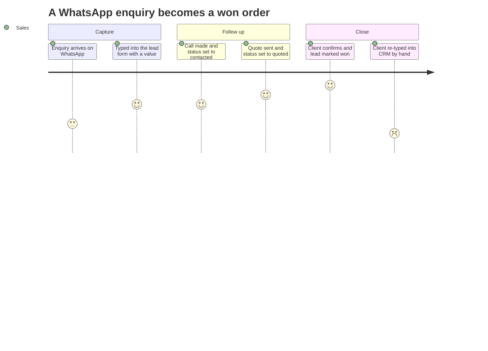
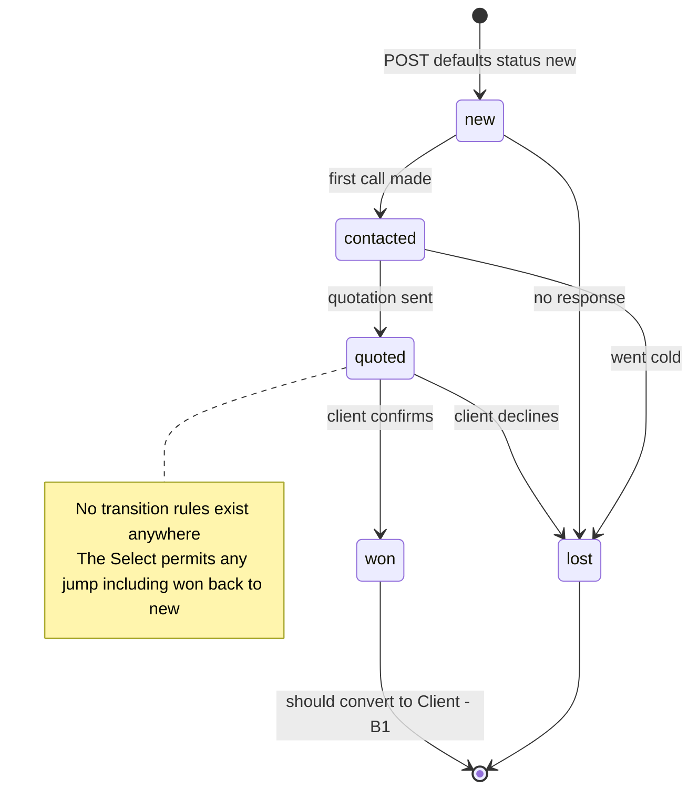
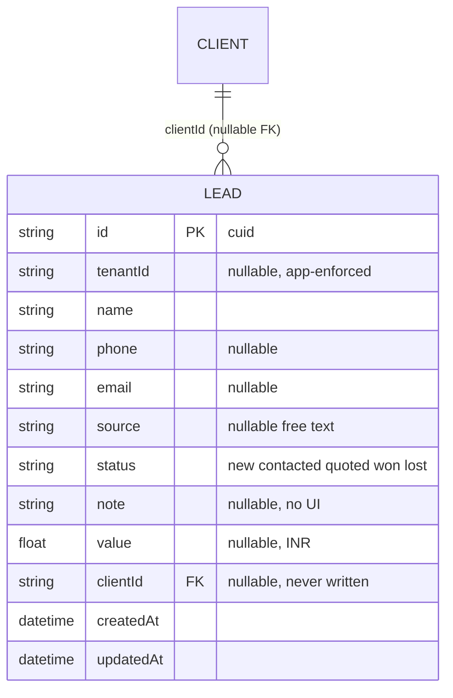
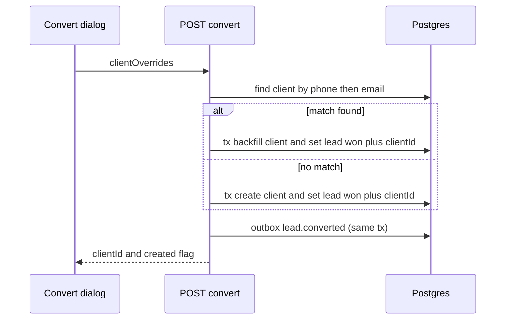
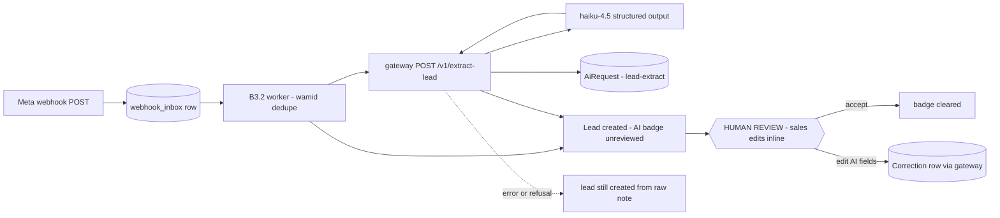

# Leads — engineering bible

Sales-pipeline capture and qualification: a single-screen lead list with inline status changes and an open-pipeline value counter. The smallest module in the suite by code volume (~150 lines of app-specific code) and the one whose *absent* feature — converting a won lead into a CRM client — is the most-cited gap in [cross-module.md](cross-module.html).

**Status: suite app `apps/leads`, subdomain `leads.maplefurnishers.com`, dev port `:3002`, container from `maple-suite:latest` with `APP=leads` (docker-compose.yml).**

## For managers — plain-language guide

This is the enquiry register. Every enquiry — an Instagram DM about a walnut dining table, a walk-in at the showroom, a WhatsApp message forwarded by a friend — gets typed in once, with a rough value, and from then on the whole team can see where it stands and how much business is sitting in the pipeline. Two honest caveats: WhatsApp enquiries are typed in by hand today (automatic capture is designed but not built), and marking a lead "won" does not yet carry the person into the client directory — sales re-types them in CRM.

| Feature | What it means in your day | Who uses it |
| --- | --- | --- |
| Quick capture form | A WhatsApp enquiry becomes a lead in under a minute — name, phone, where it came from, estimated value in ₹ | Sales |
| Five-stage status | Each lead is marked new → contacted → quoted → won or lost with one dropdown, straight from the list — no separate screen | Sales |
| Open pipeline value | The header shows the ₹ total of everything not yet won or lost — the number to glance at before the Monday sales review | Owner, sales |
| Per-stage counts and contact column | Badges say how many leads sit at each stage; the contact column shows the phone (or email) for the call-back round | Sales |
| Row delete | Removes a junk or duplicate enquiry — careful: one click, no confirmation, no undo | Sales, admin |
| Database-down banner | An amber banner tells you the system is down, instead of quietly showing an empty list | Everyone |

Signs it's working:

- Every enquiry from every channel appears in the register the same day it arrives, most with a value estimate.
- The pipeline number in the header is the one quoted in the Monday review — nobody keeps a parallel Excel.
- Leads don't sit in "new" for more than a day or two, because moving them is one dropdown click.



(The unhappy last step is honest — lead-to-client conversion is the module's most-cited gap, designed in B1 below.)

---

## Part A — for implementers

### A1 — what exists today

- Captures leads via an inline form: name (required, client-side only), phone, source ("Instagram, walk-in…"), estimated value in ₹ (`app/page.tsx`).
- Tracks each lead through five statuses — `new → contacted → quoted → won / lost` — changed inline with a `<Select>` per row. Status is a free `String` column, not an enum; the five values are conventions enforced only by the UI.
- Shows the open pipeline value in the page header: the sum of `value` for every lead not in `won`/`lost`, formatted with `money()` from `@maple/core/lib/utils` (an `Intl.NumberFormat` INR formatter, `utils.ts:37`).
- Per-status count badges in the header; the contact column falls back phone → email → "—".
- Row delete via the `×` button — **no confirm dialog**, unlike CRM's client delete.
- Shows a 503 amber banner ("Database not reachable…") when the API can't reach Postgres.
- What does *not* exist: no detail page, no lead notes UI (the `note` column is dead weight), no assignment/ownership, no conversion to client, no pagination, no search.

The pipeline as the UI conventions define it — remembering that `status` is a free string and the `<Select>` allows any value to follow any other; the arrows below are the *intended* flow, not an enforced state machine:



### A2 — file-by-file, lifecycles traced

The app is seven meaningful files. Everything else is scaffolding shared with every suite app.

| File | Role |
| --- | --- |
| `apps/leads/app/page.tsx` | The entire UI — one `"use client"` component |
| `apps/leads/app/api/leads/route.ts` | GET (list), POST (create) |
| `apps/leads/app/api/leads/[id]/route.ts` | PATCH (update), DELETE |
| `apps/leads/app/api/auth/logout/route.ts` | POST — clears the shared session cookie |
| `apps/leads/app/layout.tsx` | Server layout: session, brand, feature flag, `SuiteShell` |
| `apps/leads/middleware.ts` | Edge auth: JWT verify + `tool:leads` gate |
| `apps/leads/next.config.ts` | `transpilePackages: ["@maple/core", "@maple/db"]`, `allowedDevOrigins` for every suite subdomain |

**Request lifecycle — every page hit, traced.**

1. `middleware.ts` runs on everything except the matcher exclusions (`api/auth`, `_next/static`, `_next/image`, favicon, media extensions). It reads the `mt_session` cookie (`COOKIE` from `@maple/core/lib/session`), calls `verifySession(token)` — a local `jose` HS256 verify against `AUTH_SECRET`, no network call — and gets back `{ id, name, email, role, perms, tenantId }` or `null`.
2. No user: API paths get `401 {"error":"unauthorized"}`; page paths get a redirect to `LOGIN_URL` (default `https://admin.maplefurnishers.com/login`) with a `next` param rebuilt from `x-forwarded-host` so the round-trip returns to the right subdomain.
3. User present: `canAccessTool(user.perms, "leads", user.role)` (`rbac.ts:35`) — passes if perms contain `*` or `tool:leads`; sessions with *empty* perms (issued before the permission system) fall back to the legacy map `"/leads": ["admin","sales"]`. Failure: 403 for APIs, redirect to admin for pages.
4. `app/layout.tsx` (server component) then re-checks the session via `getSession()` (cookie → `verifySession`), redirects to `adminUrl("/login")` if absent, resolves branding via `getBrand()` (Tenant looked up by registrable host, 60s cache), and evaluates `isEnabled("tool.leads")` against Flipt (30s cache, **fail-open** when `FLIPT_URL` is unset or errors). Flag off → renders `<ToolDisabled label="Leads" />` *instead of children* — but note this gates the page tree only; API routes have no flag check and stay live when the tool is "off" (runbook blocker B2 in [cross-module.md](cross-module.html)).

**UI lifecycle — `page.tsx` function by function.**

- State: `leads: Lead[]`, `error: string | null`, `loading: boolean`, `form: { name, phone, source, value }` (all strings; `value` is coerced server-side).
- `load()` — `fetch("/api/leads")`. Non-OK: parse the error JSON defensively (`.catch(() => ({}))`), set the banner, clear rows. OK: clear error, set rows. Network throw: generic "Could not reach the server." `finally` clears `loading`. Called once from `useEffect` on mount.
- `add(e)` — bails silently if `form.name.trim()` is empty (the only validation anywhere for leads; the API itself would throw a Prisma error and 500 on a missing name). POSTs the raw form object, resets the form on OK, then re-fetches the whole list. No optimistic update, no toast on failure — a failed create just silently does nothing.
- `patch(id, data)` — fires PATCH then unconditionally `load()`s. Every inline status change is one PATCH + one full-list refetch.
- `remove(id)` — DELETE then `load()`. **No `confirm()`** — one mis-click destroys a lead with no undo.
- Derived values computed on every render: `pipeline` (sum of `value` where status not in won/lost) and the five badge counts (`leads.filter(...).length` each — five passes over the array; fine at this scale).

**API lifecycle — the handlers, traced.**

- `GET /api/leads` — `(await tenantDb()).lead.findMany({ orderBy: { updatedAt: "desc" } })` inside try/catch; catch returns the 503 body the UI banner displays. `tenantDb()` is the Prisma `$extends` wrapper (`packages/core/src/lib/tenant-db.ts`) that injects `where: { tenantId }` into `findMany/findFirst/count/updateMany/deleteMany` and stamps `tenantId` on `create` — for the 21 models in its `SCOPED` set, `Lead` included. Tenant id comes from the session JWT (`getTenantId()`), falling back to host-resolved tenant.
- `POST /api/leads` — no try/catch (DB down → unhandled 500, not the friendly 503), no validation. Field-by-field copy with `|| null` defaults; `status` defaults `"new"`; `value` coerced with `Number()` (so `"abc"` becomes `NaN` — Prisma rejects it, another 500). Note it does **not** accept `clientId` — creation can't link a client even deliberately.
- `PATCH /api/leads/[id]` — the scoped-guard pattern: `findFirst({ where: { id } })` runs *through* the tenant extension (so it 404s for other tenants' rows), then `update({ where: { id }, data: b })` runs *outside* it (`update` is not in the extension's hook list — this is why the guard must come first). `value` gets coerced; **everything else in the body is passed to Prisma verbatim**. See the mass-assignment recipe in A5 — this is the module's worst bug.
- `DELETE /api/leads/[id]` — same guard, then `delete`. No `act:delete` permission check even though `ACTIONS` in `rbac.ts` defines one and admin UI can grant it.
- `POST /api/auth/logout` — sets the cookie to `""` with `maxAge 0` using the shared `sessionCookieOptions`; excluded from middleware so it works with a dead session.

### A3 — data model and API surface

Owned model: `Lead` (`packages/db/prisma/schema.prisma:34`). `tenantId` is nullable and enforced by `tenantDb`, not by the schema — a deliberate suite-wide choice to allow pre-tenancy rows (the seed backfills them, `seed.mjs:76`).



| Route | Method | Request body | Response | Auth that actually exists |
| --- | --- | --- | --- | --- |
| `/api/leads` | GET | — | `200` `[{id, tenantId, name, phone, email, source, status, note, value, clientId, createdAt, updatedAt}]` newest-updated first; `503 {error}` on DB failure | Middleware: JWT + `tool:leads` |
| `/api/leads` | POST | `{name, phone?, email?, source?, status?, note?, value?}` — `value` may be a string | `200` full lead row (not 201); `500` on missing name or DB failure | Middleware only — no `can()` in handler |
| `/api/leads/[id]` | PATCH | Any subset of Lead columns — **unvalidated, unwhitelisted** | `200` updated row; `404 {error:"Not found in tenant"}` | Middleware only |
| `/api/leads/[id]` | DELETE | — | `200 {ok:true}`; `404` cross-tenant | Middleware only — **no `act:delete`** |
| `/api/auth/logout` | POST | — | `200 {ok:true}` + cleared cookie | None (matcher excludes `api/auth`) |

All routes export `dynamic = "force-dynamic"` — nothing is cached.

**Wire shapes, verbatim.** What the UI actually sends and what comes back — useful because the hand-written `Lead` type in `page.tsx` is the only client-side contract and it silently omits fields the API returns (`note`, `clientId`, `createdAt`, `tenantId`):

```json
// POST /api/leads — exactly the form state, all strings
{ "name": "Rohan Mehta", "phone": "98110 12345", "source": "Instagram", "value": "45000" }

// 200 response — the full Prisma row
{ "id": "cmcxk2...", "tenantId": "cmc1a9...", "name": "Rohan Mehta",
  "phone": "98110 12345", "email": null, "source": "Instagram",
  "status": "new", "note": null, "value": 45000, "clientId": null,
  "createdAt": "2026-07-17T09:14:03.512Z", "updatedAt": "2026-07-17T09:14:03.512Z" }

// PATCH /api/leads/[id] — what the status Select sends
{ "status": "contacted" }

// PATCH /api/leads/[id] — what the endpoint ALSO accepts today (the bug)
{ "tenantId": "someone-elses-tenant", "clientId": "junk", "status": "won" }

// GET /api/leads on DB failure — the string page.tsx renders in the amber banner
{ "error": "Database not reachable. Set DATABASE_URL and run prisma migrate." }
```

### A4 — configuration reference

| Variable | Used by | Default / behavior |
| --- | --- | --- |
| `DATABASE_URL` | Prisma via `@maple/db` | Required; absence surfaces as the 503 banner (GET) or 500s (mutations) |
| `AUTH_SECRET` | `session.ts` | `"dev-insecure-secret-change-me"` — every app must share one value or SSO breaks silently (verify returns null → redirect loop to admin) |
| `COOKIE_DOMAIN` | `session.ts` | unset → host-only cookie (dev); prod sets `.maplefurnishers.com` so all subdomains share the session |
| `LOGIN_URL` | `middleware.ts` | `https://admin.maplefurnishers.com/login` |
| `FLIPT_URL`, `FLIPT_NAMESPACE` | `flags.ts` | unset → all flags enabled (fail-open); namespace defaults `default`; kill switch key is `tool.leads` |
| `NEXT_PUBLIC_SUITE_DOMAIN` | `nav.ts` | `.maplefurnishers.com` — builds the shell's cross-tool links |
| `APP=leads` | docker-compose | Selects which app the shared `maple-suite:latest` image boots |

Dev: `npm run -w @maple/app-leads dev -- -p 3002` (`PORTS.local.txt`; the port map is positional — leads is the first tool app after admin). Next 16.2.4 / React 19.2.4. Seed (`packages/db/prisma/seed.mjs`) creates **no demo leads** — the module starts empty — but seeds who can reach it: `admin` (`*`) and `sales` (`tool:leads`, plus `act:export`/`act:publish` — note sales does **not** get `act:delete`), and demo logins (`sales@maplefurnishers.com` / `maple@123`).

**Failure modes, mapped to what the user sees.**

| Failure | Surface | What actually happened |
| --- | --- | --- |
| `DATABASE_URL` unset/wrong | Amber banner on load | GET's catch returned the 503 body |
| DB down during create | Form silently does nothing | POST has no try/catch → 500; `add()` only acts on `res.ok` |
| `AUTH_SECRET` mismatch across apps | Redirect loop to admin login | JWT verifies in admin, fails here → middleware bounces |
| `value: "abc"` posted | Silent no-op | `Number("abc")` = NaN → Prisma rejects → 500, unhandled by UI |
| Flipt flag `tool.leads` off | "Leads is disabled" page | Layout swap only — `/api/leads` still answers |
| Cross-tenant id in PATCH/DELETE URL | — | Scoped `findFirst` guard → clean 404, no data leak |

### A5 — recipes

**Recipe 1 — fix the PATCH mass assignment (the worked example; follow tasks' pattern).**
Today any user with `tool:leads` can PATCH `{"tenantId":"other-tenant-id"}` and move a lead across tenants, or set `clientId` to garbage. `apps/tasks/app/api/tasks/[id]/route.ts` already shows the house pattern — build the update object from a whitelist instead of trusting the body:

```ts
// apps/leads/app/api/leads/[id]/route.ts — replace the body of PATCH
const b = await req.json();
const data: Record<string, unknown> = {};
for (const k of ["name", "phone", "email", "source", "status", "note"])
  if (b[k] !== undefined) data[k] = b[k] || null;
if (b.value !== undefined)
  data.value = b.value === null || b.value === "" ? null : Number(b.value);
const lead = await (await tenantDb()).lead.update({ where: { id }, data });
```

Two deliberate choices to copy *and one to improve*: copy the `!== undefined` guard (absent key ≠ null it out) and the explicit `value` coercion; improve on tasks' `b[k] || null`, which nulls falsy-but-meaningful values — for `name` prefer `data.name = String(b[k]).trim() || undefined` so an empty title is ignored rather than nulling a required column (Prisma would reject `name: null` with a 500). Keep `tenantId`, `clientId`, `createdAt` off the list; `clientId` should only ever be written by the convert endpoint (B1).

**Recipe 2 — enforce `act:delete` on DELETE.** The middleware only proves `tool:leads`. Inside the handler, re-read the session and check the action:

```ts
import { getSession } from "@maple/core/lib/auth";
import { can } from "@maple/core/lib/rbac";
const user = await getSession();
if (!can(user?.perms, "delete")) return NextResponse.json({ error: "forbidden" }, { status: 403 });
```

Caveat to document when you do this: perms are baked into the 7-day JWT at login, so granting `act:delete` takes effect at next login, not immediately.

**Recipe 3 — add a field end-to-end** (e.g. `expectedCloseDate DateTime?`): add the column in `schema.prisma` → `npx prisma migrate dev -n lead_expected_close` → accept it in POST (with `new Date()` coercion like tasks' `dueDate`) → add to the PATCH whitelist → add an `<Input type="date">` to the form grid (bump `sm:grid-cols-5` to 6) → render in the table. The `Lead` type at the top of `page.tsx` is hand-maintained — update it too.

**Recipe 4 — add `/api/health`.** Copy any route file: return `{ ok: true, db: await db.$queryRaw\`SELECT 1\`.then(() => true).catch(() => false) }`. Add `api/health` to the middleware matcher exclusions so load balancers can probe unauthenticated.

**Recipe 5 — first test.** There is no test runner in `apps/leads`; core's `rbac.test.ts` shows the convention (vitest-style, colocated). Highest-value first test: PATCH whitelist behavior — attempt `tenantId` overwrite, assert unchanged.

---

## Testing — how we verify this module

**Current state, honestly: zero tests under `apps/leads`** — no `*.test.ts` file anywhere in the app (verified). The harness that would run them already exists at the repo root: `vitest.config.ts` includes `apps/**/*.test.{ts,tsx}` in `npm test` (which runs in CI), and Playwright is configured (`playwright.config.ts`, runs against a live local stack via `npm run e2e`) with exactly one suite-wide smoke spec — `e2e/login.spec.ts`, which already touches this module by asserting that an unauthenticated visit to `leads.maplefurnishers.com` redirects to the central login. Everything below is the plan, priced against code that exists today.

**Unit targets (vitest, colocated with the code):**

- The PATCH whitelist, written *before* A5 Recipe 1 lands and used as its executable spec: unknown keys (`tenantId`, `clientId`, `createdAt`) never reach Prisma; `value: ""` → `null` and `value: "45000"` → `45000`; `name: ""` is ignored, not nulled.
- POST defaults from `route.ts`: `status` → `"new"`, missing optionals → `null`; `value: "abc"` must be rejected with a 400 rather than the current `NaN` → Prisma 500.
- The pipeline rollup: extract the sum-and-filter from `page.tsx` into a pure helper and assert won/lost rows are excluded and `value: null` counts as 0.
- Phone normalization for B1's convert dedupe (last 10 digits; strips `+91`, spaces, dashes) — write it as a pure function in `@maple/core` so the test predates the endpoint.

**Integration (route handlers invoked directly against a scratch Postgres):**

| Named regression case | Asserts | Status today |
| --- | --- | --- |
| `leads-mass-assignment` | `PATCH {"tenantId": "other-tenant"}` leaves `tenantId` unchanged | **fails** — raw body passthrough (A5 Recipe 1) |
| `leads-cross-tenant-404` | PATCH/DELETE with another tenant's id → 404, row untouched | passes — scoped `findFirst` guard |
| `leads-post-ignores-clientid` | POST with `clientId` supplied → stored `clientId` stays `null` | passes |
| `lead-convert-idempotent` | when B1 is built: dedupe order phone → email → name-suggest; second convert of the same lead → 409 with the same `clientId` | not built yet |

**E2E (Playwright user stories):**

1. Sales signs in, captures "Rohan Mehta / Instagram / ₹45,000", and sees the row appear with a `new` badge and the pipeline header increase by exactly 45,000.
2. Sales walks that lead new → contacted → quoted → won; the pipeline header drops by 45,000 and the won badge increments.
3. DB-down smoke: with `DATABASE_URL` broken, the amber banner renders instead of an empty table.

**Definition of done for any leads change:** new logic ships with a colocated unit test; the named integration cases above stay green (`leads-mass-assignment` flips green with the whitelist fix, and stays in the suite forever after); E2E story 1 is updated whenever the capture form changes; a bug fix lands with the failing test that reproduces it first.

---

## Part B — for architects

### B1 — cross-module: the convert-to-client design

The schema has had `Lead.clientId → Client` from day one; nothing writes it — no UI action, no endpoint (verified: POST ignores `clientId`, and the only PATCH writer is the status `<Select>`). Won leads dead-end and the client gets re-typed in CRM. This is the single highest-leverage endpoint in the module. Full design:

**Endpoint:** `POST /api/leads/[id]/convert` (in apps/leads — the module that owns the lifecycle transition).

Request: `{ "clientOverrides"?: { "company"?, "gstin"?, "address"?, "type"? } }` — optional enrichment collected by a small convert dialog. Responses:

```json
201 { "clientId": "cm...", "created": true,  "lead": { "id": "...", "status": "won", "clientId": "cm..." } }
200 { "clientId": "cm...", "created": false, "matchedBy": "phone", "lead": { ... } }
409 { "error": "already_converted", "clientId": "cm..." }
```

**Dedupe rules against existing Clients** — this must be stricter than the suite's existing `findOrCreateClient` (`packages/core/src/lib/clientLink.ts`), which quotations and invoices already use and which matches by *case-insensitive name only* — the current source of duplicate-adjacent bugs. Match order, all tenant-scoped:

1. **Phone** — normalize both sides to the last 10 digits (Indian numbers; strips `+91`, spaces, dashes) and compare. Highest-confidence signal for a furniture business where walk-ins give a mobile number.
2. **Email** — lowercase exact match, when both sides have one.
3. **Name** — case-insensitive exact match, but only as a *suggestion*: return `300`-style `{ "candidates": [...] }` and let the user pick "link to existing" vs "create new" in the dialog. Auto-linking on name alone is how `findOrCreateClient` silently merges two different "Sharma"s.

**What carries over:** `name`, `phone`, `email` copy onto the new Client; `source` and `note` append into `Client.notes` as a dated line (`"2026-07-17 · from lead (Instagram): ..."`); overrides fill `company/gstin/address/type`. When linking an *existing* client, only backfill empty fields (the `clientLink.ts` backfill behavior is correct — keep it). The lead itself gets `status: "won"`, `clientId` set, in the **same `$transaction`** as the client create/update. Idempotency: a lead with `clientId` already set short-circuits to the 409.

**Handler skeleton** — the whole endpoint is ~40 lines against existing primitives:

```ts
// apps/leads/app/api/leads/[id]/convert/route.ts
export async function POST(req: Request, { params }: Ctx) {
  const { id } = await params;
  const db = await tenantDb();
  const lead = await db.lead.findFirst({ where: { id } });          // tenant-scoped guard
  if (!lead) return NextResponse.json({ error: "not_found" }, { status: 404 });
  if (lead.clientId) return NextResponse.json({ error: "already_converted", clientId: lead.clientId }, { status: 409 });

  const phone10 = lead.phone?.replace(/\D/g, "").slice(-10);
  let match = phone10 ? await db.client.findFirst({ where: { phone: { endsWith: phone10 } } }) : null;
  let matchedBy = match ? "phone" : null;
  if (!match && lead.email) { match = await db.client.findFirst({ where: { email: { equals: lead.email, mode: "insensitive" } } }); matchedBy = match ? "email" : null; }

  const overrides = (await req.json().catch(() => ({})))?.clientOverrides ?? {};
  const stamp = `${new Date().toISOString().slice(0, 10)} · from lead (${lead.source ?? "unknown"}): ${lead.note ?? ""}`;
  const [client] = await prisma.$transaction([                       // note: raw prisma, ids pre-checked
    match
      ? prisma.client.update({ where: { id: match.id }, data: backfillEmpty(match, lead, overrides, stamp) })
      : prisma.client.create({ data: fromLead(lead, overrides, stamp, lead.tenantId) }),
    prisma.lead.update({ where: { id }, data: { status: "won", clientId: PLACEHOLDER } }), // wire via interactive tx
  ]);
  return NextResponse.json({ clientId: client.id, created: !match, matchedBy }, { status: match ? 200 : 201 });
}
```

(In practice use `prisma.$transaction(async (tx) => ...)` — the interactive form — because the lead update needs the client id from the first step; the array form above is illustrative. The `endsWith` phone match needs the normalized-phone column from B4's index note to be exact rather than heuristic.)

**`lead.converted` event schema** — aligned with the proposed row in [event-catalog.md](event-catalog.html) (consumers: crm, quotations):

```json
{ "id": "evt_cuid", "type": "lead.converted", "tenantId": "...", "createdAt": "...",
  "payload": { "leadId": "...", "clientId": "...", "created": true, "source": "instagram", "value": 250000 } }
```

Until the suite has an `OutboxEvent` table (today only the standalone maple-quotations repo has one — zero events written anywhere), the event row is written into that future table inside the same transaction; the design is stable even though the dispatcher doesn't exist.



### B2 — infrastructure: bootstrap vs enterprise

**Bootstrap track (now — one box, docker-compose):** nothing new. One Postgres, conversions synchronous in the request, the outbox row written but undispatched. The only infra work worth doing at this tier is the two indexes in B4 and the health endpoint.

**Enterprise track (multi-node, the K8s profile in [aws-deployment.md](aws-deployment.html)):**

- **Redis for lead-assignment queues.** Once leads have owners (B3), assignment should be a queue, not a column write: `BullMQ` on Redis with one `lead-assign` queue per tenant-region; a worker pops new leads and round-robins across active sales users (weighted by open-lead count), writing `ownerId` and an assignment `ActivityLog` row. Redis also carries the rate-limit buckets for the WhatsApp webhook (B3) — Meta recommends sizing webhook handling for 3x outbound + 1x inbound traffic, and a queue is how you absorb that burst without dropping.
- **Kafka topics** `lead.created` and `lead.converted`, keyed `tenantId:leadId` so per-lead ordering holds within a partition. Producers: this module's POST and convert endpoints via the outbox dispatcher (at-least-once; consumers dedupe on event id per [event-catalog.md](event-catalog.html)). Consumers: crm (timeline), analytics, the notification service. Do not let the web request produce to Kafka directly — outbox first, always.
- **K8s profiles:** leads is stateless and tiny — `requests: 100m/128Mi`, 2 replicas behind the shared ingress, HPA on CPU only. The WhatsApp webhook receiver should be a *separate deployment* (same image, different entry route) so a Meta retry storm can't starve the UI.

### B3 — designed enhancements, each in depth

**B3.1 — Pipeline stages + kanban.** Today's five statuses are a hardcoded array in one file. Two schema options:

- *Enum-equivalent (keep `String status`)* — cheapest; add a `STAGES` constant to `@maple/core` so leads and future dashboards agree. No per-tenant customization.
- *`Stage` model* — choose this if tenants get custom pipelines (the white-label story says yes, eventually):

```prisma
model Stage {
  id          String  @id @default(cuid())
  tenantId    String?
  name        String
  order       Int
  isWon       Boolean @default(false)
  isLost      Boolean @default(false)
  probability Float?  // 0..1, weights the pipeline rollup
  @@unique([tenantId, order])
}
// Lead gains: stageId String?  stage Stage? @relation(...)
```

Migration path: seed five stages per tenant mirroring today's strings, backfill `stageId` from `status`, keep `status` as a read-only mirror for one release so dashboards and the existing UI don't break on the same day, then drop it.

Kanban UI: reuse the tasks board layout (columns from stages, cards = leads with value + source badge) but add drag-and-drop from the start — `@dnd-kit/core`, drop fires the existing `PATCH {status}` (tasks' arrow-button pattern proves the endpoint shape works). Conversion metrics come free once stage transitions are logged (one `ActivityLog` row per change, schema in the CRM bible): time-in-stage = diff between consecutive rows; stage-conversion % = leads that ever reached stage N+1 / leads that reached stage N; pipeline-weighted value = Σ value × stage probability, replacing today's flat open-pipeline sum.

**B3.2 — WhatsApp lead capture** (researched — sources at the bottom of this section). For an Indian furniture retailer, WhatsApp is where leads actually arrive; auto-creating a Lead from an inbound message is the highest-ROI capture channel.

*How the platform works.* The WhatsApp Business Platform (Cloud API, hosted by Meta — the recommended integration since on-premises API deprecation) notifies your server through **webhooks**: you register a public HTTPS endpoint in the Meta developer console; Meta first sends a `GET` with `hub.challenge` that you must echo back to verify ownership, then POSTs JSON payloads for inbound messages and status updates. Each POST is signed — `X-Hub-Signature-256: sha256=<HMAC-SHA256 of the raw body with your App Secret>` — and must be verified against the **raw** body (before JSON middleware touches it) with a timing-safe compare. Golden rule from Meta's best practices: return HTTP 200 immediately and process asynchronously; Meta retries non-200s with backoff, and dedupe is on you (same message can arrive twice).

*The endpoint for this suite:* `apps/leads/app/api/webhooks/whatsapp/route.ts` — `GET` echoes the challenge after checking the verify token; `POST` verifies the signature, ACKs 200, then enqueues. The inbound payload, trimmed to the fields the worker reads:

```json
{ "entry": [ { "changes": [ { "field": "messages", "value": {
  "metadata": { "phone_number_id": "1063..." },
  "contacts": [ { "profile": { "name": "Rohan Mehta" }, "wa_id": "919811012345" } ],
  "messages": [ {
    "from": "919811012345", "id": "wamid.HBg...", "timestamp": "1752741243",
    "type": "text", "text": { "body": "Saw the walnut dining table, price?" },
    "referral": { "source_type": "ad", "source_id": "1234567890",
                  "headline": "Bespoke furniture, Kirti Nagar", "source_url": "https://fb.me/..." }
  } ] } } ] } ] }
```

The worker extracts `contacts[0].profile.name`, `messages[0].from` (the phone — also the dedupe key, matching `wa_id`), `messages[0].text.body`, and `messages[0].id` (the `wamid`, which is the *retry* dedupe key — store the last processed wamid per phone and skip repeats, since Meta redelivers on any non-200). The optional `referral` object is present **only when the chat started from a Click-to-WhatsApp ad** and carries the ad's `source_id`/`headline`: that's automatic, per-ad `Lead.source` attribution — attribution quality no manual "Source" text field will ever match. Lead creation logic: if an open (non-won/lost) lead with the same normalized phone exists, append the message to its `note`; else create `{ name: profile.name, phone: from, source: referral ? "ctwa:" + referral.source_id : "whatsapp", note: text.body }`. Non-text message types (`image`, `location`, `interactive` button replies) still create the lead — just with a placeholder note (`"[sent an image]"`); the contact and phone are the value, not the payload.

*Replying and the 24-hour window:* inbound messages open a 24-hour customer-service window during which free-form replies are allowed (service conversations are free worldwide as of Meta's per-template pricing model); after it closes, you can only send **pre-approved template messages**, billed per delivered template by recipient country. This matters for the auto-acknowledgement ("Thanks, we'll call you") — send it inside the window, immediately.

*Build vs BSP:* three viable routes — (1) **direct Cloud API** (free platform access, pay only Meta's per-template rates; you own webhook infra and number registration), (2) **360dialog**-style flat-fee BSP (≈ €49/month, zero per-message markup — Meta costs pass through; good at volume), (3) **Twilio**-style pay-as-you-go (≈ $0.005 per message platform fee on top of Meta's rates, both directions; simplest at low volume, no subscription). Recommendation for this suite: start direct Cloud API — the webhook receiver is ~100 lines and the suite already runs its own infra; revisit a BSP only if number management/compliance overhead bites.

Sources: [Meta — WhatsApp webhooks overview](https://developers.facebook.com/documentation/business-messaging/whatsapp/webhooks/overview), [Meta — messages webhook reference](https://developers.facebook.com/documentation/business-messaging/whatsapp/webhooks/reference/messages), [Hookdeck — guide to WhatsApp webhooks](https://hookdeck.com/webhooks/platforms/guide-to-whatsapp-webhooks-features-and-best-practices), [Kommunicate — Twilio vs 360dialog](https://www.kommunicate.io/blog/twilio-vs-360dialog-a-comparison/), [EZContact — WhatsApp API pricing comparison](https://ezcontact.ai/en/blog/whatsapp-api-pricing-comparison-meta-twilio-360dialog-ezcontact/).

**B3.3 — MapleLens signup → lead bridge.** MapleLens signups are qualified leads for the agency side; bridge them with a server-to-server contract (MapleLens is a separate Next.js/Supabase codebase — no shared DB, no shared session):

```
POST https://leads.maplefurnishers.com/api/integrations/leads
Headers: X-Api-Key: <per-integration secret>, X-Idempotency-Key: <signup id>
Body: { "name": "...", "email": "...", "phone": "...?", "source": "maplelens-signup",
        "meta": { "plan": "free", "signupAt": "2026-07-17T..." } }
201: { "leadId": "..." }   200 (idempotent replay): { "leadId": "..." }   401: bad key
```

Implementation notes: this route bypasses session middleware (add `api/integrations` to the matcher exclusions) and authenticates by API key hashed at rest in a new `IntegrationKey` model `{ id, tenantId, name, keyHash, createdAt, lastUsedAt }` — the key *is* the tenant selector, so `tenantDb()`'s session-based `getTenantId()` doesn't apply and the handler scopes explicitly. Idempotency: unique index on a `Lead.externalRef` column (`"maplelens:" + signupId`); replays return the existing lead. `meta` lands in `note` until leads grow a JSON column.

**B3.4 — Lead scoring, simple rules first.** No ML — a transparent rules table the sales team can read:

| Signal | Points |
| --- | --- |
| `value` ≥ ₹1L / ≥ ₹25k / any | +30 / +15 / +5 |
| Source is referral or ctwa ad | +20 |
| Has both phone and email | +10 |
| Touched (status changed) in last 7 days | +10 |
| Status `quoted` | +25 |

Add `score Int @default(0)` to `Lead` and compute in a pure function in `@maple/core` — unit-testable, and deliberately boring:

```ts
export function scoreLead(l: Lead, now = new Date()): number {
  let s = 0;
  s += (l.value ?? 0) >= 100000 ? 30 : (l.value ?? 0) >= 25000 ? 15 : l.value ? 5 : 0;
  if (l.source?.startsWith("ctwa:") || l.source === "referral") s += 20;
  if (l.phone && l.email) s += 10;
  if (now.getTime() - new Date(l.updatedAt).getTime() < 7 * 864e5) s += 10;
  if (l.status === "quoted") s += 25;
  return s;
}
```

Recompute on every POST/PATCH write; sort the list `score desc` with a badge (hot ≥ 60, warm ≥ 30). The recency term decays without writes, so a nightly recompute is required — bootstrap tier: a `node scripts/rescore.mjs` cron in the compose file; enterprise tier: a K8s CronJob. Only when the team *trusts and argues with* these scores is it worth discussing anything learned.

### B4 — scaling

Honest numbers first: a furniture business generates maybe 10–100 leads/day — this table will not see 100k rows for years. The scale work still worth doing, because each item is cheap and compounds:

- **Indexes.** `@@index([tenantId, status])` — every list and every pipeline rollup filters on both. `@@index([tenantId, phoneNormalized])` once WhatsApp dedupe lands — and that implies a `phoneNormalized` column (last-10-digits, written on every create/update) because indexing raw free-text phone strings buys nothing; the convert endpoint's `endsWith` heuristic in B1 upgrades to an exact match at the same time.
- **Pagination.** Cursor pagination on GET (`?cursor=&take=50`) before the list hits ~2k rows. The header badges then need a separate `groupBy` count query — cheap, and it decouples "what I see" from "totals".
- **The real bug.** The UI refetches the *entire* table after every single-row mutation — one status flick is `PATCH` + full `GET`. Fix by patching local state (`setLeads(ls => ls.map(...))`); the "scaling problem" mostly disappears with it.
- **Burst surface.** The WhatsApp webhook is the only genuinely bursty endpoint: queue it (B2) and it's solved. A campaign going viral produces message backlogs, not database pressure.
- **What not to do.** No sharding, no caching layer, no read replicas — at this table's realistic ceiling they are pure operational drag.

## AI — use case & pipeline

*Contract for everything in this section, inherited from [ai-layer.md](ai-layer.html): the module owns retrieval and the review screen (the trust boundary stays in the module), the maple-ai gateway owns keys, models and money. Every call writes an `AiRequest` row (`module`, `useCase`, `promptVersion`, `costPaise`) and every human edit at the review surface writes a `Correction` tied to that request — the [er-platform.md](er-platform.html) loop quotations' catalog parse already proved in production.*

### Use case 1 — WhatsApp/enquiry message → structured lead

**For managers.** B3.2 already designs the plumbing that turns an inbound WhatsApp message into a lead — name and phone from the webhook, message text into the note. AI adds the reading: "Saw the walnut dining table, price? Need before Diwali, budget around 80" comes back as need = walnut dining table, budget ₹80,000, urgency hot — so the register carries a value estimate and a one-line need the moment the enquiry lands, not after sales re-reads the thread. Every machine-filled field stays visibly marked until someone on sales glances and confirms.

The pipeline builds directly on B3.2 — same webhook, same worker, same wamid dedupe. The gateway call is one extra hop inside the *worker*, never the webhook handler (the ACK-in-<100ms rule from [infra-events.md](infra-events.html) §2.7 stands):



| Concern | Decision |
| --- | --- |
| Endpoint | gateway `POST /v1/extract-lead`, called by the B3.2 worker after the wamid dedupe check |
| Ground truth | `name`/`phone` come from webhook metadata (`profile.name`, `wa_id`) and are **never** model-writable — the model only fills what metadata can't |
| `json_schema` | `{ need: string, budgetInr: number\|null, urgency: "hot"\|"warm"\|"cold", productCategory: string\|null, callbackHint: string\|null, confidence: "high"\|"low" }` — `additionalProperties: false`; the never-guess convention from [ai-layer.md](ai-layer.html): ambiguous budget → `null` + `confidence: "low"`, exactly like catalog-parse's pending flag |
| Domain notation | system prompt teaches "80" / "80k" = ₹80,000 — the same Indian-notation rule catalog-parse already encodes |
| Model | `haiku-4.5` — one short message against a closed schema; fable-5 buys nothing here |
| ₹/call | ≈₹0.10–0.25 (~1k tokens round trip — two orders of magnitude under the ₹8–10 fable-5 catalog page in [ai-layer.md](ai-layer.html)) |
| Spend log | `AiRequest { module: "leads", useCase: "lead-extract", promptVersion: "lead-extract-v1" }`; tenant capped by `AiBudget` |
| Review surface | the lead row itself: "AI" badge, amber until a human edit or explicit confirm; extracted `budgetInr` lands in `note`, **not** `value`, until the gate below passes |
| Correction capture | any edit to an AI-filled field POSTs `{ aiRequestId, modelOutput, humanFixed }` to the gateway's corrections endpoint — modules never touch the AI schema directly ([er-platform.md](er-platform.html)) |
| Failure mode | gateway error/refusal/timeout → the lead is still created exactly as B3.2 specifies (raw note) — AI is enrichment, never a gate on capture |

**Rollout & honest gates.**

- **Not before** the B3.2 webhook is live and stable for ~2 weeks — there is nothing to extract until messages flow, and debugging Meta retries and extraction simultaneously is self-inflicted pain.
- Extracted budget graduates from `note` into `value` only when the Correction stream shows **<20% budget corrections over ≥100 reviewed leads**; `urgency` feeds B3.4 scoring only after the same bar.
- Kill switch is routing, not code: point the `ModelRoute` for `lead-extract` at nothing and capture continues untouched.

### Use case 2 — lead-quality scoring: the honest take

B3.4's rules table **is** the scoring system, and it should stay that way for a long time. A learned model needs labeled outcomes, and at 10–100 leads/day it takes months to accumulate even ~1,000 won/lost leads that also carry the extracted fields above. The "not before" trigger, concretely: **≥1,000 closed leads with extraction fields populated, plus evidence the team ignores the rules score** (arguing with the score is healthy; not looking at it means the problem isn't the math). Even then, the first model is a logistic regression over the outcome labels via the `Dataset → TrainingRun → EvalRun` loop in [er-platform.md](er-platform.html) — this is tabular prediction, not language, and an LLM is the wrong, expensive tool for it. The only LLM contribution to scoring today is indirect and already designed above: `urgency: "hot"` becomes one more transparent row in B3.4's points table (+15) that sales can read and argue with.

### B5 — status: done, left, decisions

**Done ✓**
- Full CRUD with tenant scoping (`tenantDb` + scoped `findFirst` guard before update/delete).
- Status pipeline, pipeline-value rollup, per-status badges, empty/loading/DB-down states.
- SSO middleware (JWT redirect to admin login with `next` param), feature-flag kill switch.

**Left ◻ (carried, all still true)**
- Lead → Client conversion: schema FK exists, nothing uses it — no UI action, no endpoint. Design ready in B1.
- PATCH mass assignment — the raw body (including `tenantId`) goes straight to Prisma; whitelist per A5 Recipe 1.
- Action-level permission checks on mutating routes — DELETE runs without `act:delete`, POST/PATCH without any `can()` check.
- POST is unvalidated and un-try/caught (500s instead of 400/503).
- No `/api/health`; no tests under `apps/leads`; `note` and `email` are in the model and POST handler but the form never collects them; no delete confirm.

**Decisions to make**
1. Stage model vs status strings (B3.1) — decide before the kanban, migration cost only grows.
2. WhatsApp: direct Cloud API vs BSP (B3.2) — recommend direct; revisit at real volume.
3. Whether convert lives in leads (recommended — it owns the transition) or CRM owns a generic "create from lead"; either way the dedupe rules in B1 replace name-only `findOrCreateClient` matching everywhere, or the two paths will disagree about who a client is.
