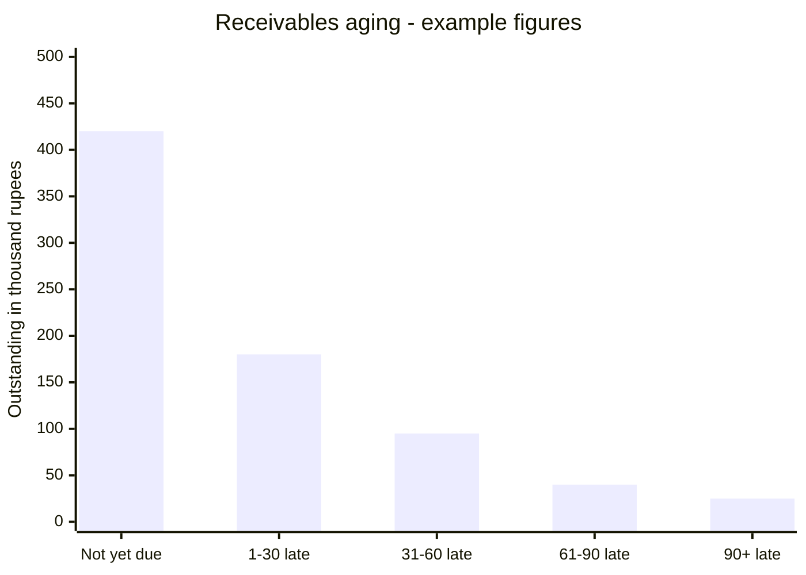
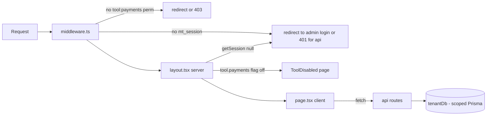
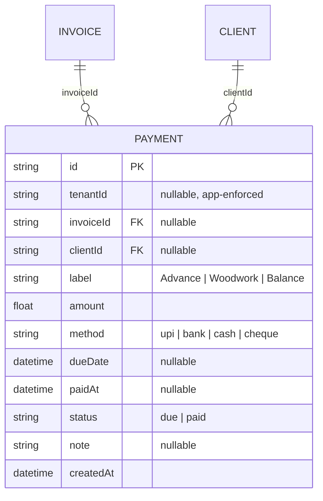
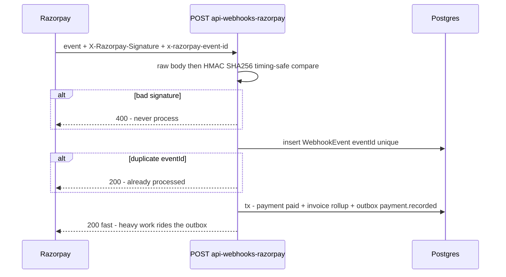
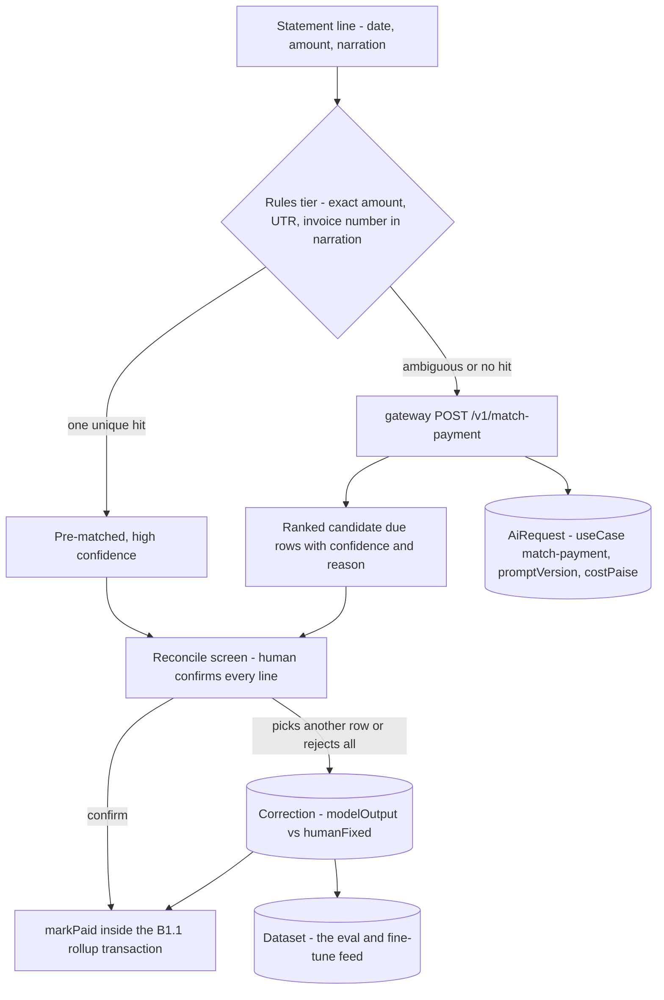

# Payments — engineering bible

Receivables ledger and reminder desk — the last hop of the money chain, tracking dues raised by invoices until they are marked paid.
**Status: suite app `apps/payments`, subdomain `payments.maplefurnishers.com`, dev port `:3008`, container from `maple-suite:latest` with `APP=payments` (docker-compose.yml).**

## For managers — plain-language guide

This is the collections desk — the list of who still owes you money and how late they are. When accounts saves the Sharma wardrobe invoice for ₹86,500, a "due" row appears here on its own; nobody has to remember to add it. From then on this screen runs the chase: the header shows the total outstanding and how much of it is overdue, the Remind button drafts a polite WhatsApp message about the pending balance, and when the NEFT finally lands, one click marks the row paid. Milestone collections — the ₹25,000 advance before work starts, the woodwork instalment, the balance on delivery — are added by hand with the form. One honest caveat: marking a row paid here does *not* update the invoice itself, which keeps saying "unpaid" — this screen is the truth about collections, not the invoice list.

| Feature | What it means in your day | Who uses it |
| --- | --- | --- |
| Payments table (label, client + invoice, amount, method, due date, status badge) | Every rupee owed to you, one row each — the Sharma balance, the Mehra advance — with a red-flavoured badge when it's still due | Accounts, owner (the `admin` and `accounts` roles hold access — sales cannot open this app) |
| Header totals (outstanding, overdue, due/paid counts) | Walk in Monday morning and see "₹4.2 lakh outstanding, ₹1.1 lakh overdue" before your chai cools | Owner |
| Manual create form (label, amount, method, due date) | Add the ₹25,000 advance due before the workshop starts cutting — the milestone dues that never had an invoice | Accounts |
| Automatic dues from invoice saves | Save an invoice in the invoices app; the receivable appears here by itself — the one automatic hand-off in the whole chain | Nobody — it just happens |
| Mark paid | The UPI hit at 6 pm; one click and the row turns green with today's date stamped on it | Accounts |
| Remind (copies message to clipboard) | One click writes "Dear Sharma ji, a gentle reminder that ₹86,500 against invoice MF-INV-… is due…" ready to paste into WhatsApp | Accounts |
| Delete | Remove a row raised by mistake — careful: there is no "are you sure" prompt today | Accounts, admin |

The two statuses in plain words: **due** — the money hasn't arrived yet (and if the due date has passed, the screen shows it as overdue — that's calculated on the fly, not stored anywhere); **paid** — the money is in, with the date it landed.

Where this screen is headed (B3.3): today you get two totals; the designed receivables view breaks the overdue pile into age buckets, because a bill 10 days late needs a nudge while one 90 days late needs a phone call. Example of what that will look like:



Signs it's working:

- Every saved invoice shows up here as a due row the same minute — if accounts is retyping receivables by hand, the hand-off broke.
- The overdue number shrinks week on week, or at least the same names aren't in it month after month.
- Rows get marked paid the day money lands (the `paidAt` dates match bank statement dates), so the outstanding figure is one you'd bet on.

This page is written in two halves. **Part A** is for anyone implementing or debugging inside the module as it exists — every file, every lifecycle, every verified sharp edge. **Part B** is for architects: the cross-module contracts this module must eventually honour (the invoice-status rollup above all), the infrastructure it will sit on, and the designed-but-unbuilt enhancements — chiefly the full Razorpay integration — specified deeply enough to estimate and build from.

---

## Part A — for implementers

### A1 — What this module is today

One screen, one model, four endpoints. The app renders a payments table (ordered `createdAt desc`) showing label, client + invoice number, amount, method (`upi | bank | cash | cheque`), due date, and a status badge; a header shows outstanding total (sum of `due` rows), overdue total (due rows past `dueDate` — computed **client-side only**, never stored), and due/paid counts (`app/page.tsx`).

Rows enter the ledger two ways:

1. **Manual** — the inline create form: label, amount (required), method, due date. Intended for milestone dues (Advance / Woodwork / Balance).
2. **Automatic** — `POST /api/invoices` in the invoices app creates a `due` Payment for each saved invoice's grand total. This is the **only automated hop in the entire money chain** ([cross-module.md](cross-module.html)).

Two actions close the loop:

- **Mark paid** — `PATCH {markPaid: true}` sets `status="paid"` and stamps `paidAt` server-side. It does **not** touch the parent invoice (see A2 and B1 — this is the module's defining gap).
- **Remind** — composes a polite reminder string (client name, label, amount, invoice number, due date) and copies it to the clipboard for manual WhatsApp/SMS sending. No messaging integration, no reminder log.

There is no PDF/receipt generation, no pagination, no search, no per-client view. Deleting a row has no confirmation dialog.

Every request to the app crosses three gates in order — worth internalising because two of them are commonly confused:



The subtlety: the Flipt flag check lives **only in the layout** — a disabled `tool.payments` blanks the page but leaves every `/api/payments*` route fully reachable to any session that passes the middleware perm check. That asymmetry is suite-wide (runbook blocker B2 in [team-tasks.md](team-tasks.html)), not a payments quirk, but payments is where it stings: "we turned the module off" does not stop writes to the ledger.

### A2 — File-by-file, lifecycles traced

The app is deliberately tiny — six meaningful files, everything else inherited from `@maple/core`:

| File | Role | Notes |
| --- | --- | --- |
| `apps/payments/app/page.tsx` | The whole UI (`"use client"`) | Table, form, badges, remind/markPaid/delete handlers, overdue derivation |
| `apps/payments/app/api/payments/route.ts` | GET (list), POST (create) | `force-dynamic`; GET catches DB-down → 503 with hint message |
| `apps/payments/app/api/payments/[id]/route.ts` | PATCH, DELETE | Scoped `findFirst` guard, then raw-body update / hard delete |
| `apps/payments/app/api/auth/logout/route.ts` | POST | Clears `mt_session` cookie |
| `apps/payments/app/layout.tsx` | Server layout | `getSession()` → redirect to admin login; `getBrand()`; `isEnabled("tool.payments")` → `ToolDisabled` fallback; wraps in `SuiteShell` |
| `apps/payments/middleware.ts` | Edge auth | `verifySession(mt_session)` + `canAccessTool(perms, "payments", role)`; matcher excludes `api/auth`, `_next`, static assets |

Shared machinery consumed (never duplicated): `tenantDb()` (Prisma extension auto-scoping the 21 `SCOPED` models by `tenantId` — filters `findMany/findFirst/count/updateMany/deleteMany`, stamps `create`), `money()` from `utils.ts`, and the UI kit (`PageHeader`, `Card`, `Table`, `Badge`, `Input`, `Select`, `Button`).

**Lifecycle 1 — manual create.** Form submit → `POST /api/payments` with `{label, amount, method, dueDate}`. Handler coerces `amount: Number(b.amount || 0)`, converts `dueDate` to `Date`, defaults `status: "due"`, and — critically — sets `clientId: b.clientId || null, invoiceId: b.invoiceId || null`. **The API accepts both FKs; the UI form sends neither** (verified: the form state is only `{label, amount, method, dueDate}`), so every manually created payment is an orphan — attached to no client and no invoice. `tenantDb()` stamps `tenantId` on create.

**Lifecycle 2 — automatic seed from an invoice save.** `POST /api/invoices` (in `apps/invoices/app/api/invoices/route.ts`) runs, in sequence, **without a transaction**:

1. `findOrCreateClient(b.client)` — match by name or create; returns `clientId` (null if no name).
2. `invoice.upsert({ where: { number } })`.
3. `payment.findFirst({ where: { invoiceId: inv.id } })` — if none exists **and** `inv.total > 0`, create `{invoiceId, clientId, label: "Invoice <number>", amount: inv.total, dueDate, status: "due"}`.

Consequences worth memorising: re-saving an invoice with a changed total does **not** update the existing payment row (the `findFirst` guard sees one exists and skips) — the ledger drifts from the invoice; and because the steps aren't transactional, a crash between upsert and create leaves an invoice with no due row. Deleting an invoice sets `Payment.invoiceId` to null (Prisma's default `SetNull` for optional relations) — the due row survives as an orphan.

**Lifecycle 3 — mark paid.** `PATCH /api/payments/[id]` with `{markPaid: true}`. Handler: scoped `findFirst({where:{id}})` guard (404 if outside tenant) → `b.status = "paid"; b.paidAt = new Date(); delete b.markPaid` → `payment.update({where:{id}, data: b})`. **Verified and preserved: `markPaid` never rolls up `Invoice.status`.** The parent invoice stays `unpaid` forever; the schema's `partial` and `paid` invoice statuses are unreachable from this module. The rollup design is B1's first section.

**Lifecycle 4 — the PATCH pass-through (mass assignment).** The same PATCH handler, when not given `markPaid`, coerces `amount` (`Number`) and `dueDate` (`Date`/null) then passes **the raw remaining body** to `payment.update`. Verified: `status`, `label`, `note`, `method`, `paidAt`, `invoiceId`, `clientId`, and even `tenantId` are all settable by any caller who passes the middleware tool gate — a payment can be silently moved to another tenant. Unknown keys throw a Prisma validation error (500), which is accidental input validation at best.

**Lifecycle 5 — remind.** Pure client-side: builds the message string, `navigator.clipboard.writeText`, `alert`. Nothing is persisted — there is no record that a reminder was ever sent, which blocks any "last chased on" workflow.

**Lifecycle 6 — delete.** `DELETE /api/payments/[id]`: scoped guard, hard `payment.delete`. No `act:delete` permission check (the `can()` helper from `rbac.ts` is never imported here), no confirm dialog in the UI, no soft delete. One mis-click erases a receivable with no trace.

### A3 — Data model and API reference

Owned model: `Payment` (`packages/db/prisma/schema.prisma`). Both FKs are real relations **and** both nullable — a payment attached to nothing is legal at the DB level, which is exactly what the manual form produces. `tenantId` nullable, enforced by `tenantDb()` only. No `updatedAt` (unlike DeliveryChallan/Order) — edits are undetectable.



No `partial` status on Payment — partial collection is modeled by multiple payment rows per invoice (Advance/Balance), which is the right shape; the missing piece is the rollup that would make `Invoice.status = partial` true when some-but-not-all rows are paid.

**API surface, with shapes** (all under middleware: valid `mt_session` JWT + `canAccessTool(perms, "payments", role)`; no handler-level `can()` anywhere):

| Route | Request shape | Response shape | Sharp edges |
| --- | --- | --- | --- |
| `GET /api/payments` | — | `Payment[]` with `client: {name} \| null`, `invoice: {number} \| null`, ordered `createdAt desc` | 503 `{error}` when DB down; no pagination — full table every load |
| `POST /api/payments` | `{label?, amount, method?, dueDate?, clientId?, invoiceId?, status?, note?}` | created `Payment` | `amount` defaults to 0 (no positivity check); `status` accepted from caller; UI sends neither FK |
| `PATCH /api/payments/[id]` | `{markPaid: true}` **or** any subset of Payment fields | updated `Payment` | Mass assignment incl. `tenantId`; `amount`/`dueDate` coerced; unknown keys → Prisma 500 |
| `DELETE /api/payments/[id]` | — | `{ok: true}` | Hard delete, no `act:delete`, no audit |
| `POST /api/auth/logout` | — | redirect/cookie clear | Matcher excludes `api/auth` — unauthenticated by design |

Status codes actually used: 200, 404 (`Not found in tenant`), 503 (GET DB-down). POST/PATCH/DELETE have **no** try/catch — a DB outage there is an unhandled 500.

Concrete wire shapes, as the code produces them today:

```jsonc
// GET /api/payments → 200 (one row; note both joins can be null)
[{
  "id": "clx…", "tenantId": "t_…",
  "invoiceId": "cly…", "clientId": "clz…",
  "label": "Invoice MF-INV-20260715-003",
  "amount": 86500, "method": null,
  "dueDate": "2026-07-30T00:00:00.000Z", "paidAt": null,
  "status": "due", "note": null, "createdAt": "2026-07-15T09:12:44.000Z",
  "client": { "name": "Sharma Interiors" }, "invoice": { "number": "MF-INV-20260715-003" }
}]

// POST /api/payments — what the UI actually sends (no FKs, amount as string)
{ "label": "Advance", "amount": "25000", "method": "upi", "dueDate": "2026-08-01" }

// PATCH /api/payments/<id> — the two shapes in use
{ "markPaid": true }                      // → status "paid", paidAt stamped server-side
{ "amount": "90000", "note": "revised" }  // → pass-through after Number()/Date() coercion
```

The `method: null` in the first row is worth noticing: the invoices app's auto-seed (lifecycle 2) never sets `method`, so every automated due row renders `—` in the method column until someone edits it — a small tell distinguishing seeded rows from manual ones, and an accidental data-quality signal the aging dashboard (B3.3) can exploit.

### A4 — Configuration reference

| Variable / knob | Where read | Effect |
| --- | --- | --- |
| `DATABASE_URL` | `packages/core/src/lib/prisma.ts` | Shared Postgres for the whole suite |
| `AUTH_SECRET` | `session.ts` (jose HS256) | Must match the admin app's — SSO verification is local |
| `LOGIN_URL` | `middleware.ts` | Redirect target for anonymous users; defaults to `https://admin.maplefurnishers.com/login` |
| `FLIPT_URL`, `FLIPT_NAMESPACE` | `flags.ts` | `tool.payments` flag; unset ⇒ fail-open (enabled). Flag gates the **page only** — APIs stay reachable when the tool is "off" |
| Dev port `3008` | `PORTS.local.txt` | `npm run -w @maple/app-payments dev -- -p 3008` |
| `APP=payments` | docker-compose.yml | Selects this app inside the shared `maple-suite:latest` image |

RBAC as seeded (`packages/db/prisma/seed.mjs`): `admin` (`*`) and `accounts` hold `tool:payments`; **`sales` cannot open this app**. Seed creates no demo payments — to see the automated flow locally, save an invoice in the invoices app (`:3007`) and the due row appears here. Demo logins `maple@123`.

### A5 — Recipes

- **Add a field (e.g. `reference` for a UTR/cheque number).** Schema: add to `Payment`, `prisma migrate dev`. API: add to the POST create data map (it will NOT flow through otherwise — POST whitelists fields, unlike PATCH). UI: extend the form state + an `<Input>`, extend the `Payment` type literal at the top of `page.tsx`, add a column. PATCH needs nothing (pass-through) — which is the moment to notice the pass-through and whitelist there too.
- **Wire the client/invoice pickers the form is missing.** The API already accepts `clientId`/`invoiceId`. Fetch `GET /api/payments`-style lists from the owning apps is impossible (no cross-app imports) — instead add tiny read endpoints or reuse the pattern CRM uses: a `<Select>` fed by a new `GET /api/clients-lite` route in this app calling `tenantDb().client.findMany({select:{id,name}})`. Send the ids in POST. This single change un-orphans all future manual rows.
- **Kill the mass assignment.** In PATCH, replace `data: b` with an explicit pick: `const data = pick(b, ["label","amount","method","dueDate","status","note","paidAt","clientId","invoiceId"])` — never `tenantId`, never `id`. Same recipe applies verbatim to challans, orders, CRM ([team-tasks.md](team-tasks.html) tracks this class of fix suite-wide).
- **Add `act:delete`.** In the DELETE handler: `const user = await getSession(); if (!can(user?.perms, "delete")) return 403`. The helpers already exist in `rbac.ts`; only admin holds `act:delete` in the seed.
- **Add a confirm dialog.** Match orders/CRM: wrap `remove()` in `if (!confirm("Delete this payment?")) return;`.
- **Add a receipt PDF.** When a payment flips to paid, the client-side pattern already proven in invoices applies wholesale: `@react-pdf/renderer` document + blob download, logo via a `GET /api/brand` route backed by `getBrand()` ([module-invoices.md](module-invoices.html)). Keep it Tenant-branded from day one — the invoice PDF's hard-coded Maple details are a known white-label bug to not repeat — and bundle the font instead of fetching Roboto from a CDN at render time.
- **Add pagination without breaking the header math.** The outstanding/overdue totals are reduced from the full row set in the browser, so naive `take: 50` breaks them. Move the aggregates server-side first (`payment.aggregate` with `_sum`), return `{rows, totals}`, then paginate rows freely.
- **Smoke-test the API from the shell.** Grab `mt_session` from the browser after logging in, then: `curl -s -b "mt_session=$T" localhost:3008/api/payments | jq length` · create: `curl -s -b "mt_session=$T" -H 'Content-Type: application/json' -d '{"label":"Test","amount":"1"}' -X POST localhost:3008/api/payments` · flip: `-d '{"markPaid":true}' -X PATCH …/api/payments/<id>`. There are no automated tests in this app — this loop is currently the whole regression suite; graduate it into vitest route tests against a scratch DB (the pattern quotations' R-suites established).
- **Local run.** `npm i` at repo root, Postgres up, `npx prisma migrate dev` + `node prisma/seed.mjs` in `packages/db`, then the dev command from A4. Log in via the admin app first (SSO cookie is domain-shared in dev via localhost ports — use the login helper described in [deployment-runbook.md](deployment-runbook.html)).

## Testing — how we verify this module

**Honest current state: zero automated tests.** Nothing under `apps/payments` matches `*.test.*` (verify with `find apps/payments -name "*.test.*"`). The A5 curl loop is, as that section admits, "currently the whole regression suite". The root vitest config already includes `apps/**/*.test.{ts,tsx}`; `packages/core` carries three test files (`utils`, `session`, `rbac`) of which only `money()` touches anything this module renders. Playwright exists at the repo root with exactly one spec (`e2e/login.spec.ts`).

**Unit targets** (the handlers are thin, so the first job is extracting their inline logic into testable functions):

- **Date/number coercion in PATCH and POST:** `dueDate: ""` → `null`, valid ISO → `Date`, `"not-a-date"` → Invalid Date reaching Prisma (unhandled 500 — pin it); `amount: "25000"` → number, `amount` absent → 0 on POST (the no-positivity-check gap, asserted so it's a decision, not an accident).
- **markPaid semantics:** `{markPaid: true}` yields `status: "paid"` + server-stamped `paidAt`, and the `markPaid` key never reaches Prisma.
- **The B1.1 rollup function, the day it lands in `receivables.ts`:** recompute-from-aggregate against every edge in the B1.1 table — un-mark regression (`paid → partial → unpaid`), amount edit on a paid row, over-collection past `total`, epsilon behaviour on float drift. This function is the module's future brain; it should be born with its test file. The pinned divergence fixture for `computeInvoiceTotals` vs quotations' `computeTotals` (see the invoices bible's testing section) matters here too — the auto-seeded due row inherits whichever grand total the invoice math produced.
- **Aging bucket math (B3.3), when built:** boundary days 30/31, 60/61, 90/91, and null `dueDate` landing in *current* by decision.

**Integration targets** (routes against scratch Postgres, two tenants). Named regression cases:

| Named case | Asserts | Today |
| --- | --- | --- |
| `REG-mass-assignment-rejection` | PATCH `{ tenantId: "other" }` is rejected; a payment cannot be moved across tenants | **Red** — lifecycle 4's pass-through accepts it |
| `REG-auto-payment-orphaning` | Deleting an invoice does not leave its due row pointing at nothing | **Red** — `SetNull` orphan (lifecycle 2); fix owned by invoices' transactional delete |
| `REG-status-rollup` | Marking the last due row paid flips the parent invoice to `paid` | **Red by design** — B1.1 unbuilt; the test is written against the contract and expected-fails until then |
| Seeded-due drift | Re-saving an invoice with a changed total updates or flags the existing due row | **Red** — `findFirst` guard skips silently (lifecycle 2) |
| Tenant isolation | Tenant B gets 404 on tenant A's payment ids | Green — scoped-guard |
| Delete hygiene | DELETE requires `act:delete` once added; until then, assert the current no-check behaviour so the change is visible | Documents today |

**E2E user stories** (Playwright, live stack — this module's stories deliberately span two apps, because the hand-off *is* the feature):

1. Accounts saves an invoice for ₹86,500 in the invoices app, switches to payments, and finds the due row with the right client, invoice number and amount — the automated hop, end to end.
2. Accounts adds a manual "Advance — ₹25,000" due row, sees outstanding grow, marks it paid, sees outstanding shrink and the paid count tick up.
3. Remind: clicking the button puts the composed message on the clipboard (assert via Playwright's clipboard permissions) containing client name, amount and due date.
4. A sales-role user cannot open the app at all (redirect/403) — the one suite app where sales is locked out.

**Definition of done:** coercion/markPaid logic extracted and unit-tested under `npm test`; the six integration cases exist with reds marked expected-fail-with-reason; E2E stories 1–2 green against `scripts/dev.sh`; the rollup contract test (`REG-status-rollup`) flips from expected-fail to required the same PR that ships B1.1 — that flip is the acceptance test for the module's biggest gap.

---

## Part B — for architects

### B1 — Cross-module contracts, in detail

#### B1.1 The invoice-status rollup — the module's one load-bearing contract

Today the money chain ends in a lie: an invoice whose every payment row is paid still reports `status: "unpaid"` ([cross-module.md](cross-module.html)). The fix is a **derived-status contract**: `Invoice.status` is never hand-set; it is a pure function of the invoice's payment rows, recomputed inside the same transaction as any payment mutation.

Definition (the only sane one given multiple rows per invoice):

```
paidSum   = Σ amount of payments where invoiceId = I and status = "paid"
status(I) = paid     if paidSum >= I.total (small epsilon for float drift)
          = partial  if 0 < paidSum < I.total
          = unpaid   if paidSum == 0
```

Implementation contract — every mutation that can change `paidSum` for an invoice-linked payment (PATCH markPaid, PATCH amount/status edits, DELETE, POST with `invoiceId`, and the future webhook handler in B3) must run:

```ts
await db.$transaction(async (tx) => {
  const p = await tx.payment.update(...);           // or create/delete
  if (p.invoiceId) {
    const inv = await tx.invoice.findUnique({ where: { id: p.invoiceId } });
    const agg = await tx.payment.aggregate({
      where: { invoiceId: p.invoiceId, status: "paid" }, _sum: { amount: true } });
    const paid = agg._sum.amount ?? 0;
    await tx.invoice.update({ where: { id: p.invoiceId }, data: {
      status: paid >= inv.total - 0.01 ? "paid" : paid > 0 ? "partial" : "unpaid" } });
  }
});
```

Design points that must survive review: (a) recompute-from-aggregate, never increment — increments drift under retries and make the webhook idempotency story fragile; (b) the epsilon exists because `amount`/`total` are `Float` (a known schema debt — money as float; migrate to `Decimal` or integer paise when Razorpay lands, since Razorpay itself is paise-integer); (c) invoices' own POST must stop accepting `status` from the client once this lands — derived fields have one writer; (d) put the function in `packages/core/src/lib/receivables.ts` so both apps (payments mutations, invoices upsert) call the identical code.

Edge cases the rollup must survive — each one is a real path through today's handlers:

| Mutation | Rollup consequence |
| --- | --- |
| Un-mark: PATCH `{status: "due"}` on a paid row | Invoice can legally regress `paid → partial → unpaid`; the aggregate handles it for free, an incremental counter would not |
| Amount edit on a **paid** row | Changes `paidSum` without any status change — another reason recompute beats increment |
| DELETE of an invoice-linked row | Must trigger the same recompute (delete inside the transaction, then aggregate) |
| Payment with `invoiceId: null` (every manual row today) | No-op by definition — the guard `if (p.invoiceId)` is the entire handling |
| Invoice re-save changes `total` | Rollup must also run from the **invoices** side after upsert — the shared `receivables.ts` function is called from both apps, which is why it lives in core |
| Two rows summing past `total` (over-collection) | Legal — advance exceeds revised invoice; status is `paid`, and the aging view should surface the credit balance rather than hide it |

#### B1.2 The `payment.recorded` event

The suite has **no** `OutboxEvent` model and writes zero events today ([event-catalog.md](event-catalog.html)); the catalog already reserves this event's slot. Frozen schema proposal:

```json
{
  "id": "evt_cuid",
  "type": "payment.recorded",
  "tenantId": "t_...",
  "createdAt": "2026-07-17T10:00:00Z",
  "payload": {
    "paymentId": "pay_row_cuid",
    "invoiceId": "inv_cuid | null",
    "clientId": "cl_cuid | null",
    "amount": 45000,
    "method": "upi | bank | cash | cheque | razorpay",
    "recordedAt": "ISO",
    "source": "manual | invoice-auto | razorpay-webhook",
    "gateway": { "paymentId": "pay_RZP...", "linkId": "plink_..." }
  }
}
```

Written in the **same transaction** as the rollup above (that is the whole point of the outbox pattern — see the dispatch-guarantee rules in [event-catalog.md](event-catalog.html): at-least-once, per-aggregate ordering, consumer idempotency on event id). Consumers: **invoices** (could replace the in-transaction rollup once split into separate services), **finance** (B1.3), **crm** (activity timeline "₹45,000 received").

#### B1.3 Reconciliation contract with the finance module

`FinanceEntry` (the finance app's model) has `type: income`, `amount`, `date`, and a **relation-less `invoiceId` string column** — a dangling pointer today ([module-finance.md](module-finance.html)). The contract to establish: a `paid` Payment is the *source of truth for receivable income*; FinanceEntry income rows for invoice money should be **projections** of `payment.recorded` events, carrying `invoiceId` and (new column) `paymentId`. Rules: one FinanceEntry per payment id (unique index = consumer idempotency); manual FinanceEntry income rows remain legal for non-invoice income but should be flagged distinctly; reconciliation view = payments-paid vs finance-income per period, mismatches surfaced, not silently merged. Until events exist, an acceptable interim is the finance app reading `Payment` directly (same DB) — but write the projection as if events existed so the split is a transport change.

### B2 — Infrastructure: both tracks

The suite runs two honest tracks ([aws-deployment.md](aws-deployment.html)): the **bootstrap track** (today: one box, Docker Compose, Caddy, shared Postgres, Flipt; "no Kubernetes until a human is hired to run it") and the **scale track** (the shape things take when a real white-label customer forces the split). Payments-specific mapping:

| Concern | Bootstrap (build now) | Scale (design for, defer) |
| --- | --- | --- |
| Events | `OutboxEvent` table + a poller loop in-process (cron every 5–10s scanning `pending`) | Kafka topics: `payments.recorded.v1`, `invoices.status.v1` — partition key `invoiceId` (preserves per-aggregate order), consumers in finance/crm with consumer-group offsets |
| Webhook idempotency | Postgres `WebhookEvent(eventId unique)` table — insert-or-skip | Redis `SETNX rzp:evt:<x-razorpay-event-id> 1 EX 172800` as the fast gate, Postgres row as the durable record — check Redis, fall through to DB on miss |
| Webhook ingress | One public route on the payments container, Caddy-routed; secret in `.env` | Dedicated `payments-webhook` Deployment (2+ replicas, no session affinity needed — idempotency handles races), K8s Secret for the webhook secret, HPA on request rate |
| Config | `.env` per compose service | K8s profiles per module: Deployment + Service + Ingress + ExternalSecret; the module contract in [aws-deployment.md](aws-deployment.html) §3 already defines the container shape |
| Health | Add `/api/health` (runbook blocker D2 — still missing here) | Same endpoint becomes the liveness/readiness probe |

The one rule that keeps both tracks compatible: **the webhook handler's logic is identical on both** — verify signature → idempotency gate → transaction (payment upsert + rollup + outbox row) → 200. Only the idempotency store and the transport around it change.

### B3 — Designed enhancements, in depth

#### B3.1 Razorpay integration, end-to-end

The single highest-value enhancement: collect instead of just track. Four pieces.

**(1) Payment links on invoices.** New table `GatewayLink { id, tenantId, invoiceId FK, paymentId FK?, provider: "razorpay", linkId, shortUrl, amount Int (paise), status, createdAt, expiresAt }`. A "Collect online" action on an invoice (or a due payment row) calls Razorpay's [Create Standard Payment Link API](https://razorpay.com/docs/api/payments/payment-links/create-standard/) with: `amount` in **paise** (integer, min 100 = ₹1), `reference_id` = our Payment row id (max 40 chars, **must be unique per link** — Razorpay rejects duplicates, which conveniently prevents double-linking a due row), `customer` from the Client row, `notify: {sms, email}`, `reminder_enable: true` (replaces our clipboard reminders with gateway-native ones), `notes` (≤15 pairs — stash `tenantId`, `invoiceNumber`), `callback_url` back to the invoice page (`callback_method: "get"`), `expire_by` ≤ 6 months out. Link statuses to mirror: `created → partially_paid → paid | cancelled | expired`. Keys live per-tenant, encrypted, following the exact pattern quotations already proved for Anthropic keys ([ai-layer.md](ai-layer.html)).

**(2) Webhook handler.** New **public** route `POST /api/webhooks/razorpay` (added to the middleware matcher's exclusions, like `api/auth`). Per Razorpay's [validation docs](https://razorpay.com/docs/webhooks/validate-test/):

- **Signature**: `X-Razorpay-Signature` header = HMAC-SHA256 over the **raw request body** with the webhook secret as key. Read the body with `await req.text()` **before** any JSON parse — re-serialised JSON will not match. Compare with `crypto.timingSafeEqual`, never `===` (timing attacks). The Node SDK ships `validateWebhookSignature` if we prefer not to hand-roll. After secret rotation, retried deliveries may be signed with the **old** secret — keep the previous secret valid for a grace window.
- **Idempotency**: `x-razorpay-event-id` is unique per event — insert into `WebhookEvent(eventId unique, payload, processedAt)`; on unique-violation, return 200 immediately (already processed). This is the Redis/Postgres gate from B2.
- **Ordering**: Razorpay documents that events may arrive **out of order** (`payment.captured` before `payment.authorized`). Handlers must be state-machine tolerant: apply "paid" idempotently, ignore late "authorized" for an already-captured payment.
- **Events subscribed**: `payment_link.paid` (primary — flips our Payment row), `payment.captured`, `payment.failed`, `refund.created`, `refund.processed` ([payment-link events](https://razorpay.com/docs/webhooks/payment-links/), [payment events](https://razorpay.com/docs/webhooks/payments/)).
- **Processing**: inside one transaction — mark Payment `paid` (stamp `paidAt`, `method: "razorpay"`, store gateway payment id in `note`/new column), run the B1.1 rollup, write `payment.recorded` outbox row. Return 200 fast; heavy work goes through the outbox.
- **Fallback**: Razorpay's guidance is webhooks-for-automation plus an **API fetch when a webhook hasn't arrived in time** ([webhooks overview](https://razorpay.com/docs/webhooks/)) — add a reconcile poll (below) rather than trusting delivery.

The whole handler, as a sequence:



**Key management.** Per-tenant `key_id`/`key_secret` plus webhook secret, stored encrypted with the exact AES-GCM-under-`ENCRYPTION_KEY` pattern quotations proved for Anthropic keys ([ai-layer.md](ai-layer.html)); admin gets a "Payment gateway" settings card next to the AI-key card. The webhook route resolves the tenant **before** signature verification (one endpoint per tenant subdomain — Host header — or `notes.tenantId` cross-checked after verification; the former is simpler and keeps the secret lookup deterministic).

**Test plan before real money.** Razorpay test mode end-to-end (test keys, dashboard-fired test webhooks); replay a captured webhook body twice and assert exactly one state change (idempotency); replay with one flipped byte and assert 400 (signature); deliver `payment.captured` before `payment.authorized` and assert the final state is paid (ordering tolerance); kill the DB mid-handler and assert Razorpay's retry lands cleanly later (the unique-insert gate makes the retry safe).

Event-to-action map for the handler, so nobody re-derives it during implementation:

| Webhook event | Handler action |
| --- | --- |
| `payment_link.paid` | Flip linked Payment row → `paid`, stamp `paidAt`, rollup, outbox `payment.recorded` |
| `payment.captured` | Idempotent confirm (usually a no-op after `payment_link.paid`); record gateway payment id |
| `payment.authorized` | Log only — capture is the money event; may arrive after captured (ordering) |
| `payment.failed` | Log against the GatewayLink; row stays `due`; surface in reconcile UI |
| `refund.created` / `refund.processed` | Create negative-amount paid row (B3.1 §4), rollup — invoice may regress to `partial` |

**(3) Reconciliation UI.** A `/reconcile` tab: left column = gateway truth (fetched links/payments per day via API), right column = ledger truth (Payment rows). Match on `reference_id`. Buckets: matched (green), gateway-paid-but-ledger-due (webhook missed — one-click apply, runs the same handler code path), ledger-paid-but-no-gateway-record (manual entry — fine, labelled), amount mismatch (partial payments on a link: Razorpay links support `partially_paid`). A nightly job runs the same matching headlessly and writes discrepancies to a table the UI reads — the job *is* the webhook safety net.

**(4) Refunds.** Refund via Razorpay's refund API creates `refund.created/processed` webhooks. Model refunds as **negative-amount Payment rows** (`label: "Refund — <reason>"`, `status: "paid"`, linked to same invoice) so the B1.1 aggregate stays a single sum and an invoice can naturally regress `paid → partial`. Refund initiation from our UI needs `act:refund` (new action key in `rbac.ts` `ACTIONS`) — this is the first genuinely dangerous button in the module.

Rollout order: (2) before (1) — the handler must exist before any link can be paid; test-mode keys end-to-end; reconcile job (3) before go-live; refunds (4) last.

#### B3.2 Manual UPI / bank-transfer recording UX

Most Indian B2B money still arrives as a bank transfer or a UPI push with no gateway in the loop. Upgrade "Mark paid" from a one-click flip to a small dialog: amount actually received (pre-filled, editable — enables partials by splitting the row: paid part + remaining due row), date received (defaults today; back-dating legal), method, **reference** (UTR for NEFT/IMPS/RTGS, UPI transaction id, cheque number — the new `reference` column from A5), note. Under the hood it is still PATCH, but through a whitelist, inside the rollup transaction. This dialog is also where the receipt-PDF hook belongs eventually.

#### B3.3 Receivables dashboard (aging buckets)

The header rollups grow into a proper receivables view: buckets **current / 1–30 / 31–60 / 61–90 / 90+ days** past due, each with count + ₹; per-client aging table (needs the client picker from A5, else everything groups under "—"); DSO trend; "top 5 overdue" with one-click remind. All computable from existing columns, no schema change — the whole report is one grouped query:

```sql
SELECT "clientId",
  SUM(amount) FILTER (WHERE "dueDate" >= now() OR "dueDate" IS NULL) AS current,
  SUM(amount) FILTER (WHERE now() - "dueDate" <  interval '31 days'
                        AND "dueDate" < now())                        AS d1_30,
  SUM(amount) FILTER (WHERE now() - "dueDate" >= interval '31 days'
                        AND now() - "dueDate" < interval '61 days')   AS d31_60,
  SUM(amount) FILTER (WHERE now() - "dueDate" >= interval '61 days'
                        AND now() - "dueDate" < interval '91 days')   AS d61_90,
  SUM(amount) FILTER (WHERE now() - "dueDate" >= interval '91 days')  AS d90_plus
FROM "Payment"
WHERE "tenantId" = $1 AND status = 'due'
GROUP BY "clientId";
```

Server-compute it in a `GET /api/payments/aging` route (Prisma `$queryRaw` or `groupBy`) — the client-side-only overdue derivation (A1) stops being acceptable the moment any other consumer (admin dashboard widget, finance) wants the number, because two implementations of "overdue" will disagree on a timezone boundary within the first month. Null-`dueDate` rows land in *current* by decision, not accident: an undated due is a data-entry gap, not a 90+ delinquency.

### B4 — Scaling

Honest sizing first: a furniture business does hundreds of payments a year — nothing here is compute-bound. The scaling pressures are **multi-tenant blast radius and correctness under concurrency**, not volume:

- **Concurrency**: two simultaneous markPaid/webhook events on one invoice must not interleave rollups — the `$transaction` plus Postgres default isolation is fine at this volume; add `SELECT ... FOR UPDATE` on the invoice row (or serializable) if webhook replays ever race.
- **Money type**: `Float` must become `Decimal`/paise-int before any gateway money touches it (B3.1) — float drift plus epsilon comparisons is how reconciliation reports lie.
- **List growth**: `GET /api/payments` returns the entire table; add `take/cursor` pagination and an index on `(tenantId, status, dueDate)` when a tenant crosses ~5k rows.
- **Multi-tenant split**: the module already satisfies the container contract ([aws-deployment.md](aws-deployment.html) §3) except `/api/health`; per-tenant webhook secrets and keys are the only new tenancy surface Razorpay adds.
- **Sequence to remember**: correctness (rollup, whitelist) → collection (Razorpay) → insight (aging) — scaling work in any other order optimises a ledger that is still wrong.

## AI — use case & pipeline

**Use case: bank/UPI statement line → payment matching.** Most receivables close as a NEFT or UPI push the gateway never sees (B3.2's whole premise). Reconciling means reading forty statement lines — "NEFT-SBIN…-SHARMA INTERIORS-86500" — against the open due rows and remembering who owes what. The AI's job is **candidate ranking, not decision-making**: for each statement line it proposes which open due Payment rows it most plausibly pays, with a confidence and a stated reason; a human confirms every match on the reconcile screen, and a confirmed match runs the same B1.1 rollup transaction that markPaid runs today. Rules go first — a line whose amount matches exactly one open row, or whose narration contains an invoice number or a UTR already stored in the B3.2 `reference` field, needs no model call at all.



| Contract | Detail |
| --- | --- |
| Endpoint | `POST {gateway}/v1/match-payment` — the module never holds a model key; keys, models and spend live in the gateway ([ai-layer.md](ai-layer.html)) |
| Input | one statement line `{date, amountPaise, narration}` + the tenant's open due rows, ≤50: `{paymentId, amountPaise, clientName, invoiceNumber, dueDate}` |
| `json_schema` (structured output, `additionalProperties: false`) | `{ matches: [{ paymentId, confidence: "high" \| "medium" \| "low", reason }], noMatch: boolean }` — never-guess rule: an empty `matches` beats an invented one, exactly the catalog parser's `pending` discipline |
| Model + routing | `haiku-4.5` — short-list text ranking, the cheapest task shape; `ModelRoute` can lift a tenant to `sonnet-5` if its bank's narration quality demands it |
| ₹/call | ≈ ₹0.2–0.5 per line — text-only; the [ai-layer.md](ai-layer.html) anchor (₹8–10/page on fable-5) is a full vision PDF page, this is two orders of magnitude cheaper |
| er-platform tables | `AiRequest` (every call), `Correction` (every human override, keyed `aiRequestId`), `AiBudget` (monthly cap), `ModelRoute` (use-case `match-payment`) |

Design notes that keep this honest:

- Statement ingestion is a CSV/paste textarea on the reconcile tab (B3.1's reconciliation UI is the natural home) — no bank API integration is assumed or needed for v1.
- Confirmed matches write the statement line's UTR into the B3.2 `reference` field, so every confirmation makes the *rules* tier stronger — the model call rate should fall month on month.
- Money stays with the human: the model never flips a row to `paid`; the confirm click does, inside the same transaction discipline as every other mutation in B1.1.

**Rollout & eval gate.** Ship the rules tier alone first — it is useful with zero AI spend. Then assemble the eval set from history: ~200 statement lines whose true match is known (confirmed rows carry `paidAt` plus the reference). Gate to enable the model tier per tenant: top-1 accuracy ≥ 90% on the rules-miss subset, and **zero high-confidence wrong matches** — a wrong suggestion confidently confirmed corrupts the ledger and is worse than no suggestion. Re-run the set on every `promptVersion` bump. **Not before:** the B1.1 rollup and the B3.2 reference field exist, and a tenant actually reconciles more than ~50 manual bank lines a month — below that, the reconcile screen with rules alone is faster than any model round-trip, and Razorpay-collected dues (B3.1) never need this pipeline at all.

### B5 — Status: done, left, decisions

**Done ✓**
- Tenant-scoped CRUD; auto-seeded dues from invoice saves; `markPaid` with server-side `paidAt`.
- Outstanding/overdue rollups, overdue badge logic, clipboard payment reminders.
- SSO middleware, `tool.payments` flag, DB-down/loading/empty states.

**Left ◻ (carried, with owners in [team-tasks.md](team-tasks.html))**
- Paid payments don't roll up to `Invoice.status` (`partial`/`paid` unreachable) — the chain's biggest gap; design frozen in B1.1.
- Manual form can't link a client or invoice (API accepts both; UI sends neither) — orphan rows by default; recipe in A5.
- Reminders clipboard-only — no WhatsApp/SMS/email integration, no reminder log; superseded by Razorpay `notify`/`reminder_enable` for gateway dues (B3.1).
- No `OutboxEvent`; `payment.recorded` schema frozen in B1.2.
- Action-level permission checks missing (DELETE lacks `act:delete`); PATCH mass assignment incl. `tenantId`.
- Invoice re-save doesn't update the seeded due row; invoice delete orphans it (A2 lifecycle 2).
- No delete confirmation; no `/api/health`; no tests under `apps/payments`; no pagination.

**Decisions taken (record, don't relitigate)**
- Partial collection = multiple Payment rows per invoice, not a `partial` payment status — keeps each row atomic; rollup derives invoice-level partiality.
- `Invoice.status` becomes derived-only (single writer: the rollup transaction) once B1.1 lands.
- Refunds = negative-amount rows, not a separate model.
- Razorpay `reference_id` = Payment row id — gateway-enforced uniqueness doubles as double-link protection.
- Bootstrap idempotency in Postgres, Redis only at scale — no new infra before it pays rent.
