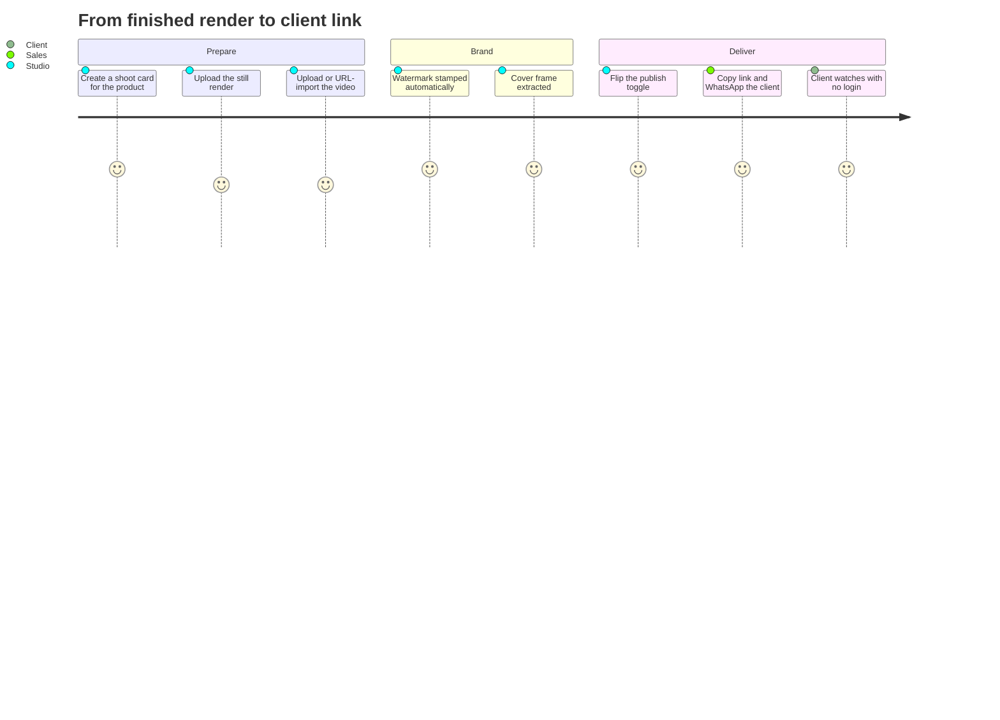
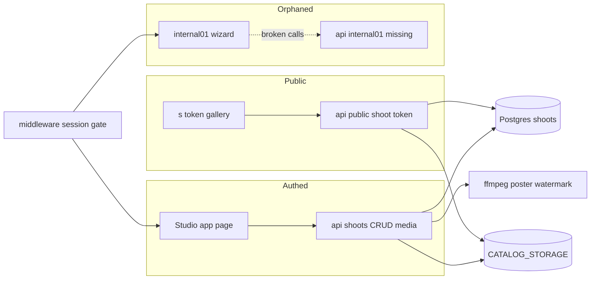
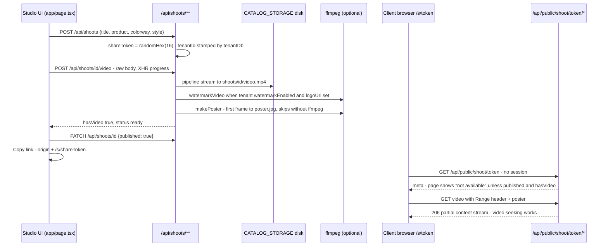
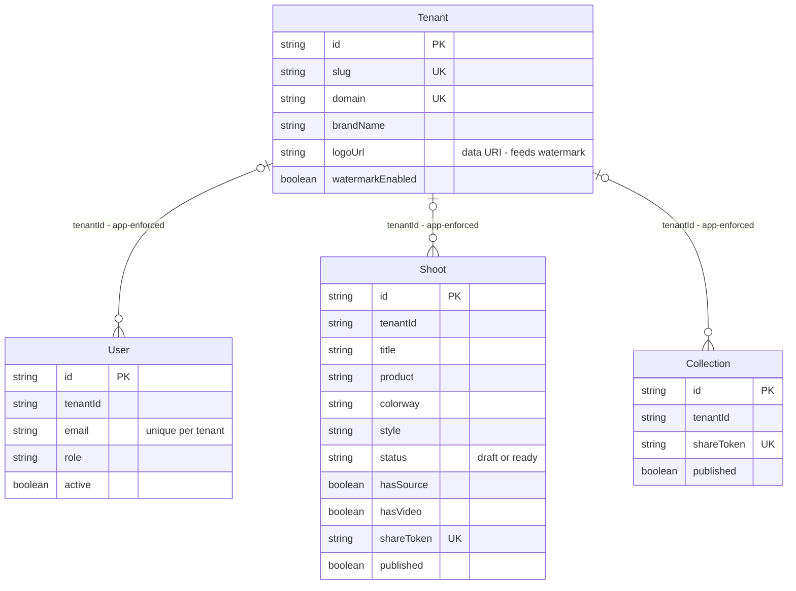
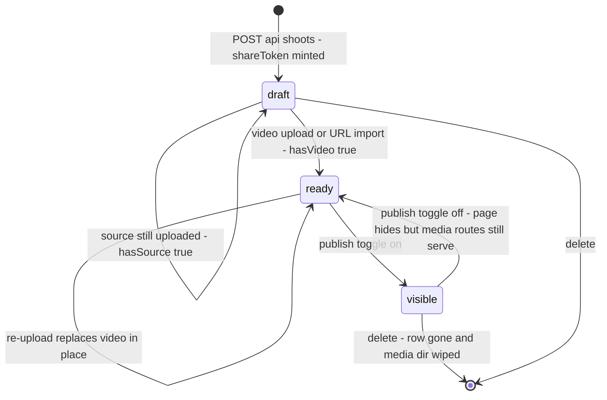
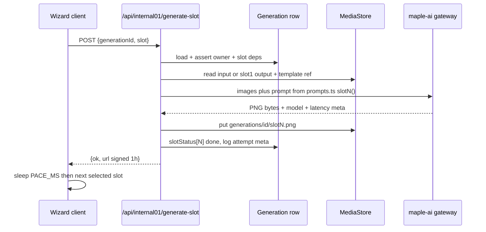
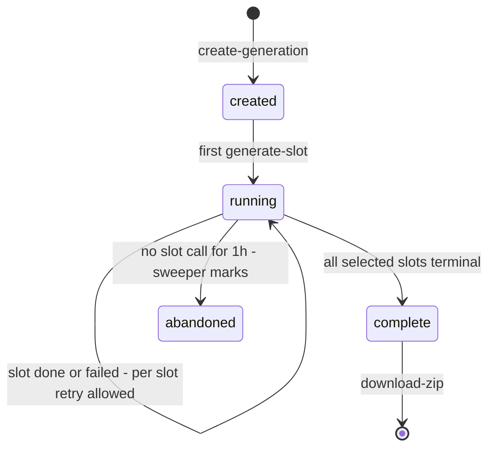
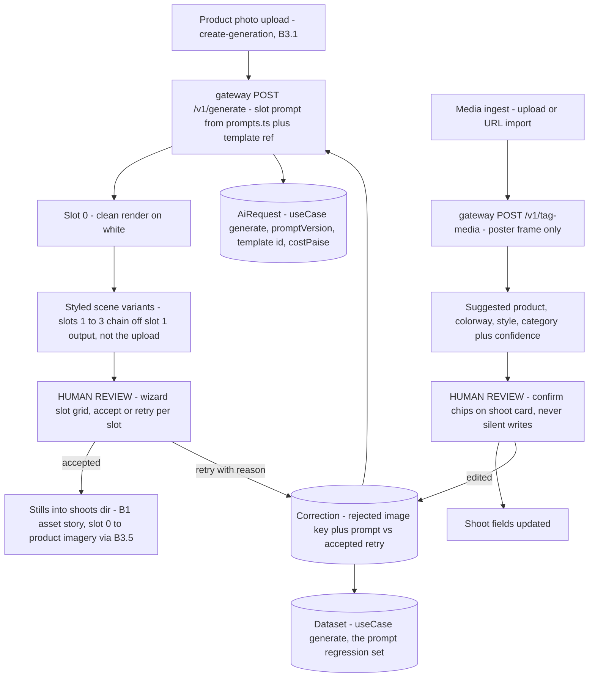

# Photoshoot — engineering bible

Photoshoot Studio: turn product renders into shareable cinematic videos — create a shoot, upload or URL-import the video, get an ffmpeg poster + optional watermark, publish, and hand the client a tokenized public gallery link with Range-streamed playback.

**Status:** standalone repo `maple-tools/maple-photoshoot` (WIP extraction, 2 commits: `4ef4b6c` extraction, `f7034e3` continuation) · suite copy `maple-suite/apps/photoshoot` (same shoots/public API byte-for-byte — the standalone adds local login, `/login`, and the orphaned `/internal01`) · dev port **:3021** locally by convention (`npm run dev -- -p 3021`; plain `npm run dev` binds :3000, the suite copy runs on :3010 per `PORTS.local.txt`) · **local login** at `app/login` + `POST /api/auth/login` (added in the standalone; the suite copy redirects to admin SSO), middleware public routes: `/login`, `/s/`, `/api/public`, `/api/auth`.

## For managers — plain-language guide

This is the studio where finished product videos become client deliverables. Your 3D artist or video vendor produces a cinematic clip of, say, the new Sheesham bed; this tool brands it with your logo, wraps it in a clean dark player page, and gives you a private link to send the client — who watches it in their browser with no login, no app, no file transfer.

| Feature | What it means in your day | Who uses it |
| --- | --- | --- |
| Shoot cards (create / edit / delete) | A Gurugram client wants to see the upholstered bed range before visiting: create a card per product with title, colourway and style — the studio dashboard shows every shoot's state at a glance | Studio / marketing |
| Source render upload | Drop in the still render first — it doubles as the cover image until the video arrives | Studio |
| Video upload with progress bar | Upload the finished clip (even a large 4K file) and watch a real progress bar — no guessing whether it stalled | Studio |
| Import by URL | Your render vendor sends a download link instead of a file — paste it and the server fetches the video itself | Studio |
| Automatic watermark + poster | If watermarking is on for your brand, the logo is stamped bottom-right; a cover frame is extracted automatically for previews | Automatic |
| Publish toggle + client gallery link | Flip Publish, copy the link, WhatsApp it — the client sees a polished dark player that autoplays, loops, and lets them seek and download | Sales / client |
| Single-tool sidebar | The app shows only Photoshoot in its menu for now — the full suite menu returns when it rejoins the suite | Everyone |
| `/internal01` wizard (parked) | An inherited 7-step AI product-photography wizard that is currently disconnected — it does nothing today; reviving or deleting it is a pending business decision | Nobody (yet) |



**Signs it's working:**
- A copied gallery link opens in a private/incognito window and the video plays and *seeks* smoothly — that is the whole client experience.
- New uploads show the watermark and a proper cover frame; if covers stop appearing, the server's video tooling (ffmpeg) is missing — uploads still work but branding silently stops.
- Unpublished shoots show "not available" on their link page; only published shoots with a video are presented to clients.

---

## Part A — for implementers

### A1 · What it does

- **Shoot CRUD** (`app/page.tsx`, single-page client studio): create a shoot with title/product/colorway/style; every shoot gets a `shareToken = randomHex(16)` (128 bits of `crypto.randomBytes`) at creation. Cards show live/draft badges, upload progress, publish toggle, copy-link, download, delete.
- **Source render upload**: image → sharp resize (1600px max width, `withoutEnlargement`) → `source.webp` (quality 80) on disk; doubles as the poster until a video exists.
- **Video upload with progress**: raw request body streamed straight to `video.mp4` via `stream/promises pipeline` (XHR `upload.onprogress` in the UI — this is why the client uses `XMLHttpRequest`, not `fetch`), or **import by URL** from an external render pipeline (server fetches the URL and streams it to disk through the identical tail).
- **Watermark + poster** (best-effort, both skip silently without ffmpeg on PATH): if `Tenant.watermarkEnabled` and `Tenant.logoUrl` (a data URI) is set, ffmpeg overlays the logo bottom-right at 18% width / 75% opacity; a first-frame 900px-wide `poster.jpg` is extracted after every video write.
- **Publish toggle + public gallery**: `/s/[token]` is a session-free dark-theme player page (autoplay/muted/loop/download); the `<video>` element streams via Range requests (`206 Partial Content`) so seeking works.
- **Trimmed nav**: `src/lib/nav.ts` `TOOLS` lists only `photoshoot` (the full suite list is commented out for restore at fold-in), so the vendored `SuiteShell` shows a single-tool sidebar.
- **`/internal01`** (orphaned): a 7-slot AI catalog-imagery wizard inherited from **MapleLens** (`~/work/MapleLens`, the Next.js 14 + Supabase ancestor product) — its UI calls `/api/internal01/{generate-slot,create-generation,download-zip}` which **do not exist in this repo**, and its auth/storage go through Supabase (`src/lib/supabase/*`, `src/lib/profile.ts`, hardcoded email allowlist). Dead weight pending the one-stack ruling in B3.1 / B5. Note also that MapleLens gated `/internal01` in its `layout.tsx` (the page comment cites commit `7ed220c`); this repo's `app/internal01/layout.tsx` is a **bare passthrough** — only the session middleware protects the page here.

What it is *not*: it does no generation itself. The studio is the **downstream half** of an AI pipeline — renders and videos are produced elsewhere (today: manually, via MapleLens-style tools) and land here for branding, review, and client delivery. B3.1 designs the missing upstream half.

### A2 · Code architecture + request lifecycles



| Piece | Path | Notes |
| --- | --- | --- |
| Studio page | `app/page.tsx` | Client component: create form + shoot cards with upload/publish/copy-link |
| Public gallery | `app/s/[token]/page.tsx` | Session-free player, hides unpublished/videoless shoots **client-side** |
| Login page | `app/login/*` | Standalone-only; `?next=` follows same-origin relative paths only (`startsWith("/") && !startsWith("//")`) |
| Shoot APIs | `app/api/shoots/**` | CRUD + source/video/import, all tenant-guarded via scoped `findFirst` before unique-key writes |
| Public APIs | `app/api/public/shoot/[token]/**` | meta / video (Range) / poster — raw `prisma`, token is the capability |
| Auth APIs | `app/api/auth/{login,logout}` | Login is tenant-scoped (`currentTenant()` from host) and resolves perms via the `Role` table |
| Auth gate | `middleware.ts` | Standalone rewrite: local `/login` fallback, `LOGIN_URL` switches to suite SSO, JSON 401/403 for APIs |
| Root layout | `app/layout.tsx` | Signed-out/public requests render bare children (no redirect → no loop on `/login`); authed users get `SuiteShell` behind the `tool.photoshoot` Flipt flag |
| File store | `src/lib/storage.ts` | `CATALOG_STORAGE` root (default `./.catalog-store`): `shoots/<id>/{source.webp,video.mp4,poster.jpg}` — plus an unused `collections/` tree |
| Streaming | `src/lib/filestream.ts` | `fileResponse` + Range-aware `rangeFileResponse` (206) |
| ffmpeg helpers | `src/lib/poster.ts`, `src/lib/watermark.ts` | Spawned processes, resolve-on-error, `stdio: "ignore"` |
| Supabase remnants | `src/lib/supabase/*`, `src/lib/internal01/*`, `src/lib/profile.ts` | Only used by `/internal01`; a second, unwired auth/storage stack |

`@maple/core` is **vendored via tsconfig paths** (`@maple/core/lib/*` → `./src/lib/*`, `@maple/core/ui/*` → `./src/components/ui/*`, plus `@/*` → `./src/*`) — the vendoring is untrimmed, so suite-only libs and core test files ride along unused. Tenant scoping uses the same `tenantDb()` Prisma `$extends` as quotations: it filters `findMany/findFirst/count/updateMany/deleteMany` by `tenantId` and stamps it on `create` — it does **not** touch `findUnique/update/delete`, which is why every mutating route does a scoped `findFirst({ where: { id } })` guard first. State: Postgres for shoot rows, the `CATALOG_STORAGE` directory for all media bytes, nothing client-side beyond the working page.

#### Vendored core inventory

| Bucket | Files | Verdict |
| --- | --- | --- |
| Load-bearing | `session`, `auth`, `rbac`, `permissions`, `tenant`, `tenant-db`, `brand`, `flags`, `prisma`, `slug`, `nav`, `cn`, `storage`, `filestream`, `poster`, `watermark`, `clientLink` | Keep — the module's actual runtime |
| Suite-only dead weight | `hr.ts`, `invoice.ts`, `pdf-render.ts`, `sso.ts`, `constants.ts` (suite tool list), `maple-logo-b64.ts` | Delete at B3.2 trim; restore from suite at fold-in |
| Unrunnable tests | `utils.test.ts`, `session.test.ts`, `rbac.test.ts`, `ui/button.test.tsx` | No test script, no vitest in `package.json` — dead files today |
| Second stack | `supabase/{client,server,middleware}.ts`, `internal01/{types,templates,prompts,storage,auth,allowlist,watermark}.ts`, `profile.ts` | Orphaned with `/internal01` — B3.1 decides |

Note `internal01/watermark.ts` is a documented no-op: `applyInternal01Watermark` returns the buffer unchanged, with the full sharp implementation waiting in a comment for a watermark PNG that was never delivered ("Anish will provide"). Every internal01 output was wired through it so only the function body needs filling.

#### Tenant resolution & session plumbing

Every request resolves its tenant from the **Host header**: `brand.ts registrable()` naively takes the last two dot-labels (`photoshoot.mf.com` → `mf.com`; would mis-split `foo.co.uk` — fine for this deployment, don't reuse elsewhere), looks up `Tenant.domain`, and caches per-domain for 60s. `currentTenant()` — used by login and the watermark step — has a **fallback chain: domain match → slug `"maple"` → first tenant row**. Consequence: a request on any unrecognized host (raw IP, staging domain) silently binds to the default tenant, so login on a misconfigured host authenticates against the default tenant's users rather than failing. Sessions are stateless jose HS256 JWTs (`mt_session`, 7 days, `sub` = user id, embedded `perms` + `tid`); any suite app sharing `AUTH_SECRET` + `COOKIE_DOMAIN=.mf.com` can verify them — that *is* the suite SSO mechanism. Perms are resolved from the `Role` table **once at login** and frozen into the JWT: role/permission edits don't take effect until re-login, and `canAccessTool` falls back to a legacy role→tool map for pre-perms sessions with empty `perms` arrays.

#### Lifecycle 1 — create → upload → poster → publish → public playback



Trace details worth knowing when you touch this path:

1. **Upload is truly streaming** — `Readable.fromWeb(req.body)` piped to `fs.createWriteStream`, so a 500MB video never buffers in Node memory. The **source image path is not**: `Buffer.from(await req.arrayBuffer())` holds the whole image in RAM before sharp (fine at render sizes, a foot-gun if reused for video-sized payloads).
2. **There is no size cap and no content-type check** on either upload route. Whatever bytes arrive become `video.mp4`. `maxDuration = 300` is exported but only enforced on Vercel-style runtimes.
3. **Watermarking re-encodes in place**: ffmpeg writes `video.mp4.wm.mp4` with default libx264 settings (`-c:a copy` audio passthrough) and renames over the original on exit 0 — on any failure the temp file is removed and the original survives. There is **no `-movflags +faststart`**, so the moov atom sits at the tail; playback start relies on the browser issuing Range requests rather than progressive download.
4. **The double DB check is redundant**: `video/source/import` routes do a tenant-scoped `findFirst` **and then** a `findUnique` for the same id. The second call adds a round-trip and nothing else (the first already proves existence in-tenant). Safe to delete when next in the file.
5. **Poster/watermark run inline in the request** — the HTTP response waits for ffmpeg. Acceptable for a 15s render; the reason B3.4 moves this to a background job for real videos.

#### Lifecycle 2 — URL import

`POST /api/shoots/[id]/import` replaces the upload step with a server-side `fetch(url)` piped to the same path, then the identical watermark/poster tail. The only validation is `/^https?:\/\//i` on the string. Verified caveats, all still true:

- **SSRF surface**: the server will fetch `http://169.254.169.254/…`, `http://localhost:5432`, or anything else routable from the box, follow redirects, and write the response body to disk. No host/IP validation, no redirect policy, no response-size cap, no timeout.
- **Disk-fill vector**: a hostile or misbehaving origin can stream unbounded bytes into `CATALOG_STORAGE`.
- Failure mode is a caught `{ error: "Could not import that URL." }` 400 — the shoot row is untouched, but a partially-written `video.mp4` may remain on disk (the write stream is not cleaned up on mid-stream abort).

Fixes belong together: allowlist scheme+host (or at minimum block private/link-local ranges after DNS resolution), `AbortSignal.timeout`, `Content-Length`/streamed byte cap, and temp-file-then-rename.

#### Threat model summary

| Surface | Vector | Standing (verified in code) |
| --- | --- | --- |
| `POST /api/auth/login` | credential stuffing | **open** — no rate limit, no lockout; bcrypt cost 10 is the only brake |
| `POST /api/shoots/[id]/import` | SSRF / disk fill | **open** — regex-only URL check, no timeout or byte cap |
| `GET /api/public/shoot/[token]/{video,poster}` | draft-content disclosure | **open by inertia** — token (128-bit) is the sole gate; `published` unchecked |
| `PATCH/DELETE /api/shoots/[id]` | privilege creep | any `tool:photoshoot` holder can publish/delete — `act:publish`/`act:delete` exist in RBAC + seed but are never checked here |
| Session forgery | missing `AUTH_SECRET` | **latent** — silent fallback to a known dev secret |
| Upload routes | oversized/garbage payloads | no size cap or type sniff; disk is the blast radius |
| `?next=` on login | open redirect | **closed** — relative-path-only check in `login-form.tsx` |
| Cross-tenant reads | IDOR on shoot ids | **closed** — scoped `findFirst` guard precedes every unique-key write |

#### Lifecycle 3 — public delivery

`GET /api/public/shoot/[token]/video` looks up `{ id, hasVideo }` by `shareToken` with **raw `prisma`** (intentionally cross-tenant: the token is the capability) and hands off to `rangeFileResponse`, which parses a single `bytes=start-end` range, clamps `end` to `size-1`, and streams `fs.createReadStream(path, { start, end })` with `Content-Range`/`Accept-Ranges` headers. Suffix ranges (`bytes=-500`) don't match the regex and fall through to a full 200 with `Accept-Ranges: bytes` — spec-tolerable, browsers cope. Multi-range requests are likewise served as full 200s.

**Verified security posture (carried from the original audit, all reconfirmed in code):**

- The **`published` check lives in the page, not the media routes** — `/video` only requires `hasVideo`, and `/poster` requires nothing but a valid token (it will happily serve `source.webp` for a draft shoot with no video at all). An unpublished shoot is fully fetchable by anyone holding the token. The meta route also returns `published: false` along with title/product/colorway — the page uses it to hide, but the data has already left the building. This is token-as-capability, the same trade-off as the catalog module; B3.3 decides it explicitly.
- **Login is not rate-limited** (unlike quotations, which gained a limiter during hardening) — `POST /api/auth/login` will verify bcrypt hashes as fast as you can post JSON.
- **Import URLs are unvalidated** (above).
- `AUTH_SECRET` falls back to `"dev-insecure-secret-change-me"` when unset — fine locally, catastrophic if a deployment forgets the env var, because `mt_session` JWTs become forgeable. Fail hard at boot in production instead.
- The middleware matcher excludes any path ending in a static-asset extension **including `.mp4`** — a future route like `/reports/summary.mp4` would bypass auth entirely. Keep the extension list in mind when adding routes.

### A3 · Data model & API surface

The schema is **untrimmed** — `prisma/schema.prisma` still carries all **22 suite models** (Client, Lead, Quotation, Invoice, Payment, Order, InventoryItem, FinanceEntry, HrDocument, Product, Collection, Shoot, PurchaseOrder, DeliveryChallan, Expense, Tenant, Role, Task, Doc, SitePage, SiteBlock, User) into the standalone `maple_photoshoot` database, and the seed creates the full suite role/user set plus site CMS blocks. Only the four below matter to this module; the rest is inherited suite schema — see [er-suite.md](er-suite.html). `tenantId` columns are bare `String?` (no `@relation`); scoping is app-enforced via `tenantDb()`.



**Shoot, deep:** `id` cuid PK · `tenantId String?` stamped by `tenantDb()` on create · `title` (defaults `"Untitled shoot"` server-side) · `product/colorway/style` free-text metadata rendered as badges · `status` is a bare string, `"draft"` → `"ready"` set by the video routes — note PATCH accepts **any** string for `status` (field-name whitelist only, no value whitelist) · `hasSource/hasVideo` are the disk-state mirrors (the DB never stores paths; paths are derived `STORAGE_ROOT/shoots/<id>/…`) · `shareToken @unique`, 32 hex chars, never rotated (no rotate endpoint — delete and recreate is the only revocation) · `published` gates the page, not the media (A2) · `createdAt/updatedAt`.

The lifecycle, flattened (`status` and `published` are separate columns — this is their combined effect on what a client can see):



`Collection` (the catalog lookbook sibling) is drawn because `storage.ts` still ships both file trees; the app has no collection routes. Schema drift vs standalone quotations to remember at fold-in: here `User.email` is unique **per tenant** (`@@unique([tenantId, email])`) and perms come from the `Role` table at login, whereas quotations has a globally-unique email and a `perms` array on the user row.

#### Full API table

All `/api/*` outside the public matcher require the `mt_session` cookie + `tool:photoshoot` (middleware). Session = jose HS256 JWT, 7-day expiry, cookie `mt_session`, `COOKIE_DOMAIN` for cross-subdomain SSO.

| Method + path | Request shape | Response shape | Auth / notes |
| --- | --- | --- | --- |
| POST `/api/auth/login` | `{email, password}` | `{ok, role}` + Set-Cookie · 401 `{error}` | public — tenant-scoped by host, bcrypt, `Role`→perms · **no rate limiting** |
| POST `/api/auth/logout` | — | `{ok}` (clears cookie) | public |
| GET `/api/shoots` | — | `Shoot[]` newest-updated first · 503 `{error}` if DB down | session |
| POST `/api/shoots` | `{title, product?, colorway?, style?}` | full `Shoot` row | session — mints `shareToken` |
| PATCH `/api/shoots/[id]` | any of `{title, product, colorway, style, published, status}` | updated `Shoot` · 404 if not in tenant | session — **no `act:publish` check**, no status value validation |
| DELETE `/api/shoots/[id]` | — | `{ok}` | session — **no `act:delete` check**; `rmShoot()` wipes the media dir |
| POST `/api/shoots/[id]/source` | raw image bytes | updated `Shoot` (`hasSource`) | session — sharp → 1600px webp; whole-body buffered |
| POST `/api/shoots/[id]/video` | raw video bytes | updated `Shoot` (`hasVideo`, `status: ready`) | session — streamed; watermark+poster inline; `maxDuration 300` |
| POST `/api/shoots/[id]/import` | `{url}` | updated `Shoot` · 400 on fetch fail | session — **unvalidated http(s) target (SSRF)** |
| GET `/api/public/shoot/[token]` | — | `{title, product, colorway, style, hasVideo, published}` | public — leaks meta for unpublished shoots |
| GET `/api/public/shoot/[token]/video` | optional `Range` | 206/200 MP4 stream | public — checks `hasVideo`, **not `published`** |
| GET `/api/public/shoot/[token]/poster` | — | `poster.jpg` → fallback `source.webp` · 404 | public — **no published or hasVideo check**, 24h cache |

Wire-format notes: `sonner` toasts exist in the layout but the studio uses `alert()`/`confirm()` — a cheap polish task. All error bodies are `{error: string}`; the shoots list route is the only one that maps DB-down to a 503 with remediation text.

### A4 · Config reference

| Env | Used by | Default / behaviour |
| --- | --- | --- |
| `DATABASE_URL` | `prisma/schema.prisma` | required — `postgresql://…/maple_photoshoot` |
| `AUTH_SECRET` | `src/lib/session.ts` | falls back to `dev-insecure-secret-change-me` — **must be set in prod**; must match every suite app that shares the cookie |
| `CATALOG_STORAGE` | `src/lib/storage.ts` | `./.catalog-store` in cwd — point at a real volume in any deployment |
| `LOGIN_URL` | `middleware.ts` | unset → local `/login` with relative `?next=`; set → absolute redirect to suite SSO with `x-forwarded-host`-aware absolute return URL |
| `COOKIE_DOMAIN` | `src/lib/session.ts` | unset → host-only cookie (dev); `.mf.com` in prod for stateless cross-subdomain SSO |
| `FLIPT_URL` / `FLIPT_NAMESPACE` | `src/lib/flags.ts` | unset → **fail-open** (every flag true, 1.5s timeout, 30s cache); gates `tool.photoshoot` in the layout |
| `ADMIN_EMAIL` / `ADMIN_PASSWORD` | `prisma/seed.mjs` | seed-time only — default `admin@maplefurnishers.com` / `maple@123` |
| `NODE_ENV` | cookie `secure` flag | `production` → Secure cookies |
| `NEXT_PUBLIC_SUPABASE_URL` / `NEXT_PUBLIC_SUPABASE_ANON_KEY` / `SUPABASE_SERVICE_ROLE_KEY` | `src/lib/supabase/*` | **unset and only referenced by orphaned `/internal01` code** — with `!` assertions, so actually rendering that stack throws |

Non-env runtime dependencies: **ffmpeg on PATH** (optional but load-bearing — without it there are no posters and no watermarks; both helpers resolve silently and uploads still succeed) and **sharp** (bundled, needed for source resize). Dead deps riding along in `package.json`: `pdf-to-img`, `pdfjs-dist`, `@napi-rs/canvas`, `uuid` (catalog-module leftovers), and the two `@supabase/*` packages (internal01-only).

#### Running locally

```bash
createdb maple_photoshoot
npm install                    # postinstall runs prisma generate
npm run db:push && npm run db:seed
npm run dev -- -p 3021         # convention; the script doesn't pin a port
```

- `.env` needs only `DATABASE_URL` + `AUTH_SECRET` today.
- Seed logins: `admin@maplefurnishers.com` / `maple@123` (admin), plus `sales@` / `accounts@` / `hr@` variants at the same password — the seed is the untrimmed suite seed, down to site CMS blocks and a 17-model `tenantId` backfill loop.
- `CATALOG_STORAGE` unset → media lands in `./.catalog-store/shoots/<id>/` in the repo cwd (gitignored by convention — verify before committing after an upload test).
- No ffmpeg installed → everything still works except posters/watermarks; cards show the source render or "No media yet".
- Smoke test: create shoot → upload any small mp4 → watch the XHR progress bar → Publish → open the copied `/s/<token>` link in a private window (no session) → video plays and seeks.

### A5 · Recipes

**Add a metadata field to shoots (e.g. `clientNote`):**
1. `prisma/schema.prisma` → add `clientNote String?` to `Shoot`; `npm run db:push`.
2. `app/api/shoots/route.ts` POST → add to the create `data` map if it should be creatable.
3. `app/api/shoots/[id]/route.ts` PATCH → add `"clientNote"` to the field whitelist array — this array is the *only* mass-assignment guard, so never replace it with a spread of the body.
4. `app/page.tsx` → extend the `Shoot` type literal, the create form, and the card.
5. Decide the public exposure explicitly: `app/api/public/shoot/[token]/route.ts` returns a hand-picked projection — add the field there **only** if clients should see it. The projection-by-hand pattern is the module's anti-leak seam; keep it.

**Add a new public route safely:**
1. Nest it under `app/api/public/…` — that prefix is already in the middleware matcher's exclusion list, so you don't touch the regex (touching the regex is where mistakes happen — remember the `.mp4` extension bypass in A2).
2. Look rows up by `shareToken` with raw `prisma`, never by id, and never trust a tenant from the request.
3. Return a hand-picked projection; check `published` unless you are deliberately extending the token-capability trade-off.
4. For page routes (like `/s/…`), also confirm `app/layout.tsx` treats the signed-out render as bare children — it does this globally today, so new public pages need no layout work.
5. Add cache headers deliberately: media can take `public, max-age=86400`, JSON meta should stay uncached (`force-dynamic` is already on).

**Replace file storage with an S3 driver:**
1. `src/lib/storage.ts` is already the single chokepoint — every path is derived there. Extract its shape into an interface, keys mirroring today's layout (`shoots/<id>/video.mp4` etc.):

```ts
interface MediaStore {
  putStream(key: string, body: Readable): Promise<void>;
  getStream(key: string, range?: { start: number; end: number }): Promise<{ body: ReadableStream; size: number }>;
  stat(key: string): Promise<{ size: number } | null>;   // replaces fs.existsSync checks
  remove(prefix: string): Promise<void>;                  // rmShoot()
  url(key: string, ttlSec?: number): Promise<string | null>; // null on local driver → proxy
}
```
2. Local driver = today's code. S3 driver = `@aws-sdk/lib-storage` `Upload` for `putStream` (multipart, backpressure-aware), `GetObjectCommand` with a `Range` header for `getStream` — S3 speaks Range natively, so `rangeFileResponse` collapses to header passthrough.
3. The bigger win is bypassing Node entirely: have `/api/public/...` **302 to a signed URL** instead of proxying bytes (B2 enterprise track). Keep proxying as the local-driver fallback so the two drivers stay behaviour-compatible.
4. ffmpeg needs local files: poster/watermark steps must download-to-temp, process, re-upload — which is the moment to make them a background job (B3.4) rather than porting the inline-in-request design.

---

## Testing — how we verify this module

**Current state (verified):** **zero runnable tests.** `package.json` has no `test` script and no vitest dependency; the four vendored core test files (`src/lib/{utils,session,rbac}.test.ts`, `src/components/ui/button.test.tsx`) cannot execute — dead files, as A2's vendored-core inventory already records. First move is mechanical: copy quotations' vitest setup (`vitest.config.ts` + `"test": "vitest run"` + the dev deps), which instantly revives those four files (~10 cases covering session sign/verify and the RBAC truth table).

**Unit-test targets** (the pure logic worth pinning, in value order):

| Function | What to pin |
| --- | --- |
| `rangeFileResponse` (`src/lib/filestream.ts:19`) | `bytes=0-99` → 206 + correct `Content-Range`; open-ended `bytes=100-` clamps end to `size-1`; suffix `bytes=-500` and multi-range fall through to full 200 with `Accept-Ranges`; no header → 200 |
| `registrable` / `currentTenant` fallback chain (`src/lib/brand.ts`) | last-two-labels split; unknown host → slug `"maple"` → first row — pin the chain so a future fix to the silent-default hazard (A2) is a *deliberate* behavior change |
| PATCH field whitelist (`app/api/shoots/[id]/route.ts`) | extract the field-copy loop into a pure helper and assert unknown fields are dropped — this array is the only mass-assignment guard |
| `?next=` guard (`app/login/login-form.tsx`) | relative-only: accepts `/x`, rejects `//evil.com` and absolute URLs |
| import-URL validator (once the security batch lands) | scheme allowlist, private/link-local IP rejection after DNS, byte cap — exactly the logic that regresses silently (B5 already names it) |

**Integration tests** (route + scratch DB + tmpdir `CATALOG_STORAGE`; JWT via the vendored `signSession`). The known security gaps from A2's threat model become *named* cases — written red first, they document the gap until each fix lands:

| Case | Route | Asserts |
| --- | --- | --- |
| **Cross-tenant IDOR stays closed** (currently closed — keep it) | PATCH/DELETE `/api/shoots/[id]` with another tenant's session | 404, row and media untouched |
| **Published gate on media routes** (open gap) | GET `/api/public/shoot/[token]/video` + `/poster` for an unpublished shoot | red: expect 404 until B3.3 closes it or the ADR accepts token-as-capability |
| **Import URL SSRF guard** (open gap) | POST `/api/shoots/[id]/import` with `http://169.254.169.254/` and `http://localhost:5432` | red: expect 400 once the validator exists |
| **`act:publish` / `act:delete` enforcement** (open gap) | PATCH `{published:true}` / DELETE as a `tool:photoshoot`-only session | red: expect 403 after the RBAC batch |
| **Login rate limit** (open gap — quotations parity) | 9th failed login | red: expect 429 once built |
| Status value whitelist | PATCH `{status: "garbage"}` | currently accepted — decide the enum, then pin it |
| Range playback | GET video with/without `Range` | 206 + `Content-Range` / plain 200 |
| Upload tail | POST video bytes → row flips | `hasVideo: true`, `status: "ready"`, file exists on disk |

**E2E (Playwright), as user stories:**

1. *Studio publishes a shoot.* Log in → create a shoot → upload a small mp4 fixture → progress bar completes → card shows Ready → Publish → copy link → open it in a fresh browser context (no session) → video plays and seeking works.
2. *Draft stays hidden.* Create a shoot, upload video, do **not** publish → open `/s/<token>` in a fresh context → the "not available" page renders (page-level gate; the media-route gate is the red integration case above).
3. *URL import.* Point import at a local fixture HTTP server → card flips to Ready and a poster appears (skip poster assert when ffmpeg is absent — the degradation is by design).

**Definition of done for new features here:** a new public route ships with a hand-picked projection and an explicit `published` decision recorded; a new mutating shoot route ships with the scoped-`findFirst` guard plus a cross-tenant 404 test; anything touching `filestream.ts` or the middleware matcher adds unit cases (remember the `.mp4` extension bypass); `npm test` green once the harness exists.

---

## Part B — for architects

### B1 · Cross-module relations

**Gallery images → quotations product gallery.** Quotations stores product images as bytes-in-Postgres `Asset` rows (4MB cap); photoshoot stores media on disk keyed by shoot id. The convergence design: photoshoot's *stills* (source renders, and the B3.1 wizard's slot outputs) become `Asset`-compatible objects that the quotations product picker can reference by URL rather than re-uploading — i.e., a `GET /api/public/shoot/[token]/still/[n]` style contract, or (better, post-fold-in) a shared media service where both modules store `mediaKey` strings against one storage driver (A5 recipe 3). Direction of dependency: quotations *references* photoshoot output; photoshoot never reads quotation data.

**`shoot.published` event schema.** Quotations already carries the `OutboxEvent` table (schema-only, no writer — see [cross-module.md](cross-module.html)); photoshoot should emit through the same outbox pattern when publishing:

```json
{
  "type": "photoshoot.shoot.published",
  "v": 1,
  "tenantId": "…",
  "payload": {
    "shootId": "…", "shareToken": "…",
    "title": "…", "product": "…", "colorway": "…", "style": "…",
    "publicUrl": "https://…/s/<token>",
    "media": { "video": true, "poster": true, "durationSec": null }
  }
}
```

Emit on the `published: false → true` transition inside the PATCH route, same transaction as the update (that is the whole point of an outbox). Consumers: the web module (`SitePage` blocks embedding latest shoots), CRM (attach to client timeline), and the future catalog publish flow (B3.5). A matching `photoshoot.shoot.unpublished` keeps consumers honest.

**Client linkage — shoots have no client FK today; the design.** `Shoot` has free-text `product/colorway/style` and nothing pointing at `Client`. Add `clientId String?` (nullable — internal/marketing shoots have no client) plus a `clientSnapshot Json?` mirroring quotations' seam: the FK for live joins in-suite, the snapshot so a standalone deployment or an export survives client deletion. UI: an optional client picker on the create form and a "shoots" tab on the CRM client page (query: `shoot.findMany({ where: { clientId } })`). Gallery consequence: with a client attached, `/s/[token]` can greet by name and B3.3's watermark-until-paid can key off the client's payment state instead of a per-shoot flag.

### B2 · Infra touchpoints — both tracks

**Bootstrap track (single VM, docker-compose):**

- **Shared `/data/catalog` volume**: set `CATALOG_STORAGE=/data/catalog` and mount the same volume into the photoshoot and (future) catalog containers — the `collections/` and `shoots/` subtrees already namespace them. Media bytes never enter Postgres, so pg_dump stays small; back the volume up separately (restic/rsync) and remember DB row + media dir must be restored as a pair (`hasVideo` is a disk-state mirror).
- **ffmpeg in the container**: the image must `apt-get install -y ffmpeg` (or apk equivalent) — there is no Dockerfile yet (verified absent), and a naive `node:22-slim` image silently ships no posters/watermarks because the helpers resolve on spawn error. Add a boot log line asserting `ffmpeg -version` succeeds so the degradation is at least visible.
- **Reverse proxy**: nginx/caddy in front needs `client_max_body_size` raised (500MB+) and `proxy_request_buffering off` for the streaming upload to actually stream; otherwise the proxy buffers the whole video to its own disk first and the XHR progress bar lies.
- **Health**: no `/api/health` exists (verified). Add one returning `{db, ffmpeg, storageWritable}` — all three are runtime dependencies that fail independently.
- **Compose sketch** (the missing pieces made concrete):

```yaml
services:
  photoshoot:
    build: .                      # Dockerfile must apt-get install ffmpeg
    environment:
      DATABASE_URL: postgres://maple:…@db:5432/maple_photoshoot
      AUTH_SECRET: ${AUTH_SECRET:?set me}   # hard-fail, no dev fallback
      CATALOG_STORAGE: /data/catalog
      COOKIE_DOMAIN: .mf.com
    volumes: [ "catalog:/data/catalog" ]
  db:
    image: postgres:16
volumes:
  catalog:
```

**Enterprise track:**

- **S3 + CloudFront signed URLs**: store media via the A5 S3 driver; serve public media by minting CloudFront signed URLs (short TTL, e.g. 15 min) from `/api/public/shoot/[token]/video` and 302-ing. CloudFront over raw S3 presigned URLs because edge caching matters for video and Origin Access Control locks the bucket to the distribution — the standard private-content pattern per [AWS's private-content guide](https://docs.aws.amazon.com/AmazonCloudFront/latest/DeveloperGuide/PrivateContent.html) and the [signed-URL-vs-presigned comparisons](https://www.techopsexamples.com/p/cloudfront-signed-url-vs-s3-pre-signed-url-when-to-use-what). The token check stays in the app (capability → short-lived URL); the bytes never transit Node again, which deletes the module's biggest scaling liability (B4).
- **Transcoding**: two viable shapes. (a) **Managed — AWS MediaConvert**: job per upload, S3-in/S3-out, EventBridge completion events; ~$0.0075–0.015/min ([pricing breakdown](https://32blog.com/en/ffmpeg/ffmpeg-vs-aws-mediaconvert-cost)), zero ops, wins below roughly ~500 videos/month. (b) **ffmpeg workers on a queue**: BullMQ/Redis or Kafka-consumer pods running the exact ffmpeg invocations we already own; teams report >60% cost cuts self-hosting past a few hundred videos/month ([migration writeup](https://dev.to/mustafabalila/how-we-reduced-costs-by-switching-from-aws-mediaconvert-to-a-golang-service-efc)). Given furniture-studio volumes (tens of shoots/month), **start with MediaConvert-shaped managed jobs only if already on AWS; otherwise the bootstrap ffmpeg worker (B3.4) carries surprisingly far** — the break-even math is firmly on managed at this volume.
- **K8s profile**: ffmpeg watermark re-encode of 1080p H.264 wants ~1–2 GiB RSS and a full core; 4K sources spike to 3–4 GiB. Run workers as a separate Deployment with `requests: {cpu: 1, memory: 2Gi} limits: {memory: 4Gi}`, never in the web pods — an OOM-killed web pod drops user sessions, an OOM-killed worker just retries the job. Web pods themselves stay tiny (streaming passthrough is cheap; ~256Mi) once delivery moves to CloudFront.
- **Kafka topics**: `photoshoot.shoot.published` / `photoshoot.shoot.unpublished` (B1 schema, outbox-drained), `photoshoot.media.ingested` (upload/import completed, pre-transcode), `photoshoot.transcode.completed|failed` (worker → app to flip `hasVideo`/renditions state). Partition key `tenantId` everywhere.
- **Redis keys**: `ps:login:<ip>` fixed-window login limiter (the missing one), `ps:job:<shootId>` transcode job status for UI polling, `ps:import:<tenantId>` concurrent-import semaphore (SSRF-adjacent rate control), and the Flipt cache stays in-process (30s TTL is fine).

### B3 · Designed enhancements

#### B3.1 · Revive the generation wizard against the maple-ai gateway

The `/internal01` wizard is a complete, working **client** for a 7-slot furniture-imagery pipeline — upload chair photo → prep (needs-cleaning toggle) → context (furniture type, W/D/H dims, model height) → template pick → slot pick → sequential generation with 15s pacing (`PACE_MS`), per-slot retry, ZIP download. The slots (from `src/lib/internal01/prompts.ts`, all Gemini-image prompts): **0** cleaned product on pure white · **1** hero in template room (single or pair per template `chairCount`) · **2** 3/4 rotation of slot 1 · **3** back view of slot 1 · **4** dimension arrows on white · **5** dims + ruler + translucent human silhouette at `modelHeight` · **6** macro fabric detail with hand. Slots 2/3 hard-depend on slot 1 (the wizard tracks `slot1Done` locally and fails them if 1 didn't run). Three templates ship with reference-room images under `public/internal01/templates/`.

What's missing is the entire server half. **MapleLens** (the ancestor: Next.js 14 + Supabase + Gemini 2.5 Flash Image) shows the shape that worked in production, and its three generation modes are the roadmap beyond the 7 fixed slots: **Quick** (14 tuned presets, one-in-one-out), **Atelier** (12 composable variables, ≤5 variations/batch), **Spaces** (chair + room composition) — plus its hard-won pipeline lessons: user free-text wrapped in a priority sandwich at head *and* tail of the prompt, exponential backoff 2s→32s with a model fallback chain, every attempt logged with model/finish-reason/latency, watermark on free tier, atomic usage billing via a DB RPC.

**Design — the three missing routes, ported off Supabase onto core auth + the storage driver, with generation delegated to the maple-ai gateway** (the suite's single Anthropic/Gemini egress point, same role the direct Gemini SDK played in MapleLens):

- `POST /api/internal01/create-generation` — body: the wizard's existing payload (`inputImageBase64`, mime, filename, `needsCleaning`, `furnitureType`, `dimensions{W,D,H}`, `modelHeight`, `templateId`, `selectedSlots[]`). Validates template id + slot dependencies server-side (the UI warning is advisory), stores the input via the storage driver at `generations/<id>/input.<ext>`, inserts a `Generation` row, returns `{generationId}`.
- `POST /api/internal01/generate-slot` — body `{generationId, slot}`. Loads the generation, asserts ownership (`userId` from `mt_session`, not Supabase), asserts slot-1 output exists for slots 2/3, composes the prompt from `prompts.ts`, calls the gateway with `[inputOrSlotOutput, templateReference?]` images, writes the PNG to `generations/<id>/slot<N>.png`, updates the slot status/URL columns, returns `{ok, url}` where `url` is a signed/short-lived read URL from the driver (replacing `signInternal01Url`). `maxDuration 120` (MapleLens' value).
- `POST /api/internal01/download-zip` — streams a ZIP of all done slots (`jszip` or `archiver`), `Content-Disposition` filename as the wizard already parses.

**Template/slot schema** (replaces Supabase's `internal01_generations` wide row — keep the wide row, it matches the client exactly and 7 is a fixed ceiling):

```
model Generation {
  id            String   @id @default(cuid())
  tenantId      String?
  userId        String
  inputKey      String
  inputFilename String?
  needsCleaning Boolean  @default(true)
  furnitureType String   @default("chair")
  dimW          Float?
  dimD          Float?
  dimH          Float?
  modelHeight   Float    @default(5.8)
  templateId    String
  selectedSlots Int[]
  slotStatus    Json     // {"0":"done","1":"failed",…}
  slotKeys      Json     // {"0":"generations/<id>/slot0.png",…}
  errors        Json     @default("[]")
  createdAt     DateTime @default(now())
}
```

Templates stay code-defined in `templates.ts` (3 rows, versioned in git, reference images in `public/`) until a tenant needs custom rooms — then they become a `Template` table with a storage-driver `referenceKey` and the same `chairCount` field driving the slot-1 prompt fork.

Per-slot flow against the gateway (the input-image column shows why slots 2/3 depend on 1 — they chain off slot 1's *output*, not the original upload):



Gateway contract (the same envelope MapleLens sent Gemini directly, now behind the suite's egress point so keys, model fallback chains, retries, and per-tenant quotas live in one service): `POST /v1/images/generate` with `{tenantId, tool: "internal01", prompt, images: [{mime, base64}], size: "1024x1024"}` → `{image: {mime, base64}, meta: {model, retries, finishReason, latencyMs}}`. Port MapleLens' production lessons into the gateway, not the route: exponential backoff 2s→32s on 429/5xx, fallback model chain on persistent failure or `noImage` finishes, and an `ai_generation_logs`-equivalent table recording every attempt's composed prompt + meta (its `/admin/prompts` viewer proved this is how you debug prompt regressions).

**Job lifecycle** — keep the client-orchestrated sequential model for v1 (it is already built, and its pacing doubles as rate limiting), but make each slot call idempotent and record status server-side so a refresh can resume:



Replace the Supabase allowlist (`allowlist.ts`, two hardcoded emails, 404-not-403 masking) with `can(perms, "generate")` or a `tool:internal01` perm — the RBAC machinery already exists in `rbac.ts` and the seed. Keep the 404-masking behaviour; it's a good idea regardless of auth stack. Wizard output then flows into shoots: a "send stills to shoot" action that copies slot outputs into `shoots/<id>/stills/` closes the loop with B1's asset story. Auth swap + storage swap + these three routes = the whole revival; the 466-line wizard client needs only its signed-URL handling reviewed.

#### B3.2 · Schema trim to owned models

Target model list (22 → **6**): `Tenant`, `User`, `Role`, `Shoot`, `Generation` (new, B3.1), and `OutboxEvent` (new, B1). `Collection` stays **out** unless the lookbook feature moves here — the storage tree costs nothing, the model would imply routes that don't exist. Quotations' 9-model standalone schema is the precedent.

Migration plan (this is `db push` territory today — no migration files exist):
1. Introduce the trimmed `schema.prisma` + `prisma migrate dev --name init-photoshoot` to *start* migration history at the trimmed shape (fresh DB, since the standalone DB is dev-only and reseedable).
2. Rewrite `prisma/seed.mjs` down to: tenant, the 4 roles with only `tool:photoshoot`/`tool:internal01` + `act:publish|delete|export` perms, admin + sales users. Delete the site-CMS block seeding and the 17-model `tenantId` backfill loop.
3. Trim `SCOPED` in `tenant-db.ts` to the surviving models (it currently names 20).
4. Delete the unused vendored libs the dead models justified (`hr.ts`, `invoice.ts`, `pdf-render.ts`) and the dead deps (A4 list).
5. Fold-in note: the **suite** schema keeps all 22 — the trim is standalone-only, so the fold-in diff for `schema.prisma` is "revert to suite file", which is why the trim must never rename Shoot columns, only remove foreign models.

#### B3.3 · Client-facing gallery upgrades

- **Watermark until paid**: today watermarking is tenant-global (`Tenant.watermarkEnabled`) and *destructive* (re-encodes the only copy — once watermarked, the clean master is gone; the client paying means re-uploading). Flip to per-shoot delivery state: keep the clean master as `video.mp4`, render `video.wm.mp4` alongside it, and add `Shoot.delivery` (`"watermarked" | "clean"`). The public video route becomes a two-line change — `const path = s.delivery === "clean" ? shootVideoPath(s.id) : shootWmVideoPath(s.id)` — and flipping to clean on payment is a row update, not a re-encode. With B1's `clientId`, the flip can be automated off invoice-paid events from the payments module. MapleLens precedent: it watermarked free-tier outputs only, as a rendition, never mutating the stored original — the same shape.
- **Download permissions**: `Shoot.allowDownload Boolean @default(true)` — when false, hide the download anchors and, since the file URL is guessable, serve video with `Content-Disposition: inline` and omit the `download` attribute honestly (a determined client can always capture the stream; this is a courtesy gate, document it as such).
- **Fix the published gap while at it**: the media routes gaining a delivery-state check is the natural moment to also require `published` (or to write the ADR that explicitly accepts token-as-capability — either close it or own it, stop carrying it as ambient debt).
- **Analytics**: `ShootView` append-only table (`shootId, at, ip-hash, ua, event: view|play|complete|download`) written from the public routes (meta hit = view, first Range hit = play, download route = download), surfaced as a per-shoot counter on the studio card ("viewed 14× · last opened 2d ago"). This is the single highest-leverage sales feature in the module: the studio finally learns whether the client watched the video.
- **Token rotation**: `POST /api/shoots/[id]/rotate-token` regenerating `shareToken` — the missing revocation primitive (today: delete the shoot).

#### B3.4 · Video pipeline

Move ffmpeg out of the request path onto a worker (BullMQ on the B2 Redis, or a Kafka consumer on the enterprise track):

1. Upload/import completes → write `video.mp4` → enqueue `{shootId, steps: [watermark?, poster, thumbs, hls?]}` → respond immediately with `status: "processing"` (new status value; the UI already renders arbitrary status strings, see A3's un-whitelisted status field — formalize the enum when adding this).
2. Worker steps: **transcode to a mezzanine** (H.264 high, `-movflags +faststart` — fixing the moov-at-tail issue in one stroke), **watermark** as a rendition not a mutation (B3.3), **poster** (existing helper), **thumbnail strip** (`fps=1/2` tiles for hover-scrub), and **HLS for long videos** — `ffmpeg -f hls -hls_time 6 -hls_playlist_type vod` into `shoots/<id>/hls/`, gated on duration > ~90s; short cinematic loops (the dominant case) stay plain MP4 + Range, which is simpler and caches better.
3. Completion event flips `status: "ready"` + `hasVideo`; failure flips `status: "failed"` with the error on the row — today an ffmpeg crash is silently absorbed and the shoot just has no poster.
4. Idempotency: steps are pure functions of `video.mp4` → safe to re-run; key jobs by `shootId + contentHash` so re-uploads supersede in-flight jobs.

#### B3.5 · Shoot → catalog publish flow

The web module's `SitePage/SiteBlock` CMS (blocks seeded even in this repo) is the destination: a `"shoot"` block type whose `data` is `{shootId, shareToken, caption}`. Flow: studio gains a "Push to site" action → guarded by `act:publish` → ensures `published: true`, emits `photoshoot.shoot.published` (B1), and creates/updates the SiteBlock via the web module's API (suite) or the outbox consumer (distributed). The public site renders the block with the poster as a lazy `<video>` cover — it already has everything it needs from the public token routes, which is the payoff of keeping that contract stable. Product catalog variant: with B1's asset story, slot-0 stills (clean white background) attach to `Product.imageUrl` for the price-list module — the internal01 pipeline was literally designed to produce catalog imagery, so the wizard → product-image path is the flow that makes the revival pay rent.

### B4 · Scaling

Working numbers (what the module actually moves):

| Quantity | Today | With B3.3/B3.4 renditions |
| --- | --- | --- |
| 15–30s 1080p loop | 10–60 MB | ×2.5 (clean + wm + poster + thumbs) |
| 30s 4K AI render | 100–300 MB | ×2.5, + HLS only if >90s |
| 20 shoots/month storage | ~3–4 GB/yr | ~8–10 GB/yr |
| One share link, 100 views | 1–6 GB through Node | ~0 through Node after CDN 302 |
| Inline ffmpeg job | 1–2 GB RSS (1080p), 3–4 GB (4K) | worker-pod only |

- **Video sizes**: current content is short cinematic loops — 10–30s at 1080p ≈ 10–60 MB; 4K renders from AI pipelines run 100–300 MB. The streaming upload path handles these fine; the *proxy* delivery path is the constraint.
- **Bandwidth**: every public view streams through Node today. One 50 MB video viewed 100× = 5 GB through the app process — trivial CPU (it's `sendfile`-ish streaming) but it holds sockets, and a single viral share link saturates a small VM's uplink long before anything else breaks. Mitigations in order: nginx `proxy_cache` on the public media routes (tokens make URLs cache-keyable, the 1h/24h cache headers are already set), then the CloudFront 302 pattern (B2), which removes the app from the media path entirely.
- **Storage growth**: linear and unbounded — nothing deletes media except shoot deletion, and B3.3/B3.4 *add* renditions (clean + watermarked + poster + thumbs + HLS ≈ 2.5× the master). At 20 shoots/month × 150 MB average that's ~4 GB/year raw, ~10 GB/year with renditions — a non-problem on a volume, a small-money problem on S3, but plan the lifecycle rule anyway: unpublished + untouched for 180 days → archive tier or reap, keyed off the B3.3 analytics table's last-view.
- **Postgres**: rounding error at any plausible scale (one row per shoot; even `ShootView` at 10k views/month is nothing). The DB is never the bottleneck in this module; the disk and the uplink are.
- **Concurrency ceilings**: inline ffmpeg (pre-B3.4) means N simultaneous uploads = N ffmpeg processes × ~1–2 GB — two concurrent 4K watermark jobs can OOM a 4 GB box. This, not request volume, is the first real limit the module hits, and it's why B3.4 is sequenced before any marketing push.
- **Caching posture**: media responses already ship `Cache-Control: public, max-age=3600` (video) / `86400` (poster) — tokens make the URLs stable cache keys, so any intermediate cache (nginx, CDN) works today without code changes. The flip side: unpublishing a shoot does not invalidate caches; treat the TTLs as the real revocation latency and shorten the video TTL if B3.3 lands the published check.

## AI — use case & pipeline

**Use case 1 — the generation wizard, formalized as a pipeline.** B3.1 already designs the revival end to end — the three missing routes, the `Generation` row, the per-slot sequence diagram — and this section deliberately does not repeat it. What B3.1 leaves implicit is the *AI-layer contract around* those routes: product photo → slot-0 clean render → **styled scene variants** (slots 1–3 in template rooms, dimension/detail slots 4–6) all flow through the gateway's `POST /v1/generate` — [ai-layer.md](ai-layer.html) names that endpoint canonical; B3.1 spells it `/v1/images/generate`; defer to ai-layer's spelling, one contract, one name — and every slot call must be attributable (`AiRequest` with prompt + template version), budget-capped, and correction-captured. The wizard's existing per-slot accept/retry grid *is* the human review screen; today a rejected slot vanishes, when a rejection-with-reason is exactly the preference data that improves prompts. **Use case 2 — auto-tagging uploaded media.** `Shoot.product/colorway/style` are free-text and often left blank, which starves search, the CRM client timeline, and B3.5's catalog publish. On ingest (upload or URL import), one cheap vision call over the poster frame suggests the three tags plus a category; the studio user confirms or edits chips on the shoot card — suggestions only, never silent writes.



**Implementation.**

| Gateway endpoint | Input | Output / `json_schema` fields | Model pick | Est. ₹/call | er-platform tables |
| --- | --- | --- | --- | --- | --- |
| `POST /v1/generate` | B3.1's envelope: `{tenantId, tool: "internal01", prompt, images: [{mime, base64}], size}` | image envelope, not a `json_schema`: `{image: {mime, base64}, meta: {model, retries, finishReason, latencyMs}}` | **Gemini-image family behind the gateway** (the MapleLens lineage B3.1 ports) — fable-5 is not an image generator; the gateway's `ModelRoute` owns the fallback chain, the module never names a model | **₹3–5/image**; a full 7-slot run ≈ ₹25–35 — the [ai-layer.md](ai-layer.html) ₹8–10/page anchor is a dense *document parse*, an image-out call prices differently | `AiRequest`, `AiBudget`, `ModelRoute`, `Correction`, `Dataset`, `EvalRun` |
| `POST /v1/tag-media` | poster-frame JPEG + the tenant's existing distinct product/colorway/style values as vocabulary | `{product, colorway, style, category, confidence}` — never-guess: unrecognizable → `null` + `confidence: "low"` | **haiku-4.5** — one small image, four short strings; nothing bigger earns its cost | **≪ ₹1/asset** (sub-rupee; same reasoning as challans' address micro-call) | `AiRequest`, `ModelRoute`, `Correction` |

Design notes:

- The wizard's 15s `PACE_MS` doubles as client-side rate limiting; `AiBudget` is the server-side backstop — a runaway retry loop is bounded twice.
- Tagging is fire-and-forget after ingest completes, same degradation contract as poster generation: a gateway timeout means blank suggestions, never a failed upload.
- Correction shape for images is asymmetric by nature: `modelOutput` = rejected image key + composed prompt, `humanFixed` = the accepted retry's key + the reviewer's reason string. That is preference data, not label data — it feeds prompt/template iteration, not fine-tuning.

**Rollout & eval gate.**

1. **B3.1's routes first** — auth swap, storage driver, the three endpoints; the pipeline adds nothing until the wizard runs at all.
2. **Attribution:** every slot call writes an `AiRequest` (per-attempt prompt + meta — MapleLens' `ai_generation_logs` lesson, ported to the gateway per B3.1).
3. **Correction capture:** retry buttons gain an optional one-line reason; rejected/accepted pairs flow to the gateway fire-and-forget.
4. **Eval gate:** a standing set of ~20 reference inputs (chair photos + expected slot outputs, human-scored side-by-side). No prompt, template, or model-chain change ships without `beatIncumbent = true` on that preference eval — `EvalRun` encodes it.
5. **Not before:** no custom or fine-tuned image model before **~500 accepted generations across ≥3 templates** — below that, prompt iteration on the eval set is strictly cheaper. Auto-tagging waits until a tenant ingests **>10 media/month**; below that, typing three words beats reviewing suggestions, and the feature would be decoration.

### B5 · Status — done / left / decisions

**Done ✓** (carried and reverified)
- Standalone extraction runs locally end-to-end on its own Postgres (`createdb maple_photoshoot`, `npm run db:push && npm run db:seed`, seed login `admin@maplefurnishers.com` / `maple@123`).
- **Local login added** (`app/login` + `POST /api/auth/login`) — the suite copy has neither; `?next=` follows only same-origin relative paths.
- **Middleware rewritten** for standalone: local `/login` fallback (suite copy hardcodes admin SSO), public matcher for `/login`, `/s/`, `/api/public`, `/api/auth`, JSON 401/403 for APIs.
- **Layout fixed**: signed-out and public requests render bare children instead of redirecting, so `/login` and `/s/[token]` don't loop; authed shell sits behind the `tool.photoshoot` Flipt flag.
- Nav trimmed to the single photoshoot tool.
- Public token galleries working end-to-end: publish toggle, copy-link, Range-streamed playback with poster, download.
- Watermark-on-upload and poster generation via ffmpeg (best-effort by design).

**Left ◻**
- **Schema trim** to owned models — exact list + migration plan in B3.2.
- **Supabase-vs-core one-stack ruling** + `/internal01` cleanup: either the B3.1 revival (port onto core auth/storage, build the three missing routes) or delete `app/internal01`, `src/lib/{supabase,internal01,profile}.ts` and the two Supabase deps. The revival design now exists; the ruling is a product call.
- **Security batch** (all verified, all still open): enforce `published` on public video/poster routes *or* ADR the token-as-capability stance (B3.3); add `act:publish`/`act:delete` checks on PATCH/DELETE; rate-limit login to quotations parity; validate import-URL targets (scheme/host/IP checks, timeout, size cap); fail hard on missing `AUTH_SECRET` in production.
- No `Dockerfile`, no `/api/health` (both verified absent) — B2 bootstrap items.
- Docs + regression plan to the quotations standard: no `docs/` dir, no README, and the vendored `src/lib/*.test.ts` files can't run (no test script, no vitest — dead files today). Minimum viable regression set once vitest lands: `rangeFileResponse` header math (start/end/clamp/suffix-range fallthrough), the PATCH field whitelist, token-lookup projections, and — after the security batch — the import-URL validator, which is exactly the kind of logic that regresses silently.
- Fold-in to `maple-suite/apps/photoshoot`: shoots/public API trees already byte-identical, so the fold-in is middleware/layout/login reconciliation — see [foldin-map.md](foldin-map.html) for the quotations precedent. The B3.2 trim deliberately avoids making this harder.

**Decisions on record**
- Token-as-capability for public media is *currently accepted by inertia*, not by decision — B3.3 forces the explicit choice.
- Client-orchestrated slot generation (browser drives the loop) is kept for the wizard revival v1; server-side jobs only when batch/unattended generation is needed.
- Managed transcoding vs owned ffmpeg workers: at current volumes the owned worker on the bootstrap track wins on simplicity; revisit at ~500 videos/month per the cost break-even (B2).
- Media bytes never in Postgres (divergence from quotations' bytes-in-DB `Asset` pattern, deliberate: video sizes make row storage untenable).
- Paths are always **derived**, never stored — `hasSource/hasVideo` booleans + a fixed key layout instead of path columns. Keep this invariant through the S3 driver: it is what makes storage swappable and backups restorable.
- Sequencing: security batch → B3.4 pipeline → B3.3 gallery upgrades → B3.1 wizard revival → B3.5 catalog flow. The schema trim (B3.2) can land any time; it blocks nothing and shrinks every later diff.
