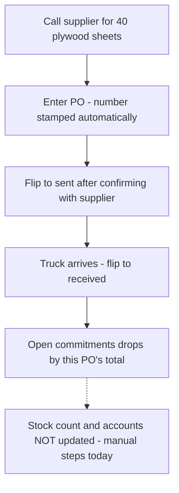
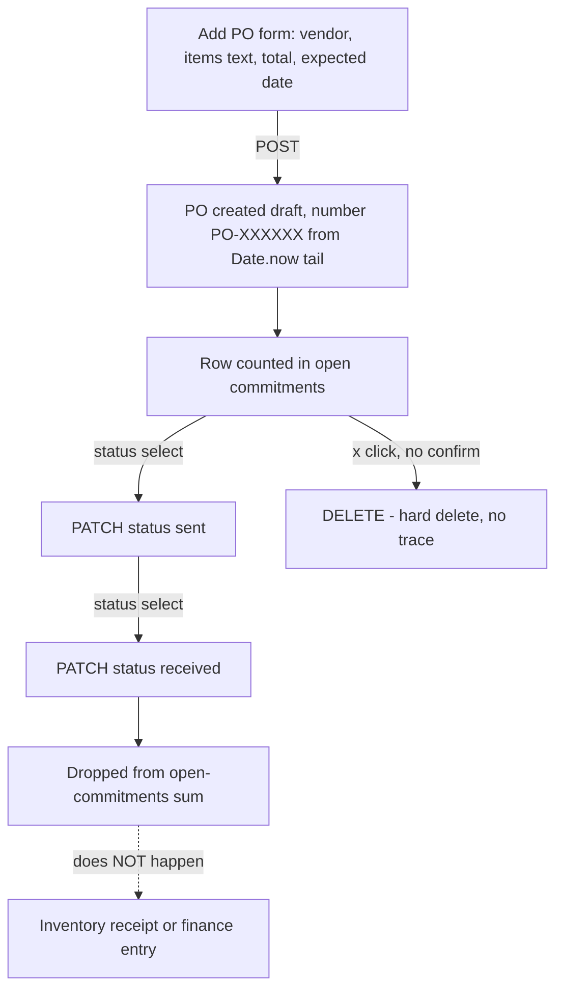
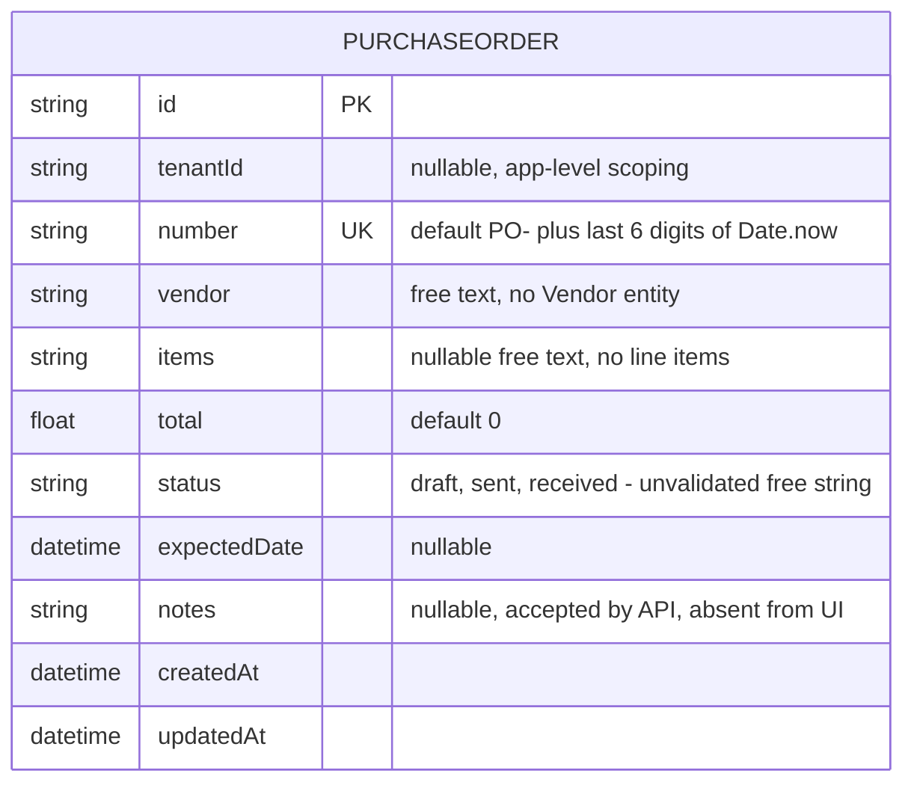
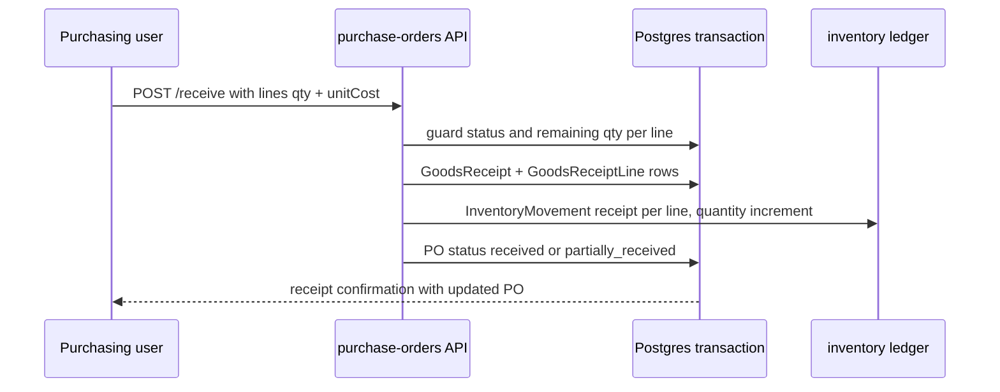
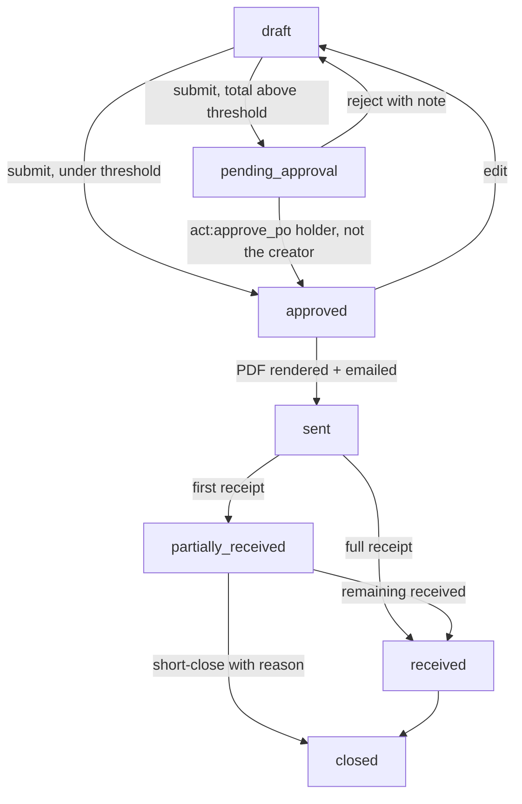
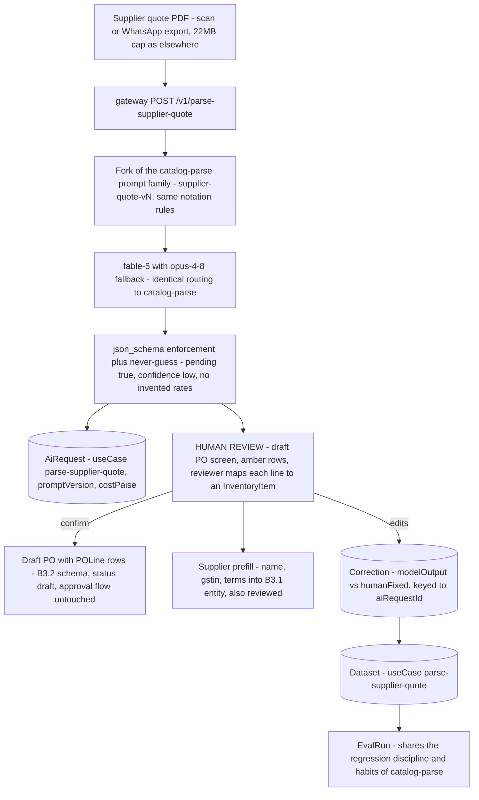

# Purchase orders — engineering bible

Lightweight vendor commitment tracker: raise a PO, move it through `draft → sent → received`, and watch the open-commitments total. Part A is the complete implementer reference for the shipped code; Part B specifies the module's growth path — the **PO → inventory receiving flow** (the single most important missing integration in the suite), supplier management, partial deliveries with landed cost, and an approval flow.

**Status:** `apps/purchase-orders` · `purchase-orders.maplefurnishers.com` · dev `:3012` · prod: shared `maple-suite:latest` image with `APP=purchase-orders`. Postgres only — no files, no volume.

## For managers — plain-language guide

This tool is the notebook where you write down every order you place with a supplier — the plywood from Sharma Timber, the brass hinges, the polish drums. It answers one question at a glance: **how much money have we promised to suppliers that hasn't arrived yet?** Be clear about its limits today: it is a record, not an automation. Marking a delivery "received" does not add the planks to your stock count and does not create an expense in your accounts — you still do both of those by hand in the other tools.

| Feature | What it means in your day | Who uses it |
| --- | --- | --- |
| Raise a PO | You phone the supplier for 40 sheets of plywood — then type the supplier's name, what you ordered, the total and the expected date here. A PO number is stamped automatically. | Whoever places supplier orders (admin/accounts today) |
| Status tracking (draft → sent → received) | Flip the dropdown to *sent* once you've told the supplier, and *received* when the truck arrives. These are self-reported labels — no document is emailed, and the system doesn't stop you flipping them in any order. | The same person, as the order progresses |
| Open commitments total | The number at the top adds up every order not yet received — money already spoken for before you spend on anything else. | Owner/manager, daily glance |
| Delete a PO | The × removes the order instantly and permanently — **there is no "are you sure?" step**, so a mis-click erases the record with no trace. | Anyone with access — click carefully |
| What "received" does NOT do | It does not add stock to Inventory, does not write an expense into Finance/Expenses, and notifies nobody. Those are separate manual steps today. | Everyone should know this |
| Receiving into stock (planned) | Marking a delivery received will add the goods to inventory automatically, at the true cost including freight — and handle a short delivery ("2 chairs missing") as a partial receipt. | Whoever unloads/checks deliveries |
| Supplier records (planned) | Pick the supplier from a list carrying phone, GST number and payment terms — plus a history of what you've bought from them and how long they usually take. | Purchasing + accounts |
| Line items (planned) | List each item with its own quantity and rate instead of one free-text blob — the prerequisite for receiving into stock. | Whoever raises the PO |
| Approval before ordering (planned) | Orders above a limit you set need a second person's OK before they can be sent — and nobody can approve their own order. | Owner approves, staff raise |
| PO document + email (planned) | "Sent" will actually mean sent: a proper PDF on your letterhead, emailed to the supplier. | Purchasing |

**Signs it's working:**

- The open-commitments number matches what you believe you owe suppliers — check it against your mental list once a week.
- Every delivery reaching the workshop gets its PO flipped to *received* the same day, so the total never counts goods already in the store room.
- PO numbers never repeat, and saving never fails with an error (if it does, report it — there is a known numbering flaw engineering tracks).



---

## Part A — implementers

### A1 — What exists today

- **Raise a PO** — vendor (free-text string, not a Vendor entity), items as a single free-text description (`items: String?` — **no line items**), total, expected date. The PO number is client-suppliable but defaults to `PO-` + the last 6 digits of `Date.now()` (`app/api/purchase-orders/route.ts`) — collision-safe only by luck, and `number` is `@unique`, so a clash 500s (unhandled Prisma `P2002`).
- **Status tracking** — a `<Select>` per row PATCHes `status` between `draft | sent | received`. The server does **not** validate the value or the transition order; any string is stored. The names also promise more than the system does:

| Status | What the name implies | What actually happens |
| --- | --- | --- |
| `draft` | Editable, not yet committed | Nothing distinguishes it — every PO is equally editable in every status |
| `sent` | The supplier has the document | No PDF exists, no email is sent; it is a self-reported label |
| `received` | Goods are in stock | **Inventory untouched, finance untouched** — the row just leaves the open-commitments sum |
- **Open commitments** — the header shows `Σ total` across every PO whose status is not `received`, computed client-side in `app/page.tsx`, plus per-status count badges.
- **What it does *not* do (verified)** — **marking a PO `received` does not create or increment `InventoryItem` stock**, post a `FinanceEntry`/`Expense`, or notify anyone. There is no approval workflow, no PDF output, no vendor entity. `PurchaseOrder` relates to nothing.

### A2 — File-by-file, with lifecycles traced

Four files of app code:

| File | Role | Notes |
| --- | --- | --- |
| `apps/purchase-orders/app/page.tsx` | The single page: add-PO form + table with inline status select, open-commitments header | Client component; `ST = ["draft","sent","received"]` and badge-variant map are UI-only constants |
| `apps/purchase-orders/app/api/purchase-orders/route.ts` | GET list + POST create | `tenantDb()`-scoped; 503 with a friendly message when the DB is down |
| `apps/purchase-orders/app/api/purchase-orders/[id]/route.ts` | PATCH + DELETE | Scoped `findFirst` guard, then **body passthrough** to Prisma |
| `apps/purchase-orders/middleware.ts` | `mt_session` → `verifySession` → `canAccessTool(perms, "purchase-orders")` | Legacy role fallback: `admin, accounts` (`rbac.ts` `LEGACY["/purchase-orders"]`) |

**Lifecycle 1 — create (and the numbering hazard, precisely).** POST builds `number = b.number || \`PO-${Date.now().toString().slice(-6)}\``, `vendor: b.vendor || "Vendor"`, `total: Number(b.total || 0)`, `status: b.status || "draft"` (so a client can create a PO born `received` — or born `"banana"`), `expectedDate: new Date(...)` when present. The number math, corrected from the earlier doc: `slice(-6)` of a millisecond timestamp cycles every **10⁶ ms ≈ 16 min 40 s** — any two POs created an exact multiple of that apart (or in the same millisecond) collide on the `@unique` and the create throws an unhandled 500. In a six-digit space, birthday math says collisions become *likely* (>50%) once ~1,200 POs exist. Low odds per day at Maple's volume; guaranteed odds eventually. The UI never sends `number`, so every real PO takes the default.

**Lifecycle 2 — status changes.** The row's `<Select>` fires `PATCH { status }` on change. Server-side the PATCH coerces `total` (`Number`) and `expectedDate` (`new Date` / `null`) when present and passes the **whole body** through to Prisma — mass assignment: any column is writable, including `status` as any free string, `number` (a duplicate → `P2002` 500), and `tenantId` in principle (the scoped `findFirst` guard only proves prior ownership). Transitions are unordered: `received → draft` is one click, silently re-inflating open commitments. Nothing downstream fires — see the not-do list in A1.

**Lifecycle 3 — open commitments.** Pure client math: `rows.filter(r => r.status !== "received").reduce((s, r) => s + r.total, 0)`, rendered through `money()` (INR). Any unrecognized status string counts as open — an accidental safety property of the unvalidated field.

**Lifecycle 4 — delete.** The **only module whose delete has no `confirm()` dialog** — `remove(id)` fires on the × click directly. Scoped guard → hard delete. Combined with no ledger and no receiving flow, a mis-click erases a vendor commitment with zero trace.



### A3 — Data model + API shapes

`PurchaseOrder` is a standalone entity: vendor is a string, items a free-text blob, and there are no relations to `InventoryItem`, `Expense`, or anything else. `tenantId` is app-layer scoping via `tenantDb()` (which intercepts `findMany/findFirst/count/updateMany/deleteMany/create` only — hence guard-then-update in the `[id]` route).



| Method + path | Request shape | Response shape | Auth gate |
| --- | --- | --- | --- |
| GET `/api/purchase-orders` | — | `PurchaseOrder[]` (tenant-scoped, `updatedAt` desc) | middleware `tool:purchase-orders` |
| POST `/api/purchase-orders` | `{ vendor?, items?, total?, expectedDate?, notes?, number?, status? }` — all optional, all defaulted | created `PurchaseOrder`; 500 on number collision | middleware only — **no `act:*` check** |
| PATCH `/api/purchase-orders/[id]` | any columns; `total`/`expectedDate` coerced, rest passthrough incl. free-form `status` | updated `PurchaseOrder` | middleware only — mass assignment |
| DELETE `/api/purchase-orders/[id]` | — | `{ ok: true }` — UI fires with **no confirm dialog** | middleware only — **no `act:delete` check** |
| POST `/api/auth/logout` | — | clears `mt_session` | none needed |

Concrete shapes:

```jsonc
// POST /api/purchase-orders — what the UI sends
{ "vendor": "Sharma Timber", "items": "40 teak planks 8ft, 6 sets brass hinges",
  "total": "48500", "expectedDate": "2026-08-02" }

// response — number minted from the Date.now tail, status defaulted
{ "id": "cmp...", "tenantId": "t_...", "number": "PO-847291", "vendor": "Sharma Timber",
  "items": "40 teak planks 8ft, 6 sets brass hinges", "total": 48500,
  "status": "draft", "expectedDate": "2026-08-02T00:00:00.000Z", "notes": null,
  "createdAt": "...", "updatedAt": "..." }

// PATCH /api/purchase-orders/[id] — the status select sends exactly this
{ "status": "received" }
// ...and the server would equally accept this (nothing validates):
{ "status": "banana", "number": "PO-847291-oops", "total": "0" }
```

### A4 — Config reference

| Variable | Default | Effect |
| --- | --- | --- |
| `DATABASE_URL` | — | Shared suite Postgres — the only real dependency |
| `AUTH_SECRET` / session vars | — | `verifySession` for `mt_session` |
| `LOGIN_URL` | `https://admin.maplefurnishers.com/login` | SSO redirect in middleware |

No app-specific env, no file storage, no extra deps beyond `@maple/core` + `@maple/db`. Dev: `npm run -w @maple/app-purchase-orders dev -- -p 3012` (ports per `PORTS.local.txt`).

### A5 — Recipes

- **Fix the number sequence today (smallest correct change)** — a per-tenant counter: `Counter` arrives with the quotations fold-in ([foldin-map.md](foldin-map.html)); until then, retry-on-`P2002` around the create (regenerate the tail, 3 attempts) turns the 500 into a non-event. Either way, format `PO-{seq}` per tenant, zero-padded, and stop deriving identity from wall-clock.
- **Add `notes` to the UI** — model + API already carry it; `page.tsx` needs a field and a column. Same story as inventory's hidden fields.
- **Enforce the status enum server-side** — whitelist the PATCH body (copy catalog's PATCH shape) and validate `status ∈ {draft, sent, received}` plus a transition table (`draft→sent→received`, admin-only reversals). One route file.
- **Report "committed spend by month"** — `expectedDate` is the only schedule field; group open POs by it, treating `null` as "unscheduled" (the UI allows it). Until B3.2 lands there is no `receivedAt`, so *actual* spend timing is unknowable from this table — say so in any report you build.
- **Script a PO** — POST with explicit `number` if you must be idempotent (re-POST of the same number fails rather than duplicating — the unique constraint as a poor man's idempotency key).
- **Reconcile POs against expenses today** — you can't join them (no relation, vendor strings drift: "Sharma Timber" vs "Sharma Timber & Sons"). Until `Supplier` lands (B3.1), the honest answer is a manual monthly review; don't build a fuzzy-match report that will be wrong quietly.
- **Find stuck POs** — `status = 'sent' AND expectedDate < now()` is the only overdue signal the schema supports; surface it as a badge before building anything fancier.

---

## Testing — how we verify this module

**Honest current state: zero tests.** `apps/purchase-orders` contains no test files, no runner config, no CI step — verified by search. Every behaviour documented in Part A is pinned only by this document.

**Unit targets (write these first):**

- **PO number collision — the flagship case.** `PO-${Date.now().toString().slice(-6)}` cycles every ~16.7 minutes (A2 Lifecycle 1). The test: feed the number-minting logic two timestamps exactly 10⁶ ms apart, assert the numbers collide, then assert the create path survives it (retry-on-`P2002`, per A5). Written today the second half is red — it documents the unhandled 500 until the retry lands. Extract the minting into a pure function so this is testable without a DB.
- **Coercion pinning.** POST body permutations: missing `vendor` → `"Vendor"`, string `total` → number, `status: "banana"` → stored verbatim (today's behaviour, pinned so the future whitelist change is deliberate).
- **Open-commitments reduce.** Unknown status strings count as open (the accidental safety property in A2 Lifecycle 3) — pin it before anyone "fixes" it silently.

**Integration cases — known gaps as named regressions:**

| Case name | Scenario | Asserts | Today |
| --- | --- | --- | --- |
| `po-number-collision-500` | Two creates with colliding `Date.now` tails | Second create succeeds with a regenerated number | **Fails** — unhandled `P2002` 500 |
| `status-free-string` | `PATCH { status: "banana" }` | 400, enum enforced | **Fails** — any string stored |
| `patch-mass-assignment` | PATCH body carrying `number`/`tenantId` | Unknown fields ignored (whitelist) | **Fails** — body passthrough |
| `received-reversal` | `received → draft` via PATCH | Rejected without admin override | **Fails** — unordered transitions |
| `tenant-isolation` | Tenant B GETs/PATCHes/DELETEs tenant A's PO | 404, nothing leaks or mutates | Expected pass — never proven |
| `delete-is-hard` | DELETE then GET | Row gone, no trace | Passes (current design — the test documents it) |

**Definition of done for this module's test story:** the collision, isolation and free-string cases run green in CI before any B1 receiving-flow work starts (receiving multiplies the cost of every one of these bugs); every new route or transition ships in the same PR as its route-level test; the B3.2 transition table, when it lands, is tested exhaustively — one assertion per forbidden edge.

---

## Part B — architects

### B1 — Cross-module: the PO → inventory receiving flow spec

The one integration that turns two islands into a supply chain. Contract (transactional, same-DB — the event-driven variant swaps the transaction for a `po.received` outbox event consumed idempotently by inventory, per [event-catalog.md](event-catalog.html)):

**Endpoint:** `POST /api/purchase-orders/[id]/receive`

```json
{
  "lines": [
    { "poLineId": "cuid", "itemId": "inventoryItemCuid", "qty": 8, "unitCost": 1450 }
  ],
  "note": "second delivery, 2 chairs short"
}
```

**Server steps, in one `prisma.$transaction`:**

1. Guard: PO belongs to tenant; status is `sent` or `partially_received`; each line's `qty ≤ ordered − alreadyReceived` (over-receipt requires an explicit flag).
2. Create a `GoodsReceipt` header + `GoodsReceiptLine` rows (B3.2 schema).
3. For each line, insert an `InventoryMovement` (`kind: "receipt"`, `delta: +qty`, `unitCost`, `refType: "purchase_order"`, `refId: poId`) and increment the cached `InventoryItem.quantity` — the ledger contract in [module-inventory.md](module-inventory.html) B1/B3.1. The `@@unique([refType, refId, itemId])` idempotency key uses the *receipt* id, not the PO id, since one PO can legitimately produce many receipts.
4. Recompute PO status: all lines fully received → `received` (+ set `receivedAt`); some → `partially_received`.
5. Optionally post a `FinanceEntry` accrual (received-not-invoiced) — flag-gated until [module-finance.md](module-finance.html) wants it.

**Prerequisite:** structured `POLine`s (B3.2) — you cannot receive against a free-text blob. The mapping `poLine.itemId → InventoryItem` is set at PO creation (pick from inventory, or "create item on first receipt" inline for new materials).

**Response and error contract:**

```jsonc
// 200 — receipt posted
{ "receiptId": "cmr...", "poStatus": "partially_received",
  "lines": [ { "poLineId": "...", "received": 8, "remaining": 2, "unitCost": 1450 } ] }
```

| Error | Status | Condition |
| --- | --- | --- |
| `po_not_receivable` | 409 | Status not in `sent \| partially_received` (draft/approved POs must be sent first; closed POs never receive) |
| `over_receipt` | 422 | Any line's `qty > ordered − alreadyReceived` and `allowOverReceipt` flag absent |
| `unknown_line` | 422 | `poLineId` not on this PO, or `itemId` mismatch with the line |
| `not_found` | 404 | PO not in tenant (the standard scoped-guard result) |
| `conflict_retry` | 409 | Concurrent receipt lost the row lock — client retries with fresh remaining quantities |



### B2 — Infrastructure, both tracks

**Track 1 — today (compose).** Stateless CRUD container on the shared Postgres; nothing else. The receiving flow adds only transaction breadth, not new infrastructure — this is the payoff of the same-DB phase.

**Track 2 — target (AWS / split modules).**

- **Postgres (RDS)** remains the store; POs + receipts are low-volume relational data with strong consistency needs — exactly RDS territory.
- **Kafka topics** at module split: produce `maple.purchasing` (`po.approved`, `po.sent`, `receipt.posted`, `po.received`, `po.closed`); consume `maple.inventory` (`stock.low` → reorder suggestions land in the PO drafting screen, per [module-inventory.md](module-inventory.html) B3.2). Partition key `tenantId:poId` preserves per-PO event order.
- **PDF generation** (the "send" in `sent`): PO documents render server-side like quotations' PDFs; at scale, on the same render-worker queue the catalog module introduces ([module-catalog.md](module-catalog.html) B2) — one worker fleet, many document types. Email dispatch through whatever transactional-mail dependency the suite adopts; store the sent artifact on S3 keyed `purchasing/{tenantId}/{poId}/{version}.pdf`.
- **Redis** — no caching need (internal tool, small lists); the approval flow's pending-approval badge can ride the same pub/sub as inventory alerts.
- **K8s/ECS profile:** `requests: 100m/256Mi`, horizontal scale trivial, no volumes. The module never becomes hot; its criticality is *correctness*, not throughput.

### B3 — Designed enhancements

**B3.1 — Supplier management.** Replace the free-text vendor with an entity that earns its table:

```prisma
model Supplier {
  id           String  @id @default(cuid())
  tenantId     String?
  name         String
  gstin        String?          // Indian tax id, printed on the PO
  contactName  String?
  phone        String?
  email        String?
  address      String?
  paymentTerms String?          // "50% advance, 50% on delivery"
  leadTimeDays Int?             // manual seed; superseded by measured lead time
  notes        String?
  active       Boolean @default(true)
  pos          PurchaseOrder[]

  @@unique([tenantId, name])
}
```

`PurchaseOrder` gains `supplierId` (keep the `vendor` string as a denormalized snapshot for old rows and PDF stability). API surface: `GET/POST /api/suppliers`, `PATCH/DELETE /api/suppliers/[id]` (soft-delete via `active: false` once POs reference them), plus `GET /api/suppliers/[id]/stats` returning `{ openTotal, poCount, avgLeadTimeDays, lastReceivedAt }`.

Payoffs beyond tidiness:

| Capability | Mechanism | Consumer |
| --- | --- | --- |
| Per-supplier spend + history | `groupBy supplierId` over POs | purchasing UI, finance review |
| **Measured lead time** | `avg(receivedAt − createdAt)` per supplier | reorder-point math in [module-inventory.md](module-inventory.html) B3.2 |
| Terms defaults | `paymentTerms` copied onto new POs | PO form, printed PDF |
| Tax-correct documents | `gstin` on the printed PO | B2's PDF pipeline |
| Reorder routing | `stock.low` suggestions grouped by the item's usual supplier | one-click draft PO |

A supplier is *not* a `Client` — different fields, different modules, no shared table; resist the "one party model" refactor, the suite's CRM concerns don't overlap purchasing's.

**B3.2 — Line items, partial deliveries, landed cost.** The schema that B1's flow requires:

```prisma
model POLine {
  id           String        @id @default(cuid())
  poId         String
  po           PurchaseOrder @relation(fields: [poId], references: [id])
  itemId       String?       // InventoryItem; nullable for services/freight lines
  description  String
  qty          Float
  unit         String        @default("nos")
  rate         Float
  receivedQty  Float         @default(0)   // cached from receipt lines
}

model GoodsReceipt {
  id          String   @id @default(cuid())
  tenantId    String?
  poId        String
  receivedAt  DateTime @default(now())
  note        String?
  freight     Float    @default(0)   // landed-cost inputs for this delivery
  duties      Float    @default(0)
  lines       GoodsReceiptLine[]
}

model GoodsReceiptLine {
  id         String       @id @default(cuid())
  receiptId  String
  receipt    GoodsReceipt @relation(fields: [receiptId], references: [id])
  poLineId   String
  qty        Float
  unitCost   Float        // rate + allocated landed cost
}
```

PO `total` becomes derived (`Σ qty × rate`), and statuses widen to `draft | pending_approval | approved | sent | partially_received | received | closed` — server-validated against a transition table (finally killing the free-string status):

| From | Allowed to | Guard |
| --- | --- | --- |
| `draft` | `pending_approval`, `approved` | direct to `approved` only under the B3.3 threshold |
| `pending_approval` | `approved`, `draft` | approver ≠ creator; rejection returns to draft with a note |
| `approved` | `sent`, `draft` | edits after approval reset to draft |
| `sent` | `partially_received`, `received`, `closed` | receipt-driven, never set by hand |
| `partially_received` | `received`, `closed` | `closed` = short-close with reason |
| `received` | `closed` | terminal pair; reversals are admin-only compensations |

**Landed cost:** freight/duties entered on the receipt are allocated across its lines **by value** (`lineShare = lineValue / receiptValue`; by-weight needs data the schema doesn't carry), so `unitCost = rate + allocated / qty` — and that unit cost is what flows into the inventory movement, making moving-average valuation reflect what the goods *actually* cost, not the list rate.

Worked example: a receipt delivers 40 planks at ₹850 (₹34,000) and 6 hinge sets at ₹750 (₹4,500); freight ₹2,000, octroi ₹500. Receipt value ₹38,500; planks carry `34000/38500 = 88.3%` of the ₹2,500 extras → ₹2,208 → `unitCost = 850 + 2208/40 ≈ ₹905`; hinges get `750 + 292/6 ≈ ₹799`. Those are the `unitCost`s on the two inventory movements — the moving average absorbs true cost, and the ₹55/plank difference from the list rate is exactly the margin error the workshop was previously eating invisibly.

Partial deliveries fall out of the model: many receipts per PO, `receivedQty` tracks progress per line, and the two-chairs-short case is just a smaller receipt plus an open remainder (short-close via `closed` with a reason).

**B3.3 — PO approval flow.** Small and honest, not BPM: POs above a per-tenant threshold (`AppSetting`, arriving with the fold-in) require approval before `sent`.

- `draft → pending_approval` on submit; a user holding a new `act:approve_po` permission ([rbac-matrix.md](rbac-matrix.html)) moves it to `approved`.
- **Self-approval blocked** (`approverId ≠ createdById`) — which requires POs to start recording `createdById` (today nothing does; add it with this change).
- Below-threshold POs skip straight to `approved` — the flow must never slow down a ₹2,000 hinge order.
- Audit fields live on the PO row (`approvedById`, `approvedAt`) rather than a generic audit table — one approval per PO; any post-approval edit resets to `draft` and clears them.
- The pending queue is a filter on the existing list; notification rides the alerts channel from B2. Approval emits `po.approved`.



### B4 — Scaling

- **Volume:** a workshop raises tens of POs a month. Every schema above stays trivially small; the design constraint is auditability, not throughput. Nothing here ever needs more than the base container profile.
- **Correctness under concurrency:** two simultaneous receipts against one PO must not over-receive — the B1 transaction re-checks `remaining = qty − receivedQty` inside the transaction (`SELECT ... FOR UPDATE` semantics via Prisma's transaction isolation, or a conditional `updateMany` guard). This is the module's one real race; design it in from the first receiving PR.
- **Numbering at scale:** the per-tenant `Counter` (A5) is a single-row hot spot in theory; at Maple volume it never matters, and the transaction that increments it is the same one creating the PO — no gap-free guarantees needed (gaps are fine; duplicates are not).
- **Reporting:** open-commitments moves server-side (an aggregate endpoint) once line items land — the client-side reduce doesn't survive pagination.
- **Sequencing:** line items + Supplier (B3.1/B3.2 schemas) land together in one migration, then the receiving endpoint (B1), then approval (B3.3). PDF/send can slot in any time after Supplier exists — it only needs `gstin` and terms.

### Cross-reference map

| Topic | Where it lives |
| --- | --- |
| The ledger these receipts post into | [module-inventory.md](module-inventory.html) B1 (contract) + B3.1 (movement schema, valuation) |
| Lead-time + reorder math consuming `receivedAt` | [module-inventory.md](module-inventory.html) B3.2 |
| Landed `cost` on the product side | [module-catalog.md](module-catalog.html) B1 — the product master's `cost` column |
| Event envelope, outbox discipline | [event-catalog.md](event-catalog.html) |
| `Counter` + `AppSetting` models arriving with the fold-in | [foldin-map.md](foldin-map.html) |
| RBAC gaps and the proposed `act:approve_po` | [rbac-matrix.md](rbac-matrix.html) |
| Hosting phases this module rides | [aws-deployment.md](aws-deployment.html) |

## AI — use case & pipeline

**Use case: supplier quote PDF → draft PO line items — the suite's cheapest AI win, and it should be built as exactly that.** Suppliers send quotations the same way customers' rate sheets arrive: scanned PDFs, WhatsApp photo exports, sometimes handwritten — the *same document genre* quotations' catalog parse already handles in production at ₹8–10/page ([ai-layer.md](ai-layer.html)). Quotations' own AI section names this module as the "family export": fork the proven prompt family, swap `CATALOG_SCHEMA` for a PO-line schema, and reuse the notation rules ("85K" = ₹85,000, "per pc" multiplies, crossed-out prices mean take the replacement), the never-guess discipline, and the review-screen pattern verbatim. Nothing is invented here — which is precisely the argument for doing it early. Today, raising a PO from a supplier quote means retyping into a free-text blob; the parse produces structured draft lines (description, qty, unit, rate, each with confidence flags) plus supplier header fields to prefill B3.1's `Supplier`, and the purchasing user reviews amber rows and maps each line to an `InventoryItem` before confirming. The output is always a `draft` PO — B3.3's approval thresholds apply unchanged, and the model never advances a status.



**Implementation.**

| Gateway endpoint | Input | Output `json_schema` fields | Model pick | Est. ₹/call | er-platform tables |
| --- | --- | --- | --- | --- | --- |
| `POST /v1/parse-supplier-quote` | quote PDF ≤ 22MB as a native document block + optional `supplierId` hint (known supplier's terms as context) | `supplier: {name, gstin, paymentTerms, validUntil}` + `lines[]: description, qty, unit, rate, amount, pending, confidence` | **fable-5** with opus-4-8 fallback — the same scanned-and-handwritten genre catalog-parse survives daily; the fork inherits the proven routing, and a cheaper model gets its shot only through a `ModelRoute` experiment after the eval set exists | **₹8–10/page** — the [ai-layer.md](ai-layer.html) anchor applies *directly*: same parser family, same page density, no discount and no premium; a typical 2-page supplier quote ≈ ₹16–20 against ten minutes of retyping | `AiRequest`, `AiBudget`, `ModelRoute`, `Correction`, `Dataset`, `EvalRun` |

Design notes:

- **`itemId` mapping stays human.** The model never binds a line to an `InventoryItem` — name-similarity *suggestions* in the review dropdown are fine, but the binding is the reviewer's click. A wrong rate is caught at approval; a wrong item mapping silently corrupts the B1 receiving flow and the inventory ledger downstream.
- The parse feeds `rate`; landed `unitCost` still comes from the goods receipt (B3.2's freight/duties allocation) — the parse replaces typing, not the costing model.
- Corrections here compound with quotations': same document genre, same schema conventions, separate `Dataset` rows per use case — the family improves together (a notation fix discovered on a supplier quote lands in the shared prompt lineage).

**Rollout & eval gate.**

1. **Not before B3.2.** Parsing into today's free-text `items` blob throws away the structure the model was just paid to produce — the `POLine`/`Supplier` migration is the hard prerequisite, and it's already first in B4's sequencing.
2. **Fork, don't invent:** prompt family, structured-output config (`additionalProperties: false`), notation vocabulary, and the amber-row review pattern copied from catalog-parse; the gateway stamps `promptVersion: supplier-quote-v1` from day one so corrections are trainable.
3. **Correction capture** inside PO confirm: diff reviewed lines against raw parse, POST fire-and-forget — never block the PO.
4. **Eval gate:** ~20 real supplier quotes with hand-verified lines as the standing regression set; line-level accuracy must meet catalog-parse's bar before any prompt bump or model reroute ships (`beatIncumbent = true`).
5. **Honest trigger:** at tens of POs a month, this is a convenience, not a transformation — build it *because it's nearly free off the quotations investment*, not because PO volume demands it. If most POs are phoned-in orders with no quote document, the parse idles harmlessly; the feature earns expansion (email-forwarding ingestion, auto-supplier matching) only when **>10 quote documents/month** actually flow through it.

### B5 — Status: done / left / decisions

**Done ✓**

- PO CRUD with auto-numbering, three-stage status field, open-commitments rollup, expected-date tracking, tenant scoping with per-row ownership guard.

**Left ◻**

- **Receive-into-stock** — `received` still touches nothing; full flow spec in B1, prerequisite schema in B3.2, ledger contract in [module-inventory.md](module-inventory.html).
- **Structured line items and a real Supplier entity** (both free text today) — B3.1/B3.2.
- Server-side status validation + transition ordering (any string is accepted today) and a collision-safe PO number sequence (Date.now tail cycles every ~16.7 minutes; unhandled `P2002` 500s).
- Replace PATCH body-passthrough with a field whitelist (catalog's PATCH is the reference).
- `act:delete` enforcement on DELETE, plus a UI confirm dialog — the only module without one ([rbac-matrix.md](rbac-matrix.html)).
- PO PDF + send-to-supplier (email) — the `sent` status currently asserts an act the system never performs.
- Approval flow (B3.3), `createdById` provenance, `receivedAt` timestamp.
- No `/api/health` endpoint; no tests.

**Decisions on record**

- Supplier ≠ Client: separate model, no shared party table (B3.1).
- Landed cost allocated by value, not weight — the schema carries no weights, and value allocation is the accepted default.
- Same-DB transactional receiving ships first; the `po.received` event consumer is the module-split variant, not a prerequisite ([event-catalog.md](event-catalog.html)).
- Statuses widen only with B3.2 — do not add `partially_received` before line items exist to define "partial".
- No multi-currency: suppliers invoice in INR; the schema stays currency-naive until a real import case appears, at which point currency lands on `Supplier` and `GoodsReceipt`, never per line.

---

*Sibling bibles: [module-inventory.md](module-inventory.html) · [module-catalog.md](module-catalog.html). Suite-wide context: [er-suite.md](er-suite.html) · [cross-module.md](cross-module.html).*
