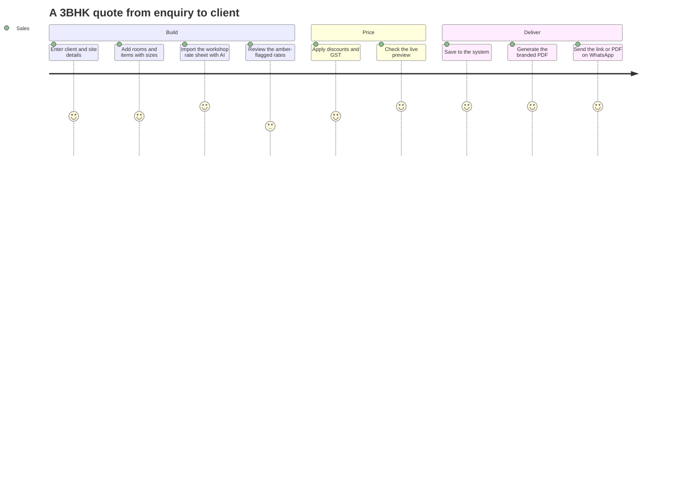
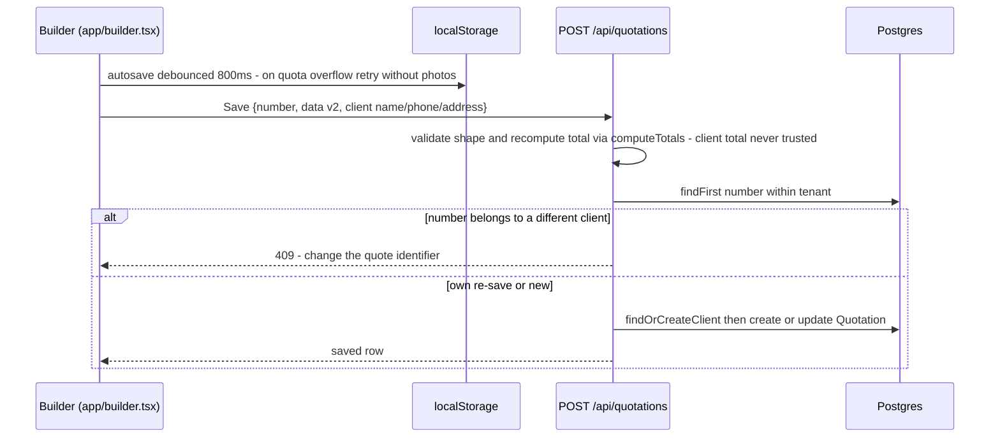
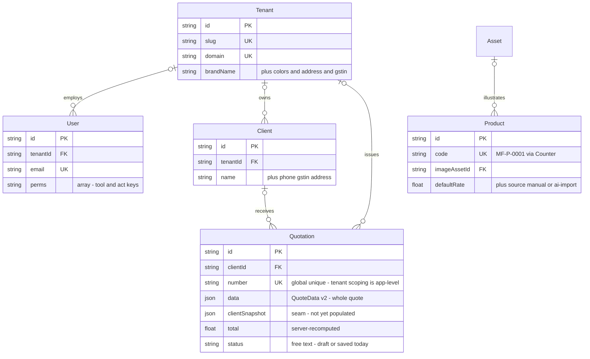
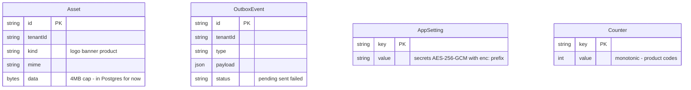
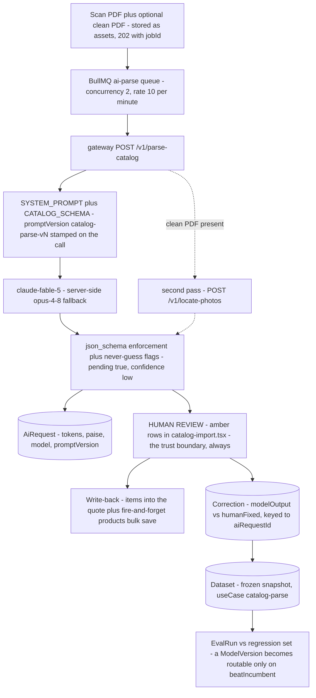

# Quotations — engineering bible

The furniture quotation builder: multi-room quotes with money math, AI catalog import, a product library, branded PDF/XLSX proposals, and share links.

**Status:** standalone repo `maple-tools/maple-quotations` (hardened, system of record for this module) · suite copy `maple-suite/apps/quotations` (older, pre-hardening — see [foldin-map.md](foldin-map.html)) · dev port **:3020** locally by convention (`npm run dev -- -p 3020`; plain `npm run dev` binds :3000 — `.claude/launch.json` declares 3000 with `autoPort: true` — and the suite copy runs on :3004 per `PORTS.local.txt`) · **local login** at `/login` + `POST /api/auth/login` issuing the `mt_session` JWT (jose HS256, 7-day) — set `LOGIN_URL` to switch to suite SSO ([seq-sso-login.md](seq-sso-login.html)).

## For managers — plain-language guide

This is the tool your sales team uses to turn a client conversation into a professional, priced proposal. It knows furniture: rooms, sizes in feet or millimetres, per-square-foot rates, GST, discounts at every level — and it can read the workshop's handwritten rate sheets so nobody retypes them.

| Feature | What it means in your day | Who uses it |
| --- | --- | --- |
| Quote builder | A client in Kirti Nagar asks for a full 3BHK quote: add Living Room, two Bedrooms and Kitchen as rooms, drop in sofas and wardrobes with sizes and rates, apply a festival discount on one room and 5% overall — GST splits into CGST/SGST automatically and the grand total updates live | Sales team |
| AI catalog import | The workshop sends a scanned rate sheet with handwritten prices ("85K", "per pc", crossed-out rewrites); upload the PDF and the items appear pre-filled — anything the AI wasn't sure about is flagged amber and must be checked by a human before it enters the quote | Sales / back office |
| Product library | The "Sheesham 3-seater" you quoted last month is one click away next time — every item gets a permanent code like `MF-P-0042` and imports grow the library automatically | Sales team |
| Image gallery | Logos, banners and product photos are uploaded once and reused across every quote and proposal | Sales / admin |
| Branded PDF proposal | One click produces the client-facing document with your logo, colours, address and payment details — the PDF you send on WhatsApp | Sales team |
| Sheet export + Excel import | Quotes export to the exact rate-sheet format the team's Google Sheet uses, and an existing Excel sheet (photos included) imports back in | Back office |
| Share links | Instead of a file, send a link — the quote opens in the client's browser, no app or login needed on their side | Sales team |
| Admin settings | Company profile (name, logo, GSTIN, colours), the AI model choice, and the AI key live in one settings page | Owner / admin |
| Public landing + in-app docs | Visitors to the site see a marketing page; signed-in staff land straight in the builder; step-by-step guides live under `/docs` | Everyone |



**Signs it's working:**
- A saved quote reopens with exactly the total the PDF showed — the server recalculates the maths on every save, so a mismatch is rejected loudly rather than stored silently.
- Trying to reuse a quote number for a *different* client is blocked with a clear message instead of overwriting the old quote.
- An AI import never lands in a quote without the review screen appearing first — if items ever appear unreviewed, stop and call engineering.

---

## Part A — for implementers

### A1 What it does today

- **Quote builder** (`app/builder.tsx`, 815 lines): rooms → items with category/spec/material/fabric, dimensions with unit conversion (in/ft/cm/mm via `UNIT_CONVERSION` in `src/lib/utils.ts`), per-item + per-room + overall discounts (flat/percent), GST excluded or inclusive with CGST/SGST split, packing (%) and loading (flat) charges. All math in pure `computeTotals()` (`src/lib/utils.ts:62`). Undo/redo (50-step history), keyboard shortcuts (Cmd/Ctrl+S draft, Cmd/Ctrl+P PDF, Cmd/Ctrl+Z / Shift+Z), three item templates and a 10-entry quick-add template list (`src/lib/constants.ts`).
- **AI catalog import** (`app/catalog-import.tsx` → `POST /api/ai/parse-catalog`): a scanned rates PDF (handwritten rates supported) is parsed by Claude vision into rooms/items with per-item confidence flags; an optional second "clean" PDF supplies the item photo crops. The review step is the explicit trust boundary — nothing reaches the quote unreviewed. Full trace: [seq-ai-catalog-parse.md](seq-ai-catalog-parse.html), and A2 lifecycle 2 below.
- **Product library** (`/library`, `Product` model): every AI-imported or manually saved item gets a stable code (`MF-P-0001` via the `Counter` row) and is reusable across quotes through the product picker (`app/product-picker.tsx`); AI imports grow the library fire-and-forget via `POST /api/products/bulk` (dedupe on name+spec, 200-item cap).
- **Image gallery** (`Asset` model, `app/gallery-picker.tsx`): logo/banner/product images stored as bytes in Postgres (4MB cap), served from `/api/assets/[id]` with immutable caching.
- **Branded PDF proposal** (`app/pdf-catalog.tsx`): client-side react-pdf render with the tenant's brand (logo, colors, address from Settings); amounts print as "Rs" because the built-in Helvetica/Times fonts cannot encode ₹.
- **Sheet export + Excel import**: XLSX rate-sheet matching the team's Google Sheet format (`src/lib/sheet-export.ts`); import (`onImportExcel` in `builder.tsx`) reads an XLSX including its embedded images (jszip digs them out of `xl/media`).
- **Share links**: quote content base64url-encoded into `?q=` (UTF-8 safe, photos stripped, 8000-char guard); drafts autosave to localStorage (debounced 800 ms, quota-safe photo-stripping retry).
- **Admin settings** (`/settings`): company profile (writes the `Tenant` row), AI model choice, and the Anthropic API key stored AES-256-GCM encrypted in `AppSetting`.
- **Public landing + in-app docs**: `/` shows the builder for signed-in users and a marketing landing otherwise (`app/page.tsx`); `/docs/[slug]` renders the repo's `docs/*.md` guides via `src/lib/docs.ts`.

### A2 Code architecture

`@maple/core` is **vendored via tsconfig paths** — `@maple/core/lib/*` → `./src/lib/*`, `@maple/core/ui/*` → `./src/components/ui/*`, `@maple/db` → `./src/db` — so imports are suite-compatible for the fold-in ([foldin-map.md](foldin-map.html)). State lives in three places: Postgres (saved quotes, products, assets, settings), localStorage (working quote, drafts, custom terms), and the URL (share links).

#### File-by-file responsibility map

| File | Lines | Responsibility |
| --- | ---: | --- |
| `app/page.tsx` | 10 | Root switch: session → `QuotationBuilderPage`, else `Landing` |
| `app/builder.tsx` | 815 | The builder: tabs (client/rooms/finance/payment/drafts/saved), autosave, undo/redo, save/share/PDF/XLSX orchestration, live preview panel |
| `app/pdf-catalog.tsx` | 301 | `MasterProposalPdf` react-pdf document: brand header, room bands, totals, terms, payment card, footer |
| `app/catalog-import.tsx` | 262 | AI import modal: upload → parse → review (trust boundary) → apply + fire-and-forget library save |
| `app/product-picker.tsx` | 180 | "+ Library" modal: debounced search, multi-select, image→data-URL conversion on add |
| `app/gallery-picker.tsx` | 149 | Gallery modal: search/upload/delete product images, pick → data URL |
| `app/landing.tsx` | 234 | Public marketing landing |
| `app/library/*` | — | Product + gallery management page (client component `library-client.tsx`) |
| `app/settings/*` | — | Admin settings page + form (company profile, AI model, API key) |
| `app/login/*`, `app/docs/*` | — | Local login form; public docs rendering `docs/*.md` |
| `app/api/quotations/route.ts` | 67 | GET list (summaries only), POST save (validate → recompute total → collision guard → create/update) |
| `app/api/quotations/[id]/route.ts` | 19 | GET full blob, DELETE with tenant-scoped existence check |
| `app/api/products/route.ts` | 72 | GET search (top 50), POST manual create with `nextProductCode()` |
| `app/api/products/[id]/route.ts` | 67 | PATCH edit (image swap via new asset), DELETE (asset stays in gallery) |
| `app/api/products/bulk/route.ts` | 83 | Upsert reviewed AI items, dedupe name+spec, 200-item cap with `skipped` count |
| `app/api/assets/route.ts` | 40 | GET list (no bytes), POST multipart upload (image-only, 4MB) |
| `app/api/assets/[id]/route.ts` | 30 | GET serve bytes (immutable cache), DELETE + detach products |
| `app/api/settings/route.ts` | 96 | Admin-only GET/PUT: company fields → `Tenant`, AI model + masked key → `AppSetting` |
| `app/api/ai/parse-catalog/route.ts` | 85 | Vision parse endpoint: 22MB cap, `maxDuration 600`, photo attach with clean/scan fallback |
| `app/api/auth/login/route.ts` | 46 | Local login: bcrypt verify, in-memory rate limit, sets `mt_session` |
| `app/api/auth/logout/route.ts` | 7 | Clears the cookie |
| `app/api/brand/route.ts` | 4 | `getBrand()` passthrough for shell/PDF |
| `middleware.ts` | 31 | Session + `canAccessTool(perms, "quotations")`; excludes `/`, `/login`, `/docs`, `/api/auth`, static |
| `src/lib/utils.ts` | 233 | Pure quote math (`computeTotals`), share codec, `safeSetItem`, item/room factories |
| `src/lib/types.ts` | 86 | `QuoteData` v2 and friends — the single contract shared by builder, API, PDF, tests |
| `src/lib/catalog-parse.ts` | 244 | Anthropic SDK structured-output calls: `parseCatalogPdf`, `locateItemPhotos`, `runVisionRequest` |
| `src/lib/pdf-images.ts` | 67 | `cropItemPhotos`: pdf-to-img page render (scale 2) + sharp crop → 360px JPEG data URLs |
| `src/lib/settings.ts` | 68 | `SETTING_DEFS`, AES-256-GCM encrypt/decrypt, DB → env → default resolution |
| `src/lib/assets.ts` | 46 | Bytes-in-Postgres asset store, `createAssetFromDataUrl`, `nextProductCode()` |
| `src/lib/session.ts` | 42 | jose HS256 JWT sign/verify, cookie options, `COOKIE_DOMAIN` |
| `src/lib/auth.ts` | 16 | bcryptjs hash/verify, `getSession()` from cookie |
| `src/lib/rbac.ts` | 43 | `tool:*` / `act:*` perms, `canAccessTool`, legacy role fallback ([rbac-matrix.md](rbac-matrix.html)) |
| `src/lib/tenant.ts` / `tenant-db.ts` | 18/29 | `getTenantId()` (session first, host-resolved second); Prisma `$extends` scoping reads + stamping creates |
| `src/lib/brand.ts` | 94 | Host → tenant brand resolution, 60s in-proc cache, `invalidateBrandCache()` |
| `src/lib/clientLink.ts` | 20 | `findOrCreateClient`: case-insensitive name match within tenant, backfills phone/address/gstin |
| `src/lib/flags.ts` | 37 | Flipt boolean flags, 30s cache, fail-open when `FLIPT_URL` unset |
| `src/lib/sheet-export.ts` | 66 | XLSX rate-sheet builder matching the team's Google Sheet columns |
| `src/lib/constants.ts` | 15 | The 10 quick-add item templates |
| `src/lib/docs.ts` / `nav.ts` / `cn.ts` / `prisma.ts` | — | Docs registry, suite nav URLs, class merge, Prisma singleton |
| `prisma/schema.prisma` | 141 | 9 models (see A3); `prisma/seed.mjs` seeds tenant `maple` + admin |
| `tests/unit/totals.test.ts` / `share.test.ts` | — | 15 + 8 unit tests (money math, share codec incl. Devanagari roundtrip) |
| `scripts/render-pdf-sample.tsx` | — | Renders a proposal PDF without a browser (`npx tsx …`) |

#### Request lifecycle 1 — quote save

1. **`onSave()`** (`app/builder.tsx:430`) — guards `data.client.name`, then `POST /api/quotations` with `{ number, total: computed.totals.grandTotal, status: "saved", data: { ...data, terms }, client: { name, phone, address } }`. Terms are merged into the payload here because they live in separate React state (`terms`), persisted independently to `mapleQuotation.terms.v1`.
2. **`POST` handler** (`app/api/quotations/route.ts:22`) — rejects missing `number` (400) and any payload where `data.version !== 2` or `rooms` isn't an array (400).
3. **`computeTotals(data)`** (`src/lib/utils.ts:62`) re-runs server-side; the client's `total` field is *ignored* — "the stored total is authoritative for lists/reports — never trust the client's number". A throw here is a 400.
4. **Collision check** — `tenantDb()` (`src/lib/tenant-db.ts:14`, Prisma [`$extends`](https://www.prisma.io/docs/orm/prisma-client/client-extensions) that injects `tenantId` into `findMany/findFirst/count/updateMany/deleteMany` and stamps it on `create/upsert`) does `quotation.findFirst({ where: { number } })` — tenant-scoped, because the raw unique `number` column is global and a bare upsert could grab another tenant's row.
5. **Cross-client 409** — if the number exists and belongs to a *different* client name (case-insensitive compare), respond `409 "Quote number X already belongs to Y. Change the quote identifier and save again."` Re-saving your own quote falls through.
6. **`findOrCreateClient(b.client)`** (`src/lib/clientLink.ts:5`) — case-insensitive name match within the tenant; on match, backfills empty `phone`/`address`/`gstin` only (never overwrites); otherwise creates the `Client` row.
7. **Write** — `update` when the number existed, else `create`. A `P2002` unique violation (number taken *outside* this tenant) is caught and mapped to 409 (`route.ts:62`).
8. Builder shows "Saved to system ✓" and refreshes the Saved tab via `loadServerQuotes()`.

Autosave is orthogonal: an 800ms-debounced effect (`builder.tsx:190`) writes `{...data, terms}` to `mapleQuotation.last.v2`; on `QuotaExceededError` (`safeSetItem` returns false) it retries with `data:` image URLs stripped and warns once via `quotaWarned` ref.



#### Request lifecycle 2 — AI catalog import end-to-end

1. **`onParse()`** (`app/catalog-import.tsx:48`) — posts `FormData` with `file` (rates PDF, required) and optional `imagesFile` (clean client PDF) to `/api/ai/parse-catalog`.
2. **Route guards** (`app/api/ai/parse-catalog/route.ts:17`) — `badPdf()` checks `File` instance + PDF mime/extension; 413 above `MAX_PDF_BYTES = 22MB` ("base64 inflates the PDF by 4/3 and the model API rejects requests over 32MB" — see [Anthropic PDF support](https://platform.claude.com/docs/en/build-with-claude/pdf-support)). `maxDuration = 600`, `dynamic = "force-dynamic"`.
3. **`parseCatalogPdf(base64)`** (`src/lib/catalog-parse.ts:131`) — reads `anthropicApiKey` + `aiParseModel` from `AppSetting` via `getSetting()` (503 if no key), then `runVisionRequest()` (`catalog-parse.ts:182`): one Messages call with the PDF as a native `document` block, `max_tokens: 64000`, structured output (`output_config.format.json_schema` = `CATALOG_SCHEMA`), and the domain system prompt (handwriting conventions: "85K" = 85000, "per pc" → `ratePerPiece`, crossed-out rewrites win, "Pending" → `rate: null`, ambiguous handwriting → `confidence: "low"`, photo bounding boxes as page percentages). The request is **streamed** (`client.messages.stream(...).finalMessage()`) to dodge HTTP timeouts on multi-minute parses; on `claude-fable-5` it additionally opts into the `server-side-fallback-2026-06-01` beta with an Opus 4.8 fallback for rare safety-classifier declines. `stop_reason === "refusal"` → 502 "model declined"; `"max_tokens"` → 502 "split the PDF".
4. **Photo attach** (never fatal — wrapped in try/catch, degrades to `imagesFrom: "none"`):
   - Clean PDF present → **`locateItemPhotos()`** (`catalog-parse.ts:150`) runs a second vision pass over the clean PDF with the already-parsed room/item names, returning boxes keyed by `photoKey(room, name)` (lowercased, alphanumeric-only). `attachImages()` (`route.ts:72`) crops from the clean pages, with a `consumed` set so duplicate item names don't reuse one box; anything still missing falls back to a crop from the scan itself — "a grainy photo beats no photo".
   - No clean PDF → crop straight from the rates scan using each item's own `photo` box.
   - **`cropItemPhotos()`** (`src/lib/pdf-images.ts:51`) renders only the needed pages via `pdf-to-img` at scale 2, then sharp-crops each box with `PAD_PCT = 1.5` padding, resizes to `THUMB_WIDTH = 360`, JPEG quality 72, returned as data URLs.
5. **Response** `{ catalog, model, usage, imagesFrom }`; the modal enters **review** phase — flagged rows (`pending || confidence === "low" || rate == null`) get an amber background and must be edited or removed. `perPieceRate()` (`catalog-import.tsx:33`) normalizes whole-lot rates: "55K for qty 2" becomes ₹27,500/pc so qty × price reproduces the total.
6. **`confirmImport()`** (`catalog-import.tsx:80`) — maps reviewed rooms to `QuoteRoom[]` via `newRoom`/`newItem` and calls `onImport` (builder appends them), then **fire-and-forget** `POST /api/products/bulk` with the same items — "the quote import above already happened — never block or undo it". Bulk upsert dedupes on name+spec case-insensitive, caps at 200 with a `skipped` count, and only backfills an image on an existing product that has none.

#### Request lifecycle 3 — PDF generation

1. **`onGeneratePdf()`** (`app/builder.tsx:300`) — **first statement**: `window.open("", "_blank")` synchronously inside the user gesture, because opening after the awaits gets popup-blocked in Safari (and sometimes Chrome); the placeholder tab shows "Preparing your proposal…".
2. Fetches `/api/brand` and converts `logoUrl`/`bannerUrl` to data URLs via the local `toDataUrl()` helper (fetch → blob → FileReader).
3. Converts every remote item `imageUrl` to a data URL up front — "react-pdf fetches remote URLs itself and dies on CORS. … a photo that can't be fetched is dropped so the document still renders."
4. `pdf(<MasterProposalPdf data computed terms brand />).toBlob()` renders entirely client-side with [@react-pdf/renderer](https://react-pdf.org/); `win.location.href = blobUrl` fills the tab. If the popup was blocked/closed, falls back to an `<a download>` click named `${quote.number}.pdf` (sanitized). On error the tab is closed and a toast suggests removing URL-added images.
5. **`MasterProposalPdf`** (`app/pdf-catalog.tsx:133`): A4 page, `FALLBACK` legacy Maple details fill any blank tenant field, `accent = brand.primaryColor || "#7a2e2a"`, logo defaults to the vendored `MAPLE_LOGO_B64`. `rs()` (`pdf-catalog.tsx:45`) rewrites `money()`'s ₹ to "Rs " — the built-in Times/Helvetica fonts cannot encode the rupee glyph. Item rows use `wrap={false}` so a row never splits across pages; `qtyLine` prints unitValue when ≠1 ("1 × 60 sqft @ Rs 1,450") so the printed arithmetic checks out; zero-value totals lines are hidden except the subtotal.

#### Request lifecycle 4 — share link encode/decode

- **Encode** — `shareQuote()` (`builder.tsx:443`) → `encodeShareData({...data, terms})` (`src/lib/utils.ts:205`): strips `data:` image URLs (a link carries the quote, not megabytes of photos), `TextEncoder` → chunked `btoa` (`bytesToBase64`, 0x8000-char chunks to avoid call-stack limits) → [base64url](https://datatracker.ietf.org/doc/html/rfc4648#section-5) transform (`+`→`-`, `/`→`_`, strip `=`). URLs over **8000 chars** are refused with a toast pointing at Save instead. Copy via `navigator.clipboard` with a `prompt()` fallback for non-secure contexts.
- **Decode** — the mount effect (`builder.tsx:224`) reads `?q=`, calls `decodeShareData()` (`utils.ts:218`): base64url-reverse → `TextDecoder` → JSON parse, accepted only when `version === 2`; a second attempt with plain `atob` keeps **legacy pre-UTF-8 links** working; garbage returns null → "This share link is invalid or truncated". Shared terms override the localStorage defaults when present.

### A3 Data model & contracts

Its own 9-model Postgres schema (`prisma/schema.prisma`) — the full column-level version lives in [module-quotations.md](module-quotations.html). All business rows carry a nullable `tenantId`; reads go through `tenantDb()` or explicit `getTenantId()` filters (session tenant first, host-resolved tenant for public routes — [seq-whitelabel-request.md](seq-whitelabel-request.html)).



Support tables (no relations — `Asset.tenantId`, `OutboxEvent.tenantId` and `Product.tenantId` are bare columns without `@relation`):



#### JSON field semantics

**`Quotation.data` — `QuoteData` version 2** (`src/lib/types.ts`), the whole quote as one blob. This is the contract shared by the builder, the save API, the PDF, the XLSX export, the share codec, and the tests:

```json
{
  "version": 2,
  "client": { "name": "Vimal Gupta", "phone": "+91…", "address": "…" },
  "quote": { "number": "MF/2026/Q-042", "date": "2026-07-17", "validityDays": 15,
             "siteName": "Skyline Residency", "salesPerson": "Senior Consultant" },
  "rooms": [{
    "id": "uuid", "name": "Living Room",
    "roomDiscountValue": 0, "roomDiscountType": "flat",
    "moodBoard": [],
    "items": [{
      "id": "uuid", "category": "Sofa Set", "description": "…", "specification": "…",
      "fabric": "", "material": "", "dimensions": { "l": 0, "w": 0, "h": 0 },
      "imageUrl": "data:image/jpeg;base64,…  (or /api/assets/<id>, or external URL)",
      "unitValue": 60, "unitType": "sqft", "price": 1450, "quantity": 1,
      "discountValue": 0, "discountType": "flat"
    }]
  }],
  "charges": { "packingPercent": 0, "loadingCharge": 0, "gstPercent": 18,
               "gstMode": "excluded", "splitCgstSgst": true,
               "overallDiscountValue": 0, "overallDiscountType": "flat" },
  "payment": { "upiId": "…", "bankName": "…", "accountName": "…", "accountNumber": "…", "ifsc": "…" },
  "updatedAt": 1760000000000,
  "terms": ["50% Advance at the time of booking.", "…"]
}
```

Semantics worth knowing: an item's line total is `price × unitValue × quantity` (so a 60-sqft wardrobe at ₹1,450/sqft is `unitValue: 60, price: 1450, quantity: 1`); discount ordering is item → room → overall, each floored at 0; `gstMode: "included"` back-computes the base (`taxable / (1 + rate)`) and leaves the grand total unchanged; `terms` is optional — quotes saved before the terms-persistence fix don't carry it, and loaders fall back to the localStorage/default list; `moodBoard` is a declared-but-unused string array; `unitType` allows `lft`/`mtr` in the type but the builder's select only offers nos/set/sqft/rft.

**`Quotation.clientSnapshot`** — the ecosystem seam (frozen `{name, phone, gstin, address}` at quote time) — **exists but is not yet populated** (ROADMAP #6).

**`OutboxEvent.payload`** — schema-only today, no writer ([cross-module.md](cross-module.html)); designed payloads in B1.

**`AppSetting.value`** — plain text for non-secrets; secrets stored as `enc:<iv b64>:<authTag b64>:<ciphertext b64>` (AES-256-GCM, key = SHA-256 of `AUTH_SECRET`).

#### API surface with contracts

All `/api/*` routes except `/api/auth/*` require the session cookie + `tool:quotations` (enforced in `middleware.ts`; 401/403 returned as JSON for API paths, redirects for pages).

| Method + path | Request | Response | Notes |
| --- | --- | --- | --- |
| POST `/api/auth/login` | `{email, password}` | `{ok:true}` + `mt_session` cookie · 400/401 · 429 after 8 failures/15 min per email *and* per IP | in-memory sliding window, resets on restart |
| POST `/api/auth/logout` | — | `{ok:true}`, cookie cleared | public |
| GET `/api/brand` | — | `{name, logoUrl, bannerUrl, primaryColor, addressLine1, addressLine2, phone, email, gstin, website, tagline, domain}` | host-resolved, 60s cached |
| GET `/api/quotations` | — | `[{id, number, total, status, createdAt, client:{name}}]` | summaries only, no `data` blobs, no pagination |
| POST `/api/quotations` | `{number, status?, data: QuoteData v2, client:{name,phone,address}}` (`total` sent but ignored) | saved `Quotation` row · 400 malformed · 409 number conflict · 503 DB | recomputes total server-side |
| GET `/api/quotations/[id]` | — | full row incl. `data` + `client.name` · 404 | tenant-scoped `findFirst` |
| DELETE `/api/quotations/[id]` | — | `{ok:true}` · 404 "Not found in tenant" | existence check before global-unique delete |
| GET `/api/products?q=` | query string | `[{id, code, name, category, specification, material, unitType, defaultRate, imageUrl, updatedAt}]` | top 50 by `updatedAt`, ILIKE across code/name/category/spec |
| POST `/api/products` | `{name, category?, specification?, material?, unitType?, defaultRate?, imageDataUrl?}` | serialized product · 400 | code via `nextProductCode()` |
| PATCH `/api/products/[id]` | partial fields, `imageDataUrl` swaps the linked asset | serialized product · 400/404 | old asset stays in the gallery |
| DELETE `/api/products/[id]` | — | `{ok:true}` · 404 | asset intentionally kept |
| POST `/api/products/bulk` | `{items:[{name, specification?, material?, rate?, imageDataUrl?…}]}` | `{created, updated, skipped}` | 200-item cap; sequential on purpose (Counter codes) |
| GET `/api/assets?kind=&q=` | query string | `[{id, kind, name, mime, createdAt, url}]` | no bytes, top 200 |
| POST `/api/assets` | multipart `file`, `kind` (logo/banner/product), `name?` | `{id, url}` · 400/413 | image-only, 4MB cap |
| GET `/api/assets/[id]` | — | raw bytes, `Cache-Control: private, max-age=31536000, immutable` · 404 | ids immutable → cache hard |
| DELETE `/api/assets/[id]` | — | `{ok:true}` · 404 | `updateMany` detaches products first |
| GET `/api/settings` | — | `{anthropicApiKey: "••••abcd" or null, aiParseModel, modelOptions, company}` · 403 | in-route `requireAdmin` (perms `*` or role admin) |
| PUT `/api/settings` | `{aiParseModel?, anthropicApiKey?  ("" clears), company?: {brandName…}}` | same masked shape + `ok:true` · 400/403 | key must start `sk-ant-`; never echoes secrets |
| POST `/api/ai/parse-catalog` | multipart `file` (rates PDF ≤22MB), `imagesFile?` (clean PDF) | `{catalog:{rooms:[{name, items:[{name, quantity, dimensions, rate, ratePerPiece, notes, pending, confidence, photo, imageUrl?}]}]}, model, usage:{input,output}, imagesFrom:"clean"/"scan"/"none"}` · 400/413/502/503 | `maxDuration 600` |

### A4 Configuration reference

Config follows [12-factor](https://12factor.net/config) env style, with the twist that two values are DB-overridable at runtime (resolution: `AppSetting` row → env var → default, in `src/lib/settings.ts:43`).

#### Environment variables

| Var | Default | Read in | Effect |
| --- | --- | --- | --- |
| `DATABASE_URL` | — (required) | `prisma/schema.prisma` datasource | The module's **own** Postgres. Local `.env` points at Homebrew :5432; `.env.example` documents the Docker :5544 variant |
| `AUTH_SECRET` | `dev-insecure-secret-change-me` | `src/lib/session.ts:3`, `src/lib/settings.ts:25` | Signs/verifies the `mt_session` JWT **and** derives the AES-256-GCM settings key — rotating it invalidates sessions *and orphans stored secrets*. Same value across apps = stateless SSO |
| `LOGIN_URL` | unset → local `/login` | `middleware.ts:15` | Signed-out redirect target; point at suite SSO when co-deployed |
| `COOKIE_DOMAIN` | unset → host-only | `src/lib/session.ts:8` | Set `.maplefurnishers.com` in prod so every tool subdomain shares the session |
| `ANTHROPIC_API_KEY` | `""` | via `SETTING_DEFS.anthropicApiKey` | Fallback AI key; the DB setting wins when present |
| `AI_PARSE_MODEL` | `claude-fable-5` | via `SETTING_DEFS.aiParseModel` | Fallback model id; DB setting wins |
| `FLIPT_URL` | unset → fail-open (all enabled) | `src/lib/flags.ts:6` | Flipt evaluation endpoint; flags exist to *disable* things |
| `FLIPT_NAMESPACE` | `default` | `src/lib/flags.ts:7` | Flipt namespace |
| `NEXT_PUBLIC_SUITE_DOMAIN` | `.maplefurnishers.com` | `src/lib/nav.ts:2` | Builds cross-tool nav URLs (`toolUrl`, `adminUrl`) |
| `NODE_ENV` | — | `src/lib/session.ts:19`, `src/lib/prisma.ts` | `production` → `secure` cookies; non-prod → global Prisma singleton |

#### AppSetting keys (admin-editable at `/settings`)

| Key | Secret | Default | Effect |
| --- | --- | --- | --- |
| `anthropicApiKey` | yes (AES-256-GCM, `enc:` prefix; masked to `••••xxxx` in responses) | env → `""` | Used by both vision passes in `catalog-parse.ts`; empty = 503 from parse |
| `aiParseModel` | no | env → `claude-fable-5` | Must be one of `AI_MODEL_OPTIONS` (Fable 5 / Opus 4.8 / Sonnet 5 / Haiku 4.5); Fable 5 additionally enables the server-side fallback beta |

#### In-code constants and flags

| Constant | Value | File | Why |
| --- | --- | --- | --- |
| `MAX_PDF_BYTES` | 22 MB | `app/api/ai/parse-catalog/route.ts:11` | base64 ×4/3 must stay under the 32MB API request limit |
| `MAX_ASSET_BYTES` | 4 MB | `src/lib/assets.ts:10` | bytes-in-Postgres sanity cap |
| `MAX_ITEMS` (bulk) | 200 | `app/api/products/bulk/route.ts:8` | one AI import can't flood the library |
| Login window / cap | 15 min / 8 failures | `app/api/auth/login/route.ts:8` | per-email + per-IP sliding window ([OWASP authentication guidance](https://cheatsheetseries.owasp.org/cheatsheets/Authentication_Cheat_Sheet.html)) |
| `SESSION_MAX_AGE` | 7 days | `src/lib/session.ts:9` | JWT + cookie lifetime |
| Brand cache TTL | 60 s | `src/lib/brand.ts:34` | per-host in-proc cache; `invalidateBrandCache()` on settings write |
| Flags cache TTL | 30 s | `src/lib/flags.ts:8` | Flipt eval cache, 1.5s timeout |
| Share URL guard | 8000 chars | `app/builder.tsx:448` | practical URL-length ceiling |
| Autosave debounce | 800 ms | `app/builder.tsx:191` | image-heavy quotes jank at per-keystroke serialization |
| `PAD_PCT` / `THUMB_WIDTH` / quality | 1.5% / 360px / JPEG 72 | `src/lib/pdf-images.ts:11` | crop breathing room; thumbnail budget |
| `maxDuration` | 600 s | `app/api/ai/parse-catalog/route.ts:7` | multi-minute vision parses |
| Products / assets list caps | 50 / 200 | products & assets routes | unpaginated but bounded |
| localStorage keys | `mapleQuotation.drafts.v1`, `.last.v2`, `.terms.v1` | `app/builder.tsx:24` | drafts, working quote, custom terms |
| Feature flag key | `tool.quotations` (via `enabledTools`) | `src/lib/flags.ts:34` | suite shell hides disabled tools; fail-open |

### A5 Recipes

**Add a new item field end-to-end** (e.g. `finish: string`)
1. `src/lib/types.ts` — add `finish?: string` to `QuoteItem`. Optional, so old saved quotes/share links/drafts still parse (this is the same trick `terms?` uses).
2. `src/lib/utils.ts` — add the default to `newItem()` (`finish: ""`); only touch `computeTotals` if the field affects money — and then add cases to `tests/unit/totals.test.ts` first.
3. `app/builder.tsx` — add the input in the item grid (~line 605), wired through `updateItem(ri, ii, { finish: e.target.value })` so undo/redo and autosave come free.
4. `app/pdf-catalog.tsx` — fold it into `detail` (~line 200) if it should print; `src/lib/sheet-export.ts` — append to the `spec` join (~line 20) for XLSX.
5. Nothing server-side changes: `Quotation.data` is an opaque JSON blob and the save route only checks `version === 2` + recomputes totals. If AI import should populate it, see the parse-convention recipe.
6. Run `npm test` and the share-codec suite — `encodeShareData` copies items with spread, so new fields ride along automatically.

**Add a new API route following house patterns**
1. Create `app/api/<name>/route.ts`; export `const dynamic = "force-dynamic"` and named `GET/POST/...` handlers returning `NextResponse.json`.
2. Auth is free: the middleware matcher already covers every `/api/*` except `/api/auth` — don't re-check the session unless you need role/action granularity, in which case copy `requireAdmin()` from `app/api/settings/route.ts:24` or use `can(perms, "delete")` from `src/lib/rbac.ts`.
3. Tenant scoping: use `await tenantDb()` for models in the `SCOPED` set; for by-id mutations do a scoped `findFirst` guard first, then the global-unique `update`/`delete` (see `quotations/[id]/route.ts:16` — the extension can't scope unique-where operations).
4. Validate inputs inline and early with 400s; map DB unavailability to 503; never leak raw errors. Bodies via `req.json().catch(() => ({}))`.
5. Add the route to the API table in this doc and a row to `docs/REGRESSION.md`.

**Add a new AI parse convention** (e.g. "L-shaped" margin notes → a structured flag)
1. `src/lib/catalog-parse.ts` — add the property to the item schema inside `CATALOG_SCHEMA` (remember: every object needs `additionalProperties: false` and the property listed in `required`; numeric constraints unsupported).
2. Extend `SYSTEM_PROMPT` with the domain rule, phrased like the existing ones (one bullet, concrete example, "never guess silently" spirit).
3. Thread it through the UI `ParsedItem` type in `app/catalog-import.tsx` and render it in the review row — the review step is the trust boundary, so new AI-read fields must be visible/editable there.
4. Map it into the quote item in `confirmImport()` and optionally into the bulk-library payload.
5. Verify against a real scanned catalog (see `docs/REGRESSION.md` R7 — a 3-page `pdfseparate` slice keeps token cost low).

**Change PDF branding**
- Data-driven parts need no code: `/settings` → company profile writes the `Tenant` row (`brandName`, `primaryColor`, `logoUrl`, `bannerUrl`, address, GSTIN, tagline…), `invalidateBrandCache()` makes it live within a request.
- Layout/typography: `app/pdf-catalog.tsx` `styles` (react-pdf `StyleSheet.create`); the accent color threads from `brand.primaryColor` at ~15 call sites — keep using the `accent` variable. Hard defaults live in `FALLBACK` (line 27) and `MAPLE_LOGO_B64`.
- Adding a real ₹ glyph means registering a font (`Font.register` with an embedded TTF) — until then keep the `rs()` convention.
- Keep the on-screen `LivePreviewPanel` (`app/builder.tsx:49`) visually in sync — it's a deliberate HTML approximation of the PDF.
- Verify without a browser: `npx tsx scripts/render-pdf-sample.tsx`.

---

## Testing — how we verify this module

**Current state (verified by running the suite):** `npm test` passes — **23 unit tests** in `tests/unit` (`totals.test.ts` 15 · `share.test.ts` 8), vitest with a `test:coverage` script wired. Beyond that: the manual regression plan **R1–R9** in `docs/REGRESSION.md` (~45–60 min pass) and nothing automated — no integration harness, no E2E. Reminder from B5: `docs/TESTING.md` and `REGRESSION.md` §0 still say 15 tests; the suite is 23.

**Unit-test targets** (pure functions, all in place today — extend, don't invent):

| Function | What to pin |
| --- | --- |
| `computeTotals` (`src/lib/utils.ts:62`) | discount ordering item → room → overall, each floored at 0; `gstMode: "included"` back-computation leaves grand total unchanged; CGST/SGST split; packing % + loading flat |
| `applyDiscount` / `discountAmount` / `clampPercent` | flat vs percent, negative and >100% inputs clamped |
| `quickConvert` / `UNIT_CONVERSION` | in/ft/cm/mm roundtrips |
| `encodeShareData` / `decodeShareData` | UTF-8 roundtrip (Devanagari covered today), `data:` photo stripping, legacy plain-`atob` fallback, garbage → `null` |
| `safeSetItem` | returns `false` on quota overflow instead of throwing |
| `perPieceRate` (`app/catalog-import.tsx:33`) | whole-lot normalization — "55K for qty 2" → ₹27,500/pc; extract to `src/lib` to make it importable |
| `photoKey` (`src/lib/catalog-parse.ts:178`) | lowercase/alphanumeric normalization so duplicate item names collide predictably |

**Integration tests** (route + DB; scratch Postgres via `prisma db push`, session minted with `signSession` and a throwaway secret). The named regression cases are the module's fixed criticals and standing guards — they must never silently regress:

| Case | Route | Asserts |
| --- | --- | --- |
| Server-recomputed total | POST `/api/quotations` with `total: 999999` | stored total = `computeTotals(data)`, client number ignored |
| **Cross-client quote overwrite** (fixed critical, regression) | POST same `number`, different client name | 409 "already belongs to Y", original row untouched |
| **Terms persistence** (fixed critical, regression) | save → GET `/api/quotations/[id]` | `data.terms` roundtrips |
| **Tenant-scoped delete guard** | DELETE `/api/quotations/[id]` with another tenant's session | 404 "Not found in tenant", row survives |
| Bulk import cap + dedupe | POST `/api/products/bulk` with 201 items / dup name+spec | `skipped` counts, 200-item cap, image backfill only when absent |
| Settings admin gate | PUT `/api/settings` as non-admin | 403; on GET the key is masked `••••xxxx`, never echoed |
| Login rate limit | 9th failure inside 15 min (per email and per IP) | 429 |
| Asset size cap | POST `/api/assets` at 4 MB + 1 byte | 413 |

**E2E (Playwright), as user stories:**

1. *Sales rep quotes a 3BHK.* Log in → new quote → add 2 rooms, 3 items with dimensions → set 18% GST split → Cmd+S → reload the page → Saved tab lists the quote with the same grand total the preview showed.
2. *Share-link roundtrip.* Build a quote with a Devanagari client name → Share → open the copied URL in a fresh incognito context → items, terms and totals identical; photos stripped.
3. *Quote-number conflict.* Save quote `Q-001` for client A → change the client name to B → save again → toast asks to change the quote identifier; client A's quote unchanged.
4. *PDF generation.* Click Generate PDF → the pre-opened tab resolves from "Preparing your proposal…" to the rendered blob; on a blocked popup the `<a download>` fallback saves `<number>.pdf`.

**Definition of done for new features here:** any money-affecting change lands with `totals.test.ts` cases written *first*; a new item field ships with a share-codec roundtrip test; a new API route adds a row to the A3 table, a `docs/REGRESSION.md` entry, and an integration case covering tenant scoping + its error statuses; `npm test` green; anything that prints re-renders `scripts/render-pdf-sample.tsx` for a visual check.

---

## Part B — for architects

### B1 Cross-module relations in detail

Context: [cross-module.md](cross-module.html), [event-catalog.md](event-catalog.html), [platform-architecture.md](platform-architecture.html).

**Shared Client semantics.** The schema comment says it precisely: "The system of record for clients is the CRM module; here we keep a lightweight copy keyed by the same global id." Cross-module links use a **stable global id (cuid) + a denormalized snapshot, never a live cross-DB join**. Today the local cache is populated only by `findOrCreateClient()` on quote save — matching is *case-insensitive name within tenant*, which means "Vimal Gupta" and "vimal gupta" merge but "V. Gupta" forks a duplicate. The forward plan ([module-crm.md](module-crm.html)): CRM emits `client.updated` events (or exposes a versioned pull API) and this module updates its cache rows by id; `clientSnapshot` on the quotation (once populated — ROADMAP #6) makes rendering independent of cache freshness. Until CRM exists, this module's `Client` table **is** the de-facto client list, so the fold-in must migrate it, not discard it.

**Product library as the future shared catalog (fork-merge plan).** `Product` here (code, name, spec, material, unitType, defaultRate, image, `source: manual|ai-import`) is a pragmatic fork of what [module-catalog.md](module-catalog.html) will own (variants, collections, publishing, price lists). Merge plan, in order: (1) keep quotations' `Product` as-is but treat `code` as the shared key — the `MF-P-####` Counter sequence becomes the catalog module's code authority; (2) when catalog ships, add a read path `GET catalog/api/products?code=` and demote local rows to a cache with `syncedAt`; (3) `defaultRate` splits into catalog's price-list (per tenant/list) while quotations keeps a "last quoted rate" locally; (4) AI-import continues writing here first — the library is where *unreviewed-in-catalog* products incubate — with a `promote to catalog` action emitting `product.proposed`. The fork is cheap to merge precisely because the model has no relations beyond `Asset`.

**OutboxEvent contract it SHOULD emit.** The table exists (`status: pending|sent|failed`), no writer. Adopt the [transactional outbox pattern](https://microservices.io/patterns/data/transactional-outbox.html): the event row is written **in the same transaction** as the state change, then a relay publishes it. Designed payloads (versioned envelopes, consumer-friendly denormalization):

```json
{
  "type": "quotation.sent",
  "v": 1,
  "occurredAt": "2026-07-17T10:00:00Z",
  "tenantId": "cku…",
  "payload": {
    "quotationId": "ckq…", "number": "MF/2026/Q-042",
    "clientId": "ckc…", "clientSnapshot": { "name": "…", "phone": "…", "gstin": null, "address": "…" },
    "total": 245000, "currency": "INR", "validUntil": "2026-08-01",
    "channel": "pdf-download"
  }
}
```

```json
{
  "type": "quotation.accepted",
  "v": 1,
  "occurredAt": "…", "tenantId": "…",
  "payload": {
    "quotationId": "…", "number": "…", "revision": 3,
    "clientId": "…", "clientSnapshot": { "name": "…", "phone": "…", "gstin": null, "address": "…" },
    "totals": { "grandTotal": 245000, "gst": 37372, "cgst": 18686, "sgst": 18686, "currency": "INR" },
    "rooms": [{ "name": "Living Room", "items": [{ "category": "Sofa Set", "specification": "…",
      "quantity": 1, "unitType": "set", "unitValue": 1, "price": 85000, "productCode": "MF-P-0012" }] }],
    "terms": ["50% Advance…"],
    "acceptedBy": { "kind": "portal", "signatureAssetId": "cka…" }
  }
}
```

`quotation.won` (optional, when a deposit payment confirms) carries only `{quotationId, number, orderHint: {advancePercent: 50}, paymentRef}`. Note the accepted event embeds the full line-item snapshot **without images** — consumers must never need to call back into this module to act.

**What consumes them.** [module-orders.md](module-orders.html) consumes `quotation.accepted` to scaffold an order (rooms→work packages, items→order lines, terms→payment schedule); [module-invoices.md](module-invoices.html) consumes `quotation.accepted`/`won` for the advance invoice (50% term → proforma); Leads/CRM consume `quotation.sent` for pipeline stage moves.

**Failure modes and their answers.** Dual-write (state saved, event lost) — solved by same-transaction outbox writes. Relay crash — events stay `pending`; the relay is idempotent-restartable and marks `sent` only after broker ack. Duplicate delivery — the outbox `id` is the idempotency key; consumers must upsert on it (the pattern explicitly does not prevent duplicates). Poison events — `failed` status + `attempts` counter (schema addition) with a dead-letter view in admin. Ordering — per-quotation ordering matters (`sent` before `accepted`); partition/serialize by `quotationId`. Schema drift — the `v` field plus additive-only changes; breaking changes mint `quotation.accepted.v2`.

### B2 Infra touchpoints

Both tracks, per [deployment-runbook.md](deployment-runbook.html) / [aws-deployment.md](aws-deployment.html). Bootstrap is what the code does **today**; enterprise is the designed target.

| Concern | Bootstrap (now) | Enterprise (target) | Migration trigger |
| --- | --- | --- | --- |
| Runtime | one Node process; needs a `Dockerfile` + compose entry (verified absent) | K8s Deployment: 2+ replicas, requests `500m/1Gi`, limits `2/4Gi` (sharp + pdf render headroom), separate `ai-worker` deployment once B3-5 lands | any second replica, or AI parses starving page renders |
| Database | own Postgres (`maple_quotations`), compose service :5544 or Homebrew :5432, `prisma db push` | managed Postgres (RDS), `prisma migrate` with real migration files, PgBouncer | first production data you can't recreate |
| Login rate-limit | in-proc `Map` in `login/route.ts` (resets on restart, per-instance) | Redis `INCR`+`EXPIRE`: `rl:login:email:<email>` and `rl:login:ip:<ip>`, window 15 min | the moment there are 2 replicas — per-instance maps under-count by N× |
| Brand cache | in-proc `Map`, 60s TTL, `invalidateBrandCache()` clears only the local process | Redis `brand:<domain>` (JSON, 60s TTL) + pub/sub `brand.invalidate` channel | 2 replicas (stale brand for up to 60s after admin edit) — acceptable-ish, so trigger is really white-label GA |
| Assets | bytes in Postgres (`Asset.data`, 4MB cap), served via route handler with immutable cache | S3/R2 driver behind the existing `createAsset()` seam — store key+bucket, presigned or CDN GET; `assetUrl()` flips to the CDN | DB size alerts, or PDF/gallery latency; schema comment: "move to object storage if volume demands" |
| Events | `OutboxEvent` table, no relay | outbox relay → Kafka topics `quotation.events` (key = quotationId) and mirrored `maple.events.v1` firehose; Debezium CDC is the zero-code alternative | first real consumer (orders module) going live |
| AI parsing | synchronous route, `maxDuration 600`, one parse per request thread | [BullMQ](https://bullmq.io/) on Redis: queue `ai:parse`, keys `bull:ai:parse:*`, job payload = S3 key of the uploaded PDF, concurrency 2/worker, progress via `job.updateProgress` | parses > platform timeout, or >2 concurrent users importing |
| Flags | Flipt at `FLIPT_URL`, fail-open, 30s cache | same Flipt, HA pair, per-env namespaces | none — already environment-ready |
| Sessions | stateless JWT, shared `AUTH_SECRET` | same + `tokenVersion` claim for revocation; secret in a secrets manager | first offboarding incident, or SOC2-ish asks |
| Observability | `console.error` only; no `/api/health` (verified absent) | `/api/health` (DB ping), Sentry, structured request logs, RED metrics on the parse queue | before the first unattended deploy |

Redis key summary (enterprise): `rl:login:*` (rate limits), `brand:<domain>` (brand cache), `bull:ai:parse:*` (AI job queue), later `share:<token>` if server-backed share links (B3-3) choose Redis over Postgres.

### B3 Designed enhancements

#### B3-1 Quote versioning / revisions

- **Problem.** Saving overwrites `Quotation.data` in place. Negotiation history is lost — "what did we offer before the 5% discount?" is unanswerable, and an accepted quote can silently mutate afterwards.
- **Design.** Append-only revisions with a current pointer. Every save after the first creates `QuotationRevision`; the parent row keeps the live head. Accepted quotes freeze: saves to an accepted quotation are rejected (409) unless they explicitly `reviseFrom` it, which reopens as `draft` at revision n+1.
- **Schema.** New model + two columns:
  ```prisma
  model QuotationRevision {
    id          String   @id @default(cuid())
    quotationId String
    revision    Int
    data        Json
    total       Float
    createdById String?
    createdAt   DateTime @default(now())
    @@unique([quotationId, revision])
  }
  // Quotation: add revision Int @default(1), lockedAt DateTime?
  ```
- **API.** `POST /api/quotations` gains optional `expectedRevision` (optimistic concurrency: 409 on mismatch — also fixes two colleagues clobbering each other); `GET /api/quotations/[id]/revisions` → `[{revision, total, createdAt, createdBy}]`; `GET .../revisions/[n]` → full blob; `POST .../revise` unfreezes.
- **UI.** A "History" drawer on the Saved tab; load-read-only for old revisions with a "Restore as new revision" button; revision badge next to the quote number chip.
- **Effort.** ~3 days (the blob design makes snapshots trivial — copy the JSON). **Dependencies:** none; prerequisite for B3-2's audit trail.

#### B3-2 Approval workflow (draft → sent → accepted, with events)

- **Problem.** `status` is free text ("draft"/"saved") set by the client; there is no lifecycle, no timestamps, no events — the whole ecosystem seam is dark (ROADMAP #5).
- **Design.** Server-owned state machine: `draft → sent → accepted | rejected | expired`, transitions only via a dedicated endpoint, each transition writing the matching `OutboxEvent` **in the same transaction** (B1 payloads). `expired` is computed (`sentAt + validityDays`) by a daily sweep that also emits `quotation.expired`. Status becomes an enum-checked string (Prisma enum or app-level guard).
- **Schema.** `Quotation`: add `sentAt DateTime?`, `acceptedAt DateTime?`, `rejectedAt DateTime?`, `statusChangedById String?`; `OutboxEvent`: add `attempts Int @default(0)`, `lastError String?`, `@@index([status, createdAt])`.
- **API.** `POST /api/quotations/[id]/transition` `{to: "sent" | "accepted" | "rejected", note?}` → 409 on illegal transitions (guard table in one place, e.g. `src/lib/lifecycle.ts`); `GET /api/quotations?status=` filter. `POST /api/quotations` rejects `status` in the body — clients no longer set it.
- **UI.** Status pill with the legal next actions ("Mark sent" after PDF/share, "Mark accepted/rejected"); Saved tab filter chips; accepted rows lock (per B3-1).
- **Effort.** ~4 days incl. the outbox relay (a `setInterval` in-proc relay is fine for bootstrap; Kafka later per B2). **Dependencies:** B3-1 for freezing; unlocks orders/invoices consumption and the ROADMAP #24 pipeline dashboard.

#### B3-3 Client portal — view + accept online (signature)

- **Problem.** Share links are 8000-char URL blobs: not revocable, not trackable, no photos, and acceptance happens over WhatsApp with no record (ROADMAP #9 covers half of this).
- **Design.** Server-backed share tokens. "Share" creates `ShareLink {token (24-char url-safe), quotationId, revision, expiresAt, revokedAt}`; the public page `/p/[token]` (middleware-excluded, like `/docs`) renders a read-only proposal from the stored revision — photos included, since nothing rides the URL. Accept = typed-name signature (canvas optional) + checkbox, stored as an `Asset(kind:"signature")` + `acceptedMeta {ip, userAgent, at}` on the quotation, then the B3-2 transition to `accepted` fires with `acceptedBy.kind: "portal"`.
- **Schema.** `ShareLink` model as above (`@@index([token])`), `Quotation.acceptedMeta Json?`; extend `ASSET_KINDS` with `"signature"`.
- **API.** `POST /api/quotations/[id]/share` → `{url, expiresAt}`; `DELETE /api/share/[token]` (revoke); public `GET /api/p/[token]` → sanitized quote (no payment account numbers unless flagged); public `POST /api/p/[token]/accept` `{name, signatureDataUrl?}` — rate-limited, idempotent (second accept 409s).
- **UI.** Share modal grows "Copy portal link / expiry / revoke"; portal page reuses `LivePreviewPanel` styling; builder shows "Viewed n times · Accepted by …" (add `viewCount`).
- **Effort.** ~1 week. **Dependencies:** B3-1 (accept pins a revision), B3-2 (the transition), and keeps the legacy `?q=` codec for offline sharing.

#### B3-4 WhatsApp send integration

- **Problem.** The real sales flow is WhatsApp; today it's generate-PDF → download → manually attach. No delivery record, no `sent` timestamp (ROADMAP #16).
- **Design.** WhatsApp Cloud API with a pre-approved template (`quotation_proposal`: brand name, quote number, total, portal link variable). Sending requires a server-rendered PDF: reuse `MasterProposalPdf` via `@react-pdf/renderer`'s Node path (already proven by `scripts/render-pdf-sample.tsx`), upload to the asset store, attach as a document message. Send → B3-2 transition to `sent` with `channel: "whatsapp"`. Webhook receives delivery/read receipts → `QuotationMessage.status`.
- **Schema.** `QuotationMessage {id, quotationId, channel "whatsapp", to, templateId, waMessageId, status "queued|sent|delivered|read|failed", error?, createdAt}`; AppSetting keys `waPhoneNumberId`, `waAccessToken` (secret), `waTemplateName`.
- **API.** `POST /api/quotations/[id]/send` `{channel: "whatsapp", to}` (validates E.164, enqueues); public `POST /api/webhooks/whatsapp` (signature-verified) updates message status.
- **UI.** "Send via WhatsApp" next to Generate PDF, pre-filled with `client.phone`; per-quote message timeline with tick states.
- **Effort.** ~1 week + Meta business verification lead time (external, weeks). **Dependencies:** B3-3 (portal link in the message), B2 job queue for the render+send (retries), server PDF render.

#### B3-5 Background AI parsing via job queue (poll/SSE progress)

- **Problem.** The parse is a synchronous 600s-max request: a dropped connection ("keep this tab open") loses minutes of paid tokens; two concurrent imports contend in-process; there's no progress signal beyond a spinner.
- **Design.** Split into enqueue + status. Upload stores the PDF (asset store / S3), enqueues a [BullMQ](https://bullmq.io/) job (`ai:parse`, concurrency 2); the worker runs the existing `parseCatalogPdf` → `locateItemPhotos` → `cropItemPhotos` pipeline, calling `job.updateProgress({stage})` at stage boundaries (`parsing`, `locating-photos`, `cropping`, `done`). Client polls `GET /api/ai/jobs/[id]` every 2s (SSE optional later — polling is proxy-friendly and the job is minutes-long anyway). Streaming from the Anthropic SDK stays inside the worker. Results persisted so a closed tab can resume review.
- **Schema.** `AiParseJob {id, tenantId, status "queued|running|done|failed", stage?, ratesAssetId, cleanAssetId?, result Json?, error?, usage Json?, createdById, createdAt, finishedAt}` — Postgres row is the source of truth; Redis/BullMQ is just the executor (bootstrap can even run the queue in-process off this table with a `FOR UPDATE SKIP LOCKED` poller, no Redis).
- **API.** `POST /api/ai/parse-catalog` becomes 202 `{jobId}`; `GET /api/ai/jobs/[id]` → `{status, stage, result?, error?, usage?}`; `GET /api/ai/jobs` lists recent jobs ("resume review").
- **UI.** The modal's `parsing` phase shows staged progress and survives close/reopen; a "Recent imports" list under the import button.
- **Effort.** ~4 days bootstrap (DB-polling worker), +2 for BullMQ/Redis. **Dependencies:** none hard; B2 asset driver makes the upload step cleaner. This also naturally caps concurrent parses (B4).

*(Price-list sync with the catalog module is deliberately deferred to the fork-merge plan in B1 — it needs the catalog module to exist first.)*

### B4 Scaling & capacity

- **Quote payload size.** `Quotation.data` embeds item photos as base64 data URLs — an AI-imported 40-item quote at ~15–40KB/thumb (360px JPEG q72) is a 0.6–1.6MB JSON row. Fine for Postgres (TOAST), but it rides *every* `GET /api/quotations/[id]`, every autosave serialization, and every undo snapshot in memory (50-deep history ⇒ worst case tens of MB of JS heap). The escape hatch is ROADMAP #8: store `/api/assets/<id>` URLs in items instead of data URLs — the builder and PDF pipeline already handle URL images (they convert to data URLs only at PDF time).
- **localStorage.** ~5MB/origin budget shared by working quote + drafts + terms; the quota-safe photo-stripping retry keeps content alive, but multi-draft power users will hit the "delete old drafts" toast. Server-backed drafts (ROADMAP #11) is the fix.
- **Share links.** 8000-char guard ≈ 6KB of JSON after stripping photos ⇒ roughly 60–80 items max; beyond that the UX pushes to Save. B3-3 removes the ceiling entirely.
- **AI limits.** 22MB PDF cap (32MB API request limit ÷ 4/3 base64 — [docs](https://platform.claude.com/docs/en/build-with-claude/pdf-support)); `max_tokens: 64000` per pass; a two-PDF import is **two** full vision passes (parse + locate), so token cost ≈ 2× pages; PDFs are also page-capped upstream by the API (100 pages) — big catalogs need the "split the PDF" path the 502 already suggests. Parses are multi-minute; today's concurrency ceiling is "how many 600s request threads the deployment tolerates" — B3-5 makes it an explicit queue-concurrency knob (start at 2).
- **PDF memory.** Client-side render means the user's tab holds the blob + all images; a 100-item fully-photographed proposal is ~10–20MB of buffers during `toBlob()` — acceptable on desktop, flaky on low-end mobile. Server-side rendering (B3-4's requirement) also becomes the fallback for weak clients. Page-render on the server (`pdf-to-img` at scale 2) is ~8–30MB per A4 page PNG buffer — `renderPages` only materializes wanted pages and stops early at the last wanted page, deliberately.
- **DB growth.** Assets are the only real byte sink (4MB cap each, gallery grows with every AI import via bulk-save). Watch `pg_total_relation_size('Asset')`; the S3 driver trigger in B2 is a size alert, not a rewrite.
- **List endpoints.** `GET /api/quotations` is summaries-only but unbounded; products (50) and assets (200) are capped. Pagination (ROADMAP #10) before the saved list crosses ~1k rows.
- **Login limiter.** In-memory map: correct for single instance, under-counts N× with N replicas — move to Redis on the first horizontal scale (B2).

## AI — use case & pipeline

**The use case.** The catalog parse is already this module's production AI (A1; A2 request lifecycle 2): a scanned — often handwritten — workshop rate sheet becomes a priced, photographed quote in minutes instead of an afternoon of retyping, at an observed **₹8–10 per parsed page** on fable-5 ([ai-layer.md](ai-layer.html)). Pipeline v2 changes nothing about *what* the AI does; it fixes the two things production has taught us. First, the parse runs inside a fragile 600-second HTTP request — a dropped connection burns minutes of paid tokens (B3-5's problem statement). Second, every fix a salesperson makes on the amber review screen is discarded today, when it is precisely the labelled data that makes next quarter's parses more accurate and eventually cheaper. v2 is therefore **background parse jobs + a corrections-to-dataset flywheel**: same review screen, same trust boundary, but every parse is attributable (which prompt version, which model, what it cost) and every human correction is captured instead of thrown away.

| Already running (A1/A2) | Pipeline v2 adds |
| --- | --- |
| Synchronous parse, `maxDuration 600`, spinner-only progress | `ai-parse` job with staged progress and resume-after-close (B3-5) |
| Module holds the Anthropic key (`AppSetting`, AES-256-GCM) and calls the SDK directly | The [ai-layer.md](ai-layer.html) gateway owns keys, models and budgets — the module keeps only the review UI |
| Reviewer edits vanish after `confirmImport()` | `Correction` rows: `modelOutput` vs `humanFixed`, keyed to the exact `aiRequestId` |
| Model fixed by an admin dropdown | `ModelRoute` per use case, changed only on an `EvalRun` win |
| Per-tenant AI cost invisible | `AiRequest` spend log — ₹ per parse, per tenant, per prompt version |

**Pipeline.** Upload to dataset in one line — B3-5's job design plus the gateway's attribution plus [er-platform.md](er-platform.html)'s corrections loop, drawn together (it completes B3-5, not competes with it):



**Implementation.**

| Gateway endpoint | Input | Output `json_schema` fields | Model pick | Est. ₹/call | er-platform tables |
| --- | --- | --- | --- | --- | --- |
| `POST /v1/parse-catalog` | rates PDF ≤22MB as a native document block + tenantId | `rooms[].items[]: name, quantity, dimensions, rate, ratePerPiece, notes, pending, confidence` | **fable-5** with opus-4-8 fallback — handwritten "85K per pc" sheets are the hard case; nothing smaller survives them today | **₹8–10/page** (production-observed) | `AiRequest`, `AiBudget`, `ModelRoute`, `Correction`, `Dataset`, `EvalRun` |
| `POST /v1/locate-photos` | clean PDF + parsed room/item names | `photos[]: room, name, page, x, y, w, h` (percent boxes) | **sonnet-5** candidate — locating boxes on a *printed* PDF needs no handwriting judgment; the first cheap `ModelRoute` experiment | ≈ a second full pass on fable-5 today (a two-PDF import ≈ 2× ₹8–10/page); the sonnet-5 reroute targets roughly half | `AiRequest`, `ModelRoute`, `EvalRun` |

Validation stays exactly what production proved (A2 lifecycle 2): structured outputs with `additionalProperties: false` (no JSON-repair parsing), the never-guess rule (ambiguity → `pending: true` + `confidence: "low"`, never invented numbers), and photo failures degrading to items-without-images rather than failing the parse.

**Rollout & gate.**

1. **Jobs first** (B3-5): enqueue + poll; the worker runs the existing `parseCatalogPdf` pipeline unchanged, so this step cannot regress parse quality.
2. **Gateway attribution:** the worker calls the gateway instead of the SDK; every parse writes an `AiRequest` with `promptVersion` — without this the corrections are untrainable ([er-platform.md](er-platform.html)'s own design note: a `Correction` is only usable if the exact prompt + model pair is known).
3. **Correction capture:** diff the reviewed items against the raw parse inside `confirmImport()` and POST the delta to the gateway fire-and-forget — same discipline as `/api/products/bulk`, never block or undo the import.
4. **Eval gate:** the regression set is real catalogs with known answers (`EvalRun.regressionSet`; `docs/REGRESSION.md` R7's 3-page `pdfseparate` slices are the seed). No prompt bump, model reroute, or fine-tuned checkpoint ships without `beatIncumbent = true` — `ModelVersion.routable` encodes exactly this.
5. **Not before:** no `TrainingRun` before corrections from **~50 distinct real catalogs (≥500 corrected line items)** exist — a smaller dataset memorizes one workshop's handwriting and the eval will say so. Until then the flywheel's payoff is prompt regression-testing, which already justifies building it.
6. **Family export:** purchase-orders' supplier-quote parse ([module-purchase-orders.md](module-purchase-orders.html)) is a fork of this prompt family — every schema convention, eval habit and correction shape here is reused there verbatim, which is why it is the suite's cheapest next AI win.

**Budget & telemetry.**

- `AiBudget` caps parse spend per tenant per month (`monthlyCapPaise`, alert at `alertAtPercent`) — a bulk-upload stampede is bounded twice, by the queue's rate limit and by the budget.
- The metric worth watching weekly: **₹ per confirmed quote line** (`AiRequest` cost ÷ lines surviving review) — it falls when prompts improve and rises when scan quality drops, before anyone complains.
- `AiRequest.status` (`ok | refused | error | fallback`) finally makes the opus-fallback rate visible — today it is anecdotal.

**Reconciliation with existing B3.**

- B3-5's `AiParseJob` stays module-side as the job source of truth; add an `aiRequestId` column to link it to the gateway's spend log — two tables, two owners, one id.
- Queue name: [infra-events.md](infra-events.html) §2.8 spells it `ai-parse`; B3-5's `ai:parse` defers to that canonical name — same design, one spelling.
- The trust boundary does not move: the gateway owns keys, models and money; the review screen stays in this module, per ai-layer's rule that "modules keep their review screens".

### B5 Status — done ✓ / left ◻ / decision log

**Done ✓**
- Full audit fixed across three commits (`9e82ec5`, `9bad0b7`, `66cb8b3`): two critical (terms persistence, cross-client quote overwrite), four high (PDF popup/CORS, UTF-8 share codec, localStorage quota, display math), plus the medium and low waves (rate-limited login, safe `?next=`, server-side total recompute, list-endpoint slimming, tenant-scoped assets, 22MB cap correction, duplicate-photo handling) — each commit records live verification.
- 23 unit tests passing (quote math + share codec incl. Devanagari roundtrip); manual regression plan **R1–R9** in `docs/REGRESSION.md` (~45–60 min pass).
- AI catalog parse phases 1–3 shipped and verified live on real scanned catalogs (per audit-commit notes), incl. two-PDF photo crops with scan fallback and the Fable-5 server-side-fallback beta for classifier declines.
- Branding/company settings driving the PDF header, product library, image gallery, encrypted (AES-256-GCM) API-key settings, in-app docs site, public landing, XLSX export/import.
- Financial-summary visibility fix on md/lg screens (`42c9def`, post-audit).

**Left ◻**
- S3/object-storage asset driver (bytes-in-Postgres is explicit "for now" in the schema) — see B2.
- No `/api/health`, no `Dockerfile` (verified absent) — needed for the deployment plan ([deployment-runbook.md](deployment-runbook.html)).
- `OutboxEvent` writer + status workflow (`draft → sent → accepted → …`) — the seam is schema-only ([cross-module.md](cross-module.html)); full design now in B1/B3-2.
- Fold-in to `maple-suite/apps/quotations` behind a flag — the suite copy is a pre-hardening 652-line monolith with 4 API routes (`auth/logout`, `brand`, `quotations`, `quotations/[id]`) whose POST still **trusts the client's `total`** (`total: Number(b.total || 0)`) and upserts on the global `number` with no cross-client guard — every reason the standalone repo is the system of record. Full file-by-file plan in [foldin-map.md](foldin-map.html).
- From `docs/ROADMAP.md`, still open: server-side atomic quote numbers (numbers are still random client-side `MF/2026/Q-###` in `builder.tsx:239`; the 409 guard catches collisions but numbers aren't sequential), `act:delete`/`act:export` enforcement, populated `clientSnapshot`, server-backed share tokens, list pagination, `middleware.ts` → `proxy.ts` rename (Next 16 deprecation), CI, `/api/health`.
- Doc drift: `docs/TESTING.md` and `docs/REGRESSION.md` §0 both still say **15** unit tests; the suite is 23 (`totals.test.ts` 15 + `share.test.ts` 8).

**Decision log**
- **Own database, JSON-blob quote** — cross-module links are global id + snapshot, never cross-DB joins (schema header comment). Consequence: `QuoteData` is the contract; server validates shape + recomputes money, nothing else.
- **Vendored `@maple/core` via tsconfig paths** — imports stay suite-shaped so the fold-in is a file move, not a rewrite.
- **Client-side PDF** — zero server render cost, brand assets converted to data URLs at click time; revisit when send-channels (B3-4) need server renders.
- **"Rs" not ₹** — built-in PDF fonts can't encode the glyph; font registration deferred.
- **Random client-side quote numbers + 409 guard** — accepted stopgap; server-side Counter numbers are ROADMAP #1.
- **AI trust boundary is the review UI** — the model never writes to the quote or library directly; low-confidence/pending items are visually forced into review.
- **Fail-open flags, fail-soft brand/settings** — a down Flipt or DB never blocks quoting; env fallbacks everywhere.
- **In-memory login limiter** — "fine for a single-instance deploy" (code comment); Redis on scale-out per [OWASP throttling guidance](https://cheatsheetseries.owasp.org/cheatsheets/Authentication_Cheat_Sheet.html).
