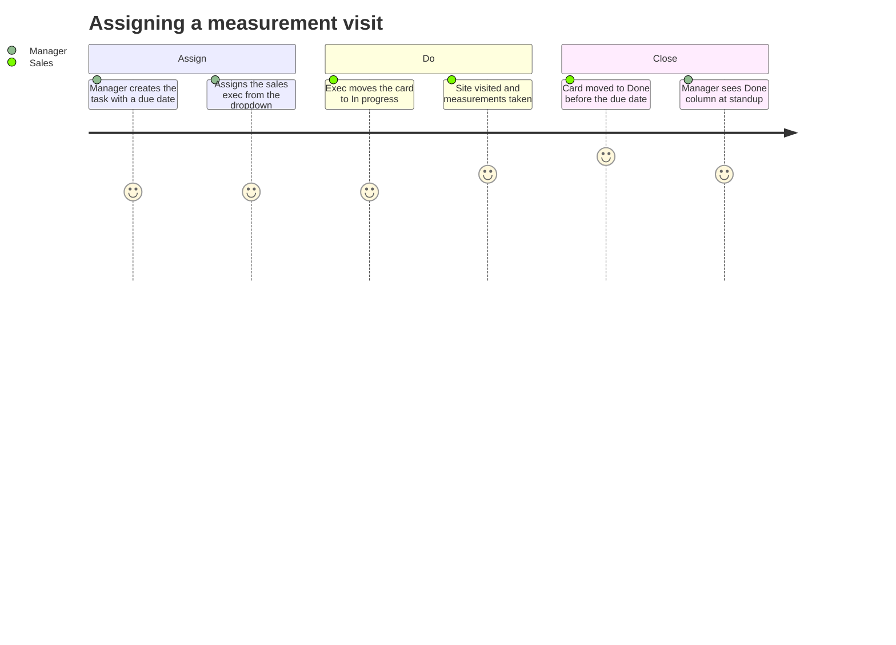
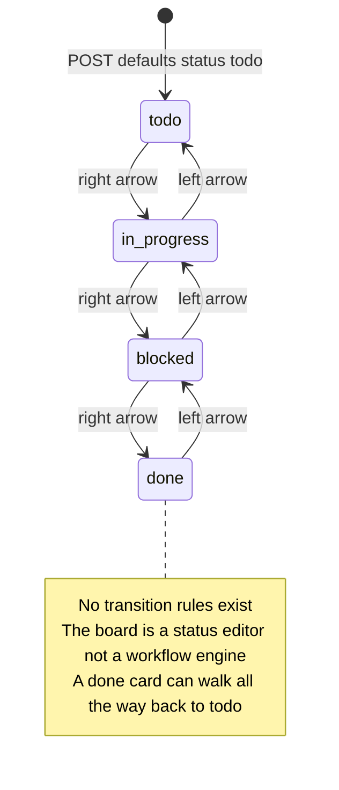
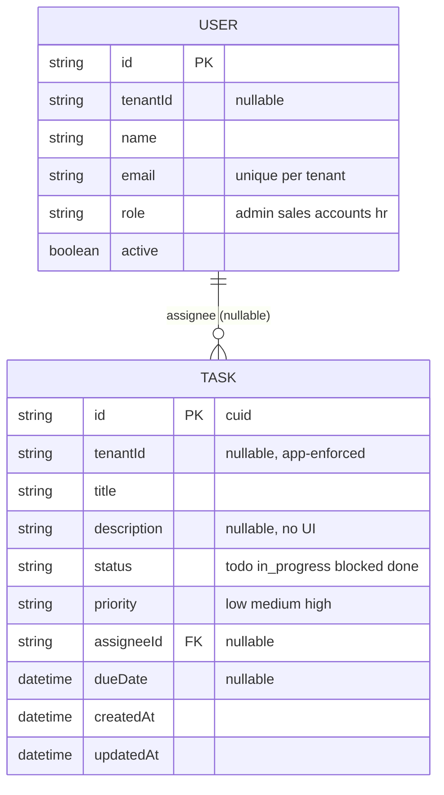
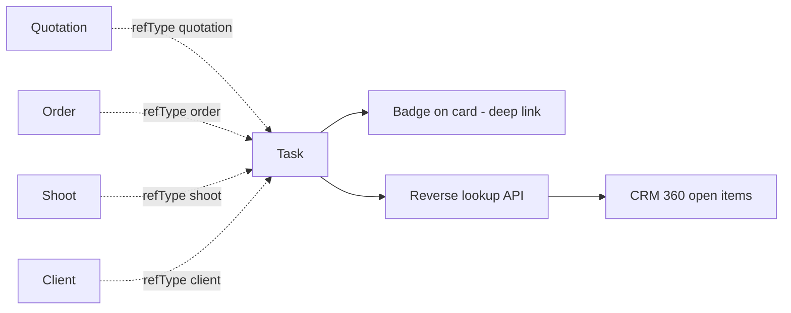
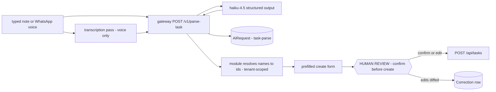

# Tasks — engineering bible

Four-column kanban board for internal work items with assignees, priorities and due dates. The youngest module (port `:3017`, added after users `:3016`), the most widely granted (every seeded role holds `tool:tasks`), and — one detail with suite-wide consequences — the **only module whose PATCH whitelists its fields**. That whitelist is the reference pattern the leads and CRM bibles both import as their worked security fix; this page documents it as the canonical original, including its one bug.

**Status: suite app `apps/tasks`, subdomain `tasks.maplefurnishers.com`, dev port `:3017`, container from `maple-suite:latest` with `APP=tasks` (docker-compose.yml).**

## For managers — plain-language guide

This is the shared to-do board — the one tool every single role in the company can open. Anything that must not be forgotten goes on a card: a measurement visit at a client's flat, chasing the plywood vendor, sending the revised quote. Cards sit in four columns — To do, In progress, Blocked, Done — and move with a click as the work moves. Honest caveats: there is no drag-and-drop yet (cards move one column at a time via arrow buttons), no way to see "just my tasks", and no reminders — the board tells you what's overdue only while you're looking at it.

| Feature | What it means in your day | Who uses it |
| --- | --- | --- |
| Four-column kanban | The whole team's workload at a glance; a card moves right as work progresses, and back left if it stalls | Everyone — every role has access |
| Create with assignee, priority, due date | "Measurement visit — Sharma residence", assigned to the sales exec, high priority, due Friday — captured in ten seconds | Managers, everyone |
| Assignee dropdown | Pick from the actual active staff list — no free-typed names, no "who is RK?" | Everyone |
| Overdue highlighting | The due date turns red the moment a not-done task slips past it — the thing to scan every morning | Managers |
| Open/total rollup and column counts | "12 open · 47 total" plus per-column numbers tell you the team's load before you assign more | Managers |
| Hover delete | The × removes a task — careful: no confirmation, no undo | Everyone |

Signs it's working:

- The measurement visit actually happens on Friday because it lived on the board, not in someone's head.
- The Blocked column stays short and gets talked about daily.
- Red overdue dates are rare, and each one has an explanation rather than a shrug.



---

## Part A — for implementers

### A1 — what exists today

- Kanban board with fixed columns `To do → In progress → Blocked → Done` (`COLS` constant, `app/page.tsx:11`); cards move one column at a time via ← / → buttons — there is **no drag-and-drop**.
- Create form: title (required — and validated server-side too, the only server-side input validation across leads/crm/tasks), assignee dropdown, priority `low | medium | high`, due date.
- Assignee dropdown populated from the module's own `GET /api/users` — active users only, id + name.
- Overdue highlighting: a non-done task with `dueDate` in the past renders its date in the destructive color (computed per-render, `new Date(t.dueDate) < new Date()`).
- Header rollup "N open · M total"; per-column counts; delete `×` revealed on card hover (no confirm).
- What does *not* exist: description UI (the column is in the model and PATCH whitelist, never collected or shown), my-tasks filter, task detail, comments, recurrence, reminders, any link from a task to the record it is about.
- Who can be here: every seeded role — `admin`, `sales`, `accounts`, `hr` all hold `tool:tasks`, making this the one tool the whole company shares and therefore the natural home for the suite's first notification surface (B3.2).

The board's movement model, exactly as the arrow buttons implement it — one column per click, either direction, no rules:



### A2 — file-by-file, lifecycles traced

| File | Role |
| --- | --- |
| `apps/tasks/app/page.tsx` | The entire UI — one `"use client"` component, ~100 lines |
| `apps/tasks/app/api/tasks/route.ts` | GET (list + assignee name), POST (create, validates title) |
| `apps/tasks/app/api/tasks/[id]/route.ts` | PATCH (**whitelisted**), DELETE |
| `apps/tasks/app/api/users/route.ts` | GET — assignee picker helper (see the leak note below) |
| `apps/tasks/app/api/auth/logout/route.ts` | POST — clears the shared session cookie |
| `apps/tasks/app/layout.tsx` | Server layout: session, brand, `isEnabled("tool.tasks")`, `SuiteShell current="tasks"` |
| `apps/tasks/middleware.ts` | Edge auth: JWT verify + `tool:tasks` gate (`TOOL = "tasks"`) |

**Request lifecycle.** The standard suite chain (traced fully in the leads bible A2; identical here with `TOOL = "tasks"` and flag key `tool.tasks`): edge middleware verifies the `mt_session` JWT locally, 401/403s APIs or redirects pages to admin login, gates on `canAccessTool(perms, "tasks", role)`. Legacy fallback for pre-perms sessions: `"/tasks": ["admin","sales","accounts","hr"]` — everyone, matching the seeded perms. Flag-off swaps the page for `ToolDisabled`; APIs stay reachable.

**UI lifecycle — `page.tsx` traced.**

- State: `rows: Task[]`, `users: U[]` (`{id, name}`), `error`, `loading`, `form: { title, assigneeId: "", priority: "medium", dueDate: "" }`.
- `load()` — standard defensive fetch of `/api/tasks` (error JSON → banner, throw → generic message).
- `loadUsers()` — fetch `/api/users`; **errors swallowed entirely** (`catch {}`), and the endpoint itself returns `[]` on DB failure — so a broken DATABASE_URL yields an empty assignee dropdown beside a 503 board banner, two different failure stories on one screen. Both fire once from a single `useEffect`.
- `add(e)` — client-side empty-title bail; POST; reset + full refetch on OK. `assigneeId: ""` posts as an empty string, which the API's `b.assigneeId || null` normalizes to null — unassigned.
- `patch(id, d)` — one function serves both edits and column movement; fires PATCH then refetches everything.
- `remove(id)` — DELETE + refetch. No confirm.
- `idx(s)` — status → column index; the ← / → buttons render conditionally at the ends and call `patch(t.id, { status: COLS[idx ± 1].id })`, so a card can move backwards (`done → in_progress`) as freely as forwards. There is no transition rule — the board is a status editor, not a workflow engine.
- Render: four columns from one `rows.filter` per column; overdue computed inline; priority badge from the `PV` variant map.

**API lifecycle — handler by handler.**

- `GET /api/tasks` — `task.findMany({ orderBy: { updatedAt: "desc" }, include: { assignee: { select: { name: true } } } })` through `tenantDb()`; try/catch → 503. The include means the board never joins client-side — cards get `assignee.name` directly.
- `POST /api/tasks` — `if (!b.title?.trim()) return 400 { error: "Title required." }` — the validation line the other two modules lack. Then field-by-field create: `status` defaults `"todo"`, `priority` `"medium"`, `assigneeId || null`, `dueDate` coerced with `new Date(b.dueDate)` (an invalid date string becomes `Invalid Date` → Prisma 500 — coercion without validation). Not try/caught: DB down → 500.
- `PATCH /api/tasks/[id]` — **the house pattern.** Scoped `findFirst` guard first (404 for cross-tenant ids; required because the tenant extension doesn't hook single-row `update`), then:

  ```ts
  const data: Record<string, unknown> = {};
  for (const k of ["title", "description", "status", "priority", "assigneeId"])
    if (b[k] !== undefined) data[k] = b[k] || null;
  if (b.dueDate !== undefined) data.dueDate = b.dueDate ? new Date(b.dueDate) : null;
  ```

  What makes it right: unknown keys are dropped (no `tenantId`/`createdAt` writes, ever), absent keys are ignored (`!== undefined`, so a PATCH is a true partial), and `dueDate` gets typed coercion. Its one bug: `b[k] || null` treats *falsy-but-present* as clear-the-field, which is correct for the nullable columns but wrong for `title` — `PATCH {"title": ""}` nulls a required column and Prisma throws a 500. The corrected variant (required fields skip the `|| null` arm) is written out in the leads and CRM bibles' Recipe 1; if this handler is touched, fix `title` the same way.
- `DELETE /api/tasks/[id]` — guard, delete, `{ok:true}`. No `act:delete` check.
- `GET /api/users` — `user.findMany({ where: { active: true }, select: { id, name }, orderBy: { name: "asc" } })`, catch → `200 []`. Two deliberate notes: the `select` keeps `email`/`role`/`passwordHash` out of the response (good), but the route is guarded only by `tool:tasks` — **anyone who can open the board can enumerate the tenant's staff names**, no `tool:users` required. Minimal exposure, but it is a cross-tool boundary crossed silently; B3.3 replaces it.

### A3 — data model and API surface

Owned model: `Task` (`packages/db/prisma/schema.prisma:264`), with an optional assignee FK into the shared `User` model — the only leads/crm/tasks model that references identity. `tenantId` nullable, enforced by `tenantDb` (`Task` and `User` are both in the `SCOPED` set).



| Route | Method | Request body | Response | Auth that actually exists |
| --- | --- | --- | --- | --- |
| `/api/tasks` | GET | — | `200` `[{id, tenantId, title, description, status, priority, assigneeId, dueDate, createdAt, updatedAt, assignee: {name} \| null}]`; `503 {error}` | Middleware: JWT + `tool:tasks` |
| `/api/tasks` | POST | `{title, description?, status?, priority?, assigneeId?, dueDate?}` | `200` full row; `400 {error:"Title required."}`; `500` DB down | Middleware only |
| `/api/tasks/[id]` | PATCH | Subset of the six whitelisted fields — others silently dropped | `200` updated row; `404 {error:"Not found in tenant"}` | Middleware only |
| `/api/tasks/[id]` | DELETE | — | `200 {ok:true}`; `404` cross-tenant | Middleware only — **no `act:delete`** |
| `/api/users` | GET | — | `200 [{id, name}]` — **`[]` on DB error, never 503** | Middleware `tool:tasks` — not `tool:users` |
| `/api/auth/logout` | POST | — | `200 {ok:true}` + cleared cookie | None |

**Wire shapes, verbatim.**

```json
// POST /api/tasks — the form state; assigneeId "" means unassigned (normalized to null server-side)
{ "title": "Chase plywood vendor", "assigneeId": "", "priority": "high", "dueDate": "2026-07-20" }

// 200 response — full row (assignee include only appears on GET)
{ "id": "cmcxl1...", "tenantId": "cmc1a9...", "title": "Chase plywood vendor",
  "description": null, "status": "todo", "priority": "high", "assigneeId": null,
  "dueDate": "2026-07-20T00:00:00.000Z",
  "createdAt": "2026-07-17T09:14:03.512Z", "updatedAt": "2026-07-17T09:14:03.512Z" }

// GET /api/tasks — one element; note the joined assignee name
{ "id": "cmcxl1...", "title": "Chase plywood vendor", "status": "in_progress",
  "priority": "high", "assigneeId": "cmcu2...", "dueDate": "2026-07-20T00:00:00.000Z",
  "assignee": { "name": "Sales" } }

// PATCH /api/tasks/[id] — what the arrow buttons send
{ "status": "in_progress" }

// PATCH — dropped silently by the whitelist (correct); the title line is the one that 500s (the bug)
{ "tenantId": "x", "hacker": true }
{ "title": "" }

// GET /api/users — the assignee picker; [] on DB error, never a 503
[ { "id": "cmcu1...", "name": "Accounts" }, { "id": "cmcu2...", "name": "Admin" } ]
```

**Failure modes, mapped.**

| Failure | Surface | What actually happened |
| --- | --- | --- |
| DB unreachable | Amber banner, board empty, **assignee dropdown silently empty** | GET tasks → 503 body; GET users → `catch` → `200 []`; `loadUsers()` swallows everything |
| Create with empty title | Nothing (client bails first) | Server would 400 with `Title required.` — the one server-side validation in the three modules |
| `PATCH {"title": ""}` | Card edit silently fails | `"" \|\| null` → `title: null` → Prisma rejects a required column → 500 |
| Invalid `dueDate` string | Silent failure | `new Date(bad)` → Invalid Date → Prisma 500 |
| Garbage / cross-tenant `assigneeId` | Silent failure | FK violation → 500 (no existence check — Recipe 2) |
| Flipt `tool.tasks` off | "Tasks is disabled" page | Layout swap only — all four API routes still answer |

### A4 — configuration reference

Shared suite surface; tasks-specific values:

| Variable | Notes |
| --- | --- |
| `DATABASE_URL` | Required; board 503s, users helper degrades to `[]` |
| `AUTH_SECRET` / `COOKIE_DOMAIN` / `LOGIN_URL` | Shared SSO — see the leads bible A4 for full semantics |
| `FLIPT_URL` / `FLIPT_NAMESPACE` | Kill-switch key `tool.tasks`; fail-open when unset |
| `APP=tasks` | docker-compose selector (compose lines 141–144) |

Dev: `npm run -w @maple/app-tasks dev -- -p 3017` (`PORTS.local.txt` — tasks sits after users `:3016`; it was added later and the port map is append-only). Seed creates **no demo tasks**, but all four seeded users (`admin/sales/accounts/hr @maplefurnishers.com`, `maple@123`) appear in the assignee dropdown, and *every* seeded role carries `tool:tasks` (seed.mjs:16,20,22) — the suite's one universal tool.

### A5 — recipes

**Recipe 1 — fix the `|| null` title bug.** One line: `if (typeof b.title === "string") { const t = b.title.trim(); if (t) data.title = t; }` replacing `title`'s trip through the loop. Keeps the whitelist intact, stops `""` from nulling a required column. (Also validate `status`/`priority` against their closed sets while there — the whitelist controls *which* fields, not *what values*.)

**Recipe 2 — validate `assigneeId`.** The whitelist passes any string; a garbage id 500s on the FK, and a *valid id from another tenant* would link cross-tenant (User rows are tenant-scoped but the FK write isn't checked). Before the update: `if (data.assigneeId && !(await db.user.findFirst({ where: { id: data.assigneeId as string, active: true } }))) return 400` — `findFirst` runs through the tenant extension, so this is simultaneously an existence, active, and tenancy check.

**Recipe 3 — "my tasks" filter.** Server-side, not client: `GET /api/tasks?mine=1` reads the session (`getSession()`) and adds `where: { assigneeId: user.id }`. UI: a toggle beside the header rollup. Do it server-side so the enterprise-tier pagination (B4) composes with it.

**Recipe 4 — surface `description`.** The column, POST field, and PATCH whitelist entry all exist; only UI is missing. Add a textarea to the form (span the grid), render as a muted second line on the card, clamp to two lines. Zero API work.

**Recipe 5 — add `act:delete` + a delete confirm.** Same handler-side `can(user?.perms, "delete")` pattern as the other modules (leads bible A5 Recipe 2); pair it with a `confirm()` in `remove()` — tasks is currently the module where a hover-reveal `×` destroys a record with no confirmation *and* no permission check.

**Recipe 6 — drag-and-drop without changing the API.** The endpoint contract already supports it — a drop is just `PATCH { status }`, the same call the arrow buttons make. `@dnd-kit/core`: wrap the board in `<DndContext onDragEnd={...}>`, each column is a `useDroppable` with `id = col.id`, each card a `useDraggable` with `id = task.id`; `onDragEnd` reads `over?.id` as the new status, **optimistically moves the card in local state**, then fires the PATCH and rolls back on failure. Keep the arrow buttons — they are the keyboard/mobile accessibility path, and they already encode the "any direction" transition policy the drag must match. This recipe is deliberately UI-only: resist inventing a `position` column until someone actually asks for manual ordering *within* a column; `updatedAt desc` ordering has been sufficient.

---

## Testing — how we verify this module

**Current state, honestly: zero tests under `apps/tasks`** (verified). The irony is sharp: this module owns the PATCH whitelist that two other bibles cite as the house security pattern, and that pattern is protected by nothing but convention. The root harness is in place — `vitest.config.ts` globs `apps/**/*.test.{ts,tsx}` into `npm test` (CI), Playwright runs `e2e/` against a live local stack — so the only missing ingredient is the test files.

**Unit targets (vitest) — the whitelist is the crown jewel and gets the first file:**

- Unknown keys are dropped: `PATCH {"tenantId": "x", "hacker": true}` builds a `data` object containing neither — the property the whole suite copies, pinned so a refactor can't silently lose it.
- Absent keys are ignored: a PATCH of `{status}` alone leaves `title`/`assigneeId` untouched (`!== undefined`, not truthiness).
- `dueDate` coercion: `""` → `null`, `"2026-07-20"` → `Date`; an invalid date string must become a 400, not today's `Invalid Date` → Prisma 500.
- **The `|| null` title bug as a named test case:** `PATCH {"title": ""}` must be *ignored* (or 400), never `title: null` on a required column. **This test fails today** — it currently produces a Prisma 500 — and is the executable spec for A5 Recipe 1. Land it red-and-skipped or fix-and-green, but land it.
- POST validation: empty/whitespace title → `400 {"error": "Title required."}`; `assigneeId: ""` normalizes to `null`.
- Overdue derivation, extracted pure from `page.tsx`: `done` tasks are never overdue; `dueDate: null` is never overdue.

**Integration (route handlers against a scratch Postgres):**

| Named regression case | Asserts | Status today |
| --- | --- | --- |
| `tasks-whitelist-holds` | mass-assignment rejection: `tenantId`/unknown keys in PATCH never persist | **passes** — the only module of the three where it does; keep it that way |
| `tasks-empty-title-500` | `PATCH {"title": ""}` handled gracefully, row keeps its title | **fails** — the `\|\| null` bug (A5 Recipe 1) |
| `tasks-assignee-validated` | garbage or cross-tenant `assigneeId` → 400, not an FK 500 | **fails** — no existence check (A5 Recipe 2) |
| `tasks-users-minimal-shape` | `GET /api/users` returns only `{id, name}` of active users — never `email`, `role`, `passwordHash` | passes — pin it; this route is a deliberate cross-tool exposure (A2) |
| `tasks-cross-tenant-404` | PATCH/DELETE with another tenant's id → 404 | passes |

**E2E (Playwright user stories):**

1. A manager creates "Measurement visit — Sharma residence" assigned to Sales with a due date; the card appears in To do showing the assignee's name.
2. The card walks right through all four columns via the arrows, then back one from Done — asserting the any-direction policy the UI promises.
3. A task due yesterday renders its date in the destructive color; moving it to Done clears the highlight.
4. DB-down smoke: broken `DATABASE_URL` shows the amber banner **and** an empty assignee dropdown — the two-failure-stories screen A2 documents, pinned so a fix to either half is deliberate.

**Definition of done for any tasks change:** the whitelist unit file passes untouched (or the PR explicitly says the contract changed); `tasks-empty-title-500` and `tasks-assignee-validated` flip green with their recipes and never flip back; E2E story 2 is re-run after any board interaction change (drag-and-drop lands against it); bug fixes arrive with their reproducing test first.

---

## Part B — for architects

### B1 — cross-module: tasks that link to any entity

Today a task titled "Follow up on Sharma quote" carries its subject only in prose. Every other module has records tasks are *about* — the design is a polymorphic **taskable** reference, the same shape the CRM bible's `ActivityLog` uses (`refType`/`refId`), so the suite converges on one linking convention:

```prisma
model Task {
  // ... existing fields ...
  refType String?  // "quotation" | "order" | "shoot" | "client" | "lead" | "invoice"
  refId   String?
  @@index([tenantId, refType, refId])
}
```

*Why columns, not a join table:* a task is about at most one thing (multi-link needs are better served by mentioning records in comments later); two nullable columns keep every existing query untouched and the whitelist gains exactly two entries. *Why no DB-level FK:* Postgres cannot FK a column to six tables. Integrity therefore moves to code, in one place — a validation map in `@maple/core`:

```ts
const TASKABLE = { quotation: "quotation", order: "order", shoot: "shoot",
                   client: "client", lead: "lead", invoice: "invoice" } as const;
// POST/PATCH: if refType present -> must be a TASKABLE key, and
// (await tenantDb())[TASKABLE[refType]].findFirst({ where: { id: refId } }) must hit
```

The tenant extension makes that lookup an existence + tenancy check in one call — same trick as Recipe 2. Deletion policy: when a referenced record is deleted, tasks keep the stale ref and render "linked record removed" (a task's history outlives its subject; do **not** cascade). Consumer surfaces, in order of value: (1) a badge on the card deep-linking via `toolUrl(refType)` + query param; (2) reverse lookup — `GET /api/tasks?refType=client&refId=...` feeding the CRM 360 view's open-items panel and a "Tasks (2)" chip on quotations; (3) auto-created tasks from events (B2) arriving pre-linked. The reverse lookup is why the composite index ships with the columns, not later.



### B2 — infrastructure: bootstrap vs enterprise

**Bootstrap (now):** nothing beyond B4's indexes. Reminders (B3.2) at this tier are a single `node scripts/remind.mjs` cron in docker-compose scanning `dueDate` windows — no queue infrastructure for a four-person team.

**Enterprise:**

- **Redis** is the natural home for *time-based* work: BullMQ delayed jobs for reminders (enqueue at task create/PATCH with `delay = remindAt - now`; job id = `task:{id}:remind` so rescheduling a due date is an idempotent replace — cancel + re-add), and the recurrence materializer's lock (`SET NX` leader election so two replicas don't double-spawn instances).
- **Kafka topics:** all through the outbox pattern of [event-catalog.md](event-catalog.html) — same-transaction event rows, at-least-once dispatch, consumers idempotent on event id.

| Direction | Topic | Key | Peers |
| --- | --- | --- | --- |
| produce | `task.created` | `tenantId:taskId` | notification service, analytics |
| produce | `task.completed` | `tenantId:taskId` | analytics (cycle time), auto-task rules |
| produce | `task.overdue` | `tenantId:taskId` | notification service (emitted by the reminder worker when a due window passes unresolved) |
| consume | `lead.created` | — | auto-create "First call" task, due +1 day, round-robin assigned |
| consume | `quotation.accepted` | — | auto-create "Kick off order" task linked `refType: quotation` |
| consume | `shoot.scheduled` | — | auto-create prep checklist tasks linked `refType: shoot` |

  The consume side is where B1's `refType` pays for itself: auto-created tasks arrive already pointing at their subject, and the per-tenant rules table ("on event X create task Y") is configuration, not code.
- **K8s:** web pods (2 × `100m/128Mi`), one worker deployment (BullMQ consumers + reminder scheduler), one CronJob (recurrence materializer, hourly). Workers scale independently of the board.

### B3 — designed enhancements, each in depth

**B3.1 — Recurring tasks.** Recurrence is a *template*, never a mutation of the live task — the two-model shape:

```prisma
model TaskRecurrence {
  id         String    @id @default(cuid())
  tenantId   String?
  title      String
  priority   String    @default("medium")
  assigneeId String?
  rrule      String    // RFC 5545: "FREQ=WEEKLY;BYDAY=MO"
  nextRunAt  DateTime  // materializer cursor
  active     Boolean   @default(true)
}
// Task gains: recurrenceId String? — provenance link back to its template
```

Use RFC 5545 RRULE strings (the `rrule` npm package parses and iterates them) rather than a homemade `freq/interval` pair — calendar recurrence has edge cases (fifth Monday, month-end) that are all already solved there; the UI still only *offers* daily/weekly/monthly presets that serialize to simple RRULEs. The materializer runs hourly and must be crash-safe:

```ts
// scripts/materialize-recurrences.mjs (bootstrap cron) / K8s CronJob (enterprise)
const due = await prisma.taskRecurrence.findMany({ where: { active: true, nextRunAt: { lte: new Date() } } });
for (const r of due) {
  const next = RRule.fromString(r.rrule).after(r.nextRunAt);        // next occurrence strictly after cursor
  await prisma.$transaction(async (tx) => {
    if (r.skipIfOpen) {
      const open = await tx.task.findFirst({ where: { recurrenceId: r.id, status: { not: "done" }, tenantId: r.tenantId } });
      if (open) { await tx.taskRecurrence.update({ where: { id: r.id }, data: { nextRunAt: next } }); return; }
    }
    await tx.task.create({ data: { tenantId: r.tenantId, title: r.title, priority: r.priority,
      assigneeId: r.assigneeId, dueDate: r.nextRunAt, recurrenceId: r.id } });
    await tx.taskRecurrence.update({ where: { id: r.id }, data: { nextRunAt: next } });
  });
}
```

Instance creation and cursor advance share one transaction per template, so a crash between templates re-runs cleanly and a crash mid-template never double-creates. Skip-if-open (don't spawn "Water the plants" #2 while #1 sits in todo) is a per-template boolean, default on — and note it still advances the cursor, otherwise a permanently-open task freezes the schedule. Completing or deleting an instance never touches the template; deactivating the template strands no instances.

**B3.2 — Reminders and notifications, in-app + WhatsApp.** Design in three layers so channels stay pluggable:

1. *Schedule* — `remindAt DateTime?` on Task (default: `dueDate` minus a per-tenant lead time, e.g. 09:00 the day before). Bootstrap: the cron scan. Enterprise: the BullMQ delayed job per B2.
2. *Record* — a `Notification` model, and every channel writes here first: in-app is the source of truth, external channels are deliveries of it.

```prisma
model Notification {
  id        String    @id @default(cuid())
  tenantId  String?
  userId    String    // recipient
  taskId    String?
  kind      String    // task_due | task_assigned | task_overdue
  title     String
  body      String?
  readAt    DateTime?
  channels  Json      @default("{}") // delivery receipts: { "whatsapp": "sent", "inapp": "read" }
  createdAt DateTime  @default(now())
  @@index([tenantId, userId, readAt])
}
```

   The shell's `SuiteShell` header grows a bell with unread count (`GET /api/notifications?unread=1`, `PATCH .../read`) — and because the shell is shared, every suite app inherits the bell the day tasks ships it; the model deliberately carries no task-specific columns beyond the nullable `taskId` so other modules can write their own kinds later.
3. *Deliver* — WhatsApp via the same Cloud API plumbing as the leads module's capture webhook (full platform research and citations in the leads bible B3.2 — shared credentials, one suite-level sender). The constraint that shapes everything: a reminder is **business-initiated**, so unless the employee has messaged the number within 24 hours it *must* be a pre-approved template message (utility category) — free-form reminder text is simply not an option outside the service window. The template to register first:

```
Name: task_reminder   Category: UTILITY   Language: en
Body: "Hi {{1}} - reminder: '{{2}}' is due {{3}}."
Button: URL -> https://tasks.maplefurnishers.com
```

   Billed per delivered template at Meta's per-country utility rate (a few paise each in India; service-window replies are free). Keep per-user opt-in (`User.notifyWhatsApp`, phone required) — messaging staff without consent burns both goodwill and the sender's Meta quality rating, and a degraded quality rating throttles the *leads* module's channel too, since they share the number. The delivery worker writes the receipt back into `Notification.channels` so "did the reminder actually send" is answerable from the database.

**B3.3 — Assignment workflows.** Three steps, each independently shippable:

- *Visibility:* the "my tasks" filter (Recipe 3) plus a "created by me" facet once `createdById String?` is added (write it from the session at POST — today tasks record no author at all, which also blocks any audit story).
- *Notification:* on PATCH where `assigneeId` changes to someone other than the actor → `task_assigned` notification (layer 2 above). This is the single highest-value notification in the module, and it needs `createdById` plus the session to distinguish "assigned to me by someone" from "I grabbed it myself":

```ts
// inside PATCH, after the whitelist builds `data`
if (data.assigneeId && data.assigneeId !== existing.assigneeId && data.assigneeId !== user.id) {
  await db.notification.create({ data: {
    userId: data.assigneeId as string, taskId: id, kind: "task_assigned",
    title: `${user.name} assigned you a task`, body: existing.title,
  } });
}
```

  (Requires the guard `findFirst` to fetch the full row — it already does — and the handler to read the session, which the `act:delete` fix from Recipe 5 introduces anyway. Two security fixes and the flagship notification share the same three lines of plumbing.)
- *Policy:* replace the users-list free-for-all with assignment rules — round-robin within a role for auto-created tasks (the Redis queue from B2), and a per-tenant setting for whether non-admins may assign to others or only to themselves. This is also where the `/api/users` leak gets fixed properly: replace the module-local endpoint with a core `GET /api/assignable-users` that filters by the *caller's* assignment policy instead of exposing the full active roster to anyone with `tool:tasks`.

### B4 — scaling

A tasks table grows faster than leads or clients — every workflow event can spawn rows once B2's auto-creation lands — but the board only ever *shows* open work, which is the entire scaling strategy:

- **Stop fetching done tasks.** `GET /api/tasks?status=open` by default, with a separate paginated "Done" archive view. A kanban that loads every completed task ever created is the module's only real growth bug; everything else on this list is hygiene.
- **Indexes.** `@@index([tenantId, status])` for the column filters, `@@index([tenantId, assigneeId, status])` for my-tasks, `@@index([tenantId, remindAt])` for the bootstrap-tier reminder scan (the index becomes unnecessary when reminders move into Redis delayed jobs, but it costs nothing to keep).
- **The refetch pattern.** Same as leads/crm: one arrow click = one PATCH + one full board reload. With drag-and-drop (Recipe 6) the optimistic local move makes this fix mandatory rather than nice-to-have — a full refetch mid-drag visibly snaps cards around.
- **Notification fan-out.** The eventual heavy row producer is `Notification`, not `Task` — cap it with a retention sweep (delete read notifications older than 90 days) from day one; nobody has ever asked for their 2019 "task due" pings back.
- **What not to do.** No sharding, no caching layer, ever, at this business's scale. The board's ceiling is a few thousand open tasks, and Postgres does not notice numbers that small.

## AI — use case & pipeline

*Same contract as every AI section in these bibles ([ai-layer.md](ai-layer.html)): module owns retrieval and the review surface, the maple-ai gateway owns keys, models and spend; every call logs an `AiRequest`, every human fix a `Correction` ([er-platform.md](er-platform.html)).*

### Use case — voice/text note → task

**For managers.** "Measurement visit at Sharma's Friday 4pm, send Ramesh" — typed into a quick-add box or forwarded as a WhatsApp voice note — comes back as a prefilled task card: title "Measurement visit — Sharma residence", Ramesh suggested as assignee, due Friday 16:00, linked to the Sharma client record. One tap to confirm; nothing lands on the board until the human says so. This is the ten-second capture promise of the module, minus the typing.

The safety property that shapes the design: the model returns *names*, and the module resolves names → ids deterministically — assignee against the same active-user query behind `/api/users`, client via the B1 `TASKABLE` lookup (which is simultaneously an existence *and* tenancy check, the Recipe 2 trick). The model never emits an id, so a hallucinated id is structurally impossible.



| Concern | Decision |
| --- | --- |
| Endpoint | gateway `POST /v1/parse-task`, called from a quick-add box in apps/tasks (WhatsApp voice path later, on the leads bible's B3.2 plumbing) |
| Context sent | note text + active-user *names* roster + client names + `occurredAt` + tenant timezone — "Friday" resolves against when the note was made, never server-now |
| `json_schema` | `{ title: string, assigneeName: string\|null, dueAt: string\|null (ISO), priority: "low"\|"medium"\|"high", refType: "client"\|null, refName: string\|null, confidence: "high"\|"low" }` — `additionalProperties: false` |
| Name→id resolution | module-side and tenant-scoped; no roster match → assignee left unset (never guess a person), no client match → `refType` dropped |
| Model | `haiku-4.5` — short text against a closed schema, the definitional small-model task; per [ai-layer.md](ai-layer.html)'s routing table there is no case for anything bigger |
| ₹/call | ≈₹0.10–0.20 (~1k tokens) vs the ₹8–10 fable-5 catalog page — cheap enough to run on every quick-add without thinking; voice adds a transcription pre-pass logged as its own `AiRequest` (`useCase: "task-transcribe"`) |
| Spend log | `AiRequest { module: "tasks", useCase: "task-parse", promptVersion: "task-parse-v1" }` |
| Review surface | the prefilled create form **is** the review — the user confirms or edits before the ordinary `POST /api/tasks` fires; nothing writes without the tap |
| Correction capture | diff between the prefill and what the user actually submitted → `Correction { aiRequestId, modelOutput, humanFixed }` — the confirm step makes labels free |
| Failure mode | gateway down or low confidence → the quick-add degrades to today's plain form with the note as title; capture never blocks on AI |

**Rollout & honest gates.**

- Text parse first, voice second — voice needs WhatsApp media download plus a speech-to-text pass on the same webhook plumbing the leads bible B3.2 documents; don't couple the two builds.
- **Not before** the gateway exists — no Anthropic key ever lands in apps/tasks; key handling, budgets and model routes are the gateway's entire job ([ai-layer.md](ai-layer.html)).
- `refType`/`refName` prefill assumes B1 has landed; until then ship title + assignee + due date only — still most of the value.
- Gate to add voice: **≥70% of text prefills accepted without edits over a trial month** (read it straight off the Correction rate). Below that, fix the prompt before adding a lossier input channel.

### B5 — status: done, left, decisions

**Done ✓**
- Kanban CRUD with tenant scoping, server-side title validation, **field-whitelisted PATCH** — the pattern the other modules' fixes copy.
- Assignee assignment against real active users, priority badges, due dates with overdue styling.
- SSO middleware, feature-flag kill switch, DB-down/loading/empty states.

**Left ◻ (carried, all still true)**
- No drag-and-drop — arrow buttons only, one column per click.
- `description` exists in model and PATCH whitelist but no UI collects or shows it (Recipe 4).
- No "my tasks" filter — every user sees every task in the tenant (Recipe 3).
- Action-level permission checks missing on mutating routes (DELETE lacks `act:delete`; middleware tool gate only).
- Cross-tool exposure: `/api/users` leaks the active-user roster to anyone with `tool:tasks` — names only, but no `tool:users` required (B3.3 replaces it).
- PATCH `|| null` bug: `title: ""` nulls a required column → 500 (Recipe 1); `assigneeId` unvalidated (Recipe 2).
- The users helper swallows DB failures (`catch → []`) — empty dropdown beside a 503 banner.
- No `/api/health`; no tests under `apps/tasks`.

**Decisions to make**
1. Adopt `refType`/`refId` (B1) *before* auto-created tasks or the CRM 360 view land — both consume it; retrofitting links onto prose titles is manual archaeology.
2. RRULE strings vs a simple freq column for recurrence — recommend RRULE (B3.1); the library cost is trivial and the migration away from a naive scheme is not.
3. Notifications: build the `Notification` model with in-app delivery first, add the WhatsApp template channel second — never couple the reminder scheduler directly to a delivery channel.
4. Whether `createdById` lands with the next migration — it costs nothing now and every audit/workflow feature assumes it (B3.3's assignment notification is the first concrete consumer).
5. Who owns `Notification` long-term: it ships from tasks because reminders need it first, but the model is suite-generic by design — decide early that its API lives in `@maple/core` (or a future notifications service), not behind `tool:tasks`, or the CRM and invoicing modules will each grow their own bell.

**Cross-references:** the PATCH whitelist this module originated is applied as the worked fix in [module-leads.md](module-leads.html) A5 and [module-crm.md](module-crm.html) A5; the `refType`/`refId` convention is shared with CRM's `ActivityLog` (its bible B3.2); WhatsApp platform research and citations live in the leads bible B3.2; event plumbing follows [event-catalog.md](event-catalog.html).
