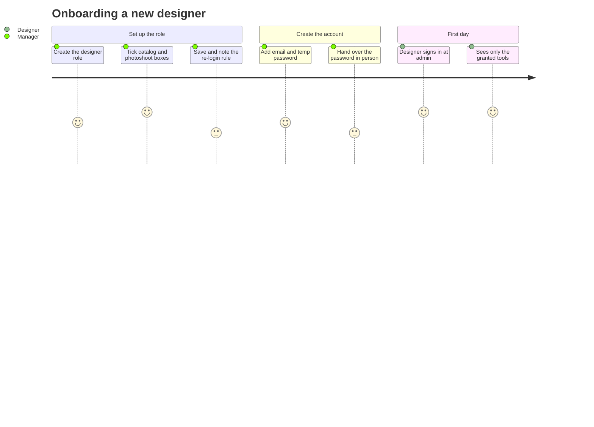
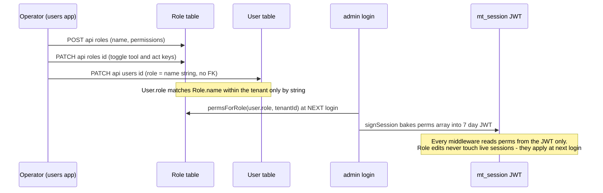
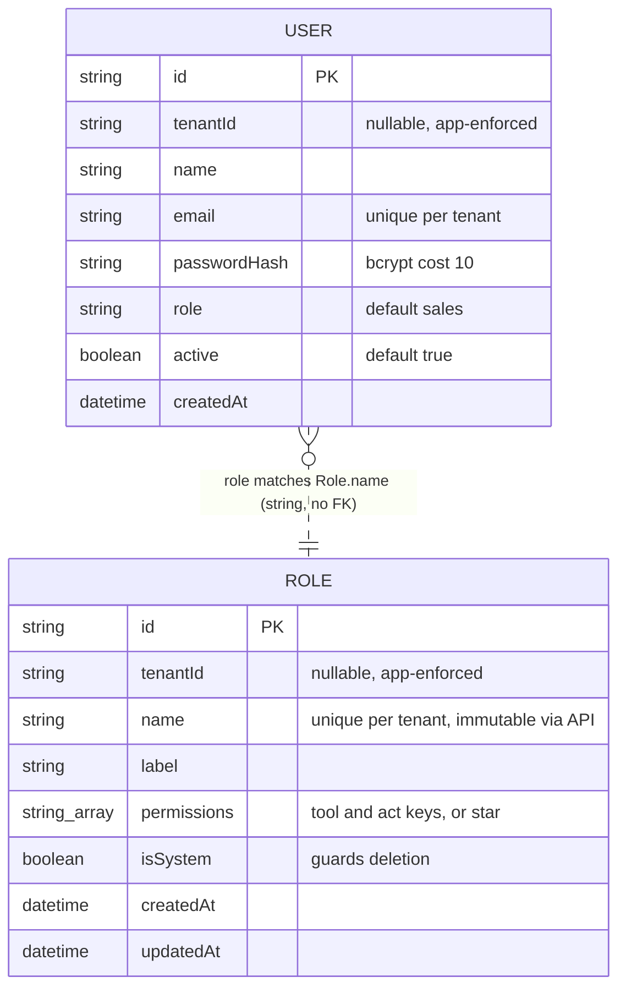
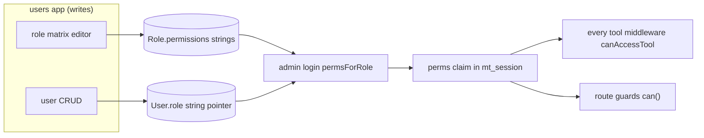
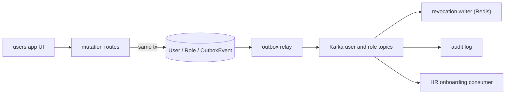
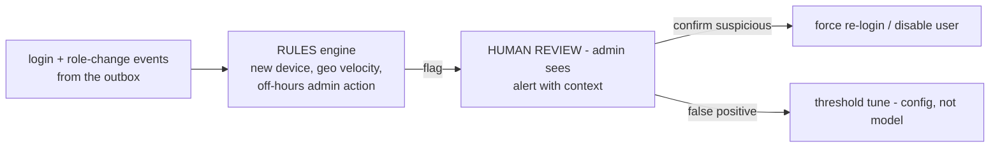

# Users — engineering bible

Team & access management: user accounts plus the role/permission matrix that drives RBAC across every suite tool. Small app, outsized blast radius — the strings this app writes into `Role.permissions` become the `perms` claim in every JWT that admin mints ([module-admin.md](module-admin.html) is the canonical reference for the session/RBAC libraries; this page documents how their *data* is produced and where the enforcement holes are).

**Status:** `apps/users` · `users.maplefurnishers.com` · dev port **:3016** (`PORTS.local.txt`) · prod container from `maple-suite:latest` with `APP: users` (`docker-compose.yml:134-138`).

## For managers — plain-language guide

This is where you decide *who works here and what they're allowed to touch*. Two screens: one lists your team's accounts, the other defines roles — named bundles of permissions like "sales" or "accounts" — as a simple grid of checkboxes, one per tool and one per sensitive action.

| Feature | What it means in your day | Who uses it |
| --- | --- | --- |
| Add a teammate | A new designer joins the Kirti Nagar studio: create their account with an email and a temporary password you hand over in person, and pick their role | Owner / office manager |
| Change someone's role | The designer moves into sales: switch the role from the dropdown on their row — the new access applies the next time they sign in | Owner / office manager |
| Deactivate an account | A salesman leaves: click his status badge to disable the account. Important: an already-signed-in session can keep working for up to 7 days — for an immediate cut-off, also change shared passwords and tell engineering | Owner / office manager |
| Reset a password | A teammate forgets their password: set a new temporary one on the spot | Owner / office manager |
| Delete an account (with a safety net) | Removing people who left keeps the list clean — the system refuses to delete the last admin so you can never lock the business out | Owner / office manager |
| Roles tab — the permission grid | You decide designers may open Catalog and Photoshoot but not Finance: create a "designer" role and tick exactly those boxes; every tool respects it | Owner / admin |
| Full-access badge | Roles marked "full access" (like admin) can do everything and aren't editable in the grid — by design | Owner / admin |
| Honest re-login notice | After saving a role, the app reminds you that members get the new permissions at their *next sign-in* — changes are not instant | Owner / admin |



**Signs it's working:**
- A new teammate signs in and their launcher shows exactly the tools their role's boxes allow — nothing more.
- Deleting the last admin account is refused with a clear message.
- After a role edit, members see the change only after signing in again — the app says so every time; that message is the honest truth of how the system works today.

---

## Part A — for implementers

### A1 — What it does

- One page, two tabs (`app/page.tsx`, a single 157-line `"use client"` component):
  - **Users tab** — create an account (email + temp password, bcrypt-hashed server-side), change a user's role inline via a `<Select>` of live role names, toggle active/disabled by clicking the status badge, reset a password (browser `prompt()`), delete with a last-admin guard.
  - **Roles tab** — create custom roles (name slugified server-side), edit each role as a checkbox matrix over the real permission vocabulary: `tool:*` keys generated from `TOOLS` (`@maple/core/lib/nav`) × `act:*` keys from `ACTIONS` (`@maple/core/lib/rbac`), delete non-system roles.
- Roles containing `"*"` render as a "full access" badge and are not editable in the matrix (the Save button is hidden too).
- Saving a role fires `alert("Saved. Members must sign in again to get new permissions.")` — honest UX for the perms-baked-at-login model (see the Key flow below for exactly why).

### A2 — Code architecture

| Layer | Path | Notes |
| --- | --- | --- |
| UI | `app/page.tsx` | The only page; users/roles tab switch, all fetches inline |
| Users API | `app/api/users/route.ts` (GET, POST), `app/api/users/[id]/route.ts` (PATCH, DELETE) | `tenantDb()` everywhere |
| Roles API | `app/api/roles/route.ts` (GET, POST), `app/api/roles/[id]/route.ts` (PATCH, DELETE) | `tenantDb()` everywhere |
| Logout | `app/api/auth/logout/route.ts` | Clears `mt_session` via `sessionCookieOptions(0)` |
| Gate | `middleware.ts` | `verifySession` + `canAccessTool(perms, "users", role)` — the *only* authorization in the app |
| Shell | `app/layout.tsx` | `SuiteShell` from `@maple/core` |
| Shared vocabulary | `@maple/core/lib/rbac.ts` (`ACTIONS`, `ACTION_LABEL`, `toolPerm`, `actionPerm`), `nav.ts` (`TOOLS`) | Imported **client-side** by the page — the role editor renders whatever these arrays contain, so extending the vocabulary is a core-package change, not a users-app change |

#### Middleware, traced

`middleware.ts` (23 lines) is the tool-app archetype: no cookie → API paths 401 JSON, pages 302 to `LOGIN_URL` (default `https://admin.maplefurnishers.com/login`) with `?next=` rebuilt from `x-forwarded-host`; cookie but `canAccessTool(user.perms, "users", user.role)` false → API 403, pages redirect to admin. The matcher excludes `api/auth` (so logout works without a session) and static assets. Per the seed, only `admin` (`["*"]`) holds `tool:users` — but that is convention, not enforcement: any role granted `tool:users` in the matrix passes this gate, which is the root of B1 below.

#### Route handlers, traced function by function

**`GET /api/users`** — `tenantDb()` → `user.findMany` ordered by `createdAt`, `select` limited to `id, name, email, role, active, createdAt` (never `passwordHash`). DB down → 503 with a setup hint.

**`POST /api/users`** — validates only `email` and `password` presence (400 otherwise). `user.create({ name: b.name || b.email, email: lowercased, passwordHash: await hashPassword(b.password), role: b.role || "sales" })`. Notes: `tenantDb()` stamps `tenantId`; the `@@unique([tenantId, email])` constraint surfaces as a 400 "email may already exist"; **`role` is any string** — it is not checked against existing `Role.name`s, so a typo creates a user whose `permsForRole` resolves to `[]` at login (locked out of everything, silently).

**`PATCH /api/users/[id]`** — scoped `findFirst({ where: { id } })` existence check (404 otherwise; this is the manual guard `tenant-db.ts` requires for unique-key updates), then a **field whitelist**: only `name`, `role`, `active` copied from the body, plus `password` → `passwordHash` rehash. No mass assignment (unlike the leads/crm PATCH handlers — this app got it right).

**`DELETE /api/users/[id]`** — scoped existence check, then the last-admin guard: if the target's `role === "admin"` and `count({ role: "admin" }) <= 1` → 400. The guard is **literal**: a custom role holding `"*"` doesn't count as an admin, so deleting the last literal-`admin` user while a `superuser` (`["*"]`) exists is blocked unnecessarily, and conversely a tenant whose only full-access user has a custom role can delete them and lock the tenant out.

**`POST /api/roles`** — slugifies `name` (`lowercase`, strip non `[a-z0-9-]`), 400 if empty, then `role.create({ name, label: b.label || name, permissions: Array.isArray(b.permissions) ? b.permissions : [] })`. Two things to see clearly: (1) `permissions` is accepted **verbatim from the request body** — including `["*"]`; (2) there is **no `can(perms, "manage_roles")` check** — the middleware tool gate is the only barrier. Together: privilege escalation (B1).

**`PATCH /api/roles/[id]`** — scoped existence check; accepts only `label` and `permissions` (so role **rename is impossible** — `name` is never writable, a deliberate-looking choice since `User.role` matches on name). **`DELETE /api/roles/[id]`** — refuses `isSystem` roles; otherwise deletes, leaving any users with that role string **dangling** (they resolve to `[]` perms at next login — no reassignment, no warning).

#### The client page, traced (`app/page.tsx`)

State: `tab` (users/roles), `rows: U[]`, `roles: Role[]`, `error`, `loading`, `form` (new-user), `roleForm` (new-role). On mount, `loadUsers()` and `loadRoles()` fire in parallel; every mutation re-fetches rather than patching local state — the same dumb-client/canonical-server pattern as admin's `WebsiteManager`.

- `add(e)` — guards `email`/`password` non-empty client-side, POSTs `/api/users`, resets the form on 200, `alert(j.error)` otherwise. Role defaults to `sales` in the form (matching the schema default).
- `patchUser(id, d)` — the workhorse: the role `<Select>` and the active-badge click both call it with a one-field body; **no confirmation on role change** — selecting a different option mutates immediately (a slip of the mouse reassigns a role; RBAC v2 UI guardrails in B3 add friction here).
- `resetPw(u)` — `prompt()` → PATCH `{password}` → `alert("Password updated.")`. The temp password transits in the operator's browser memory and the request body only (never stored plaintext), but `prompt()` offers no strength feedback and the password is visible on screen.
- `removeUser(u)` — `confirm()` then DELETE; surfaces the last-admin 400 via `alert`.
- `createRole(e)` — POSTs name+label; the server slugifies, so "Senior Designer" becomes `senior-designer` while `label` keeps the display form.
- `togglePerm(roleId, key)` — pure client-side state flip; nothing persists until `saveRole(role)` PATCHes the whole `permissions` array (last-writer-wins — two operators editing the same role concurrently silently clobber each other; acceptable at this team size, noted for B3).
- `roleLabel(name)` — display lookup with a raw-name fallback, which is also how a **dangling role string** becomes visible in the UI: the user's row shows the raw name with no matching option in the select.

#### The key flow: role create → assign → JWT baking



Permissions are stateless: there is no session store to invalidate, so a revoked permission keeps working until the 7-day JWT expires or the user signs in again. The UI's alert after saving a role is the entire mitigation today. The structural fixes live in [module-admin.md](module-admin.html) B2 (Redis revocation / short-token re-issue) — this app would be their trigger point (`session.revoked` on role change).

Walked end-to-end for a brand-new teammate:

1. Operator (admin role) creates role `designer` → `POST /api/roles` slugifies and stores `{ name: "designer", label: "Designer", permissions: [] }` under the operator's `tenantId` (stamped by `tenantDb()`).
2. Operator ticks `tool:catalog`, `tool:photoshoot`, `act:publish` and saves → `PATCH /api/roles/[id]` replaces the whole `permissions` array.
3. Operator creates the user with a temp password and role `designer` → `POST /api/users` bcrypt-hashes and stores; the role is stored as the raw string `"designer"`.
4. Teammate signs in at admin → `permsForRole("designer", tenantId)` → `["tool:catalog","tool:photoshoot","act:publish"]` → `signSession` bakes it into their JWT.
5. Every app's middleware now answers `canAccessTool` from that array locally; catalog's publish button checks `can(perms, "publish")`. No further reads of the `Role` table happen for this session.
6. Operator later unticks `act:publish` → nothing changes for the live session; the change lands at step 4 of the teammate's *next* login. That gap — and closing it — is the single most consequential design property of this module.

### A3 — Data model & API

Owned models: `User` and `Role` (`packages/db/prisma/schema.prisma:252-262, 314-325`). There is **no FK between them** — `User.role` is a string matched against `Role.name` within the same tenant (`permsForRole` does `findFirst({ name, tenantId })`). Uniqueness is per tenant: `@@unique([tenantId, email])`, `@@unique([tenantId, name])`.



| Route | Method | Request → Response | Auth gate that actually exists |
| --- | --- | --- | --- |
| `/api/users` | GET | → `[{id, name, email, role, active, createdAt}]` (no hash) · 503 no DB | Middleware only: JWT + `tool:users` |
| `/api/users` | POST | `{name?, email, password, role?}` → created summary · 400 missing/dup | Middleware only — **no `act:manage_users` check** |
| `/api/users/[id]` | PATCH | whitelist `{name?, role?, active?, password?}` → summary · 404 not in tenant | Middleware only |
| `/api/users/[id]` | DELETE | → `{ok}` · 400 last literal admin · 404 | Middleware only — no `act:delete` |
| `/api/roles` | GET | → `Role[]`, system roles first · 503 | Middleware only |
| `/api/roles` | POST | `{name, label?, permissions?[]}` → Role · 400 empty/dup name | Middleware only — **no `act:manage_roles` check (B1)** |
| `/api/roles/[id]` | PATCH | `{label?, permissions?[]}` → Role · 404 | Middleware only |
| `/api/roles/[id]` | DELETE | → `{ok}` · 400 isSystem · 404 | Middleware only |
| `/api/auth/logout` | POST | → `{ok}` + cleared cookie | None (matcher excludes `api/auth`) |

#### The permission vocabulary as seeded (reference)

From `packages/db/prisma/seed.mjs` — the ground truth for "who can what" on a fresh install (the live grid is [rbac-matrix.md](rbac-matrix.html)):

| Role | `permissions` |
| --- | --- |
| `admin` (system) | `["*"]` |
| `sales` (system) | `tool:` leads, crm, quotations, orders, invoices, catalog, photoshoot, price-list, inventory, challans, tasks + `act:export`, `act:publish` |
| `accounts` (system) | `tool:` crm, invoices, payments, inventory, finance, purchase-orders, expenses, tasks + `act:export` |
| `hr` (system) | `tool:` hr, tasks |

Notes that matter to implementers: `tool:price-list` is granted but `price-list` is **not** in `TOOLS` (`nav.ts`) — the checkbox matrix can't display or edit it, so it survives only until someone saves the sales role from the UI (the PATCH replaces the whole array with what the matrix knows). `docs` has no `tool:` key at all — the docs app has no middleware to consume one ([module-docs.md](module-docs.html)). Only `admin` holds `tool:users`.

### A4 — Config reference (every env var this app reads)

| Var | Read in | Default | Notes |
| --- | --- | --- | --- |
| `AUTH_SECRET` | `core/session.ts` via middleware + logout | dev fallback | Must equal admin's — it verifies what admin signed |
| `LOGIN_URL` | `middleware.ts` | `https://admin.maplefurnishers.com/login` | Both the unauthenticated redirect and the access-denied redirect |
| `COOKIE_DOMAIN` | `core/session.ts` (logout path) | unset | Must match admin's or logout clears a different cookie scope |
| `DATABASE_URL` | `@maple/db` | — | Shared Postgres |
| `NEXT_PUBLIC_SUITE_DOMAIN` | `core/nav.ts` | `.maplefurnishers.com` | The `TOOLS` list the role matrix renders; also `SuiteShell` links |
| `FLIPT_URL`, `FLIPT_NAMESPACE` | `core/flags.ts` | fail-open | `tool.users` flag can hide the whole app |
| Seed-time: `ADMIN_EMAIL`, `ADMIN_PASSWORD` | `packages/db/prisma/seed.mjs` | `admin@maplefurnishers.com` / `maple@123` | Seed creates the 4 system roles (`admin` `["*"]`, `sales`, `accounts`, `hr`) and 4 demo users, all `maple@123` |

### A5 — Recipe: add a new permission action, properly enforced

Worked example: `act:approve` (approving quotations/POs). "Properly" means enforced at the route layer — the part the existing actions skip.

1. **Vocabulary** — `packages/core/src/lib/rbac.ts`: append `"approve"` to `ACTIONS` and add `ACTION_LABEL.approve = "Approve documents"`. Because `ACTIONS` is `as const` and `ActionKey` derives from it, TypeScript now accepts `can(perms, "approve")` everywhere. The users-app role matrix picks it up **with zero changes** — the Roles tab maps over `ACTIONS`.
2. **Seed** — `packages/db/prisma/seed.mjs`: grant `"act:approve"` in the appropriate system roles' `permissions` arrays; the upsert's `update` branch rewrites permissions on next seed run.
3. **Enforce at the route layer** — in the consuming app's handler (this is the step B1 shows must never be skipped):

   ```ts
   import { getSession } from "@maple/core/lib/auth";
   import { can } from "@maple/core/lib/rbac";
   const u = await getSession();
   if (!u || !can(u.perms, "approve")) {
     return NextResponse.json({ error: "forbidden" }, { status: 403 });
   }
   ```

   Follow the admin site-CMS routes' `guard()` helper pattern — one 6-line function per file today; B3 below designs the shared helper.
4. **UI affordance** — hide/disable the button with the same `can()` check client-side (perms ride in the JWT; expose them via a `/api/me` or a server-component prop — never trust this alone).
5. **Tests** — extend `packages/core/src/lib/rbac.test.ts` with the new key, and add a route test asserting 403-without/200-with.
6. **Rollout** — remind operators (or rely on the role-save alert): holders get the new action only at next login.

#### Companion recipe: wire a new tool's permission (the other half of the vocabulary)

When a new app lands via `scripts/new-tool.sh` ([module-docs.md](module-docs.html) dev-add-tool guide), its access key is `tool:<name>` and this app is where operators grant it:

1. `packages/core/src/lib/nav.ts` — add `{ tool: "<name>", label: "<Label>" }` to `TOOLS`. The role matrix (and the admin launcher) render it immediately; **skip this and the tool becomes ungovernable from the UI** — exactly the seeded `tool:price-list` orphan documented in A3.
2. `packages/core/src/lib/rbac.ts` — add the tool to the `LEGACY` role map (fallback for pre-permission sessions).
3. `packages/db/prisma/seed.mjs` — grant `tool:<name>` in the right system roles.
4. The new app's `middleware.ts` sets `const TOOL = "<name>"` — the string must match the nav key exactly; there is no registry check, a typo silently denies everyone but `*` holders.
5. Existing sessions see the tool only after re-login (perms baked at login) unless their role is legacy/`*`.

---

## Testing — how we verify this module

**Current state (verified by running `npm test` at the suite root):** **zero tests under `apps/users`.** What exists is `packages/core/src/lib/rbac.test.ts` — 6 passing cases over the pure functions (`canAccessTool` incl. the legacy-role fallback, `can`) — which covers the *vocabulary*, not this app's routes. The missing tests are exactly the B1 regression suite B5 enumerates; this section is its actionable spec. The root vitest config already includes `apps/**/*.test.{ts,tsx}`, so route tests land with zero config.

**Unit-test targets:**

| Function | What to pin |
| --- | --- |
| `canAccessTool` / `can` (`core/rbac.ts`) | covered — extend whenever `ACTIONS`/`TOOLS` grows (A5 step 5 already mandates this) |
| Role-name slugify (`POST /api/roles`) | "Senior Designer" → `senior-designer`; empty after stripping → 400 |
| Last-admin guard predicate | extract to a pure function and pin both documented blind spots: a custom-`*` role doesn't count as admin (blocks unnecessarily) and isn't protected (allows lockout) |
| Escalation ceiling (`newPerms ⊆ actorPerms`, B1 design) | write the checker as a pure function *before* wiring it — the truth table is subtle (`*` trivially satisfies) |

**Integration tests** (route + scratch DB; sign test JWTs with `signSession` and a throwaway secret so the middleware + guard interplay is what's exercised — B5's explicit instruction). The named cases are the known blockers, red first:

| Case | Route | Asserts |
| --- | --- | --- |
| **Roles escalation** (B1, open, pre-pilot blocker) | POST `/api/roles` `{"name":"su","permissions":["*"]}` as `tool:users`-but-not-`manage_roles` | red: expect 403 — today it succeeds and the next login mints a `*` JWT |
| **`manage_users` guard** (open) | POST `/api/users` as the same session | red: expect 403 |
| **Escalation ceiling** (open) | `manage_roles` holder *without* `*` creates a role containing `*` or any key they lack | red: expect 403 |
| **Dangling-role delete** (open) | DELETE `/api/roles/[id]` while members hold the role | red: expect 409 + count, with the `?reassignTo=` path succeeding |
| **Unknown role name** (open — silent lockout) | POST `/api/users` with `role: "typo-role"` | red: expect 400 — today it's accepted and the user resolves to `[]` perms at login |
| Last-admin guard | DELETE the only `role === "admin"` user | 400 — plus the two custom-`*` blind-spot cases pinned as documented behavior |
| No hash leakage | GET `/api/users` | response shape excludes `passwordHash` |
| Tenant isolation | PATCH `/api/users/[id]` with another tenant's session | 404 |

**E2E (Playwright), as user stories:**

1. *Full onboarding.* As admin: create role `designer` with only `tool:catalog` ticked → create the user → sign out → sign in as the designer → the launcher shows catalog only → navigating to the users subdomain redirects away (no `tool:users`).
2. *Role edit propagation.* Untick a tool from `designer`, save, note the alert → the designer's existing session still opens the tool (perms are baked) → sign out and back in → the tool is gone. This test *documents* the staleness model rather than fighting it.
3. *Escalation attempt (after the B1 fix).* Sign in as a `tool:users`-but-not-`manage_roles` user → attempt to create a `["*"]` role via the API → 403; the UI's disabled checkboxes match.

**Definition of done for new features here:** every new or touched mutating route carries a `requireAction` guard and its 403 test in the same PR — this app is the suite's RBAC write-path, so an unguarded route here is a privilege escalation by definition; vocabulary additions extend `rbac.test.ts` and the seed together; anything touching role/user shape re-verifies the JWT claim contract in [module-admin.md](module-admin.html) B1.

---

## Part B — for architects

### B1 — Cross-module relations: the role/perm data contract, and the fixes



**The contract this app produces.** `Role.permissions: string[]` with three key shapes — `"*"`, `"tool:<name>"` (where `<name>` ∈ `TOOLS` plus unreleased ones), `"act:<action>"` (where `<action>` ∈ `ACTIONS`) — consumed by exactly two functions (`canAccessTool`, `can`) and snapshotted into JWTs at login by `permsForRole`. `User.role` is a per-tenant string pointer to `Role.name`. Every module's middleware and a growing set of route guards depend on these strings; nothing validates them at write time.

**The B1 escalation, precisely** (verified; [deployment-runbook.md](deployment-runbook.html) item B1, gaps enumerated in [rbac-matrix.md](rbac-matrix.html)): any user whose role includes `tool:users` — grantable via the same unguarded matrix — can `POST /api/roles {"name":"su","permissions":["*"]}` then `POST /api/users {..., "role":"su"}` (or PATCH their own colleague's role), and the next login mints a `*` JWT. The middleware tool gate is the only check; `manage_users`/`manage_roles` exist in the vocabulary but are **never consulted in this app**.

**Fix design (route-layer guards):**

- Add to `@maple/core/lib/rbac.ts` a route-guard helper so the check can't be hand-rolled inconsistently (NIST RBAC guidance is explicit that permission-to-role assignment is itself a protected operation — see the [NIST RBAC implementation report](https://csrc.nist.rip/staff/Kuhn/rbac-implement.pdf)):

  ```ts
  export async function requireAction(action: ActionKey): Promise<SessionUser> {
    const u = await getSession();
    if (!u || !can(u.perms, action)) throw new HttpError(403, "forbidden");
    return u;
  }
  ```

- `POST/PATCH/DELETE /api/roles*` → `requireAction("manage_roles")`; `POST/PATCH/DELETE /api/users*` → `requireAction("manage_users")`; user DELETE additionally `can(perms, "delete")` if the stricter reading wins (decide once, write it in [rbac-matrix.md](rbac-matrix.html)).
- **Anti-lockout invariant:** a role edit may not remove `manage_roles` from the last role that has it (mirror of the last-admin guard, at the permission level).
- **Escalation ceiling:** creating/editing a role may not grant a permission the *actor* doesn't hold (`newPerms ⊆ actorPerms`, with `*` trivially satisfying it). This single rule kills the escalation even if someone is over-granted `tool:users`.

**The dangling-role-string fix (two options, pick one):**

1. *Referential integrity* — make `User.roleId` an FK with `onDelete: Restrict`; keep `role` name only as a denormalized display value. Honest but a real migration (JWT `role` claim, seed, legacy map).
2. *App-enforced (cheaper, recommended now)* — `DELETE /api/roles/[id]` counts `user.count({ role: role.name })` and 409s with the count, offering reassignment (`?reassignTo=<roleName>` performs an `updateMany` in the same transaction). Plus: `POST/PATCH /api/users` validates `role` against existing `Role.name`s (400 on unknown) — also fixing the silent-typo lockout.

### B2 — Infra touchpoints (bootstrap vs enterprise)

| Concern | Bootstrap (today) | Enterprise (designed) |
| --- | --- | --- |
| Enforcement | Middleware tool gate + (post-B1) route guards, all in-process | Same code path — RBAC deliberately stays library-shaped, not a service; MapleID only changes where tokens are minted |
| Session revocation on role change | None — alert + 7-day expiry | This app is the **trigger**: role PATCH / user deactivate emits `session.revoked`, consumed by the Redis revocation writer designed in [module-admin.md](module-admin.html) B2 (`revoked:user:<id> = now`) |
| K8s profile | n/a (compose) | Stateless, 1 replica is fine (low traffic, no SPOF — outage blocks admin edits only, not logins); standard `/api/health` readiness |
| Events | None (shared DB, UI reloads after each write) | Kafka topics below |

**Kafka identity events (payload schemas).** Producers are this app's mutation routes, wrapped in the same transaction via the outbox pattern already specified in [event-catalog.md](event-catalog.html) (envelope: `id`, `tenantId`, `type`, `createdAt`):

```json
{ "type": "user.created",
  "payload": { "userId": "cuid", "email": "a@b.com", "role": "sales",
               "actorId": "cuid", "invited": false } }

{ "type": "user.deactivated",
  "payload": { "userId": "cuid", "actorId": "cuid", "reason": "manual" } }

{ "type": "role.changed",
  "payload": { "roleId": "cuid", "name": "designer",
               "permsAdded": ["act:approve"], "permsRemoved": ["tool:finance"],
               "affectedUserIds": ["cuid1", "cuid2"], "actorId": "cuid" } }
```

Consumers: the session-revocation writer (`role.changed`, `user.deactivated` → revoke-before timestamps for `affectedUserIds`), the audit log (all), HR/onboarding automation (`user.created` → welcome mail once outbound mail exists), and the future per-tenant analytics. `affectedUserIds` is computed at emit time (`user.findMany({ role: name })`) so consumers don't need DB access.

Producer sketch (outbox, transactional with the state change — the suite schema has no outbox table yet; adopt the `OutboxEvent` model from the standalone quotations repo per [event-catalog.md](event-catalog.html)):

```ts
await prisma.$transaction(async (tx) => {
  const role = await tx.role.update({ where: { id }, data });
  const affected = await tx.user.findMany({ where: { role: role.name }, select: { id: true } });
  await tx.outboxEvent.create({ data: { tenantId, type: "role.changed",
    payload: { roleId: role.id, name: role.name, permsAdded, permsRemoved,
               affectedUserIds: affected.map(u => u.id), actorId } } });
});
```

A relay (cron or LISTEN/NOTIFY) ships `pending` rows to Kafka and marks them `sent` — consumers must be idempotent on the envelope `id`. On the bootstrap track the "relay" can simply be an in-process call to the Redis revocation writer; the table is the seam, Kafka is the later transport.



### B3 — Designed enhancement: RBAC v2 (each part in depth)

**1. Permission checks at the route layer via a shared helper.** The `requireAction` helper above, plus a `requireTool(tool)` twin, exported from `@maple/core/lib/rbac`. Adoption order: users app (closes B1), admin branding APIs (closes the [module-admin.md](module-admin.html) B5 gap), then the long tail per [rbac-matrix.md](rbac-matrix.html). Enforcement lives at the route handler, not only middleware, because middleware can't see method/body semantics (a GET and a DELETE on the same path need different actions) — the standard "validate every request against role permissions at the access-control layer" posture ([RBAC best practices](https://www.signisys.com/learn/role-based-access-control/)).

**2. Role editor guardrails.**

- *Escalation ceiling* (server, above) mirrored in the UI: checkboxes for permissions the operator doesn't hold render disabled with a tooltip.
- *Anti-lockout*: server rejects removing the last `manage_roles`; UI warns when editing the role you are currently using ("you will lose access to this page at next login").
- *`*`-role hygiene*: creating a role with `"*"` requires the actor to hold `"*"` themselves, and the UI keeps today's behavior of not offering `*` in the matrix at all (it can only arrive via API — after B1 fixes, only from a `*` actor).
- *Impact preview*: before save, show `user.count({ role: name })` — "This change affects 4 members at their next sign-in."
- *Rename support*: allow `label` freely (exists) and add true rename as a transaction (`role.update({ name }) + user.updateMany({ role: old → new })`) — the string-pointer design makes rename a data migration, so do it server-side atomically or not at all.

**3. Session invalidation on role change.** Bootstrap: shorten token life + silent re-issue (re-runs `permsForRole`, so edits propagate within minutes; design in [module-admin.md](module-admin.html) B2). Enterprise: `role.changed` event → Redis revoke-before per affected user → their next request fails verification → transparent redirect to login (or silent refresh under MapleID). Replace the `alert()` with truthful copy per track ("takes effect within ~15 minutes" vs "takes effect immediately").

**4. Password & account hygiene (folded into v2 while the files are open).** Minimum-length + zxcvbn-style strength check shared between `POST /api/users`, the reset path, and admin's `/api/account/password` (today: users-app paths accept any non-empty string; only the account route enforces ≥ 6). Replace `prompt()`/`alert()` reset UX with a modal + generated temp password + "must change at first login" flag (`User.mustChangePassword Boolean @default(false)`, checked in admin login → redirect to `/account`).

**5. Invitation flow (replacing temp passwords).** The `POST /api/users` temp-password model requires the operator to transmit the password out-of-band (chat, paper). v2: `user.created` with `invited: true` carries no password; instead an `InviteToken` row (`userId, tokenHash, expiresAt` 72 h, single-use) and a mailed link to `admin/set-password?token=…`. The users app shows "invited — link expires in 2 days" instead of "active" until first login. This is gated on the suite's first outbound-mail dependency, which is why it is sequenced behind the wizard in [module-admin.md](module-admin.html) B3-2 rather than shipped now.

### B4 — Scaling

- Traffic is trivial (an admin screen); the scaling questions are all about **data shape**, not load.
- The `permissions: String[]` scalar-list works to ~dozens of keys per role. If the vocabulary grows to per-record or per-field grants, that's not RBAC anymore — resist encoding `act:approve:quotations:>50000`-style strings; move to a policy table (or an engine) the day the first conditional grant is requested.
- Per-tenant role counts are unbounded but tiny; the `@@unique([tenantId, name])` index covers every hot lookup (`permsForRole` at login is the only frequent query, one indexed `findFirst`).
- Multi-tenant growth: seed currently creates system roles only for the `maple` tenant; the onboarding wizard ([module-admin.md](module-admin.html) B3) must stamp the four system roles per new tenant, or logins resolve to `[]` perms.
- When user counts justify it: pagination on `GET /api/users` (today returns all rows) and search — cosmetic until then.
- Concrete thresholds to watch: `permsForRole` is one indexed read per login — irrelevant until logins are thousands/minute; the role matrix renders `TOOLS.length × roles` checkboxes client-side (16 tools × N roles) — the UI, not the API, is what degrades first, at roughly 30+ roles; `bcrypt` cost 10 puts user-create and login at ~100 ms of CPU each, which is the correct place to spend it.
- The one query to keep an eye on under multi-tenancy: `affectedUserIds` computation on role change (`findMany({ role: name })`) — add `@@index([tenantId, role])` to `User` when tenants carry hundreds of users.

## AI — use case & pipeline

**For managers:** account security here starts with *rules*, not AI: flag a login from a new device, an impossible travel jump, or an off-hours role change — deterministic checks a small team can trust and audit. A learned anomaly model needs traffic volume this suite won't see for a long time, so the honest position is: rules now, model never-until-the-data-exists.



| Endpoint | Input | Output json_schema | Model | Est. ₹/call | er-platform tables |
|---|---|---|---|---|---|
| (none yet) | `user.created` / login events | rule verdicts, not model output | none — rules in code | ₹0 | consumes outbox events only |

**Rollout & gate:** rides on the event dispatcher (login events don't exist yet — add `user.login` to the catalog when built). **Not before:** an AI anomaly model is explicitly out of scope until there are thousands of daily logins across many tenants; revisit at white-label fleet scale.

### B5 — Status: done / left / decisions (carried findings preserved)

**Done ✓**

- User CRUD with bcrypt hashing, per-tenant email uniqueness, active toggle, last-admin delete guard.
- Dynamic role editor over the real permission vocabulary (`TOOLS` × `ACTIONS`) — new tools/actions appear in the matrix automatically; system-role delete guard; honest re-login messaging.
- Field-whitelisted PATCH handlers (no mass assignment — better than the leads/crm handlers), `passwordHash` never serialized, tenant-scoped existence checks before unique-key writes.

**Left ◻**

- **B1 — roles-API privilege escalation (verified, open, pre-pilot blocker):** any `tool:users` holder can create a `["*"]` role and assign it — instant admin at next login. Fix: `requireAction("manage_roles"/"manage_users")` on all mutating routes + the escalation ceiling (B1 design above). Tracked in [deployment-runbook.md](deployment-runbook.html) B1; gaps in [rbac-matrix.md](rbac-matrix.html).
- Action-level checks missing on **all** mutating routes — `act:delete`, `manage_users`, `manage_roles` are defined but never consulted here.
- Role deletion leaves `User.role` strings dangling → `[]` perms at next login; role create/assign accepts nonexistent role names (same silent-lockout class). Fix design in B1.
- Role rename impossible via API (PATCH whitelists `label`/`permissions` only) — by-design pending the transactional rename in B3-2.
- Last-admin guard counts `role === "admin"` literally — blind to custom `"*"` roles in both directions.
- No password policy on users-app paths; reset via `prompt()`/`alert()`.
- Perms baked at login: revoked permissions live for up to 7 days (mitigation ladder in B3-3 / admin B2).
- No `/api/health` (runbook D2); no tests under `apps/users` (core's `rbac.test.ts` covers the pure functions only — the missing tests are exactly the B1 regression suite).

**Testing this module (what the B1 fix needs to land with)**

- Today: zero tests under `apps/users`; `packages/core/src/lib/rbac.test.ts` covers `canAccessTool`/`can` truth tables only.
- The B1 regression suite, in order of value: (1) `POST /api/roles` as a `tool:users`-but-not-`manage_roles` session → 403; (2) same session `POST /api/users` with an over-privileged role → 403; (3) escalation ceiling — a `manage_roles` holder without `*` cannot create a role containing `*` or any key they lack; (4) role DELETE with members → 409 + reassignment path; (5) `POST /api/users` with an unknown role name → 400; (6) last-admin guard, including the custom-`*`-role cases in both directions.
- These are route tests, not unit tests — stand up the handler with a signed test JWT (reuse `signSession` with a throwaway secret) so the middleware + guard interplay is what's exercised.

**Decisions on record**

- *String-pointer `User.role` (no FK)* — chosen for schema looseness during incubation; the price (dangling strings, rename-as-migration) is documented and the app-enforced integrity option is the accepted path.
- *Permission vocabulary lives in code (`ACTIONS`/`TOOLS`), grants live in data* — the editor can never invent keys the enforcement layer doesn't understand; adding a key is a deploy, granting it is not.
- *Perms in the token, not per-request lookups* — one DB read per login instead of per request; the revocation gap is the accepted cost, with the mitigation ladder (re-issue → Redis → MapleID) staged in admin's B2/B3.

---

**External references** — [NIST RBAC reference implementation](https://csrc.nist.rip/staff/Kuhn/rbac-implement.pdf) (admin operations are themselves protected objects) · [RBAC concepts & best practices](https://www.signisys.com/learn/role-based-access-control/) (least privilege, role mapping, audit trail) · [RBAC overview](https://en.wikipedia.org/wiki/Role-based_access_control).

**Sibling pages** — [module-admin.md](module-admin.html) (JWT minting, session libs, revocation designs), [rbac-matrix.md](rbac-matrix.html) (who-can-what grid + gaps), [deployment-runbook.md](deployment-runbook.html) (B1/B3 blockers), [cross-module.md](cross-module.html).
