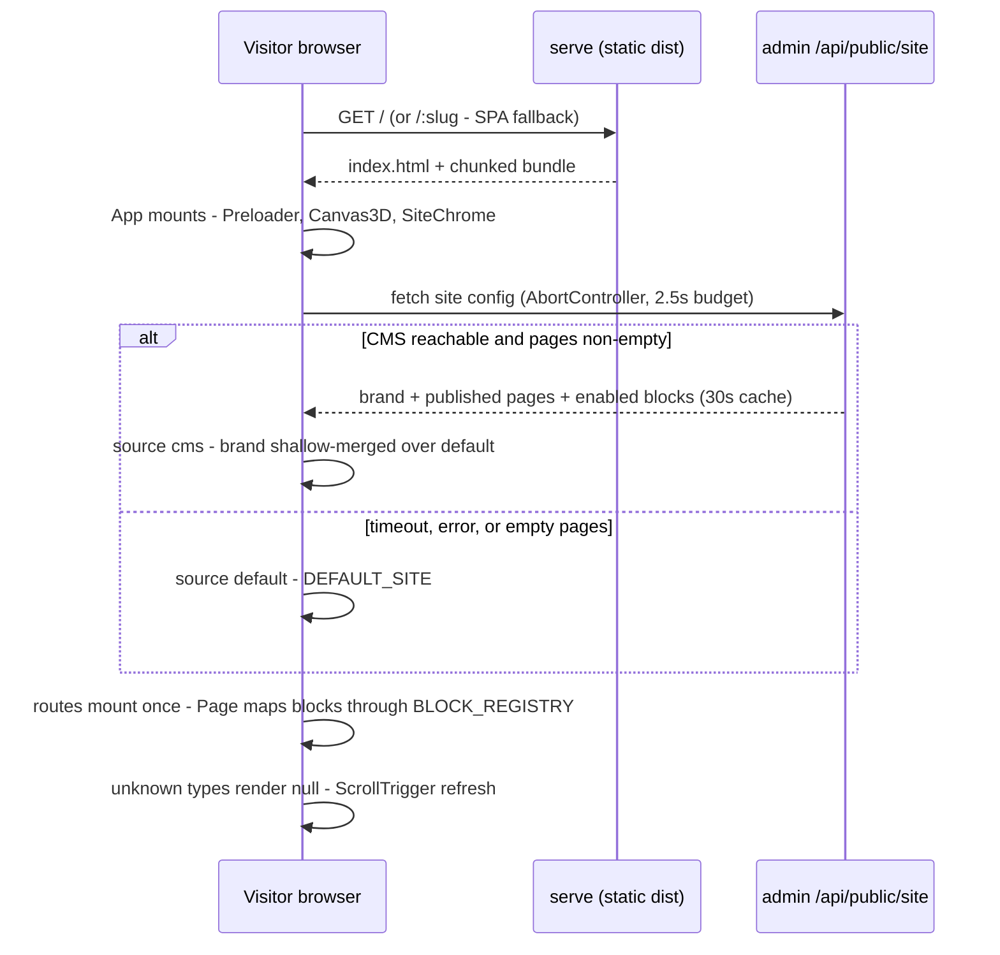
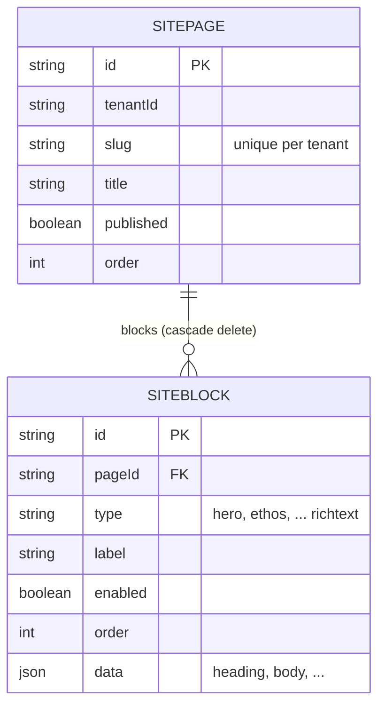
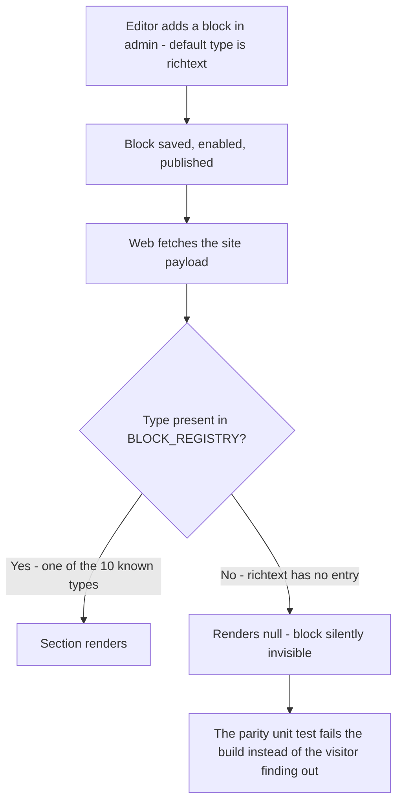
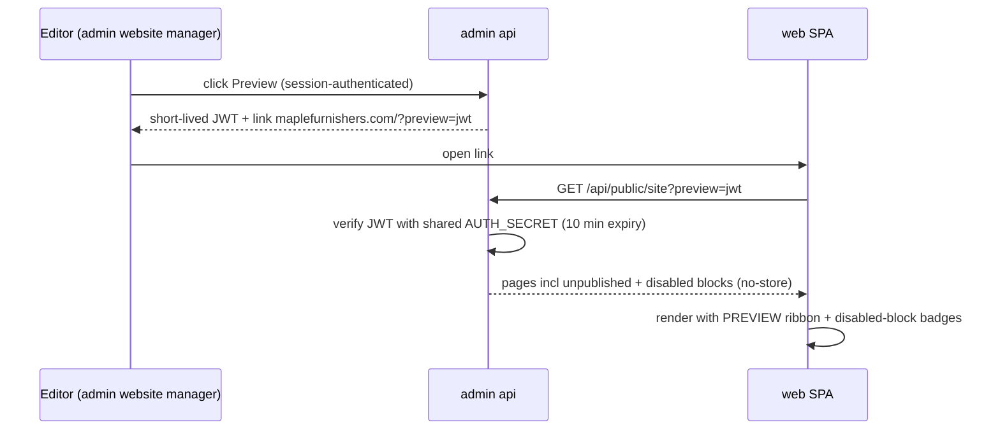
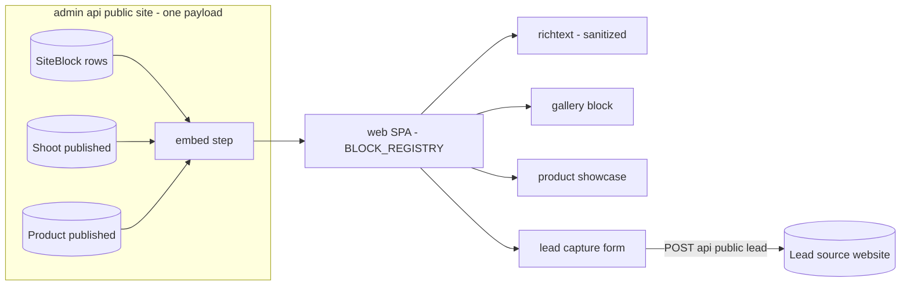
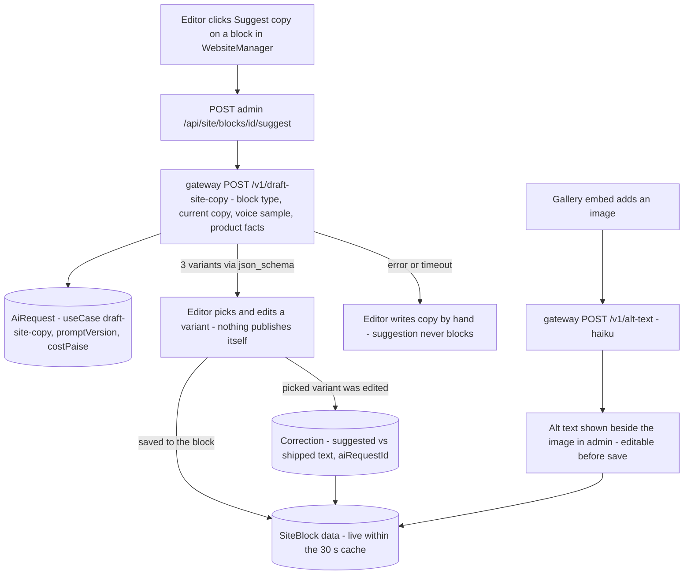

# Web — engineering bible

The public marketing site: a 3D scroll experience (React Three Fiber + GSAP) whose sections and copy are driven by the admin site CMS at runtime, with a built-in static fallback. The only non-Next.js app in the suite — a Vite SPA. Designed here to grow into the suite's **publishing surface**: a page builder v2 with a complete block registry (including the missing richtext renderer), gallery/product/lead-capture blocks fed by other modules, real SEO, and per-tenant white-label sites on customer domains.

**Status:** `apps/web` · apex **maplefurnishers.com** (+ `www`) · dev **:5173 (Vite)** · prod container `web` runs `serve -s apps/web/dist -l 3000` (SPA fallback), Caddy proxies the apex to it.

## For managers — plain-language guide

This is the public website customers see — the scrolling 3D showroom at maplefurnishers.com. Its words are yours to change: headings and paragraphs live in the admin tool's Website section, and edits appear on the live site within about half a minute, no developer needed. Its *pictures* mostly are not, yet: the hero is a built-in 3D scene, so updating the hero visual is a developer change today — the (planned) gallery and product blocks are what will let photos flow in from your photoshoot and catalog tools. The site is also built to never go blank: if the admin system is down or slow, visitors silently get a built-in copy of the page. Two honest warts a manager should know: the "Rich text" block — the *first option offered* when adding content in admin — currently doesn't show on the live site at all, and the built-in emergency copy has drifted from the real page (sections appear in a different order during outages).

| Feature | What it means in your day | Who uses it |
| --- | --- | --- |
| 3D scroll experience | Furniture models rotate and assemble as visitors scroll — the wow factor is built into the site itself, always on. | Every visitor |
| Edit copy from admin | Change a section's heading or paragraph in admin's Website manager; the live site picks it up within ~30 seconds on the next page load. | Whoever owns marketing copy |
| Add or reorder pages | Create a page with its own address (like /workshop), publish it, add blocks — no developer, no rebuild. It won't appear in the menu yet (that's hard-wired). | Marketing/admin |
| Never-blank fallback | If the admin system is down, visitors see a built-in copy of the site rather than an error — most outages are invisible to customers. | Nobody has to do anything |
| Rich text block doesn't render (known issue) | That block type saves fine in admin but is silently invisible on the live site — don't use it until fixed; you'll think your edit vanished. | Anyone editing the site |
| Fallback order drift (known issue) | The emergency copy shows sections in a different order than the CMS-driven page — visitors during an outage see a slightly rearranged site. | Nobody day-to-day; fix pending |
| Rich text renderer (planned) | Free-form formatted text (headings, lists, links) becomes a real block on the live site — the most flexible way to add a story or announcement. | Marketing |
| Photo gallery block (planned) | Pick published shoots from the Photoshoot tool and a gallery appears on the site — updating imagery finally becomes a content edit, not a developer task. | Marketing |
| Product showcase block (planned) | Published products from the catalog render as a grid, prices shown or hidden per block. | Marketing/sales |
| Enquiry form block (planned) | "Interested in the dining table" + name + phone lands directly in your Leads tool as a website lead — the site starts feeding the sales funnel. | Visitors write, sales reads |
| Preview before publish (planned) | See a draft page on the real 3D site via a private link before customers can — today the only way to check a block is to publish it live. | Marketing |
| Search and share visibility (planned) | Each page gets its own title, description and share image — so a WhatsApp/LinkedIn share shows a proper card instead of a generic one, and Google reads each page properly. | Automatic once set per page |
| Client-branded sites (planned) | The same site engine serves a client's own domain with their logo, colours and pages. | White-label tenants |

**Signs it's working:**

- A copy edit in admin is visible on the live site within a minute — check on your phone after saving.
- The site loads and scrolls even when someone reports "admin is down" — customers never see the outage.
- Every block you add in admin actually appears on the live page (if one doesn't, you've hit the rich-text gap — report it, don't retype).

---

## Part A — for implementers

### A1 What exists today

- A Vite + React 19 single-page app: Three.js scenes (`src/experience/`: chair/sofa/table models, turntables, exploding assembly), GSAP + Lenis smooth scrolling, `react-router-dom` routes `/` and `/:slug`.
- **Content comes from the admin CMS, fetched client-side at runtime.** `src/site/api.ts` calls `GET {admin}/api/public/site` — base URL priority: `VITE_SITE_API` if set → `http://localhost:3001` on localhost/`.local` hosts → `https://admin.<registrable-domain>` derived from the current host. The endpoint is public with CORS `*` and a 30 s cache header ([module-admin.md](module-admin.html)).
- `src/site/useSiteConfig.ts` races that fetch against a **2.5 s timeout** (`AbortController`); on success with non-empty pages (`source: 'cms'`) brand + pages come from the DB (brand shallow-merged over the default), on any failure it keeps `DEFAULT_SITE` (`src/site/defaultSite.ts`). The site therefore always renders, even with the backend down. `App.tsx` mounts routes only after the config resolves, so sections mount exactly once.
- `src/site/blocks.tsx` maps CMS block `type` strings to section components — `BLOCK_REGISTRY`: `hero, ethos, craft, anatomy, materials, collection, sofa, table, process, visit` (10 types). Sections with editable copy read `heading`/`body` from block `data` via the `str()` helper; **unknown types render nothing** (`Page.tsx` returns `null` for unregistered types).
- **The richtext hole (verified):** admin's `BLOCK_TYPES` (`apps/admin/app/website/WebsiteManager.tsx`) offers 11 types — the 10 above **plus `richtext`**, which is also the *default* selection when adding a block. `BLOCK_REGISTRY` has no `richtext` entry, so the most-suggested block in the CMS silently disappears on the live site.
- **Fallback drift (verified):** `DEFAULT_SITE`'s block order is `hero, ethos, craft, anatomy, materials, collection, sofa, table, process, visit`, but `seed.mjs` seeds `hero, ethos, craft, materials, process, anatomy, sofa, table, collection, visit` — the comment says "keep in sync" and they already aren't. CMS-down visitors see a differently-ordered page than seeded-CMS visitors.
- Completely unauthenticated and stateless: no middleware, no session, no direct DB access, no Prisma models. SEO surface today is only the static `index.html` (one `<meta name="description">`, a static `<title>`, Google-Fonts preconnects) — identical for every route and every tenant.

### A2 File-by-file and the main lifecycle

| Piece | Path | Notes |
| --- | --- | --- |
| App shell + routing | `src/App.tsx` | `useSiteConfig()`, smooth-scroll init, `Preloader`/`Canvas3D`/`SiteChrome` persistent chrome, routes mount after config resolves |
| CMS fetch | `src/site/api.ts` | `apiBase()` resolution (env → localhost → `admin.<domain>`), `fetchSiteConfig()` returns `null` on any failure |
| Config hook | `src/site/useSiteConfig.ts` | 2.5 s `AbortController` timeout, `source: 'cms' \| 'default'`, brand merge |
| Types + payload contract | `src/site/types.ts` | `SiteConfig { brand, pages[] }`, `SiteBlock { type, label?, data?, order? }`, `str()` data reader |
| Block registry | `src/site/blocks.tsx` | `BLOCK_REGISTRY: Record<string, ComponentType<BlockProps>>` — the single extension point |
| Fallback content | `src/site/defaultSite.ts` | Hard-coded home page; manual-sync comment to `seed.mjs` (currently drifted, see A1) |
| Page renderer | `src/pages/Page.tsx` | Slug → page (fallback to `home` → first page), maps blocks through the registry, `ScrollTrigger.refresh()` after mount |
| 3D experience | `src/experience/**` | R3F canvas, scenes, zustand store |
| Sections | `src/sections/**`, `src/components/Hero.tsx` | Scroll-driven marketing sections — the registry's targets |
| Build config | `vite.config.ts` | Tailwind v4 plugin, `allowedHosts` for local Caddy, manual chunks: `three` (three/fiber/drei) and `animation` (gsap/lenis/motion) |

Lifecycle, end to end:



Content edits in admin appear within ~30 s (endpoint cache) on the next page load — no rebuild, no webhook. Note the asymmetry the timeout creates: a *slow* CMS (>2.5 s) is treated identically to a *down* CMS, so visitors on bad connections may see fallback content even while the CMS is healthy — an argument for the `localStorage` last-good cache in B3.4.

### A3 Data model and API surface

**The web app owns no Prisma models.** Its content lives in admin's tables — shown here because they *are* this module's data model, one hop removed:



The app exposes **no API routes** — `serve` ships static files only. It consumes exactly one endpoint:

| Consumed endpoint | Method | Auth | Notes |
| --- | --- | --- | --- |
| `{admin}/api/public/site` | GET | None (public, CORS `*`, `max-age=30`) | `{ brand, pages[] }` — published pages, enabled blocks, both ordered; tenant resolved server-side from the request `Host` via `currentTenant()` |

### A4 Config reference

| Variable / knob | Where | Effect |
| --- | --- | --- |
| `VITE_SITE_API` | `.env.local` (build/dev-time) | Overrides CMS base URL; unset → localhost/domain heuristics in `api.ts` |
| `FETCH_TIMEOUT_MS = 2500` | `useSiteConfig.ts` constant | The CMS race budget — change in code only |
| `serve -s apps/web/dist -l 3000` | `docker-compose.yml` service `web` | `-s` = SPA fallback so `/:slug` deep-links resolve |
| Manual chunks | `vite.config.ts` | Keeps three.js + animation libs out of the main bundle |
| Port `:5173` | dev | `npm run dev -w @maple/app-web`; build: `npm run build -w @maple/app-web` (`tsc -b && vite build`) |

No secrets of any kind — this bundle is fully public.

### A5 Recipes

- **Add a block type (today's registry).** Build the section component taking `BlockProps` (`data?: BlockData`), read copy with `str(data, "heading")`, register it in `BLOCK_REGISTRY`, add the type string to admin's `BLOCK_TYPES`, and add a `DEFAULT_SITE` entry if it should survive CMS outages. Both sides or it's a silent no-op — that asymmetry is exactly the richtext bug.
- **Re-sync the fallback.** Fix `defaultSite.ts` to the seed order now (A1 drift); structurally, generate one from the other — a small script exporting `seed.mjs`'s block array as JSON imported by both is enough to make drift impossible.
- **Test the config seam.** `useSiteConfig` + `Page` slug resolution are pure enough for vitest: mock `fetch` to (a) resolve valid config, (b) resolve empty pages, (c) hang past 2.5 s — assert `source` and rendered block set. This is the highest-value test in the app.
- **Debug "my edit doesn't show".** Checklist: block `enabled`? page `published`? within the 30 s cache window? type present in `BLOCK_REGISTRY`? (richtext → invisible today); browser actually reaching `admin.<domain>` (CORS/network tab)?
- **Point dev web at prod CMS (careful).** `VITE_SITE_API=https://admin.maplefurnishers.com npm run dev -w @maple/app-web` — read-only and safe (the endpoint is public GET), useful for reproducing content-shape bugs against real data.
- **Add a page (not just a block).** Create the `SitePage` in admin with a slug, publish it, add blocks — the SPA needs no change: `/:slug` routing and the `Page` fallback chain already handle any slug the payload carries. What it does *not* get is a nav entry (`SiteChrome` is hard-coded) — nav-from-CMS is a small, worthwhile follow-up: derive it from `pages[].title` + `slug` for pages flagged `data.inNav`.

**Testing notes (none exist — what to write first):** the `useSiteConfig` race (valid config / empty pages / hang past 2.5 s → assert `source` and rendered blocks), `Page` slug resolution (unknown slug → home → first page → null), registry coverage vs admin's `BLOCK_TYPES` (the parity test in B1 — would have caught richtext), and `str()`'s trim/empty handling. All pure or fetch-mockable; vitest with jsdom, no 3D rendering needed (stub the registry with marker divs).

---

## Testing — how we verify this module

**Honest current state: zero tests.** `apps/web` has no test files, no vitest config, no CI step — verified by search. This is the suite's most public surface and its correctness currently rests on manual eyeballing. The good news: A5's testing notes are right that the load-bearing logic (`useSiteConfig`, `Page`, `str()`, the registry) is pure or fetch-mockable — no 3D rendering needed to cover it (stub the registry with marker divs).

**Unit targets:**

- **`DEFAULT_SITE` fallback — the flagship case.** Mock `fetch` three ways against `useSiteConfig`: (a) valid config → `source: 'cms'`, brand shallow-merged; (b) resolves but `pages` empty → `source: 'default'`; (c) hangs past the 2.5 s `AbortController` budget → `source: 'default'` without an unhandled rejection. The site's whole "never blank" promise lives in this hook.
- **Block-registry parity check.** A test that diffs admin's `BLOCK_TYPES` against web's `BLOCK_REGISTRY` keys and fails on any mismatch — run today it fails on exactly `richtext`, which is the point: this one unit test would have caught the module's most visible bug before any visitor did. Becomes trivial once the shared descriptor list (B1) exists; write it against the two hard-coded arrays now anyway.
- **`Page` slug resolution + `str()`.** Unknown slug → `home` → first page → null chain; `str()`'s trim/empty handling.
- **Fallback/seed sync.** Assert `DEFAULT_SITE`'s block order equals the seed's — fails today (A1 drift), red until the re-sync lands, then permanent drift protection.



**Integration / E2E cases — known gaps as named regressions:**

| Case name | Scenario | Asserts | Today |
| --- | --- | --- | --- |
| `richtext-disappears` | Published richtext block in the payload | Renders sanitized content (post-B3.1) | **Fails** — renders nothing |
| `fallback-order-drift` | Compare `defaultSite.ts` order to `seed.mjs` order | Identical block sequence | **Fails** — drifted (A1) |
| `cms-slow-fallback` | Admin responds in 3 s (healthy but slow) | Fallback renders; documents the >2.5 s asymmetry until the `localStorage` last-good tier (B3.4) lands | Passes as designed — pins the trade-off |
| `unknown-type-null` | Payload carries an unregistered type | Page renders, that block absent, no crash | Passes — pin it |
| `preview-token` (B1) | Expired/forged preview JWT | Public payload only, no unpublished leak | Written with the preview flow |

**The visual/E2E story (the one browser test worth having):** with the admin container stopped, load the site in Playwright — assert the page reaches interactive within the fallback budget, `DEFAULT_SITE`'s hero heading is visible, every fallback section is present in order, and a screenshot diff stays stable. This single scenario exercises the timeout, the fallback content, SPA routing under `serve -s`, and the "outage is invisible to visitors" promise — the exact thing nobody ever tests manually because it requires breaking something.

**Definition of done:** the parity check and fallback-race tests run in CI on every PR (they're pure vitest — seconds); the richtext fix merges only alongside the parity test that prevents its recurrence; the admin-down E2E runs at least on release branches; no new block type ships without registry entry + descriptor + a render smoke test in the same PR.

---

## Part B — for architects

### B1 The content contract with admin CMS

The contract has three legs today — payload shape (`types.ts`, mirrored by admin's `/api/public/site` select), type registry parity, and the fallback. Only the first is enforced by anything (TypeScript on one side). The designed contract tightens the other two:

**Registry parity.** Admin's `BLOCK_TYPES` and web's `BLOCK_REGISTRY` must be the same set, and today they differ by exactly `richtext` (A1). Fix structurally: a shared `packages/core/src/lib/site-blocks.ts` exporting `BLOCK_TYPES` with per-type `data` field descriptors (name, kind: `text | richtext | ref`, required) — admin renders its add-block select *and* its block editor form from it; web asserts at build time that `BLOCK_REGISTRY` covers it (a vitest that diffs the two sets — cheap, permanent). The richtext renderer itself is B3.1.

**Preview flow (missing today).** Editors currently publish blind — the only way to see a block on the real 3D site is to enable it in production. Design: admin gains `GET /api/public/site?preview=<token>` where the token is a short-lived JWT signed with the shared `AUTH_SECRET`, minted by a "Preview" button in the website manager; with a valid token the endpoint returns unpublished pages and disabled blocks (flagged `enabled: false` so web can badge them). Web reads `?preview=` from its own URL, forwards it, and renders a fixed "PREVIEW" ribbon when `source: 'cms'` + preview mode. No iframe/postMessage machinery — the CMS's 30 s cache is bypassed for preview responses (`Cache-Control: no-store`). This reuses the suite's existing share-token idiom (photoshoot/collections `shareToken`) rather than inventing a draft-content pipeline.



**Fallback governance.** `DEFAULT_SITE` is a *brand asset* (it is what visitors see during incidents) — treat changes to it like copy changes, and keep it generated from the seed (A5 recipe) so there is one authored source.

### B2 Infrastructure — both tracks

**Track 1 — one box (today).** `vite build` output served by `serve -s` in the shared image (`APP=web` service overrides the command), Caddy terminates TLS for the apex and `www`. Adequate indefinitely for one tenant; the only fragility is that the compose file defines no health check — a static server needs only `wget -qO- localhost:3000/ > /dev/null` as `healthcheck`, worth adding now.

**Track 2 — AWS.** This app is the one suite member that should *not* be a container long-term: `dist/` goes to **S3 + CloudFront** (the CDN already planned for photoshoot galleries in [aws-deployment.md](aws-deployment.html) §2), with CloudFront function rewriting extensionless paths to `/index.html` for the SPA fallback. Deploy = `aws s3 sync` + cache invalidation in the existing GitHub Actions pipeline — cheaper and more robust than a container. The CMS fetch is unaffected (it targets `admin.<domain>` cross-origin either way). White-label domains (B3.4) attach as CloudFront alternate domain names with ACM certs — or stay on the Caddy box with on-demand TLS while tenant count is small; both resolve tenants identically because resolution is Host-header-driven on the *admin* side.

**Failure modes, both tracks** (this app's design makes most of them invisible to visitors — know which are which):

| Failure | Visitor impact | Detection |
| --- | --- | --- |
| admin down / DB down | None visible — `DEFAULT_SITE` renders (drifted order, A1) | admin's own health alarm; web needs no alert |
| admin slow (> 2.5 s) | Same as down — fallback content despite healthy CMS | latency alarm on `/api/public/site` |
| CORS misconfig after admin change | Fallback content, silently | the parity/config test in A5 plus a synthetic browser check |
| `serve` container dead | Full outage — the one real failure | the missing compose healthcheck (B2 Track 1) + UptimeRobot on the apex |
| stale bundle after deploy | Old sections until cache clears | version-stamp `index.html` (build hash in a meta tag) and check it in the synthetic probe |
| unknown block type shipped | That block invisible, page otherwise fine | the "not rendered on site" badge in admin (B3.3) |

### B3 Designed enhancements

#### B3.1 Page builder v2 — completing and extending the block registry

Four blocks, each with its full data contract. All follow the existing pattern: dumb section component + `data` payload + registry entry + shared descriptor (B1).

Per-block `data` contracts at a glance (the shared descriptor list of B1, in table form):

| Block type | `data` fields (in) | Embedded by admin (out) | Renderer notes |
| --- | --- | --- | --- |
| `richtext` | `html: string` | — | sanitize at render (below) |
| `gallery` | `title?`, `shootIds?: string[]`, `limit?` | `items: [{ posterUrl, videoUrl?, title }]` | scroll-snap strip |
| `products` | `title?`, `category?`, `productIds?`, `limit?`, `showPrice?` | `items: [{ name, imageUrl, price?, material? }]` | collection grid |
| `leadform` | `heading?`, `buttonLabel?`, `successMessage?` | — | posts to admin public lead endpoint |
| existing 10 | `heading?`, `body?` (where the section reads them) | — | unchanged |

**Richtext renderer (the fix).** Admin stores editor HTML in `data.html`. Web renders it inside the site's typography wrapper — but **sanitized**: the CMS is authenticated, yet its output crosses into an unauthenticated public page, so treat it as untrusted at the boundary (a compromised admin session must not become stored XSS on the marketing site).

```tsx
// src/sections/RichText.tsx — then BLOCK_REGISTRY.richtext = RichText
import DOMPurify from 'dompurify'
import { str, type BlockProps } from '../site/types'
export default function RichText({ data }: BlockProps) {
  const html = str(data, 'html')
  if (!html) return null
  const clean = DOMPurify.sanitize(html, {
    ALLOWED_TAGS: ['p','h2','h3','ul','ol','li','strong','em','a','blockquote','br'],
    ALLOWED_ATTR: ['href'],
  })
  return (
    <section className="mx-auto max-w-[68ch] px-6 py-24 font-serif leading-relaxed">
      <div dangerouslySetInnerHTML={{ __html: clean }} />
    </section>
  )
}
```

Anchors additionally get `rel="noopener"` via a DOMPurify hook; `target` is stripped by the attribute allowlist. Until admin grows a real WYSIWYG, `data.html` written through a textarea is acceptable — the renderer contract doesn't change when the editor improves.

**Gallery block ← photoshoot.** `Shoot` already has `published` + `shareToken` ([module-photoshoot.md](module-photoshoot.html)). Contract: block `data = { title?, shootIds?: string[], limit?: number }`; admin's `/api/public/site` **embeds** the media descriptors into the block data at read time (join on published shoots, emit `{ items: [{ posterUrl, videoUrl?, title }] }`) so the SPA still makes exactly one request and unpublishing a shoot drops it from the payload within the 30 s cache. Web renders a scroll-snap gallery consistent with the existing sections; no direct web→photoshoot coupling is created.

**Product showcase ← product master.** Same embedding pattern from `Product` (`published: true` rows — the flag exists in the schema today): block `data = { title?, category?, productIds?: string[], limit? }` → admin embeds `{ items: [{ name, imageUrl, price?, material? }] }` (price included only when `data.showPrice` — a showroom site often hides rates). Renders as the collection grid the site already has, but CMS-driven instead of hard-coded in `src/content/`.

**Lead-capture form block → leads module.** The one write path this app will ever have. `apps/leads`' API is session-gated, so the public entry point lives on admin beside the site endpoint ([module-leads.md](module-leads.html)):

```jsonc
// POST {admin}/api/public/lead        (CORS mirror of /api/public/site)
{ "name": "R. Mehta", "phone": "98110xxxxx", "email": "",         // email optional
  "message": "Interested in the dining table", "pageSlug": "home",
  "website": "" }                       // honeypot - non-empty means drop silently
// 200 { "ok": true }                   — also returned for honeypot drops (indistinguishable to bots)
// 400 { "error": "name and phone required" }
// 429 { "error": "too many requests" } — per-IP limit, e.g. 5/hour
```

Server side: creates a `Lead` with `source: "website"` and `note` = message + page. Abuse controls carry the whole load because the bundle is public (no shared secret is possible): rate limit, honeypot, length caps (name ≤ 100, message ≤ 1000), and a drop-if-URL-in-name heuristic. Block `data = { heading?, buttonLabel?, successMessage? }`; the component posts, shows the success state inline, never redirects. This closes the loop the platform plan wants: the marketing site becomes a lead source feeding the CRM funnel.



#### B3.2 SEO

Facts first: Googlebot renders JavaScript (with a rendering-queue delay), but **social/link-preview crawlers do not** — OG tags injected by React never affect a WhatsApp or LinkedIn share, which for a furniture studio is the channel that matters. And every route currently serves one identical `index.html`. Layered design, cheapest first:

1. **CMS-driven meta, client-side.** Add `seo { title?, description?, ogImageUrl? }` to `SitePage` (admin edit UI) and pass through the public payload; web sets `document.title` + meta via a small effect (or `react-helmet-async`). Fixes the Google-visible layer and in-app correctness. 
2. **Build-time prerender for the crawler layer.** A post-build script fetches `/api/public/site` and stamps each published slug's *HTML shell* — no headless browser required, because the shell only needs head tags, not rendered sections:

```js
// scripts/prerender.mjs — runs after vite build in CI
const { pages, brand } = await (await fetch(`${SITE_API}/api/public/site`)).json()
const template = await readFile('dist/index.html', 'utf8')
for (const p of pages) {
  const head = [
    `<title>${esc(p.seo?.title ?? `${p.title} | ${brand.name}`)}</title>`,
    `<meta name="description" content="${esc(p.seo?.description ?? '')}">`,
    `<meta property="og:title" content="${esc(p.seo?.title ?? p.title)}">`,
    `<meta property="og:image" content="${esc(p.seo?.ogImageUrl ?? DEFAULT_OG)}">`,
    `<link rel="canonical" href="https://${DOMAIN}/${p.slug === 'home' ? '' : p.slug}">`,
  ].join('\n')
  await writeShell(`dist/${p.slug === 'home' ? '' : p.slug + '/'}index.html`,
    template.replace(/<title>.*<\/title>/s, head))
}
```

The SPA hydrates over the shell unchanged. Content edits still appear live via the runtime fetch; only the meta shell is build-frozen, so wire an admin "Publish site" button to the existing GitHub Actions deploy (repository-dispatch) for meta-affecting changes.
3. **`sitemap.xml` + `robots.txt`.** Generated by the same post-build step from published slugs (`<lastmod>` from `SitePage.updatedAt`); `robots.txt` allows all + points at the sitemap.
4. **Structured data.** One JSON-LD `LocalBusiness`/`FurnitureStore` block (name, address — the Kirti Nagar address already lives in the visit block data — geo, hours) on the home shell; `Product` JSON-LD on showcase items when B3.1 lands.

Explicitly rejected: migrating the app to Next.js for SSR — the 3D experience gains nothing from server rendering, and the prerender shell captures ~all of the SEO value at ~none of the migration cost.

#### B3.3 Page builder v2 — authoring quality of life

Small, high-leverage admin-side items that complete v2 (they live in admin but exist to serve this app, so they're specified here): block-level preview (B1's token flow), drag-to-reorder writing `order`, per-block `data` forms generated from the shared descriptors (B1) instead of raw JSON textareas, and a "not rendered on site" warning badge computed by diffing the page's types against the shared registry list — the UI guardrail that would have caught richtext.

#### B3.4 Per-tenant white-label sites

The goal: `interiorclient.com` serves this same SPA with that tenant's brand and pages. The full request walk-through lives in [seq-whitelabel-request.md](seq-whitelabel-request.html); the mechanics mostly exist — what's missing is serving + brand application:

- **Resolution (exists).** `api.ts` derives `admin.<registrable-domain>` from the host, and admin's `currentTenant()` resolves the tenant from the `Host` header exactly like `getBrand()` does for the tool apps ([module-admin.md](module-admin.html)) — so a request from `interiorclient.com` hits `admin.interiorclient.com/api/public/site` and gets *that tenant's* pages, today. The `Tenant.domain` column is the lookup key.
- **Serving (to build).** Track 1: Caddy `on_demand_tls` block so any CNAME'd customer domain gets a cert + proxy to the same `web` container — one config stanza, zero per-tenant deploys. Track 2: CloudFront alternate domains + ACM. Also proxy `admin.<customer-domain>` (at minimum `/api/public/*`) so the API derivation resolves — or teach the payload to carry an explicit `apiBase` override.
- **Brand application (to build).** The payload already carries `brand { name, logoUrl, primaryColor }` but the SPA barely uses it: apply `primaryColor` to the CSS custom properties at config-resolve time, swap logo/name in `SiteChrome`, and make `DEFAULT_SITE` tenant-neutral (no "Maple Furnishers" hero copy on a stranger's domain — fallback for unknown tenants should be a minimal branded shell, which means the fallback itself needs the brand, so cache the last-good config in `localStorage` keyed by host as the second fallback tier).
- **Content isolation (exists).** Pages/blocks are tenant-scoped rows; nothing new needed.
- Prerender (B3.2) becomes per-tenant: the post-build step loops tenants with `domain` set and emits one shell set per domain — or white-label tenants simply skip layer 2 initially and accept JS-only meta.

### B4 Scaling

A static bundle behind a CDN scales past any furniture company's traffic without thought; the pressure points are payload and origin. (1) The single-payload design means every block addition grows `/api/public/site` — with embedded gallery/product items, cap embeds (`limit` defaults, thumbnail-size URLs) and keep the payload under ~200 KB; if a tenant's site grows past that, split to per-page fetches (`?slug=`) behind the same hook. (2) The 30 s cache on admin is the only origin protection — in front of real traffic, raise to 5 min with the preview flow (B1) as the no-cache path, or let CloudFront cache the API response and invalidate on save. (3) The 3D assets (`public/models`, videos) dwarf everything else — they belong on the CDN with long-lived immutable cache headers, which Track 2 gives for free; the manual chunk split in `vite.config.ts` already keeps the `three` and `animation` chunks stable across content-only deploys, so returning visitors re-download only the small app chunk. (4) `web` is the one app with no DB connection — it never contributes to Postgres load; keep it that way (every dynamic need routes through admin's public endpoints, and the lead endpoint's rate limit protects the one write path). (5) White-label multiplies none of this: N tenant domains share one bundle, one CDN distribution, and one origin endpoint that fans out by Host header — per-tenant cost is a DNS record and a cert.

## AI — use case & pipeline

**Use case: content generation for the CMS — copy variants an editor approves, and alt text every gallery image gets for free.** Two tasks, one boundary rule: the model drafts, the admin CMS save is the human gate, and this app (a public static bundle) never calls the gateway — all AI traffic runs through admin's authenticated routes. Task one: an editor viewing any block in `WebsiteManager` clicks "Suggest copy" and gets three heading/body variants written from the product master's real facts (materials, categories that actually exist) in the site's established voice (the existing sections travel along as the voice sample); the editor picks one, edits it, saves — the normal `SiteBlock` PATCH, live within the 30 s cache. Task two: when the gallery block (B3.1) embeds shoot images, each image gets generated **alt text** — a classic cheap-model task that is simultaneously an accessibility win (screen readers finally get more than a filename) and an SEO win (image search reads it), reviewed inline before save.



| Contract | Detail |
| --- | --- |
| Endpoint | `POST {gateway}/v1/draft-site-copy` (copy variants) · `POST {gateway}/v1/alt-text` (gallery images) — both called from admin route handlers; the web bundle stays keyless and API-less (D3's spirit) |
| Input | copy: block `type`, current `heading`/`body`, 2–3 existing sections as the brand-voice sample, relevant `Product` rows (name, material, category — facts only, the model may not invent specs). Alt text: one downscaled image (≤1000px) + optional product name |
| `json_schema` (structured output, `additionalProperties: false`) | copy: `variants [{heading, body, toneNote}]` (exactly 3, `body` ≤80 words), `flags ["insufficient_facts"]` — a product with no material on file must not gain one. Alt text: `altText` (≤125 chars, no "image of" prefix), `flags ["decorative", "unrecognizable"]` |
| Model + phrase | copy: `sonnet-5` — brand voice is precisely what small models flatten, and a marketing page is the wrong place to find that out. Alt text: `haiku` — describe-what-you-see at one sentence is the textbook cheap-vision task; escalation would be waste |
| ₹/call | copy ≈ ₹1–2 per suggest click (voice sample dominates input tokens); alt text ≈ ₹0.2–0.5 per image — a 30-image gallery backfill is under ₹15 |
| er-platform tables | `AiRequest` (every call) · `Correction` (the picked-then-edited variant, and every touched alt text — the suggested vs shipped diff is exactly the brand-voice dataset) · `Dataset` → someday a voice-tuned `ModelVersion`, but only if suggest-click volume ever justifies it ([er-platform.md](er-platform.html)) |

Boundary rules worth stating once:

- **The human gate is the CMS save, structurally.** Suggestions live in admin UI state until the editor PATCHes the block through the existing guarded routes — there is no "auto-apply", so the public payload can never contain unreviewed model output.
- **Facts in, register out:** the copy prompt carries product-master rows so claims stay checkable ("sheesham and cane" because the row says so); tone comes from the voice sample, not adjectives the model invents.
- **Sanitization is unchanged:** generated copy enters `SiteBlock.data` as plain strings through the same PATCH path as typed copy; the richtext sanitizer (B3.1) applies regardless of who wrote the HTML.
- **`promptVersion`** stamps `draft-site-copy-v1` / `alt-text-v1`; the voice sample's composition versions with the prompt.

**Rollout & eval gate.** Alt text ships **first**, bundled with the gallery block itself (B3.1) — it is cheap, its review cost is one glance, and a backfill over existing published shoots is an immediate accessibility fix; gate: 50 hand-checked images with zero factual errors (wrong furniture named) and `decorative` flag precision ≥ 90%. Copy variants ship second, judged in use by pick-rate (a variant chosen or lightly edited ≥ 50% of clicks after the first month, measured from `Correction` diffs — below that, the prompt isn't earning its button). **Not before:** the gallery/product blocks and shared descriptor list (B1, B3.1) exist — alt text has no home until images flow through the CMS, and copy suggestions for ten hard-coded sections edited a few times a year is a feature nobody would click; the honest trigger for copy variants is a second tenant (white-label, B3.4) whose site an operator has to write from scratch.

### B5 Status — done, left, decisions

**Done ✓**

- Full 3D marketing experience with CMS-driven sections, brand override, and a guaranteed-render fallback (2.5 s timeout + `DEFAULT_SITE`).
- Correct SPA production serving (`serve -s` fallback) and dev/prod CMS endpoint resolution without config.
- Chunk-split builds keeping three.js and animation libraries out of the main bundle.

**Left ◻**

- **`richtext` blocks are creatable in admin (and are the default add-block type) but not renderable here** — `BLOCK_REGISTRY` has no entry, so they silently disappear. Fix per B3.1; prevent recurrence with the shared descriptor list + parity test (B1).
- `DEFAULT_SITE` ↔ `seed.mjs` sync is manual **and currently drifted** (block order differs — A1). Re-sync now, generate from one source next.
- Client-only fetch means crawlers that skip JS see an empty shell and social previews are static — B3.2 layers 1–3.
- No compose health check for the `web` service; no tests for the site-config/registry logic (A5 has the highest-value cases).
- Part B build-out order: richtext + parity test → SEO layer 1 → lead-capture block → gallery/product blocks → prerender + sitemap → preview flow → white-label serving.

**Decisions**

| # | Decision | Direction |
| --- | --- | --- |
| D1 | SSR migration | No. Stay a Vite SPA; capture SEO with build-time prerendered shells + runtime hydration (B3.2). |
| D2 | Module data in blocks | Admin embeds published shoot/product data into the single site payload; the SPA never calls other modules directly. |
| D3 | Public writes | Exactly one: `POST {admin}/api/public/lead` with rate limit + honeypot. The web app itself stays API-less. |
| D4 | White-label fallback | `DEFAULT_SITE` becomes tenant-neutral; last-good config cached per host in `localStorage` as the intermediate fallback tier. |
| D5 | Registry governance | Shared block descriptor list in `@maple/core`; admin forms and web parity test both derive from it. |
