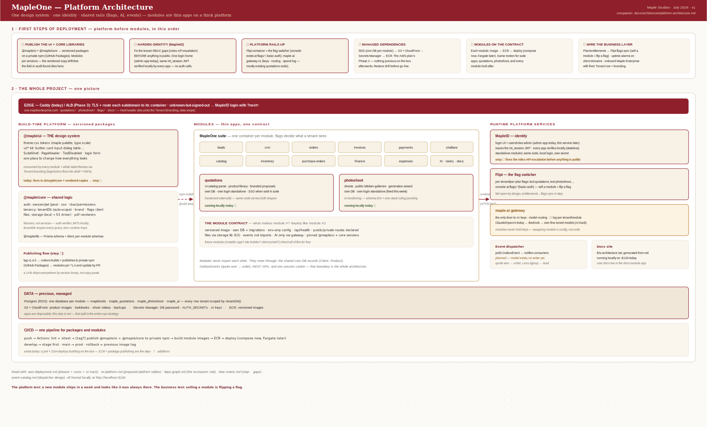

# Platform architecture — one design system, one identity, shared rails

The whole project on one canvas: build-time platform (the `@maple/ui` design system + `@maple/core` libraries, published as versioned packages), the modules that consume them under one contract, and the runtime services every module leans on — MapleID (identity), Flipt (the flag switcher), the maple-ai gateway, and the event dispatcher. The numbered strip across the top is the deployment order: **platform before modules.**

*Click the diagram for the zoomable viewer (scroll to zoom, drag to pan).*

## The first steps, expanded

1. **Publish the UI + core libraries.** `@maple/ui` (theme tokens, ui kit, SuiteShell, login form) and `@maple/core` (auth/session, rbac, tenantDb, brand, flags client, storage, pdf) become versioned packages on a private npm registry (GitHub Packages — free with the org). Modules pin `^1.x` and update by PR. This kills the vendored-copy drift the fold-in audit documented (brand.ts, utils.ts, tenant-db.ts had all silently diverged).
2. **Harden identity (MapleID).** Fix the known RBAC gaps before anything is public — above all the roles-API escalation (`rbac-matrix.md`, gaps section). Keep the stateless design: one login home issues the `mt_session` JWT; every app verifies locally with the shared secret; standalone modules run the same code with a local login and their own secret.
3. **Platform rails up.** Flipt is the flag switcher — its console already exists (`flags.*`, basic-auth); flags like `tool.quotations` decide per tenant what's on. The maple-ai gateway v1 centralises AI keys, model routing, and the per-tenant spend log (mostly relocating proven quotations code).
4. **Managed dependencies** — RDS (one DB per module), S3 + CloudFront, Secrets Manager, ECR; the restore drill passes before go-live. (Full detail: `aws-deployment.md`.)
5. **Modules deploy on the contract** — versioned image → ECR → compose now, Fargate later; identical motion for suite apps, quotations, photoshoot, and everything after.
6. **Wire the business layer** — plan/entitlements sync into Flipt flags (selling a module = flipping a flag), uptime alarms on client domains, then onboard Maple Enterprise with their Tenant row and branding.

## What exists vs. what's to build

| Piece | Status |
|---|---|
| Design system components + theme | Exists inside `@maple/core` (+ vendored copies) — extraction to `@maple/ui` is step ① |
| JWT auth, RBAC, SSO libs | Exist and proven in three repos — gaps to fix are documented |
| Flipt + flag client + console | Exists (suite compose service) — per-plan sync is step ⑥ |
| maple-ai gateway | To build (v1 ≈ a week; the hard parts already exist in quotations) |
| Event dispatcher | To build (OutboxEvent model exists, no writer yet — `event-catalog.md`) |
| CI/CD | Exists (ci.yml + SSH deploys) — ECR + package publishing are the additions |
| Managed AWS deps | To set up (`aws-deployment.md`, Phase 2) |
