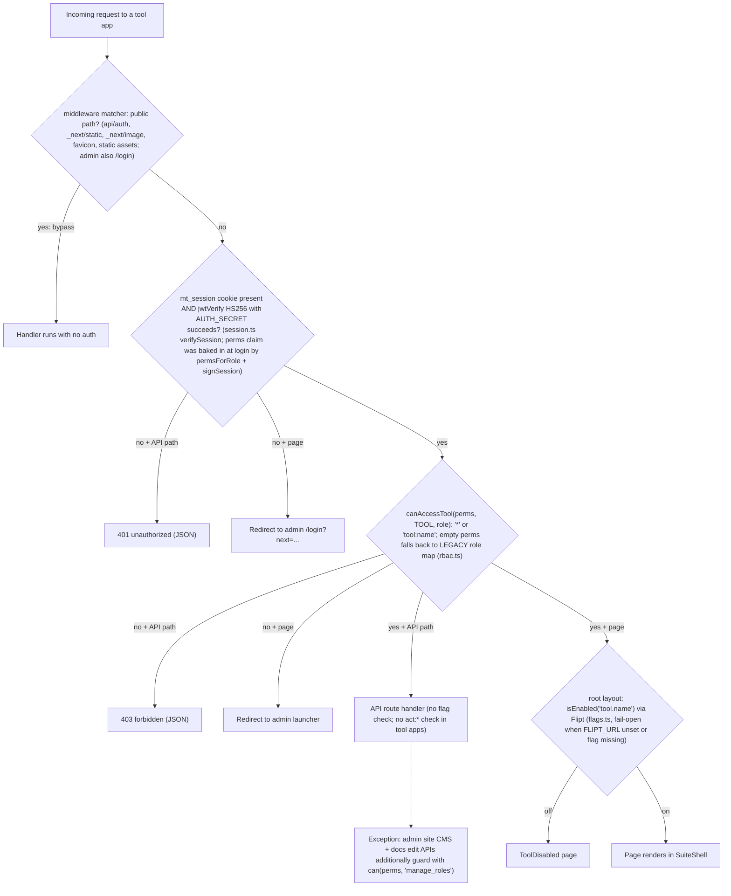

# MapleOne — RBAC & Authorization Reference

Access control lives in `packages/core/src/lib/rbac.ts` (permission keys, `canAccessTool`, `can`), `packages/core/src/lib/permissions.ts` (`permsForRole` — DB lookup at login), `packages/core/src/lib/session.ts` (JWT session, `mt_session` cookie), and `packages/core/src/lib/flags.ts` + `FLAGS.md` (Flipt feature flags). Roles are rows in the `Role` model (`packages/db/prisma/schema.prisma`, `Role` at line 252) holding a `permissions: String[]` array of keys; the four system roles are seeded in `packages/db/prisma/seed.mjs` (lines 13–23). Permission keys take two forms: `tool:<name>` (may this role open a tool?) and `act:<action>` (may it perform a sensitive action?), with `*` meaning everything.

## Roles

| Role name | Label | Source | Permissions |
| --- | --- | --- | --- |
| `admin` | Administrator | seeded, `isSystem` | `*` (wildcard — every tool and action) |
| `sales` | Sales | seeded, `isSystem` | 11 tools + `act:export`, `act:publish` |
| `accounts` | Accounts | seeded, `isSystem` | 8 tools + `act:export` |
| `hr` | HR | seeded, `isSystem` | 2 tools, no actions |

Custom roles can be created per tenant from the Team & access app (`apps/users/app/page.tsx` role editor, `POST apps/users/app/api/roles/route.ts`) with any combination of keys, so this matrix documents the *seeded* baseline, not a fixed universe.

## Permission matrix (seeded roles)

Tools are the launcher entries from `packages/core/src/lib/nav.ts` (`TOOLS`); grants are the seeded `permissions` arrays in `seed.mjs`. Admin's column is entirely via the `*` wildcard.

| Tool (`tool:<name>`) | admin | sales | accounts | hr |
| --- | :-: | :-: | :-: | :-: |
| leads | ✓ | ✓ | – | – |
| crm (Clients) | ✓ | ✓ | ✓ | – |
| tasks | ✓ | ✓ | ✓ | ✓ |
| quotations | ✓ | ✓ | – | – |
| orders | ✓ | ✓ | – | – |
| challans | ✓ | ✓ | – | – |
| invoices | ✓ | ✓ | ✓ | – |
| payments | ✓ | – | ✓ | – |
| catalog | ✓ | ✓ | – | – |
| photoshoot | ✓ | ✓ | – | – |
| inventory | ✓ | ✓ | ✓ | – |
| purchase-orders | ✓ | – | ✓ | – |
| finance | ✓ | – | ✓ | – |
| expenses | ✓ | – | ✓ | – |
| hr | ✓ | – | – | ✓ |
| users (Team & access) | ✓ | – | – | – |
| price-list [^1] | ✓ | ✓ | – | – |

| Action (`act:<action>`) | admin | sales | accounts | hr |
| --- | :-: | :-: | :-: | :-: |
| delete [^2] | ✓ | – | – | – |
| export [^2] | ✓ | ✓ | ✓ | – |
| publish [^2] | ✓ | ✓ | – | – |
| manage_users [^2] | ✓ | – | – | – |
| manage_roles [^3] | ✓ | – | – | – |
| manage_flags [^2] | ✓ | – | – | – |

[^1]: `tool:price-list` is granted to sales in `seed.mjs` and appears in the legacy map (`rbac.ts` line 19), but there is no `apps/price-list` app and it is not in `nav.ts` `TOOLS` — a dormant grant.
[^2]: Defined in `ACTIONS` (`rbac.ts` line 8) and assignable in the role editor, but **no server code currently calls `can(perms, ...)` for this action** — see Gaps below.
[^3]: The only action enforced in code today: admin app pages/APIs (`apps/admin/app/branding/page.tsx`, `apps/admin/app/website/page.tsx`, `apps/admin/app/api/site/**`) and docs edit routes (`apps/docs/app/api/docs/[slug]/route.ts`) guard with `perms.includes("*") || can(perms, "manage_roles")`.

**Legacy fallback:** sessions issued before the permission system carry an empty `perms` array; `canAccessTool` (`rbac.ts` line 35) then falls back to a hard-coded role→tool map (`LEGACY`, line 19) keyed on the JWT's `role` claim, where `admin` passes everything and unknown tools default to *allowed*.

## Authorization path per request

Traced from a tool app's `middleware.ts` (all 17 are identical apart from the `TOOL` constant; `apps/quotations/middleware.ts` used as reference) and its root `app/layout.tsx`. Two things worth knowing that differ from the obvious mental model:

- **Permissions are resolved once, at login.** `apps/admin/app/api/auth/login/route.ts` calls `permsForRole(user.role, user.tenantId)` (line 24) and bakes the resulting array into the JWT (`signSession`, line 25). Per-request middleware never touches the database — it trusts the `perms` claim in the cookie.
- **The feature-flag check runs after middleware, in the page layout only** (`apps/quotations/app/layout.tsx` line 21: `isEnabled("tool.quotations")`). API routes are never flag-gated.

## Gaps (verified in code)

1. **`act:delete` / `act:export` / `act:publish` / `act:manage_users` / `act:manage_flags` are defined but never enforced.** A repo-wide grep for `can(` finds enforcement only for `manage_roles` (admin + docs apps) plus `rbac.test.ts`. Every DELETE handler in the tool apps — e.g. `apps/leads/app/api/leads/[id]/route.ts` line 15 — deletes after only the middleware `tool:<name>` gate, so any role with tool access can delete records regardless of `act:delete`.
2. **The users app APIs have no action-level guard.** `apps/users/app/api/users/route.ts` and `apps/users/app/api/roles/route.ts` rely solely on the middleware `tool:users` check. `POST /api/roles` accepts an arbitrary `permissions` array, so any role granted `tool:users` can create a role containing `*` and escalate to admin. Today only the seeded admin holds `tool:users`, but nothing prevents granting it more widely.
3. **The admin app's middleware verifies the session only** (`apps/admin/middleware.ts` has no `canAccessTool` call); page/API protection inside it is ad hoc `perms.includes("*") || can(perms, "manage_roles")`, and branding/website/site-CMS reuse `manage_roles` instead of a dedicated permission.
4. **Feature flags don't gate API routes.** The `tool.<name>` flag is checked in each app's root layout, so a disabled tool still serves its full API to anyone passing middleware.
5. **Permission changes lag until re-login.** Perms live in a 7-day JWT (`SESSION_MAX_AGE`, `session.ts` line 9); editing a role or deactivating grants has no effect on existing sessions, and there is no revocation mechanism.
6. **The docs app has no middleware at all** — guide pages are publicly readable; only the edit page and write APIs check `manage_roles`. The `web` app is the public site (intentionally unauthenticated).
7. **`permsForRole` drops the tenant filter for null-tenant users.** `permissions.ts` line 6 queries `role.findFirst({ where: { name, tenantId: tenantId ?? undefined } })` — when the user's `tenantId` is null, `undefined` removes the condition entirely, so the lookup matches the *first role of that name in any tenant*. Two tenants defining a custom role with the same name but different permissions would hand a null-tenant user whichever row Postgres returns first. Harmless with today's single seeded tenant; a real cross-tenant grant bug once a second tenant exists.
