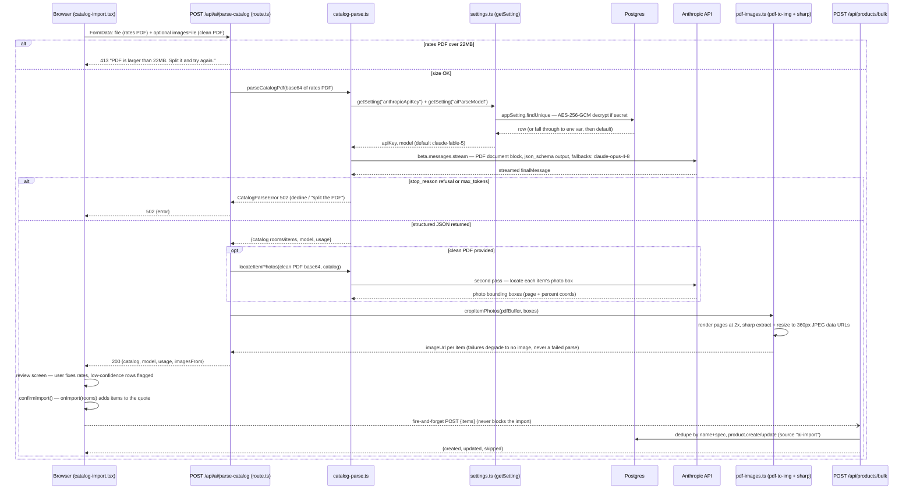

# AI catalog parsing (standalone quotations app)

Traced from `maple-quotations/app/catalog-import.tsx`, `app/api/ai/parse-catalog/route.ts`, `src/lib/catalog-parse.ts`, `src/lib/pdf-images.ts`, `src/lib/settings.ts`, and `app/api/products/bulk/route.ts`. (In the standalone repo the route imports these as `@maple/core/lib/*`, but tsconfig paths alias that to `./src/lib/*`.) The user uploads a rates PDF (scanned, handwritten rates) plus an optional clean client PDF used only for photo crops; both are capped at 22MB because base64 inflation must stay under the API's 32MB request limit. The model and key come from `getSetting()` — encrypted `AppSetting` row first, then env var, then default `claude-fable-5` — and Fable 5 requests opt into the server-side fallback beta so a refusal by the primary model is transparently re-served by `claude-opus-4-8`.

