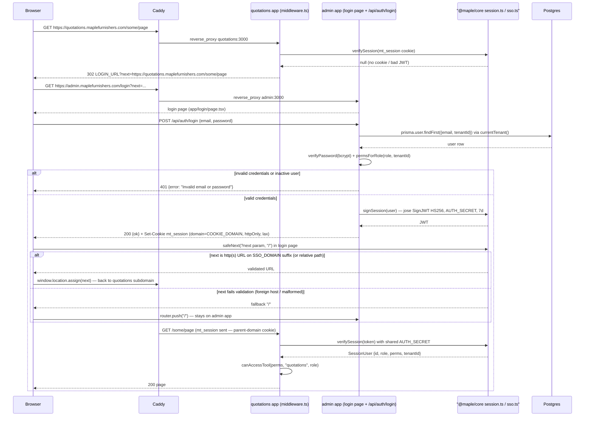

# Cross-subdomain SSO login

Traced from `apps/quotations/middleware.ts`, `apps/admin/app/login/page.tsx`, `apps/admin/app/api/auth/login/route.ts`, and `packages/core/src/lib/{sso.ts,session.ts,auth.ts,permissions.ts}`. The shared login UI and credential endpoint live in the **admin** app (every other app's middleware defaults `LOGIN_URL` to `https://admin.maplefurnishers.com/login`); there is no login route in `apps/users`. SSO is stateless: one `mt_session` JWT (jose, HS256, 7-day expiry) signed with the shared `AUTH_SECRET` and set on the parent domain (`COOKIE_DOMAIN`, e.g. `.maplefurnishers.com`), so any subdomain's middleware can verify it locally with `verifySession()` — no callback to the identity app.

