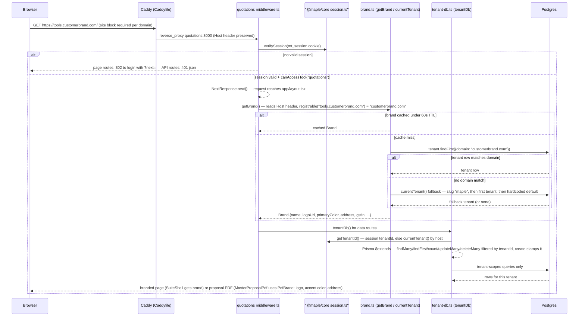

# White-label request resolution

Traced from `maple-suite/Caddyfile`, `packages/core/src/lib/{brand.ts,tenant.ts,tenant-db.ts}`, and the standalone app's `maple-quotations/middleware.ts`, `src/lib/brand.ts`, `app/layout.tsx`, `app/pdf-catalog.tsx`. Branding is resolved per request host: `getBrand()` reads the `Host` header itself (it takes no argument), reduces it to the registrable domain, and looks up `Tenant` by `domain` with a 60s in-process cache — falling back to the `slug: "maple"` tenant, then the first tenant row, then a hardcoded default. Note the committed `Caddyfile` only declares `*.maplefurnishers.com` site blocks, so serving `tools.customerbrand.com` additionally requires adding a site block (the app side is already host-agnostic).

