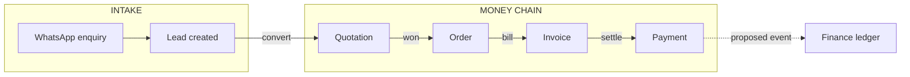
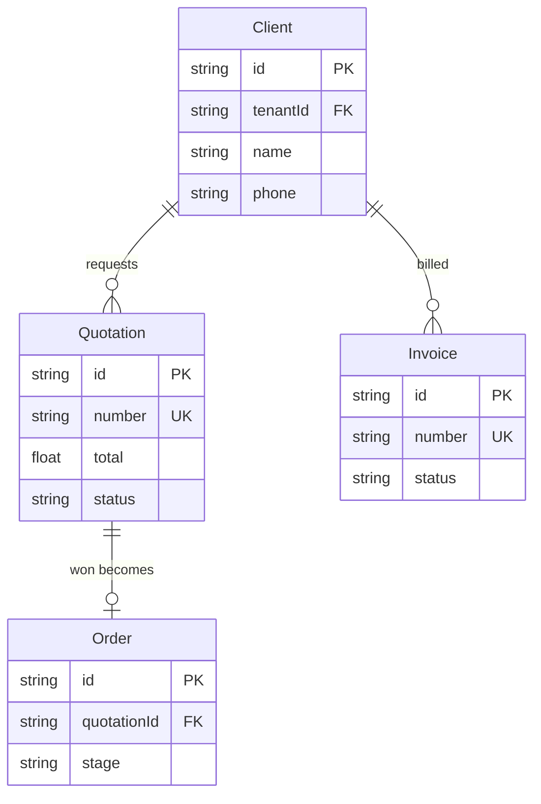
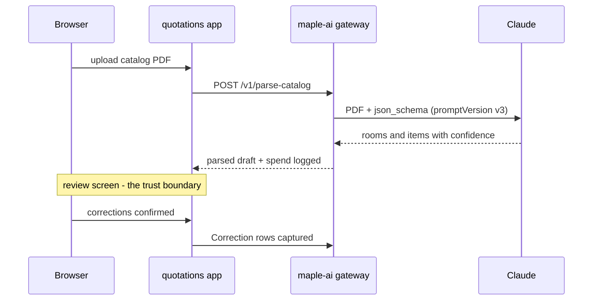

# Diagram style sample

Living reference for the diagram design system — one sample per diagram family, exactly as every page renders them.

```mermaid
flowchart LR
    subgraph intake["INTAKE"]
      A["WhatsApp enquiry"] --> B["Lead created"]
    end
    subgraph money["MONEY CHAIN"]
      C["Quotation"] -->|"won"| D["Order"]
      D -->|"bill"| E["Invoice"]
      E -->|"settle"| F["Payment"]
    end
    B -->|"convert"| C
    F -.->|"proposed event"| G["Finance ledger"]
```

```mermaid
erDiagram
    Client ||--o{ Quotation : "requests"
    Client ||--o{ Invoice : "billed"
    Quotation ||--o| Order : "won becomes"
    Client {
        string id PK
        string tenantId FK
        string name
        string phone
    }
    Quotation {
        string id PK
        string number UK
        float total
        string status
    }
    Order {
        string id PK
        string quotationId FK
        string stage
    }
    Invoice {
        string id PK
        string number UK
        string status
    }
```

```mermaid
sequenceDiagram
    participant B as Browser
    participant Q as quotations app
    participant G as maple-ai gateway
    participant M as Claude

    B->>Q: upload catalog PDF
    Q->>G: POST /v1/parse-catalog
    G->>M: PDF + json_schema (promptVersion v3)
    M-->>G: rooms and items with confidence
    G-->>Q: parsed draft + spend logged
    Note over B,Q: review screen - the trust boundary
    B->>Q: corrections confirmed
    Q->>G: Correction rows captured
```
